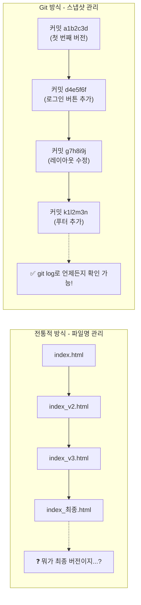
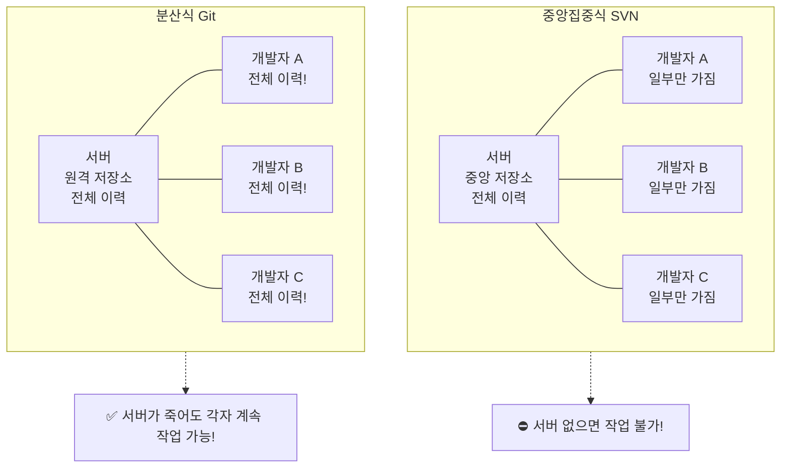

# Git이란 무엇인가요?

Git은 소프트웨어 개발 프로젝트의 **버전 관리 시스템 (Version Control System, VCS)**입니다. 개발자가 코드 변경 이력을 효율적으로 추적하고 관리하며, 여러 사람이 동시에 하나의 프로젝트에서 협업할 수 있도록 돕는 도구입니다.

## 버전 관리 시스템 (VCS)이란?

버전 관리 시스템은 파일의 변경 사항을 시간에 따라 기록하고, 언제든지 이전 버전으로 되돌리거나 특정 시점의 상태를 확인할 수 있게 해줍니다. 과거에는 파일 이름을 `문서_최종.docx`, `문서_진짜최종.docx`, `문서_진짜진짜최종.docx`와 같이 저장하는 방식이 흔했지만, 이는 혼란을 야기하고 변경 이력을 체계적으로 관리하기 어렵게 만들었습니다. VCS는 이러한 문제점을 해결하기 위해 등장했습니다.

**버전 관리 개념 이해하기:**

프로젝트를 시간에 따라 사진을 찍듯이 스냅샷으로 저장한다고 상상해보세요.



### VCS 사용 예시: 전통적인 방식 vs Git

**전통적인 방식 (Git 없음):**
```
# 파일 이름으로 버전을 관리하는 경우
project/
├── index_final.html
├── index_final_v2.html
├── index_final_v2_reviewed.html
├── index_final_v2_reviewed_final.html
├── index_최종.html        # 누가, 언제, 왜 수정했는지 알 수 없음
└── index_진짜최종_이거쓰세요.html
```

**Git 사용 방식:**
```
$ git log --oneline
a1b2c3d (HEAD) 메인 페이지 레이아웃 수정
d4e5f6f 로그인 버튼 스타일 변경
g7h8i9j 푸터에 저작권 정보 추가
k1l2m3n 첫 번째 커밋: 프로젝트 초기화

$ git show a1b2c3d
commit a1b2c3d... (HEAD)
Author: 홍길동 <hong@example.com>
Date:   Mon Jul 10 14:30:00 2026 +0900

    메인 페이지 레이아웃 수정

    - 헤더 높이를 60px에서 80px로 변경
    - 네비게이션 바 색상을 #333으로 통일
    - 반응형 그리드 시스템 적용
```

## Git의 특징

Git은 여러 버전 관리 시스템 중에서도 특히 **분산형 버전 관리 시스템 (Distributed Version Control System, DVCS)**으로 분류됩니다. 이는 Git의 가장 중요한 특징 중 하나입니다.

*   **분산형 (Distributed):** 중앙 서버에만 의존하는 것이 아니라, 모든 개발자가 프로젝트의 전체 이력(모든 파일과 모든 변경 사항)을 자신의 로컬 컴퓨터에 복사본으로 가지고 있습니다. 덕분에 인터넷 연결이 없어도 작업할 수 있으며, 중앙 서버에 문제가 발생해도 데이터 손실의 위험이 적습니다.

    **중앙집중식 vs 분산식 구조 비교:**



    **분산형 vs 중앙집중식 비교 예시:**

    | 상황 | 중앙집중식 (SVN) | 분산식 (Git) |
    |---|---|---|
    | 서버 다운 | 모든 작업 중단 | 로컬에서 계속 작업 가능 |
    | 인터넷 없음 | 커밋 불가 | 로컬에 자유롭게 커밋 가능 |
    | 서버 데이터 손실 | 모든 이력 손실 | 각 개발자 로컬에 복사본 존재 |
    | 속도 | 네트워크 속도에 의존 | 로컬 디스크 속도로 즉시 처리 |

*   **성능 (Performance):** Git은 매우 빠르게 동작합니다. 대부분의 작업이 로컬에서 이루어지기 때문에 네트워크 지연 없이 즉각적으로 반응합니다.

    **속도 비교 예시:**
    ```
    # Git: 브랜치 생성 (로컬, 즉시)
    $ time git branch feature/login
    real    0m0.008s   <-- 8밀리초

    # Git: 로그 확인 (로컬, 즉시)
    $ time git log --oneline -10
    real    0m0.012s   <-- 12밀리초
    ```

*   **데이터 무결성 (Data Integrity):** Git은 모든 파일 및 변경 사항을 해시(hash) 값으로 저장하여 데이터의 무결성을 보장합니다. 이는 파일 내용이 변조되거나 손상되었는지 쉽게 확인할 수 있게 합니다.

*   **비선형적 개발 (Non-linear Development):** Git은 브랜치(Branch) 개념을 매우 유연하게 지원합니다. 덕분에 여러 개발자가 서로 다른 기능을 독립적으로 개발하고, 나중에 이들을 쉽게 병합할 수 있습니다. 이는 복잡한 프로젝트나 동시 다발적인 기능 개발에 매우 유리합니다.

Git은 Linus Torvalds(리누스 토르발스), 즉 Linux 커널을 만든 사람이 개발했으며, 현재 전 세계 수많은 개발자와 기업에서 사용되고 있습니다. 이 가이드를 통해 Git의 기본 원리를 이해하고 실제 프로젝트에서 활용하는 방법을 배워봅시다.
