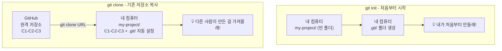
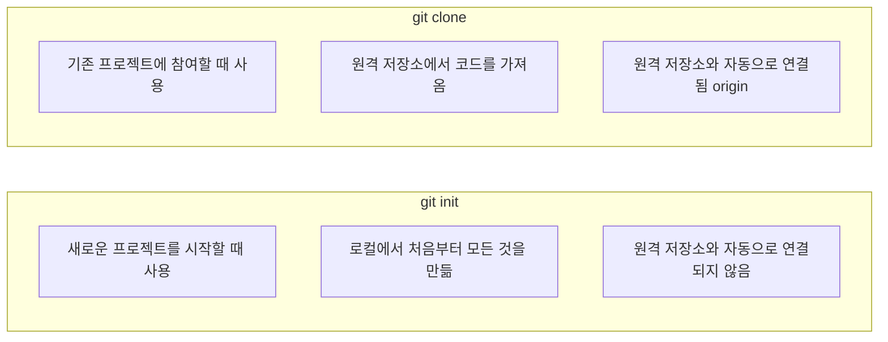

# Git 시작하기: 초기화 및 클론

이 문서에서는 Git 저장소를 시작하는 두 가지 방법을 배웁니다: 처음부터 새로 시작하는 **초기화 (init)**와 기존 저장소를 복사해 오는 **클론 (clone)**입니다.

**Init vs Clone 개념도:**



## 1. `git init` — 새로운 Git 저장소 만들기

로컬 컴퓨터에서 새로운 프로젝트를 시작할 때 사용합니다. 프로젝트 디렉토리를 Git 저장소로 초기화합니다.

**사용 방법:**

```bash
# 새 프로젝트 디렉토리를 만들고 이동합니다.
mkdir my-first-project
cd my-first-project

# 현재 디렉토리를 Git 저장소로 초기화합니다.
git init
```

`git init` 명령어를 실행하면 해당 디렉토리에 `.git`이라는 숨김 폴더가 생성됩니다. 이 폴더에는 버전 관리에 필요한 모든 메타데이터와 데이터가 저장됩니다.

**출력 예시:**
```
Initialized empty Git repository in /Users/username/my-first-project/.git/
```

**`.git` 디렉토리 구조:**
```bash
$ ls -la my-first-project/.git/
drwxr-xr-x    HEAD                    # 현재 HEAD가 가리키는 브랜치
drwxr-xr-x    config                  # 저장소 설정 파일
drwxr-xr-x    description             # 저장소 설명
drwxr-xr-x    hooks/                  # Git 훅 스크립트
drwxr-xr-x    info/                   # 추가 정보
drwxr-xr-x    objects/                # 모든 데이터 (커밋, 파일 등)
drwxr-xr-x    refs/                   # 브랜치, 태그 참조

$ cat my-first-project/.git/HEAD
ref: refs/heads/main
```

**`git init`의 다양한 옵션:**

```bash
# 기본 브랜치 이름을 main으로 초기화 (기본값과 동일)
git init --initial-branch=main

# 빈 디렉토리만 생성 (작업 트리 없음, 서버용)
git init --bare

# 기존 디렉토리를 Git 저장소로 만들기
$ cd /home/user/existing-project
$ git init
$ git add .
$ git commit -m "기존 프로젝트 Git 초기화"
```

## 2. `git clone` — 기존 저장소 복사하기

GitHub, GitLab, Bitbucket 등 원격 저장소에 있는 프로젝트를 내 컴퓨터로 복사할 때 사용합니다. 원격 저장소의 전체 이력과 모든 파일을 가져옵니다.

**사용 방법:**

```bash
git clone <저장소_주소>
```

**출력 예시:**
```bash
$ git clone https://github.com/username/example-repo.git
```

```
Cloning into 'example-repo'...
remote: Enumerating objects: 45, done.
remote: Counting objects: 100% (45/45), done.
remote: Total 45 (delta 0), reused 0 (delta 0), pack-reused 0
Receiving objects: 100% (45/45), 12.34 KiB | 2.47 MiB/s, done.
Resolving deltas: 100% (5/5), done.
```

**`git clone`의 다양한 활용:**

```bash
# 1. 디렉토리 이름을 지정해서 클론
$ git clone https://github.com/username/example-repo.git my-folder
Cloning into 'my-folder'...

# 2. 특정 브랜치만 클론 (깊이 제한, 빠른 다운로드)
$ git clone --branch develop https://github.com/username/example-repo.git

# 3. 최근 1개의 커밋만 가져오기 (shallow clone, 대규모 프로젝트에 유용)
$ git clone --depth 1 https://github.com/username/large-project.git

# 4. SSH로 클론 (비밀번호 없이 push 가능)
$ git clone git@github.com:username/example-repo.git

# 5. 특정 태그 버전 클론
$ git clone --branch v2.0.0 https://github.com/username/example-repo.git
```

**클론 후 확인:**
```bash
$ cd example-repo
$ git remote -v
origin  https://github.com/username/example-repo.git (fetch)
origin  https://github.com/username/example-repo.git (push)

$ git branch -a
* main
  remotes/origin/main
  remotes/origin/develop

$ git log --oneline -3
a1b2c3d README 업데이트
d4e5f6f 첫 번째 릴리스 준비
g7h8i9j 프로젝트 초기화
```

## 두 방법의 차이점



`git init`으로 생성한 저장소는 나중에 `git remote add` 명령어를 통해 원격 저장소와 연결할 수 있습니다.

## 실습: 처음부터 끝까지 따라하기

```bash
# 1. 프로젝트 폴더 생성 및 초기화
$ mkdir my-awesome-app
$ cd my-awesome-app
$ git init
Initialized empty Git repository in /Users/me/my-awesome-app/.git/

# 2. 첫 파일 만들기
$ echo "# My Awesome App" > README.md
$ git status
On branch main
Untracked files:
    README.md

# 3. 첫 커밋
$ git add README.md
$ git commit -m "프로젝트 초기화: README 추가"
[main (root-commit) a1b2c3d] 프로젝트 초기화: README 추가
 1 file changed, 1 insertion(+)

# 4. GitHub에서 새 저장소를 만들고 연결
$ git remote add origin https://github.com/me/my-awesome-app.git

# 5. 원격에 푸시
$ git push -u origin main
```
