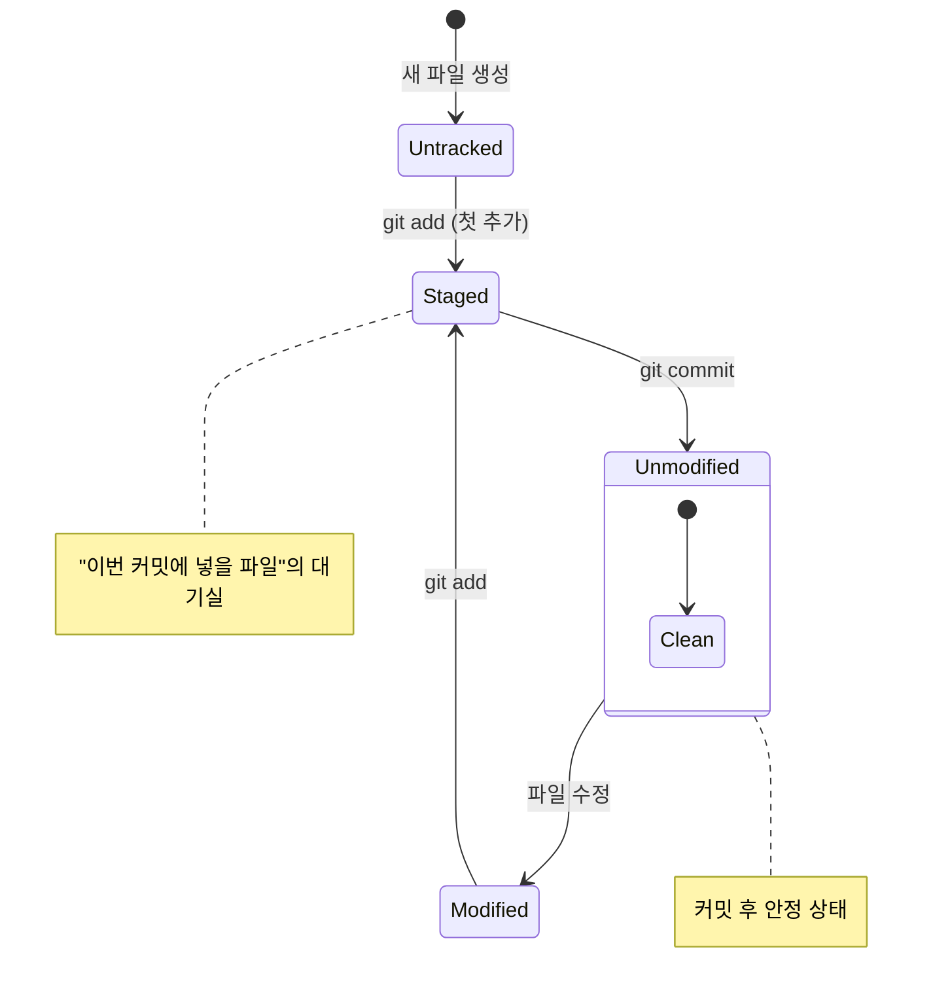
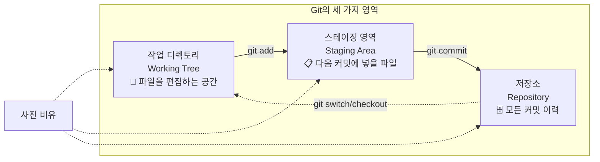

# Git 워크플로우 이해

Git을 사용할 때 파일은 크게 네 가지 상태를 거치며 이동합니다. 이를 이해하는 것이 Git 사용의 첫걸음입니다.

## 파일의 네 가지 상태

Git은 파일의 상태를 다음과 같이 구분합니다.

```
                    파일 상태 변경 흐름도

                        ┌──────────┐
                        │ Untracked│  (새로 만든 파일,
                        │ (추적안됨)│   Git이 아직 모름)
                        └────┬─────┘
                             │ git add (첫 추가)
                             ▼
  ┌─────────────────────────────────────────────────────┐
  │                                                     │
  │  ┌──────────┐   git add   ┌──────────┐   git commit │
  │  │ Modified │ ──────────► │  Staged  │ ────────────►│───┐
  │  │ (수정됨)  │             │(스테이징)  │             │   │
  │  └────┬─────┘             └──────────┘             │   │
  │       │                                            │   │
  │       │ 파일 수정                                   │   │
  │       │                                            │   │
  │  ┌────▼─────┐                                      │   │
  │  │Unmodified│◄─────────────────────────────────────┘   │
  │  │(수정안됨)  │    (커밋 후 안정 상태)                   │
  │  └──────────┘                                        │
  │                                                     │
  └─────────────────────────────────────────────────────┘

  💡 포인트: Staged는 "이번 커밋에 넣을 파일"의 대기실!
  💡 포인트: 커밋하면 Unmodified로 돌아가고, 수정하면 Modified로 이동!
```




1.  **Untracked (추적되지 않음):** Git이 아직 관리하지 않는 새로운 파일. 한 번도 스테이징(stage)되지 않은 파일입니다.
2.  **Unmodified (수정되지 않음):** 현재 Git이 관리하고 있는 파일 중에서 아직 수정되지 않은 상태. 가장 최근 커밋 이후로 변경 사항이 없는 파일입니다.
3.  **Modified (수정됨):** 한 번 이상 Git이 관리(추적)하고 있는 파일을 수정한 상태. 아직 스테이징 영역(staging area)에 추가되지 않은 변경 사항입니다.
4.  **Staged (스테이징됨):** 수정된 파일을 다음 커밋에 포함시킬 준비가 된 상태. 스테이징 영역에 파일이 추가된 상태입니다.

## Git의 세 가지 영역

Git은 위의 파일 상태를 관리하기 위해 세 가지 주요 영역을 사용합니다.

```



사진 찍는 것에 비유하면:
- **작업 디렉토리:** 사진을 찍기 전, 피사체와 구도를 준비하는 단계
- **스테이징 영역:** 셔터를 누르기 직전, 프레임을 확정하는 단계
- **저장소:** 실제로 사진을 찍어서 앨범에 보관하는 단계

## 기본 작업 흐름 (Workflow)

일반적인 Git 작업 흐름은 다음과 같습니다.

```
Working Directory  → (git add) → Staging Area → (git commit) → Repository
      ↑                                                              │
      └─────────────────────── (git switch) ─────────────────────────┘
```

1.  **작업 디렉토리에서 파일 수정:** 새로운 기능을 추가하거나 버그를 수정합니다.
2.  **스테이징 영역에 추가 (`git add`):** 커밋하고 싶은 변경 사항만 골라서 스테이징 영역에 추가합니다.
3.  **커밋 (`git commit`):** 스테이징 영역에 있는 변경 사항들을 하나의 스냅샷으로 만들어 저장소에 기록합니다.

이 흐름을 반복하면서 프로젝트의 버전을 체계적으로 관리할 수 있습니다.

## 실습: 전체 워크플로우 체험하기

터미널에서 직접 따라 해 보세요. 어떤 상태 변화가 일어나는지 주목하세요.

```bash
# 1. 새로운 Git 저장소 생성
$ mkdir workflow-demo && cd workflow-demo && git init

# 2. 새 파일 생성 (Untracked 상태)
$ echo "<h1>Hello World</h1>" > index.html
$ git status
On branch main
Untracked files:
    index.html   # <-- 빨간색: 추적되지 않음

# 3. 파일 스테이징 (Staged 상태로 변경)
$ git add index.html
$ git status
On branch main
Changes to be committed:
    new file:   index.html   # <-- 초록색: 스테이징됨

# 4. 파일 수정 (Modified + Staged 상태 동시 발생)
$ echo "<p>Welcome</p>" >> index.html
$ git status
On branch main
Changes to be committed:
    new file:   index.html       # 스테이징된 버전 (첫 번째 내용)
Changes not staged for commit:
    modified:   index.html       # 수정된 버전 (추가된 내용)

# 5. 다시 스테이징 (최신 상태로 업데이트)
$ git add index.html
$ git status
On branch main
Changes to be committed:
    new file:   index.html       # 최신 내용으로 스테이징됨

# 6. 커밋 (Repository에 저장)
$ git commit -m "첫 번째 페이지 추가"
[main (root-commit) a1b2c3d] 첫 번째 페이지 추가
 1 file changed, 2 insertions(+)

# 7. 커밋 후 상태 (Unmodified)
$ git status
On branch main
nothing to commit, working tree clean   # 모든 파일이 Unmodified

# 8. 다시 수정 → 스테이징 → 커밋 반복
$ echo "<footer>Copyright 2026</footer>" >> index.html
$ git add . && git commit -m "푸터 추가"
[main d4e5f6f] 푸터 추가
 1 file changed, 1 insertion(+)
```
