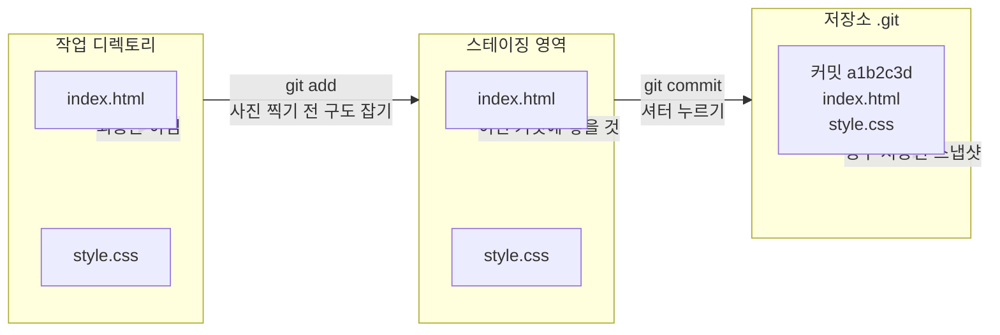

# 변경 사항 추가 및 커밋

Git에서 변경 사항을 기록하는 가장 기본적인 단계는 `add`와 `commit`입니다. 이 두 명령어는 Git 워크플로우의 핵심입니다.

**add와 commit의 관계:**



## 1. 작업 상태 확인하기: `git status`

무엇을 커밋할지 결정하기 전에 현재 작업 디렉토리의 상태를 확인합니다.

```bash
git status
```

**출력 예시:**
```
On branch main
Changes not staged for commit:
  (use "git add <file>..." to update what will be committed)
  (use "git restore <file>..." to discard changes in working directory)
        modified:   index.html

Untracked files:
  (use "git add <file>..." to include in what will be committed)
        new-style.css
```

여기서 `index.html`은 추적 중인 파일이 수정된 상태이고, `new-style.css`는 새로 추가된 Untracked 파일입니다.

**`git status`의 다양한 출력 형태:**
```bash
# 간결한 상태 확인
$ git status -s
 M index.html        # 수정됨 (스테이징 안 됨)
?? new-style.css     # Untracked
A  about.html        # 새로 추가되어 스테이징됨
MM app.js            # 스테이징 후 추가 수정 있음

# -s 옵션 설명:
# 첫 번째 칸: 스테이징 영역 상태
# 두 번째 칸: 작업 디렉토리 상태
# ?? : Untracked 파일
# M  : 수정됨
# A  : 새로 추가됨
```

**파일 내용 변경 예시와 상태 변화:**
```bash
$ echo "body { color: red; }" > style.css
$ echo "var x = 1;" > app.js

# 선택적으로 스테이징
$ git add style.css
$ git status -s
A  style.css         # 스테이징됨
?? app.js            # 스테이징 안 됨

# app.js도 수정한 후 스테이징
$ echo "var y = 2;" >> app.js
$ git add app.js
$ git status -s
A  style.css
A  app.js

# 커밋
$ git commit -m "초기 CSS 및 JS 파일 추가"
```

**특정 파일만 골라서 커밋하기:**
```bash
$ git status -s
 M login.html        # 수정됨
 M style.css         # 수정됨
 M app.js            # 수정됨

# login.html 변경 사항만 커밋
$ git add login.html
$ git commit -m "로그인 페이지 버튼 스타일 변경"
```

## 2. 스테이징 영역에 추가하기: `git add`

커밋에 포함시키고 싶은 변경 사항을 스테이징 영역에 추가합니다.

**파일 하나 추가하기:**
```bash
git add index.html
```

**여러 파일 추가하기:**
```bash
git add index.html new-style.css
```

**현재 디렉토리의 모든 변경 사항 추가하기:**
```bash
git add .
```

## 3. 변경 사항 기록하기: `git commit`

스테이징 영역에 추가된 변경 사항들을 하나의 스냅샷으로 저장(커밋)합니다. 커밋할 때는 반드시 메시지를 함께 작성해야 합니다.

```bash
git commit -m "커밋 메시지를 여기에 작성합니다"
```

**출력 예시:**
```
[main 7a3fb42] index.html 스타일 업데이트 및 new-style.css 추가
 2 files changed, 15 insertions(+), 3 deletions(-)
 create mode 100644 new-style.css
```

## 좋은 커밋 메시지 작성 팁

커밋 메시지는 간결하고 명확하게 작성하는 것이 중요합니다. 나중에 이력을 확인할 때 어떤 변경이 있었는지 쉽게 알 수 있도록 도와줍니다.

*   **명령문 형태로 작성하세요:** "수정함"보다는 "로그인 버그 수정"과 같이 명령형으로 작성합니다.
*   **짧게, 하지만 설명적으로:** 제목은 50자 이내로 간결하게 쓰고, 필요하면 본문에 자세한 설명을 추가합니다.
*   **무엇을, 왜 변경했는지:** "무엇을" 변경했는지와 "왜" 변경했는지를 위주로 작성합니다.

**좋은 예 vs 나쁜 예:**

```bash
# ❌ 나쁜 예
$ git commit -m "수정"
$ git commit -m "버그 수정함"
$ git commit -m "asdf"

# ✅ 좋은 예
$ git commit -m "로그인 버튼 클릭 시 크래시 발생 버그 수정"
$ git commit -m "README에 설치 방법 추가"
$ git commit -m "결제 모듈 API 응답 처리 방식 개선"

# ✅ 긴 설명이 필요할 때 (본문 추가)
$ git commit -m "사용자 프로필 페이지 성능 최적화

- 프로필 이미지 지연 로딩(lazy loading) 적용
- API 호출 횟수 3회에서 1회로 감소
- 불필요한 리렌더링 제거로 DOM 조작 최소화

관련 이슈: #42"
```

## 대화형 스테이징 (Interactive Staging)

파일의 일부 변경 사항만 골라서 스테이징하고 싶을 때 사용합니다.

```bash
$ git add -p

# Git이 변경 사항을 덩어리(hunk) 단위로 보여주고 선택을 물어봄
diff --git a/app.js b/app.js
+ console.log("디버깅용 로그");    # ← 이건 빼고
+ function calculateTotal() {      # ← 이건 넣고
+   return price * quantity;
+ }
Stage this hunk? [y,n,q,a,d,j,J,g,/,e,?]
# y: 이 덩어리 스테이징
# n: 이 덩어리 건너뛰기
# e: 수동으로 편집
# ?: 도움말
```

## `git add`와 `git commit` 한 번에 하기

이미 추적(track) 중인 파일(한 번이라도 커밋된 파일)의 변경 사항에 한해, `git add`와 `git commit`을 한 번에 수행할 수 있습니다.

```bash
git commit -a -m "변경 사항을 한 번에 커밋"
```

`-a` 옵션은 추적 중인 모든 파일의 변경 사항을 자동으로 스테이징합니다. 단, 새로 생성된 Untracked 파일은 자동으로 추가되지 않습니다.

## 커밋 되돌리기 (실수로 커밋했을 때)

방금 한 커밋을 취소하고 다시 커밋하려면:

```bash
# 직전 커밋 수정 (메시지 수정 또는 파일 추가)
$ git add forgotten-file.js
$ git commit --amend -m "수정된 커밋 메시지"
```

> **주의:** `--amend`는 이력을 변경합니다. 이미 원격 저장소에 푸시된 커밋은 `--amend`하지 않는 것이 좋습니다.

## 실습: 직접 해보기

```bash
# 1. 프로젝트 생성
$ mkdir commit-practice && cd commit-practice && git init

# 2. 파일 만들고 커밋
$ echo "첫 번째 내용" > file1.txt
$ git add file1.txt && git commit -m "file1 추가"

# 3. 내용 수정 후 상태 확인
$ echo "두 번째 내용" > file2.txt
$ echo "수정된 내용" >> file1.txt
$ git status

# 4. file2만 스테이징
$ git add file2.txt
$ git status          # file1은 'modified'로 남음

# 5. file1도 스테이징
$ git add file1.txt

# 6. 함께 커밋
$ git commit -m "file2 추가 및 file1 업데이트"

# 7. 로그 확인
$ git log --oneline
a1b2c3d file2 추가 및 file1 업데이트
d4e5f6f file1 추가
```
