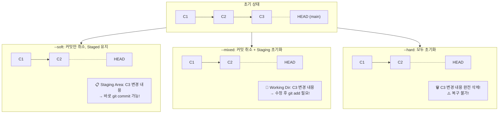

# Reset과 Revert

개발을 하다 보면 이전 상태로 되돌리고 싶은 순간이 있습니다. Git은 이러한 상황을 위해 `git reset`과 `git revert`라는 두 가지 도구를 제공합니다.

## Reset vs Revert: 핵심 차이

**Reset과 Revert의 동작 방식 비교:**


| `git reset` | `git revert` |
|---|---|
| **히스토리를 덮어씁니다** (과거를 없었던 일로 만듦) | **히스토리를 보존합니다** (되돌린 사실을 새 커밋으로 기록) |
| 이미 푸시된 커밋에는 사용하면 위험함 | 이미 푸시된 커밋에도 안전하게 사용 가능 |
| 로컬 작업에 적합 | 원격 저장소와 공유된 작업에 적합 |

## 1. `git reset` — 커밋 되돌리기 (히스토리 수정)

`git reset`은 브랜치 포인터를 이전 커밋으로 이동시킵니다. 마치 그 이후의 커밋이 없었던 것처럼 만듭니다.

### reset의 세 가지 모드 상세 비교



```bash
$ git log --oneline
c3d4e5f (HEAD -> main) C3: 세 번째 커밋     ← HEAD~0 = 현재
b2c3d4e C2: 두 번째 커밋                    ← HEAD~1
a1b2c3d C1: 첫 번째 커밋                    ← HEAD~2
```

**`--soft` 모드:**
```bash
$ git reset --soft HEAD~1
# HEAD가 C2로 이동
# C3의 변경 사항: Staged 상태로 유지
$ git status
On branch main
Changes to be committed:
    (C3에서 변경했던 내용들)   # 바로 git commit 가능!

# 💡 "커밋을 잘못 만들어서 다시 커밋하고 싶을 때" 사용
$ git commit -m "C3 수정 버전"
```

**`--mixed` 모드 (기본값):**
```bash
$ git reset HEAD~1
# HEAD가 C2로 이동
# C3의 변경 사항: Modified 상태로 유지 (Unstaged)
$ git status
On branch main
Changes not staged for commit:
    (C3에서 변경했던 내용들)   # git add 후 git commit 필요

# 💡 "커밋을 취소하고 파일은 수정된 상태로 두고 싶을 때" 사용
$ git add .
$ git commit -m "C3 완전히 새로 작성"
```

**`--hard` 모드:**
```bash
$ git reset --hard HEAD~1
# HEAD가 C2로 이동
# C3의 변경 사항: 완전히 삭제!
$ git status
On branch main
nothing to commit, working tree clean

# 💡 "C3 자체가 필요 없어졌을 때" 사용
# ⚠️ 복구 불가! 신중하게 사용!
```

### 세 가지 모드 한눈에 비교

| 모드 | HEAD 이동 | Staging Area | Working Directory |
|---|---|---|---|
| `--soft` | 이동 | 변경 사항 보존 | 변경 사항 보존 |
| `--mixed` | 이동 | 초기화 | 변경 사항 보존 |
| `--hard` | 이동 | 초기화 | 초기화 (모두 삭제) |

### 예시: 마지막 커밋 취소하기

```bash
# 마지막 커밋을 취소하고 변경 사항은 작업 디렉토리에 유지
git reset --soft HEAD~1

# 또는 마지막 커밋을 완전히 삭제
git reset --hard HEAD~1
```

### 특정 커밋으로 되돌리기
```bash
git reset --hard a1b2c3d
```

## 2. `git revert` — 커밋 되돌리기 (히스토리 보존)

`git revert`는 기존 커밋을 취소하는 **새로운 커밋**을 만듭니다. 즉, 이전 커밋은 히스토리에 그대로 남아 있고, 그 변경을 되돌리는 커밋이 추가됩니다.

```bash
$ git log --oneline
c3d4e5f (HEAD) C3: 치명적인 버그 추가   ← 이 커밋을 되돌리고 싶음
b2c3d4e C2: 기능 추가
a1b2c3d C1: 초기화

$ git revert HEAD
# Git이 자동으로 편집기를 열어 revert 커밋 메시지를 준비함
Revert "C3: 치명적인 버그 추가"

This reverts commit c3d4e5f...

$ git log --oneline
d5e6f7a (HEAD) Revert "C3: 치명적인 버그 추가"   ← 새 커밋!
c3d4e5f C3: 치명적인 버그 추가                   ← 원본 커밋 유지!
b2c3d4e C2: 기능 추가
a1b2c3d C1: 초기화
```

**충돌이 발생한 revert 처리:**
```bash
$ git revert c3d4e5f
error: could not revert c3d4e5f... C3: 치명적인 버그 추가
hint: after resolving the conflicts, mark them with
hint: "git add <file>", and run "git revert --continue"

# 충돌 해결 후
$ git add .
$ git revert --continue    # revert 완료
# 또는
$ git revert --abort       # revert 취소
```

### 특정 커밋 되돌리기
```bash
git revert a1b2c3d
```

### 여러 커밋 되돌리기
```bash
git revert HEAD~3..HEAD
```

### --no-edit 옵션: 기본 커밋 메시지 사용
```bash
git revert HEAD --no-edit
```

### 연속된 여러 커밋 되돌리기
```bash
# 최근 3개의 커밋을 순서대로 revert (각각 revert 커밋 생성)
$ git revert HEAD~3..HEAD --no-edit
[main 1111] Revert "C3"
[main 2222] Revert "C2"
[main 3333] Revert "C1"

# 또는 한꺼번에 revert (단일 revert 커밋)
$ git revert -n HEAD~3..HEAD
$ git commit -m "C1, C2, C3를 한 번에 revert"
```

## 언제 무엇을 사용할까?

| 상황 | 추천 명령어 |
|---|---|
| 로컬에서 작업 중이고, 커밋을 아직 푸시하지 않음 | `git reset` |
| 이미 원격 저장소에 푸시된 커밋을 되돌려야 함 | `git revert` |
| 작업 중인 변경 사항을 모두 버리고 마지막 커밋 상태로 돌아가고 싶음 | `git reset --hard HEAD` |
| 특정 커밋의 변경 사항만 취소하고 싶음 (히스토리 보존) | `git revert <커밋해시>` |

> **중요:** 이미 원격 저장소에 푸시된 커밋을 `git reset`으로 되돌리고 강제로 푸시(`git push --force`)하는 것은 팀원들에게 혼란을 줄 수 있으므로 피해야 합니다. 공유된 히스토리는 `git revert`를 사용하여 안전하게 되돌리는 것이 좋습니다.

## 실습 시나리오: reset과 revert의 차이 체험

```bash
# 1. 실수로 버그를 포함한 코드를 작성
$ echo "버그 있는 코드" > bug.js
$ git add . && git commit -m "버그 추가"

# 2. 이미 원격에 푸시함
$ git push origin main

# 3. 동료가 pull 받아서 작업 중
# 이때는 ⚠️ reset을 사용하면 안 됨!

# ✅ 올바른 방법: revert 사용
$ git revert HEAD --no-edit
[main a1b2c3d] Revert "버그 추가"

$ git push origin main
# 동료가 pull해도 안전!

# ❌ 잘못된 방법: reset + force push
$ git reset --hard HEAD~1
$ git push --force origin main
# 동료의 로컬 히스토리와 충돌 발생! 🚨
```

## reset으로 삭제된 커밋 복구하기 (ORIG_HEAD)

혹시라도 `git reset --hard`로 커밋을 삭제했다면, `ORIG_HEAD`를 사용해 복구할 수 있습니다.

```bash
$ git reset --hard HEAD~1    # C3 삭제됨!
$ git log --oneline          # C3가 보이지 않음
b2c3d4e C2: 기능 추가
a1b2c3d C1: 초기화

# ORIG_HEAD: reset 직전의 HEAD 위치를 기억
$ git reset --hard ORIG_HEAD  # 다시 C3로 복구!
$ git log --oneline
c3d4e5f C3: 치명적인 버그 추가
b2c3d4e C2: 기능 추가
a1b2c3d C1: 초기화
```
