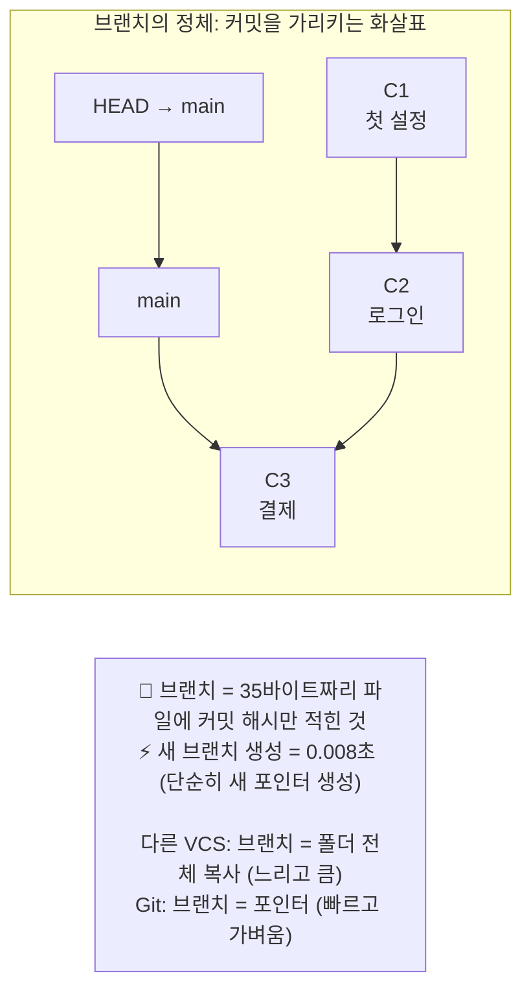
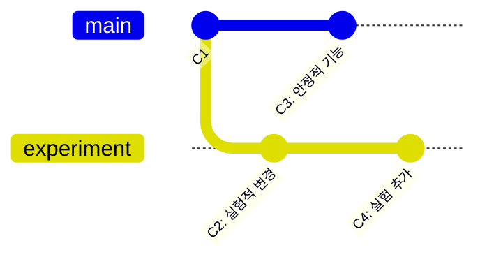

# 브랜치란 무엇인가요?

브랜치(Branch)는 Git의 가장 강력하고 유용한 기능 중 하나입니다. 브랜치를 이해하면 독립적으로 작업을 진행하고, 이를 다시 하나로 합치는 Git의 진정한 힘을 활용할 수 있습니다.

## 브랜치의 개념

브랜치는 말 그대로 **나뭇가지**를 의미합니다. 하나의 코드 베이스에서 또 다른 독립적인 작업 흐름을 만들 수 있습니다.

예를 들어, 여러분이 책을 쓰고 있다고 상상해 보세요. 원고의 메인 버전(1장, 2장, 3장...)이 있습니다. 그런데 갑자기 떠오른 새로운 아이디어로 책의 결말 부분을 실험적으로 다시 써보고 싶습니다. 하지만 원래 원고를 망가뜨리고 싶지는 않습니다.

이럴 때 브랜치를 사용합니다. 메인 원고는 그대로 두고, "결말-실험"이라는 새로운 브랜치를 만들어 자유롭게 작업할 수 있습니다. 나중에 실험이 마음에 들면 메인 원고에 합칠(merge) 수도 있고, 마음에 들지 않으면 그냥 버릴 수도 있습니다.

## 브랜치의 필요성

*   **독립적인 기능 개발:** 새로운 기능을 개발할 때 메인 코드에 영향을 주지 않고 별도의 브랜치에서 안전하게 작업할 수 있습니다.
*   **버그 수정:** 긴급한 버그를 수정해야 할 때, 현재 진행 중인 작업과 분리하여 빠르게 버그 수정 브랜치를 만들고 적용할 수 있습니다.
*   **실험적인 작업:** 확신이 없는 새로운 아이디어를 안전하게 실험해 볼 수 있습니다.
*   **병렬 개발:** 여러 개발자가 동시에 서로 다른 기능을 개발할 수 있습니다.

## Git 브랜치의 특징

Git의 브랜치는 다른 버전 관리 시스템에 비해 매우 가볍고 빠릅니다.

**Git 브랜치는 단순한 포인터입니다:**



다른 VCS는 브랜치 = 폴더 전체 복사 (느리고 큼)
Git은 브랜치 = 포인터 (빠르고 가벼움)

*   **가벼움 (Lightweight):** Git에서 브랜치는 단순히 특정 커밋을 가리키는 포인터(pointer)에 불과합니다. 따라서 생성, 전환, 삭제가 매우 빠릅니다.
*   **손쉬운 병합 (Easy Merging):** Git은 브랜치 병합을 매우 효율적으로 처리하며, 충돌(conflict)이 발생했을 때도 상세한 정보를 제공하여 해결을 도와줍니다.
*   **로컬 우선 (Local First):** 대부분의 브랜치 작업은 로컬 저장소에서 이루어지기 때문에 인터넷 연결 없이도 자유롭게 브랜치를 만들고 전환할 수 있습니다.

Git을 사용할 때는 기본적으로 `main`(또는 `master`)이라는 메인 브랜치가 하나 생성됩니다. 이 메인 브랜치를 기준으로 다양한 토픽 브랜치를 만들고 작업하며, 완료된 작업은 다시 메인 브랜치로 병합하는 방식으로 진행됩니다.

**브랜치 생성과 이동 개념도:**



```bash
# 1. main 브랜치에서 시작 (C1 커밋)
$ git log --oneline
a1b2c3d (HEAD -> main) C1: 초기 설정

## 브랜치 작동 방식 예시

**실제 Git 명령어로 브랜치 개념 익히기:**

```bash
# 1. main 브랜치에서 시작 (C1 커밋)
$ git log --oneline
a1b2c3d (HEAD -> main) C1: 초기 설정

# 2. experiment 브랜치 생성 (같은 위치를 가리킴)
$ git branch experiment

# 현재 상태 (모든 브랜치가 C1을 가리킴):
#   main → C1
#   experiment → C1
#   HEAD → main

# 3. experiment로 전환 후 작업
$ git switch experiment
$ echo "실험 코드" > test.txt
$ git add . && git commit -m "C2: 실험적인 변경"
$ git log --oneline
a1b2c3d (main) C1: 초기 설정
b2c3d4e (HEAD -> experiment) C2: 실험적인 변경  # experiment만 앞서감

# 4. main으로 돌아가기
$ git switch main
$ ls test.txt
ls: test.txt: No such file or directory  # experiment의 파일은 보이지 않음!

# 5. main에서도 작업
$ echo "안정적인 코드" > stable.txt
$ git add . && git commit -m "C3: 안정적인 기능 추가"
$ git log --oneline
c3d4e5f (HEAD -> main) C3: 안정적인 기능 추가
a1b2c3d C1: 초기 설정
# experiment 브랜치의 C2는 보이지 않음!

# 6. 브랜치 그래프 확인
$ git log --oneline --graph --all
* c3d4e5f (HEAD -> main) C3: 안정적인 기능 추가
| * b2c3d4e (experiment) C2: 실험적인 변경
|/
* a1b2c3d C1: 초기 설정
# 브랜치가 갈라진 구조를 시각적으로 확인!
```
