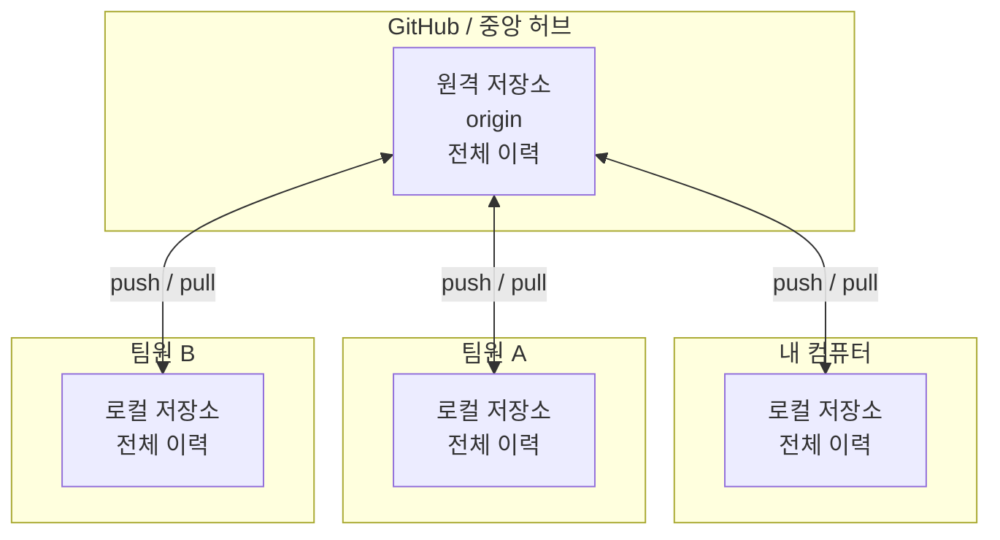
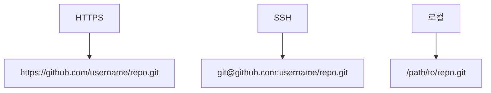

# 원격 저장소 이해

지금까지의 작업은 모두 여러분의 로컬 컴퓨터에서 이루어졌습니다. 하지만 Git의 진정한 가치는 협업에서 드러납니다. **원격 저장소(Remote Repository)**를 사용하면 전 세계 어디서든 다른 개발자들과 함께 프로젝트를 개발할 수 있습니다.

## 원격 저장소란?

원격 저장소는 인터넷이나 네트워크 어딘가에 있는 Git 저장소입니다. 여러분의 로컬 저장소와 연결되어 데이터를 주고받을 수 있습니다. 대표적인 원격 저장소 호스팅 서비스로는 **GitHub**, **GitLab**, **Bitbucket** 등이 있습니다.

**로컬 저장소와 원격 저장소의 관계:**



```
[내 로컬 저장소] <───> [원격 저장소 (GitHub 등)] <───> [팀원 A의 로컬 저장소]
                                                     <───> [팀원 B의 로컬 저장소]
```

## 원격 저장소의 필요성

*   **백업:** 로컬 저장소의 데이터를 안전하게 백업할 수 있습니다.
*   **협업:** 팀원들과 코드를 공유하고 동시에 작업할 수 있습니다.
*   **배포:** 완성된 코드를 원격 저장소를 통해 배포 서버에 쉽게 반영할 수 있습니다.
*   **오픈소스 기여:** 전 세계의 프로젝트에 기여하고 코드를 공유할 수 있습니다.

## 원격 저장소 확인하기

현재 저장소에 연결된 원격 저장소가 있는지 확인하려면 다음 명령어를 사용합니다.

```bash
git remote
```

**출력 예시:**
```
origin
```

`-v` 옵션을 사용하면 원격 저장소의 URL도 함께 확인할 수 있습니다.

```bash
git remote -v
```

**출력 예시:**
```
origin  https://github.com/username/my-project.git (fetch)
origin  https://github.com/username/my-project.git (push)
```

관례적으로 원격 저장소의 기본 이름은 `origin`을 사용합니다.

**여러 개의 원격 저장소 설정 예시:**
```bash
$ git remote -v
origin   https://github.com/me/my-project.git (fetch)
origin   https://github.com/me/my-project.git (push)
upstream https://github.com/other/my-project.git (fetch)  # 다른 사람의 fork
backup   https://gitlab.com/me/my-project.git (fetch)     # 백업용

# 원격 저장소별로 push/pull 가능
$ git push origin main          # GitHub에 푸시
$ git push backup main          # GitLab에도 푸시
$ git pull upstream develop     # 원본 저장소에서 최신 코드 가져오기
```

## 원격 저장소 추가하기

로컬에서 먼저 작업을 시작한 경우, 나중에 원격 저장소를 연결할 수 있습니다.

```bash
git remote add origin https://github.com/username/my-project.git
```

위 명령어는 `origin`이라는 이름으로 원격 저장소를 추가합니다.

## 원격 저장소의 URL 형식

Git은 다양한 프로토콜을 통해 원격 저장소에 접근할 수 있습니다.



초보자에게는 **HTTPS** 방식이 가장 설정하기 쉽고 간편합니다. SSH 방식은 한 번 설정하면 비밀번호 없이 사용할 수 있다는 장점이 있지만, 초기 SSH 키 설정이 필요합니다.

**SSH 키 설정 및 사용 예시:**

```bash
# SSH 키 생성
$ ssh-keygen -t ed25519 -C "your.email@example.com"

# 생성된 공개키 확인
$ cat ~/.ssh/id_ed25519.pub
ssh-ed25519 AAAAC3... your.email@example.com

# GitHub/Settings/SSH and GPG keys에 공개키 등록 후
$ git clone git@github.com:username/private-repo.git
# 비밀번호 없이 clone/push 가능!
```

**HTTPS 사용 시 토큰 인증 예시:**
```bash
# GitHub에서 Personal Access Token 발급 후
$ git clone https://github.com/username/private-repo.git
Username: your_username
Password: your_personal_access_token   # ← GitHub 비밀번호가 아닌 토큰!

# 혹은 URL에 토큰 포함 (보안상 비추천)
$ git clone https://token@github.com/username/private-repo.git

# GitHub CLI로 간편 인증
$ gh auth login
# 브라우저에서 로그인 후 자동 인증 완료!
```

## 원격 저장소 삭제하기

```bash
git remote remove origin
```

## 원격 저장소 정보 자세히 보기

```bash
git remote show origin
```

이 명령어는 원격 저장소의 URL, 추적 브랜치 목록, 최신 동기화 상태 등 상세 정보를 보여줍니다.

**`git remote show origin` 출력 예시:**
```bash
$ git remote show origin
* remote origin
  Fetch URL: https://github.com/username/my-project.git
  Push  URL: https://github.com/username/my-project.git
  HEAD branch: main
  Remote branches:
    main            tracked
    develop         tracked
    feature/login   tracked
  Local branches configured for 'git pull':
    main    merges with remote main
    develop merges with remote develop
  Local refs configured for 'git push':
    main    pushes to main    (up to date)
    develop pushes to develop (local out of date)
```

**원격 저장소 이름 변경 및 URL 수정:**
```bash
# 원격 저장소 이름 변경
$ git remote rename origin github

# 원격 저장소 URL 변경 (저장소 주소가 바뀌었을 때)
$ git remote set-url origin https://github.com/new-username/new-repo.git

# HTTPS를 SSH로 변경
$ git remote set-url origin git@github.com:username/repo.git
```
