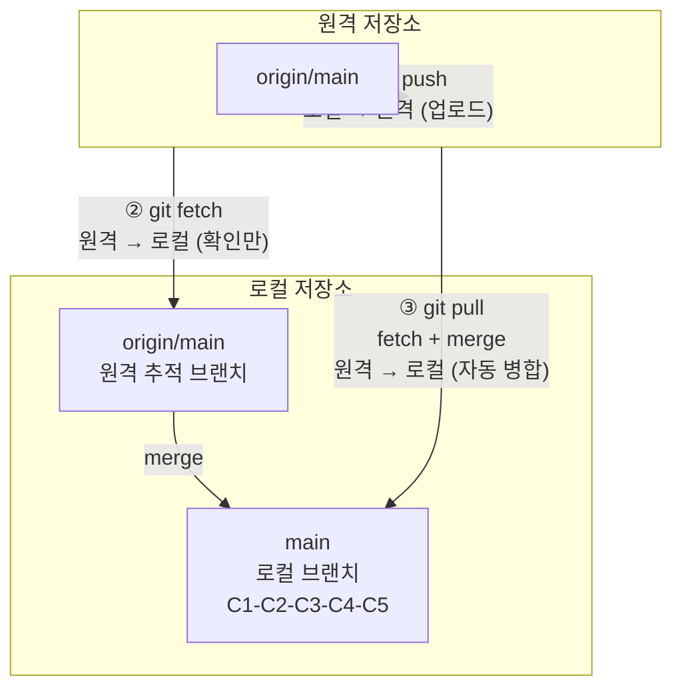
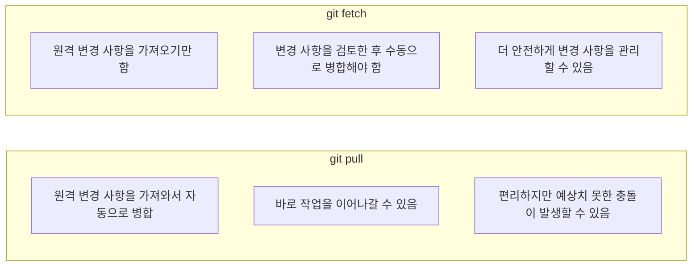

# 푸시, 풀, 페치

로컬 저장소와 원격 저장소 간에 데이터를 주고받는 세 가지 핵심 명령어를 배웁니다.

**세 가지 명령어의 데이터 흐름:**



## 1. Push (푸시) — 로컬 → 원격

로컬 저장소의 커밋을 원격 저장소에 업로드합니다. 팀원들이 여러분의 작업을 볼 수 있게 됩니다.

```bash
git push origin main
```

*   `origin`: 푸시할 원격 저장소 이름
*   `main`: 푸시할 로컬 브랜치 이름

**처음 푸시할 때 (`-u` 옵션):** 처음으로 특정 브랜치를 원격에 푸시할 때는 `-u` (또는 `--set-upstream`) 옵션을 사용하여 로컬 브랜치와 원격 브랜치를 연결(tracking)합니다. 이후부터는 `git push`만 입력해도 됩니다.

```bash
git push -u origin main
```

**출력 예시:**
```
Enumerating objects: 5, done.
Counting objects: 100% (5/5), done.
Writing objects: 100% (3/3), 342 bytes | 342.00 KiB/s, done.
Total 3 (delta 0), reused 0 (delta 0), pack-reused 0
To https://github.com/username/my-project.git
   a1b2c3d..e4f5g6h  main -> main
```

## 2. Pull (풀) — 원격 → 로컬 (가져오기 + 병합)

원격 저장소의 최신 변경 사항을 로컬 저장소로 가져오고(fetch) 자동으로 병합(merge)까지 수행합니다.

```bash
git pull origin main
```

`git pull`은 사실 `git fetch`와 `git merge`를 순차적으로 실행하는 것과 같습니다.

```
git pull origin main
=
git fetch origin + git merge origin/main
```

**출력 예시:**
```
remote: Enumerating objects: 5, done.
remote: Counting objects: 100% (5/5), done.
remote: Total 3 (delta 0), reused 0 (delta 0), pack-reused 0
Unpacking objects: 100% (3/3), 342 bytes | 114.00 KiB/s, done.
From https://github.com/username/my-project.git
   a1b2c3d..e4f5g6h  main     -> origin/main
Updating a1b2c3d..e4f5g6h
Fast-forward
 README.md | 2 ++
 1 file changed, 2 insertions(+)
```

## 3. Fetch (페치) — 원격 → 로컬 (가져오기만)

원격 저장소의 최신 변경 사항을 로컬로 **가져오기만** 합니다. 자동으로 병합하지는 않습니다. 변경 사항을 확인한 후에 직접 병합할지 결정할 수 있습니다.

```bash
git fetch origin
```

페치 후에는 `origin/main`과 같은 원격 브랜치가 업데이트됩니다. 로컬 `main` 브랜치와 원격 `origin/main` 브랜치의 차이를 확인하려면 `git diff`를 사용할 수 있습니다.

```bash
git diff main origin/main
```

변경 사항을 확인한 후 병합하려면:

```bash
git merge origin/main
```

## Pull vs Fetch 비교



> **팁:** 초보자에게는 단순히 `git pull`을 사용하는 것이 편리합니다. 하지만 변경 사항을 먼저 검토하고 싶다면 `git fetch`를 사용하는 습관을 들이는 것이 좋습니다.

## 4. Push 충돌 상황 해결하기

다른 사람이 먼저 push한 상태에서 내가 push하려고 하면 거부됩니다.

```bash
$ git push origin main
! [rejected]        main -> main (fetch first)
error: failed to push some refs to 'https://github.com/...'
hint: Updates were rejected because the remote contains work that you do not
hint: have locally. This is usually caused by another repository pushing to
hint: the same ref. You may want to first integrate the remote changes
hint: (e.g., 'git pull ...') before pushing again.

# 해결 방법: pull로 원격 변경 사항을 먼저 가져와 병합
$ git pull origin main

# 병합 완료 후 다시 push
$ git push origin main
```

## 5. Pull vs Fetch 상세 비교 예시

```bash
# === git pull (빠르지만 덜 안전함) ===
$ git pull origin main

# 원격 변경 사항을 가져와서 자동으로 main에 병합
# 만약 충돌이 있다면 당황할 수 있음

# === git fetch (더 안전한 방법) ===
$ git fetch origin               # 원격 변경 사항만 가져오기
$ git log --oneline main..origin/main  # 어떤 변경이 있는지 먼저 확인
a1b2c3d 다른 개발자가 추가한 기능
d4e5f6f 버그 수정

# 변경 사항 검토 후 직접 병합 결정
$ git merge origin/main          # 괜찮다면 병합
# 또는
$ git diff main origin/main      # 변경 사항이 마음에 안 들면 차이만 확인
```

## 6. 새로운 로컬 브랜치를 원격에 푸시하기

```bash
# 로컬에서 새 브랜치 생성 및 작업
$ git switch -c feature/payment
$ echo "payment module" > payment.js
$ git add . && git commit -m "결제 모듈 초안"

# 원격에 브랜치 푸시 (원격에도 같은 이름의 브랜치가 생성됨)
$ git push -u origin feature/payment
Total 0 (delta 0), reused 0 (delta 0)
 * [new branch]      feature/payment -> feature/payment
Branch 'feature/payment' set up to track remote branch 'feature/payment' from 'origin'.

# 이후부터는 간단히 git push 만으로 가능
$ git push
```

## 7. 원격 브랜치 삭제하기

```bash
# 원격 브랜치 삭제 (feature/payment 개발 완료 후)
$ git push origin --delete feature/payment
 - [deleted]         feature/payment

# 또는
$ git push origin :feature/payment   # (주의: 위험해 보이는 문법)
```

## 기본적인 협업 워크플로우

```bash
# 1. 최신 코드 가져오기
git pull origin main

# 2. 새 브랜치에서 작업 시작
git switch -c feature/my-feature

# 3. 작업 후 커밋
git add .
git commit -m "새 기능 추가"

# 4. 원격에 푸시
git push -u origin feature/my-feature

# 5. GitHub/GitLab에서 Pull Request 생성
# (리뷰 및 병합은 서비스에서 진행)

# 6. (선택) 로컬에서 main 브랜치 업데이트
git switch main
git pull origin main
```
