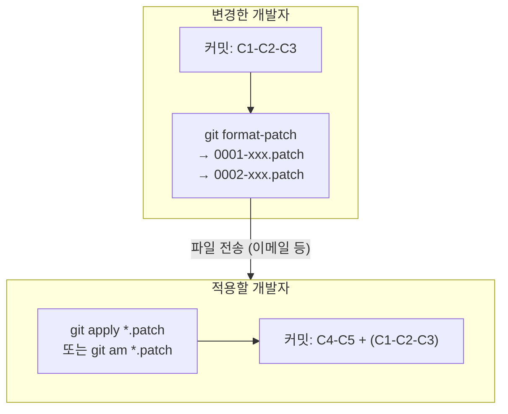
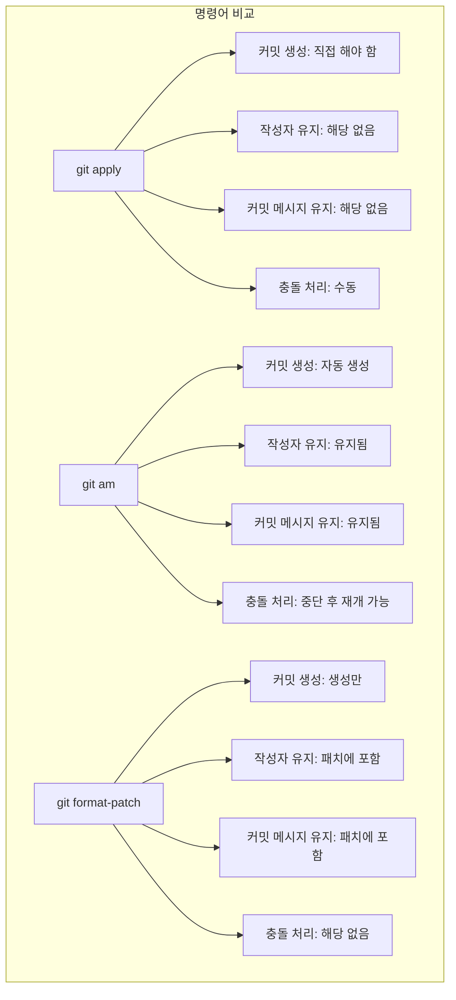

# Patch: 코드를 파일로 주고받기

원격 저장소(GitHub 등) 없이도 변경 사항을 공유할 수 있습니다. `git format-patch`로 변경 사항을 파일로 만들고, `git apply`나 `git am`으로 적용하는 방식입니다. 이메일로 패치 파일을 주고받던 시절의 전통적인 워크플로우이며, 일부 오픈소스 프로젝트(Linux 커널 등)에서 아직 사용합니다.

## Patch 작업 흐름



## 1. `git format-patch` — 커밋을 Patch 파일로 만들기

특정 커밋들을 표준 이메일 형식의 패치 파일로 내보냅니다.

### 기본 사용법

```bash
git format-patch <기준커밋>..<마지막커밋>
```

### 예시

```bash
# 최근 3개 커밋을 패치 파일로 생성
$ git format-patch HEAD~3
0001-로그인-폼-추가.patch
0002-유효성-검사-추가.patch
0003-스타일-적용.patch
```

### 다양한 옵션

```bash
# 특정 범위 지정
$ git format-patch main..feature/login
0001-로그인-폼-추가.patch
0002-유효성-검사-추가.patch

# 최근 n개 커밋
$ git format-patch -3

# 단일 커밋
$ git format-patch -1 a1b2c3d
0001-버그-수정.patch

# 출력 디렉토리 지정
$ git format-patch HEAD~3 -o ~/patches/

# 번호 없이 파일명만
$ git format-patch HEAD~3 --numbered-files
1.patch
2.patch
3.patch
```

### 생성된 Patch 파일 예시

```patch
From a1b2c3d... Mon Jul 10 14:30:00 2026
From: 홍길동 <hong@example.com>
Date: Mon, 10 Jul 2026 14:30:00 +0900
Subject: [PATCH] 로그인 폼 추가

---
 login.html | 10 ++++++++++
 1 file changed, 10 insertions(+)

diff --git a/login.html b/login.html
new file mode 100644
index 0000000..e69de29
--- /dev/null
+++ b/login.html
@@ -0,0 +1,10 @@
+<h1>로그인</h1>
+<form>
+  <input type="email" placeholder="이메일">
+  <input type="password" placeholder="비밀번호">
+  <button>로그인</button>
+</form>
```

## 2. `git apply` — Patch 파일 적용하기 (직접 적용)

패치 파일의 변경 사항을 **현재 작업 디렉토리**에 적용합니다. 커밋은 생성되지 않습니다.

### 기본 사용법

```bash
git apply <패치파일>
```

### 예시

```bash
# 단일 패치 적용
$ git apply 0001-로그인-폼-추가.patch

# 여러 패치 적용
$ git apply *.patch

# 적용 전 미리 확인 (dry-run)
$ git apply --check 0001-로그인-폼-추가.patch

# 적용 결과 확인
$ git status
Changes not staged for commit:
  modified:   login.html

# 변경 사항을 직접 커밋해야 함
$ git add .
$ git commit -m "패치 적용: 로그인 폼 추가"
```

### 주요 옵션

```bash
# 적용 전 검증만 (실제 적용 안 함)
$ git apply --check 0001.patch
# 문제 없으면 아무 출력 없음

# 적용할 파일만 지정
$ git apply --include='*.html' *.patch

# 제외할 파일 지정
$ git apply --exclude='*.js' *.patch

# 패치 반대로 적용 (되돌리기)
$ git apply --reverse 0001.patch
```

## 3. `git am` — Patch 파일 적용 + 커밋 (자동 커밋)

`git apply`와 달리 패치 파일의 **커밋 메시지와 작성자 정보를 유지**하면서 커밋까지 생성합니다. 이메일로 받은 패치를 그대로 적용할 때 사용합니다.

### 기본 사용법

```bash
git am <패치파일>
```

### 예시

```bash
# 단일 패치 적용 + 커밋
$ git am 0001-로그인-폼-추가.patch
Applying: 로그인 폼 추가

# 여러 패치 순서대로 적용
$ git am *.patch
Applying: 로그인 폼 추가
Applying: 유효성 검사 추가
Applying: 스타일 적용

# 적용 후 로그 확인
$ git log --oneline -3
a1b2c3d 스타일 적용
d4e5f6f 유효성 검사 추가
g7h8i9j 로그인 폼 추가
```

### Patch 적용 중 충돌 해결

```bash
# 충돌 발생
$ git am 0002-유효성-검사-추가.patch
Applying: 유효성 검사 추가
error: patch failed: login.html:10
error: login.html: patch does not apply

# 충돌 해결 후
$ vi login.html   # 충돌 수동 해결
$ git add login.html
$ git am --continue   # 계속 진행

# 또는
$ git am --skip       # 이 패치 건너뛰기
$ git am --abort      # am 작업 전체 취소
```

## 실전 시나리오: Patch로 변경 사항 공유하기

```bash
# === 개발자 A: 패치 생성 ===
$ git switch -c feature/new-feature
$ echo "new feature" > feature.txt
$ git add . && git commit -m "새 기능 추가"
$ echo "bug fix" > fix.txt
$ git add . && git commit -m "버그 수정"

# 패치 파일 생성
$ git format-patch main..feature/new-feature -o ~/patches/
~/patches/0001-새-기능-추가.patch
~/patches/0002-버그-수정.patch

# ~/patches/ 디렉토리를 압축해서 이메일로 전송 📧


# === 개발자 B: 패치 적용 ===
$ git switch main
$ git pull origin main   # 최신 상태 유지

# 패치 적용 전 검증
$ git apply --check ~/patches/0001-*.patch
# (문제 없으면 출력 없음)

# 패치 적용 + 커밋 (git am 사용)
$ git am ~/patches/0001-*.patch
Applying: 새 기능 추가
Applying: 버그 수정

# 완료!
$ git log --oneline -3
a1b2c3d 버그 수정
d4e5f6f 새 기능 추가
e7f8g9h (HEAD -> main) 이전 커밋
```

## apply vs am vs format-patch 관계

```bash
# format-patch + am = push + pull 과 유사

# 원격 저장소 있는 경우:
$ git push origin feature   # 업로드
$ git pull origin feature   # 다운로드 + 병합

# Patch 사용하는 경우:
$ git format-patch main..feature  # 패치 생성 (업로드 대체)
$ git am *.patch                   # 패치 적용 (다운로드 + 커밋 대체)
```

## format-patch + apply 활용: 백업 및 검토

```bash
# 1. 로컬 커밋을 패치로 백업
$ git format-patch -5 -o ~/backup/

# 2. 실수로 커밋 삭제
$ git reset --hard HEAD~5

# 3. 백업한 패치로 복구
$ git am ~/backup/*.patch
```

## 옵션 한눈에 비교


