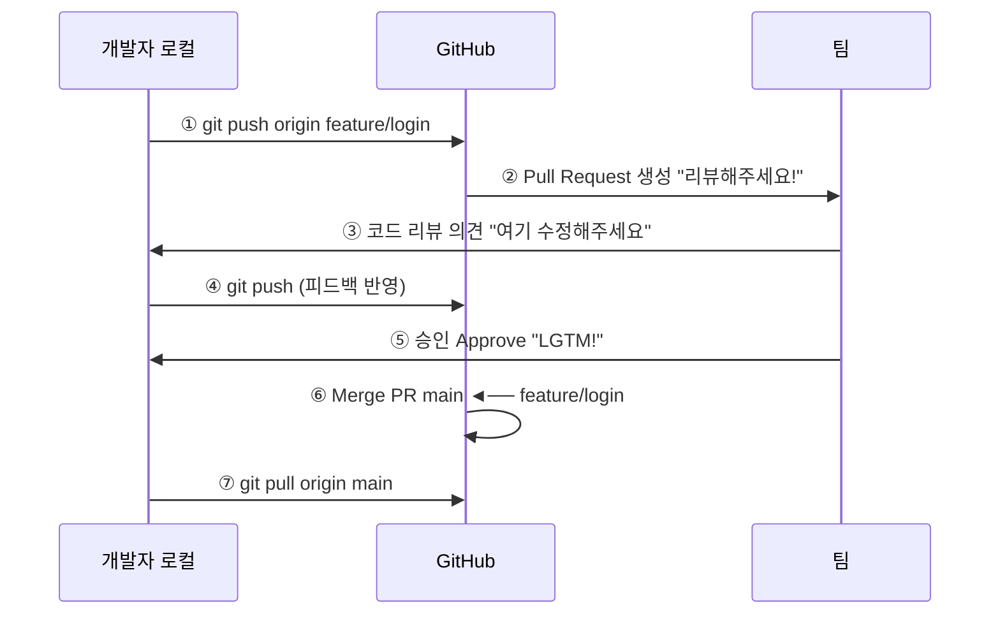

# Pull Request (PR) 이해하기

Pull Request(PR)는 GitHub의 핵심 협업 기능입니다. 브랜치의 변경 사항을 다른 브랜치(보통 main)에 병합해 달라고 요청하는 메커니즘으로, 코드 리뷰와 논의를 거친 후 병합할 수 있습니다.

## Pull Request의 흐름

```
PR 생명주기:

  [개발자 로컬]                        [GitHub]                        [팀]
      │                                  │                              │
      │ ① feature 브랜치 생성            │                              │
      │    및 작업                        │                              │
      │─────────────────────────────────►│                              │
      │    git push origin feature/login │                              │
      │                                  │                              │
      │                                  │ ② Pull Request 생성         │
      │◄─────────────────────────────────│──────────────────────────────│
      │                                  │   "리뷰해주세요!"              │
      │                                  │                              │
      │ ③ 코드 리뷰 의견 확인            │                              │
      │◄─────────────────────────────────│──────────────────────────────│
      │                                  │   "여기 수정해주세요"         │
      │                                  │                              │
      │ ④ 피드백 반영하여 추가 커밋       │                              │
      │─────────────────────────────────►│                              │
      │    git push origin feature/login │                              │
      │                                  │                              │
      │                                  │ ⑤ 승인 (Approve)            │
      │◄─────────────────────────────────│──────────────────────────────│
      │                                  │   "LGTM!" 👍                 │
      │                                  │                              │
      │                                  │ ⑥ 병합 (Merge PR)           │
      │                                  │   main ◄── feature/login    │
      │                                  │                              │
      │ ⑦ 로컬 main 업데이트             │                              │
      │◄─────────────────────────────────│                              │
      │    git pull origin main          │                              │
      │                                  │                              │
```



## PR 생성하기 (GitHub CLI)

```bash
# 1. feature 브랜치에서 작업
$ git switch -c feature/login-form
$ echo "<form>Login</form>" > login.html
$ git add . && git commit -m "로그인 폼 추가"
$ git push -u origin feature/login-form

# 2. GitHub CLI로 PR 생성
$ gh pr create --base main --head feature/login-form \
    --title "로그인 폼 추가" \
    --body "사용자 로그인을 위한 HTML 폼을 추가했습니다.

- 이메일/비밀번호 입력 필드
- 로그인 버튼
- 유효성 검사"

# 3. PR 확인
$ gh pr view --web
```

## PR 생성하기 (GitHub 웹)

GitHub 웹사이트에서도 PR을 생성할 수 있습니다.

1. 저장소 페이지에서 **Pull requests** 탭 클릭
2. **New pull request** 버튼 클릭
3. **base** (병합 대상)와 **compare** (병합할 브랜치) 선택
4. 변경 사항 확인 (diff)
5. 제목과 설명 작성
6. **Create pull request** 클릭

## 좋은 PR 작성법

### PR 제목 예시

```markdown
# ❌ 좋지 않은 예
Update files
Fix bug
WIP

# ✅ 좋은 예
[#42] 로그인 페이지 유효성 검사 추가
README 설치 방법 섹션 업데이트
결제 모듈 API 타임아웃 오류 수정
```

### PR 본문 템플릿 예시

```markdown
## 변경 사항 요약
로그인 폼에 클라이언트 측 유효성 검사를 추가했습니다.

## 관련 이슈
Closes #42

## 변경 사항
- 이메일 형식 검사 (@ 필수)
- 비밀번호 최소 길이 8자 확인
- 에러 메시지 한글화

## 테스트 방법
1. `npm run dev` 실행
2. http://localhost:3000/login 접속
3. 잘못된 이메일 형식 입력 → 에러 메시지 확인
4. 8자 미만 비밀번호 입력 → 에러 메시지 확인

## 스크린샷


## 리뷰어 참고 사항
유효성 검사 로직은 `src/utils/validation.js`에 위치합니다.
```

## 코드 리뷰와 피드백 반영

PR이 생성되면 팀원들이 리뷰를 시작합니다.

```bash
# 리뷰어가 코멘트를 남기면 로컬에서 수정
$ git switch feature/login-form
$ echo "수정된 코드" >> login.html
$ git add . && git commit -m "리뷰 반영: 이메일 형식 검사 수정"
$ git push origin feature/login-form
# PR에 자동으로 새로운 커밋이 추가됨!
```

### 리뷰 상태

| 상태 | 의미 |
|---|---|
| **Comment** | 의견만 남김 (승인/거절 아님) |
| **Approve** | 변경 승인, 병합 가능 |
| **Request Changes** | 수정 필요, 재리뷰 필요 |

## PR 병합하기

리뷰가 완료되면 병합합니다.

```bash
# GitHub CLI로 병합
$ gh pr merge feature/login-form --merge

# GitHub 웹에서 병합
# Merge pull request 버튼 클릭
```

### 병합 옵션

| 옵션 | 설명 | 그래프 |
|---|---|---|
| **Create a merge commit** | 모든 커밋 유지 + 병합 커밋 생성 | `---A---B---C---M` |
| **Squash and merge** | 여러 커밋을 하나로 압축 | `---A---B---C---S` (Squash) |
| **Rebase and merge** | 커밋을 그대로 재배치 (fast-forward) | `---A---B---C` |

**Squash 예시:**
```bash
# PR에 커밋이 5개 있을 때 "Squash and merge" 선택
# → main에는 1개의 커밋만 추가됨
# "로그인 기능 구현 (#42)" ← PR 제목이 커밋 메시지가 됨
```

## PR 브랜치 전략

```bash
# 로컬에서 PR 브랜치 가져오기
$ gh pr checkout 42          # PR #42의 브랜치를 로컬에 가져옴
$ git switch feature/login-form

# PR에 추가 커밋 푸시
$ git add . && git commit -m "리뷰 반영"
$ git push origin feature/login-form
```
