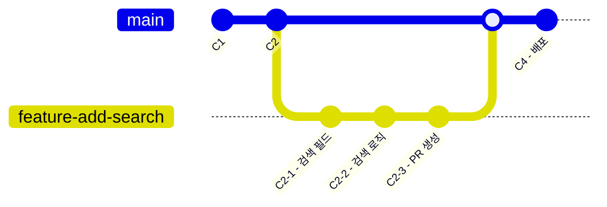
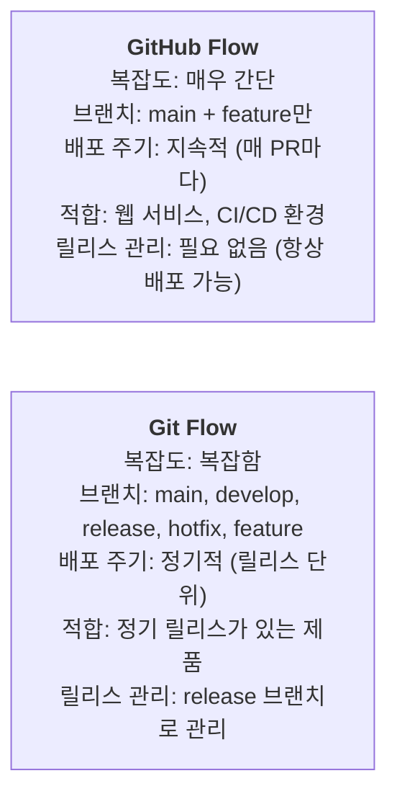

# GitHub Flow 워크플로우

GitHub Flow는 GitHub에서 권장하는 간단하면서도 효과적인 브랜치 전략입니다. 복잡한 규칙 없이도 지속적인 배포와 협업이 가능합니다.

## GitHub Flow의 핵심 원칙

1. **main 브랜치는 항상 배포 가능한 상태 유지**
2. **새 기능이나 버그 수정은 feature 브랜치에서 작업**
3. **feature 브랜치를 원격에 자주 푸시하여 백업**
4. **Pull Request로 코드 리뷰 요청**
5. **병합 후 즉시 배포 가능**

## GitHub Flow 워크플로우

**워크플로우 시각화:**



```bash
# 1. main 브랜치에서 시작 (최신 상태 유지)
$ git switch main
$ git pull origin main

# 2. 기능 개발을 위한 브랜치 생성
$ git switch -c feature/add-search
# (브랜치 이름은 간결하고 설명적으로!)

# 3. 코드 작성 및 커밋 (자주, 작게)
$ echo "search input" > search.html
$ git add . && git commit -m "검색 입력 필드 추가"
$ echo "search logic" > search.js
$ git add . && git commit -m "검색 로직 구현"

# 4. 원격에 푸시 (자주, 백업)
$ git push -u origin feature/add-search

# 5. GitHub에서 Pull Request 생성
$ gh pr create --base main --head feature/add-search \
    --title "검색 기능 추가" --body "..."

# 6. 팀원 리뷰 → 피드백 반영 → 추가 커밋
$ echo "검색 결과 페이지네이션 추가" >> search.js
$ git add . && git commit -m "리뷰 반영: 페이지네이션 추가"
$ git push origin feature/add-search
# PR에 자동 반영됨

# 7. PR 병합 (리뷰 완료 후)
$ gh pr merge feature/add-search --squash

# 8. 로컬 main 브랜치 업데이트
$ git switch main
$ git pull origin main

# 9. (선택) feature 브랜치 삭제
$ git branch -d feature/add-search
$ git push origin --delete feature/add-search
```

## GitHub Flow 예시 시나리오

### 시나리오: 긴급 버그 수정

```bash
# 1. main 브랜치에서 hotfix 브랜치 생성
$ git switch main
$ git switch -c hotfix/login-crash

# 2. 버그 수정
$ echo "fixed" > login.js  # 버그 수정 코드
$ git add . && git commit -m "로그인 크래시 버그 수정"

# 3. 원격에 푸시
$ git push -u origin hotfix/login-crash

# 4. PR 생성 및 긴급 리뷰 요청
$ gh pr create --base main --head hotfix/login-crash \
    --title "[핫픽스] 로그인 크래시 버그 수정" \
    --body "긴급! 로그인 시 널 포인터 예외 발생"

# 5. 리뷰 완료 후 바로 병합
$ gh pr merge hotfix/login-crash --merge

# 6. main 업데이트
$ git switch main && git pull origin main
```

### 시나리오: 여러 기능 동시 개발

```bash
# 개발자 A: 검색 기능
$ git switch -c feature/search
# ... 작업 ...

# 개발자 B: 결제 기능
$ git switch -c feature/payment
# ... 작업 ...

# 개발자 C: 프로필 페이지
$ git switch -c feature/profile
# ... 작업 ...

# 모두 각자 feature 브랜치에서 작업 후 PR → 리뷰 → 병합
# main 브랜치는 각 PR이 병합될 때마다 업데이트
```

## GitHub Flow vs Git Flow



## GitHub Flow의 모범 사례

```bash
# 1. Pull Request는 작게 유지 (코드 300줄 이하 권장)
# 2. PR 제목에 이슈 번호 포함: "[#42] 검색 기능 추가"
# 3. 커밋 메시지도 의미 있게
# 4. 리뷰어는 1~2명 지정
# 5. 병합 전에 CI 통과 확인 (Actions)

# GitHub Actions 상태 확인
$ gh pr checks 42
# 모두 초록색이어야 병합 가능!
```