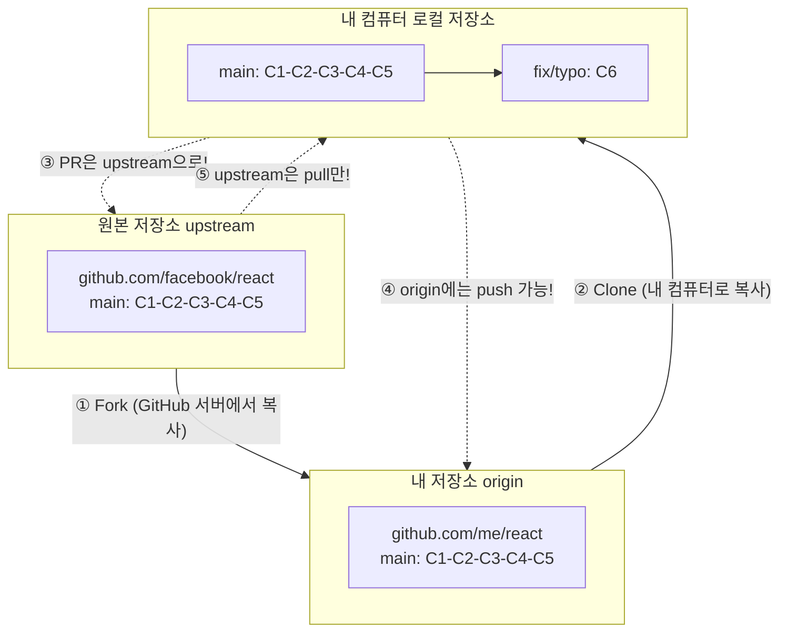

# Fork와 오픈소스 기여

Fork는 다른 사람의 GitHub 저장소를 자신의 계정으로 복사하는 기능입니다. 오픈소스 프로젝트에 기여할 때 사용하는 표준 방식입니다.

## Fork의 개념

```
Fork 관계도 (3개의 저장소):

  ┌─────────────────────────────────────────────┐
  │  원본 저장소 (upstream)                       │
  │  https://github.com/facebook/react           │
  │                                              │
  │  ┌──────────────────────────────────────┐    │
  │  │  main: C1 ── C2 ── C3 ── C4 ── C5   │    │
  │  └──────────────────────────────────────┘    │
  └───────────────────┬─────────────────────────┘
                      │
                      │ Fork (GitHub 서버에서 복사)
                      ▼
  ┌─────────────────────────────────────────────┐
  │  내 저장소 (origin)                          │
  │  https://github.com/me/react                │
  │                                              │
  │  ┌──────────────────────────────────────┐    │
  │  │  main: C1 ── C2 ── C3 ── C4 ── C5   │    │
  │  └──────────────────────────────────────┘    │
  └───────────────────┬─────────────────────────┘
                      │
                      │ Clone (내 컴퓨터로 복사)
                      ▼
  ┌─────────────────────────────────────────────┐
  │  내 컴퓨터 (로컬 저장소)                      │
  │  /Users/me/react                            │
  │                                              │
  │  원격:                                       │
  │    origin → https://github.com/me/react      │
  │    upstream → https://github.com/facebook/react│
  │                                              │
  │  ┌──────────────────────────────────────┐    │
  │  │  main: C1 ── C2 ── C3 ── C4 ── C5   │    │
  │  │  fix/typo:              └── C6       │    │
  │  └──────────────────────────────────────┘    │
  │                                              │
  │  💡 origin에는 push 가능!                     │
  │  💡 upstream에는 pull만 가능!                 │
  │  💡 PR은 upstream으로 보냄!                   │
  └─────────────────────────────────────────────┘
```



## Fork 기여 워크플로우

```bash
# 1. GitHub에서 원하는 프로젝트로 이동
#    "Fork" 버튼 클릭 → 내 계정으로 복사됨

# 2. 내 Fork를 로컬에 클론
$ git clone https://github.com/me/react.git
$ cd react

# 3. 원본 저장소를 upstream으로 추가
$ git remote add upstream https://github.com/facebook/react.git
$ git remote -v
origin    https://github.com/me/react.git (fetch)
origin    https://github.com/me/react.git (push)
upstream  https://github.com/facebook/react.git (fetch)
upstream  https://github.com/facebook/react.git (push)  # ← 주의: push 권한 없음!

# 4. 최신 코드로 동기화
$ git switch main
$ git pull upstream main    # 원본에서 최신 코드 가져오기
$ git push origin main      # 내 Fork에도 업데이트

# 5. 기능 개발 브랜치 생성
$ git switch -c fix/typo-in-readme

# 6. 수정 및 커밋
$ echo "fixed typo" >> README.md
$ git add . && git commit -m "README.md 오타 수정"

# 7. 내 Fork에 푸시
$ git push origin fix/typo-in-readme

# 8. GitHub에서 Pull Request 생성
#    "Compare & pull request" 버튼 클릭
#    base: owner/react main ← head: me/react fix/typo-in-readme
```

## 원본 저장소와 동기화 유지하기

오픈소스 기여 시 원본 저장소의 최신 변경 사항을 정기적으로 가져와야 합니다.

```bash
# 매일 아침: 원본 최신 코드로 동기화
$ git switch main
$ git pull upstream main          # 원본 최신 코드
$ git push origin main            # 내 Fork 업데이트

# feature 브랜치도 최신 main으로 리베이스
$ git switch feature/my-feature
$ git rebase main                  # feature 브랜치를 최신 main 위로
$ git push origin feature/my-feature --force-with-lease
```

## 오픈소스 기여 시뮬레이션

### 기여자로서:

```bash
# 1. VSCode에 기여한다고 가정
$ git clone https://github.com/me/vscode.git
$ cd vscode
$ git remote add upstream https://github.com/microsoft/vscode.git

# 2. 이슈 확인: "버그: 설정 창에서 오타 발견 (#12345)"
$ git switch -c fix/typo-in-settings

# 3. 오타 수정
$ vi src/settings.ts  # "langauge" → "language"
$ git add . && git commit -m "설정 창 오타 수정 (Fixes #12345)"
$ git push origin fix/typo-in-settings

# 4. GitHub에서 PR 생성 (PR #12346)
#    5분 후: 리뷰어가 코멘트 "다른 파일에도 같은 오타가 있습니다"
#    추가 수정
$ vi src/other-file.ts
$ git add . && git commit -m "리뷰 반영: 다른 파일 오타도 수정"
$ git push origin fix/typo-in-settings

# 5. 승인 후 병합 완료! 🎉
#    내 이름이 CONTRIBUTORS에 추가됨!
```

### 저장소 관리자로서:

```bash
# 기여자의 PR을 리뷰하고 병합
$ git checkout -b review/pr-12346 upstream/main
$ gh pr checkout 12346          # PR 브랜치 가져오기
# 코드 리뷰 후...
$ gh pr merge 12346 --squash   # Squash 병합
```

## Fork 전략 vs 브랜치 전략

| | Fork 전략 | 브랜치 전략 |
|---|---|---|
| **적용 대상** | 외부 기여자 (오픈소스) | 팀 내부 개발자 |
| **저장소 권한** | Fork는 누구나 가능 | 저장소 쓰기 권한 필요 |
| **브랜치 위치** | 기여자의 Fork에 생성 | 같은 저장소에 직접 생성 |
| **PR 방식** | cross-repo PR | same-repo PR |
| **장점** | 원본 보호, 자유로운 실험 | 간단한 워크플로우 |

## 유명 오픈소스 프로젝트 Fork 해보기

```bash
# 연습: React에 기여해보기
$ git clone https://github.com/me/react.git
$ cd react
$ git remote add upstream https://github.com/facebook/react.git

# 문서 오타 찾기
$ git log --oneline --since="1 week ago" | head -5
# 최근 변경 사항 확인

# "good first issue" 라벨 찾기
$ gh issue list --label "good first issue" --limit 5
# 초보자에게 적합한 이슈 목록 출력
```
