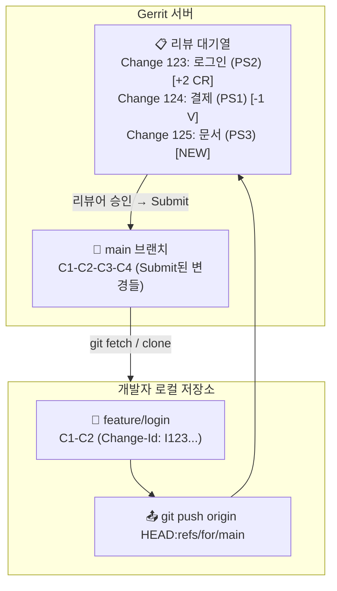

# Gerrit 소개

Gerrit는 Git 기반의 코드 리뷰 시스템입니다. GitHub와 달리 모든 커밋이 리뷰를 거쳐야 저장소에 반영되는 **리뷰 중심**의 워크플로우를 제공합니다. 주로 대규모 프로젝트(Android, Chrome 등)에서 사용됩니다.

## Gerrit vs GitHub

| 특징 | Gerrit | GitHub |
|---|---|---|
| **리뷰 방식** | 모든 변경이 리뷰 필수 | PR 선택적 사용 |
| **병합 방식** | 리뷰어가 승인 후 버튼 클릭 | PR 머지 버튼 |
| **Push 방식** | `refs/for/<branch>`로 push | 일반 push + PR |
| **변경 이력** | Patch Set으로 관리 | 일반 커밋 히스토리 |
| **대상** | 대규모 팀, 엄격한 리뷰 필요 | 모든 규모의 팀 |
| **설치** | 자체 호스팅 필요 | SaaS (클라우드) |

## Gerrit 워크플로우 개념

**Gerrit 전체 아키텍처와 데이터 흐름:**



## Gerrit 주요 용어

| 용어 | 설명 |
|---|---|
| **Change** | 하나의 PR 단위 (커밋 하나당 하나의 Change) |
| **Change-ID** | Change를 식별하는 고유 ID (커밋 메시지에 포함) |
| **Patch Set** | Change의 버전 (수정할 때마다 증가: PS1, PS2, ...) |
| **Reviewer** | 코드 리뷰를 수행하는 사람 |
| **Submit** | 리뷰 완료 후 변경을 병합하는 행위 |
| **+2 Verified** | CI/테스트 통과 확인 |
| **+2 Code-Review** | 코드 리뷰 승인 |
| **Label** | 리뷰 점수 (-2, -1, 0, +1, +2) |

## Gerrit 기본 사용 흐름

### 1. Clone 및 설정

```bash
# 저장소 클론
$ git clone ssh://username@gerrit.example.com:29418/my-project
$ cd my-project

# Commit-msg hook 설치 (Change-ID 자동 생성)
$ scp -p -P 29418 username@gerrit.example.com:hooks/commit-msg .git/hooks/
# 또는 curl로 다운로드
$ curl -Lo .git/hooks/commit-msg \
    http://gerrit.example.com/tools/hooks/commit-msg
$ chmod +x .git/hooks/commit-msg
```

### 2. 변경 사항 Push

```bash
# feature 브랜치에서 작업
$ git switch -c feature/add-login

# 코드 수정 후 커밋
$ echo "login page" > login.html
$ git add login.html

# Commit-msg hook이 Change-ID를 자동 추가
$ git commit -m "로그인 페이지 추가

로그인 폼 HTML과 기본 스타일을 추가했습니다.

Change-Id: I1234567890abcdef1234567890abcdef12345678"
```

### 3. 리뷰를 위해 Push

```bash
# 일반 push가 아니라 refs/for/main 으로 push
$ git push origin HEAD:refs/for/main

# 출력:
# remote: Uploading patch set 1 for change 123
# remote: https://gerrit.example.com/c/my-project/+/123
```

### 4. 리뷰 및 피드백 반영

```bash
# 리뷰어가 코멘트를 남김 ("login.html에 스타일이 없습니다")

# 수정 후 같은 Change에 새로운 Patch Set으로 push
$ echo "<style>body { font-family: sans-serif; }</style>" >> login.html
$ git add login.html

# 커밋 메시지 수정 (--amend로 같은 Change-ID 유지)
$ git commit --amend --no-edit

# 같은 refs/for/main으로 push → Patch Set 2 자동 생성
$ git push origin HEAD:refs/for/main

# 출력:
# remote: Uploading patch set 2 for change 123
# remote: https://gerrit.example.com/c/my-project/+/123
```

### 5. 리뷰 승인 및 Submit

```
Gerrit 웹 UI:
  Change 123: 로그인 페이지 추가
  ┌─────────────────────────────────────┐
  │ Patch Set 2                         │
  │                                     │
  │ -1 Verified   (CI 실패)             │
  │ +2 Code-Review (리뷰어 승인)        │
  │                                     │
  │ [Submit] 버튼 활성화!              │
  └─────────────────────────────────────┘

Submit 버튼 클릭 → main 브랜치에 병합!
```

## Gerrit 코드 리뷰 라벨

Gerrit의 라벨 시스템은 엄격한 리뷰 프로세스를 가능하게 합니다.

| 라벨 | 값 | 의미 |
|---|---|---|
| **Verified** | -1 | CI/테스트 실패 |
| | +1 | CI/테스트 통과 |
| | +2 | 추가 검증 완료 (선택 사항) |
| **Code-Review** | -2 | 강력 반대 (병합 불가) |
| | -1 | 의견: 수정 권장 |
| | 0 | 아직 리뷰 안 함 |
| | +1 | 의견: 괜찮음 |
| | +2 | 승인 (병합 가능) |

## Gerrit 명령어 모음

```bash
# 리뷰 요청을 위해 push
$ git push origin HEAD:refs/for/main

# WIP (Work In Progress)로 push
$ git push origin HEAD:refs/for/main%wip

# 특정 리뷰어 지정
$ git push origin HEAD:refs/for/main%r=reviewer@example.com

# CC 추가
$ git push origin HEAD:refs/for/main%cc=dev@example.com

# 리뷰어 + 주제(topic) 지정
$ git push origin HEAD:refs/for/main%r=alice@example.com,topic=login

# 특정 Change의 Patch Set 다운로드
$ git fetch ssh://user@host:29418/project refs/changes/23/123/2
$ git checkout FETCH_HEAD
```

## Gerrit 웹 UI 둘러보기

```
Gerrit 대시보드:
┌─────────────────────────────────────────────────┐
│  내 대기 중인 리뷰 (My Reviews)                 │
├─────────────────────────────────────────────────┤
│  ◆ Change 123: 로그인 페이지 추가          PS2  │
│  ◆ Change 124: 결제 API 연동               PS1  │
│  ◆ Change 125: 문서 업데이트               PS3  │
├─────────────────────────────────────────────────┤
│  내가 리뷰해야 할 변경 (Incoming Reviews)        │
├─────────────────────────────────────────────────┤
│  ◇ Change 126: 설정 파일 수정             PS1  │
│  ◇ Change 127: 버그 수정                   PS2  │
└─────────────────────────────────────────────────┘
```

## Gerrit의 Patch Set 관리

Patch Set은 Gerrit의 핵심 기능입니다. 각 버전의 변경 사항을 추적할 수 있습니다.

```
Patch Set 1: "로그인 페이지 추가" (첫 번째 시도)
  ─ login.html (30줄)

Patch Set 2: "로그인 페이지 추가" (스타일 추가)
  ─ login.html (35줄) ← 5줄 추가

Patch Set 3: "로그인 페이지 추가" (리뷰 반영)
  ─ login.html (38줄) ← 3줄 더 추가
  ─ style.css (20줄)  ← 새 파일

# Gerrit UI에서 PS1 → PS2 → PS3 간의 차이(diff)를 볼 수 있음
```

## Gerrit과 GitHub 비교 예시

### GitHub PR 방식:
```bash
$ git switch -c feature/login
$ echo "login" > login.html
$ git add . && git commit -m "로그인 추가"
$ git push origin feature/login
# → GitHub에서 "Compare & pull request" 클릭
# → PR 생성 → 리뷰 → Merge 버튼
```

### Gerrit 방식:
```bash
$ git switch -c feature/login
$ echo "login" > login.html
$ git add . && git commit -m "로그인 추가

Change-Id: I123..."
$ git push origin HEAD:refs/for/main
# → Gerrit이 Change 자동 생성
# → 웹 UI에서 리뷰 → Submit 버튼
# → main에 병합
```

## Gerrit 사용 팁

1. **Commit-msg hook 필수 설치** — Change-ID가 없으면 push가 거부됨
2. **`--amend`로 커밋 수정** — 같은 Change-ID 유지, 새로운 Patch Set 생성
3. **리뷰어는 미리 지정** — `%r=email` 옵션으로 push 시 리뷰어 자동 지정
4. **CI 결과 확인** — +1 Verified 필수, 실패 시 Submit 불가
5. **여러 커밋을 하나의 Change로** — squash 후 push
