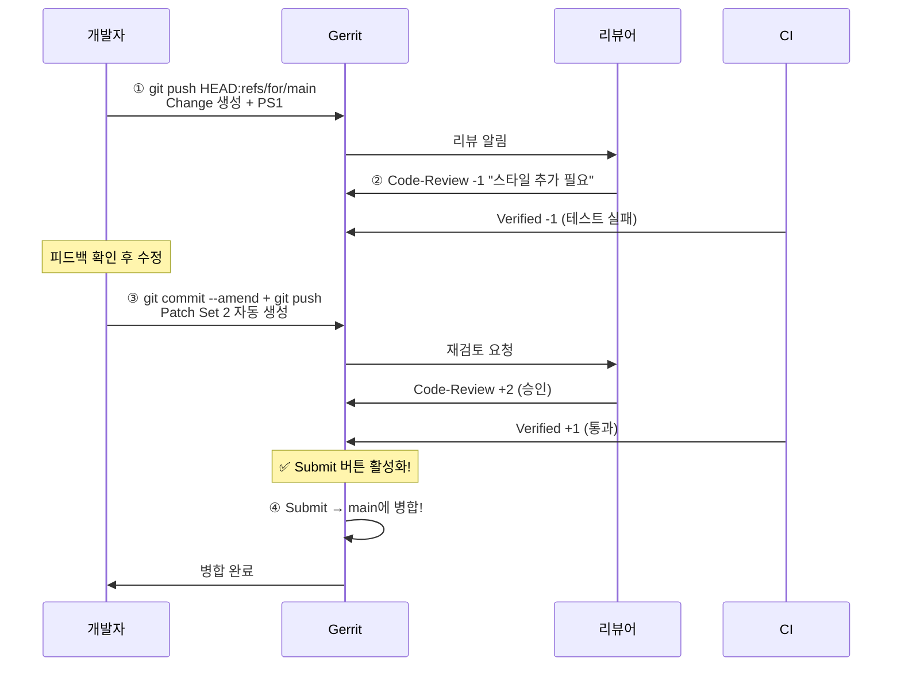

# Gerrit 코드 리뷰 프로세스

Gerrit의 코드 리뷰는 단순한 코드 확인을 넘어, 변경의 품질과 안정성을 보장하는 체계적인 프로세스입니다.

## 리뷰 프로세스 개요

**Gerrit 리뷰 라이프사이클 상세도:**



## 리뷰어의 역할

### 리뷰어 체크리스트

```
□ 코드 스타일이 팀 컨벤션을 따르는가?
□ 버그나 잠재적 문제가 없는가?
□ 테스트 코드가 포함되었는가?
□ 문서가 업데이트되었는가?
□ 보안 취약점은 없는가?
□ 성능에 영향을 주는가?
□ 변경이 너무 크지 않은가? (적절한 단위)
```

### 리뷰 코멘트 작성 예시

```
# ❌ 도움이 되지 않는 코멘트
"이 코드는 별로예요"
"수정하세요"

# ✅ 도움이 되는 코멘트
"이 부분은 변수명이 `pric`으로 되어 있는데 `price`가 맞는 것 같습니다.
  39번 줄에서 `price`를 사용하고 있으니 통일하는 것이 좋겠습니다."

"28-35번 줄의 중복 로직이 보입니다. `calculateTotal()` 함수로
  추출하면 가독성이 좋아질 것 같습니다."

"이 함수는 50줄이 넘습니다. 작은 함수들로 분리하는 것이
  유지보수에 좋을 것 같습니다."
```

## 리뷰 라벨 부여 기준

### Code-Review +2 승인 기준

```markdown
# +2를 주려면 다음 조건을 만족해야 함
1. 코드가 정확하고 버그가 없음
2. 코딩 컨벤션 준수
3. 적절한 테스트 포함
4. 문서 변경이 필요한 경우 함께 포함
5. 변경 범위가 적절함

# +1 조건
코드가 대체로 괜찮지만, 사소한 의견이 있음

# -1 조건
수정이 필요하지만, 전체적인 방향은 괜찮음

# -2 조건 (강력 반대)
변경 자체의 방향이 잘못되었거나, 심각한 문제가 있음
```

### Verified (CI) 기준

```yaml
# +1 Verified (Jenkinsfile 예시)
pipeline {
    agent any
    stages {
        stage('Build') {
            steps { sh 'npm run build' }
        }
        stage('Test') {
            steps {
                sh 'npm test'
                junit 'test-results/**/*.xml'
            }
        }
        stage('Lint') {
            steps { sh 'npm run lint' }
        }
    }
}
```

## 리뷰 댓글 명령어

Gerrit 웹 UI에서 댓글에 특수 명령어를 사용할 수 있습니다.

```
# 리뷰어 명령어
/patch set level comment       # 전체 Patch Set에 코멘트
/inline comment                # 특정 코드 라인에 코멘트
/reply                         # 답글

# 점수 부여 (드롭다운 메뉴)
Verified: +1 / -1
Code-Review: +2 / +1 / -1 / -2

# 작업 명령
/abandon                       # Change 포기 (작성자가 사용)
/restore                       # 포기된 Change 복원
/submit                        # 병합 실행 (권한 필요)
/rebase                        # 최신 target 브랜치로 리베이스
```

## 여러 리뷰어 협업

```bash
# 대규모 변경: 여러 리뷰어 지정
$ git push origin HEAD:refs/for/main%r=alice@example.com,r=bob@example.com,cc=charlie@example.com

# 리뷰어별 역할
alice@example.com   → 보안 전문가 (보안 리뷰)
bob@example.com     → 시니어 개발자 (일반 리뷰)
charlie@example.com → CC (참고만)
```

## 리뷰 거절 대응

```bash
# 리뷰어가 -2를 주고 변경을 거절한 경우

# 1. 코멘트 확인
# "이 접근 방식은 확장성이 부족합니다. 디자인 패턴을 고려해보세요."

# 2. 로컬에서 수정
$ git switch feature/login
# 완전히 새로운 접근 방식으로 코드 재작성

# 3. 동일 Change에 새로운 Patch Set push
$ git add .
$ git commit --amend -m "로그인 페이지 추가 (리팩토링)

디자인 패턴 적용으로 확장성 개선

Change-Id: I123..."  # 동일 Change-ID 유지
$ git push origin HEAD:refs/for/main

# 또는 Change를 포기하고 새로 시작
$ git push origin HEAD:refs/for/main%abandon
$ git reset HEAD~3  # 이전 커밋들 제거
# 새 브랜치에서 새로 시작
```

## Gerrit 대시보드 활용

```
My Reviews (내 리뷰 대상):
  ◇ Change 128: 설정 파일 수정              [PS2]
    Owner: you    |  Status: Needs Review
    +1 Code-Review (alice)
    -1 Verified (Jenkins)     ← CI 실패!

My Outgoing Reviews (내가 보낸 리뷰):
  ◆ Change 129: 검색 기능 추가              [PS3]
    Owner: you    |  Status: Awaiting Reviewer
    +2 Code-Review (bob)
    +1 Verified (Jenkins)
    → Ready to Submit! 🎉

Recently Closed:
  ✓ Change 120: README 업데이트              Merged
  ✗ Change 121: 실험적 기능                   Abandoned
```

## 리뷰 속도 높이는 팁

### 변경 작성자:
```bash
# 1. 변경을 작게 유지 (1시간 내 리뷰 가능한 크기)
# 2. 커밋 메시지에 변경 이유를 명확히 작성
# 3. 리뷰어를 미리 지정
$ git push origin HEAD:refs/for/main%r=alice@example.com,topic=login

# 4. CI 통과 후 리뷰 요청
# 5. 리뷰 코멘트에 빠르게 응답
```

### 리뷰어:
```bash
# 1. 하루에 2회 이상 리뷰 대시보드 확인
# 2. 24시간 이내에 첫 리뷰 완료 목표
# 3. 명확하고 건설적인 피드백
# 4. 작은 변경은 우선 처리
```
