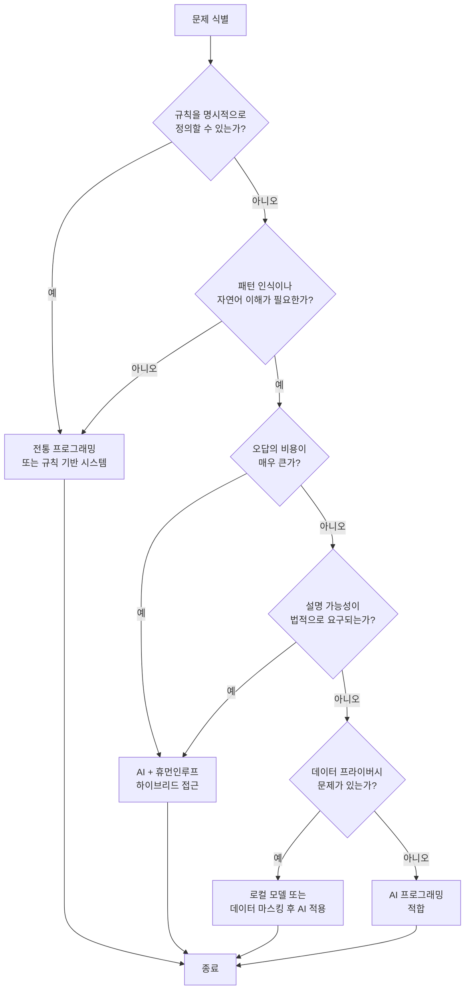

# 01장: AI 프로그래밍 개요

---

## 학습 목표

| 구분 | 내용 |
|------|------|
| **개념적 목표** | AI 프로그래밍이 전통적인 소프트웨어 개발과 어떻게 다른지 이해합니다. |
| **실천적 목표** | 일상 업무 문제를 식별하고 AI가 적합한 해결책인지 판단할 수 있습니다. |
| **분석적 목표** | 문제를 AI 적합성 기준에 따라 분류하는 프레임워크를 습득합니다. |
| **설계적 목표** | AI 시스템의 핵심 구성 요소(LLM, 맥락, 도구, 메모리)를 이해하고 설계에 반영합니다. |

---

## 실전 프로젝트: 일상 업무 문제를 AI로 해결하는 기획안 작성

### 프로젝트 개요

이번 장에서 배우는 개념을 종합하여 실제 업무에서 마주치는 문제를 AI로 해결하는 기획안을 작성하는 것이 이번 프로젝트의 목표입니다. 단순히 AI 도구를 사용하는 것을 넘어서, 문제를 분석하고 AI의 적합성을 판단하며 구체적인 접근 방안을 설계하는 역량을 기르는 데 초점을 맞춥니다.

이 프로젝트는 AI 프로그래밍의 첫걸음으로서, 앞으로 배울 모든 개념을 실제 맥락에서 적용해보는 기회를 제공합니다. 또한 자신이 선택한 문제를 해결하는 과정에서 AI 시스템 설계의 핵심 원리를 자연스럽게 체득할 수 있습니다.

### 프로젝트 진행 순서

첫째, 자신의 업무 또는 일상에서 반복적이면서도 시간이 많이 소요되는 문제를 하나 선정합니다. 예를 들어 "고객 문의에 대한 1차 응답 자동화", "회의록 요약 및 작업 항목 추출", "코드 리뷰 코멘트 자동 분류" 등이 좋은 대상입니다. 문제는 구체적일수록 좋으며, 해결했을 때의 효과를 정량적으로 측정할 수 있는 것이 바람직합니다.

둘째, 선정한 문제를 이 장에서 배울 문제 분류 프레임워크에 적용하여 AI가 적합한 해결책인지 판단합니다. 이 단계에서는 문제의 특성, 필요한 정확도, 윤리적 고려 사항 등을 종합적으로 검토합니다. 특히 AI가 문제를 해결할 수 있는지(Can AI?)와 AI가 문제를 해결해야 하는지(Should AI?)라는 두 가지 핵심 질문에 답해야 합니다.

셋째, AI 시스템의 네 가지 구성 요소(LLM, 맥락, 도구, 메모리)를 활용하여 구체적인 해결 방안을 설계합니다. 각 구성 요소가 문제 해결에서 어떤 역할을 담당할지 명확히 정의하는 것이 중요합니다. 예를 들어 고객 문의 자동화 시스템이라면 LLM은 문의를 이해하고 응답을 생성하며, 맥락은 회사의 정책과 과거 사례를 제공하고, 도구는 고객 데이터베이스를 조회하며, 메모리는 대화의 흐름을 유지하는 역할을 담당합니다.

넷째, 최종적으로 프로젝트 기획안을 문서화하여 발표하거나 팀과 공유합니다. 기획안에는 문제 정의, AI 적합성 판단 근거, 시스템 구성도, 예상 효과 및 한계점이 포함되어야 합니다. 이 과정을 통해 아이디어를 구체화하고 피드백을 수렴하여 더 나은 설계로 발전시킬 수 있습니다.

### 기대 효과

이 프로젝트를 통해 AI 프로그래밍을 단순한 코딩 기술이 아닌 문제 해결을 위한 전략적 사고로 바라보는 관점을 갖추게 됩니다. 또한 AI 시스템을 설계할 때 고려해야 할 핵심 요소들을 실전에서 적용하는 경험을 얻게 됩니다.

---

## 1.1 AI 프로그래밍이란 무엇인가

### 1.1.1 개념 정의

AI 프로그래밍은 인공지능 모델, 특히 대규모 언어 모델(LLM)과 효과적으로 소통하고 이를 시스템에 통합하여 문제를 해결하는 프로그래밍 패러다임입니다. 기존의 프로그래밍이 명시적인 알고리즘과 로직을 인간이 직접 작성하는 방식이었다면, AI 프로그래밍은 AI 모델에게 원하는 결과를 얻기 위한 지침을 설계하고 이 모델이 외부 도구 및 데이터와 상호작용하는 체계를 구축하는 작업에 가깝습니다.

이러한 패러다임의 전환은 개발자의 역할을 근본적으로 변화시켰습니다. 개발자는 더 이상 모든 절차를 세세하게 코딩할 필요 없이, AI 모델이 이해할 수 있는 방식으로 문제를 구조화하고 목표를 전달하는 방법에 집중하게 됩니다. 이는 전통적인 코딩보다 커뮤니케이션 능력과 시스템 설계 역량을 더 중요하게 만듭니다.

AI 프로그래밍의 핵심은 "무엇을 할 것인가"를 정의하는 것에 있습니다. 전통 프로그래밍이 "어떻게 할 것인가"를 상세히 지정하는 하향식 접근법이라면, AI 프로그래밍은 원하는 결과와 제약 조건을 정의하면 AI 모델이 최적의 경로를 찾아 실행하도록 하는 상향식 접근법에 가깝습니다.

그러나 AI 프로그래밍이 전통적인 프로그래밍을 완전히 대체하는 것은 아닙니다. 오히려 두 접근법은 상호 보완적이며, 효과적인 시스템을 구축하기 위해서는 두 패러다임을 적절히 혼합하는 능력이 필요합니다. AI가 처리하기 어려운 정밀한 계산이나 엄격한 규칙 기반 로직은 여전히 전통적인 코드로 작성해야 합니다.

### 1.1.2 전통 프로그래밍과 AI 프로그래밍의 비교

다음 표는 전통 프로그래밍과 AI 프로그래밍의 핵심 차이점을 여섯 가지 기준으로 비교한 것입니다.

| 비교 기준 | 전통 프로그래밍 | AI 프로그래밍 |
|-----------|----------------|---------------|
| **개발 방식** | 명시적 규칙과 알고리즘을 직접 코딩 | AI 모델에게 지침을 주고 결과물을 수렴 |
| **오류 대응** | 버그를 찾아 로직을 수정 | 프롬프트를 개선하거나 맥락을 보강 |
| **확장성** | 새로운 규칙이 추가될수록 복잡도 선형 증가 | 맥락과 예시만 추가하면 다양한 영역으로 확장 가능 |
| **결정 투명성** | 코드 실행 경로를 완전히 추적 가능 | 모델 내부 추론 과정을 완전히 파악하기 어려움 |
| **요구 역량** | 자료구조, 알고리즘, 언어 문법 숙련 | 문제 정의력, 커뮤니케이션 능력, 설계 감각 |
| **유지보수 방식** | 코드 리팩토링, 단위 테스트, 문서화 | 프롬프트 버전 관리, 평가 데이터셋 구축, A/B 테스트 |

전통 프로그래밍은 결정론적이며 예측 가능한 결과를 제공하는 장점이 있습니다. 동일한 입력에 대해 항상 동일한 출력이 보장되므로 금융 시스템, 임베디드 제어, 안전이 중요한 시스템에 적합합니다. 반면 AI 프로그래밍은 확률론적이며 유연하지만, 결과의 일관성을 보장하기 어려운 단점이 있습니다.

AI 프로그래밍의 가장 큰 강점은 명시적인 규칙을 작성하기 어려운 영역에서 탁월한 성능을 발휘한다는 점입니다. 자연어 이해, 이미지 인식, 창의적 글쓰기, 감정 분석 등 기존에는 인간만이 수행할 수 있었던 작업을 AI가 대체할 수 있게 되었습니다.

두 패러다임을 효과적으로 결합하는 것이 현대 AI 시스템 설계의 핵심입니다. 예를 들어 전통 프로그래밍으로 데이터 검증과 비즈니스 로직을 처리하고, AI 프로그래밍으로 자연어 이해와 콘텐츠 생성을 담당하는 하이브리드 아키텍처가 가장 일반적인 접근 방식입니다.

💡 예시: 나쁜 질문과 좋은 질문 비교

AI 프로그래밍에서 "무엇을 할 것인가"를 명확히 정의하는 것이 얼마나 중요한지 다음 두 비교를 통해 확인하십시오.

| 구분 | 나쁜 예 (모호한 질문) | 좋은 예 (구조화된 질문) |
|------|-----------------------|------------------------|
| **질문 내용** | "매출이 왜 떨어졌는지 분석해줘" | "지난 분기 제품군별 매출 데이터를 분석하여 매출 하락 원인을 3가지로 요약해 주십시오. 각 원인별로 매출 영향도를 퍼센트로 표시하고, 전년 동기 대비 증감률도 함께 제시해 주십시오." |
| **문제점 / 개선점** | 분석 대상 범위가 모호하고, 출력 형식이 지정되지 않음 | 구체적인 데이터 범위, 출력 형식, 정량적 기준을 모두 명시 |
| **AI 응답 품질 차이** | 일반적인 매출 하락 사유를 막연하게 나열 | 실제 데이터 기반의 구체적인 분석과 우선순위 제공 |

| 구분 | 나쁜 예 (맥락 부족) | 좋은 예 (맥락 풍부) |
|------|---------------------|---------------------|
| **질문 내용** | "이메일 좀 작성해줘" | "신규 가입 고객에게 발송하는 온보딩 환영 이메일을 작성해 주십시오. 친근하고 전문적인 어조를 사용하고, 회사 소개 3문장, 첫 이용 가이드 5단계, 고객센터 연락처를 포함해 주십시오. 전체 분량은 200자 내외로 작성해 주십시오." |
| **문제점 / 개선점** | 누가, 왜, 어떤 형식으로 작성해야 하는지 전혀 명시되지 않음 | 대상 독자, 목적, 포함 항목, 분량, 어조까지 구체적으로 지정 |
| **AI 응답 품질 차이** | 너무 일반적이거나 잘못된 톤의 이메일 생성 | 회사 정책과 상황에 맞는 즉시 사용 가능한 이메일 생성 |

이처럼 좋은 프롬프트는 AI 프로그래밍의 핵심 원칙인 "무엇을 할 것인가"를 명확히 정의합니다. 모호한 질문은 AI의 성능을 저하시키지만, 구조화된 질문은 AI가 최고의 결과를 내도록 이끕니다.

---

## 1.2 문제 분류 프레임워크: AI가 풀어야 할 문제인가?

### 1.2.1 프레임워크의 필요성

모든 문제를 AI로 해결하려는 접근은 현명하지 않습니다. AI는 특정 유형의 문제에 탁월하지만, 전통적인 알고리즘으로 더 효율적으로 해결할 수 있는 문제도 많습니다. 따라서 문제를 체계적으로 분석하고 AI의 적합성을 판단하는 프레임워크가 필수적입니다.

이 프레임워크는 두 가지 핵심 질문을 중심으로 구성됩니다. 첫 번째 질문은 "AI가 이 문제를 해결할 수 있는가(Can AI?)"이고, 두 번째 질문은 "AI가 이 문제를 해결해야 하는가(Should AI?)"입니다. 이 두 질문에 대한 답변에 따라 문제 해결 전략이 결정됩니다.

AI가 해결할 수 있는 문제의 특성은 명확합니다. 규칙을 명시적으로 정의하기 어렵고, 패턴 인식이 필요하며, 자연어 처리나 창의적 생성이 요구되는 문제가 이에 해당합니다. 반면 정확한 계산, 엄격한 규칙 준수, 완전한 결정 보장이 필요한 문제는 AI에 적합하지 않을 가능성이 높습니다.

AI가 해결해야 하는 문제의 판단에는 윤리적, 실용적, 경제적 고려 사항이 포함됩니다. 잘못된 결정이 심각한 피해를 초래할 수 있는 영역, 데이터 프라이버시가 중요한 영역, 또는 AI의 판단에 대한 설명이 법적으로 요구되는 영역에서는 신중한 접근이 필요합니다.

### 1.2.2 의사결정 흐름도

다음은 문제를 분석하고 AI 적합성을 판단하는 의사결정 흐름도입니다.

이 흐름도는 크게 네 가지 경로로 결과가 도출됩니다. 첫째, 규칙을 명시적으로 정의할 수 있는 문제는 전통 프로그래밍으로 해결합니다. 둘째, 패턴 인식이 필요하지만 오답의 비용이 큰 문제는 인간의 검증을 포함하는 하이브리드 방식을 채택합니다.

셋째, 설명 가능성이 법적으로 요구되는 영역(예: 신용 평가, 의료 진단) 역시 하이브리드 접근이 적합합니다. 넷째, 데이터 프라이버시 문제가 있는 경우 로컬 모델을 사용하거나 데이터를 마스킹하는 전처리 과정을 거친 후 AI를 적용합니다.

이러한 의사결정 과정은 프로젝트 초기 단계에서 반드시 수행되어야 합니다. 잘못된 판단은 개발 자원의 낭비뿐만 아니라 사용자에게 잘못된 결과를 제공하여 신뢰도를 떨어뜨리는 심각한 결과를 초래할 수 있습니다.

### 1.2.3 문제 유형별 AI 적합성 매트릭스

다음 표는 다양한 문제 유형별로 AI의 적합성을 정리한 것입니다.

| 문제 유형 | 예시 | AI 적합성 | 권장 접근법 |
|-----------|------|-----------|-------------|
| **자연어 이해** | 고객 문의 분류, 감정 분석 | 매우 높음 | LLM 기반 분류, Few-shot 학습 |
| **콘텐츠 생성** | 보고서 작성, 마케팅 카피 | 높음 | LLM + 휴먼 리뷰 |
| **패턴 인식** | 이상 거래 탐지, 추천 시스템 | 높음 | AI + 규칙 기반 필터 |
| **정형 데이터 분석** | 매출 집계, 통계 계산 | 낮음 | 전통 프로그래밍 |
| **안전 필수 판단** | 자율 주행, 의료 진단 | 중간 | AI + 휴먼인루프 |
| **창의적 설계** | 제품 디자인, 건축 설계 | 중간 | AI 보조 + 인간 결정 |
| **단순 반복 작업** | 데이터 입력, 양식 작성 | 매우 높음 | AI 자동화 |

💡 예시: AI 적합성 판단 — 세 가지 실제 문제 분석

다음은 실제 업무에서 마주칠 수 있는 세 가지 문제를 문제 분류 프레임워크에 적용하여 AI 적합성을 판단한 예시입니다.

| 문제 | 상세 설명 | AI 적합성 | 판단 근거 (Can AI? + Should AI?) |
|------|-----------|-----------|----------------------------------|
| **문제 A: 고객 문의 자동 분류** | 하루 500건의 고객 문의를 "배송/환불/기술/기타" 4개 카테고리로 자동 분류하는 시스템 | ✅ 적합 (AI 자동화) | • Can AI? → 패턴 인식 작업으로 LLM 분류에 적합, Few-shot 예시 제공 가능 • Should AI? → 오분류 비용이 낮고(재분류 가능), 시간 절감 효과 큼 |
| **문제 B: 퇴직금 정확 계산** | 각 직원의 근속연수와 급여를 기반으로 퇴직금을 계산하여 급여명세서에 반영 | ❌ 부적합 (전통 프로그래밍 권장) | • Can AI? → 가능하지만 불필요, 명확한 계산 공식 존재 • Should AI? → 100% 정확도 필요, AI의 확률적 출력은 위험, 규칙 기반 시스템이 더 효율적 |
| **문제 C: 고객 불만 응대 초안 작성** | 고객 불만 이메일에 대한 답변 초안을 작성하고 팀장이 최종 검토 후 발송 | ✅ 조건부 적합 (AI + 휴먼인루프) | • Can AI? → 창의적 글쓰기에 AI 적합 • Should AI? → 법적 리스크가 있는 최종 응답은 사람이 검증, 초안 작성까지만 AI 담당 |

이러한 판단 과정을 통해 모든 문제를 AI로 해결하려는 접근보다, 각 문제의 특성에 맞는 최적의 해결 방식을 선택할 수 있습니다.

---

## 1.3 AI 시스템의 구성 요소

### 1.3.1 네 가지 핵심 요소

AI 시스템은 크게 네 가지 구성 요소로 이루어집니다. 첫 번째는 LLM(Large Language Model)으로, 언어 이해와 생성을 담당하는 두뇌 역할을 수행합니다. 두 번째는 맥락(Context)으로, AI가 문제를 이해하고 적절한 답변을 생성하는 데 필요한 배경 정보와 지침을 제공합니다.

세 번째는 도구(Tool)로, AI가 외부 시스템이나 데이터 소스와 상호작용할 수 있게 해주는 인터페이스입니다. 네 번째는 메모리(Memory)로, AI가 이전 대화나 작업 내역을 기억하고 참조할 수 있게 해주는 저장소입니다. 이 네 가지 요소가 유기적으로 결합되어 하나의 완전한 AI 시스템을 구성합니다.

각 구성 요소는 독립적으로 존재하기보다는 상호 의존적인 관계를 가집니다. LLM의 성능은 맥락의 품질에 크게 의존하며, 도구의 설계는 LLM의 능력에 맞추어 최적화되어야 합니다. 메모리는 이러한 모든 상호작용의 지속성을 보장하는 기반 인프라입니다.

효과적인 AI 시스템을 설계하기 위해서는 이 네 가지 요소 각각에 대한 깊은 이해와 함께, 요소 간의 관계를 최적화하는 전체론적 관점이 필요합니다. 하나의 요소만 개선한다고 시스템 전체의 성능이 크게 향상되지는 않습니다.

### 1.3.2 LLM의 역할과 선택 기준

LLM은 AI 시스템의 중심에서 모든 언어 처리를 담당합니다. 사용자의 질문을 이해하고, 적절한 응답을 생성하며, 도구 호출이 필요한지를 판단하는 등 시스템의 지능적 판단을 수행합니다. 따라서 LLM의 선택은 시스템의 전반적인 품질을 결정짓는 가장 중요한 결정 중 하나입니다.

LLM을 선택할 때 고려해야 할 기준에는 응답 품질, 지연 시간, 비용, 컨텍스트 윈도우 크기, 지원 언어 등이 있습니다. 예를 들어 실시간 고객 응대 시스템이라면 지연 시간이 짧은 모델을 선택해야 하지만, 법률 문서 분석 시스템이라면 응답 품질과 컨텍스트 윈도우 크기가 더 중요한 기준이 됩니다.

또한 LLM의 강점과 약점을 이해하는 것도 중요합니다. 일부 모델은 논리적 추론에 강점이 있는 반면, 다른 모델은 창의적 글쓰기나 다국어 처리에 더 뛰어날 수 있습니다. 모델의 특성을 고려하여 설계를 최적화하는 것이 효과적인 AI 시스템 구축의 핵심입니다.

### 1.3.3 맥락 설계의 원칙

맥락은 AI가 올바른 판단을 내리기 위해 필요한 모든 정보를 포함합니다. 시스템 프롬프트, 사용자 입력, 과거 대화 내용, 외부 데이터 소스에서 가져온 정보 등이 모두 맥락에 포함될 수 있습니다. 효과적인 맥락 설계는 AI 시스템의 성능을 좌우하는 가장 중요한 요소입니다.

맥락 설계의 첫 번째 원칙은 관련성입니다. 모든 맥락 정보는 현재 작업과 직접적으로 관련되어야 하며, 불필요한 정보는 오히려 AI의 판단을 흐리게 할 수 있습니다. 두 번째 원칙은 구조화로, 정보를 논리적으로 조직하여 AI가 쉽게 참조할 수 있도록 해야 합니다.

세 번째 원칙은 최신성입니다. AI가 사용하는 맥락은 항상 최신 상태로 유지되어야 하며, 오래된 정보는 잘못된 판단의 원인이 될 수 있습니다. 네 번째 원칙은 계층화로, 중요한 정보를 먼저 배치하고 세부 사항은 이후에 제공하는 방식이 효과적입니다.

### 1.3.4 도구의 설계와 통합

도구는 AI 시스템이 외부 세계와 상호작용할 수 있게 해주는 인터페이스입니다. 데이터베이스 조회, API 호출, 파일 읽기 및 쓰기, 외부 서비스 연동 등이 도구의 대표적인 예시입니다. 잘 설계된 도구는 AI의 능력을 극대화하고 시스템의 활용 범위를 크게 확장합니다.

도구 설계의 핵심은 명확한 인터페이스를 제공하는 것입니다. 각 도구는 무엇을 하는 도구인지, 어떤 입력을 받고 어떤 출력을 반환하는지가 명확히 정의되어야 합니다. 또한 도구 호출의 결과는 AI가 이해할 수 있는 형태로 구조화되어 반환되어야 합니다.

도구를 설계할 때는 오류 처리도 중요하게 고려해야 합니다. AI가 도구를 잘못 호출하거나, 도구 실행 중 오류가 발생했을 때 이를 적절히 처리하고 AI에게 이해 가능한 오류 메시지를 전달하는 로직이 필요합니다. 또한 도구의 사용 빈도와 중요도에 따라 우선순위를 설정하고, 불필요한 도구 호출을 최소화하는 전략도 필요합니다.

### 1.3.5 메모리 전략

메모리는 AI 시스템이 대화의 연속성을 유지하고 학습한 정보를 저장하는 역할을 담당합니다. 단기 메모리는 현재 대화 세션 내에서의 맥락을 유지하는 데 사용되며, 장기 메모리는 여러 세션에 걸쳐 유용한 정보를 저장합니다.

메모리 전략을 설계할 때는 어떤 정보를 저장할지, 얼마나 오래 보관할지, 어떻게 검색할지 등을 결정해야 합니다. 예를 들어 고객 지원 시스템에서는 고객의 이전 문의 내역과 선호 사항을 장기 메모리에 저장하고, 현재 대화의 흐름은 단기 메모리에서 관리하는 방식이 효과적입니다.

메모리의 크기와 검색 효율성도 중요한 고려 사항입니다. 모든 정보를 무제한으로 저장하는 것은 비용과 성능 측면에서 비효율적이므로, 정보의 중요도와 최신성에 따라 저장 여부를 결정하고 효과적인 검색 메커니즘을 구현해야 합니다.

---

📝 연습 문제

**문제 1.** 다음 작업 각각에 대해 AI 프로그래밍이 적합한지 판단하고, 그 이유를 "Can AI?"와 "Should AI?" 두 가지 관점에서 설명하십시오.

1-1. 매월 말일 매출 데이터를 집계하여 엑셀 보고서를 생성하는 작업
1-2. 고객 후기 게시글을 분석하여 긍정/부정/중립으로 자동 분류하는 작업
1-3. 직원의 근무 시간과 시급을 입력받아 급여를 정확히 계산하는 작업
1-4. 신규 서비스에 대한 홍보 이메일 초안을 서로 다른 톤으로 3가지 버전 작성하는 작업

**문제 2.** 다음 상황을 읽고 AI 시스템의 네 가지 구성 요소(LLM, 맥락, 도구, 메모리)를 각각 구체적으로 설계하십시오.

*상황: 온라인 서점의 고객 지원 AI 시스템을 구축하려고 합니다. 고객이 "지난주에 주문한 책이 아직 도착하지 않았습니다"라고 문의했습니다.*

- LLM: 어떤 능력을 가진 모델을 선택해야 하며, 그 이유는 무엇입니까?
- 맥락: AI가 올바른 답변을 생성하기 위해 어떤 배경 정보가 필요합니까?
- 도구: 어떤 외부 시스템이나 데이터베이스 연동이 필요합니까?
- 메모리: 어떤 정보를 단기 메모리와 장기 메모리로 각각 저장해야 합니까?

📌 정답 및 해설

**문제 1 정답 및 해설**

**1-1. 매출 데이터 집계 및 엑셀 보고서 생성 — AI 부적합 (전통 프로그래밍 권장)**
이 작업은 정해진 계산 공식과 형식에 따라 데이터를 처리하는 정형 데이터 집계 작업입니다. Can AI 측면에서 AI가 이 작업을 수행할 수는 있지만, 명확한 규칙으로 정의 가능한 작업에 AI를 사용하는 것은 과잉 기술 적용에 해당합니다. Should AI 측면에서는 매출 데이터의 정확성이 재무 보고의 신뢰성과 직결되므로 100% 정확도가 요구되며, AI의 확률적 출력은 불필요한 위험을 초래합니다. 따라서 엑셀 매크로나 Python 스크립트 같은 전통 프로그래밍 방식이 더 효율적이고 안전합니다.

**1-2. 고객 후기 긍정/부정/중립 분류 — AI 적합**
이 작업은 자연어 이해와 패턴 인식이 필요한 전형적인 AI 적합 작업입니다. Can AI 측면에서 감정 분석은 LLM이 가장 탁월한 성능을 보이는 영역이며, Few-shot 예시를 통해 분류 기준을 제시하면 높은 정확도를 기대할 수 있습니다. Should AI 측면에서 분류 오류가 발생하더라도 재분류가 가능하여 오류 비용이 낮은 반면, 대량의 후기를 수동으로 분류하는 데 드는 시간과 비용을 획기적으로 절감할 수 있습니다. 따라서 AI 자동화 방식이 가장 적합합니다.

**1-3. 급여 계산 — AI 부적합 (전통 프로그래밍 권장)**
이 작업은 근무 시간과 시급을 곱하는 명확한 산술 공식에 기반한 결정론적 계산입니다. Can AI 측면에서 AI 모델이 사칙연산을 수행할 수는 있지만, 이는 계산기나 스프레드시트로 즉시 해결 가능한 문제로 AI가 필요하지 않습니다. Should AI 측면에서 급여 계산은 단 한 건의 오류도 허용되지 않는 중요 업무이며, AI의 결과를 매번 검증해야 한다면 오히려 업무 효율이 떨어집니다. 따라서 완전히 검증 가능한 전통 프로그래밍 방식이 반드시 사용되어야 합니다.

**1-4. 홍보 이메일 초안 3가지 버전 작성 — AI 적합**
이 작업은 창의적인 콘텐츠 생성이 필요한 작업으로 AI의 핵심 강점이 발휘되는 영역입니다. Can AI 측면에서 LLM은 다양한 톤과 스타일의 글쓰기에 탁월하여, 동일한 주제에 대해 서로 다른 느낌의 이메일을 동시에 생성하는 작업에 매우 적합합니다. Should AI 측면에서 생성된 초안은 사람이 최종 검토하는 휴먼인루프 방식을 적용할 수 있어 품질을 보장하면서도, 마케터가 여러 버전을 직접 작성하는 데 소요되는 시간을 크게 단축할 수 있습니다. 따라서 AI 보조 생성이 가장 효과적입니다.

**문제 2 정답 및 해설 — 온라인 서점 고객 지원 AI 시스템 구성 요소 설계**

**LLM:** 한국어 처리 능력이 뛰어나고 전자상거래 도메인의 맥락을 잘 이해하는 모델을 선택해야 합니다. 특히 배송 조회, 주문 확인, 환불 처리 등 외부 시스템과의 연동이 필요한 작업이 많으므로 Function Calling 기능을 지원하는 모델이 필수적입니다. 또한 고객 응대 시스템이라는 특성상 응답 지연 시간이 짧은 모델을 선택하여 원활한 사용자 경험을 제공하는 것도 중요한 고려 사항입니다.

**맥락:** AI가 올바른 답변을 생성하기 위해 필요한 배경 정보로는 온라인 서점의 배송 정책(일반 배송 기간, 지역별 배송 일정, 지연 시 안내 사항), 환불 및 교환 정책, 고객의 주문 정보(주문 번호, 주문 일자, 상품명, 현재 배송 상태), 그리고 회사의 고객 응대 가이드라인(응대 톤, 에스컬레이션 기준)이 포함되어야 합니다. 특히 고객이 "지난주에 주문한 책"이라고 구체적으로 언급하였으므로, 실시간 주문 데이터와 연동하여 실제 배송 상태를 확인하는 맥락이 가장 중요합니다.

**도구:** 가장 핵심적인 도구는 고객의 주문 내역과 현재 배송 상태를 조회하는 주문 조회 API입니다. 또한 배송사 추적 시스템과 연동하여 택배의 실제 위치 정보를 가져오는 배송 추적 API, 필요한 경우 환불이나 재배송을 처리하는 주문 처리 API가 함께 필요합니다. 각 도구는 AI 모델이 자율적으로 호출할 수 있도록 명확한 함수명, 설명, 파라미터 형식을 JSON 스키마로 정의해야 합니다.

**메모리:** 단기 메모리에는 현재 대화 세션에서 주고받은 모든 메시지와 고객이 언급한 주문 번호, 문의 유형 등의 맥락 정보를 저장하여 대화의 연속성을 유지합니다. 장기 메모리에는 고객의 이전 문의 이력, 선호하는 응대 방식, 과거 불만 사항 및 해결 내역을 저장하여 동일 고객이 재문의할 때 더 개인화된 서비스를 제공할 수 있도록 합니다. 이를 통해 반복적인 문제를 빠르게 인식하고 일관된 응대 품질을 유지할 수 있습니다.

---

## 한눈에 정리

이 장에서 배운 핵심 개념을 다음 표로 정리할 수 있습니다.

| 핵심 개념 | 설명 | 적용 포인트 |
|-----------|------|------------|
| **AI 프로그래밍의 정의** | AI 모델과 소통하여 문제를 해결하는 패러다임 | "어떻게"보다 "무엇을"에 집중 |
| **문제 분류 프레임워크** | Can AI? + Should AI? 의사결정 흐름 | 전통 vs AI vs 하이브리드 결정 |
| **LLM** | 언어 이해와 생성을 담당하는 두뇌 | 모델 선택이 시스템 품질 결정 |
| **맥락(Context)** | 문제 이해에 필요한 배경 정보 | 관련성, 구조화, 최신성, 계층화 |
| **도구(Tool)** | 외부 시스템과의 인터페이스 | 명확한 인터페이스와 오류 처리 |
| **메모리(Memory)** | 대화 연속성 유지와 정보 저장 | 단기/장기 메모리 전략 수립 |

전통적인 프로그래밍과 AI 프로그래밍은 대체 관계가 아니라 상호 보완 관계임을 이해하는 것이 중요합니다. 각각의 강점을 활용하여 하이브리드 시스템을 구축할 때 가장 효과적인 결과를 얻을 수 있습니다.

문제 분류 프레임워크는 프로젝트의 첫 단계에서 반드시 적용해야 할 도구입니다. AI가 적합한 문제인지, 아니라면 어떤 대안이 있는지를 체계적으로 판단함으로써 개발 자원을 효율적으로 사용할 수 있습니다.

AI 시스템의 네 가지 구성 요소(LLM, 맥락, 도구, 메모리)는 서로 긴밀하게 연결되어 있습니다. 하나의 요소에 최적화하는 것을 넘어, 전체 시스템의 균형을 고려한 설계가 필요합니다. 이 네 가지 요소에 대한 이해는 이후 장에서 배울 구체적인 설계 패턴의 기초가 됩니다.
