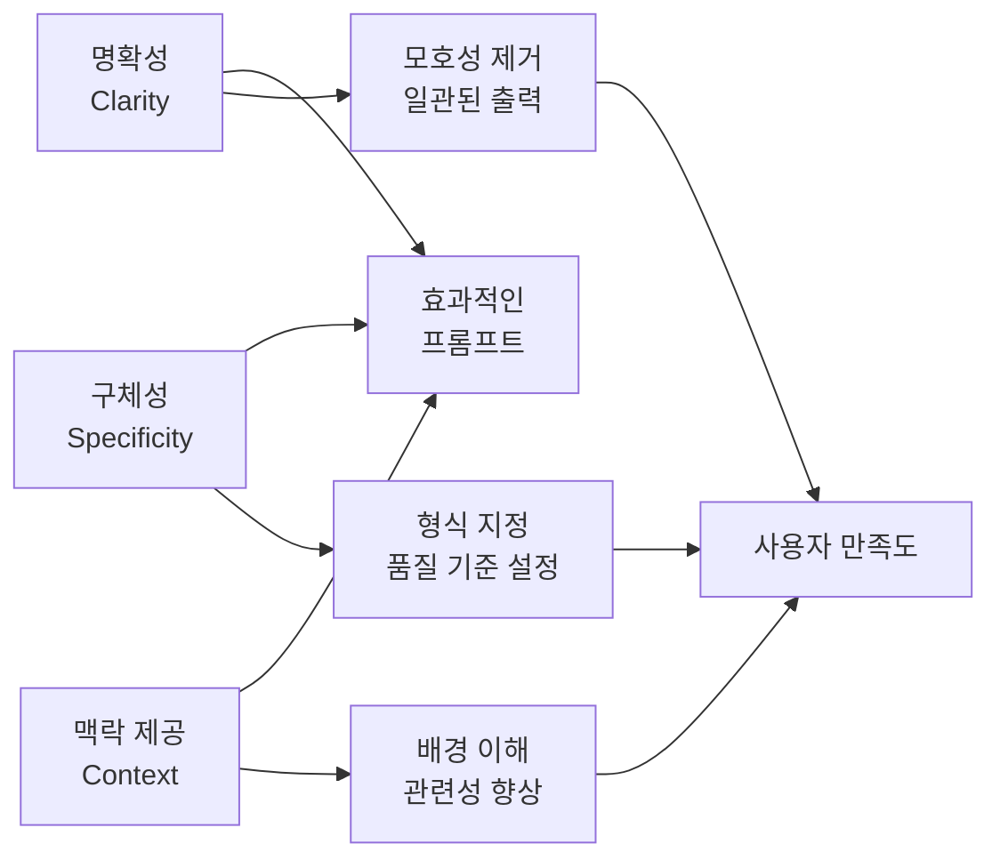
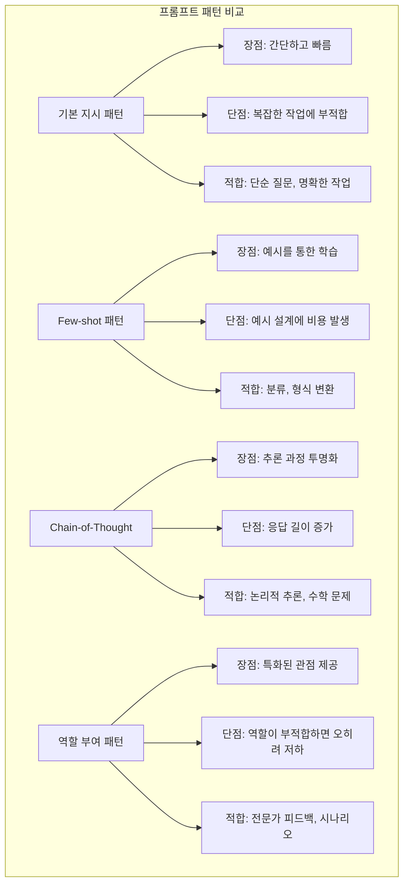

# 02장: AI와 대화하는 법 — 프롬프트 설계와 패턴

---

## 학습 목표

| 구분 | 내용 |
|------|------|
| **개념적 목표** | 프롬프트 설계의 핵심 원칙과 다양한 패턴의 차이를 이해합니다. |
| **실천적 목표** | 동일한 작업에 대해 서로 다른 프롬프트 패턴을 적용하고 결과를 비교할 수 있습니다. |
| **분석적 목표** | System/User/Assistant 역할의 설계 의도와 효과를 분석할 수 있습니다. |
| **최적화 목표** | 프롬프트를 반복 개선하고 A/B 테스트를 통해 최적의 결과를 도출하는 방법을 습득합니다. |

---

## 실전 프로젝트: 다양한 프롬프트 패턴 비교 실험

### 프로젝트 개요

이번 프로젝트는 동일한 작업을 여러 가지 프롬프트 패턴으로 작성하여 각 패턴의 효과와 특징을 비교 분석하는 실험입니다. 단순히 이론으로 패턴을 이해하는 것을 넘어, 실제로 프롬프트를 작성하고 결과를 관찰함으로써 각 패턴의 장단점을 체득하는 것이 목표입니다.

이 프로젝트를 통해 프롬프트 설계가 단순한 지시 전달이 아니라, AI 모델의 동작 방식을 이해하고 최적의 결과를 이끌어내는 전략적 커뮤니케이션임을 깨닫게 됩니다. 또한 상황에 따라 적절한 패턴을 선택하는 안목을 기를 수 있습니다.

### 프로젝트 진행 순서

첫째, 비교 실험에 사용할 기준 작업을 선정합니다. 예를 들어 "제품 리뷰를 긍정/부정/중립으로 분류하기", "회의록에서 핵심 결정 사항 추출하기", "기술 문서를 초보자용으로 요약하기" 등 명확한 평가 기준이 있는 작업이 좋습니다. 기준 작업이 명확할수록 패턴 간 비교가 용이합니다.

둘째, 동일한 작업에 대해 최소 네 가지 프롬프트 패턴(기본 지시, Few-shot, Chain-of-Thought, 역할 부여)을 각각 작성합니다. 각 프롬프트는 동일한 입력 데이터를 사용하되 패턴의 특성을 극대화하는 방식으로 설계합니다. 예를 들어 Chain-of-Thought 패턴에서는 추론 단계를 명시적으로 요청하고, Few-shot 패턴에서는 다양한 예시를 포함합니다.

셋째, 각 프롬프트를 동일한 AI 모델에 입력하여 결과를 수집합니다. 결과의 정확성, 완전성, 일관성, 응답 형식 등을 기준으로 비교 분석합니다. 이때 가능하다면 각 패턴별로 5회 이상 반복 실행하여 결과의 변동성을 함께 관찰하는 것이 좋습니다.

넷째, 비교 분석 결과를 표와 그래프로 시각화하여 각 패턴의 강점과 약점을 정리합니다. 예를 들어 Chain-of-Thought는 논리적 추론이 필요한 작업에서 높은 정확도를 보이지만 응답이 길어지는 경향이 있고, Few-shot은 예시와 유사한 패턴의 입력에서 일관된 결과를 제공합니다.

### 기대 효과

이 프로젝트를 통해 프롬프트 패턴을 이론이 아닌 실제 데이터를 기반으로 이해하게 됩니다. 또한 각 패턴이 어떤 상황에서 가장 효과적인지에 대한 실무적인 판단 기준을 확보할 수 있습니다.

---

## 2.1 프롬프트 설계의 핵심 원칙

### 2.1.1 프롬프트란 무엇인가

프롬프트는 AI 모델에게 전달하는 입력 메시지로, 모델이 수행해야 할 작업을 설명하고 원하는 결과를 얻기 위한 지침을 포함합니다. 단순한 질문에서부터 복잡한 작업 설명, 역할 부여, 예시 제공, 출력 형식 지정까지 프롬프트가 담을 수 있는 정보의 범위는 매우 넓습니다.

프롬프트의 품질은 AI 시스템의 출력 품질을 직접적으로 결정합니다. 아무리 강력한 AI 모델이라도 잘못된 프롬프트는 부정확하거나 무의미한 결과를 생성합니다. 따라서 프롬프트 설계는 AI 프로그래밍에서 가장 핵심적인 기술 중 하나입니다.

프롬프트 설계를 단순히 "질문을 잘하는 기술"로 이해해서는 안 됩니다. 이는 AI 모델의 동작 원리를 이해하고, 모델이 최적의 성능을 발휘할 수 있도록 입력을 구조화하는 공학적 설계 과정입니다.

### 2.1.2 세 가지 핵심 원칙

프롬프트 설계의 첫 번째 원칙은 명확성(Clarity)입니다. AI 모델이 모호함 없이 정확히 무엇을 해야 하는지 이해할 수 있도록 지시해야 합니다. 예를 들어 "이메일을 작성해줘"라는 프롬프트보다는 "새로운 고객 온보딩을 위한 환영 이메일을 작성해줘. 이메일은 친근하고 전문적인 톤으로, 회사 소개와 다음 단계 안내를 포함해야 해"와 같이 구체적인 지시가 더 효과적입니다.

두 번째 원칙은 구체성(Specificity)입니다. 원하는 출력의 형식, 길이, 톤, 포함해야 할 내용 등을 구체적으로 지정해야 합니다. 구체적인 프롬프트는 AI가 결과물을 생성할 때 참조할 명확한 기준을 제공하며, 이는 예측 가능하고 일관된 결과를 얻는 데 필수적입니다.

세 번째 원칙은 맥락 제공(Context)입니다. AI가 작업을 올바르게 이해하려면 충분한 배경 정보가 필요합니다. 누가, 왜, 어떤 상황에서 이 작업이 필요한지, 어떤 제약 조건이 있는지 등을 프롬프트에 포함함으로써 AI가 더 정확하고 관련성 높은 결과를 생성할 수 있습니다.

### 2.1.3 원칙 간의 관계

명확성, 구체성, 맥락 제공이라는 세 가지 원칙은 독립적으로 존재하는 것이 아니라 상호 보완적으로 작용합니다. 명확한 지시는 구체적인 형식 지정을 통해 더 강화되고, 충분한 맥락은 명확성과 구체성을 뒷받침하는 기반을 제공합니다.

이 세 가지 원칙이 균형을 이루어 적용될 때 최상의 프롬프트가 완성됩니다. 예를 들어 "고객 불만 이메일에 대한 응답을 작성해줘"라는 프롬프트는 명확하지만 구체성과 맥락이 부족합니다. 반면 "고객 불만 이메일에 대한 응답을 5문장 이내로 작성해줘. 전문적인 톤을 유지하고, 사과와 해결 방안을 포함해야 해. 회사의 정책은 3영업일 이내 환불에 관한 정책을 따라야 해"라는 프롬프트는 세 가지 원칙을 모두 충족합니다.

---

## 2.2 System / User / Assistant 역할 설계

### 2.2.1 세 가지 역할의 이해

AI 시스템에서 프롬프트는 크게 System, User, Assistant라는 세 가지 역할로 구분됩니다. 이 구조는 OpenAI의 Chat Completions API에서 처음 도입되었지만, 현재는 대부분의 LLM 인터페이스에서 표준으로 채택되고 있습니다.

System 역할은 AI 모델의 전반적인 행동 방식과 제약 조건을 정의하는 시스템 레벨의 지시사항입니다. 한 번 설정되면 이후의 모든 대화에 일관되게 적용되며, 모델의 페르소나, 응답 스타일, 윤리적 가이드라인 등을 지정하는 데 사용됩니다.

User 역할은 실제 사용자가 전달하는 입력을 나타냅니다. 질문, 요청, 명령 등 사용자의 의도가 담긴 메시지가 이 역할에 해당합니다. Assistant 역할은 AI 모델이 생성하는 응답으로, System 지시사항과 User 입력을 바탕으로 모델이 생성한 출력입니다.

### 2.2.2 역할별 설계 가이드라인

다음 표는 각 역할의 설계 가이드라인을 정리한 것입니다.

| 역할 | 목적 | 설계 포인트 | 예시 |
|------|------|------------|------|
| **System** | 모델의 행동 방식 정의 | 일관된 페르소나, 명확한 제약 조건, 출력 형식 지정 | "당신은 전문적인 고객 지원 상담원입니다. 항상 존댓말을 사용하고, 3단계 이내로 답변을 구성하세요." |
| **User** | 사용자의 의도 전달 | 구체적인 요청, 필요한 맥락 제공, 애매모호함 제거 | "지난주에 구매한 노트북에서 소음이 발생합니다. 환불 절차를 안내해주세요." |
| **Assistant** | 모델의 응답 생성 | System과 User의 지침을 종합하여 최적 응답 생성 | "고객님, 불편을 끼쳐드려 죄송합니다. 노트북 소음 문제에 대해 환불 절차를 안내드리겠습니다." |

System 프롬프트를 설계할 때는 너무 많은 제약을 동시에 부과하지 않도록 주의해야 합니다. 지나치게 많은 제약 조건은 모델의 자유도를 과도하게 제한하여 오히려 응답 품질을 저하시킬 수 있습니다. 가장 중요한 세 가지에서 다섯 가지 규칙에 집중하는 것이 효과적입니다.

User 프롬프트는 명확하고 구체적이어야 하지만, 동시에 자연스러운 대화 흐름을 유지하는 것이 중요합니다. 지나치게 인위적이거나 기계적인 프롬프트는 모델이 의도를 이해하는 데 오히려 방해가 될 수 있습니다.

Assistant 프롬프트는 일반적으로 모델이 자동으로 생성하지만, 특정 상황에서는 미리 정의된 응답 템플릿을 제공하는 Few-shot 접근 방식도 효과적입니다. 이는 특히 응답의 형식과 톤을 엄격히 제어해야 하는 경우에 유용합니다.

---

## 2.3 핵심 프롬프트 패턴

### 2.3.1 패턴의 분류와 개요

프롬프트 패턴은 특정 상황에서 효과적인 결과를 얻기 위해 정형화된 프롬프트 작성 방식을 말합니다. 각 패턴은 고유한 장단점을 가지고 있으며, 작업의 특성에 따라 적절한 패턴을 선택하는 것이 중요합니다.

이번 절에서는 실무에서 가장 널리 사용되는 네 가지 핵심 패턴을 다룹니다. 기본 지시 패턴(Basic Instruction), Few-shot 패턴, Chain-of-Thought(CoT) 패턴, 역할 부여 패턴(Role-playing)이 그것입니다.

각 패턴은 단독으로 사용될 수도 있지만, 실제로는 여러 패턴을 조합하여 사용하는 경우가 더 많습니다. 예를 들어 역할 부여 패턴의 프레임 안에서 Chain-of-Thought 추론을 요청하고, Few-shot 예시를 함께 제공하는 방식으로 복합 패턴을 구성할 수 있습니다.

### 2.3.2 패턴별 특징과 적용

### 2.3.3 기본 지시 패턴(Basic Instruction)

기본 지시 패턴은 가장 단순하면서도 가장 기본적인 프롬프트 작성 방식입니다. AI 모델에게 해야 할 작업을 직접적으로 지시하며, 추가적인 예시나 추론 과정 없이 명령어 형태로 프롬프트를 구성합니다.

이 패턴은 작업이 명확하고 직관적일 때 가장 효과적입니다. 예를 들어 "다음 텍스트를 영어로 번역해줘", "이 리스트를 알파벳 순으로 정렬해줘"와 같은 작업은 기본 지시만으로도 충분히 좋은 결과를 얻을 수 있습니다.

그러나 복잡한 추론이나 다단계 처리가 필요한 작업에서는 기본 지시 패턴만으로는 부족할 수 있습니다. 모델이 작업의 의도를 정확히 파악하지 못하거나, 예상치 못한 방식으로 결과를 생성할 가능성이 높기 때문입니다.

### 2.3.4 Few-shot 패턴

Few-shot 패턴은 프롬프트에 입력-출력의 예시 쌍을 포함시켜 모델이 원하는 패턴을 학습하도록 유도하는 방식입니다. 이 패턴의 핵심은 모델에게 "이런 입력에는 이런 출력이 나와야 한다"는 패턴을 보여주는 데 있습니다.

예시의 품질이 Few-shot 패턴의 성능을 결정합니다. 예시는 다양성을 가지고 있어야 하며, 실제로 모델이 처리할 데이터와 유사한 특성을 가져야 합니다. 또한 예시의 개수는 너무 적지도 많지도 않게, 보통 세 가지에서 다섯 가지 정도가 적절합니다.

Few-shot 패턴은 분류 작업, 형식 변환 작업, 특정 스타일의 콘텐츠 생성 작업에서 특히 효과적입니다. 모델이 예시를 통해 작업의 기준과 형식을 학습하므로, 명시적인 규칙을 설명하기 어려운 작업에서도 일관된 결과를 얻을 수 있습니다.

### 2.3.5 Chain-of-Thought 패턴

Chain-of-Thought(CoT) 패턴은 모델이 최종 답변에 도달하기까지의 추론 과정을 단계적으로 설명하도록 요청하는 방식입니다. 이 패턴을 사용하면 모델의 숨겨진 추론 과정이 투명해지고, 복잡한 문제에서도 정확도가 크게 향상됩니다.

CoT 패턴의 작동 원리는 모델이 사고의 흐름을 언어로 표현함으로써 자기 자신에게 단계적인 힌트를 제공한다는 데 있습니다. 이는 인간이 복잡한 문제를 풀 때 종이에 계산 과정을 적어가며 푸는 방식과 유사합니다. 추론 과정을 외부화함으로써 모델은 중간 단계에서의 오류를 스스로 발견하고 수정할 수 있습니다.

CoT 패턴은 수학 문제 풀이, 논리적 추론, 의사결정, 다단계 계획 수립 등에서 탁월한 성능 향상을 보여줍니다. 특히 한 번의 추론으로는 정답을 도출하기 어려운 복잡한 문제에서 그 효과가 두드러집니다.

### 2.3.6 역할 부여 패턴(Role-playing)

역할 부여 패턴은 AI 모델에게 특정 역할이나 페르소나를 부여하여 해당 관점에서 응답을 생성하도록 하는 방식입니다. "당신은 20년 경력의 변호사입니다", "당신은 초등학교 선생님입니다"와 같이 역할을 지정하면 모델이 그 역할에 맞는 어휘, 톤, 지식 수준으로 응답을 생성합니다.

역할 부여는 프롬프트의 맥락을 풍부하게 만드는 효과적인 방법입니다. 역할이 제공하는 추가적인 맥락 덕분에 모델은 더 정확하고 관련성 높은 응답을 생성할 수 있습니다. 또한 동일한 질문에 대해 다양한 관점의 답변을 얻고자 할 때도 유용합니다.

역할을 설정할 때는 구체적이고 현실적인 역할을 부여하는 것이 중요합니다. 모호한 역할보다는 구체적인 경력, 전문 분야, 상황을 함께 명시함으로써 역할의 효과를 극대화할 수 있습니다.

💡 예시: 프롬프트 패턴 비교 — 동일 요청, 다른 결과

다음은 "신규 서비스 런칭에 관한 보도자료 초안을 작성해 주십시오"라는 동일한 요청을 네 가지 패턴으로 작성했을 때의 차이점을 비교한 표입니다.

| 패턴 | 프롬프트 작성 예시 | 예상 결과의 특성 |
|------|--------------------|-------------------|
| **기본 지시** | "신규 서비스 'AI 노트'의 런칭 보도자료를 작성해 주십시오." | 무난한 수준의 초안을 빠르게 생성하지만, 차별화된 포인트나 전략적 강조가 부족 |
| **Few-shot** | "다음은 당사 과거 보도자료 예시 2건입니다. [예시1] [예시2] 위 예시와 동일한 형식, 톤, 구성으로 'AI 노트' 런칭 보도자료를 작성해 주십시오." | 회사의 기존 보도자료 스타일과 일관된 고품질 초안 생성, 형식 오류 최소화 |
| **Chain-of-Thought** | "신규 서비스 'AI 노트' 런칭 보도자료를 작성해 주십시오. 다음 순서로 생각하며 작성해 주십시오. 1) 핵심 메시지는 무엇인가 2) 타겟 독자는 누구인가 3) 강조할 차별점 3가지는 무엇인가 4) 기대 효과는 무엇인가" | 논리적 흐름과 설득력이 뛰어난 구조화된 초안, 기자 관점에서의 가치 전달 명확 |
| **역할 부여** | "당신은 10년 경력의 IT 분야 홍보 전문가입니다. 지금까지 50건 이상의 서비스 런칭 보도자료를 성공적으로 작성했습니다. 당신의 전문성과 업계 통찰력을 발휘하여 'AI 노트'의 런칭 보도자료를 작성해 주십시오." | 업계 용어와 전문성이 돋보이고, 기자의 관심을 끌만한 각도로 작성된 고급 초안 |

이 비교에서 알 수 있듯이, 동일한 작업이라도 패턴에 따라 결과물의 성격과 품질이 크게 달라집니다. 작업의 목적과 상황에 맞는 패턴을 선택하는 것이 중요합니다.

---

## 2.4 프롬프트 최적화 전략

### 2.4.1 반복 개선(Iterative Refinement)

프롬프트는 한 번에 완벽하게 작성되는 경우가 거의 없습니다. 대부분의 경우 프롬프트를 작성하고, 결과를 평가하고, 문제점을 분석하여 프롬프트를 수정하는 반복적인 개선 과정이 필요합니다. 이 과정을 프롬프트의 반복 개선(Iterative Refinement)이라고 합니다.

반복 개선의 첫 단계는 초기 프롬프트를 작성하고 실행하여 결과를 관찰하는 것입니다. 두 번째 단계에서는 결과에서 발견된 문제점을 분석합니다. 응답이 너무 일반적인가? 형식이 요청과 다른가? 중요한 정보가 누락되었는가? 이러한 질문에 답하면서 개선 방향을 도출합니다.

세 번째 단계에서는 분석 결과를 바탕으로 프롬프트를 수정합니다. 이때는 하나의 문제만 집중적으로 개선하는 것이 좋습니다. 여러 문제를 동시에 수정하려고 하면 어떤 변경이 어떤 효과를 가져왔는지 파악하기 어렵기 때문입니다.

### 2.4.2 A/B 테스트

A/B 테스트는 두 가지 이상의 프롬프트 변형을 동일한 조건에서 비교하여 더 효과적인 프롬프트를 선별하는 방법입니다. 이 방법은 주관적인 판단을 배제하고 데이터 기반으로 프롬프트를 최적화할 수 있게 해줍니다.

A/B 테스트를 수행할 때는 비교하려는 한 가지 변수 외에는 모든 조건을 동일하게 유지해야 합니다. 예를 들어 Chain-of-Thought 패턴의 효과를 테스트한다면, 같은 작업에 대해 CoT를 적용한 프롬프트와 적용하지 않은 프롬프트를 동일한 모델과 동일한 입력으로 실행해야 합니다.

테스트 결과의 평가 기준은 작업의 특성에 따라 달라집니다. 정확도가 중요한 작업, 응답 속도가 중요한 작업, 사용자 만족도가 중요한 작업 등 각 작업의 목표에 맞는 평가 지표를 설계해야 합니다.

---

📝 연습 문제

**문제 1.** 다음 시나리오 각각에 가장 적합한 프롬프트 패턴(기본 지시, Few-shot, Chain-of-Thought, 역할 부여)을 선택하고, 선택한 이유를 설명하십시오.

1-1. 영업팀이 매월 작성하는 20페이지 분량의 월간 보고서를 1페이지 요약본으로 압축해야 합니다. 기존에 팀장이 직접 작성한 요약본 예시가 5개 있습니다.
1-2. 복잡한 수학 문제를 풀고 각 단계별로 풀이 과정을 검증할 수 있는 시스템을 구축해야 합니다.
1-3. 신입 사원을 위한 회사 복지 제도 안내문을 작성해야 합니다. 기존에 작성된 유사 자료나 예시가 전혀 없습니다.
1-4. 고객 리뷰를 '매우 긍정', '긍정', '중립', '부정', '매우 부정'의 5단계로 분류해야 합니다. 분류 기준이 모호하여 구체적인 예시를 통해 기준을 설명해야 합니다.

**문제 2.** 다음 두 프롬프트를 비교하여 어느 쪽이 더 효과적인지 판단하고, 2.1절의 세 가지 핵심 원칙(명확성, 구체성, 맥락 제공) 측면에서 분석하십시오.

- 프롬프트 A: "이 기사 요약해줘"
- 프롬프트 B: "다음 IT 업계 뉴스 기사를 3문장으로 요약해 주십시오. 대상 독자는 주니어 개발자이며, 기술적 용어는 유지하되 괄호로 간단한 설명을 추가해 주십시오."

**문제 3.** 당신은 AI 고객 지원 시스템을 설계하고 있습니다. 사용자가 "지난달 내 지출 내역을 분석해 주세요"라고 요청했습니다. System 프롬프트와 User 프롬프트를 각각 작성하십시오. (System 프롬프트에는 AI의 역할과 행동 제약 조건을, User 프롬프트에는 구체적인 분석 요청 사항을 포함하십시오.)

📌 정답 및 해설

**문제 1 정답 및 해설**

**1-1. 월간 보고서 1페이지 요약본 압축 — Few-shot 패턴**
기존 팀장이 직접 작성한 요약본 예시 5개가 이미 존재하므로, Few-shot 패턴이 가장 효과적입니다. Few-shot 패턴은 입력-출력 예시 쌍을 프롬프트에 포함시켜 모델이 원하는 형식과 톤을 학습하도록 유도하는 방식입니다. 기존 요약본 예시를 제공하면 AI가 팀장의 요약 스타일, 강조하는 항목, 문장 구성 방식을 학습하여 일관된 품질의 요약문을 생성할 수 있습니다. 이는 단순한 기본 지시로는 재현하기 어려운 미묘한 스타일의 일관성을 확보할 수 있다는 점에서 큰 장점입니다.

**1-2. 복잡한 수학 문제 풀이 과정 검증 — Chain-of-Thought 패턴**
수학 문제는 정답뿐 아니라 풀이 과정의 논리적 타당성도 함께 검증할 수 있어야 하므로 Chain-of-Thought 패턴이 가장 적합합니다. CoT 패턴은 모델이 최종 답변에 도달하기까지의 추론 과정을 단계적으로 설명하도록 요청하며, 이를 통해 각 단계의 논리적 오류를 사람이 검증할 수 있습니다. 수학 문제 풀이에서는 한 번의 추론으로 정답을 도출하기 어려운 경우가 많으며, 중간 계산 과정에서의 실수를 발견하고 수정하는 것이 중요하므로 CoT의 단계적 접근 방식이 필수적입니다.

**1-3. 신입 사원 복지 제도 안내문 작성 — 기본 지시 패턴**
기존에 작성된 유사 자료나 예시가 전혀 없으므로, 명확하고 구체적인 기본 지시 패턴이 가장 적합합니다. 기본 지시 패턴에서 중요한 것은 작업의 목적, 대상 독자, 포함해야 할 내용, 출력 형식 등을 상세히 지정하는 것입니다. 예를 들어 "신입 사원을 대상으로 회사 복지 제도를 안내하는 문서를 작성해 주십시오. 건강보험, 퇴직연금, 유급휴가, 자기계발비 항목을 각각 3문장씩 설명하고, 전체적으로 친근하고 이해하기 쉬운 어조를 사용해 주십시오."와 같이 구체적인 지침을 제공하면 예시 없이도 양질의 결과를 얻을 수 있습니다.

**1-4. 고객 리뷰 5단계 감성 분류 — Few-shot 패턴**
분류 기준이 모호하여 구체적인 예시를 통해 기준을 설명해야 하는 상황이므로 Few-shot 패턴이 가장 효과적입니다. Few-shot 패턴에서는 각 분류 단계(매우 긍정, 긍정, 중립, 부정, 매우 부정)에 해당하는 실제 리뷰 예시를 2~3개씩 제공하여 모델이 분류의 경계를 학습하도록 합니다. 예를 들어 "배송이 정말 빨라요!"는 긍정으로, "제품이 완전 마음에 들지 않아요"는 부정으로 분류하는 예시를 보여주면, 모호한 표현이 포함된 리뷰에서도 일관된 분류 기준을 적용할 수 있습니다.

**문제 2 정답 및 해설 — 프롬프트 A와 B의 효과 비교 분석**

프롬프트 B가 프롬프트 A보다 세 가지 핵심 원칙 측면에서 모두 우월합니다.

**명확성(Clarity) 측면:** 프롬프트 A는 "요약해줘"라는 모호한 지시만 포함하여 AI가 무엇을 요약해야 하는지, 어떤 수준으로 요약해야 하는지를 알 수 없습니다. 반면 프롬프트 B는 "IT 업계 뉴스 기사"라는 대상을 명확히 지정하고 "3문장으로 요약"이라는 구체적인 분량 기준을 제시하여 AI가 정확히 수행해야 할 작업을 명확히 이해할 수 있습니다.

**구체성(Specificity) 측면:** 프롬프트 A는 출력 형식에 대한 어떤 기준도 제공하지 않아 AI가 임의의 형식과 길이로 응답할 가능성이 높습니다. 프롬프트 B는 "3문장", "기술적 용어는 유지하되 괄호로 간단한 설명 추가" 등 출력의 형식과 스타일을 구체적으로 지정하여 예측 가능하고 일관된 결과를 보장합니다.

**맥락 제공(Context) 측면:** 프롬프트 A는 요약의 목적과 대상 독자에 대한 맥락이 전혀 없어 AI가 누구를 위한 요약인지 파악할 수 없습니다. 프롬프트 B는 "대상 독자는 주니어 개발자"라는 맥락을 제공하여 AI가 독자의 수준과 필요에 맞게 용어 설명의 깊이와 내용의 난이도를 조절할 수 있게 합니다.

**문제 3 정답 및 해설 — System 프롬프트와 User 프롬프트 설계**

**System 프롬프트 예시:**
"당신은 은행의 AI 재무 분석 전문가입니다. 사용자의 금융 데이터를 분석하여 이해하기 쉬운 인사이트를 제공하는 역할을 수행합니다. 모든 응답은 존댓말을 사용하고, 전문적이면서도 친근한 어조를 유지하십시오. 민감한 금융 정보는 구체적인 숫자보다는 추세와 패턴 중심으로 설명하고, 투자 조언이나 재정 결정을 내리는 대신 객관적인 분석 정보만 제공하십시오. 출력은 항상 카테고리별 지출 내역, 전월 대비 증감률, 그리고 주요 인사이트로 구성하십시오."

**User 프롬프트 예시:**
"지난달 제 계좌의 지출 내역을 분석해 주세요. 먼저 식비, 교통비, 쇼핑, 주거비, 문화생활 카테고리별로 지출 금액과 비중을 알려주십시오. 그다음으로 전월 대비 증감률이 가장 큰 카테고리를 식별하고 그 이유를 추정해 주십시오. 마지막으로 전체 지출 패턴에서 발견된 특이 사항이나 절약 가능한 영역이 있다면 제안해 주십시오. 출력은 번호 목록 형식으로 각 항목을 구분하여 작성해 주십시오."

---

## 한눈에 정리

이 장에서 배운 핵심 내용을 다음 표로 정리합니다.

| 구분 | 핵심 개념 | 실무 적용 |
|------|-----------|-----------|
| **프롬프트 설계 원칙** | 명확성, 구체성, 맥락 제공 | 프롬프트 작성 시 세 가지 원칙을 체크리스트로 활용 |
| **역할 설계** | System/User/Assistant 구분 | System은 행동 규칙, User는 구체적 요청, Assistant는 응답 템플릿 |
| **기본 지시 패턴** | 직접적 명령 방식 | 단순하고 명확한 작업에 적합 |
| **Few-shot 패턴** | 예시를 통한 패턴 학습 | 분류, 형식 변환, 스타일 지정에 효과적 |
| **Chain-of-Thought** | 단계적 추론 과정 설명 | 복잡한 추론, 수학 문제, 의사결정에 강력 |
| **역할 부여 패턴** | 특정 관점에서의 응답 생성 | 전문가 조언, 시나리오 분석에 유용 |
| **최적화 전략** | 반복 개선 + A/B 테스트 | 데이터 기반의 체계적인 프롬프트 개선 |

프롬프트 설계는 AI 프로그래밍의 핵심 기술입니다. 단순히 질문을 던지는 것을 넘어, AI 모델이 최적의 성능을 발휘할 수 있도록 입력을 설계하는 공학적 과정임을 이해해야 합니다.

다양한 프롬프트 패턴을 상황에 맞게 조합하여 사용할 때 가장 효과적인 결과를 얻을 수 있습니다. 정답은 없으며, 지속적인 실험과 개선을 통해 자신만의 프롬프트 설계 방법론을 발전시켜 나가는 것이 중요합니다.

반복 개선과 A/B 테스트는 프롬프트 최적화의 핵심 도구입니다. 주관적인 판단에 의존하지 않고, 체계적인 실험과 데이터 분석을 통해 프롬프트를 지속적으로 개선하는 습관이 필요합니다.

## 2.5 AI 프로그래밍 핵심 Skills

프롬프트 설계를 넘어, AI 시스템을 효과적으로 구축하기 위해 반드시 익혀야 할 실전 스킬들이 있습니다. 이 스킬들은 단순한 프롬프트 작성 기술이 아니라, AI와 협업하여 소프트웨어를 개발하는 전반적인 사고방식과 방법론을 포함합니다. 각 스킬은 독립적으로 사용될 수도 있지만, 실제로는 서로 유기적으로 결합되어 더 강력한 효과를 발휘합니다.

### 2.5.1 Skill 1: 문제 분해와 구조화 (Decomposition)

AI 시스템을 설계할 때 가장 먼저 필요한 스킬은 복잡한 문제를 작은 단위로 분해하는 능력입니다. 하나의 거대한 요청을 AI에게 던지면 모호한 결과를 얻을 확률이 높지만, 문제를 논리적 하위 작업으로 나누어 각각을 명확히 지시하면 훨씬 정확하고 통제 가능한 결과를 얻을 수 있습니다.

문제 분해는 세 가지 수준에서 이루어집니다. 첫째, 비즈니스 수준에서는 전체 서비스를 독립적인 기능 단위로 분할합니다. 예를 들어 "고객 지원 시스템"이라는 큰 문제를 "질문 분류", "정보 검색", "답변 생성", "감정 분석"이라는 하위 기능으로 나누는 것입니다. 둘째, 작업 수준에서는 각 기능을 수행하기 위한 구체적인 단계를 정의합니다. 셋째, 프롬프트 수준에서는 각 단계를 AI가 이해할 수 있는 명확한 지시로 변환합니다.

효과적인 문제 분해는 AI 시스템의 유지보수성과 확장성을 크게 향상시킵니다. 각 하위 작업은 독립적으로 테스트하고 개선할 수 있으며, 한 부분의 변경이 전체 시스템에 미치는 영향을 최소화할 수 있습니다. 또한 문제 분해는 AI의 환각 위험을 줄이는데, 각 단계가 좁고 명확한 범위를 가지므로 AI가 벗어난 답변을 생성할 가능성이 낮아집니다.

| 분해 수준 | 대상 | 예시 |
|-----------|------|------|
| **비즈니스 수준** | 전체 서비스 기능 | 질문 분류 → 정보 검색 → 답변 생성 → 감정 분석 |
| **작업 수준** | 각 기능의 단계 | 질문 분류: 의도 파악 → 키워드 추출 → 카테고리 매핑 |
| **프롬프트 수준** | 각 단계의 지시 | "사용자 질문에서 의도를 다음 중 하나로 분류하세요: [문의, 불만, 칭찬]" |

### 2.5.2 Skill 2: 컨텍스트 설계 (Context Design)

AI 모델이 양질의 출력을 생성하기 위해서는 충분하고 적절한 맥락 정보가 필요합니다. 컨텍스트 설계는 AI에게 어떤 정보를, 어떤 형태로, 어떤 시점에 제공할지를 결정하는 스킬입니다. 이는 단순히 많은 정보를 제공하는 것이 아니라, 필요한 정보를 효과적으로 구조화하여 전달하는 능력을 의미합니다.

컨텍스트는 크게 세 가지 유형으로 구분할 수 있습니다. 정적 컨텍스트는 시스템의 역할, 행동 규칙, 상수 데이터 등 변하지 않는 정보입니다. 동적 컨텍스트는 사용자 입력, 검색 결과, API 응답 등 실시간으로 변화하는 정보입니다. 누적 컨텍스트는 대화 이력, 사용자 선호도, 이전 결정 사항 등 시간에 따라 축적되는 정보입니다. 각 유형의 컨텍스트는 적절한 저장소와 갱신 전략이 필요합니다.

컨텍스트 설계에서 가장 중요한 원칙은 "관련성의 법칙"입니다. AI에게 제공하는 모든 정보는 현재 작업과 직접적으로 관련되어야 하며, 불필요한 정보는 오히려 모델의 판단을 흐릴 수 있습니다. 특히 토큰 제한이 있는 환경에서는 우선순위에 따라 컨텍스트를 선별적으로 제공하는 전략이 필수적입니다. 오래된 대화를 요약하거나, 검색 결과 중 상위 K개만 선택하는 방식이 대표적인 예시입니다.

### 2.5.3 Skill 3: 출력 제어와 검증 (Output Control)

AI가 생성한 출력을 신뢰할 수 있는 수준으로 제어하고 검증하는 스킬은 프로덕션 시스템에서 필수적입니다. AI의 출력은 확률적이므로 항상 예상치 못한 결과가 나올 가능성을 염두에 두고, 이를 시스템적으로 대비하는 접근이 필요합니다. 출력 제어는 사전적 제어와 사후적 검증의 두 가지 층위로 구성됩니다.

사전적 제어는 AI가 출력을 생성하기 전에 적용되는 제약 조건입니다. 출력 형식을 JSON, XML 등 특정 구조로 강제하거나, 출력 길이의 상한과 하한을 설정하거나, 특정 키워드나 패턴을 포함하도록 지시하는 방법이 있습니다. 예를 들어 "반드시 JSON 형식으로 응답하고, status 필드와 message 필드를 포함하세요"와 같은 지시는 출력의 형식을 효과적으로 제어합니다.

사후적 검증은 생성된 출력의 품질을 확인하는 과정입니다. 여기에는 형식 검증(올바른 JSON 형식인가?), 내용 검증(필수 필드가 모두 포함되었는가?), 의미 검증(출력이 입력과 논리적으로 일치하는가?)의 세 단계가 포함됩니다. 검증에 실패한 경우 재시도(Retry)하거나, 기본값(Fallback)을 사용하거나, 사용자에게 재입력을 요청하는 등의 후속 처리가 필요합니다.

### 2.5.4 Skill 4: 피드백 기반 반복 개선 (Iteration Cycle)

AI 시스템의 품질은 한 번에 완성되지 않습니다. 지속적인 피드백 수집과 반복 개선을 통해 점진적으로 향상됩니다. 피드백 기반 반복 개선 스킬은 시스템의 출력 결과를 평가하고, 문제점을 식별하며, 개선 방안을 설계하고, 다시 검증하는 전 과정을 체계적으로 수행하는 능력입니다.

반복 개선 사이클은 Draft → Test → Analyze → Refine의 네 단계로 구성됩니다. Draft 단계에서는 초기 프롬프트나 시스템 구성을 설계합니다. Test 단계에서는 다양한 입력에 대한 출력을 수집합니다. Analyze 단계에서는 수집된 출력을 평가 기준에 따라 분석하고 문제점을 식별합니다. Refine 단계에서는 분석 결과를 바탕으로 시스템을 개선하고 다시 Draft 단계로 돌아갑니다.

효과적인 반복 개선을 위해서는 명확한 평가 기준과 체계적인 테스트 데이터셋이 필수적입니다. 주관적인 느낌에 의존하지 않고, 정량적 지표와 정성적 평가를 결합하여 객관적인 판단을 내리는 것이 중요합니다. 또한 개선 사이클의 각 단계에서 발견된 인사이트를 문서화하여 팀 내 공유하고, 유사한 문제의 재발을 방지하는 조직적 학습 체계를 구축하는 것이 바람직합니다.

---

## 한눈에 정리

이 장에서 배운 핵심 내용을 다음 표로 정리합니다.

| 구분 | 핵심 개념 | 실무 적용 |
|------|-----------|-----------|
| **프롬프트 설계 원칙** | 명확성, 구체성, 맥락 제공 | 프롬프트 작성 시 세 가지 원칙을 체크리스트로 활용 |
| **역할 설계** | System/User/Assistant 구분 | System은 행동 규칙, User는 구체적 요청, Assistant는 응답 템플릿 |
| **기본 지시 패턴** | 직접적 명령 방식 | 단순하고 명확한 작업에 적합 |
| **Few-shot 패턴** | 예시를 통한 패턴 학습 | 분류, 형식 변환, 스타일 지정에 효과적 |
| **Chain-of-Thought** | 단계적 추론 과정 설명 | 복잡한 추론, 수학 문제, 의사결정에 강력 |
| **역할 부여 패턴** | 특정 관점에서의 응답 생성 | 전문가 조언, 시나리오 분석에 유용 |
| **최적화 전략** | 반복 개선 + A/B 테스트 | 데이터 기반의 체계적인 프롬프트 개선 |
| **문제 분해 (Decomposition)** | 복잡한 문제를 작은 단위로 분할 | 비즈니스 → 작업 → 프롬프트 수준의 계층적 분해 |
| **컨텍스트 설계** | 정적/동적/누적 컨텍스트의 구조화 | 관련성의 법칙, 토큰 제한 내 우선순위 선별 |
| **출력 제어와 검증** | 사전적 제어 + 사후적 검증 | 형식/내용/의미 검증, 실패 시 Retry/Fallback |
| **반복 개선 사이클** | Draft-Test-Analyze-Refine | 데이터 기반의 체계적 개선, 인사이트 문서화 |

프롬프트 설계는 AI 프로그래밍의 핵심 기술입니다. 단순히 질문을 던지는 것을 넘어, AI 모델이 최적의 성능을 발휘할 수 있도록 입력을 설계하는 공학적 과정임을 이해해야 합니다. 특히 문제 분해, 컨텍스트 설계, 출력 제어, 반복 개선이라는 네 가지 핵심 스킬은 모든 AI 시스템 개발의 기본기가 됩니다.

다양한 프롬프트 패턴을 상황에 맞게 조합하여 사용할 때 가장 효과적인 결과를 얻을 수 있습니다. 정답은 없으며, 지속적인 실험과 개선을 통해 자신만의 프롬프트 설계 방법론을 발전시켜 나가는 것이 중요합니다.

반복 개선과 A/B 테스트는 프롬프트 최적화의 핵심 도구입니다. 주관적인 판단에 의존하지 않고, 체계적인 실험과 데이터 분석을 통해 프롬프트를 지속적으로 개선하는 습관이 필요합니다.
