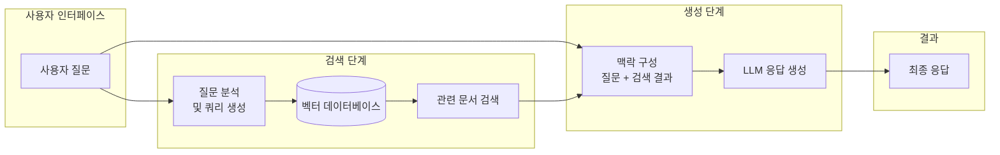
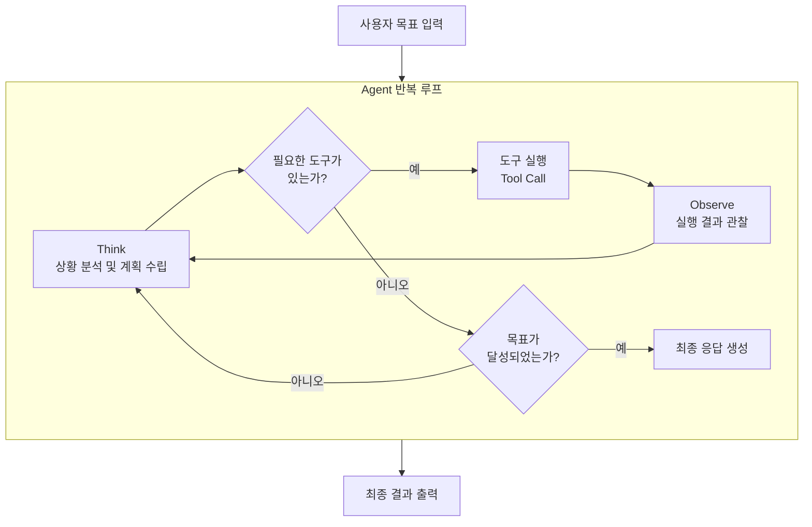
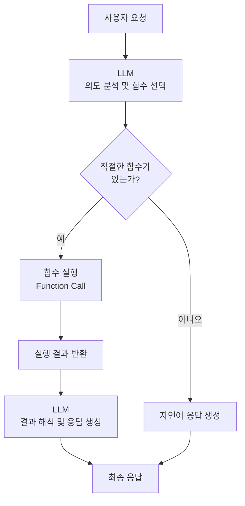
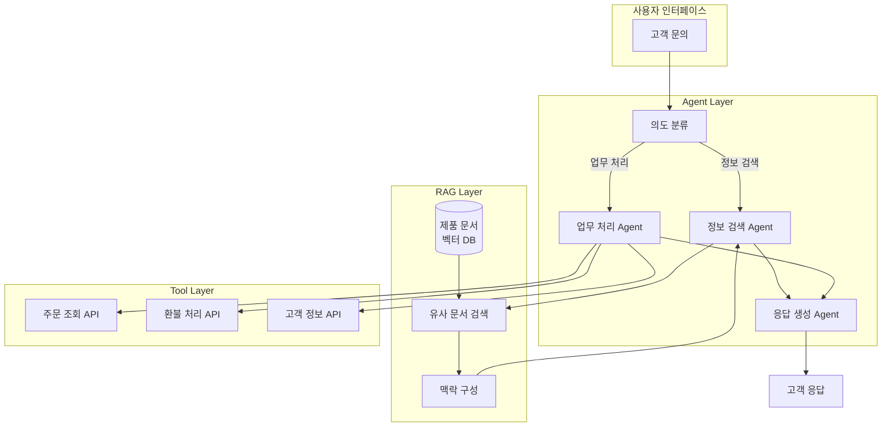
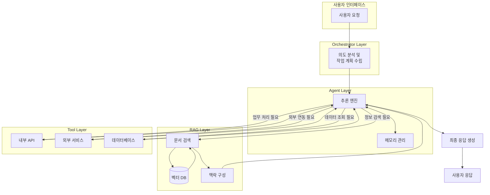

# 03장: AI 시스템 설계 패턴

---

## 학습 목표

| 구분 | 내용 |
|------|------|
| **개념적 목표** | RAG, Agent, Tool Calling 세 가지 핵심 설계 패턴의 개념과 차이를 이해합니다. |
| **실천적 목표** | 간단한 고객 지원 AI 시스템을 설계할 때 적절한 패턴을 선택할 수 있습니다. |
| **분석적 목표** | 각 패턴의 장단점과 적용 상황을 비교 분석할 수 있습니다. |
| **설계적 목표** | 복합 패턴을 활용하여 실제 문제에 맞는 아키텍처를 설계할 수 있습니다. |

---

## 실전 프로젝트: 간단한 고객 지원 AI 시스템 설계

### 프로젝트 개요

이번 프로젝트는 실제 서비스에서 활용할 수 있는 고객 지원 AI 시스템의 아키텍처를 설계하는 것입니다. 고객 지원 시스템은 다양한 설계 패턴을 적용할 수 있는 이상적인 예시이며, RAG, Agent, Tool Calling의 개념을 종합적으로 이해하고 적용할 수 있는 기회를 제공합니다.

고객 지원 시스템은 크게 세 가지 핵심 기능을 제공해야 합니다. 첫째, 제품 관련 질문에 정확하게 답변할 수 있어야 합니다. 둘째, 환불, 교환, 배송 조회 등 실제 업무를 처리할 수 있어야 합니다. 셋째, 이전 대화 내역을 기억하고 고객의 상황을 이해해야 합니다.

### 프로젝트 진행 순서

첫째, 시스템이 처리해야 할 고객 문의 유형을 분석하고 분류합니다. 제품 설명 문의, 주문 상태 확인, 환불 요청, 기술 지원 등 각 유형별로 필요한 정보와 처리 프로세스를 정의합니다. 예를 들어 제품 설명 문의는 제품 매뉴얼 데이터베이스에서 관련 정보를 검색하여 답변해야 하고, 환불 요청은 주문 시스템과 연동하여 실제 처리가 필요합니다.

둘째, 각 문의 유형에 적합한 설계 패턴을 선택합니다. 제품 설명 문의는 RAG 패턴이 적합하고, 환불 요청은 Tool Calling 패턴이 필요합니다. 여러 단계를 거쳐야 하는 복합 문의는 Agent 패턴을 고려해야 합니다. 각 문의 유형별로 최적의 패턴을 매핑하는 것이 설계의 핵심입니다.

셋째, 선택한 패턴들을 통합하는 전체 시스템 아키텍처를 설계합니다. 단일 패턴만으로는 모든 문의 유형을 효과적으로 처리하기 어려우므로, RAG와 Agent를 결합한 복합 패턴을 적용하는 것이 일반적입니다. 전체 아키텍처를 다이어그램으로 표현하고 각 구성 요소의 역할과 데이터 흐름을 명확히 정의합니다.

넷째, 설계한 아키텍처의 한계와 개선 방향을 분석합니다. 현재 설계에서 처리할 수 없는 예외 상황, 성능 병목이 예상되는 지점, 확장이 필요한 부분 등을 식별하고 이에 대한 대비 방안을 마련합니다.

### 기대 효과

이 프로젝트를 통해 실제 문제에 맞는 AI 시스템 설계 패턴을 선택하고 통합하는 실무 역량을 기를 수 있습니다. 또한 각 패턴의 장단점과 적용 조건을 실제 설계 맥락에서 이해하게 됩니다.

---

## 3.1 RAG 패턴: Retrieval-Augmented Generation

### 3.1.1 개념과 필요성

RAG(Retrieval-Augmented Generation)는 외부 지식베이스에서 관련 정보를 검색하여 AI 모델의 응답 생성을 보강하는 패턴입니다. LLM이 학습한 지식만으로는 최신 정보나 특화된 도메인 지식을 정확히 제공하기 어렵기 때문에, 필요한 정보를 실시간으로 검색하여 활용하는 방식이 필요합니다.

RAG의 핵심 아이디어는 "모델이 모든 것을 알 필요는 없다"는 것입니다. 대신 모델은 필요한 정보를 어디서 찾을지 알고, 검색된 정보를 기반으로 응답을 구성합니다. 이는 인간이 업무를 수행할 때 참고 자료를 찾아보는 방식과 유사합니다.

RAG 패턴은 크게 세 단계로 동작합니다. 첫 번째 단계는 사용자의 질문을 분석하여 검색 쿼리를 생성합니다. 두 번째 단계는 지식베이스에서 관련 문서나 데이터를 검색합니다. 세 번째 단계는 검색된 정보를 LLM의 맥락에 포함시켜 응답을 생성합니다.

### 3.1.2 RAG 아키텍처

RAG 아키텍처의 핵심 구성 요소는 벡터 데이터베이스입니다. 문서나 데이터를 임베딩(Embedding) 벡터로 변환하여 저장하고, 사용자의 질문과 가장 유사한 벡터를 검색하는 방식으로 동작합니다. 이 과정에서 검색의 정확성과 속도가 시스템의 전반적인 성능을 결정합니다.

검색된 정보의 품질을 높이기 위해서는 효율적인 청크(Chunk) 전략이 필요합니다. 문서를 적절한 크기로 분할하고, 각 청크에 메타데이터를 부여하여 검색 정확도를 향상시킬 수 있습니다. 또한 검색 결과의 순위를 다시 매기는 Re-ranking 과정을 추가하여 가장 관련성 높은 정보를 우선적으로 활용할 수도 있습니다.

### 3.1.3 RAG가 적합한 상황

RAG 패턴은 다음과 같은 상황에서 가장 효과적입니다. 첫째, 최신 정보가 지속적으로 업데이트되는 도메인입니다. 예를 들어 제품 매뉴얼, 회사 정책, 법률 정보 등은 시간이 지남에 따라 변경되므로 RAG를 통해 항상 최신 정보를 참조할 수 있어야 합니다.

둘째, 특화된 도메인 지식이 필요한 작업입니다. 의학, 법학, 공학 등 전문 분야의 지식은 LLM이 학습한 일반적인 지식만으로는 정확한 답변을 제공하기 어렵습니다. RAG를 활용하면 해당 도메인의 전문 문서를 검색하여 더 정확한 정보를 제공할 수 있습니다.

셋째, 정보의 출처를 명확히 해야 하는 상황입니다. RAG는 어떤 문서를 기반으로 응답을 생성했는지 추적할 수 있으므로, 응답의 신뢰성과 투명성이 중요한 비즈니스 환경에서 특히 유용합니다.

---

## 3.2 Agent 패턴: 자율적 의사결정과 실행

### 3.2.1 개념과 필요성

Agent 패턴은 AI 모델이 자율적으로 목표를 설정하고, 여러 단계의 추론을 수행하며, 외부 도구를 사용하여 작업을 완료하는 패턴입니다. 단순한 질문-응답을 넘어서, 복잡한 작업을 스스로 계획하고 실행하는 능력을 AI 시스템에 부여합니다.

Agent의 핵심은 반복적인 사고-행동 관찰 루프(Think-Act-Observe Loop)입니다. AI 모델이 현재 상황을 분석하고(Think), 필요한 행동을 결정하여 실행하고(Act), 실행 결과를 관찰하여(Observe) 다음 행동을 계획하는 과정을 목표가 달성될 때까지 반복합니다.

이러한 자율적 순환 과정은 인간의 문제 해결 방식과 유사합니다. 인간도 복잡한 문제를 해결할 때 여러 단계의 사고와 행동을 반복하며, 각 단계의 결과를 바탕으로 다음 전략을 조정합니다. Agent 패턴은 이러한 인간의 의사결정 과정을 AI 시스템에 구현한 것입니다.

### 3.2.2 Agent 아키텍처

Agent 아키텍처의 핵심은 메모리 관리입니다. Agent는 단기 메모리(현재 세션의 대화 맥락)와 장기 메모리(과거 세션의 중요한 정보)를 모두 관리해야 합니다. 또한 Agent가 수행한 행동의 이력을 추적하여 반복이나 오류를 방지하는 기능도 필요합니다.

Agent에게 도구를 제공할 때는 각 도구의 목적, 입력 형식, 출력 형식을 명확히 정의해야 합니다. Agent는 이 정보를 바탕으로 언제 어떤 도구를 사용할지 스스로 판단합니다. 따라서 도구의 설명이 명확하고 구체적일수록 Agent의 의사결정 정확도가 향상됩니다.

### 3.2.3 Agent가 적합한 상황

Agent 패턴은 여러 단계의 추론과 외부 시스템 연동이 필요한 복잡한 작업에서 가장 효과적입니다. 예를 들어 "지난달 매출 보고서를 분석해서 하락 원인을 찾고, 개선 방안을 제안해줘"와 같은 작업은 Agent가 여러 데이터 소스에 접근하고, 분석을 수행하며, 종합적인 결론을 도출해야 합니다.

또한 Agent는 상황에 따라 유연하게 대응해야 하는 작업에 적합합니다. 미리 정의된 절차만으로는 처리하기 어려운 예외 상황이나, 사용자의 의도가 명확하지 않은 경우에도 Agent가 스스로 판단하여 적절한 행동을 취할 수 있습니다.

그러나 Agent는 완전한 자율성을 가지지 않으며, 적절한 감독과 제약이 필요합니다. 특히 중요한 의사결정이나 금전적 영향이 있는 작업에서는 휴먼인루프(Human-in-the-Loop)를 설계하여 Agent의 결정을 사람이 검증하도록 해야 합니다.

---

## 3.3 Tool Calling 패턴: 기능 호출과 통합

### 3.3.1 개념과 필요성

Tool Calling(또는 Function Calling) 패턴은 AI 모델이 외부 함수나 API를 호출하여 특정 작업을 수행하는 패턴입니다. Agent 패턴이 자율적인 의사결정에 초점을 맞춘다면, Tool Calling 패턴은 AI 모델이 외부 시스템과 구조화된 방식으로 상호작용하는 인터페이스에 초점을 맞춥니다.

Tool Calling의 핵심은 AI 모델이 자연어로 표현된 사용자의 의도를 분석하여, 적절한 함수를 선택하고 필요한 인자를 추출하는 것입니다. 예를 들어 "서울 내일 날씨 알려줘"라는 사용자 요청에서 모델은 get_weather(city="Seoul", date="tomorrow")라는 함수 호출을 생성합니다.

이 패턴은 AI 시스템이 실제 업무를 처리할 수 있게 만드는 핵심 기술입니다. AI가 단순한 정보 제공을 넘어서 데이터베이스 조회, 트랜잭션 처리, 외부 서비스 연동 등의 실제 업무를 수행할 수 있게 됩니다.

### 3.3.2 Tool Calling 아키텍처

Tool Calling에서 함수의 정의 방식은 매우 중요합니다. 각 함수는 함수명, 설명, 파라미터 목록을 JSON 스키마 형식으로 명확히 정의해야 합니다. 함수의 설명은 AI 모델이 언제 이 함수를 호출해야 하는지 이해할 수 있도록 구체적으로 작성되어야 합니다.

파라미터의 정의도 세심하게 설계해야 합니다. 각 파라미터의 이름, 타입, 설명, 필수 여부, 가능한 값의 범위 등을 명확히 지정해야 AI 모델이 올바른 인자를 추출할 수 있습니다. 복잡한 파라미터는 중첩된 JSON 객체로 정의할 수도 있습니다.

### 3.3.3 Tool Calling이 적합한 상황

Tool Calling 패턴은 사용자의 요청이 구조화된 데이터 처리로 연결될 수 있는 상황에서 가장 효과적입니다. 예를 들어 "구매 내역 조회", "예약 변경", "비밀번호 재설정" 등은 명확한 함수 호출로 매핑될 수 있는 작업입니다.

또한 Tool Calling은 결정론적 처리가 필요한 작업에 적합합니다. AI의 확률적 추론을 거치지만 최종 실행은 정확한 함수 호출로 이루어지므로, 결과의 신뢰성과 추적 가능성이 중요한 비즈니스 로직에 적용할 수 있습니다.

여러 함수를 조합하여 복잡한 워크플로우를 구성할 수도 있습니다. 그러나 이러한 경우에는 Tool Calling 단독으로 사용하기보다는 Agent 패턴과 결합하여 사용하는 것이 더 효과적입니다.

---

## 3.4 패턴 선택 기준

### 3.4.1 비교 분석

다음 표는 세 가지 패턴을 다양한 기준으로 비교한 것입니다.

| 비교 기준 | RAG 패턴 | Agent 패턴 | Tool Calling 패턴 |
|-----------|----------|------------|-------------------|
| **핵심 목적** | 외부 지식을 활용한 응답 생성 | 자율적 작업 수행 | 외부 함수 호출 |
| **복잡도** | 중간 | 높음 | 낮음~중간 |
| **의사결정 방식** | 검색 결과 기반 | 반복적 추론 기반 | 함수 매핑 기반 |
| **외부 연동** | 지식베이스 | 도구 + 메모리 | 함수/API |
| **메모리 중요도** | 낮음 | 높음 | 낮음 |
| **적합한 작업** | 정보 검색 및 요약 | 복합 작업 처리 | 데이터 처리 및 트랜잭션 |
| **투명성** | 검색 출처 추적 가능 | 추론 과정 설명 가능 | 함수 호출 이력 확인 가능 |
| **구현 난이도** | 중간 | 높음 | 낮음 |

### 3.4.2 패턴 선택 의사결정

패턴을 선택할 때는 다음 질문을 순차적으로 고려하는 것이 효과적입니다.

첫째, 문제 해결에 외부 지식이 필요한가? 최신 정보나 도메인 특화 지식이 필요하다면 RAG 패턴을 고려해야 합니다. 그렇지 않고 LLM의 내부 지식만으로 충분하다면 RAG는 필요하지 않을 수 있습니다.

둘째, 여러 단계의 추론이나 외부 도구 사용이 필요한가? 단순한 질문-응답 이상의 처리가 필요하다면 Agent 패턴이나 Tool Calling 패턴을 고려해야 합니다. 특히 외부 시스템과의 상호작용이 필요하다면 이 두 패턴이 필수적입니다.

셋째, 작업이 예측 가능한가? 입력에 따라 수행해야 할 함수가 명확하다면 Tool Calling 패턴이 적합합니다. 반면 상황에 따라 유연하게 대응해야 한다면 Agent 패턴이 더 적합합니다.

💡 예시: 고객 불만 처리 시스템 — 패턴별 설계 비교

"고객이 구매한 제품에 하자가 있어 환불을 요청한다"는 동일한 상황을 세 가지 패턴으로 각각 설계할 때의 차이점을 비교합니다.

| 비교 항목 | RAG 패턴 | Agent 패턴 | Tool Calling 패턴 |
|-----------|----------|------------|-------------------|
| **동작 방식** | "환불 정책이 무엇인가요?"라는 질문에 대해 회사 환불 정책 문서를 벡터 DB에서 검색하여 관련 조항을 답변으로 생성 | 환불 요청 접수 → 정책 확인 → 주문 조회 → 환불 처리 → 고객 응대까지 전 과정을 AI가 자율적으로 판단하여 순차 실행 | `search_order(order_id)`와 `process_refund(order_id, reason)` 함수를 정의하고, 사용자 요청에서 파라미터를 추출하여 개별 함수 호출 |
| **장점** | 최신 환불 정책을 항상 반영 가능, 답변의 출처(문서명, 조항)를 명확히 추적 가능 | 복잡한 요청도 하나의 프롬프트로 처리, 예외 상황에 유연하게 대응 가능 | 각 단계가 독립적이어서 단위 테스트 용이, 실행 결과가 결정론적이어서 신뢰성 높음 |
| **단점** | 실제 환불 처리 업무는 수행 불가, 정보 제공 기능에 한정 | 구현 복잡도가 높고 LLM 호출 비용이 큼, 예상치 못한 경로로 실행될 위험 | 모든 가능한 시나리오를 함수와 파라미터로 미리 정의해야 하므로 유연성 부족 |
| **적합한 문의 유형** | "환불 규정이 어떻게 되나요?", "교환 기간이 어떻게 되나요?" 같은 정보성 문의 | "제품 하자로 환불하고 싶은데 절차가 어떻게 되나요? 진행해 주세요" 같은 종합 요청 | "주문번호 OO-1234를 환불 처리해 주세요" 같은 구체적이고 명령형 요청 |
| **구현 난이도** | 중간 (벡터 DB 구축 필요) | 높음 (Agent 루프 설계, 메모리 관리, 도구 정의 필요) | 낮음 (함수 스키마 정의만으로 구현 가능) |

이 비교를 통해 동일한 업무라도 어떤 패턴을 선택하느냐에 따라 시스템의 동작 방식, 장단점, 구현 난이도가 크게 달라짐을 알 수 있습니다. 실제로는 이 세 가지 패턴을 복합적으로 사용하여 각각의 장점을 취하는 방식이 가장 일반적입니다.

💡 예시: 패턴 선택 의사결정 — 시나리오별 판단표

다음은 다양한 요구사항에 대해 패턴 선택 의사결정 과정을 실제 사례별로 보여줍니다.

| 요구사항 | 외부 지식 필요? | 다단계 추론 필요? | 예측 가능한가? | 추천 패턴 | 판단 사유 |
|----------|----------------|-------------------|----------------|-----------|-----------|
| 제품 매뉴얼 기반 질의응답 챗봇 | 예 (매뉴얼 DB) | 아니오 | 예 | RAG | 최신 매뉴얼을 검색하여 단순 Q&A 처리, 검색 출처 추적 가능 |
| "이상 거래 탐지 → 계정 차단 → 고객 알림" 자동화 | 아니오 | 예 | 아니오 (거래 유형별 대응 상이) | Agent | 여러 단계를 자율적으로 판단하여 순차 실행, 상황별 유연 대응 |
| "비밀번호 재설정" 기능 | 아니오 | 아니오 | 예 | Tool Calling | `reset_password(user_id)` 함수 하나로 즉시 처리, 높은 신뢰성 |
| 법률 계약서 검토 및 요약 시스템 | 예 (법률 DB, 판례) | 예 (조항 분석 → 리스크 평가 → 요약) | 아니오 | RAG + Agent (복합) | RAG로 법률 정보 검색, Agent가 종합 분석 및 판단 |
| "서울 날씨 알려줘" | 아니오 | 아니오 | 예 | Tool Calling | `get_weather(city)` 함수 호출로 간단히 처리 |
| 신규 직원용 회사 정책 안내 챗봇 | 예 (인사 규정집) | 아니오 | 예 | RAG | 방대한 규정집에서 관련 조항만 검색하여 정확한 답변 제공 |

이 표를 참고하면 새로운 요구사항이 주어졌을 때 "외부 지식이 필요한가 → RAG 고려", "다단계 추론이 필요한가 → Agent 고려", "예측 가능한가 → Tool Calling 고려" 순서로 판단하여 적합한 패턴을 선택할 수 있습니다.

---

## 3.5 복합 패턴: RAG + Agent 조합

### 3.5.1 복합 패턴의 필요성

현실의 복잡한 문제는 단일 패턴만으로는 해결하기 어려운 경우가 많습니다. 예를 들어 고객 지원 시스템은 제품 정보 검색(RAG), 환불 처리(Tool Calling), 고객 상황에 따른 맞춤형 응답(Agent)을 모두 필요로 합니다. 이러한 경우 각 패턴을 조합한 복합 아키텍처가 필요합니다.

복합 패턴의 핵심은 각 패턴의 강점을 살리고 단점을 보완하는 것입니다. RAG는 정확한 정보 검색을 담당하고, Agent는 전체적인 의사결정과 워크플로우 관리를 담당하며, Tool Calling은 외부 시스템 연동을 담당하는 식으로 역할을 분담합니다.

복합 패턴을 설계할 때는 각 구성 요소 간의 인터페이스를 명확히 정의하는 것이 중요합니다. 어떤 상황에서 어떤 패턴이 활성화되는지, 데이터는 어떻게 전달되는지, 오류 처리는 어떻게 이루어지는지 등을 사전에 설계해야 합니다.

### 3.5.2 복합 아키텍처 예시

다음은 RAG와 Agent를 결합한 복합 아키텍처의 예시입니다.

이 아키텍처에서 Agent Layer는 전체 워크플로우를 조율하는 오케스트레이터 역할을 수행합니다. 사용자의 의도를 분석하여 적절한 하위 Agent나 도구에 작업을 위임하고, 각 단계의 결과를 종합하여 최종 응답을 생성합니다.

RAG Layer는 Agent Layer의 정보 요청에 응답하여 관련 문서를 검색하고 제공합니다. Agent는 RAG가 제공한 정보를 바탕으로 더 정확한 판단을 내릴 수 있으며, RAG는 Agent의 맥락에 맞는 최적의 정보를 제공하기 위해 검색 전략을 최적화할 수 있습니다.

Tool Layer는 실제 업무 처리를 담당합니다. Agent의 판단에 따라 필요한 API를 호출하고, 그 결과를 Agent에게 다시 전달합니다. 이 계층은 전통적인 프로그래밍 방식으로 구현되며, 높은 신뢰성과 추적 가능성을 보장해야 합니다.

### 3.5.3 복합 패턴 설계 시 고려 사항

복합 패턴을 설계할 때는 다음과 같은 사항을 고려해야 합니다. 첫째, 각 계층 간의 지연 시간을 최소화해야 합니다. Agent가 RAG에 정보를 요청하고, Tool을 호출하는 과정에서 누적되는 지연 시간이 사용자 경험에 큰 영향을 미칠 수 있습니다.

둘째, 오류 전파를 방지하기 위한 메커니즘이 필요합니다. 하위 계층에서 발생한 오류가 상위 계층으로 전파되어 전체 시스템이 마비되는 상황을 방지해야 합니다. 각 계층에 적절한 오류 처리와 폴백(Fallback) 전략을 설계해야 합니다.

셋째, 전체 시스템의 비용을 고려해야 합니다. 복합 패턴은 여러 LLM 호출과 외부 API 호출을 수반하므로, 단일 패턴에 비해 비용이 높을 수 있습니다. 따라서 각 호출의 필요성을 검토하고, 불필요한 호출을 최소화하는 최적화가 필요합니다.

---

📝 연습 문제

**문제 1.** 다음 요구사항 각각에 가장 적합한 설계 패턴(RAG, Agent, Tool Calling, 복합 패턴)을 선택하고 그 이유를 설명하십시오.

1-1. 고객이 문의한 제품의 재고를 실시간으로 확인하고 배송 가능일을 안내하는 시스템
1-2. 회사 내부 1,000페이지 분량의 인사 규정집을 기반으로 직원의 복지 관련 질문에 답변하는 챗봇
1-3. 고객 불만 접수 → 원인 분석 → 담당 부서 할당 → 처리 상태 추적 → 만족도 조사까지 전 과정을 자동화하는 시스템
1-4. 사용자의 음성 명령( "불 켜줘", "온도 24도로 설정해줘" )을 받아 스마트홈 기기를 제어하는 시스템

**문제 2.** 다음 시나리오를 읽고 물음에 답하십시오.

*시나리오: 당신은 온라인 쇼핑몰의 AI 시스템 설계자입니다. 고객이 "지난주에 산 노트북이 부팅이 안 돼요"라고 문의했습니다.*

2-1. 위 고객 문의를 처리하기 위해 AI 시스템이 수행해야 할 하위 작업을 3단계 이상으로 분해하십시오.

2-2. 각 하위 작업에 적합한 패턴(RAG, Agent, Tool Calling)을 매핑하고, 전체 아키텍처를 간략히 설명하십시오.

2-3. 각 패턴을 선택할 때 예상되는 위험 요소와 그 대비 방안을 한 가지씩 제시하십시오.

**문제 3.** 다음 중 Agent 패턴을 사용해야 하는 가장 적절한 상황은 무엇입니까? 답을 선택하고, 나머지 보기에는 어떤 패턴이 더 적합한지 각각 설명하십시오.

A. "오늘 서울의 날씨를 알려주세요"
B. "지난달 판매 데이터를 분석하여 매출 하락 원인을 찾고, 개선 방안을 3가지 제안한 후, 각 방안별 실행 계획을 수립해 주세요"
C. "회사 대표 전화번호를 알려주세요"
D. "주문번호 1234-5678의 배송 상태를 조회해 주세요"

📌 정답 및 해설

**문제 1 정답 및 해설**

**1-1. 실시간 재고 확인 및 배송 가능일 안내 — Tool Calling 패턴**
이 요구사항은 외부 시스템(재고 관리 시스템)과의 구조화된 데이터 연동이 핵심이므로 Tool Calling 패턴이 가장 적합합니다. AI는 고객의 질문에서 제품명이나 제품 코드를 추출하여 재고 조회 API를 호출하고, 반환된 재고 수량과 예상 배송일을 자연어 응답으로 변환하여 안내합니다. RAG 패턴은 정적인 문서 검색에 적합하지만 실시간 재고 데이터 조회에는 부적합하며, Agent 패턴은 단일 API 호출로 해결되는 간단한 작업에 과도한 복잡도를 도입합니다. Tool Calling은 함수 호출이 결정론적이어서 재고 정보의 정확성과 신뢰성을 보장할 수 있다는 장점이 있습니다.

**1-2. 인사 규정집 기반 복지 질문 응답 챗봇 — RAG 패턴**
1,000페이지 분량의 방대한 인사 규정집에서 직원의 질문에 맞는 관련 조항을 찾아 답변해야 하므로 RAG 패턴이 가장 적합합니다. RAG는 문서를 벡터 임베딩으로 변환하여 저장하고, 질문과 가장 유사한 내용을 검색한 후 이를 LLM의 맥락에 제공하여 정확한 답변을 생성합니다. 이 방식은 규정이 변경될 때마다 LLM을 재학습시킬 필요 없이 문서만 업데이트하면 된다는 운영상의 큰 장점이 있습니다. 또한 답변의 출처가 되는 규정 조항을 함께 제시할 수 있어 신뢰성과 투명성을 확보할 수 있습니다.

**1-3. 고객 불만 접수부터 만족도 조사까지 전 과정 자동화 — Agent 패턴**
이 요구사항은 여러 단계의 의사결정과 외부 시스템 연동이 필요한 복합 워크플로우이므로 Agent 패턴이 가장 적합합니다. Agent는 불만 접수 후 원인을 분석하고, 적절한 담당 부서를 판단하여 할당한 후, 처리 상태를 추적하고 최종적으로 만족도 조사를 수행하는 일련의 과정을 자율적으로 실행할 수 있습니다. 각 단계에서 상황에 따라 유연하게 대응해야 하므로 미리 정의된 함수 호출만으로는 처리하기 어려우며, Agent의 반복적 사고-행동-관찰 루프가 이러한 복합 작업에 가장 효과적입니다.

**1-4. 음성 명령을 통한 스마트홈 기기 제어 — Tool Calling 패턴**
"불 켜줘", "온도 24도로 설정해줘"와 같은 음성 명령은 각각 특정 기기의 특정 기능을 호출하는 명확한 명령형 요청이므로 Tool Calling 패턴이 가장 적합합니다. AI는 음성 인식 결과에서 의도와 파라미터를 추출하여 `turn_on_light(location)`, `set_temperature(value, unit)` 등의 함수를 호출합니다. 각 명령이 예측 가능하고 단일 함수 호출로 매핑되므로, 복잡한 추론이 필요한 Agent 패턴은 과잉이며, 문서 검색이 필요한 RAG 패턴도 적합하지 않습니다. Tool Calling을 통해 지연 시간을 최소화하고 높은 신뢰성으로 기기를 제어할 수 있습니다.

**문제 2 정답 및 해설 — 노트북 부팅 불량 문의 처리 시스템 설계**

**2-1. 하위 작업 분해:**
① 제품 정보 확인: 고객이 구매한 노트북 모델의 알려진 결함이나 관련 기술 문서를 검색합니다.
② 주문 및 보증 상태 조회: 고객의 주문 내역을 확인하여 구매일, 보증 기간, AS 이력을 파악합니다.
③ 문제 진단 및 분류: 고객이 설명한 증상(부팅 불가)을 기반으로 소프트웨어 문제인지 하드웨어 문제인지 1차 진단합니다.
④ 처리 방안 안내: 진단 결과에 따라 자가 수정 안내, 원격 지원 연결, 또는 AS 접수 절차를 안내합니다.

**2-2. 패턴 매핑 및 전체 아키텍처:**
① 제품 정보 확인은 RAG 패턴을 적용하여 제품 매뉴얼과 기술 지원 문서에서 관련 정보를 검색합니다. ② 주문 및 보증 상태 조회는 Tool Calling 패턴을 사용하여 주문 데이터베이스와 보증 관리 시스템의 API를 호출합니다. ③ 문제 진단 및 분류는 Chain-of-Thought 추론을 통해 증상을 분석하거나 Agent가 자율적으로 판단합니다. ④ 처리 방안 안내는 진단 결과에 따라 적절한 응답을 생성하는데, 여기서도 Agent가 전체 워크플로우를 오케스트레이션하는 복합 패턴이 효과적입니다. Agent가 상위 조정자 역할을 수행하고, 하위 작업은 RAG와 Tool Calling에 위임하는 방식이 가장 현실적인 아키텍처입니다.

**2-3. 위험 요소 및 대비 방안:**
RAG 패턴의 위험 요소는 검색 결과에 관련 정보가 누락되거나 부정확한 문서가 검색될 가능성입니다. 이를 대비하기 위해 검색 결과의 유사도 점수를 임계값으로 설정하여 일정 수준 이하의 결과는 사용하지 않고, fallback으로 기본 진단 프로토콜을 제공해야 합니다. Tool Calling의 위험 요소는 API 호출 실패나 지연입니다. 이를 대비하기 위해 타임아웃을 설정하고, API 호출 실패 시 캐시된 데이터나 기본값을 사용하는 회복 로직을 구현해야 합니다. Agent 패턴의 위험 요소는 예상치 못한 의사결정 경로로 실행될 가능성입니다. 이를 대비하기 위해 중요한 결정(예: AS 접수)에는 휴먼인루프를 설계하여 Agent의 판단을 사람이 최종 승인하도록 해야 합니다.

**문제 3 정답 및 해설 — Agent 패턴 적합 상황 판단**

**정답: B** — "지난달 판매 데이터를 분석하여 매출 하락 원인을 찾고, 개선 방안을 3가지 제안한 후, 각 방안별 실행 계획을 수립해 주세요"

Agent 패턴이 가장 적합한 상황은 여러 단계의 추론과 외부 데이터 접근, 그리고 상황에 따른 유연한 의사결정이 필요한 복합 작업입니다. B 보기는 데이터 분석 → 원인 식별 → 개선 방안 도출 → 실행 계획 수립이라는 다단계 워크플로우를 요구하며, 각 단계에서 이전 결과에 따라 다음 판단이 달라지므로 Agent의 반복적 추론 루프가 가장 효과적입니다.

**A**("오늘 서울의 날씨를 알려주세요")는 단일 정보 조회 작업이므로 Tool Calling 패턴이 더 적합합니다. `get_weather(city="Seoul", date="today")`라는 함수 하나로 즉시 처리할 수 있으며, 여러 단계의 추론이 필요하지 않습니다.

**C**("회사 대표 전화번호를 알려주세요")는 매우 단순한 사실 질의이므로 기본 지시 패턴이나 RAG 패턴이 더 적합합니다. 회사 정보가 LLM의 학습 데이터에 포함되어 있다면 기본 지시만으로 충분하며, 그렇지 않다면 RAG로 내부 문서를 검색하는 방식이 효율적입니다.

**D**("주문번호 1234-5678의 배송 상태를 조회해 주세요")는 구체적인 명령형 요청으로 Tool Calling 패턴이 가장 적합합니다. 주문 번호라는 명확한 파라미터를 추출하여 배송 조회 API를 호출하면 되며, Agent의 자율적 의사결정이 필요하지 않습니다.

---

## 3.6 AI 시스템 설계 실전 Skills

### 3.6.1 Skill 1: 요구사항 분석 스킬

효과적인 AI 시스템의 첫걸음은 모호한 요구사항을 정확히 분석하고 적합한 설계 패턴으로 매핑하는 것입니다. 실무에서는 고객이나 기획자가 "AI 챗봇을 만들어 주세요"라는 추상적인 요청으로 시작하는 경우가 대부분이며, 이러한 요구사항을 구체적인 기술 요건으로 분해하는 능력이 핵심 역량입니다. 먼저 요구사항에서 "어떤 정보가 필요한지", "어떤 행동을 수행해야 하는지", "어떤 수준의 자율성이 필요한지"라는 세 가지 축으로 분석을 진행해야 합니다. 정보 검색이 핵심이면 RAG, 외부 시스템 연동이 필요하면 Tool Calling, 복잡한 의사결정 과정이 포함되면 Agent 패턴을 1차 후보로 선정할 수 있습니다. 이때 중요한 것은 완벽한 설계를 처음부터 하려는 유혹을 버리고, 요구사항의 우선순위와 위험 요소를 함께 평가하여 점진적으로 구체화하는 접근법을 취하는 것입니다.

다음 표는 실제 프로젝트에서 자주 마주치는 요구사항 유형별로 적합한 패턴과 그 근거를 정리한 것입니다.

| 요구사항 유형 | 적합한 패턴 | 근거 |
|------------|-----------|------|
| "회사 내부 문서를 기반으로 질문에 답변해 주는 시스템" | RAG | 방대한 문서에서 관련 정보를 실시간 검색하여 답변해야 하며, 출처 추적이 가능해야 함 |
| "고객 불만을 접수하여 자동으로 처리하는 시스템" | Agent | 불만 유형에 따라 처리 절차가 달라지며, 여러 단계의 판단과 외부 시스템 연동이 필요함 |
| "특정 API를 호출하여 데이터를 조회하거나 변경하는 기능" | Tool Calling | 입력 파라미터가 명확하고 수행해야 할 함수가 결정론적으로 매핑 가능함 |
| "제품 추천을 위해 고객 구매 이력을 분석하고 맞춤형 상품을 제안하는 시스템" | RAG + Agent | 고객 데이터 분석에는 Agent, 상품 정보 검색에는 RAG가 각각 적합하여 복합 패턴이 필요함 |
| "실시간 주식 시세를 조회하고 매수/매도 결정을 지원하는 시스템" | Tool Calling + Agent | 시세 조회는 Tool Calling, 매매 판단 및 종합 분석은 Agent가 담당하여 상호 보완 |

### 3.6.2 Skill 2: 패턴 조합 스킬

실전에서는 단일 패턴만으로 모든 요구사항을 만족하기 어려운 경우가 빈번합니다. 가장 효과적인 접근법은 각 패턴의 강점을 살려 상호 보완적으로 조합하는 하이브리드 아키텍처를 설계하는 것입니다. 예를 들어 RAG와 Agent의 조합은 Agent가 사용자의 의도를 분석하고 정보가 필요한 순간에 RAG 계층에 질의하여 관련 문서를 검색한 후, 검색 결과를 바탕으로 Agent가 최종 판단을 내리는 방식으로 동작합니다. Tool Calling과 Agent의 조합에서는 Agent가 작업 계획을 수립하고, 각 단계에서 필요한 Tool을 자율적으로 호출하여 실행 결과를 바탕으로 다음 단계를 결정하는 방식이 일반적입니다. 패턴을 조합할 때는 각 계층의 인터페이스를 명확히 정의하고, 데이터 흐름의 방향성과 오류 전파 경로를 사전에 설계하는 것이 성공의 관건입니다. 특히 주의할 점은 불필요한 패턴 조합은 시스템 복잡도만 증가시키고 오히려 성능을 저하시킬 수 있으므로, 반드시 실제 요구사항에 기반하여 필요한 조합만 선택해야 합니다.

다음은 RAG, Agent, Tool Calling 세 가지 패턴을 모두 조합한 하이브리드 아키텍처의 전체 구조를 나타냅니다.

### 3.6.3 Skill 3: 프로토타입 설계 스킬

AI 시스템을 설계할 때 가장 흔한 실수는 처음부터 완벽한 아키텍처를 구축하려고 하는 것입니다. 실전에서는 항상 최소 기능 아키텍처(Minimal Viable Architecture, MVA)부터 시작하여 점진적으로 확장하는 접근법이 효과적입니다. 첫 단계에서는 가장 핵심적인 사용자 시나리오 하나를 선정하고, 이를 처리할 수 있는 가장 단순한 패턴으로 프로토타입을 구축합니다. 예를 들어 RAG 기반 시스템을 설계한다면 처음에는 단일 문서 소스와 기본 검색 로직만으로 시작하고, Agent 기반 시스템이라면 단일 Tool과 기본 ReAct 루프만 구현하여 동작을 검증합니다. 프로토타입이 의도한 대로 동작하는 것이 확인되면, 그다음 단계에서 검색 최적화, 메모리 추가, 오류 처리 강화, 성능 튜닝 등의 개선을 순차적으로 적용합니다. 이렇게 점진적 접근법을 취하면 초기 개발 시간을 단축할 수 있을 뿐만 아니라, 각 단계에서 얻은 피드백을 바탕으로 더 견고한 설계로 발전시킬 수 있습니다. 또한 프로토타입 단계에서는 기술적 완벽함보다 사용자 피드백을 빠르게 수집하는 것이 더 중요하므로, 완성도보다 속도에 초점을 맞추어 개발을 진행하는 것이 바람직합니다.

---

## 한눈에 정리

이 장에서 배운 핵심 내용을 다음 표로 정리합니다.

| 패턴 | 핵심 개념 | 장점 | 단점 | 적합 상황 |
|------|-----------|------|------|-----------|
| **RAG** | 검색을 통한 지식 보강 | 최신 정보 활용, 출처 추적 가능 | 검색 품질에 의존, 지연 시간 증가 | 정보 검색, 질의응답, 문서 요약 |
| **Agent** | 자율적 의사결정과 실행 | 복잡 작업 처리, 유연한 대응 | 구현 복잡, 비용 높음, 불확실성 | 복합 워크플로우, 자동화 |
| **Tool Calling** | 함수 호출을 통한 외부 연동 | 결정론적 처리, 높은 신뢰성 | 유연성 부족, 함수 설계 필요 | 데이터 처리, 트랜잭션, API 연동 |
| **복합 패턴** | 여러 패턴의 조합 | 각 패턴의 강점 활용 | 설계 복잡, 디버깅 어려움 | 실제 비즈니스 애플리케이션 |

세 가지 기본 패턴(RAG, Agent, Tool Calling)은 각각 고유한 강점과 약점을 가지고 있습니다. 효과적인 AI 시스템을 설계하기 위해서는 문제의 특성을 정확히 분석하고, 그에 맞는 패턴을 선택하는 능력이 필수적입니다.

단일 패턴만으로는 실제 비즈니스 문제를 완전히 해결하기 어려운 경우가 많습니다. 따라서 각 패턴의 장단점을 이해하고, 이를 조합한 복합 아키텍처를 설계할 수 있는 역량이 중요합니다.

패턴 선택은 고정된 규칙이 아니라 지속적인 학습과 경험을 통해 발전시켜 나가야 하는 능력입니다. 다양한 프로젝트 경험을 통해 어떤 패턴이 어떤 상황에서 효과적인지에 대한 직관을 키워 나가는 것이 중요합니다.
