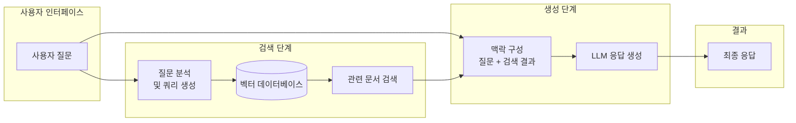
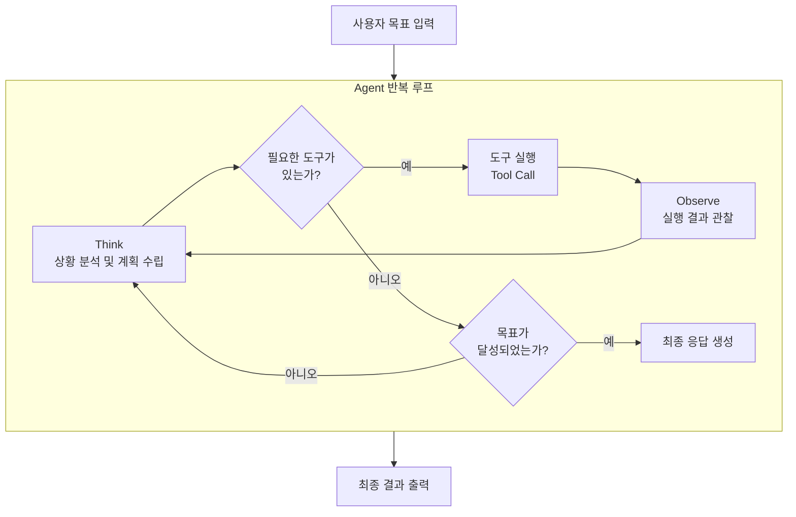
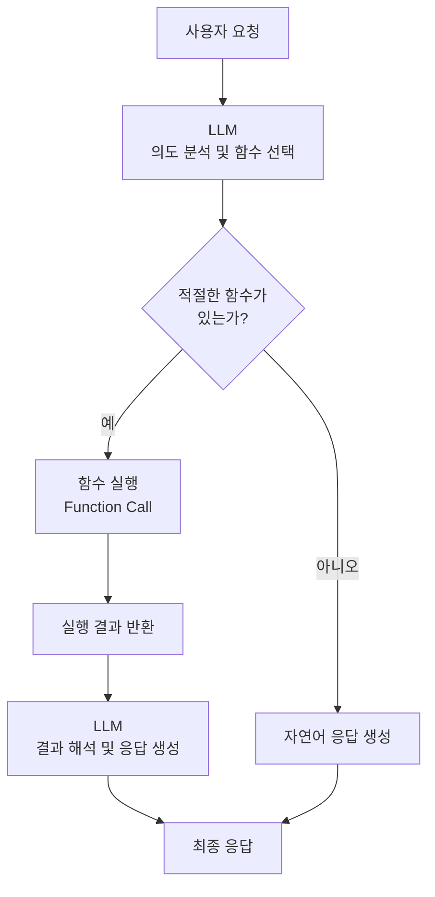
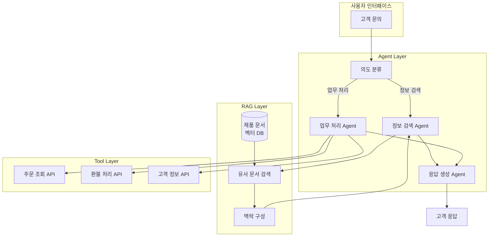

# 03장: AI 시스템 설계 패턴

---

## 학습 목표

| 구분 | 내용 |
|------|------|
| **개념적 목표** | RAG, Agent, Tool Calling 세 가지 핵심 설계 패턴의 개념과 차이를 이해합니다. |
| **실천적 목표** | 간단한 고객 지원 AI 시스템을 설계할 때 적절한 패턴을 선택할 수 있습니다. |
| **분석적 목표** | 각 패턴의 장단점과 적용 상황을 비교 분석할 수 있습니다. |
| **설계적 목표** | 복합 패턴을 활용하여 실제 문제에 맞는 아키텍처를 설계할 수 있습니다. |

---

## 실전 프로젝트: 간단한 고객 지원 AI 시스템 설계

### 프로젝트 개요

이번 프로젝트는 실제 서비스에서 활용할 수 있는 고객 지원 AI 시스템의 아키텍처를 설계하는 것입니다. 고객 지원 시스템은 다양한 설계 패턴을 적용할 수 있는 이상적인 예시이며, RAG, Agent, Tool Calling의 개념을 종합적으로 이해하고 적용할 수 있는 기회를 제공합니다.

고객 지원 시스템은 크게 세 가지 핵심 기능을 제공해야 합니다. 첫째, 제품 관련 질문에 정확하게 답변할 수 있어야 합니다. 둘째, 환불, 교환, 배송 조회 등 실제 업무를 처리할 수 있어야 합니다. 셋째, 이전 대화 내역을 기억하고 고객의 상황을 이해해야 합니다.

### 프로젝트 진행 순서

첫째, 시스템이 처리해야 할 고객 문의 유형을 분석하고 분류합니다. 제품 설명 문의, 주문 상태 확인, 환불 요청, 기술 지원 등 각 유형별로 필요한 정보와 처리 프로세스를 정의합니다. 예를 들어 제품 설명 문의는 제품 매뉴얼 데이터베이스에서 관련 정보를 검색하여 답변해야 하고, 환불 요청은 주문 시스템과 연동하여 실제 처리가 필요합니다.

둘째, 각 문의 유형에 적합한 설계 패턴을 선택합니다. 제품 설명 문의는 RAG 패턴이 적합하고, 환불 요청은 Tool Calling 패턴이 필요합니다. 여러 단계를 거쳐야 하는 복합 문의는 Agent 패턴을 고려해야 합니다. 각 문의 유형별로 최적의 패턴을 매핑하는 것이 설계의 핵심입니다.

셋째, 선택한 패턴들을 통합하는 전체 시스템 아키텍처를 설계합니다. 단일 패턴만으로는 모든 문의 유형을 효과적으로 처리하기 어려우므로, RAG와 Agent를 결합한 복합 패턴을 적용하는 것이 일반적입니다. 전체 아키텍처를 다이어그램으로 표현하고 각 구성 요소의 역할과 데이터 흐름을 명확히 정의합니다.

넷째, 설계한 아키텍처의 한계와 개선 방향을 분석합니다. 현재 설계에서 처리할 수 없는 예외 상황, 성능 병목이 예상되는 지점, 확장이 필요한 부분 등을 식별하고 이에 대한 대비 방안을 마련합니다.

### 기대 효과

이 프로젝트를 통해 실제 문제에 맞는 AI 시스템 설계 패턴을 선택하고 통합하는 실무 역량을 기를 수 있습니다. 또한 각 패턴의 장단점과 적용 조건을 실제 설계 맥락에서 이해하게 됩니다.

---

## 3.1 RAG 패턴: Retrieval-Augmented Generation

### 3.1.1 개념과 필요성

RAG(Retrieval-Augmented Generation)는 외부 지식베이스에서 관련 정보를 검색하여 AI 모델의 응답 생성을 보강하는 패턴입니다. LLM이 학습한 지식만으로는 최신 정보나 특화된 도메인 지식을 정확히 제공하기 어렵기 때문에, 필요한 정보를 실시간으로 검색하여 활용하는 방식이 필요합니다.

RAG의 핵심 아이디어는 "모델이 모든 것을 알 필요는 없다"는 것입니다. 대신 모델은 필요한 정보를 어디서 찾을지 알고, 검색된 정보를 기반으로 응답을 구성합니다. 이는 인간이 업무를 수행할 때 참고 자료를 찾아보는 방식과 유사합니다.

RAG 패턴은 크게 세 단계로 동작합니다. 첫 번째 단계는 사용자의 질문을 분석하여 검색 쿼리를 생성합니다. 두 번째 단계는 지식베이스에서 관련 문서나 데이터를 검색합니다. 세 번째 단계는 검색된 정보를 LLM의 맥락에 포함시켜 응답을 생성합니다.

### 3.1.2 RAG 아키텍처

RAG 아키텍처의 핵심 구성 요소는 벡터 데이터베이스입니다. 문서나 데이터를 임베딩(Embedding) 벡터로 변환하여 저장하고, 사용자의 질문과 가장 유사한 벡터를 검색하는 방식으로 동작합니다. 이 과정에서 검색의 정확성과 속도가 시스템의 전반적인 성능을 결정합니다.

검색된 정보의 품질을 높이기 위해서는 효율적인 청크(Chunk) 전략이 필요합니다. 문서를 적절한 크기로 분할하고, 각 청크에 메타데이터를 부여하여 검색 정확도를 향상시킬 수 있습니다. 또한 검색 결과의 순위를 다시 매기는 Re-ranking 과정을 추가하여 가장 관련성 높은 정보를 우선적으로 활용할 수도 있습니다.

### 3.1.3 RAG가 적합한 상황

RAG 패턴은 다음과 같은 상황에서 가장 효과적입니다. 첫째, 최신 정보가 지속적으로 업데이트되는 도메인입니다. 예를 들어 제품 매뉴얼, 회사 정책, 법률 정보 등은 시간이 지남에 따라 변경되므로 RAG를 통해 항상 최신 정보를 참조할 수 있어야 합니다.

둘째, 특화된 도메인 지식이 필요한 작업입니다. 의학, 법학, 공학 등 전문 분야의 지식은 LLM이 학습한 일반적인 지식만으로는 정확한 답변을 제공하기 어렵습니다. RAG를 활용하면 해당 도메인의 전문 문서를 검색하여 더 정확한 정보를 제공할 수 있습니다.

셋째, 정보의 출처를 명확히 해야 하는 상황입니다. RAG는 어떤 문서를 기반으로 응답을 생성했는지 추적할 수 있으므로, 응답의 신뢰성과 투명성이 중요한 비즈니스 환경에서 특히 유용합니다.

---

## 3.2 Agent 패턴: 자율적 의사결정과 실행

### 3.2.1 개념과 필요성

Agent 패턴은 AI 모델이 자율적으로 목표를 설정하고, 여러 단계의 추론을 수행하며, 외부 도구를 사용하여 작업을 완료하는 패턴입니다. 단순한 질문-응답을 넘어서, 복잡한 작업을 스스로 계획하고 실행하는 능력을 AI 시스템에 부여합니다.

Agent의 핵심은 반복적인 사고-행동 관찰 루프(Think-Act-Observe Loop)입니다. AI 모델이 현재 상황을 분석하고(Think), 필요한 행동을 결정하여 실행하고(Act), 실행 결과를 관찰하여(Observe) 다음 행동을 계획하는 과정을 목표가 달성될 때까지 반복합니다.

이러한 자율적 순환 과정은 인간의 문제 해결 방식과 유사합니다. 인간도 복잡한 문제를 해결할 때 여러 단계의 사고와 행동을 반복하며, 각 단계의 결과를 바탕으로 다음 전략을 조정합니다. Agent 패턴은 이러한 인간의 의사결정 과정을 AI 시스템에 구현한 것입니다.

### 3.2.2 Agent 아키텍처

Agent 아키텍처의 핵심은 메모리 관리입니다. Agent는 단기 메모리(현재 세션의 대화 맥락)와 장기 메모리(과거 세션의 중요한 정보)를 모두 관리해야 합니다. 또한 Agent가 수행한 행동의 이력을 추적하여 반복이나 오류를 방지하는 기능도 필요합니다.

Agent에게 도구를 제공할 때는 각 도구의 목적, 입력 형식, 출력 형식을 명확히 정의해야 합니다. Agent는 이 정보를 바탕으로 언제 어떤 도구를 사용할지 스스로 판단합니다. 따라서 도구의 설명이 명확하고 구체적일수록 Agent의 의사결정 정확도가 향상됩니다.

### 3.2.3 Agent가 적합한 상황

Agent 패턴은 여러 단계의 추론과 외부 시스템 연동이 필요한 복잡한 작업에서 가장 효과적입니다. 예를 들어 "지난달 매출 보고서를 분석해서 하락 원인을 찾고, 개선 방안을 제안해줘"와 같은 작업은 Agent가 여러 데이터 소스에 접근하고, 분석을 수행하며, 종합적인 결론을 도출해야 합니다.

또한 Agent는 상황에 따라 유연하게 대응해야 하는 작업에 적합합니다. 미리 정의된 절차만으로는 처리하기 어려운 예외 상황이나, 사용자의 의도가 명확하지 않은 경우에도 Agent가 스스로 판단하여 적절한 행동을 취할 수 있습니다.

그러나 Agent는 완전한 자율성을 가지지 않으며, 적절한 감독과 제약이 필요합니다. 특히 중요한 의사결정이나 금전적 영향이 있는 작업에서는 휴먼인루프(Human-in-the-Loop)를 설계하여 Agent의 결정을 사람이 검증하도록 해야 합니다.

---

## 3.3 Tool Calling 패턴: 기능 호출과 통합

### 3.3.1 개념과 필요성

Tool Calling(또는 Function Calling) 패턴은 AI 모델이 외부 함수나 API를 호출하여 특정 작업을 수행하는 패턴입니다. Agent 패턴이 자율적인 의사결정에 초점을 맞춘다면, Tool Calling 패턴은 AI 모델이 외부 시스템과 구조화된 방식으로 상호작용하는 인터페이스에 초점을 맞춥니다.

Tool Calling의 핵심은 AI 모델이 자연어로 표현된 사용자의 의도를 분석하여, 적절한 함수를 선택하고 필요한 인자를 추출하는 것입니다. 예를 들어 "서울 내일 날씨 알려줘"라는 사용자 요청에서 모델은 get_weather(city="Seoul", date="tomorrow")라는 함수 호출을 생성합니다.

이 패턴은 AI 시스템이 실제 업무를 처리할 수 있게 만드는 핵심 기술입니다. AI가 단순한 정보 제공을 넘어서 데이터베이스 조회, 트랜잭션 처리, 외부 서비스 연동 등의 실제 업무를 수행할 수 있게 됩니다.

### 3.3.2 Tool Calling 아키텍처

Tool Calling에서 함수의 정의 방식은 매우 중요합니다. 각 함수는 함수명, 설명, 파라미터 목록을 JSON 스키마 형식으로 명확히 정의해야 합니다. 함수의 설명은 AI 모델이 언제 이 함수를 호출해야 하는지 이해할 수 있도록 구체적으로 작성되어야 합니다.

파라미터의 정의도 세심하게 설계해야 합니다. 각 파라미터의 이름, 타입, 설명, 필수 여부, 가능한 값의 범위 등을 명확히 지정해야 AI 모델이 올바른 인자를 추출할 수 있습니다. 복잡한 파라미터는 중첩된 JSON 객체로 정의할 수도 있습니다.

### 3.3.3 Tool Calling이 적합한 상황

Tool Calling 패턴은 사용자의 요청이 구조화된 데이터 처리로 연결될 수 있는 상황에서 가장 효과적입니다. 예를 들어 "구매 내역 조회", "예약 변경", "비밀번호 재설정" 등은 명확한 함수 호출로 매핑될 수 있는 작업입니다.

또한 Tool Calling은 결정론적 처리가 필요한 작업에 적합합니다. AI의 확률적 추론을 거치지만 최종 실행은 정확한 함수 호출로 이루어지므로, 결과의 신뢰성과 추적 가능성이 중요한 비즈니스 로직에 적용할 수 있습니다.

여러 함수를 조합하여 복잡한 워크플로우를 구성할 수도 있습니다. 그러나 이러한 경우에는 Tool Calling 단독으로 사용하기보다는 Agent 패턴과 결합하여 사용하는 것이 더 효과적입니다.

---

## 3.4 패턴 선택 기준

### 3.4.1 비교 분석

다음 표는 세 가지 패턴을 다양한 기준으로 비교한 것입니다.

| 비교 기준 | RAG 패턴 | Agent 패턴 | Tool Calling 패턴 |
|-----------|----------|------------|-------------------|
| **핵심 목적** | 외부 지식을 활용한 응답 생성 | 자율적 작업 수행 | 외부 함수 호출 |
| **복잡도** | 중간 | 높음 | 낮음~중간 |
| **의사결정 방식** | 검색 결과 기반 | 반복적 추론 기반 | 함수 매핑 기반 |
| **외부 연동** | 지식베이스 | 도구 + 메모리 | 함수/API |
| **메모리 중요도** | 낮음 | 높음 | 낮음 |
| **적합한 작업** | 정보 검색 및 요약 | 복합 작업 처리 | 데이터 처리 및 트랜잭션 |
| **투명성** | 검색 출처 추적 가능 | 추론 과정 설명 가능 | 함수 호출 이력 확인 가능 |
| **구현 난이도** | 중간 | 높음 | 낮음 |

### 3.4.2 패턴 선택 의사결정

패턴을 선택할 때는 다음 질문을 순차적으로 고려하는 것이 효과적입니다.

첫째, 문제 해결에 외부 지식이 필요한가? 최신 정보나 도메인 특화 지식이 필요하다면 RAG 패턴을 고려해야 합니다. 그렇지 않고 LLM의 내부 지식만으로 충분하다면 RAG는 필요하지 않을 수 있습니다.

둘째, 여러 단계의 추론이나 외부 도구 사용이 필요한가? 단순한 질문-응답 이상의 처리가 필요하다면 Agent 패턴이나 Tool Calling 패턴을 고려해야 합니다. 특히 외부 시스템과의 상호작용이 필요하다면 이 두 패턴이 필수적입니다.

셋째, 작업이 예측 가능한가? 입력에 따라 수행해야 할 함수가 명확하다면 Tool Calling 패턴이 적합합니다. 반면 상황에 따라 유연하게 대응해야 한다면 Agent 패턴이 더 적합합니다.

---

## 3.5 복합 패턴: RAG + Agent 조합

### 3.5.1 복합 패턴의 필요성

현실의 복잡한 문제는 단일 패턴만으로는 해결하기 어려운 경우가 많습니다. 예를 들어 고객 지원 시스템은 제품 정보 검색(RAG), 환불 처리(Tool Calling), 고객 상황에 따른 맞춤형 응답(Agent)을 모두 필요로 합니다. 이러한 경우 각 패턴을 조합한 복합 아키텍처가 필요합니다.

복합 패턴의 핵심은 각 패턴의 강점을 살리고 단점을 보완하는 것입니다. RAG는 정확한 정보 검색을 담당하고, Agent는 전체적인 의사결정과 워크플로우 관리를 담당하며, Tool Calling은 외부 시스템 연동을 담당하는 식으로 역할을 분담합니다.

복합 패턴을 설계할 때는 각 구성 요소 간의 인터페이스를 명확히 정의하는 것이 중요합니다. 어떤 상황에서 어떤 패턴이 활성화되는지, 데이터는 어떻게 전달되는지, 오류 처리는 어떻게 이루어지는지 등을 사전에 설계해야 합니다.

### 3.5.2 복합 아키텍처 예시

다음은 RAG와 Agent를 결합한 복합 아키텍처의 예시입니다.

이 아키텍처에서 Agent Layer는 전체 워크플로우를 조율하는 오케스트레이터 역할을 수행합니다. 사용자의 의도를 분석하여 적절한 하위 Agent나 도구에 작업을 위임하고, 각 단계의 결과를 종합하여 최종 응답을 생성합니다.

RAG Layer는 Agent Layer의 정보 요청에 응답하여 관련 문서를 검색하고 제공합니다. Agent는 RAG가 제공한 정보를 바탕으로 더 정확한 판단을 내릴 수 있으며, RAG는 Agent의 맥락에 맞는 최적의 정보를 제공하기 위해 검색 전략을 최적화할 수 있습니다.

Tool Layer는 실제 업무 처리를 담당합니다. Agent의 판단에 따라 필요한 API를 호출하고, 그 결과를 Agent에게 다시 전달합니다. 이 계층은 전통적인 프로그래밍 방식으로 구현되며, 높은 신뢰성과 추적 가능성을 보장해야 합니다.

### 3.5.3 복합 패턴 설계 시 고려 사항

복합 패턴을 설계할 때는 다음과 같은 사항을 고려해야 합니다. 첫째, 각 계층 간의 지연 시간을 최소화해야 합니다. Agent가 RAG에 정보를 요청하고, Tool을 호출하는 과정에서 누적되는 지연 시간이 사용자 경험에 큰 영향을 미칠 수 있습니다.

둘째, 오류 전파를 방지하기 위한 메커니즘이 필요합니다. 하위 계층에서 발생한 오류가 상위 계층으로 전파되어 전체 시스템이 마비되는 상황을 방지해야 합니다. 각 계층에 적절한 오류 처리와 폴백(Fallback) 전략을 설계해야 합니다.

셋째, 전체 시스템의 비용을 고려해야 합니다. 복합 패턴은 여러 LLM 호출과 외부 API 호출을 수반하므로, 단일 패턴에 비해 비용이 높을 수 있습니다. 따라서 각 호출의 필요성을 검토하고, 불필요한 호출을 최소화하는 최적화가 필요합니다.

---

## 한눈에 정리

이 장에서 배운 핵심 내용을 다음 표로 정리합니다.

| 패턴 | 핵심 개념 | 장점 | 단점 | 적합 상황 |
|------|-----------|------|------|-----------|
| **RAG** | 검색을 통한 지식 보강 | 최신 정보 활용, 출처 추적 가능 | 검색 품질에 의존, 지연 시간 증가 | 정보 검색, 질의응답, 문서 요약 |
| **Agent** | 자율적 의사결정과 실행 | 복잡 작업 처리, 유연한 대응 | 구현 복잡, 비용 높음, 불확실성 | 복합 워크플로우, 자동화 |
| **Tool Calling** | 함수 호출을 통한 외부 연동 | 결정론적 처리, 높은 신뢰성 | 유연성 부족, 함수 설계 필요 | 데이터 처리, 트랜잭션, API 연동 |
| **복합 패턴** | 여러 패턴의 조합 | 각 패턴의 강점 활용 | 설계 복잡, 디버깅 어려움 | 실제 비즈니스 애플리케이션 |

세 가지 기본 패턴(RAG, Agent, Tool Calling)은 각각 고유한 강점과 약점을 가지고 있습니다. 효과적인 AI 시스템을 설계하기 위해서는 문제의 특성을 정확히 분석하고, 그에 맞는 패턴을 선택하는 능력이 필수적입니다.

단일 패턴만으로는 실제 비즈니스 문제를 완전히 해결하기 어려운 경우가 많습니다. 따라서 각 패턴의 장단점을 이해하고, 이를 조합한 복합 아키텍처를 설계할 수 있는 역량이 중요합니다.

패턴 선택은 고정된 규칙이 아니라 지속적인 학습과 경험을 통해 발전시켜 나가야 하는 능력입니다. 다양한 프로젝트 경험을 통해 어떤 패턴이 어떤 상황에서 효과적인지에 대한 직관을 키워 나가는 것이 중요합니다.
