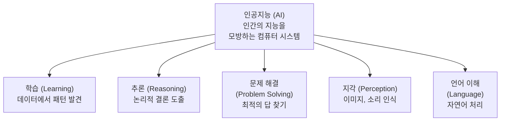
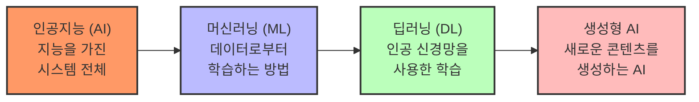
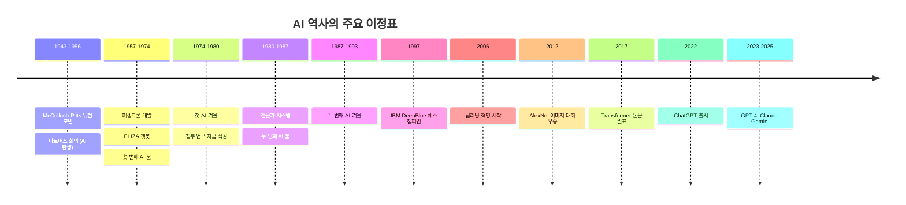
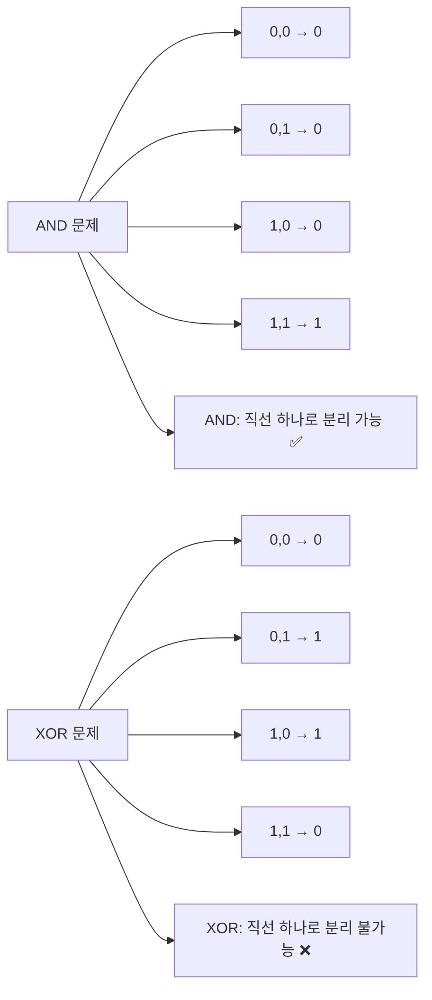
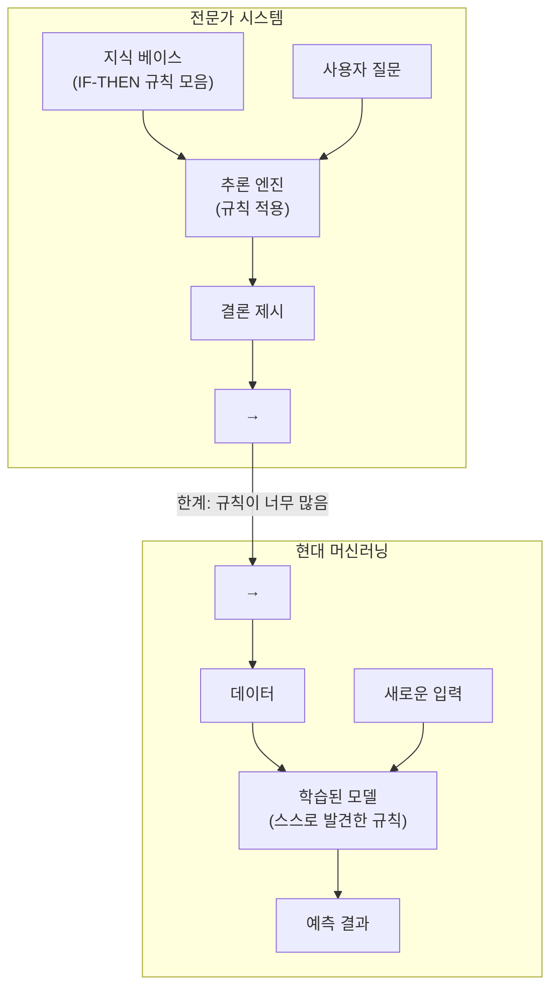
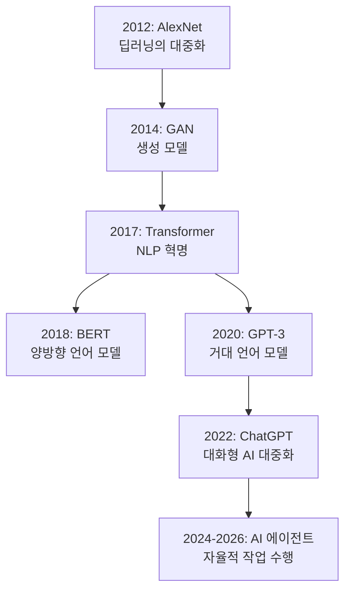
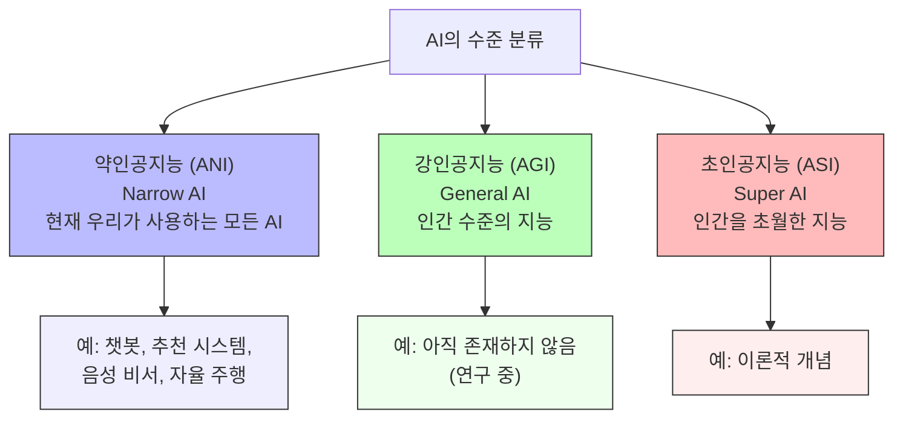
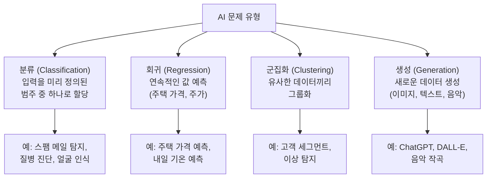
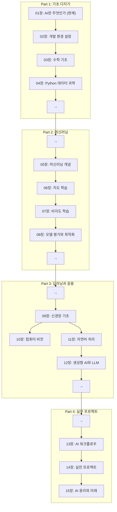

# 01장: AI 프로그래밍 개요

> **🎯 학습 목표**
> - AI 프로그래밍이 무엇인지 정의하고, 일반 소프트웨어 개발과의 차이를 설명할 수 있습니다.
> - AI 프로그래밍의 전체 생명주기(데이터 → 모델 → 배포)를 이해합니다.
> - 규칙 기반, 머신러닝 기반, LLM 기반 프로그래밍의 차이를 구분할 수 있습니다.
> - AI 프로그래밍에 필요한 도구와 기술 스택을 파악합니다.

---

## 1.1 AI의 개념과 첫 실습

이 장에서는 인공지능이라는 거대한 학문 분야의 첫발을 내딛어 보겠습니다. 먼저 간단한 AI 프로그램을 직접 작성하면서 AI가 무엇인지 몸으로 느껴 본 후, 본격적인 개념 학습으로 이어지는 방식으로 구성하였습니다.

### 👨‍💻 실전 프로젝트: 첫 AI 프로그램 만들기

이론보다 먼저, 여러분이 직접 눈으로 확인하고 실행할 수 있는 아주 간단한 AI 프로그램을 만들어 보겠습니다. 아래 코드는 **규칙 기반 AI(Rule-based AI)** 의 전형적인 예시로, 온도를 입력받아 날씨를 분류하고 적절한 활동을 추천해 주는 프로그램입니다. 아직 Python에 익숙하지 않더라도, if-else 조건문의 흐름만 따라가면 충분히 이해할 수 있도록 작성하였습니다.

```python
def simple_ai(temperature):
    """온도를 입력받아 날씨를 분류하고 추천 활동을 알려주는 규칙 기반 AI입니다."""
    if temperature < 5:
        category = "매우 추움"
        activity = "스키를 타거나 실내에서 영화를 보세요."
    elif temperature < 15:
        category = "쌀쌀함"
        activity = "따뜻한 커피를 마시며 독서하기 좋은 날씨입니다."
    elif temperature < 25:
        category = "적당함"
        activity = "산책이나 조깅에 최적인 날씨입니다."
    elif temperature < 35:
        category = "더움"
        activity = "수영장에 가거나 아이스크림을 즐기세요."
    else:
        category = "매우 더움"
        activity = "에어컨이 있는 실내에서 휴식하는 것을 권장합니다."

    return category, activity

# 사용자로부터 온도를 입력받아 AI가 분류 및 추천을 수행합니다.
temp = float(input("현재 온도를 입력하세요 (°C): "))
category, activity = simple_ai(temp)
print(f"날씨 분류: {category}")
print(f"추천 활동: {activity}")
```

**실행 결과:**

```
현재 온도를 입력하세요 (°C): 18
날씨 분류: 적당함
추천 활동: 산책이나 조깅에 최적인 날씨입니다.
```

이 프로그램이 바로 하나의 작은 AI 시스템입니다. 물론 오늘날의 ChatGPT나 자율 주행 자동차에 비하면 극히 단순해 보이지만, 이 코드의 핵심은 **입력(온도)에 대해 규칙(if-else 조건문)을 적용하여 출력(분류 결과와 추천 활동)을 만들어 낸다**는 점입니다. 이와 같은 방식을 **규칙 기반 AI(Rule-based AI)** 또는 **상징적 AI(Symbolic AI)** 라고 부릅니다. 이 책의 후반부로 갈수록 규칙을 사람이 직접 코딩하는 대신, 컴퓨터가 데이터로부터 스스로 규칙을 학습하는 **머신러닝(Machine Learning)** 방식으로 발전하는 과정을 배우게 됩니다. 지금은 단순한 조건문이었지만, 여러분은 이미 AI의 가장 기본적인 형태를 직접 구현해 본 것입니다.

### 1.1.1 AI 프로그래밍이란?

**AI 프로그래밍(AI Programming)** 은 인공지능 시스템을 설계, 구현, 학습, 평가, 배포하는 모든 소프트웨어 개발 활동을 의미합니다. 일반적인 소프트웨어 개발이 명확한 규칙(if-else, 알고리즘)을 코드로 작성하는 것이라면, AI 프로그래밍은 **데이터로부터 패턴을 학습하는 모델**을 구축하고 이를 소프트웨어 시스템에 통합하는 과정입니다. 우리가 방금 작성한 `simple_ai`는 규칙을 직접 코딩했지만, 이후 장에서는 데이터를 통해 스스로 규칙을 학습하는 머신러닝 모델을 프로그래밍하게 됩니다.

AI 프로그래밍의 핵심은 더 이상 "어떤 규칙을 코드로 작성할까"가 아니라 "어떤 데이터를 어떻게 준비하고, 어떤 모델 구조를 선택하며, 어떻게 학습시킬까"로 이동합니다. 다시 말해, 개발자의 역할이 **규칙을 코딩하는 사람**에서 **데이터와 모델을 설계하는 사람**으로 확장됩니다. 전통적 프로그래밍과 AI 프로그래밍의 차이를 표로 비교하면 다음과 같습니다.

| 구분 | 전통적 프로그래밍 | AI 프로그래밍 |
|------|-------------------|---------------|
| 핵심 작업 | 규칙(알고리즘) 코딩 | 데이터 수집 및 모델 학습 |
| 출력 방식 | 입력 → 규칙 → 출력 | 입력 → 모델(학습된 패턴) → 출력 |
| 유지보수 | 규칙 수동 수정 | 데이터 추가 및 재학습 |
| 난이도 결정 요인 | 알고리즘 복잡도 | 데이터 품질과 양 |
| 주요 도구 | IDE, 컴파일러 | Jupyter, PyTorch, GPU |

### 1.1.2 인공지능이란?

AI 프로그래밍을 이해하려면 먼저 AI가 무엇인지 알아야 합니다. **인공지능(Artificial Intelligence, AI)** 은 인간의 지능을 컴퓨터 시스템으로 구현한 것을 말합니다. 더 구체적으로 말하면, 학습, 추론, 문제 해결, 패턴 인식, 언어 이해 등 인간의 지능적 행동을 모방하는 소프트웨어와 하드웨어 시스템입니다. 우리가 방금 작성한 `simple_ai` 함수처럼 사람이 직접 규칙을 코딩하는 방식도 인공지능의 한 형태이며, 데이터를 통해 스스로 학습하는 머신러닝 방식 또한 인공지능의 범주에 포함됩니다. 즉, 인공지능은 인간의 지능적인 행동을 재현하려는 모든 컴퓨터 기반 시도를 총칭하는 가장 넓은 개념이라고 할 수 있습니다.



위 다이어그램에서 보는 바와 같이, 인공지능은 단순히 하나의 기술만을 의미하지 않습니다. 학습(Learning), 추론(Reasoning), 문제 해결(Problem Solving), 지각(Perception), 언어 이해(Language) 등 인간의 다양한 지능적 기능을 각각 구현하려는 여러 하위 분야로 구성되어 있습니다. 예를 들어 우리가 만든 `simple_ai`는 문제 해결(Problem Solving) 범주에 가깝고, 이후에 배울 머신러닝 모델들은 학습(Learning) 범주에 속한다고 볼 수 있습니다.

### 1.1.3 AI, ML, DL의 관계

이 관계를 이해하는 것은 AI 프로그래밍의 범위를 파악하는 데 중요합니다. 이 책에서 여러분이 프로그래밍하게 될 내용은 머신러닝과 딥러닝에 집중되어 있지만, 이는 AI라는 더 큰 개념의 하위 집합입니다. AI는 가장 넓은 개념이며, AI를 구현하는 방법 중 하나가 머신러닝(ML)입니다. 그리고 머신러닝의 한 분야로 딥러닝(DL)이 있습니다. 이들 사이의 관계는 마치 "동물-포유류-고래"의 관계와 유사하여, 포함 관계는 AI ⊃ ML ⊃ DL로 표현할 수 있습니다. 다시 말해 모든 머신러닝은 인공지능이지만, 모든 인공지능이 머신러닝인 것은 아닙니다. 우리가 방금 작성한 `simple_ai`는 머신러닝이 아닌 규칙 기반 AI에 해당하며, 머신러닝은 데이터로부터 스스로 패턴을 학습한다는 점에서 근본적인 차이가 있습니다.



| 개념 | 설명 | 예시 |
|------|------|------|
| **인공지능 (AI)** | 인간의 지능을 모방하는 모든 시스템 | 체스 프로그램, 추천 시스템 |
| **머신러닝 (ML)** | 데이터를 학습하여 성능을 개선하는 AI의 하위 분야 | 스팸 메일 필터, 가격 예측 |
| **딥러닝 (DL)** | 인공 신경망을 사용한 머신러닝의 하위 분야 | 이미지 인식, 음성 인식 |
| **생성형 AI** | 새로운 콘텐츠를 생성하는 딥러닝 모델 | ChatGPT, DALL-E, Stable Diffusion |

위 표는 AI, ML, DL, 그리고 생성형 AI의 관계를 한눈에 정리한 것입니다. 각 개념은 점점 구체화되는 계층 구조를 이루고 있으며, 생성형 AI는 딥러닝의 하위 분야이지만 최근 그 중요성이 급부상하면서 별도로 구분하여 다루어집니다. 이 책의 Part 2에서는 머신러닝의 기초부터 다루고, Part 3에서는 딥러닝과 생성형 AI까지 점진적으로 나아가는 과정을 학습하게 됩니다.

---

## 1.2 AI 프로그래밍의 역사

AI 프로그래밍의 발전 과정을 이해하면 현재의 도구와 방법론이 왜 등장했는지 알 수 있습니다. AI 프로그래밍은 초기의 **규칙 기반 프로그래밍**에서 시작하여, 데이터로부터 학습하는 **머신러닝 프로그래밍**, 대규모 신경망을 활용하는 **딥러닝 프레임워크**, 그리고 지금은 API 호출만으로 강력한 모델을 활용하는 **LLM 기반 프로그래밍**으로 진화해 왔습니다. 이제 그 역사를 자세히 살펴보겠습니다.

AI의 역사는 1950년대부터 현재까지 약 70년 이상 이어져 왔습니다. 이 기간 동안 여러 번의 **부흥기(AI Spring)** 와 **침체기(AI Winter)** 가 있었습니다. 이렇게 오랜 시간 동안 기복을 겪으면서도 AI 연구는 끊임없이 발전해 왔으며, 각 시기마다 등장한 결정적인 기술적 돌파구들이 오늘날 우리가 누리는 AI 시대를 만들어 냈습니다. 아래 타임라인을 통해 AI 역사의 주요 이정표를 한눈에 살펴보겠습니다.



이 타임라인에서 볼 수 있듯이, AI는 직선적인 발전을 해 온 것이 아니라 붐과 겨울을 반복하며 성장해 왔습니다. 각 침체기는 이전 기술의 한계를 드러냈지만, 동시에 새로운 돌파구를 위한 발판이 되었습니다. 이제 각 시대별로 어떤 일이 일어났는지 자세히 살펴보도록 하겠습니다.

### 1.2.1 태동기 (1943-1956)

1943년, Warren McCulloch와 Walter Pitts는 인간 뉴런의 수학적 모델을 발표했습니다. 이것이 오늘날 인공 신경망의 기초가 되었습니다. 이들은 생물학적 뉴런이 어떻게 간단한 수학 연산(가중합과 임계값 함수)으로 모델링될 수 있는지를 보여주었고, 이는 이후 70년 이상 지속된 신경망 연구의 시발점이 되었습니다. 아래 다이어그램은 1943년의 McCulloch-Pitts 뉴런과 현대 뉴런의 구조적 유사성을 비교한 것입니다.

```mermaid
flowchart LR
  subgraph McCullochPitts[McCulloch-Pitts 뉴런 (1943)]
    X1["입력 1"] --> SUM["∑ (가중합)"]
    X2["입력 2"] --> SUM
    X3["입력 n"] --> SUM
    SUM --> TH["임계값 함수"]
    TH --> Y_MP["출력"]
    Y_MP --> MP_Out
  end
  MP_Out["→"]

  subgraph Modern[현대 뉴런]
    Mod_In --> WX1["입력 × 가중치"]
    WX1 --> SUM2["∑ + 바이어스"]
    WX2["입력 × 가중치"] --> SUM2
    WX3["입력 × 가중치"] --> SUM2
    SUM2 --> ACT["활성화 함수<br/>(ReLU, Sigmoid)"]
    ACT --> Y2["출력"]
  end
  Mod_In["←"]

  MP_Out -->|"70년 발전"| Mod_In
```

1956년, 존 매카시(John McCarthy)는 다트머스 회의에서 **"인공지능(Artificial Intelligence)"** 이라는 용어를 처음 사용했습니다. 이 회의는 AI라는 학문 분야의 탄생을 알린 역사적인 순간이었습니다. 매카시, 민스키, 섀넌 등 당대 최고의 석학들이 모인 이 회의는 약 2개월 동안 진행되었으며, "모든 학습 또는 지능의 모든 측면은 원칙적으로 기계에 의해 정확하게 기술될 수 있다"는 믿음을 바탕으로 AI 연구의 방향성을 제시하였습니다.

### 1.2.2 첫 번째 AI 붐과 겨울 (1957-1980)

1957년, 프랭크 로젠블라트(Frank Rosenblatt)는 **퍼셉트론(Perceptron)** 을 개발했습니다. 퍼셉트론은 가장 단순한 형태의 신경망으로, 패턴 인식이 가능했습니다. 로젠블라트의 퍼셉트론은 McCulloch-Pitts 뉴런에 학습 능력을 더한 최초의 모델이라는 점에서 획기적이었으며, 당시 군대에서도 관심을 가질 정도로 큰 주목을 받았습니다. 이 퍼셉트론의 등장과 함께 첫 번째 AI 붐이 시작되었고, 연구 자금과 인재가 AI 분야로 대거 유입되었습니다.

그러나 1969년, 마빈 민스키(Marvin Minsky)가 퍼셉트론이 **XOR 문제**를 해결할 수 없음을 수학적으로 증명하면서 첫 번째 AI 겨울이 시작되었습니다. 민스키와 페퍼트가 공저한 저서《Perceptrons》에서 이 증명을 발표한 이후, 퍼셉트론의 한계가 명확해지면서 AI 연구에 대한 정부와 민간의 투자가 급격히 위축되었습니다. 이로 인해 약 6년간의 첫 번째 AI 겨울이 시작되었습니다.



> **XOR 문제:** 퍼셉트론은 선형 분리(linear separation)만 가능합니다. AND는 직선 하나로 0과 1을 구분할 수 있지만, XOR은 직선 하나로 구분할 수 없습니다. 이 문제는 **다층 퍼셉트론(MLP)** 과 **역전파(Backpropagation)** 알고리즘의 등장으로 1980년대에 해결됩니다.

이 XOR 문제는 단순해 보이지만 AI 역사에 지대한 영향을 미친 중요한 사건입니다. 단일 퍼셉트론의 선형 분리 한계가 증명되면서 많은 연구자들이 신경망 접근법 자체에 회의를 느끼게 되었습니다. 하지만 이후 다층 퍼셉트론(MLP)과 역전파 알고리즘의 등장으로 이 문제가 해결되었고, 신경망 연구는 다시 부활할 수 있었습니다.

### 1.2.3 전문가 시스템과 두 번째 붐 (1980-1993)

1980년대에는 **전문가 시스템(Expert System)** 이 주를 이루었습니다. 이는 "IF-THEN" 규칙을 수천 개 코딩하여 특정 분야(의료 진단, 광물 탐사 등)의 전문가를 대체하려는 시도였습니다. 우리가 앞서 작성한 `simple_ai` 함수도 if-else 조건문을 사용한다는 점에서 가장 단순한 형태의 전문가 시스템이라고 볼 수 있습니다. 당시 전문가 시스템은 의료 진단(MYCIN), 광물 탐사(PROSPECTOR) 등 실제 현장에서 의미 있는 성과를 내면서 두 번째 AI 붐을 이끌었습니다.



전문가 시스템은 유지보수가 어렵고 새로운 상황에 대처하기 어려웠습니다. 이로 인해 두 번째 AI 겨울이 찾아왔습니다. 규칙을 하나하나 수동으로 코딩하는 방식은 지식이 방대해질수록 유지보수 비용이 기하급수적으로 증가하였고, 예외 상황이나 불확실성을 처리하는 데 취약했습니다. 위 다이어그램에서 화살표가 가리키는 것처럼, 이 한계가 "데이터로부터 기계가 스스로 규칙을 학습하자"는 머신러닝 패러다임으로의 전환을 이끌어 냈습니다.

### 1.2.4 딥러닝 혁명 (2006-현재)

2006년, 제프리 힌튼(Geoffrey Hinton)이 **딥러닝(Deep Learning)** 의 가능성을 열었습니다. 2012년에는 Alex Krizhevsky의 **AlexNet**이 이미지 인식 대회(ImageNet)에서 압도적인 성능으로 우승하며 딥러닝 붐을 이끌었습니다. 힌튼은 다층 신경망의 효율적인 학습 방법을 제시하였고, AlexNet은 GPU를 활용한 대규모 연산으로 기존 머신러닝 기법들을 큰 폭으로 앞지르는 성과를 거두었습니다. 이 순간부터 딥러닝은 컴퓨터 비전, 자연어 처리 등 전 분야에 걸쳐 혁신을 주도하게 됩니다.

2017년, Google 연구팀의 **"Attention Is All You Need"** 논문은 트랜스포머(Transformer) 아키텍처를 발표했고, 이는 NLP 분야에 혁명을 일으켰습니다. 트랜스포머는 기존의 순환 신경망(RNN)이 가진 순차 처리의 한계를 극복하고 병렬 처리가 가능한 구조를 제안하여, 대규모 언어 모델(LLM)의 시대를 열었습니다. 이후 BERT, GPT 시리즈 등이 등장하면서 AI는 더 이상 연구실의 실험이 아니라 일상의 도구로 자리잡게 되었습니다.



이러한 일련의 발전을 통해 AI는 이제 단순한 분류나 예측을 넘어, 창작, 대화, 추론, 심지어 코드 작성까지 수행할 수 있는 수준에 도달하였습니다. 앞으로 여러분이 이 책을 통해 배우게 될 내용들은 이 딥러닝 혁명의 핵심 원리들을 이해하고 직접 구현해 보는 과정이 될 것입니다.

---

## 1.3 AI의 종류

AI 프로그래밍 관점에서 보면, 현재 우리가 개발하는 모든 AI 시스템은 약인공지능(ANI)에 속합니다. 따라서 이 책에서 여러분이 구현하게 될 모든 프로그램 역시 특정 작업에 특화된 ANI입니다. AI는 기능 수준에 따라 다음 세 가지로 분류할 수 있습니다. 이 분류는 AI의 현재 수준과 미래의 목표를 이해하는 데 중요한 기준을 제공합니다. 현재 우리가 사용하는 모든 AI 시스템은 첫 번째 수준에 속하며, 두 번째와 세 번째 수준은 아직 완전히 실현되지 않은 미래의 목표로 남아 있습니다.



| 구분 | 설명 | 현재 상태 |
|------|------|-----------|
| **약인공지능 (ANI)** | 특정 작업만 수행할 수 있는 AI | ✅ 현재 대부분의 AI |
| **강인공지능 (AGI)** | 인간처럼 다양한 작업을 수행할 수 있는 AI | ❌ 아직 개발되지 않음 |
| **초인공지능 (ASI)** | 모든 면에서 인간을 초월하는 AI | ❌ 이론적 개념 |

우리가 방금 작성한 `simple_ai` 함수나 오늘날의 ChatGPT, 자율 주행 자동차는 모두 약인공지능(ANI)에 해당합니다. 이들은 각각의 특화된 작업(온도 분류, 대화 생성, 객체 인식)에서는 뛰어난 성능을 보이지만, 그 외의 작업으로 일반화할 수는 없습니다. AGI(강인공지능)는 인간처럼 다양한 분야의 작업을 유연하게 학습하고 수행할 수 있는 수준을 의미하며, 현재 전 세계 연구자들이 궁극적인 목표로 삼고 있습니다.

---

## 1.4 AI 프로그래밍 문제 유형

AI 프로그래밍 관점에서 문제를 바라보면, AI가 실제로 해결하는 문제는 크게 다음 범주로 나눌 수 있습니다. 이 네 가지 범주는 AI가 입력 데이터를 어떻게 처리하고 어떤 형태의 출력을 내놓는지에 따라 구분됩니다. 우리가 앞서 만든 `simple_ai`는 **분류(Classification)** 에 해당하며, 온도라는 입력 값을 여러 개의 미리 정의된 범주(매우 추움, 쌀쌀함, 적당함, 더움, 매우 더움) 중 하나로 할당하였습니다.



### 주요 응용 분야

| 분야 | 적용 사례 | 사용 기술 |
|------|-----------|----------|
| **의료** | 질병 진단, 의료 영상 분석, 신약 개발 | CNN, Transformer |
| **금융** | 사기 탐지, 주가 예측, 리스크 관리 | 결정 트리, LSTM |
| **자율 주행** | 객체 탐지, 경로 계획, 상황 인식 | CNN, 강화 학습 |
| **자연어 처리** | 번역, 요약, 감성 분석, 챗봇 | Transformer, BERT, GPT |
| **컴퓨터 비전** | 얼굴 인식, 객체 탐지, 이미지 생성 | CNN, GAN, Stable Diffusion |
| **추천 시스템** | 상품 추천, 콘텐츠 추천 | 협업 필터링, 딥러닝 |

위 표에서 알 수 있듯이, AI는 이미 의료, 금융, 자율 주행, 언어 처리, 비전, 추천 시스템 등 다양한 산업 분야에 깊숙이 침투해 있습니다. 각 분야마다 사용되는 AI 기술은 조금씩 다르지만, 근본적으로는 데이터로부터 의미 있는 패턴을 추출한다는 공통된 원리를 공유합니다. 이 책을 통해 학습하면서 여러분은 각 분야의 문제를 AI로 해결하는 구체적인 방법론을 익히게 될 것입니다.

---

## 1.5 이 책의 전체 흐름

지금까지 우리는 AI의 개념, 역사, 종류, 그리고 해결하는 문제 유형까지 폭넓게 살펴보았습니다. 이제 이 책이 전체적으로 어떤 흐름으로 구성되어 있는지 로드맵을 확인해 보겠습니다. 각 장은 서로 유기적으로 연결되어 있으며, 기초부터 실전 프로젝트까지 단계적으로 학습할 수 있도록 설계되었습니다.

이 책은 다음과 같은 흐름으로 진행됩니다.



Part 1에서는 AI의 기본 개념과 함께 Python 및 수학 기초를 다집니다. Part 2에서는 본격적인 머신러닝 알고리즘을 학습하고, Part 3에서는 딥러닝으로 확장하여 컴퓨터 비전과 자연어 처리까지 다룹니다. 마지막 Part 4에서는 배운 모든 내용을 종합하여 실제 프로젝트를 수행하고, AI 윤리와 미래 전망까지 논의합니다.

---

## 📋 한눈에 정리

| 개념 | 정의 | 핵심 포인트 |
|------|------|------------|
| **AI 프로그래밍** | AI 시스템을 설계하고 구현하는 소프트웨어 개발 | 데이터 + 모델 + 배포의 통합 |
| **인공지능 (AI)** | 인간의 지능을 모방하는 컴퓨터 시스템 | 가장 넓은 개념 |
| **머신러닝 (ML)** | 데이터로부터 학습하는 AI의 하위 분야 | 코드가 아닌 데이터로 학습 |
| **딥러닝 (DL)** | 인공 신경망을 사용한 머신러닝 | ML의 하위 분야, 가장 성능이 좋음 |
| **생성형 AI** | 새로운 콘텐츠를 생성하는 AI | ChatGPT, DALL-E 등 |
| **ANI** | 특정 작업만 수행 | 현재 AI의 수준 |
| **AGI** | 인간 수준의 범용 AI | 아직 실현되지 않음 |

---

## ✏️ 연습 문제

1. **AI, ML, DL의 차이**를 한 문장씩 설명하고, 각각의 예를 들어보세요.

2. 다음 중 AI가 해결하기 가장 어려운 문제는 무엇일까요? 이유도 생각해보세요.
   - a) 이메일이 스팸인지 구분하기
   - b) 주택 가격 예측하기
   - c) 인간과 자연스럽게 대화하기
   - d) 내일의 날씨 예측하기

3. **XOR 문제**가 무엇이며, 이것이 왜 AI 역사에서 중요한지 설명해보세요.

4. 여러분이 AI로 해결하고 싶은 **실생활 문제**를 하나 정하고, 어떤 종류의 AI 기술이 필요할지 예측해보세요.

5. 다음 문장이 참인지 거짓인지 판단하세요.
   - "딥러닝은 머신러닝의 하위 분야이다." (___)
   - "현재 AI는 인간보다 모든 면에서 뛰어나다." (___)
   - "GPT는 생성형 AI의 한 예이다." (___)

6. 이 장의 실전 프로젝트에서 작성한 `simple_ai` 함수는 **규칙 기반 AI**입니다. 이 함수를 머신러닝 방식으로 대체하려면 어떤 데이터가 필요할지 생각해보고, 규칙 기반 방식과 머신러닝 방식의 차이점을 서술하세요.

7. `simple_ai` 함수는 5개의 온도 구간(매우 추움, 쌀쌀함, 적당함, 더움, 매우 더움)으로 분류합니다. 만약 구간을 더 세분화하거나 다른 기준(예: 습도, 바람)을 추가하려면 어떤 작업이 필요한지 설명하세요.

---

## 📝 연습 문제 정답

<details>
<summary>정답 보기</summary>

**1. AI, ML, DL의 차이**
- **AI (인공지능):** 인간의 지능을 모방하는 모든 컴퓨터 시스템. 예: 체스 프로그램, 추천 시스템
- **ML (머신러닝):** 데이터로부터 패턴을 학습하는 AI의 하위 분야. 예: 스팸 메일 필터
- **DL (딥러닝):** 인공 신경망을 사용하는 머신러닝의 하위 분야. 예: 이미지 인식, ChatGPT
- 포함 관계: AI ⊃ ML ⊃ DL

**2. AI가 해결하기 가장 어려운 문제**
정답: **c) 인간과 자연스럽게 대화하기**
- 스팸 분류(a)와 가격 예측(b)는 규칙이 명확하고 충분한 데이터가 있어 비교적 쉬움
- 날씨 예측(d)도 물리 법칙과 과거 데이터 기반으로 어느 정도 예측 가능
- 자연스러운 대화(c)는 문맥 이해, 화자의 의도 파악, 상식 추론, 감정 인식 등 복합적 능력 필요

**3. XOR 문제**
XOR(배타적 논리합)은 입력이 서로 다를 때 1을 출력하는 논리 게이트입니다. 단일 퍼셉트론은 XOR을 **선형 분리(직선 하나)** 로 해결할 수 없습니다. 이는 1969년 마빈 민스키가 증명했고, 이후 첫 번째 AI 겨울이 시작되었습니다. 이후 **다층 퍼셉트론(MLP)** 과 **역전파 알고리즘**으로 해결되었습니다.

**4. 자유 답변** (예시)
- 문제: 도서관에서 책의 상태(훼손 여부)를 자동으로 검사
- 필요 기술: 컴퓨터 비전(CNN), 이미지 분류

**5. 참/거짓 판단**
- "딥러닝은 머신러닝의 하위 분야이다." → **참 (True)**
- "현재 AI는 인간보다 모든 면에서 뛰어나다." → **거짓 (False)** (현재 AI는 ANI로 특정 작업만 잘함)
- "GPT는 생성형 AI의 한 예이다." → **참 (True)**

**6. 규칙 기반 AI와 머신러닝의 차이**
- `simple_ai` 함수는 사람이 온도 구간과 활동을 직접 코딩한 **규칙 기반 AI**입니다.
- 머신러닝 방식으로 대체하려면 (온도, 추천 활동) 쌍으로 구성된 **레이블링된 데이터셋**이 필요합니다.
- 머신러닝 모델은 이 데이터로부터 사람이 명시적으로 알려 주지 않아도 온도와 활동 사이의 패턴을 스스로 학습합니다.
- 규칙 기반 방식은 규칙이 명확하고 데이터가 적을 때 효율적이지만, 머신러닝 방식은 규칙을 정의하기 어렵거나 데이터가 방대할 때 더 강력합니다.

**7. 분류 기준 확장에 대한 고려**
- 구간을 더 세분화하려면 단순히 if-else 조건문을 추가하면 됩니다(규칙 기반의 장점).
- 습도나 바람 같은 새로운 변수를 추가하려면, 조건문이 기하급수적으로 증가하는 **조합 폭발(combinatorial explosion)** 문제가 발생합니다.
- 예를 들어 온도(5구간) × 습도(3구간) × 바람(3구간) = 45개의 조합이 필요해집니다.
- 이러한 상황에서 머신러닝은 데이터로부터 자동으로 복잡한 패턴을 학습할 수 있어 훨씬 효율적입니다.

</details>

---

> **🔄 다음 장인 02장에서는** AI 프로그래밍을 위한 개발 환경을 설정합니다. Python, Anaconda, Jupyter Notebook, PyTorch 등을 설치하고 GPU 환경까지 구성하는 방법을 배웁니다.
