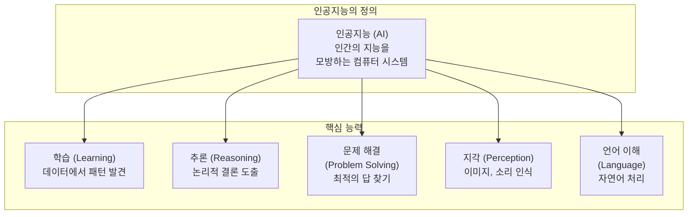
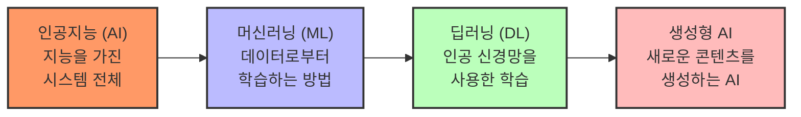
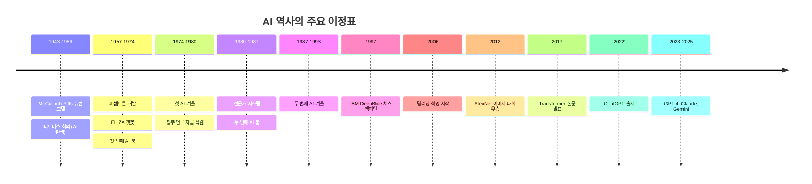
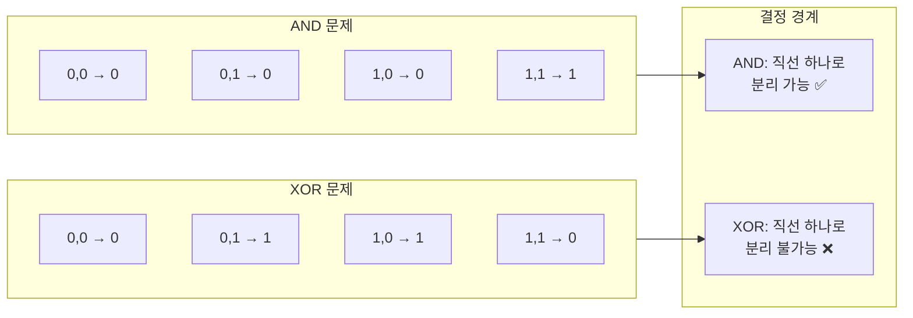
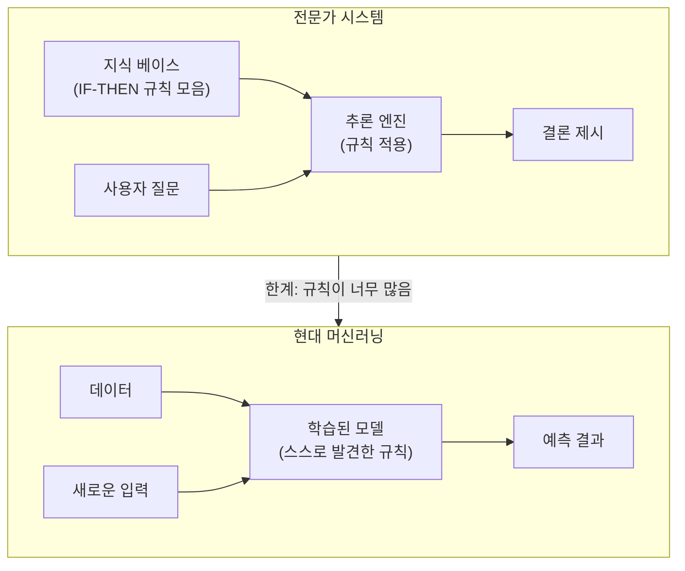
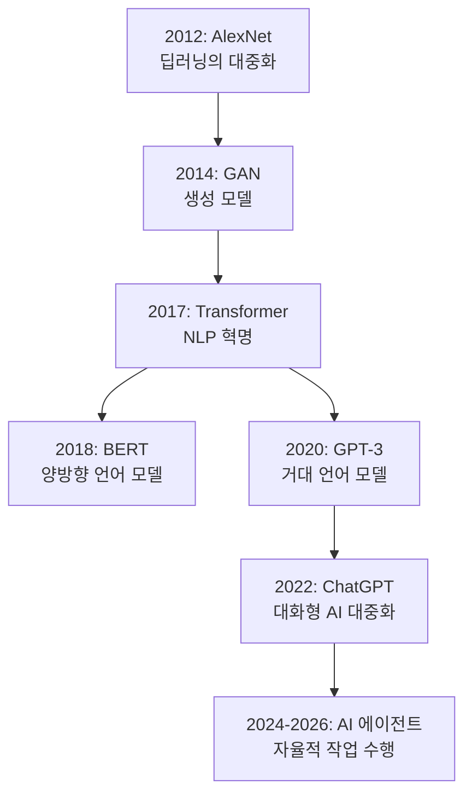
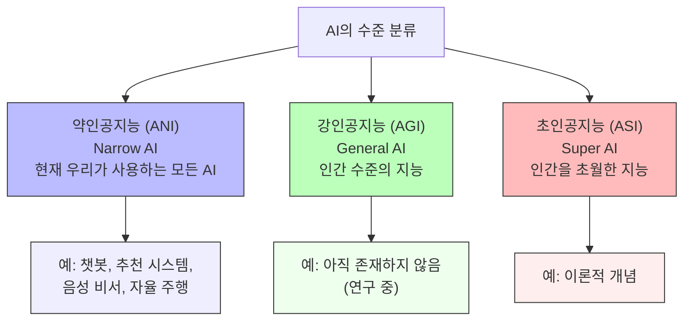
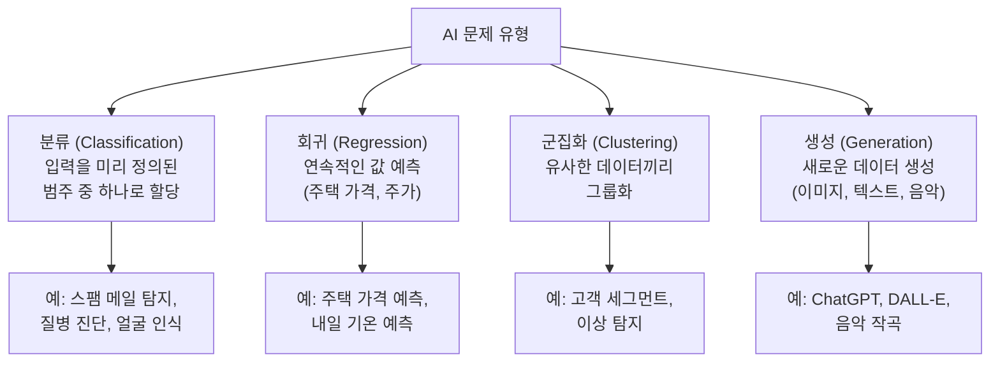
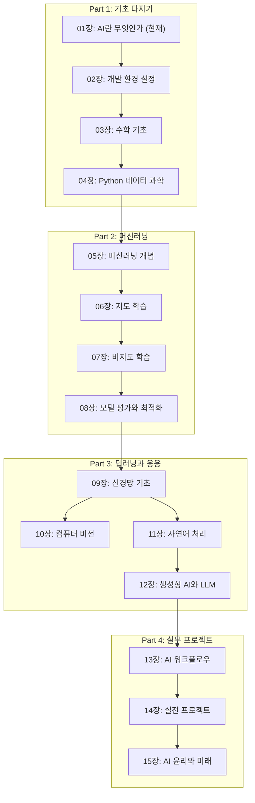

# 01장: AI란 무엇인가?

> **🎯 학습 목표**
> - 인공지능, 머신러닝, 딥러닝의 개념과 차이를 이해합니다.
> - AI의 역사적 발전 과정을 주요 사건 중심으로 파악합니다.
> - AI가 해결할 수 있는 문제의 유형을 분류할 수 있습니다.
> - 이 책에서 배울 전체 내용의 로드맵을 확인합니다.

---

## 1.1 인공지능이란?

**인공지능(Artificial Intelligence, AI)** 은 인간의 지능을 컴퓨터 시스템으로 구현한 것을 말합니다. 더 구체적으로 말하면, 학습, 추론, 문제 해결, 패턴 인식, 언어 이해 등 인간의 지능적 행동을 모방하는 소프트웨어와 하드웨어 시스템입니다.



### AI, ML, DL의 관계

AI는 가장 넓은 개념이며, AI를 구현하는 방법 중 하나가 머신러닝(ML)입니다. 그리고 머신러닝의 한 분야로 딥러닝(DL)이 있습니다.



| 개념 | 설명 | 예시 |
|------|------|------|
| **인공지능 (AI)** | 인간의 지능을 모방하는 모든 시스템 | 체스 프로그램, 추천 시스템 |
| **머신러닝 (ML)** | 데이터를 학습하여 성능을 개선하는 AI의 하위 분야 | 스팸 메일 필터, 가격 예측 |
| **딥러닝 (DL)** | 인공 신경망을 사용한 머신러닝의 하위 분야 | 이미지 인식, 음성 인식 |
| **생성형 AI** | 새로운 콘텐츠를 생성하는 딥러닝 모델 | ChatGPT, DALL-E, Stable Diffusion |

---

## 1.2 AI의 역사

AI의 역사는 1950년대부터 현재까지 약 70년 이상 이어져 왔습니다. 이 기간 동안 여러 번의 **부흥기(AI Spring)** 와 **침체기(AI Winter)** 가 있었습니다.



### 1.2.1 태동기 (1943-1956)

1943년, Warren McCulloch와 Walter Pitts는 인간 뉴런의 수학적 모델을 발표했습니다. 이것이 오늘날 인공 신경망의 기초가 되었습니다.

```mermaid
flowchart LR
  subgraph McCullochPitts[McCulloch-Pitts 뉴런 (1943)]
    X1["입력 1"] --> SUM["∑ (가중합)"]
    X2["입력 2"] --> SUM
    X3["입력 n"] --> SUM
    SUM --> TH["임계값 함수"]
    TH --> Y["출력"]
  end

  subgraph Modern[현대 뉴런]
    WX1["입력 × 가중치"] --> SUM2["∑ + 바이어스"]
    WX2["입력 × 가중치"] --> SUM2
    WX3["입력 × 가중치"] --> SUM2
    SUM2 --> ACT["활성화 함수<br/>(ReLU, Sigmoid)"]
    ACT --> Y2["출력"]
  end

  McCullochPosts -->|"70년 발전"| Modern
```

1956년, 존 매카시(John McCarthy)는 다트머스 회의에서 **"인공지능(Artificial Intelligence)"** 이라는 용어를 처음 사용했습니다. 이 회의는 AI라는 학문 분야의 탄생을 알린 역사적인 순간이었습니다.

### 1.2.2 첫 번째 AI 붐과 겨울 (1957-1980)

1957년, 프랭크 로젠블라트(Frank Rosenblatt)는 **퍼셉트론(Perceptron)** 을 개발했습니다. 퍼셉트론은 가장 단순한 형태의 신경망으로, 패턴 인식이 가능했습니다.

그러나 1969년, 마빈 민스키(Marvin Minsky)가 퍼셉트론이 **XOR 문제**를 해결할 수 없음을 수학적으로 증명하면서 첫 번째 AI 겨울이 시작되었습니다.



> **XOR 문제:** 퍼셉트론은 선형 분리(linear separation)만 가능합니다. AND는 직선 하나로 0과 1을 구분할 수 있지만, XOR은 직선 하나로 구분할 수 없습니다. 이 문제는 **다층 퍼셉트론(MLP)** 과 **역전파(Backpropagation)** 알고리즘의 등장으로 1980년대에 해결됩니다.

### 1.2.3 전문가 시스템과 두 번째 붐 (1980-1993)

1980년대에는 **전문가 시스템(Expert System)** 이 주를 이루었습니다. 이는 "IF-THEN" 규칙을 수천 개 코딩하여 특정 분야(의료 진단, 광물 탐사 등)의 전문가를 대체하려는 시도였습니다.



전문가 시스템은 유지보수가 어렵고 새로운 상황에 대처하기 어려웠습니다. 이로 인해 두 번째 AI 겨울이 찾아왔습니다.

### 1.2.4 딥러닝 혁명 (2006-현재)

2006년, 제프리 힌튼(Geoffrey Hinton)이 **딥러닝(Deep Learning)** 의 가능성을 열었습니다. 2012년에는 Alex Krizhevsky의 **AlexNet**이 이미지 인식 대회(ImageNet)에서 압도적인 성능으로 우승하며 딥러닝 붐을 이끌었습니다.

2017년, Google 연구팀의 **"Attention Is All You Need"** 논문은 트랜스포머(Transformer) 아키텍처를 발표했고, 이는 NLP 분야에 혁명을 일으켰습니다.



---

## 1.3 AI의 종류

AI는 기능 수준에 따라 다음 세 가지로 분류할 수 있습니다.



| 구분 | 설명 | 현재 상태 |
|------|------|-----------|
| **약인공지능 (ANI)** | 특정 작업만 수행할 수 있는 AI | ✅ 현재 대부분의 AI |
| **강인공지능 (AGI)** | 인간처럼 다양한 작업을 수행할 수 있는 AI | ❌ 아직 개발되지 않음 |
| **초인공지능 (ASI)** | 모든 면에서 인간을 초월하는 AI | ❌ 이론적 개념 |

---

## 1.4 AI가 해결하는 문제 유형

AI가 실제로 해결하는 문제는 크게 다음 범주로 나눌 수 있습니다.



### 주요 응용 분야

| 분야 | 적용 사례 | 사용 기술 |
|------|-----------|----------|
| **의료** | 질병 진단, 의료 영상 분석, 신약 개발 | CNN, Transformer |
| **금융** | 사기 탐지, 주가 예측, 리스크 관리 | 결정 트리, LSTM |
| **자율 주행** | 객체 탐지, 경로 계획, 상황 인식 | CNN, 강화 학습 |
| **자연어 처리** | 번역, 요약, 감성 분석, 챗봇 | Transformer, BERT, GPT |
| **컴퓨터 비전** | 얼굴 인식, 객체 탐지, 이미지 생성 | CNN, GAN, Stable Diffusion |
| **추천 시스템** | 상품 추천, 콘텐츠 추천 | 협업 필터링, 딥러닝 |

---

## 1.5 이 책의 전체 흐름

이 책은 다음과 같은 흐름으로 진행됩니다.



---

## 📋 한눈에 정리

| 개념 | 정의 | 핵심 포인트 |
|------|------|------------|
| **인공지능 (AI)** | 인간의 지능을 모방하는 컴퓨터 시스템 | 가장 넓은 개념 |
| **머신러닝 (ML)** | 데이터로부터 학습하는 AI의 하위 분야 | 코드가 아닌 데이터로 학습 |
| **딥러닝 (DL)** | 인공 신경망을 사용한 머신러닝 | ML의 하위 분야, 가장 성능이 좋음 |
| **생성형 AI** | 새로운 콘텐츠를 생성하는 AI | ChatGPT, DALL-E 등 |
| **ANI** | 특정 작업만 수행 | 현재 AI의 수준 |
| **AGI** | 인간 수준의 범용 AI | 아직 실현되지 않음 |

---

## ✏️ 연습 문제

1. **AI, ML, DL의 차이**를 한 문장씩 설명하고, 각각의 예를 들어보세요.

2. 다음 중 AI가 해결하기 가장 어려운 문제는 무엇일까요? 이유도 생각해보세요.
   - a) 이메일이 스팸인지 구분하기
   - b) 주택 가격 예측하기
   - c) 인간과 자연스럽게 대화하기
   - d) 내일의 날씨 예측하기

3. **XOR 문제**가 무엇이며, 이것이 왜 AI 역사에서 중요한지 설명해보세요.

4. 여러분이 AI로 해결하고 싶은 **실생활 문제**를 하나 정하고, 어떤 종류의 AI 기술이 필요할지 예측해보세요.

5. 다음 문장이 참인지 거짓인지 판단하세요.
   - "딥러닝은 머신러닝의 하위 분야이다." (___)
   - "현재 AI는 인간보다 모든 면에서 뛰어나다." (___)
   - "GPT는 생성형 AI의 한 예이다." (___)

---

> **🔄 다음 장에서는** AI 프로그래밍을 위한 개발 환경을 설정합니다. Python, Anaconda, Jupyter Notebook, PyTorch 등을 설치하고 GPU 환경까지 구성하는 방법을 배웁니다.
