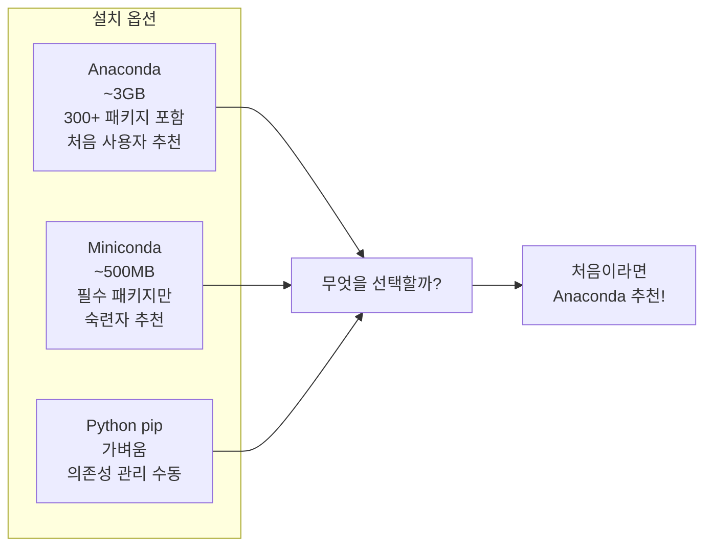
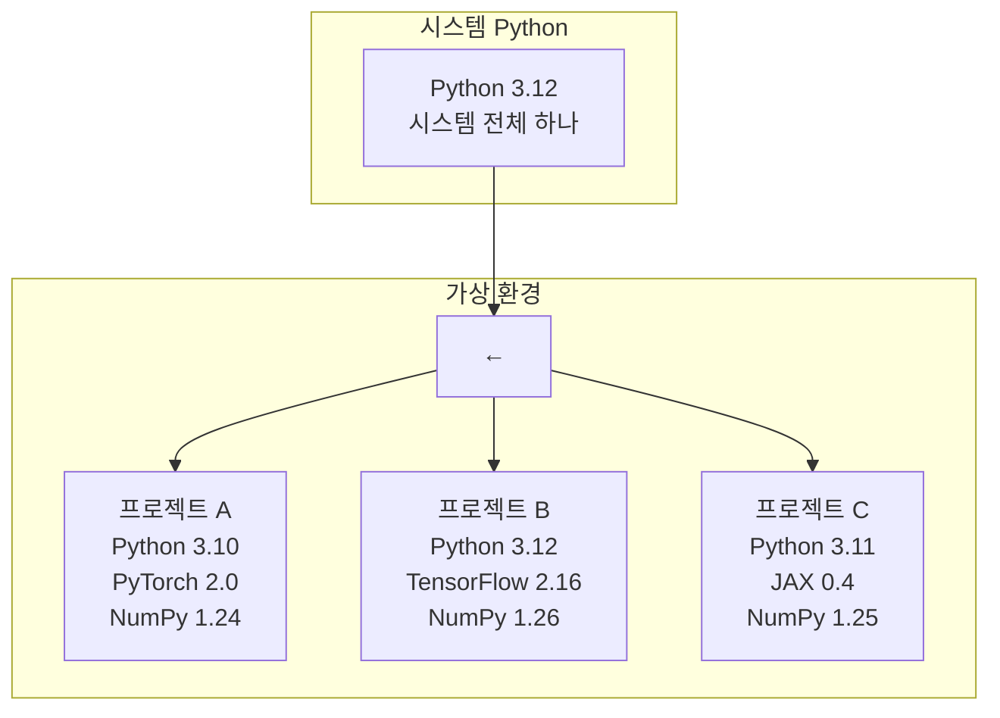
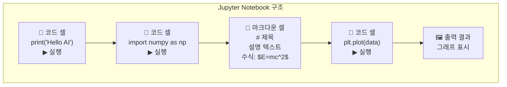
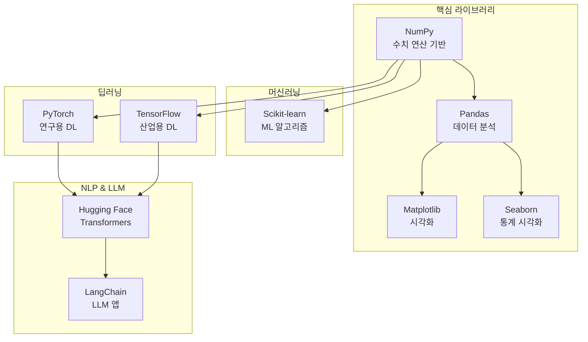
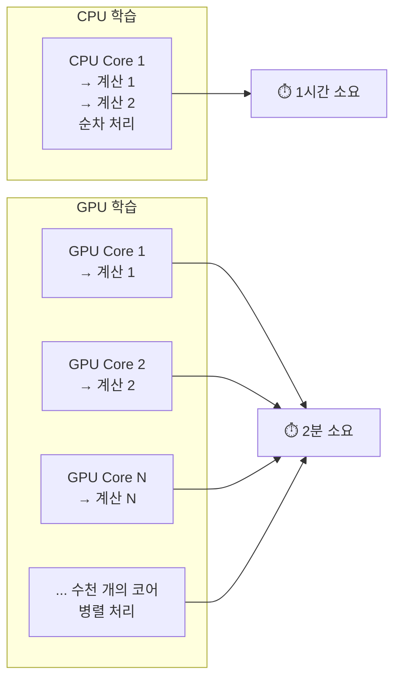
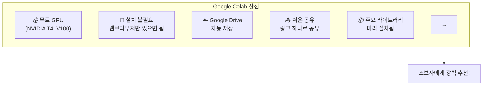

# 02장: 개발 환경 설정

> **🎯 학습 목표**
> - Python과 Anaconda를 설치하고 가상 환경을 구성할 수 있습니다.
> - Jupyter Notebook과 VS Code를 AI 개발에 활용할 수 있습니다.
> - 주요 AI 라이브러리(NumPy, Pandas, Scikit-learn, PyTorch)를 설치할 수 있습니다.
> - GPU 환경(CUDA)과 Google Colab을 사용할 수 있습니다.

---

## 2.1 개요

AI 개발을 시작하기 전에 먼저 개발 환경을 갖추어야 합니다. 개발 환경이란 Python 인터프리터, 필요한 라이브러리, 코드 편집기, 그리고 선택적으로 GPU 가속 도구까지 포함하는 통합된 작업 공간을 의미합니다. 이 장에서는 AI 개발에 필요한 모든 도구와 라이브러리를 설치하는 방법을 단계별로 설명합니다. 특히 Anaconda를 활용한 가상 환경 구성부터 Jupyter Notebook, VS Code, GPU 설정까지 전 과정을 상세히 다룰 것입니다. 독자께서는 이 장을 마친 후 즉시 AI 코드를 작성하고 실행할 수 있는 완전한 개발 환경을 갖추게 됩니다.

```mermaid
flowchart TB
  subgraph Setup[AI 개발 환경 구성]
    Step1["Python 3.10+ 설치"] --> Step2["가상 환경 생성"]
    Step2 --> Step3["핵심 라이브러리 설치"]
    Step3 --> Step4{GPU 사용?"}
    Step4 -->|"Yes"| Step5["CUDA + cuDNN 설치"]
    Step4 -->|"No"| Step6["Google Colab 사용"]
    Step5 --> Step7["PyTorch/TensorFlow<br/>(GPU 버전)"]
    Step6 --> Step8["웹브라우저에서<br/>즉시 코딩"]
    Step7 --> Done["✅ 개발 환경 완료"]
    Step8 --> Done
  end
```

위 다이어그램은 AI 개발 환경을 구성하는 전체 흐름을 한눈에 보여줍니다. Python 설치에서 시작하여 가상 환경 생성, 필수 라이브러리 설치, 그리고 GPU 활용 여부에 따른 분기까지의 과정을 단계적으로 나타내고 있습니다. GPU가 있는 사용자는 CUDA를 설치하여 고성능 딥러닝 학습을 진행할 수 있고, GPU가 없는 사용자도 Google Colab을 통해 클라우드 기반 GPU를 무료로 활용할 수 있습니다. 이렇게 두 가지 경로 모두 최종적으로는 완전한 AI 개발 환경을 갖추게 됩니다.

### 왜 많은 도구가 필요할까?

AI 개발은 단순히 Python 하나만으로 이루어지지 않습니다. 데이터 처리, 모델 학습, 결과 시각화, 코드 관리 등 다양한 작업을 수행해야 하므로 각 작업에 최적화된 여러 도구를 함께 사용하는 것이 효과적입니다. 아래 표는 AI 개발에 필요한 주요 도구들과 각각의 용도를 정리한 것입니다.

| 도구 | 용도 | 이유 |
|------|------|------|
| **Python** | AI 프로그래밍 언어 | 가장 풍부한 AI/ML 라이브러리 생태계 |
| **Anaconda** | 패키지 & 환경 관리자 | 패키지 의존성 충돌 방지, GPU 지원 |
| **Jupyter** | 대화형 개발 환경 | 데이터 탐색, 시각화, 실험에 최적 |
| **VS Code** | 코드 편집기 | Jupyter 통합, 디버깅, Git |

이러한 도구들은 각각 고유한 장점을 가지고 있으며, 함께 사용할 때 시너지 효과를 발휘합니다. Python은 AI/ML 분야에서 가장 널리 사용되는 언어로서 방대한 라이브러리 생태계를 자랑합니다. Anaconda는 이러한 라이브러리들의 의존성을 체계적으로 관리해 주며, Jupyter Notebook은 코드와 결과를 함께 기록할 수 있어 데이터 분석과 실험에 이상적입니다. VS Code는 강력한 편집 기능과 Jupyter 통합을 제공하여 생산성을 극대화해 줍니다.

> **💡 참고:** 이 장에서 다루는 도구들은 AI 개발의 표준 도구들입니다. 모든 도구를 한 번에 설치할 필요는 없으며, 프로젝트의 필요에 따라 선택적으로 설치해도 됩니다.

---

## 2.2 👨‍💻 실전 프로젝트: 개발 환경 확인하기

본격적인 설치에 앞서, 현재 시스템의 상태를 먼저 확인해 보겠습니다. 아래 Python 스크립트는 시스템에 설치된 Python 버전, 주요 라이브러리의 설치 여부, GPU 사용 가능 여부, 그리고 기본적인 시스템 정보를 출력합니다. 이 스크립트를 실행하면 앞으로 이 책에서 사용할 환경이 제대로 준비되었는지 한눈에 파악할 수 있습니다. 또한 새로운 컴퓨터에서 개발을 시작할 때마다 이 스크립트를 다시 실행하면 환경 설정 상태를 빠르게 진단할 수 있는 유용한 도구가 될 것입니다.

```python
"""
실전 프로젝트: 개발 환경 확인 스크립트
이 스크립트는 현재 시스템의 AI 개발 환경을 종합적으로 진단합니다.
Python 버전, 주요 라이브러리 설치 상태, GPU 가속 가능 여부를 확인합니다.
"""
import sys
import platform
import subprocess


def check_python_version():
    """Python 버전을 확인하고 AI 개발에 적합한지 판단합니다."""
    version = sys.version_info
    print(f"[Python] 버전: {sys.version}")
    if version.major == 3 and version.minor >= 10:
        print(f"[Python] ✅ AI 개발에 적합한 버전입니다 (3.10+).")
    else:
        print(f"[Python] ⚠️ AI 개발에는 Python 3.10 이상을 권장합니다.")
    return version


def check_library(lib_name, import_name=None):
    """특정 라이브러리가 설치되었는지 확인하고 버전을 출력합니다."""
    try:
        lib = __import__(import_name or lib_name)
        version = getattr(lib, "__version__", "버전 정보 없음")
        print(f"[{lib_name}] ✅ 설치됨 (버전: {version})")
        return True
    except ImportError:
        print(f"[{lib_name}] ❌ 설치되지 않음")
        return False


def check_gpu():
    """GPU 사용 가능 여부를 확인합니다.
    PyTorch와 TensorFlow 각각에 대해 GPU 접근 가능성을 테스트합니다."""
    print("\n--- GPU 확인 ---")
    
    # PyTorch GPU 확인
    try:
        import torch
        cuda_available = torch.cuda.is_available()
        if cuda_available:
            print(f"[PyTorch] ✅ GPU 사용 가능")
            print(f"[PyTorch] GPU 이름: {torch.cuda.get_device_name(0)}")
            print(f"[PyTorch] GPU 개수: {torch.cuda.device_count()}")
            
            # 간단한 텐서 연산으로 GPU 작동 테스트
            x = torch.rand(1000, 1000).cuda()
            y = torch.rand(1000, 1000).cuda()
            z = torch.matmul(x, y)
            print(f"[PyTorch] ✅ GPU 연산 테스트 성공: {z.shape}")
        else:
            print("[PyTorch] ❌ GPU를 사용할 수 없습니다 (CPU 모드로 동작)")
    except ImportError:
        print("[PyTorch] ❌ PyTorch가 설치되지 않았습니다")
    
    # TensorFlow GPU 확인
    try:
        import tensorflow as tf
        gpus = tf.config.list_physical_devices("GPU")
        if gpus:
            print(f"[TensorFlow] ✅ GPU 사용 가능: {len(gpus)}개")
            for gpu in gpus:
                print(f"  - {gpu}")
        else:
            print("[TensorFlow] ❌ GPU를 사용할 수 없습니다 (CPU 모드로 동작)")
    except ImportError:
        print("[TensorFlow] ❌ TensorFlow가 설치되지 않았습니다")


def check_system_info():
    """운영체제 및 하드웨어 정보를 출력합니다."""
    print("\n--- 시스템 정보 ---")
    print(f"운영체제: {platform.system()} {platform.release()}")
    print(f"아키텍처: {platform.machine()}")
    print(f"프로세서: {platform.processor()}")
    
    # 메모리 정보 (Linux)
    if platform.system() == "Linux":
        try:
            result = subprocess.run(
                ["free", "-h"], capture_output=True, text=True
            )
            print(f"메모리:\n{result.stdout}")
        except FileNotFoundError:
            pass
    
    # NVIDIA 드라이버 정보
    try:
        result = subprocess.run(
            ["nvidia-smi", "--query-gpu=name,memory.total,driver_version",
             "--format=csv,noheader"],
            capture_output=True, text=True
        )
        if result.returncode == 0:
            print(f"NVIDIA GPU: {result.stdout.strip()}")
    except FileNotFoundError:
        print("NVIDIA 드라이버가 감지되지 않았습니다.")


def main():
    print("=" * 60)
    print("  AI 개발 환경 진단 스크립트")
    print("=" * 60)
    
    check_python_version()
    
    print("\n--- 주요 라이브러리 확인 ---")
    libraries = [
        ("NumPy", "numpy"),
        ("Pandas", "pandas"),
        ("Matplotlib", "matplotlib"),
        ("Scikit-learn", "sklearn"),
        ("PyTorch", "torch"),
        ("TensorFlow", "tensorflow"),
        ("Jupyter", "jupyter"),
    ]
    for name, import_name in libraries:
        check_library(name, import_name)
    
    check_gpu()
    check_system_info()
    
    print("\n" + "=" * 60)
    print("  환경 진단이 완료되었습니다.")
    print("=" * 60)


if __name__ == "__main__":
    main()
```

위 스크립트는 다섯 가지 주요 기능으로 구성되어 있습니다. 첫째, `check_python_version()` 함수는 현재 시스템의 Python 버전이 AI 개발에 적합한 3.10 이상인지 검사합니다. 둘째, `check_library()` 함수는 각 라이브러리를 임포트하여 설치 여부와 버전을 확인합니다. 셋째, `check_gpu()` 함수는 PyTorch와 TensorFlow 각각에 대해 GPU 접근 가능성을 테스트하고 간단한 텐서 연산으로 실제 GPU 작동을 검증합니다. 넷째, `check_system_info()` 함수는 운영체제, 메모리, NVIDIA 드라이버 정보를 수집합니다. 마지막으로 `main()` 함수는 이 모든 검사를 순서대로 실행하고 결과를 종합적으로 출력합니다.

> **💡 실행 방법:** 위 코드를 `check_env.py` 파일로 저장한 후 터미널에서 `python check_env.py` 명령어로 실행하면 됩니다. 모든 라이브러리가 아직 설치되지 않은 상태라면 일부 항목이 ❌로 표시될 수 있으며, 이는 정상입니다. 이후 섹션에서 하나씩 설치해 나갈 것입니다.

이 실전 프로젝트를 통해 앞으로 구축할 개발 환경의 현재 상태를 명확히 파악할 수 있습니다. 이제 본격적으로 각 도구를 설치하는 방법을 알아보겠습니다. 가장 먼저 AI 개발의 기반이 되는 Python과 이를 효율적으로 관리해 주는 Anaconda를 설치하는 과정부터 시작하겠습니다.

---

## 2.3 Python과 Anaconda 설치

AI 개발 환경의 핵심은 Python입니다. Python은 배우기 쉽고 다양한 라이브러리가 풍부하여 AI 및 데이터 과학 분야에서 가장 널리 사용되는 언어로 자리 잡았습니다. 그러나 Python만 단독으로 사용하면 라이브러리 간 의존성 충돌이나 버전 관리 문제가 발생할 수 있습니다. 이를 해결하기 위해 Anaconda라는 통합 패키지 관리 도구를 함께 사용하는 것이 일반적입니다. Anaconda는 Python 패키지 관리와 가상 환경 관리를 위한 종합 솔루션을 제공합니다.

### 2.3.1 Anaconda vs Miniconda

Anaconda와 Miniconda는 모두 Python 패키지 관리와 가상 환경 관리를 위한 도구입니다. Anaconda는 300개 이상의 주요 데이터 과학 패키지를 포함한 전체 배포판으로, 처음 사용하는 분께서 별도의 패키지 설치 없이 바로 시작할 수 있다는 장점이 있습니다. 반면 Miniconda는 필수 패키지만 포함하고 필요한 패키지만 추가로 설치하는 방식이므로 저장 공간을 절약할 수 있고 숙련된 사용자에게 적합합니다. pip만 사용하는 방식은 가장 가볍지만 의존성 관리를 수동으로 해야 하므로 AI 개발처럼 복잡한 패키지 조합이 필요한 경우에는 추천되지 않습니다.



세 가지 옵션 중에서 어떤 것을 선택해야 할지 고민될 수 있습니다. Anaconda는 방대한 패키지를 한 번에 설치해 주므로 초보자분께 가장 편리한 선택입니다. Miniconda는 더 가볍고 필요한 것만 설치하는 맞춤형 접근 방식으로, Python과 패키지 관리에 이미 익숙한 분께 적합합니다. pip만 사용하는 방식은 가장 가볍지만 의존성 관리를 수동으로 해야 하므로 AI 개발처럼 복잡한 패키지 조합이 필요한 경우에는 추천되지 않습니다. 일반적으로 AI 개발을 처음 시작하는 학습자분께는 Anaconda를, 이미 Python에 익숙한 분께는 Miniconda를 추천합니다.

### 2.3.2 설치 방법

**Windows:**
1. [Anaconda 공식 사이트](https://www.anaconda.com/download)에서 설치 프로그램 다운로드
2. "Add Anaconda3 to my PATH environment variable" 체크
3. 설치 완료 후 Anaconda Prompt 실행

**macOS/Linux:**
```bash
# Anaconda 설치 (Linux)
# wget 명령어로 공식 저장소에서 Anaconda 설치 스크립트를 다운로드합니다.
# 이 스크립트에는 Python과 300개 이상의 데이터 과학 패키지가 포함되어 있습니다.
wget https://repo.anaconda.com/archive/Anaconda3-2024.10-Linux-x86_64.sh
# 다운로드한 셸 스크립트를 bash로 실행하여 대화형 설치를 진행합니다.
# 설치 과정에서 라이선스 동의, 설치 경로 지정 등을 묻는 메시지가 나타납니다.
bash Anaconda3-2024.10-Linux-x86_64.sh

# 또는 Miniconda 설치 (더 가벼움)
# Miniconda는 Anaconda의 경량 버전으로 필수 구성 요소만 포함되어 있습니다.
# 설치 시간과 디스크 공간을 절약하려는 사용자에게 적합합니다.
wget https://repo.anaconda.com/miniconda/Miniconda3-latest-Linux-x86_64.sh
# 설치 스크립트를 실행한 후 터미널을 새로 열거나 source 명령어를 실행합니다.
bash Miniconda3-latest-Linux-x86_64.sh
```

위 명령어들에서 `wget`은 웹에서 파일을 다운로드하는 유틸리티이며, 첫 번째 인자로 지정된 URL에서 설치 스크립트를 내려받습니다. 그다음 `bash` 명령어로 해당 셸 스크립트를 실행하면 대화형 설치 프로그램이 시작됩니다. 설치 과정에서 라이선스 동의, 설치 디렉터리 선택 등을 묻는 메시지가 나타나면 안내에 따라 진행하시면 됩니다. 설치가 완료된 후에는 터미널을 새로 열거나 `source ~/.bashrc` 명령어로 변경 사항을 적용해야 conda 명령어를 사용할 수 있습니다.

### 2.3.3 설치 확인

```bash
# Python 버전을 확인하여 설치가 올바르게 되었는지 검증합니다.
# AI 개발을 위해서는 Python 3.10 이상이 권장됩니다.
python --version
# Python 3.12.0
# conda 명령어가 정상 동작하는지 버전을 통해 확인합니다.
# conda가 설치되면 패키지 관리와 가상 환경 생성이 가능해집니다.
conda --version
# conda 24.9.0
```

`python --version` 명령어는 현재 시스템에 설치된 Python 인터프리터의 버전을 출력합니다. 출력 결과에 `Python 3.10.0` 이상의 버전이 표시되면 AI 개발에 적합한 환경이 준비된 것입니다. `conda --version` 명령어는 Anaconda 또는 Miniconda에 포함된 패키지 관리자의 버전을 확인합니다. 두 명령어 모두 정상적으로 버전이 출력된다면 Python과 conda가 문제없이 설치된 것이므로 다음 단계로 진행할 수 있습니다. 만약 명령어를 찾을 수 없다는 오류가 발생한다면 PATH 환경 변수를 확인하거나 터미널을 새로 열어야 합니다.

Python과 Anaconda를 성공적으로 설치하셨다면 시스템에 하나의 기본 Python 환경이 준비된 것입니다. 그러나 실제 프로젝트를 진행할 때는 여러 프로젝트에서 서로 다른 라이브러리 버전이 필요할 수 있으므로, 각 프로젝트마다 독립된 환경을 사용하는 것이 좋습니다. 다음 절에서는 이러한 가상 환경을 구성하는 방법을 알아보겠습니다.

---

## 2.4 가상 환경

가상 환경은 프로젝트마다 독립된 Python 패키지 환경을 제공합니다. 서로 다른 프로젝트가 같은 라이브러리의 다른 버전을 사용해야 할 때 충돌을 방지합니다. 예를 들어 프로젝트 A는 PyTorch 2.0이 필요하고 프로젝트 B는 PyTorch 2.5가 필요하다면, 하나의 시스템에 두 버전을 동시에 설치하는 것은 어렵습니다. 가상 환경을 사용하면 각 프로젝트가 자신만의 독립된 라이브러리 공간을 가지게 되므로 이러한 버전 충돌 문제를 근본적으로 해결할 수 있습니다. 또한 가상 환경은 프로젝트의 의존성을 명확하게 기록하고 재현할 수 있게 해 주므로 협업과 배포 측면에서도 큰 이점을 제공합니다.



위 다이어그램은 가상 환경의 개념을 시각적으로 보여줍니다. 시스템에는 하나의 기본 Python만 설치되어 있지만, 가상 환경을 통해 각 프로젝트에 서로 다른 Python 버전과 라이브러리 조합을 할당할 수 있습니다. 프로젝트 A는 Python 3.10과 PyTorch 2.0을, 프로젝트 B는 Python 3.12와 TensorFlow 2.16을 각각 독립적으로 사용할 수 있습니다. 이렇게 함으로써 한 프로젝트의 라이브러리 업데이트가 다른 프로젝트에 영향을 미치는 것을 방지할 수 있습니다. 각 가상 환경은 완전히 격리되어 있으므로, 한 환경에서 발생한 문제가 다른 환경으로 전파되지 않습니다.

**가상 환경 생성 및 활성화:**

```bash
# 방법 1: conda 가상 환경 (추천)
# conda create 명령어로 'ai-book'이라는 이름의 가상 환경을 생성합니다.
# -n 옵션은 환경 이름을 지정하고, python=3.12는 Python 버전을 명시합니다.
# conda는 SAT solver를 사용하여 의존성 충돌을 최소화합니다.
conda create -n ai-book python=3.12
# 생성된 가상 환경을 활성화합니다. 활성화 후에는 이 환경에 설치된
# 패키지만 사용할 수 있으며, 터미널 프롬프트에 환경 이름이 표시됩니다.
conda activate ai-book

# 방법 2: venv (가벼움)
# Python 내장 모듈인 venv를 사용하여 가상 환경을 생성합니다.
# conda와 달리 추가 설치가 필요 없으며 매우 가볍습니다.
# 단, 비Python 패키지(CUDA 등)는 지원하지 않습니다.
python -m venv ai-book-env
# Linux/macOS에서 생성한 가상 환경을 활성화합니다.
# activate 스크립트를 source 명령어로 실행하면 환경이 활성화됩니다.
source ai-book-env/bin/activate  # Linux/macOS
# ai-book-env\Scripts\activate   # Windows

# 가상 환경 비활성화
# 현재 활성화된 가상 환경을 종료하고 시스템 기본 Python으로 돌아갑니다.
# 비활성화 후에는 시스템에 설치된 기본 패키지들이 다시 사용됩니다.
conda deactivate
```

첫 번째 방법인 `conda create -n ai-book python=3.12` 명령어는 conda의 강력한 의존성 해결 엔진을 사용하여 가상 환경을 생성합니다. `-n` 옵션은 환경의 이름을 지정하며, 여기서는 `ai-book`이라는 이름을 사용하였습니다. `python=3.12`를 명시하면 해당 버전의 Python 인터프리터가 환경에 설치되며, 이후 설치하는 모든 패키지는 이 환경 내에서만 관리됩니다. 생성된 환경을 `conda activate` 명령어로 활성화하면 터미널 프롬프트 앞에 `(ai-book)`과 같이 환경 이름이 표시되어 현재 어떤 환경에서 작업 중인지 쉽게 확인할 수 있습니다.

두 번째 방법인 `python -m venv ai-book-env`는 Python에 내장된 `venv` 모듈을 사용하는 방식입니다. 이 방법은 conda가 설치되어 있지 않은 상황에서도 사용할 수 있으며, 매우 가벼운 환경을 제공합니다. 다만 `venv`는 Python 패키지만 관리할 수 있고 비Python 라이브러리(CUDA 등)는 지원하지 않는다는 한계가 있습니다. AI 개발에서는 일반적으로 conda 가상 환경이 더 권장됩니다. 가상 환경을 더 이상 사용하지 않을 때는 `conda deactivate` 명령어로 비활성화하면 시스템 기본 Python 환경으로 돌아갑니다.

### conda vs pip

| 특징 | conda | pip |
|------|-------|-----|
| **패키지** | Python + 비Python 패키지 | Python 패키지만 |
| **의존성 해결** | 우수 (SAT solver 사용) | 기본적 |
| **GPU 지원** | NVIDIA CUDA 패키지 제공 | 수동 설치 필요 |
| **속도** | 느림 | 빠름 |
| **사용처** | 데이터 사이언스, AI | 일반 Python 개발 |

conda와 pip는 모두 Python 패키지를 설치하는 도구이지만 근본적인 차이점이 있습니다. conda는 Python 패키지뿐만 아니라 C/C++ 라이브러리, CUDA 드라이버 등 비Python 의존성까지 함께 관리할 수 있습니다. 또한 conda는 SAT solver라는 고급 알고리즘을 사용하여 패키지 간 의존성 충돌을 최소화합니다. 반면 pip는 설치 속도가 빠르고 더 다양한 패키지를 제공하지만, 의존성 해결 능력이 상대적으로 부족하여 복잡한 환경에서 충돌이 발생할 수 있습니다. AI 개발 현장에서는 두 도구의 장점을 결합한 하이브리드 방식을 가장 많이 사용합니다.

> **실무 팁:** conda로 환경을 만들고, conda에 없는 패키지는 pip로 설치하는 **하이브리드 방식**이 가장 실용적입니다. 예를 들어 `conda create -n myenv python=3.12`로 기본 환경을 만든 후, PyTorch는 conda로 설치하고 Hugging Face 라이브러리는 pip로 설치하는 식으로 활용할 수 있습니다.

가상 환경을 구성하고 conda와 pip의 차이를 이해하셨다면, 이제 코드를 실제로 작성하고 실행할 도구가 필요합니다. Jupyter Notebook은 AI 개발에서 가장 널리 사용되는 대화형 개발 환경으로, 코드와 결과를 함께 관리할 수 있어 데이터 분석과 실험에 매우 적합합니다. 다음 절에서는 Jupyter Notebook의 설치와 사용법을 알아보겠습니다.

---

## 2.5 Jupyter Notebook

Jupyter Notebook은 웹 브라우저에서 코드를 작성하고 실행할 수 있는 대화형 개발 환경입니다. AI/ML 분야에서 가장 널리 사용되는 도구 중 하나입니다. 전통적인 IDE와 달리 Jupyter Notebook은 코드를 작은 단위(셀)로 나누어 실행할 수 있어 실험과 탐색적 분석에 매우 적합합니다. 또한 코드의 실행 결과가 바로 아래에 표시되므로 데이터의 변화를 즉시 확인할 수 있습니다. 하나의 노트북 파일에는 코드, 실행 결과, 시각화 자료, 설명 텍스트가 모두 포함되어 있어 재현 가능한 분석 보고서를 만들 수 있습니다.

### 설치 및 실행

```bash
# conda 환경에서 설치
# conda install 명령어로 jupyter와 notebook 패키지를 함께 설치합니다.
# conda 채널을 통해 설치하면 의존성이 자동으로 해결됩니다.
conda install jupyter notebook

# 또는 pip로 설치
# conda 환경이 없거나 최신 버전이 필요하다면 pip로도 설치 가능합니다.
pip install jupyter notebook

# 실행
# 위 명령어를 실행하면 기본 웹 브라우저가 열리면서 Jupyter Notebook이 시작됩니다.
# 터미널에는 서버 로그가 출력되며, 종료하려면 Ctrl+C를 누르면 됩니다.
jupyter notebook

# Jupyter Lab (최신 버전, 추천)
# Jupyter Lab은 Notebook의 업그레이드 버전으로 더 많은 기능을 제공합니다.
pip install jupyterlab
# jupyter lab 명령어로 실행하면 탭 기반의 현대적인 인터페이스를 사용할 수 있습니다.
jupyter lab
```

`jupyter notebook` 명령어를 실행하면 로컬 서버가 시작되고 기본 웹 브라우저에서 Jupyter Notebook 인터페이스가 열립니다. 서버는 터미널에서 실행된 상태를 유지하며, 터미널을 종료하면 서버도 함께 중지됩니다. Jupyter Lab은 Jupyter Notebook의 차세대 인터페이스로, 여러 노트북을 탭으로 관리할 수 있고 파일 브라우저, 터미널, 텍스트 편집기 등을 하나의 창에서 사용할 수 있어 더욱 강력한 개발 경험을 제공합니다. AI 개발자들 사이에서는 점차 Jupyter Lab이 표준으로 자리 잡고 있습니다.

### Jupyter Notebook 구조



Jupyter Notebook은 크게 코드 셀(Cell)과 마크다운 셀이라는 두 가지 유형의 블록으로 구성됩니다. 코드 셀에는 Python 코드를 작성하고 실행할 수 있으며, 실행 결과는 셀 아래에 바로 표시됩니다. 마크다운 셀에는 텍스트, 이미지, 수식 등을 작성할 수 있어 코드에 대한 설명이나 분석 결과를 문서화하는 데 사용됩니다. 위 다이어그램에서 볼 수 있듯이, 셀들은 순차적으로 연결되어 하나의 완전한 분석 보고서를 형성하며, 각 셀을 개별적으로 실행할 수 있어 디버깅과 실험에 매우 유용합니다. 코드 셀과 마크다운 셀을 자유롭게 혼합하여 사용하면 코드와 설명이 함께 있는 살아있는 문서를 만들 수 있습니다.

### 코드 예제

```python
# Jupyter Notebook에서 실행하는 첫 AI 코드
import numpy as np
import matplotlib.pyplot as plt

# 데이터 생성
# 0부터 10까지의 범위에서 100개의 균등 간격 점을 생성합니다.
# linspace 함수는 시작점, 끝점, 개수를 인자로 받습니다.
x = np.linspace(0, 10, 100)
# 생성된 x 값에 대해 사인 함수를 계산하여 y 배열을 만듭니다.
# NumPy의 함수는 배열 연산을 지원하므로 반복문 없이 한 번에 계산됩니다.
y = np.sin(x)

# 그래프 출력 (Jupyter에서 바로 표시됨)
# x와 y 데이터로 선 그래프를 그리고, 제목과 그리드를 추가합니다.
plt.plot(x, y)
plt.title("사인 곡선")
plt.grid(True)
# plt.show()를 호출하면 그래프가 Jupyter Notebook에 인라인으로 표시됩니다.
# Jupyter Notebook에서는 plt.show() 없이도 그래프가 자동으로 표시되기도 합니다.
plt.show()
```

위 코드는 Jupyter Notebook에서 실행하는 첫 번째 AI 예제입니다. `numpy.linspace()` 함수는 지정된 범위에서 균일한 간격의 숫자 배열을 생성하는 데 사용되며, 여기서는 0부터 10까지 100개의 점을 만들었습니다. `matplotlib.pyplot` 모듈은 MATLAB 스타일의 인터페이스를 제공하여 그래프를 쉽게 그릴 수 있게 해 줍니다. `plt.show()`를 호출하면 생성된 그래프가 셀 출력 영역에 표시되며, Jupyter Notebook의 장점인 코드와 결과의 통합을 직접 경험할 수 있습니다. 코드 셀을 수정하고 다시 실행하면 그래프가 즉시 업데이트되므로 다양한 파라미터를 실험해 보기에 이상적입니다.

### VS Code에서 Jupyter 사용

VS Code는 Jupyter Notebook을 완벽히 지원합니다. `.ipynb` 파일을 직접 열거나, `.py` 파일에서 `# %%` 마크로 셀을 구분할 수 있습니다. 이 기능을 통해 VS Code의 강력한 편집 기능과 Jupyter의 대화형 실행 환경을 동시에 활용할 수 있습니다. 또한 VS Code의 디버거와 통합되어 중단점을 설정하고 변수 값을 실시간으로 확인하면서 코드를 실행할 수 있다는 장점이 있습니다.

```python
# %%
# VS Code의 Python Interactive 창
# # %% 마커로 구분된 각 블록은 독립적인 Jupyter 셀로 실행됩니다.
import pandas as pd
df = pd.DataFrame({"x": [1, 2, 3], "y": [4, 5, 6]})
df

# %%
# 별도 셀로 실행
# 이전 셀에서 생성된 df 변수를 그대로 사용할 수 있습니다.
# 셀 간에는 변수와 상태가 공유되므로 순차적으로 실행해야 합니다.
df.mean()
```

VS Code에서 `# %%` 마커는 Python Interactive 창에서 실행할 셀의 경계를 정의합니다. 첫 번째 셀을 실행하면 Python 인터프리터가 시작되고, 이후 각 셀은 동일한 인터프리터 세션에서 순차적으로 실행됩니다. 이 방식은 `.ipynb` 파일을 사용하지 않고도 일반 Python 파일에서 Jupyter 스타일의 대화형 개발을 가능하게 하므로, 버전 관리(git)와 협업 측면에서도 유리합니다. `.py` 파일은 순수 텍스트이므로 diff 확인과 병합 충돌 해결이 `.ipynb` 파일보다 훨씬 수월합니다.

Jupyter Notebook을 통해 코드를 실행할 준비가 되었습니다. 이제 본격적으로 AI 개발에 필요한 핵심 라이브러리들을 설치하겠습니다. 이 라이브러리들은 데이터 처리, 머신러닝, 딥러닝의 기초를 이루며, 이후 모든 장에서 사용될 것입니다.

---

## 2.6 핵심 라이브러리 설치

이제 AI 개발에 필요한 핵심 라이브러리들을 설치하겠습니다. 아래 명령어들은 한 줄씩 실행하여 각 라이브러리를 순차적으로 설치합니다. 라이브러리 간 의존성이 있으므로 제시된 순서대로 설치하는 것이 좋습니다. 특히 NumPy는 거의 모든 다른 라이브러리의 기반이 되므로 가장 먼저 설치하는 것이 좋습니다.

```bash
# 데이터 분석 라이브러리
# numpy: 수치 연산의 핵심 라이브러리로 배열과 행렬 연산을 제공합니다.
# pandas: 데이터프레임 기반의 데이터 분석 도구입니다.
# matplotlib: 2D 그래프와 시각화를 위한 라이브러리입니다.
# seaborn: matplotlib 기반의 통계 시각화 라이브러리로 미려한 그래프를 제공합니다.
# scikit-learn: 머신러닝 알고리즘을 간편하게 사용할 수 있는 라이브러리입니다.
conda install numpy pandas matplotlib seaborn scikit-learn

# 또는 pip (더 최신 버전)
# conda보다 pip가 더 최신 버전을 제공하는 경우가 있습니다.
# 최신 기능이 필요하거나 conda에 없는 패키지일 때 pip를 사용합니다.
pip install numpy pandas matplotlib seaborn scikit-learn

# 딥러닝 라이브러리
# PyTorch: 연구용 딥러닝 프레임워크로 유연성과 디버깅 용이성이 장점입니다.
# CPU 버전은 --index-url에 cpu를 지정하여 설치합니다.
pip install torch torchvision torchaudio --index-url https://download.pytorch.org/whl/cpu
# TensorFlow: Google이 개발한 산업용 딥러닝 프레임워크입니다.
# 프로덕션 배포와 확장성에 강점을 가지고 있습니다.
pip install tensorflow
# Hugging Face Transformers: 사전 학습된 NLP 모델을 손쉽게 사용할 수 있는 라이브러리입니다.
# BERT, GPT, T5 등 수천 개의 모델을 지원합니다.
pip install transformers datasets  # NLP
# accelerate: PyTorch의 GPU 가속을 간편하게 해주는 라이브러리입니다.
# 분산 학습과 혼합 정밀도 학습을 쉽게 구현할 수 있습니다.
pip install accelerate  # GPU 가속

# AI 애플리케이션
# LangChain: LLM 기반 애플리케이션 개발 프레임워크입니다.
# 체인, 에이전트, RAG 등을 구현할 수 있습니다.
pip install langchain chromadb  # RAG
# OpenAI API를 Python에서 사용하기 위한 공식 라이브러리입니다.
# GPT 모델, 임베딩, 이미지 생성 등의 API를 호출할 수 있습니다.
pip install openai  # OpenAI API
# FastAPI: 현대적인 웹 API 프레임워크로 자동 문서화를 지원합니다.
# Uvicorn: FastAPI 애플리케이션을 실행하는 ASGI 서버입니다.
pip install fastapi uvicorn  # API 서버
```

위 명령어들에서 `--index-url` 옵션은 PyTorch의 경우 특별한 의미를 가집니다. PyTorch는 공식 PyPI 저장소가 아닌 자체 저장소를 통해 배포되며, `--index-url https://download.pytorch.org/whl/cpu`는 CPU 버전을 지정하여 설치합니다. GPU가 있는 사용자는 이 부분을 `cu118`이나 `cu121`로 변경하여 CUDA 버전에 맞는 GPU 지원 PyTorch를 설치할 수 있습니다. `transformers`와 `datasets`는 Hugging Face 생태계의 핵심 라이브러리로, 수천 개의 사전 학습된 모델을 손쉽게 다운로드하고 사용할 수 있게 해 줍니다. 이러한 라이브러리들은 AI 개발의 필수 도구로서 이후 모든 실습에서 계속 사용될 것입니다.

### 라이브러리 관계도



위 다이어그램은 AI 라이브러리들의 계층적 관계를 보여줍니다. 최하위에는 모든 수치 연산의 기초가 되는 NumPy가 있으며, 그 위에 데이터 분석(Pandas), 머신러닝(Scikit-learn), 딥러닝(PyTorch, TensorFlow) 라이브러리들이 위치합니다. 최상위에는 자연어 처리와 대규모 언어 모델(LLM)을 위한 Hugging Face Transformers와 LangChain이 자리 잡고 있습니다. 이러한 계층 구조를 이해하면 새로운 라이브러리를 학습할 때 그 위치와 역할을 쉽게 파악할 수 있습니다. 모든 라이브러리가 NumPy를 기반으로 하므로 NumPy에 대한 이해가 전체 AI 생태계를 이해하는 첫걸음이 됩니다.

### 설치 확인

```python
# Python 코드로 설치 확인
# 각 라이브러리를 임포트하여 설치 상태와 버전을 검증합니다.
# ImportError가 발생하면 해당 라이브러리가 설치되지 않은 것입니다.
import numpy as np
import pandas as pd
import matplotlib.pyplot as plt
import sklearn
import torch
import tensorflow as tf

print(f"NumPy 버전: {np.__version__}")
print(f"Pandas 버전: {pd.__version__}")
print(f"PyTorch 버전: {torch.__version__}")
print(f"TensorFlow 버전: {tf.__version__}")
print(f"Scikit-learn 버전: {sklearn.__version__}")

# PyTorch GPU 확인
# torch.cuda.is_available()은 CUDA GPU 사용 가능 여부를 불리언 값으로 반환합니다.
# True이면 GPU를 사용할 수 있고, False이면 CPU 모드로만 동작합니다.
print(f"CUDA 사용 가능: {torch.cuda.is_available()}")
if torch.cuda.is_available():
    # get_device_name(0)은 첫 번째 GPU의 이름을 문자열로 반환합니다.
    # 여러 GPU가 있을 경우 인덱스를 변경하여 각 GPU의 이름을 확인할 수 있습니다.
    print(f"GPU: {torch.cuda.get_device_name(0)}")
```

각 라이브러리의 `__version__` 속성은 설치된 패키지의 버전 번호를 문자열로 저장하고 있습니다. `torch.cuda.is_available()` 함수는 시스템에서 CUDA 호환 GPU를 감지하면 `True`를, 그렇지 않으면 `False`를 반환합니다. 이 함수는 GPU 환경이 올바르게 설정되었는지 확인하는 가장 기본적인 방법이며, 딥러닝 코드를 실행하기 전에 항상 GPU 사용 가능 여부를 확인하는 것이 좋습니다. 모든 라이브러리가 정상적으로 임포트되고 버전이 출력된다면 설치가 완벽하게 완료된 것입니다.

핵심 라이브러리 설치를 완료하셨다면 기본적인 AI 개발 환경은 갖추어진 것입니다. 그러나 딥러닝 모델을 본격적으로 학습하려면 GPU를 활용하는 것이 필수적입니다. GPU를 사용하면 학습 시간을 획기적으로 단축할 수 있으며, 대규모 모델도 실행할 수 있습니다. 다음 절에서는 GPU 환경을 설정하는 방법을 알아보겠습니다.

---

## 2.7 GPU 환경 설정

딥러닝 모델 학습은 GPU를 사용하면 CPU보다 **10~50배** 빠릅니다. 그 이유는 GPU가 수천 개의 작은 코어를 가지고 있어 행렬 곱셈과 같은 병렬 연산을 동시에 처리할 수 있기 때문입니다. CPU는 몇 개의 강력한 코어로 순차 처리를 최적화한 반면, GPU는 많은 수의 단순한 코어로 대량의 데이터를 동시에 처리하는 데 특화되어 있습니다. 특히 딥러닝의 핵심 연산인 행렬 곱셈과 컨볼루션 연산은 GPU의 병렬 처리 아키텍처와 매우 잘 맞습니다. 따라서 대규모 신경망을 학습할 때는 GPU가 사실상 필수적이며, GPU 유무에 따라 학습 시간이 몇 시간에서 몇 분으로 단축될 수 있습니다.



위 다이어그램은 CPU와 GPU의 처리 방식을 직관적으로 비교합니다. CPU는 하나의 코어가 여러 작업을 순차적으로 처리하는 반면, GPU는 수천 개의 코어가 동시에 작업을 분담하여 처리합니다. 이로 인해 CPU에서 1시간이 걸리는 연산이 GPU에서는 단 2분 만에 완료될 수 있습니다. 이러한 성능 차이는 대규모 신경망을 학습할 때 더욱 극명하게 드러나며, 실제로 최신 딥러닝 모델들은 GPU 없이는 학습이 사실상 불가능할 정도입니다. 그러므로 GPU 환경을 구축하는 것은 AI 개발자에게 매우 중요한 기술입니다.

### CUDA 설치

CUDA(Compute Unified Device Architecture)는 NVIDIA가 개발한 병렬 컴퓨팅 플랫폼입니다. CUDA를 사용하면 NVIDIA GPU에서 범용 연산을 수행할 수 있으며, 딥러닝 프레임워크들은 CUDA를 통해 GPU 가속을 구현합니다. CUDA를 설치하려면 먼저 NVIDIA GPU가 시스템에 장착되어 있어야 하며, 적절한 NVIDIA 드라이버가 설치되어 있어야 합니다. CUDA의 버전은 사용하는 GPU와 드라이버에 따라 다르므로, 설치 전에 호환성을 반드시 확인해야 합니다.

```bash
# NVIDIA 드라이버 확인
# nvidia-smi 명령어는 NVIDIA GPU의 상태, 드라이버 버전,
# CUDA 버전, GPU 메모리 사용량 등의 정보를 출력합니다.
# 이 명령어가 실행되지 않으면 NVIDIA 드라이버가 설치되지 않은 것입니다.
nvidia-smi

# 출력 예:
# +-----------------------------------------------------------------------------+
# | NVIDIA-SMI 545.23.08    Driver Version: 545.23.08    CUDA Version: 12.3     |
# +-----------------------------------------------------------------------------+
```

`nvidia-smi`(NVIDIA System Management Interface) 명령어는 GPU 상태를 모니터링하는 가장 기본적인 도구입니다. 이 명령어의 출력에서 `CUDA Version` 항목을 확인하면 현재 드라이버가 지원하는 CUDA 버전을 알 수 있습니다. 만약 이 명령어가 실행되지 않는다면 NVIDIA 드라이버가 설치되지 않았거나 GPU가 없는 시스템일 수 있습니다. 이 경우 2.8절에서 소개할 Google Colab을 대안으로 사용할 수 있습니다. GPU가 있더라도 CUDA 버전에 따라 설치할 PyTorch나 TensorFlow의 버전이 달라지므로 주의해야 합니다.

```bash
# PyTorch (CUDA 12.1)
# --index-url에 cu121을 지정하여 CUDA 12.1 지원 PyTorch를 설치합니다.
# nvidia-smi 출력에서 확인한 CUDA 버전과 일치하는 버전을 선택해야 합니다.
pip install torch torchvision torchaudio --index-url https://download.pytorch.org/whl/cu121

# TensorFlow GPU
# [and-cuda] 옵션은 TensorFlow와 함께 CUDA 지원 패키지를 함께 설치합니다.
# 이 옵션을 사용하면 별도로 CUDA Toolkit을 설치할 필요가 없습니다.
pip install tensorflow[and-cuda]
```

PyTorch 설치 시 `--index-url`에 지정하는 CUDA 버전은 `nvidia-smi` 출력에서 확인한 CUDA 버전과 일치해야 합니다. 예를 들어 CUDA 12.3이 표시된다면 `cu121` 또는 `cu118` 중 호환되는 버전을 선택하면 됩니다. TensorFlow의 경우 `[and-cuda]`라는 extras 옵션을 통해 GPU 지원에 필요한 CUDA 라이브러리들을 함께 설치할 수 있어 더 간편합니다. GPU 환경이 올바르게 설정되었다면 앞서 2.2절의 실전 프로젝트 스크립트를 다시 실행하여 GPU 사용 가능 여부를 확인할 수 있습니다.

지금까지 설명한 GPU 환경 설정은 NVIDIA GPU가 있는 시스템에서만 가능합니다. 하지만 모든 학습자께서 개인용 컴퓨터에 GPU를 가지고 있는 것은 아닙니다. 이러한 경우를 위해 Google에서는 Colab이라는 클라우드 기반 GPU 서비스를 무료로 제공하고 있습니다. 다음 절에서는 Google Colab을 사용하는 방법을 알아보겠습니다.

---

## 2.8 Google Colab

Google Colab은 클라우드 기반의 Jupyter Notebook 환경으로, **무료로 GPU를 사용**할 수 있습니다. Colab은 Google의 인프라를 기반으로 하므로 별도의 설치 과정이 필요 없으며, 웹 브라우저만 있으면 즉시 AI 개발을 시작할 수 있습니다. 특히 NVIDIA T4나 V100과 같은 고성능 GPU를 무료로 제공하므로, 개인 컴퓨터에 GPU가 없는 학습자분께 최적의 대안입니다. 또한 Colab 환경에는 NumPy, Pandas, PyTorch, TensorFlow 등 주요 AI 라이브러리가 이미 설치되어 있어 별도의 패키지 설치 과정이 필요 없습니다.



Colab이 제공하는 가장 큰 장점은 무료 GPU 접근성입니다. 별도의 비용 없이 NVIDIA T4 또는 V100 GPU를 사용할 수 있어 개인용 컴퓨터에서는 불가능한 대규모 모델 학습도 시도해 볼 수 있습니다. 또한 Colab 환경에는 NumPy, Pandas, PyTorch, TensorFlow 등 주요 AI 라이브러리가 이미 설치되어 있어 별도의 패키지 설치 과정이 필요 없습니다. Google Drive와의 연동을 통해 노트북이 자동으로 저장되고, 링크 하나로 다른 사람과 쉽게 공유할 수 있다는 점도 큰 장점입니다. 이러한 이유로 Colab은 AI를 처음 시작하는 학습자분께 가장 강력하게 추천되는 도구입니다.

### Colab 시작하기

1. [Google Colab](https://colab.research.google.com/) 접속
2. Google 계정으로 로그인
3. "새 노트" 만들기
4. 다음 코드로 GPU 확인

```python
# GPU 사용 설정: 런타임 → 런타임 유형 변경 → GPU 선택
# Colab 메뉴에서 GPU를 활성화한 후, 다음 코드로 GPU 상태를 확인합니다.
import torch
# CUDA GPU가 활성화되었는지 확인합니다.
print(f"GPU 사용 가능: {torch.cuda.is_available()}")
# 활성화된 GPU의 모델명을 출력합니다.
print(f"GPU 이름: {torch.cuda.get_device_name(0)}")

# 간단한 텐서 연산으로 GPU 확인
# 1000x1000 크기의 난수 텐서를 GPU 메모리에 생성합니다.
# .cuda() 메서드를 호출하면 텐서가 CPU에서 GPU로 이동합니다.
x = torch.rand(1000, 1000).cuda()
y = torch.rand(1000, 1000).cuda()
# GPU에서 행렬 곱셈을 수행하여 실제 GPU 연산이 동작하는지 검증합니다.
# torch.matmul은 두 텐서의 행렬 곱을 계산합니다.
z = torch.matmul(x, y)
print(f"GPU 연산 성공: {z.shape}")
```

Colab에서 GPU를 사용하려면 먼저 메뉴에서 "런타임 → 런타임 유형 변경"으로 이동하여 하드웨어 가속기를 "GPU"로 변경해야 합니다. 그다음 위 코드를 실행하면 `torch.cuda.is_available()`이 `True`를 반환하여 GPU가 정상적으로 활성화되었음을 확인할 수 있습니다. `torch.rand(1000, 1000).cuda()`는 100만 개의 요소를 가진 난수 텐서를 GPU 메모리에 직접 생성하며, `.cuda()` 메서드를 호출함으로써 텐서가 GPU에 할당됩니다. GPU에서의 행렬 곱셈 결과가 정상적으로 출력된다면 Colab에서 GPU를 성공적으로 사용할 수 있는 것입니다.

### Colab 단축키

| 단축키 | 기능 |
|--------|------|
| `Shift + Enter` | 셀 실행 후 다음 셀로 이동 |
| `Ctrl + Enter` | 현재 셀만 실행 |
| `Ctrl + M + A` | 위에 코드 셀 추가 |
| `Ctrl + M + B` | 아래에 코드 셀 추가 |
| `Ctrl + M + D` | 셀 삭제 |
| `Ctrl + M + M` | 셀을 마크다운으로 변경 |

위 단축키들을 숙지하면 Colab 사용 속도와 효율성이 크게 향상됩니다. `Shift + Enter`는 가장 자주 사용하는 단축키로, 현재 셀을 실행한 후 자동으로 다음 셀로 이동하여 연속적인 작업 흐름을 유지할 수 있습니다. `Ctrl + M`을 먼저 누른 후에 다른 키를 조합하는 방식은 Jupyter Notebook의 표준 단축키 체계를 그대로 따르므로, 이후 Jupyter 환경에서도 동일하게 사용할 수 있습니다. 이러한 단축키들은 반복 사용을 통해 손에 익히는 것이 가장 효과적입니다.

Google Colab을 통해 클라우드 환경에서도 AI 개발이 가능함을 확인하였습니다. 이제 로컬 개발 환경으로 돌아와서, VS Code를 더욱 강력하게 만들어 줄 확장 프로그램들을 살펴보겠습니다. VS Code는 적절한 확장 프로그램과 함께 사용할 때 AI 개발에 최적화된 강력한 통합 개발 환경(IDE)이 됩니다.

---

## 2.9 VS Code 확장 프로그램

VS Code는 Microsoft에서 개발한 무료 코드 편집기로, 다양한 확장 프로그램을 통해 AI 개발에 최적화된 환경으로 만들 수 있습니다. 기본적인 코드 편집 기능 외에도 디버깅, Git 통합, 터미널, Jupyter 지원 등 강력한 기능을 제공합니다. 특히 AI 개발에 특화된 확장 프로그램들을 설치하면 생산성을 크게 향상시킬 수 있습니다. VS Code는 가볍고 빠르면서도 확장성을 극대화하여, 각 개발자가 자신에게 맞는 환경을 자유롭게 구성할 수 있다는 장점이 있습니다.

| 확장 프로그램 | 용도 |
|---------------|------|
| **Python** | Python 개발 (Microsoft) |
| **Jupyter** | Jupyter Notebook 지원 |
| **Pylance** | Python 타입 체킹, 자동 완성 |
| **GitLens** | Git 히스토리 시각화 |
| **GitHub Copilot** | AI 코드 자동 완성 |
| **Material Icon Theme** | 파일 아이콘 테마 |
| **Rainbow CSV** | CSV 파일 색상 구분 |
| **Even Better TOML** | TOML 설정 파일 |

위 확장 프로그램들 중에서 `Python`과 `Jupyter`는 AI 개발의 필수 확장 프로그램입니다. Microsoft가 공식 제공하는 Python 확장은 코드 자동 완성, 디버깅, 테스트 실행 등 Python 개발에 필요한 모든 기능을 통합합니다. Pylance는 Python 확장과 함께 동작하며 빠른 타입 체킹과 풍부한 자동 완성을 제공합니다. GitHub Copilot은 AI 기반 코드 자동 완성 도구로, 주석이나 함수 시그니처만으로도 전체 코드를 자동 생성해 주어 생산성을 획기적으로 높여 줍니다. 이러한 확장 프로그램들은 VS Code의 확장 마켓플레이스에서 검색하여 원클릭으로 설치할 수 있습니다.

---

## 📋 한눈에 정리

| 단계 | 도구 | 명령어 |
|------|------|--------|
| Python 설치 | Anaconda/Miniconda | `conda create -n ai python=3.12` |
| 환경 활성화 | conda | `conda activate ai` |
| 데이터 분석 | NumPy, Pandas | `conda install numpy pandas` |
| 시각화 | Matplotlib, Seaborn | `conda install matplotlib seaborn` |
| 머신러닝 | Scikit-learn | `conda install scikit-learn` |
| 딥러닝 | PyTorch | `pip install torch torchvision` |
| Jupyter | Notebook/Lab | `conda install jupyterlab` |
| 클라우드 GPU | Google Colab | 웹브라우저만 있음 |

위 표는 이 장에서 다룬 모든 설치 단계를 하나로 정리한 것입니다. Python 설치부터 Jupyter Notebook 설정까지 각 단계별로 필요한 도구와 명령어를 간략히 제시하였습니다. 이 표를 참고하면 전체 설치 과정을 빠르게 복습할 수 있으며, 새로운 환경을 셋업할 때 체크리스트로도 활용할 수 있습니다. 특히 각 단계는 독립적이므로 필요에 따라 선택적으로 진행할 수 있습니다. 이 표를 출력하여 모니터 옆에 붙여 놓으면 개발 환경 구성 시 유용한 참고 자료가 될 것입니다.

---

## ✏️ 연습 문제

1. **가상 환경**을 `ai-practice`라는 이름으로 생성하고 활성화한 후, `numpy`, `pandas`, `matplotlib`를 설치해보세요.

2. 다음 코드를 Jupyter Notebook에서 실행하고 결과를 확인하세요:
   ```python
   import numpy as np
   import matplotlib.pyplot as plt
   
   x = np.linspace(0, 2 * np.pi, 100)
   plt.plot(x, np.sin(x), label="sin")
   plt.plot(x, np.cos(x), label="cos")
   plt.legend()
   plt.show()
   ```

3. Google Colab에서 새 노트를 만들고, GPU가 활성화되어 있는지 확인하는 코드를 실행해보세요.

4. **VS Code**에서 Python 파일(`test.py`)을 만들고 `# %%` 마커를 사용하여 Jupyter 스타일 셀을 만들어보세요.

5. 자신의 컴퓨터에 GPU가 있는지 확인하고, 있다면 CUDA 버전을 확인하는 명령어를 실행해보세요. (없다면 Google Colab을 사용하면 됩니다.)

---

## 📝 연습 문제 정답

<details>
<summary>정답 보기</summary>

**1. 가상 환경 생성 및 패키지 설치**
```bash
conda create -n ai-practice python=3.12
conda activate ai-practice
conda install numpy pandas matplotlib
```

**2. Jupyter Notebook 실행 코드**
```python
import numpy as np
import matplotlib.pyplot as plt
x = np.linspace(0, 2 * np.pi, 100)
plt.plot(x, np.sin(x), label="sin")
plt.plot(x, np.cos(x), label="cos")
plt.legend()
plt.show()
```
→ 사인(빨간색)과 코사인(파란색) 곡선이 겹쳐진 그래프가 출력됩니다.

**3. Google Colab GPU 확인**
```python
import torch
print(torch.cuda.is_available())  # True면 GPU 사용 가능
```

**4. VS Code Jupyter 스타일 셀**
```python
# %%
print("이것은 첫 번째 셀입니다.")

# %%
print("이것은 두 번째 셀입니다.")
```
→ VS Code에서 `# %%` 마커로 구분하면 각각을 독립된 Jupyter 셀로 실행 가능합니다.

**5. GPU 확인 명령어**
```bash
nvidia-smi
```
→ GPU가 없으면 "command not found"가 출력됩니다. 없어도 Google Colab으로 실습 가능합니다.

</details>

---

> **🔄 다음 장에서는** AI의 수학적 기초를 배웁니다. 선형대수, 미적분, 확률과 통계를 AI와 연결지어 이해합니다. 수학을 오래 기억하지 못하셔도 괜찮습니다 — 필요한 만큼만, 직관적으로 설명합니다.
