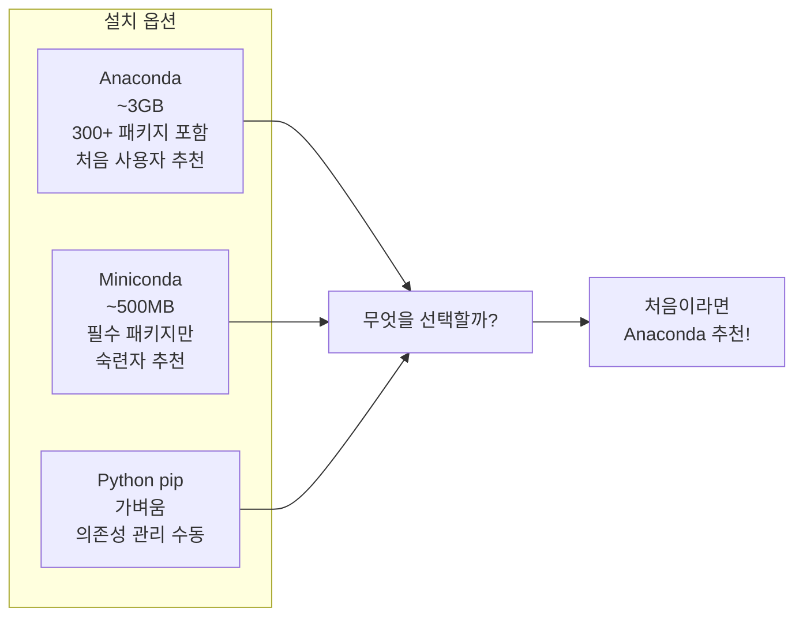
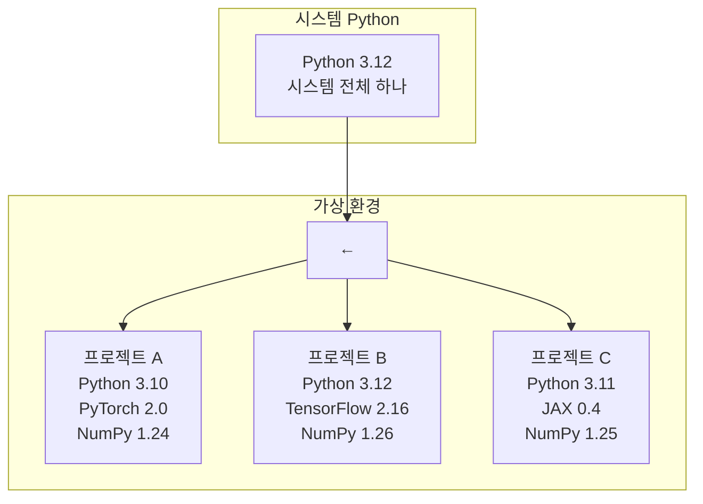
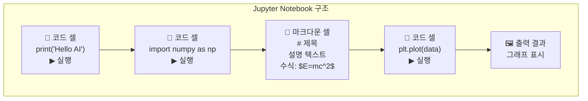
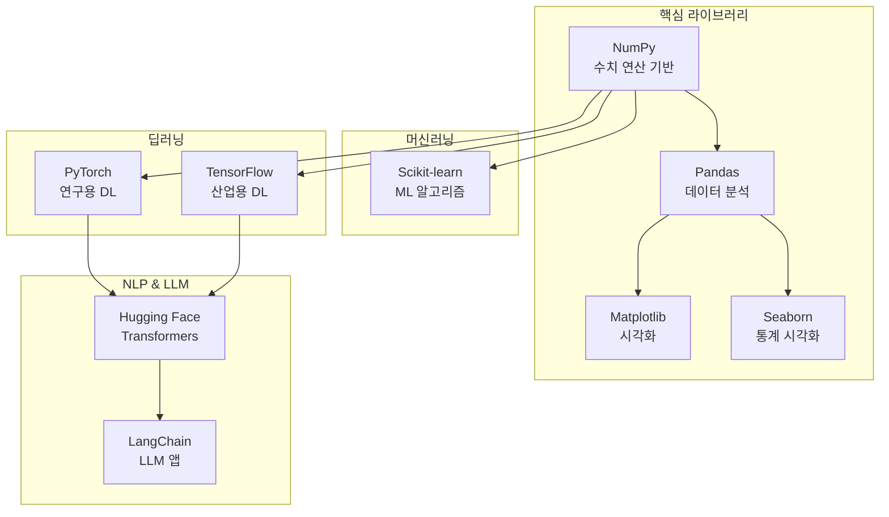
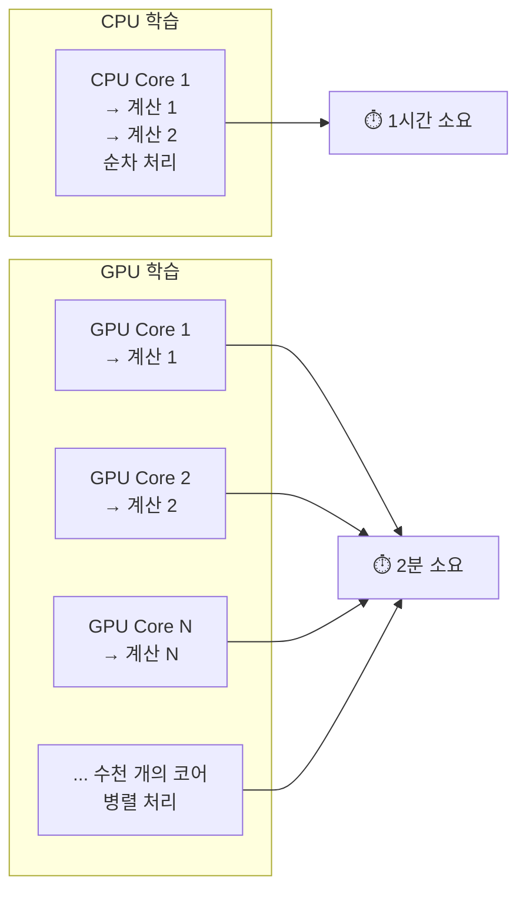
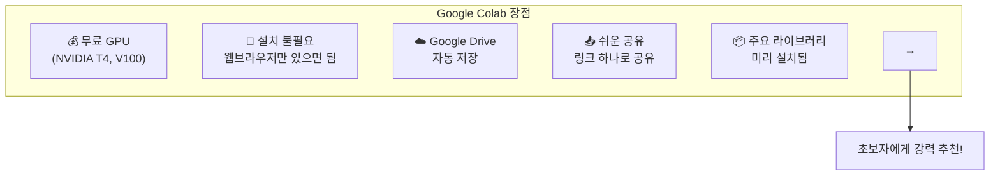

# 02장: 개발 환경 설정

> **🎯 학습 목표**
> - Python과 Anaconda를 설치하고 가상 환경을 구성할 수 있습니다.
> - Jupyter Notebook과 VS Code를 AI 개발에 활용할 수 있습니다.
> - 주요 AI 라이브러리(NumPy, Pandas, Scikit-learn, PyTorch)를 설치할 수 있습니다.
> - GPU 환경(CUDA)과 Google Colab을 사용할 수 있습니다.

---

## 2.1 개요

AI 개발을 시작하기 전에 먼저 개발 환경을 갖추어야 합니다. 이 장에서는 AI 개발에 필요한 모든 도구와 라이브러리를 설치하는 방법을 단계별로 설명합니다.

```mermaid
flowchart TB
  subgraph Setup[AI 개발 환경 구성]
    Step1["Python 3.10+ 설치"] --> Step2["가상 환경 생성"]
    Step2 --> Step3["핵심 라이브러리 설치"]
    Step3 --> Step4{GPU 사용?"}
    Step4 -->|"Yes"| Step5["CUDA + cuDNN 설치"]
    Step4 -->|"No"| Step6["Google Colab 사용"]
    Step5 --> Step7["PyTorch/TensorFlow<br/>(GPU 버전)"]
    Step6 --> Step8["웹브라우저에서<br/>즉시 코딩"]
    Step7 --> Done["✅ 개발 환경 완료"]
    Step8 --> Done
  end
```

### 왜 많은 도구가 필요할까?

| 도구 | 용도 | 이유 |
|------|------|------|
| **Python** | AI 프로그래밍 언어 | 가장 풍부한 AI/ML 라이브러리 생태계 |
| **Anaconda** | 패키지 & 환경 관리자 | 패키지 의존성 충돌 방지, GPU 지원 |
| **Jupyter** | 대화형 개발 환경 | 데이터 탐색, 시각화, 실험에 최적 |
| **VS Code** | 코드 편집기 | Jupyter 통합, 디버깅, Git |

---

## 2.2 Python과 Anaconda 설치

### 2.2.1 Anaconda vs Miniconda



### 2.2.2 설치 방법

**Windows:**
1. [Anaconda 공식 사이트](https://www.anaconda.com/download)에서 설치 프로그램 다운로드
2. "Add Anaconda3 to my PATH environment variable" 체크
3. 설치 완료 후 Anaconda Prompt 실행

**macOS/Linux:**
```bash
# Anaconda 설치 (Linux)
wget https://repo.anaconda.com/archive/Anaconda3-2024.10-Linux-x86_64.sh
bash Anaconda3-2024.10-Linux-x86_64.sh

# 또는 Miniconda 설치 (더 가벼움)
wget https://repo.anaconda.com/miniconda/Miniconda3-latest-Linux-x86_64.sh
bash Miniconda3-latest-Linux-x86_64.sh
```

### 2.2.3 설치 확인

```bash
python --version
# Python 3.12.0
conda --version
# conda 24.9.0
```

---

## 2.3 가상 환경

가상 환경은 프로젝트마다 독립된 Python 패키지 환경을 제공합니다. 서로 다른 프로젝트가 같은 라이브러리의 다른 버전을 사용해야 할 때 충돌을 방지합니다.



**가상 환경 생성 및 활성화:**

```bash
# 방법 1: conda 가상 환경 (추천)
conda create -n ai-book python=3.12
conda activate ai-book

# 방법 2: venv (가벼움)
python -m venv ai-book-env
source ai-book-env/bin/activate  # Linux/macOS
# ai-book-env\Scripts\activate   # Windows

# 가상 환경 비활성화
conda deactivate
```

### conda vs pip

| 특징 | conda | pip |
|------|-------|-----|
| **패키지** | Python + 비Python 패키지 | Python 패키지만 |
| **의존성 해결** | 우수 (SAT solver 사용) | 기본적 |
| **GPU 지원** | NVIDIA CUDA 패키지 제공 | 수동 설치 필요 |
| **속도** | 느림 | 빠름 |
| **사용처** | 데이터 사이언스, AI | 일반 Python 개발 |

> **실무 팁:** conda로 환경을 만들고, conda에 없는 패키지는 pip로 설치하는 **하이브리드 방식**이 가장 실용적입니다.

---

## 2.4 Jupyter Notebook

Jupyter Notebook은 웹 브라우저에서 코드를 작성하고 실행할 수 있는 대화형 개발 환경입니다. AI/ML 분야에서 가장 널리 사용되는 도구 중 하나입니다.

### 설치 및 실행

```bash
# conda 환경에서 설치
conda install jupyter notebook

# 또는 pip로 설치
pip install jupyter notebook

# 실행
jupyter notebook

# Jupyter Lab (최신 버전, 추천)
pip install jupyterlab
jupyter lab
```

### Jupyter Notebook 구조



### 코드 예제

```python
# Jupyter Notebook에서 실행하는 첫 AI 코드
import numpy as np
import matplotlib.pyplot as plt

# 데이터 생성
x = np.linspace(0, 10, 100)
y = np.sin(x)

# 그래프 출력 (Jupyter에서 바로 표시됨)
plt.plot(x, y)
plt.title("사인 곡선")
plt.grid(True)
plt.show()
```

### VS Code에서 Jupyter 사용

VS Code는 Jupyter Notebook을 완벽히 지원합니다. `.ipynb` 파일을 직접 열거나, `.py` 파일에서 `# %%` 마크로 셀을 구분할 수 있습니다.

```python
# %%
# VS Code의 Python Interactive 창
import pandas as pd
df = pd.DataFrame({"x": [1, 2, 3], "y": [4, 5, 6]})
df

# %%
# 별도 셀로 실행
df.mean()
```

---

## 2.5 핵심 라이브러리 설치

```bash
# 데이터 분석 라이브러리
conda install numpy pandas matplotlib seaborn scikit-learn

# 또는 pip (더 최신 버전)
pip install numpy pandas matplotlib seaborn scikit-learn

# 딥러닝 라이브러리
pip install torch torchvision torchaudio --index-url https://download.pytorch.org/whl/cpu
pip install tensorflow
pip install transformers datasets  # NLP
pip install accelerate  # GPU 가속

# AI 애플리케이션
pip install langchain chromadb  # RAG
pip install openai  # OpenAI API
pip install fastapi uvicorn  # API 서버
```

### 라이브러리 관계도



### 설치 확인

```python
# Python 코드로 설치 확인
import numpy as np
import pandas as pd
import matplotlib.pyplot as plt
import sklearn
import torch
import tensorflow as tf

print(f"NumPy 버전: {np.__version__}")
print(f"Pandas 버전: {pd.__version__}")
print(f"PyTorch 버전: {torch.__version__}")
print(f"TensorFlow 버전: {tf.__version__}")
print(f"Scikit-learn 버전: {sklearn.__version__}")

# PyTorch GPU 확인
print(f"CUDA 사용 가능: {torch.cuda.is_available()}")
if torch.cuda.is_available():
    print(f"GPU: {torch.cuda.get_device_name(0)}")
```

---

## 2.6 GPU 환경 설정

딥러닝 모델 학습은 GPU를 사용하면 CPU보다 **10~50배** 빠릅니다.



### CUDA 설치

NVIDIA GPU가 있어야 CUDA를 사용할 수 있습니다.

```bash
# NVIDIA 드라이버 확인
nvidia-smi

# 출력 예:
# +-----------------------------------------------------------------------------+
# | NVIDIA-SMI 545.23.08    Driver Version: 545.23.08    CUDA Version: 12.3     |
# +-----------------------------------------------------------------------------+
```

```bash
# PyTorch (CUDA 12.1)
pip install torch torchvision torchaudio --index-url https://download.pytorch.org/whl/cu121

# TensorFlow GPU
pip install tensorflow[and-cuda]
```

---

## 2.7 Google Colab

Google Colab은 클라우드 기반의 Jupyter Notebook 환경으로, **무료로 GPU를 사용**할 수 있습니다.



### Colab 시작하기

1. [Google Colab](https://colab.research.google.com/) 접속
2. Google 계정으로 로그인
3. "새 노트" 만들기
4. 다음 코드로 GPU 확인

```python
# GPU 사용 설정: 런타임 → 런타임 유형 변경 → GPU 선택
import torch
print(f"GPU 사용 가능: {torch.cuda.is_available()}")
print(f"GPU 이름: {torch.cuda.get_device_name(0)}")

# 간단한 텐서 연산으로 GPU 확인
x = torch.rand(1000, 1000).cuda()
y = torch.rand(1000, 1000).cuda()
z = torch.matmul(x, y)
print(f"GPU 연산 성공: {z.shape}")
```

### Colab 단축키

| 단축키 | 기능 |
|--------|------|
| `Shift + Enter` | 셀 실행 후 다음 셀로 이동 |
| `Ctrl + Enter` | 현재 셀만 실행 |
| `Ctrl + M + A` | 위에 코드 셀 추가 |
| `Ctrl + M + B` | 아래에 코드 셀 추가 |
| `Ctrl + M + D` | 셀 삭제 |
| `Ctrl + M + M` | 셀을 마크다운으로 변경 |

---

## 2.8 VS Code 확장 프로그램

AI 개발에 유용한 VS Code 확장 프로그램입니다.

| 확장 프로그램 | 용도 |
|---------------|------|
| **Python** | Python 개발 (Microsoft) |
| **Jupyter** | Jupyter Notebook 지원 |
| **Pylance** | Python 타입 체킹, 자동 완성 |
| **GitLens** | Git 히스토리 시각화 |
| **GitHub Copilot** | AI 코드 자동 완성 |
| **Material Icon Theme** | 파일 아이콘 테마 |
| **Rainbow CSV** | CSV 파일 색상 구분 |
| **Even Better TOML** | TOML 설정 파일 |

---

## 📋 한눈에 정리

| 단계 | 도구 | 명령어 |
|------|------|--------|
| Python 설치 | Anaconda/Miniconda | `conda create -n ai python=3.12` |
| 환경 활성화 | conda | `conda activate ai` |
| 데이터 분석 | NumPy, Pandas | `conda install numpy pandas` |
| 시각화 | Matplotlib, Seaborn | `conda install matplotlib seaborn` |
| 머신러닝 | Scikit-learn | `conda install scikit-learn` |
| 딥러닝 | PyTorch | `pip install torch torchvision` |
| Jupyter | Notebook/Lab | `conda install jupyterlab` |
| 클라우드 GPU | Google Colab | 웹브라우저만 있음 |

---

## ✏️ 연습 문제

1. **가상 환경**을 `ai-practice`라는 이름으로 생성하고 활성화한 후, `numpy`, `pandas`, `matplotlib`를 설치해보세요.

2. 다음 코드를 Jupyter Notebook에서 실행하고 결과를 확인하세요:
   ```python
   import numpy as np
   import matplotlib.pyplot as plt
   
   x = np.linspace(0, 2 * np.pi, 100)
   plt.plot(x, np.sin(x), label="sin")
   plt.plot(x, np.cos(x), label="cos")
   plt.legend()
   plt.show()
   ```

3. Google Colab에서 새 노트를 만들고, GPU가 활성화되어 있는지 확인하는 코드를 실행해보세요.

4. **VS Code**에서 Python 파일(`test.py`)을 만들고 `# %%` 마커를 사용하여 Jupyter 스타일 셀을 만들어보세요.

5. 자신의 컴퓨터에 GPU가 있는지 확인하고, 있다면 CUDA 버전을 확인하는 명령어를 실행해보세요. (없다면 Google Colab을 사용하면 됩니다.)

---

## 📝 연습 문제 정답

<details>
<summary>정답 보기</summary>

**1. 가상 환경 생성 및 패키지 설치**
```bash
conda create -n ai-practice python=3.12
conda activate ai-practice
conda install numpy pandas matplotlib
```

**2. Jupyter Notebook 실행 코드**
```python
import numpy as np
import matplotlib.pyplot as plt
x = np.linspace(0, 2 * np.pi, 100)
plt.plot(x, np.sin(x), label="sin")
plt.plot(x, np.cos(x), label="cos")
plt.legend()
plt.show()
```
→ 사인(빨간색)과 코사인(파란색) 곡선이 겹쳐진 그래프가 출력됩니다.

**3. Google Colab GPU 확인**
```python
import torch
print(torch.cuda.is_available())  # True면 GPU 사용 가능
```

**4. VS Code Jupyter 스타일 셀**
```python
# %%
print("이것은 첫 번째 셀입니다.")

# %%
print("이것은 두 번째 셀입니다.")
```
→ VS Code에서 `# %%` 마커로 구분하면 각각을 독립된 Jupyter 셀로 실행 가능합니다.

**5. GPU 확인 명령어**
```bash
nvidia-smi
```
→ GPU가 없으면 "command not found"가 출력됩니다. 없어도 Google Colab으로 실습 가능합니다.

</details>

---

> **🔄 다음 장에서는** AI의 수학적 기초를 배웁니다. 선형대수, 미적분, 확률과 통계를 AI와 연결지어 이해합니다. 수학을 오래 기억하지 못하셔도 괜찮습니다 — 필요한 만큼만, 직관적으로 설명합니다.
