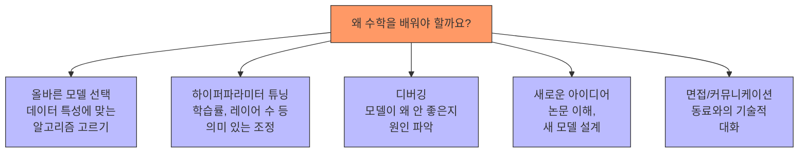
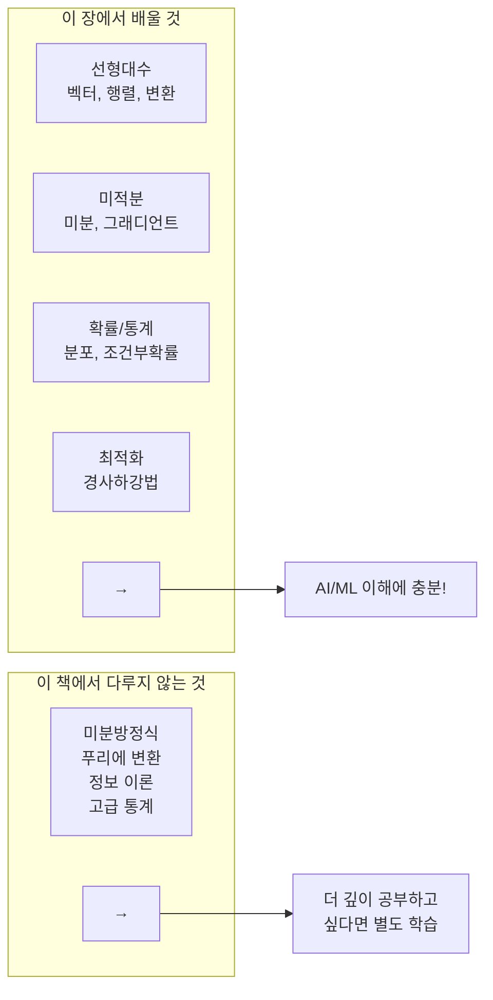
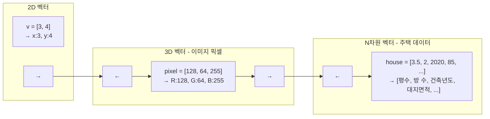
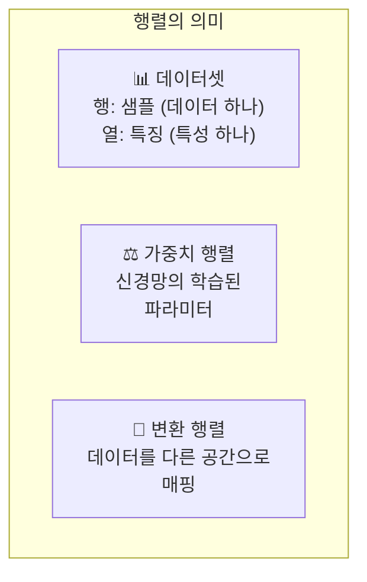
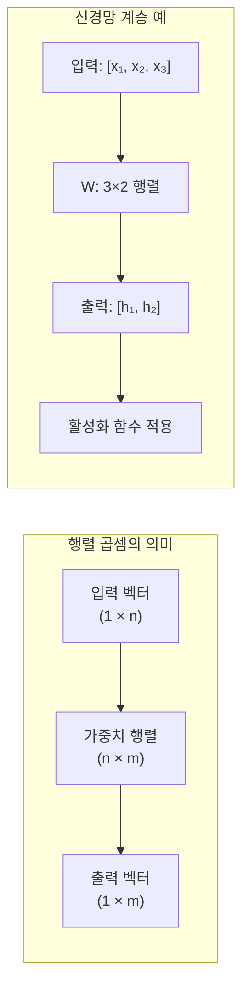
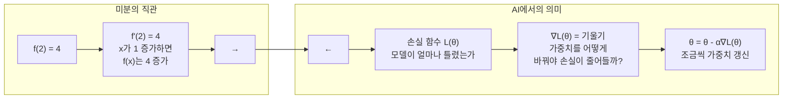
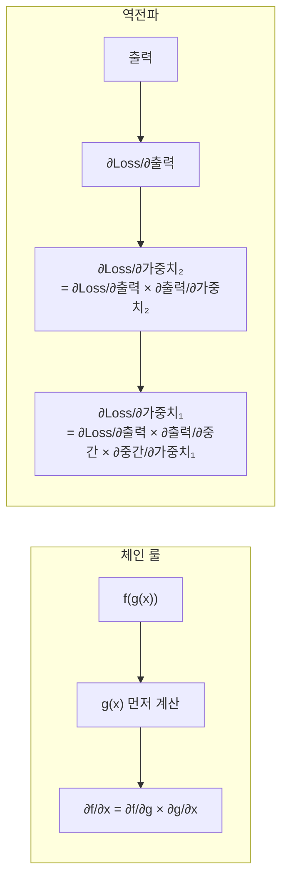
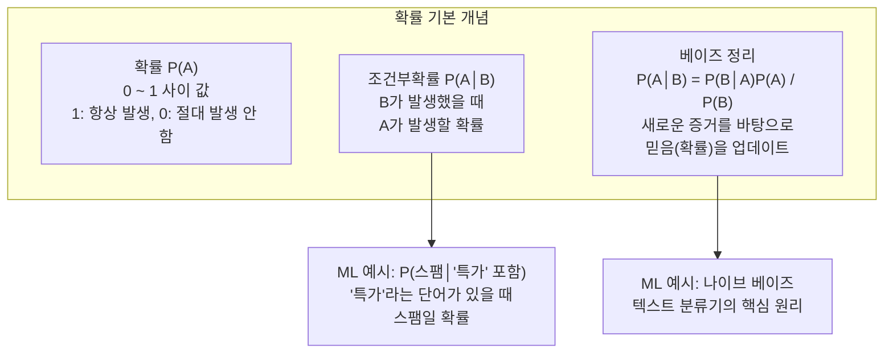
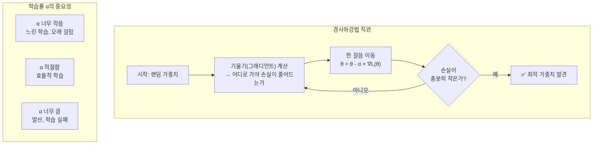
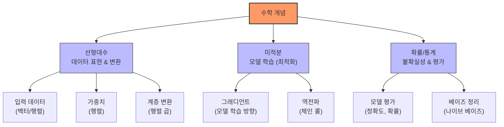

# 03장: AI 프로그래밍에 필요한 수학 기초

> **🎯 학습 목표**
> - 선형대수의 기본 개념(벡터, 행렬, 행렬 곱)을 이해하고 NumPy로 구현할 수 있습니다.
> - 미분과 그래디언트의 개념을 이해하고 경사하강법과 연결지을 수 있습니다.
> - 확률과 통계의 기본 개념과 머신러닝에서의 활용을 이해합니다.
> - "수포자"도 따라올 수 있도록 직관적으로 설명합니다.

---

## 👨‍💻 실전 프로젝트: NumPy로 직접 구현하는 선형회귀

수학 이론을 본격적으로 배우기에 앞서, 먼저 실제로 작동하는 코드를 통해 수학이 머신러닝에서 어떻게 활용되는지 경험해보는 것이 효과적입니다. 이 프로젝트에서는 NumPy만을 사용하여 선형회귀(Linear Regression) 모델을 처음부터 직접 구현해볼 것입니다. 선형회귀는 가장 기본적인 머신러닝 알고리즘으로, 입력과 출력 사이의 선형 관계를 학습하는 방법이며, 이후 배울 모든 고급 알고리즘의 토대가 됩니다.

아래 코드는 무작위로 생성한 데이터에 대해 선형 모델 `y = wx + b`를 학습하고, 학습된 직선이 데이터를 얼마나 잘 설명하는지 확인하는 전체 과정을 담고 있습니다. 여러분은 아직 수학적 세부 사항을 모두 이해하지 못해도 괜찮습니다. 이 코드를 실행해본 후 이번 장을 마치면, 코드 속 모든 수학적 원리가 명확하게 이해될 것입니다.

```python
import numpy as np
import matplotlib.pyplot as plt

# 1. 데이터 준비: y = 2x + 1 근처에 노이즈를 추가한 데이터
np.random.seed(42)
X = np.linspace(0, 10, 20)  # 0부터 10까지 20개의 점
true_w, true_b = 2.0, 1.0
y = true_w * X + true_b + np.random.randn(20) * 1.5  # 노이즈 추가

# 2. 모델 초기화
w = np.random.randn()  # 가중치 무작위 초기화
b = 0.0                # 바이어스 초기화
learning_rate = 0.01
epochs = 1000
n = len(X)

# 3. 경사하강법으로 학습
loss_history = []
for epoch in range(epochs):
    # 예측
    y_pred = w * X + b

    # 손실 계산 (MSE: 평균 제곱 오차)
    loss = np.mean((y_pred - y) ** 2)
    loss_history.append(loss)

    # 그래디언트 계산 (편미분)
    grad_w = (2 / n) * np.sum(X * (y_pred - y))
    grad_b = (2 / n) * np.sum(y_pred - y)

    # 가중치 갱신
    w -= learning_rate * grad_w
    b -= learning_rate * grad_b

    if epoch % 200 == 0:
        print(f"Epoch {epoch:3d} | Loss: {loss:.4f} | w: {w:.3f} | b: {b:.3f}")

print(f"\n최종 결과: w = {w:.3f}, b = {b:.3f}")
print(f"실제 값:   w = {true_w:.3f}, b = {true_b:.3f}")

# 4. 결과 시각화
plt.figure(figsize=(12, 4))

plt.subplot(1, 2, 1)
plt.scatter(X, y, alpha=0.7, label='데이터')
plt.plot(X, true_w * X + true_b, 'g--', label='실제 직선', linewidth=2)
plt.plot(X, w * X + b, 'r-', label='학습된 직선', linewidth=2)
plt.xlabel('X')
plt.ylabel('y')
plt.title('선형회귀 결과')
plt.legend()

plt.subplot(1, 2, 2)
plt.plot(loss_history, 'b-')
plt.xlabel('Epoch')
plt.ylabel('Loss (MSE)')
plt.title('손실 감소 과정')
plt.grid(True)

plt.tight_layout()
plt.show()
```

위 코드에서 사용된 수학적 개념들을 간략히 살펴보면 다음과 같습니다. 첫째, **벡터와 행렬**을 사용하여 데이터를 표현하고 연산을 수행하였습니다. `X`와 `y`는 각각 1차원 벡터이며, 이 벡터들 간의 연산이 전체 학습 과정의 기초를 이룹니다. 둘째, **미분과 그래디언트**를 사용하여 모델이 현재 얼마나 틀렸는지(손실)를 측정하고, 가중치를 어떤 방향으로 얼마나 조정해야 하는지를 계산하였습니다. 셋째, **경사하강법**이라는 최적화 알고리즘을 통해 손실을 반복적으로 줄여나가면서 최적의 가중치를 찾아냈습니다. 이 모든 개념은 지금부터 본격적으로 배울 수학적 기초지식에 해당하며, 각 개념을 하나씩 이해하다 보면 위 코드의 모든 과정이 자연스럽게 연결될 것입니다.

---

## 3.1 왜 수학이 필요할까?

AI 프로그래밍에서 수학은 **엔진의 작동 원리**와 같습니다. Python 라이브러리가 대부분의 계산을 자동으로 처리하지만, 다음과 같은 이유로 기본 개념은 알아야 합니다.



많은 초보자들이 수학이 없이도 AI 코드를 실행할 수 있다는 사실을 알고 있지만, 실제로는 수학적 이해가 있어야만 단순한 코드 실행을 넘어서는 진정한 역량을 갖출 수 있습니다. 예를 들어, `sklearn.linear_model.LinearRegression()`이라는 한 줄의 코드는 내부적으로 행렬 분해와 최적화 알고리즘을 수행하는데, 이 작동 원리를 이해하지 못하면 모델이 비정상적인 결과를 출력할 때 디버깅이 불가능해집니다. 또한 학습률(learning rate)이나 정규화(regularization)와 같은 하이퍼파라미터를 튜닝할 때도 수학적 직관이 있으면 맹목적인 시행착오 없이 효율적으로 최적값을 찾아나갈 수 있습니다.

> **격언:** "수학을 몰라도 AI 코드는 짤 수 있습니다. 하지만 수학을 알면 **더 좋은 AI 코드**를 짤 수 있습니다."

이 장에서는 AI/ML을 이해하는 데 반드시 필요한 수학적 개념들만을 선별하여 다룰 것입니다. 방대한 수학 전체를 다루는 대신, 실제 딥러닝 모델을 구현하고 학습시키는 과정에서 직접 마주치는 개념들에 초점을 맞추었으며, 모든 설명은 가능한 직관적이고 예제 중심으로 구성하였습니다. 독자분들이 "수포자"라고 느끼더라도 부담 없이 따라올 수 있도록 수식보다는 코드와 시각화를 통해 개념을 전달하는 방식을 채택하였습니다.

### 이 장에서 다룰 수학의 범위



위 다이어그램에서 볼 수 있듯이, 이번 장에서는 선형대수, 미적분, 확률과 통계, 최적화라는 네 가지 핵심 분야를 다룹니다. 이 네 가지 분야는 현대 머신러닝과 딥러닝의 모든 알고리즘을 구성하는 수학적 기둥이라고 할 수 있으며, 이들만 잘 이해해도 대부분의 AI 논문을 읽고 구현하는 데 필요한 수학적 배경을 갖추게 됩니다. 특히 선형대수는 데이터의 표현과 변환을 담당하고, 미적분은 모델의 학습 방향을 결정하며, 확률과 통계는 불확실성 속에서 최선의 결정을 내리는 도구를 제공하고, 최적화는 이 모든 것을 종합하여 실제로 모델을 학습시키는 엔진 역할을 수행합니다.

---

## 3.2 선형대수 (Linear Algebra)

선형대수는 AI에서 **데이터를 표현하고 변환**하는 기본 도구입니다. 모든 데이터는 결국 숫자의 집합으로 표현되며, 선형대수는 이러한 숫자 집합을 효율적으로 다루기 위한 체계적인 언어를 제공합니다. 예를 들어, ChatGPT가 문장을 처리할 때도 내부적으로는 단어들이 수천 차원의 벡터로 변환되어 선형대수 연산을 통해 처리됩니다. 이러한 이유로 선형대수는 AI 프로그래밍에서 가장 먼저 익혀야 할 수학 분야로 꼽힙니다.

### 3.2.1 벡터 (Vector)

벡터는 숫자의 나열로, AI에서는 하나의 **데이터 포인트**를 표현합니다. 예를 들어, 어떤 사람의 키, 몸무게, 나이를 묶어서 `[175, 70, 28]`과 같은 3차원 벡터로 표현할 수 있으며, 이는 하나의 샘플 데이터가 됩니다. 실제 머신러닝에서는 수백에서 수천 개의 숫자가 하나의 벡터를 이루는 경우가 일반적이며, 이렇게 고차원 벡터들을 모아서 하나의 데이터셋이 구성됩니다.



벡터의 가장 기본적인 연산은 덧셈, 뺄셈, 스칼라 곱, 그리고 내적(dot product)입니다. 벡터의 덧셈과 뺄셈은 같은 위치에 있는 요소끼리 더하거나 빼는 단순한 연산으로, 데이터에 노이즈를 추가하거나 두 데이터 포인트 간의 차이를 계산할 때 사용됩니다. 스칼라 곱은 벡터의 모든 요소에 동일한 숫자를 곱하는 연산으로, 데이터의 스케일을 조정하거나 신경망에서 가중치의 세기를 조절할 때 활용됩니다.

**NumPy로 벡터 다루기:**

```python
import numpy as np

# 벡터 생성
v = np.array([3, 4])
print(f"벡터 v: {v}")           # [3 4]
print(f"벡터 크기 (노름): {np.linalg.norm(v)}")  # 5.0

# 벡터 연산
a = np.array([1, 2, 3])
b = np.array([4, 5, 6])

print(f"덧셈: {a + b}")        # [5 7 9]
print(f"뺄셈: {a - b}")        # [-3 -3 -3]
print(f"스칼라 곱: {2 * a}")   # [2 4 6]
print(f"내적: {np.dot(a, b)}") # 32  (1*4 + 2*5 + 3*6)
```

> **내적(Dot Product):** 두 벡터의 유사도를 측정합니다. 값이 클수록 두 벡터가 비슷한 방향을 가리킵니다. AI에서는 **유사도 측정**에 광범위하게 사용됩니다.

내적은 AI에서 가장 중요한 벡터 연산 중 하나로, 그 활용 범위가 매우 넓습니다. 추천 시스템에서는 사용자의 취향 벡터와 영화의 특성 벡터 간의 내적을 계산하여 사용자가 좋아할 만한 영화를 찾아내고, 자연어 처리에서는 단어 임베딩 간의 내적으로 단어들 간의 의미적 유사도를 측정합니다. 또한 신경망의 모든 계층은 기본적으로 입력 벡터와 가중치 행렬의 내적 연산으로 구성되어 있어, 내적이 없다면 현대 AI는 존재할 수 없다고 해도 과언이 아닙니다.

```python
# 코사인 유사도: 두 벡터가 얼마나 비슷한지 (-1 ~ 1)
def cosine_similarity(a, b):
    return np.dot(a, b) / (np.linalg.norm(a) * np.linalg.norm(b))

v1 = np.array([1, 2, 3])
v2 = np.array([2, 4, 6])  # v1의 2배 = 같은 방향
v3 = np.array([-1, -2, -3])  # v1의 반대 방향

print(f"v1과 v2 유사도: {cosine_similarity(v1, v2):.2f}")  # 1.0 (완전 동일 방향)
print(f"v1과 v3 유사도: {cosine_similarity(v1, v3):.2f}")  # -1.0 (완전 반대)
print(f"v1과 [3,1,2] 유사도: {cosine_similarity(v1, [3,1,2]):.2f}")  # 중간값
```

이제 벡터에 대한 기본적인 이해를 바탕으로, 이를 2차원으로 확장한 행렬에 대해 알아보겠습니다. 벡터가 하나의 데이터 포인트였다면, 행렬은 여러 개의 데이터 포인트를 모은 데이터셋 전체나, 데이터를 변환하는 가중치의 집합으로 생각할 수 있습니다.

### 3.2.2 행렬 (Matrix)

행렬은 숫자를 2차원으로 배열한 것입니다. AI에서는 **데이터셋 전체**나 **변환(가중치)** 을 표현합니다. 예를 들어, 100명의 학생에 대해 각각 국어, 영어, 수학 점수를 기록한 데이터는 `100 × 3` 행렬로 표현할 수 있으며, 신경망의 한 계층에서 입력을 출력으로 변환하는 가중치도 행렬의 형태를 띱니다.



행렬은 단순히 숫자의 직사각형 배열 이상의 의미를 지닙니다. 머신러닝에서 행렬의 각 행(row)은 하나의 데이터 샘플을 나타내고, 각 열(column)은 하나의 특성(feature)을 나타냅니다. 예를 들어, 주택 가격 예측 모델에서 `1000 × 5` 크기의 행렬은 1000개의 주택 샘플 각각에 대해 평수, 방 개수, 건축 연도, 위치 점수, 대지 면적이라는 5가지 특성을 담고 있는 것입니다. 이러한 관점에서 행렬은 단순한 숫자 배열이 아니라, 현실 세계의 복잡한 데이터를 컴퓨터가 처리할 수 있는 형태로 구조화한 표현 방식이라고 할 수 있습니다.

**NumPy로 행렬 다루기:**

```python
import numpy as np

# 행렬 생성 (3행 4열)
X = np.array([
    [1, 2, 3, 4],
    [5, 6, 7, 8],
    [9, 10, 11, 12]
])
print(f"행렬 형태: {X.shape}")  # (3, 4)

# 데이터셋처럼 사용하기
# 3개의 샘플, 각각 4개의 특징을 가진 데이터
# 샘플 1의 특징들
print(f"첫 번째 샘플: {X[0]}")        # [1 2 3 4]
print(f"두 번째 특징: {X[:, 1]}")      # [2 6 10]  (모든 행의 2번째 열)

# 행렬 연산
A = np.array([[1, 2], [3, 4]])
B = np.array([[5, 6], [7, 8]])

print(f"행렬 덧셈:\n{A + B}")
print(f"행렬 곱셈:\n{np.dot(A, B)}")
# 또는 A @ B (Python 3.5+)
print(f"행렬 곱셈 (@):\n{A @ B}")
```

NumPy를 사용하면 행렬의 생성, 인덱싱, 슬라이싱, 그리고 다양한 연산을 매우 직관적으로 수행할 수 있습니다. 위 코드에서 `X[0]`은 첫 번째 샘플(행)의 모든 특성 값을 가져오고, `X[:, 1]`은 모든 샘플의 두 번째 특성 값을 가져옵니다. 이러한 인덱싱 방식은 데이터의 특정 부분을 추출하거나 분석할 때 매우 유용하며, 특히 대규모 데이터셋을 다룰 때 효과적입니다.

### 3.2.3 행렬 곱셈 (Matrix Multiplication)

행렬 곱셈은 AI에서 **가장 중요한 연산**입니다. 신경망의 모든 계층은 기본적으로 행렬 곱셈입니다. 입력 벡터에 가중치 행렬을 곱하면 출력 벡터가 생성되는데, 이는 마치 입력 데이터가 가중치라는 변환기를 통과하면서 새로운 표현으로 바뀌는 과정으로 이해할 수 있습니다.



행렬 곱셈이 가능하려면 첫 번째 행렬의 열(column) 개수와 두 번째 행렬의 행(row) 개수가 일치해야 합니다. 예를 들어, `(m × n)` 행렬과 `(n × p)` 행렬의 곱은 `(m × p)` 행렬을 결과로 내놓습니다. 이때 내부 차원 `n`이 일치해야 연산이 성립하며, 결과 행렬의 각 요소는 첫 번째 행렬의 행과 두 번째 행렬의 열의 내적으로 계산됩니다. 이 규칙은 신경망의 구조를 설계할 때 매우 중요하며, 각 계층의 입력 차원과 출력 차원을 결정하는 기준이 됩니다.

```python
# 신경망의 한 계층을 행렬 곱셈으로 표현
inputs = np.array([0.5, -0.2, 0.1])  # 3개의 입력 특성

weights = np.array([
    [0.4, 0.3],
    [-0.5, 0.2],
    [0.1, -0.4]
])  # 3×2 행렬: 3개 입력 → 2개 출력

biases = np.array([0.1, -0.1])  # 각 출력 뉴런의 바이어스

# 순전파 (forward pass): 행렬 곱 + 바이어스
output = np.dot(inputs, weights) + biases
print(f"신경망 계층 출력: {output}")
# 예: [0.31, 0.07]
```

위 코드는 3개의 입력을 받아 2개의 출력을 내보내는 신경망 계층을 행렬 곱셈으로 구현한 것입니다. 입력 벡터 `inputs`는 `(3,)` 크기이고, 가중치 행렬 `weights`는 `(3, 2)` 크기이므로, `np.dot(inputs, weights)`의 결과는 `(2,)` 크기의 출력 벡터가 됩니다. 여기에 바이어스 벡터를 더하면 각 출력 뉴런의 최종 활성화 직전 값이 계산되며, 이후 활성화 함수(ReLU, Sigmoid 등)를 적용함으로써 한 계층의 순전파가 완료됩니다.

### 3.2.4 전치행렬과 형태 변환

데이터를 다루다 보면 행렬의 차원을 변환하거나 전치(transpose)해야 하는 상황이 자주 발생합니다. 전치행렬은 행과 열을 서로 바꾼 행렬로, 원래 `(m × n)` 행렬의 전치는 `(n × m)`이 됩니다. 이러한 연산은 행렬 곱셈을 수행할 때 차원을 맞추기 위해 필요하거나, 데이터의 구조를 재배열할 때 사용됩니다.

```python
import numpy as np

X = np.array([[1, 2, 3], [4, 5, 6]])
print(f"원본:\n{X}")          # shape: (2, 3)
print(f"전치:\n{X.T}")         # shape: (3, 2)

# 형태 변경 (reshape)
x = np.array([1, 2, 3, 4, 5, 6])
print(f"2×3으로 변경:\n{x.reshape(2, 3)}")
```

형태 변환(reshape)은 데이터의 차원 구조를 변경하는 중요한 연산입니다. 예를 들어, 1차원으로 펼쳐진 이미지 데이터를 다시 원래의 2차원 형태로 복원하거나, 배치 처리를 위해 여러 데이터를 하나의 행렬로 쌓을 때 reshape이 활용됩니다. 단, reshape을 사용할 때는 원본 데이터의 전체 요소 개수가 변경 후의 형태와 일치해야 한다는 점에 주의해야 합니다. 지금까지 배운 선형대수 개념들은 AI에서 데이터를 어떻게 표현하고 변환하는지에 대한 기초를 제공하였으며, 다음으로는 모델이 어떻게 학습되는지를 이해하기 위해 미적분으로 넘어가겠습니다.

---

## 3.3 미적분 (Calculus)

미적분은 AI에서 **모델을 학습시키는 방법**을 제공합니다. 선형대수가 데이터의 정적인 표현과 변환을 다룬다면, 미적분은 모델이 시간에 따라 어떻게 변화하고 개선되어야 하는지를 동적으로 설명해줍니다. 특히 딥러닝에서 모델의 가중치를 조정하는 과정은 전적으로 미적분, 그중에서도 미분과 그래디언트에 의존하고 있습니다.

### 3.3.1 미분 (Derivative)

미분은 "변화율"입니다. 즉, 입력이 조금 변할 때 출력이 얼마나 변하는지 측정합니다. 예를 들어, 자동차의 속도계는 시간에 따른 위치의 변화율을 보여주는 것이며, 이것이 바로 미분의 실생활 예시입니다. AI에서는 손실 함수(loss function)라는 것을 정의하고, 이 손실 함수의 미분값을 계산하여 모델의 가중치를 어떤 방향으로 얼마나 조정해야 손실이 줄어들지를 결정합니다.



미분을 계산하는 방법에는 크게 두 가지가 있습니다. 첫 번째는 **해석적 미분**으로, 수학적 공식을 사용하여 정확한 도함수를 구하는 방법입니다. 예를 들어, `f(x) = x²`의 도함수는 `f'(x) = 2x`로 정확히 계산할 수 있습니다. 두 번째는 **수치 미분**으로, 컴퓨터가 실제로 사용하는 방법이며, 아주 작은 변화량 `h`를 이용하여 미분값을 근사합니다. 실제 딥러닝 프레임워크(PyTorch, TensorFlow)는 해석적 미분의 규칙을 자동으로 적용하는 **자동 미분(Automatic Differentiation)** 방식을 사용하여 정확하고 효율적으로 그래디언트를 계산합니다.

**코드로 이해하는 미분:**

```python
import numpy as np

# 함수 f(x) = x² 의 미분: f'(x) = 2x
def f(x):
    return x ** 2

# 수치 미분 (numerical derivative)
def numerical_derivative(f, x, h=1e-5):
    return (f(x + h) - f(x - h)) / (2 * h)

x = 3.0
print(f"f(x) = x², x={x}에서 미분값: {numerical_derivative(f, x)}")  # ≈ 6.0 (2*3)

# 실제 미분: f'(3) = 2*3 = 6
print(f"실제 미분값: {2 * x}")  # 6.0
```

### 3.3.2 편미분 (Partial Derivative)

여러 변수가 있는 함수에서 **하나의 변수에 대한 미분**입니다. 실제 머신러닝 모델은 수백만 개의 가중치(변수)를 가지고 있기 때문에, 모든 가중치에 대해 동시에 미분을 수행해야 합니다. 편미분은 이렇게 여러 변수가 있을 때 특정 변수 하나에 대해서만 미분하고, 나머지 변수는 상수로 취급하는 방법입니다.

```python
# f(x, y) = x² + y² + xy
# ∂f/∂x = 2x + y
# ∂f/∂y = 2y + x

def partial_derivative_x(x, y, h=1e-5):
    return ((x + h)**2 + y**2 + (x + h)*y - (x**2 + y**2 + x*y)) / h

def partial_derivative_y(x, y, h=1e-5):
    return (x**2 + (y + h)**2 + x*(y + h) - (x**2 + y**2 + x*y)) / h

x, y = 1.0, 2.0
print(f"∂f/∂x at (1,2): {partial_derivative_x(x, y):.2f}")  # 2*1 + 2 = 4.0
print(f"∂f/∂y at (1,2): {partial_derivative_y(x, y):.2f}")  # 2*2 + 1 = 5.0
```

위 예제에서 `f(x, y) = x² + y² + xy`라는 두 변수의 함수가 있습니다. `∂f/∂x`를 계산할 때는 `y`를 상수로 취급하고 `x`에 대해서만 미분하므로 결과는 `2x + y`가 됩니다. 마찬가지로 `∂f/∂y`는 `x`를 상수로 취급하고 `y`에 대해 미분하므로 `2y + x`가 됩니다. 머신러닝에서는 모든 가중치에 대한 손실 함수의 편미분을 벡터로 모은 것을 **그래디언트(Gradient)** 라고 부르며, 이 그래디언트가 가중치 갱신의 방향과 크기를 결정합니다.

### 3.3.3 체인 룰 (Chain Rule)

합성함수의 미분법칙으로, **역전파(Backpropagation)** 의 핵심 수학적 원리입니다. 체인 룰은 "합성 함수의 미분은 바깥 함수의 미분과 안쪽 함수의 미분의 곱"이라는 간단한 원리로, 딥러닝에서 여러 계층을 거쳐 전달되는 그래디언트를 계산하는 데 사용됩니다.



체인 룰이 왜 그렇게 중요할까요? 딥러닝 모델은 수십에서 수백 개의 계층으로 구성되어 있으며, 각 계층은 이전 계층의 출력을 입력으로 받아 다시 처리하는 합성 함수의 연속입니다. 출력 계층에서 계산된 손실을 입력 계층까지 전파하려면 각 계층의 미분값을 연쇄적으로 곱해야 하는데, 이때 바로 체인 룰이 사용됩니다. 이것이 바로 **역전파(Backpropagation)** 알고리즘의 수학적 본질이며, 체인 룰이 없었다면 딥러닝의 학습 자체가 불가능했을 것입니다.

```python
# 체인 룰 예제: f(x) = (3x + 2)²
# g(x) = 3x + 2,  f(g) = g²
# df/dx = df/dg * dg/dx = 2g * 3 = 2(3x+2) * 3 = 6(3x+2)

def f(x):
    g = 3 * x + 2
    return g ** 2

# df/dx at x = 1: 6 * (3*1 + 2) = 30
x_val = 1.0
g_val = 3 * x_val + 2
manual_grad = 2 * g_val * 3
print(f"체인 룰 계산: {manual_grad}")  # 30
```

이제 미분과 체인 룰을 이해하였으니, 모델이 학습되는 전체적인 그림을 확률과 통계의 관점에서도 살펴볼 필요가 있습니다. 미분이 모델을 정확하게 학습시키는 엔진이라면, 확률과 통계는 모델이 얼마나 잘 학습되었는지를 평가하고, 불확실성을 정량화하는 도구를 제공합니다.

---

## 3.4 확률과 통계 (Probability & Statistics)

확률과 통계는 AI에서 **불확실성을 다루고 데이터를 이해**하는 도구입니다. 현실 세계의 데이터는 항상 노이즈와 불확실성을 포함하고 있으며, 완벽하게 예측하는 것은 불가능에 가깝습니다. 확률과 통계는 이러한 불확실성을 정량화하고, 제한된 정보로부터 최선의 결정을 내릴 수 있는 수학적 프레임워크를 제공합니다.

### 3.4.1 확률의 기초

확률은 어떤 사건이 발생할 가능성을 0에서 1 사이의 숫자로 표현한 것입니다. 예를 들어, 동전을 던졌을 때 앞면이 나올 확률은 0.5이며, 주사위를 던졌을 때 6이 나올 확률은 1/6 ≈ 0.167입니다. 머신러닝에서 확률은 단순한 가능성의 표현을 넘어서, 모델의 예측 자체를 확률 분포로 출력하는 데 사용됩니다.



확률에서 가장 중요한 개념 중 하나는 **조건부확률(Conditional Probability)** 입니다. 조건부확률 `P(A|B)`는 "B가 발생했다는 사실을 알고 있을 때 A가 발생할 확률"을 의미합니다. 예를 들어, 스팸 메일 필터에서 `P(스팸 | "특가" 포함)`은 이메일에 "특가"라는 단어가 포함되어 있다는 정보를 알 때 해당 메일이 스팸일 확률을 나타냅니다. 이 조건부확률을 계산할 수 있게 해주는 강력한 도구가 바로 **베이즈 정리(Bayes' Theorem)** 이며, 이는 새로운 증거(데이터)가 주어졌을 때 사전 확률을 사후 확률로 업데이트하는 방법을 제공합니다. 나이브 베이즈(Naive Bayes) 분류기는 이러한 베이즈 정리를 기반으로 한 대표적인 머신러닝 알고리즘으로, 스팸 필터링, 감정 분석, 문서 분류 등에 널리 사용됩니다.

### 3.4.2 통계와 데이터 분포

통계는 데이터를 수집, 정리, 분석하고 해석하는 방법을 다루는 학문입니다. 머신러닝에서는 데이터의 분포를 이해하는 것이 매우 중요한데, 이는 모델이 학습하는 데이터의 통계적 특성이 모델의 성능과 일반화 능력에 직접적인 영향을 미치기 때문입니다. 가장 기본적이면서도 중요한 통계량으로는 평균(mean), 분산(variance), 표준편차(standard deviation)가 있습니다.

```python
import numpy as np
import matplotlib.pyplot as plt

# 정규 분포 (Normal Distribution) - 가장 중요한 분포
mean = 0
std = 1
data = np.random.normal(mean, std, 10000)

print(f"평균: {np.mean(data):.3f}")  # ≈ 0
print(f"표준편차: {np.std(data):.3f}")  # ≈ 1
print(f"분산: {np.var(data):.3f}")  # ≈ 1

# 평균이 다른 두 데이터셋
class_1_heights = np.random.normal(170, 5, 100)  # 평균 170cm
class_2_heights = np.random.normal(165, 5, 100)  # 평균 165cm

print(f"반 1 평균 키: {np.mean(class_1_heights):.1f}cm")
print(f"반 2 평균 키: {np.mean(class_2_heights):.1f}cm")
```

**정규 분포(Normal Distribution)**는 자연과 사회 현상에서 가장 흔하게 나타나는 확률 분포로, 종 모양의 곡선을 가지고 있습니다. 사람의 키, 시험 점수, 측정 오차 등 수많은 현상이 정규 분포를 따르며, 머신러닝에서도 데이터의 분포를 가정할 때 가장 먼저 고려되는 분포입니다. 평균(mean)은 분포의 중심 위치를 결정하고, 표준편차(standard deviation)는 데이터가 평균으로부터 얼마나 퍼져 있는지를 나타냅니다. 표준편차가 클수록 데이터가 넓게 퍼져 있고, 작을수록 평균 주변에 밀집되어 있습니다.

### 3.4.3 머신러닝에서의 통계 개념

머신러닝 모델의 성능을 평가할 때도 통계적 개념이 필수적으로 사용됩니다. 모델이 얼마나 정확한 예측을 하는지, 예측과 실제 값 사이의 오차는 어느 정도인지 등을 정량화하는 데 통계적 지표들이 활용됩니다. 가장 대표적인 평가 지표로는 평균 제곱 오차(MSE), 평균 절대 오차(MAE), 결정 계수(R²) 등이 있습니다.

```python
import numpy as np

# 실제 주택 가격 데이터 (가상)
true_prices = np.array([3.0, 5.0, 4.0, 7.0, 6.0])  # 실제 가격 (억)
pred_prices = np.array([2.8, 5.2, 4.1, 6.5, 6.3])  # 모델 예측

# 평균 제곱 오차 (MSE) - 회귀 모델 평가
errors = true_prices - pred_prices
mse = np.mean(errors ** 2)
rmse = np.sqrt(mse)

print(f"평균 오차: {np.mean(errors):.2f}억")       # -0.02
print(f"MSE: {mse:.4f}")                          # 0.052
print(f"RMSE: {rmse:.2f}억")                      # 0.23

# 상관 계수 (Correlation) - 두 변수의 관계
# 1에 가까울수록 양의 상관관계
correlation = np.corrcoef(true_prices, pred_prices)[0, 1]
print(f"상관 계수: {correlation:.3f}")  # ≈ 0.97 (매우 강한 상관관계)
```

**평균 제곱 오차(MSE, Mean Squared Error)**는 예측값과 실제값의 차이를 제곱하여 평균을 낸 것입니다. 제곱을 하는 이유는 오차의 방향(양수/음수)이 서로 상쇄되는 것을 방지하고, 큰 오차에 더 큰 패널티를 부여하기 위해서입니다. **RMSE(Root Mean Squared Error)**는 MSE에 제곱근을 취한 값으로, 원래 데이터의 단위와 동일한 단위를 가지므로 해석이 더 직관적입니다. **상관 계수(Correlation Coefficient)**는 두 변수 간의 선형 관계의 강도와 방향을 -1에서 1 사이의 값으로 나타냅니다. 1에 가까울수록 강한 양의 상관관계, -1에 가까울수록 강한 음의 상관관계, 0에 가까울수록 상관관계가 없음을 의미합니다.

---

## 3.5 최적화 (Optimization) — 경사하강법

경사하강법(Gradient Descent)은 AI에서 **가장 핵심적인 최적화 알고리즘**입니다. 지금까지 배운 선형대수와 미적분, 확률 통계의 모든 개념이 실제로 모델을 학습시키는 과정에서 종합되어 적용되는 것이 바로 경사하강법입니다. 경사하강법은 손실 함수의 값을 최소화하는 가중치를 찾기 위해, 현재 위치에서 가장 가파르게 하강하는 방향으로 조금씩 이동하는 반복적인 과정입니다.

### 3.5.1 기본 개념

경사하강법의 직관적인 비유는 안개 속에서 산을 내려가는 것입니다. 당신은 산의 정상(초기 랜덤 가중치)에 서 있고, 안개 때문에 전체 지형은 보이지 않지만 발밑의 기울기(그래디언트)는 느낄 수 있습니다. 기울기가 가장 가파르게 하강하는 방향으로 한 걸음씩 이동하다 보면 결국 계곡의 바닥(최적 가중치)에 도달할 수 있습니다. 이것이 경사하강법의 핵심 아이디어입니다.



경사하강법에서 가장 중요한 하이퍼파라미터는 **학습률(learning rate, α)** 입니다. 학습률은 각 단계에서 얼마나 크게 이동할지를 결정합니다. 학습률이 너무 작으면 수렴하는 데 매우 오랜 시간이 걸리고, 너무 크면 최소점을 지나쳐 오히려 발산(divergence)할 수 있습니다. 적절한 학습률을 찾는 것은 경사하강법을 성공적으로 사용하기 위한 핵심 기술이며, 일반적으로 0.001에서 0.1 사이의 값을 사용하면서 로그 스케일로 탐색하는 것이 일반적입니다.

### 3.5.2 코드로 구현하는 경사하강법

```python
import numpy as np

# 간단한 예: y = 2x + 1 을 학습하는 선형 회귀
# (실제 정답은 w=2, b=1)

# 데이터 준비
X = np.array([1, 2, 3, 4, 5])
y = 2 * X + 1 + np.random.randn(5) * 0.1  # 실제 값에 노이즈 추가

# 모델: y_pred = w * x + b
w = 0.0  # 가중치 초기화
b = 0.0  # 바이어스 초기화
learning_rate = 0.01
epochs = 1000
n = len(X)

# 학습 루프
for epoch in range(epochs):
    # 예측
    y_pred = w * X + b

    # 손실 (MSE)
    loss = np.mean((y_pred - y) ** 2)

    # 그래디언트 계산 (편미분)
    grad_w = (2 / n) * np.sum(X * (y_pred - y))
    grad_b = (2 / n) * np.sum(y_pred - y)

    # 가중치 갱신 (경사하강법)
    w -= learning_rate * grad_w
    b -= learning_rate * grad_b

    if epoch % 100 == 0:
        print(f"Epoch {epoch}: loss={loss:.4f}, w={w:.2f}, b={b:.2f}")

print(f"\n최종 결과: w={w:.2f}, b={b:.2f}")
print(f"실제 정답: w=2.00, b=1.00")
```

위 코드는 경사하강법을 사용하여 선형 회귀 모델을 학습시키는 전체 과정을 보여줍니다. 각 epoch마다 모델이 예측을 수행하고(y_pred), 예측과 실제 값의 차이로 손실을 계산하며, 손실에 대한 가중치의 편미분(grad_w, grad_b)을 구하여 가중치를 업데이트합니다. 여기서 `grad_w`와 `grad_b`가 바로 앞서 배운 **편미분**의 개념이며, `loss`가 줄어드는 방향으로 가중치를 갱신하는 것이 **경사하강법**의 핵심입니다. 1000번의 반복 후에는 최적의 가중치 `w = 2.0`와 `b = 1.0`에 근접한 값을 얻을 수 있습니다.

### 3.5.3 다양한 옵티마이저

경사하강법의 여러 변형이 있습니다.

| 옵티마이저 | 특징 | 사용 시기 |
|-----------|------|----------|
| **SGD** | 기본 경사하강법 | 간단한 문제 |
| **Momentum** | 관성 추가, 진동 감소 | 복잡한 손실 함수 |
| **Adam** | 적응형 학습률 + Momentum | **가장 많이 사용** |
| **RMSprop** | 학습률을 특징별로 조정 | RNN/시계열 |

```python
import torch
import torch.nn as nn
import torch.optim as optim

# PyTorch의 옵티마이저 사용법
model = nn.Linear(10, 1)

# 다양한 옵티마이저
optimizers = {
    "SGD": optim.SGD(model.parameters(), lr=0.01),
    "Adam": optim.Adam(model.parameters(), lr=0.001),
    "RMSprop": optim.RMSprop(model.parameters(), lr=0.001),
}

# Adam이 일반적으로 가장 좋은 기본 선택입니다.
```

기본 경사하강법(SGD)은 모든 데이터에 대해 그래디언트를 계산한 후 한 번에 가중치를 업데이트하는 가장 단순한 방식입니다. 하지만 실제로는 **확률적 경사하강법(Stochastic Gradient Descent)** 이나 **미니배치 경사하강법(Mini-batch Gradient Descent)** 이 더 자주 사용되는데, 이는 전체 데이터 대신 일부 샘플만으로 그래디언트를 근사하여 계산 속도를 크게 향상시키기 때문입니다. Adam(Adaptive Moment Estimation)은 가장 널리 사용되는 옵티마이저로, 학습률을 각 파라미터에 맞게 적응적으로 조정하면서 관성(Momentum) 효과도 함께 활용하여 빠르고 안정적인 수렴을 제공합니다.

---

## 3.6 AI와 수학의 연결

지금까지 배운 모든 수학 개념이 실제 AI 시스템에서 어떻게 연결되고 활용되는지를 종합적으로 살펴보겠습니다. 각 개념은 독립적으로 존재하는 것이 아니라, 서로 긴밀하게 연결되어 하나의 학습 시스템을 구성합니다.



위 다이어그램은 AI 시스템에서 수학 개념들이 어떻게 상호 연결되어 있는지를 한눈에 보여줍니다. 데이터는 선형대수의 벡터와 행렬로 표현되어 신경망에 입력되고, 신경망의 각 계층에서는 행렬 곱셈을 통해 데이터가 변환됩니다. 이 변환 과정에서 발생하는 오차는 미적분의 그래디언트와 체인 룰을 사용하여 역전파되고, 경사하강법으로 가중치가 갱신됩니다. 마지막으로 학습된 모델의 성능은 확률과 통계적 지표를 통해 평가되며, 불확실성이 정량화됩니다.

---

## 📋 한눈에 정리

| 개념 | 설명 | NumPy 코드 | AI에서의 역할 |
|------|------|-----------|-------------|
| **벡터** | 숫자의 1차원 배열 | `np.array([1,2,3])` | 데이터 포인트 |
| **행렬** | 숫자의 2차원 배열 | `np.array([[1,2],[3,4]])` | 가중치, 데이터셋 |
| **행렬 곱** | 입력 × 가중치 = 출력 | `np.dot(A, B)` 또는 `A @ B` | 신경망 계층 연산 |
| **미분** | 변화율 | `수치 미분` | 학습 방향 결정 |
| **그래디언트** | 모든 변수에 대한 편미분 | `자동 계산 (PyTorch)` | 가중치 갱신 |
| **확률** | 사건의 발생 가능성 | `np.random` | 불확실성 표현 |
| **경사하강법** | 손실 최소화 반복 알고리즘 | `직접 구현 or optimizer` | 모델 학습 |

---

## ✏️ 연습 문제

1. 다음 두 벡터의 내적과 코사인 유사도를 계산해보세요.
   ```python
   a = np.array([1, 0, 1])
   b = np.array([0, 1, 0])
   c = np.array([2, 0, 2])
   ```
   - a와 b의 유사도는?
   - a와 c의 유사도는?
   - 왜 이런 결과가 나왔을까요?

2. 3×2 행렬 A와 2×4 행렬 B의 곱을 NumPy로 계산해보세요. 결과 행렬의 shape은 무엇인가요?

3. 다음 함수의 x=2에서의 미분값을 수치 미분으로 계산해보세요.
   ```python
   def f(x):
       return 3 * x ** 3 + 2 * x ** 2 + x + 1
   ```

4. 경사하강법 코드에서 `learning_rate`를 0.1, 1.0, 10.0으로 각각 바꿔보고 결과를 관찰하세요. 어떤 변화가 일어나나요?

5. 다음 중 행렬 곱셈이 불가능한 것은?
   - a) (3,4) × (4,2)
   - b) (2,3) × (2,3)
   - c) (5,1) × (1,5)

---

## 📝 연습 문제 정답

<details>
<summary>정답 보기</summary>

**1. 벡터 내적과 코사인 유사도**
```python
import numpy as np
a, b, c = np.array([1,0,1]), np.array([0,1,0]), np.array([2,0,2])

# a·b = 1*0 + 0*1 + 1*0 = 0
print(f"a·b = {np.dot(a, b)}")  # 0
# cos(a,b) = 0 / (√2 * 1) = 0 (완전 직교)
print(f"cos(a,b) = {np.dot(a,b)/(np.linalg.norm(a)*np.linalg.norm(b)):.2f}")

# a·c = 1*2 + 0*0 + 1*2 = 4
print(f"a·c = {np.dot(a, c)}")  # 4
# cos(a,c) = 4 / (√2 * 2√2) = 4/4 = 1 (완전 동일 방향)
print(f"cos(a,c) = {np.dot(a,c)/(np.linalg.norm(a)*np.linalg.norm(c)):.2f}")
```
- a와 b는 직교(유사도 0), a와 c는 같은 방향(유사도 1)
- c = 2a 이므로 a와 c는 같은 방향을 가리킵니다.

**2. 행렬 곱셈**
```python
A = np.array([[1,2],[3,4],[5,6]])  # 3×2
B = np.array([[1,2,3,4],[5,6,7,8]])  # 2×4
C = A @ B  # 결과 shape: (3, 4)
print(f"결과 shape: {C.shape}")  # (3, 4)
```
→ (3×2) × (2×4) = (3×4), 행렬 곱셈이 가능하려면 A의 열 수와 B의 행 수가 같아야 합니다.

**3. 수치 미분**
```python
def f(x): return 3*x**3 + 2*x**2 + x + 1
def num_diff(f, x, h=1e-5):
    return (f(x+h) - f(x-h)) / (2*h)
# f'(x) = 9x² + 4x + 1, f'(2) = 36 + 8 + 1 = 45
print(f"f'(2) = {num_diff(f, 2):.2f}")  # ≈ 45.00
```

**4. 학습률 변화 실험**
- **lr=0.1:** 빠르게 수렴하지만 진동 가능
- **lr=1.0:** 발산(diverge)하여 loss가 NaN이 됨
- **lr=10.0:** 즉시 발산, 학습 실패
→ 적절한 학습률(0.01~0.001)이 중요합니다.

**5. 행렬 곱셈 가능 여부**
- a) (3,4) × (4,2) → **가능** (내부 차원 4가 일치) → 결과 (3,2)
- b) (2,3) × (2,3) → **불가능** (A의 열 3 ≠ B의 행 2)
- c) (5,1) × (1,5) → **가능** → 결과 (5,5)
→ 정답: **b**

</details>

---

> **🔄 다음 장에서는** Python 데이터 과학 라이브러리(NumPy, Pandas, Matplotlib)를 본격적으로 학습합니다. 실제 데이터를 불러오고, 분석하고, 시각화하는 방법을 배웁니다.
