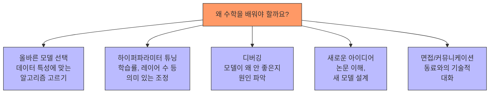
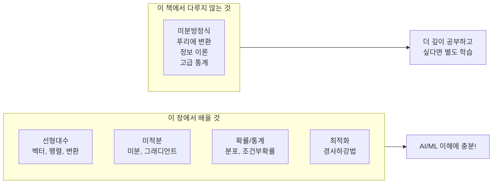
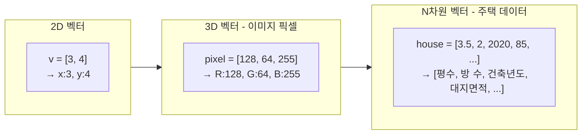
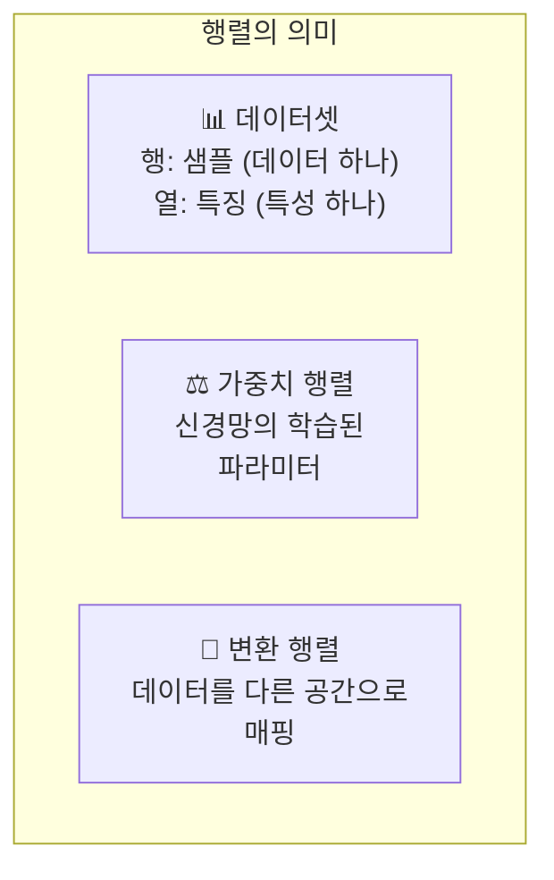
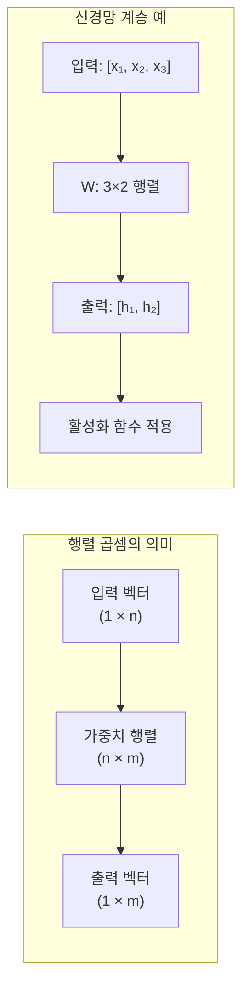
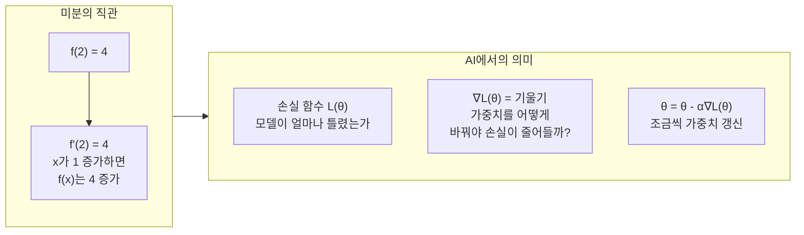
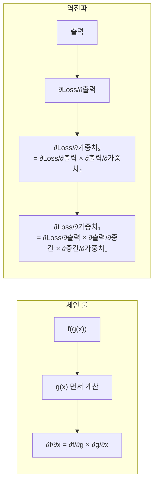
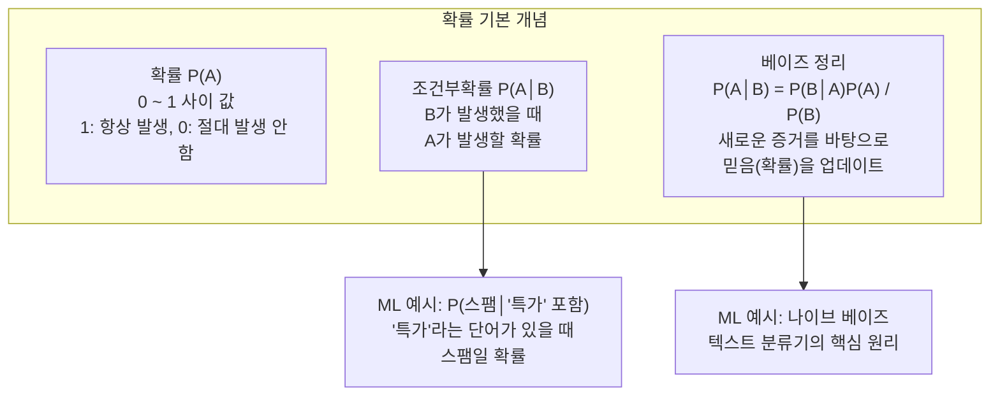
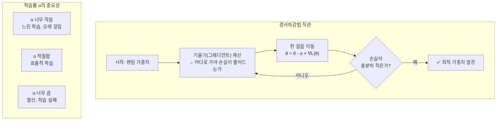
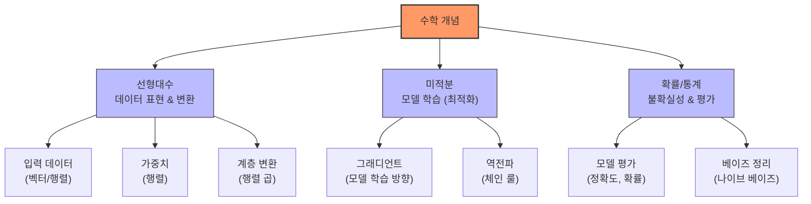

# 03장: 수학 기초

> **🎯 학습 목표**
> - 선형대수의 기본 개념(벡터, 행렬, 행렬 곱)을 이해하고 NumPy로 구현할 수 있습니다.
> - 미분과 그래디언트의 개념을 이해하고 경사하강법과 연결지을 수 있습니다.
> - 확률과 통계의 기본 개념과 머신러닝에서의 활용을 이해합니다.
> - "수포자"도 따라올 수 있도록 직관적으로 설명합니다.

---

## 3.1 왜 수학이 필요할까?

AI 프로그래밍에서 수학은 **엔진의 작동 원리**와 같습니다. Python 라이브러리가 대부분의 계산을 자동으로 처리하지만, 다음과 같은 이유로 기본 개념은 알아야 합니다.



> **격언:** "수학을 몰라도 AI 코드는 짤 수 있습니다. 하지만 수학을 알면 **더 좋은 AI 코드**를 짤 수 있습니다."

### 이 장에서 다룰 수학의 범위



---

## 3.2 선형대수 (Linear Algebra)

선형대수는 AI에서 **데이터를 표현하고 변환**하는 기본 도구입니다.

### 3.2.1 벡터 (Vector)

벡터는 숫자의 나열로, AI에서는 하나의 **데이터 포인트**를 표현합니다.



**NumPy로 벡터 다루기:**

```python
import numpy as np

# 벡터 생성
v = np.array([3, 4])
print(f"벡터 v: {v}")           # [3 4]
print(f"벡터 크기 (노름): {np.linalg.norm(v)}")  # 5.0

# 벡터 연산
a = np.array([1, 2, 3])
b = np.array([4, 5, 6])

print(f"덧셈: {a + b}")        # [5 7 9]
print(f"뺄셈: {a - b}")        # [-3 -3 -3]
print(f"스칼라 곱: {2 * a}")   # [2 4 6]
print(f"내적: {np.dot(a, b)}") # 32  (1*4 + 2*5 + 3*6)
```

> **내적(Dot Product):** 두 벡터의 유사도를 측정합니다. 값이 클수록 두 벡터가 비슷한 방향을 가리킵니다. AI에서는 **유사도 측정**에 광범위하게 사용됩니다.

```python
# 코사인 유사도: 두 벡터가 얼마나 비슷한지 (-1 ~ 1)
def cosine_similarity(a, b):
    return np.dot(a, b) / (np.linalg.norm(a) * np.linalg.norm(b))

v1 = np.array([1, 2, 3])
v2 = np.array([2, 4, 6])  # v1의 2배 = 같은 방향
v3 = np.array([-1, -2, -3])  # v1의 반대 방향

print(f"v1과 v2 유사도: {cosine_similarity(v1, v2):.2f}")  # 1.0 (완전 동일 방향)
print(f"v1과 v3 유사도: {cosine_similarity(v1, v3):.2f}")  # -1.0 (완전 반대)
print(f"v1과 [3,1,2] 유사도: {cosine_similarity(v1, [3,1,2]):.2f}")  # 중간값
```

### 3.2.2 행렬 (Matrix)

행렬은 숫자를 2차원으로 배열한 것입니다. AI에서는 **데이터셋 전체**나 **변환(가중치)** 을 표현합니다.



**NumPy로 행렬 다루기:**

```python
import numpy as np

# 행렬 생성 (3행 4열)
X = np.array([
    [1, 2, 3, 4],
    [5, 6, 7, 8],
    [9, 10, 11, 12]
])
print(f"행렬 형태: {X.shape}")  # (3, 4)

# 데이터셋처럼 사용하기
# 3개의 샘플, 각각 4개의 특징을 가진 데이터
# 샘플 1의 특징들
print(f"첫 번째 샘플: {X[0]}")        # [1 2 3 4]
print(f"두 번째 특징: {X[:, 1]}")      # [2 6 10]  (모든 행의 2번째 열)

# 행렬 연산
A = np.array([[1, 2], [3, 4]])
B = np.array([[5, 6], [7, 8]])

print(f"행렬 덧셈:\n{A + B}")
print(f"행렬 곱셈:\n{np.dot(A, B)}")
# 또는 A @ B (Python 3.5+)
print(f"행렬 곱셈 (@):\n{A @ B}")
```

### 3.2.3 행렬 곱셈 (Matrix Multiplication)

행렬 곱셈은 AI에서 **가장 중요한 연산**입니다. 신경망의 모든 계층은 기본적으로 행렬 곱셈입니다.



```python
# 신경망의 한 계층을 행렬 곱셈으로 표현
inputs = np.array([0.5, -0.2, 0.1])  # 3개의 입력 특성

weights = np.array([
    [0.4, 0.3],
    [-0.5, 0.2],
    [0.1, -0.4]
])  # 3×2 행렬: 3개 입력 → 2개 출력

biases = np.array([0.1, -0.1])  # 각 출력 뉴런의 바이어스

# 순전파 (forward pass): 행렬 곱 + 바이어스
output = np.dot(inputs, weights) + biases
print(f"신경망 계층 출력: {output}")
# 예: [0.31, 0.07]
```

### 3.2.4 전치행렬과 형태 변환

```python
import numpy as np

X = np.array([[1, 2, 3], [4, 5, 6]])
print(f"원본:\n{X}")          # shape: (2, 3)
print(f"전치:\n{X.T}")         # shape: (3, 2)

# 형태 변경 (reshape)
x = np.array([1, 2, 3, 4, 5, 6])
print(f"2×3으로 변경:\n{x.reshape(2, 3)}")
```

---

## 3.3 미적분 (Calculus)

미적분은 AI에서 **모델을 학습시키는 방법**을 제공합니다.

### 3.3.1 미분 (Derivative)

미분은 "변화율"입니다. 즉, 입력이 조금 변할 때 출력이 얼마나 변하는지 측정합니다.



**코드로 이해하는 미분:**

```python
import numpy as np

# 함수 f(x) = x² 의 미분: f'(x) = 2x
def f(x):
    return x ** 2

# 수치 미분 (numerical derivative)
def numerical_derivative(f, x, h=1e-5):
    return (f(x + h) - f(x - h)) / (2 * h)

x = 3.0
print(f"f(x) = x², x={x}에서 미분값: {numerical_derivative(f, x)}")  # ≈ 6.0 (2*3)

# 실제 미분: f'(3) = 2*3 = 6
print(f"실제 미분값: {2 * x}")  # 6.0
```

### 3.3.2 편미분 (Partial Derivative)

여러 변수가 있는 함수에서 **하나의 변수에 대한 미분**입니다.

```python
# f(x, y) = x² + y² + xy
# ∂f/∂x = 2x + y
# ∂f/∂y = 2y + x

def partial_derivative_x(x, y, h=1e-5):
    return ((x + h)**2 + y**2 + (x + h)*y - (x**2 + y**2 + x*y)) / h

def partial_derivative_y(x, y, h=1e-5):
    return (x**2 + (y + h)**2 + x*(y + h) - (x**2 + y**2 + x*y)) / h

x, y = 1.0, 2.0
print(f"∂f/∂x at (1,2): {partial_derivative_x(x, y):.2f}")  # 2*1 + 2 = 4.0
print(f"∂f/∂y at (1,2): {partial_derivative_y(x, y):.2f}")  # 2*2 + 1 = 5.0
```

### 3.3.3 체인 룰 (Chain Rule)

합성함수의 미분법칙으로, **역전파(Backpropagation)** 의 핵심 수학적 원리입니다.



```python
# 체인 룰 예제: f(x) = (3x + 2)²
# g(x) = 3x + 2,  f(g) = g²
# df/dx = df/dg * dg/dx = 2g * 3 = 2(3x+2) * 3 = 6(3x+2)

def f(x):
    g = 3 * x + 2
    return g ** 2

# df/dx at x = 1: 6 * (3*1 + 2) = 30
x_val = 1.0
g_val = 3 * x_val + 2
manual_grad = 2 * g_val * 3
print(f"체인 룰 계산: {manual_grad}")  # 30
```

---

## 3.4 확률과 통계 (Probability & Statistics)

확률과 통계는 AI에서 **불확실성을 다루고 데이터를 이해**하는 도구입니다.

### 3.4.1 확률의 기초



### 3.4.2 통계와 데이터 분포

```python
import numpy as np
import matplotlib.pyplot as plt

# 정규 분포 (Normal Distribution) - 가장 중요한 분포
mean = 0
std = 1
data = np.random.normal(mean, std, 10000)

print(f"평균: {np.mean(data):.3f}")  # ≈ 0
print(f"표준편차: {np.std(data):.3f}")  # ≈ 1
print(f"분산: {np.var(data):.3f}")  # ≈ 1

# 평균이 다른 두 데이터셋
class_1_heights = np.random.normal(170, 5, 100)  # 평균 170cm
class_2_heights = np.random.normal(165, 5, 100)  # 평균 165cm

print(f"반 1 평균 키: {np.mean(class_1_heights):.1f}cm")
print(f"반 2 평균 키: {np.mean(class_2_heights):.1f}cm")
```

### 3.4.3 머신러닝에서의 통계 개념

```python
import numpy as np

# 실제 주택 가격 데이터 (가상)
true_prices = np.array([3.0, 5.0, 4.0, 7.0, 6.0])  # 실제 가격 (억)
pred_prices = np.array([2.8, 5.2, 4.1, 6.5, 6.3])  # 모델 예측

# 평균 제곱 오차 (MSE) - 회귀 모델 평가
errors = true_prices - pred_prices
mse = np.mean(errors ** 2)
rmse = np.sqrt(mse)

print(f"평균 오차: {np.mean(errors):.2f}억")       # -0.02
print(f"MSE: {mse:.4f}")                          # 0.052
print(f"RMSE: {rmse:.2f}억")                      # 0.23

# 상관 계수 (Correlation) - 두 변수의 관계
# 1에 가까울수록 양의 상관관계
correlation = np.corrcoef(true_prices, pred_prices)[0, 1]
print(f"상관 계수: {correlation:.3f}")  # ≈ 0.97 (매우 강한 상관관계)
```

---

## 3.5 최적화 (Optimization) — 경사하강법

경사하강법(Gradient Descent)은 AI에서 **가장 핵심적인 최적화 알고리즘**입니다.

### 3.5.1 기본 개념



### 3.5.2 코드로 구현하는 경사하강법

```python
import numpy as np

# 간단한 예: y = 2x + 1 을 학습하는 선형 회귀
# (실제 정답은 w=2, b=1)

# 데이터 준비
X = np.array([1, 2, 3, 4, 5])
y = 2 * X + 1 + np.random.randn(5) * 0.1  # 실제 값에 노이즈 추가

# 모델: y_pred = w * x + b
w = 0.0  # 가중치 초기화
b = 0.0  # 바이어스 초기화
learning_rate = 0.01
epochs = 1000
n = len(X)

# 학습 루프
for epoch in range(epochs):
    # 예측
    y_pred = w * X + b

    # 손실 (MSE)
    loss = np.mean((y_pred - y) ** 2)

    # 그래디언트 계산 (편미분)
    grad_w = (2 / n) * np.sum(X * (y_pred - y))
    grad_b = (2 / n) * np.sum(y_pred - y)

    # 가중치 갱신 (경사하강법)
    w -= learning_rate * grad_w
    b -= learning_rate * grad_b

    if epoch % 100 == 0:
        print(f"Epoch {epoch}: loss={loss:.4f}, w={w:.2f}, b={b:.2f}")

print(f"\n최종 결과: w={w:.2f}, b={b:.2f}")
print(f"실제 정답: w=2.00, b=1.00")
```

### 3.5.3 다양한 옵티마이저

경사하강법의 여러 변형이 있습니다.

| 옵티마이저 | 특징 | 사용 시기 |
|-----------|------|----------|
| **SGD** | 기본 경사하강법 | 간단한 문제 |
| **Momentum** | 관성 추가, 진동 감소 | 복잡한 손실 함수 |
| **Adam** | 적응형 학습률 + Momentum | **가장 많이 사용** |
| **RMSprop** | 학습률을 특징별로 조정 | RNN/시계열 |

```python
import torch
import torch.nn as nn
import torch.optim as optim

# PyTorch의 옵티마이저 사용법
model = nn.Linear(10, 1)

# 다양한 옵티마이저
optimizers = {
    "SGD": optim.SGD(model.parameters(), lr=0.01),
    "Adam": optim.Adam(model.parameters(), lr=0.001),
    "RMSprop": optim.RMSprop(model.parameters(), lr=0.001),
}

# Adam이 일반적으로 가장 좋은 기본 선택입니다.
```

---

## 3.6 AI와 수학의 연결



---

## 📋 한눈에 정리

| 개념 | 설명 | NumPy 코드 | AI에서의 역할 |
|------|------|-----------|-------------|
| **벡터** | 숫자의 1차원 배열 | `np.array([1,2,3])` | 데이터 포인트 |
| **행렬** | 숫자의 2차원 배열 | `np.array([[1,2],[3,4]])` | 가중치, 데이터셋 |
| **행렬 곱** | 입력 × 가중치 = 출력 | `np.dot(A, B)` 또는 `A @ B` | 신경망 계층 연산 |
| **미분** | 변화율 | `수치 미분` | 학습 방향 결정 |
| **그래디언트** | 모든 변수에 대한 편미분 | `자동 계산 (PyTorch)` | 가중치 갱신 |
| **확률** | 사건의 발생 가능성 | `np.random` | 불확실성 표현 |
| **경사하강법** | 손실 최소화 반복 알고리즘 | `직접 구현 or optimizer` | 모델 학습 |

---

## ✏️ 연습 문제

1. 다음 두 벡터의 내적과 코사인 유사도를 계산해보세요.
   ```python
   a = np.array([1, 0, 1])
   b = np.array([0, 1, 0])
   c = np.array([2, 0, 2])
   ```
   - a와 b의 유사도는?
   - a와 c의 유사도는?
   - 왜 이런 결과가 나왔을까요?

2. 3×2 행렬 A와 2×4 행렬 B의 곱을 NumPy로 계산해보세요. 결과 행렬의 shape은 무엇인가요?

3. 다음 함수의 x=2에서의 미분값을 수치 미분으로 계산해보세요.
   ```python
   def f(x):
       return 3 * x ** 3 + 2 * x ** 2 + x + 1
   ```

4. 경사하강법 코드에서 `learning_rate`를 0.1, 1.0, 10.0으로 각각 바꿔보고 결과를 관찰하세요. 어떤 변화가 일어나나요?

5. 다음 중 행렬 곱셈이 불가능한 것은?
   - a) (3,4) × (4,2)
   - b) (2,3) × (2,3)
   - c) (5,1) × (1,5)

---

## 📝 연습 문제 정답

<details>
<summary>정답 보기</summary>

**1. 벡터 내적과 코사인 유사도**
```python
import numpy as np
a, b, c = np.array([1,0,1]), np.array([0,1,0]), np.array([2,0,2])

# a·b = 1*0 + 0*1 + 1*0 = 0
print(f"a·b = {np.dot(a, b)}")  # 0
# cos(a,b) = 0 / (√2 * 1) = 0 (완전 직교)
print(f"cos(a,b) = {np.dot(a,b)/(np.linalg.norm(a)*np.linalg.norm(b)):.2f}")

# a·c = 1*2 + 0*0 + 1*2 = 4
print(f"a·c = {np.dot(a, c)}")  # 4
# cos(a,c) = 4 / (√2 * 2√2) = 4/4 = 1 (완전 동일 방향)
print(f"cos(a,c) = {np.dot(a,c)/(np.linalg.norm(a)*np.linalg.norm(c)):.2f}")
```
- a와 b는 직교(유사도 0), a와 c는 같은 방향(유사도 1)
- c = 2a 이므로 a와 c는 같은 방향을 가리킵니다.

**2. 행렬 곱셈**
```python
A = np.array([[1,2],[3,4],[5,6]])  # 3×2
B = np.array([[1,2,3,4],[5,6,7,8]])  # 2×4
C = A @ B  # 결과 shape: (3, 4)
print(f"결과 shape: {C.shape}")  # (3, 4)
```
→ (3×2) × (2×4) = (3×4), 행렬 곱셈이 가능하려면 A의 열 수와 B의 행 수가 같아야 합니다.

**3. 수치 미분**
```python
def f(x): return 3*x**3 + 2*x**2 + x + 1
def num_diff(f, x, h=1e-5):
    return (f(x+h) - f(x-h)) / (2*h)
# f'(x) = 9x² + 4x + 1, f'(2) = 36 + 8 + 1 = 45
print(f"f'(2) = {num_diff(f, 2):.2f}")  # ≈ 45.00
```

**4. 학습률 변화 실험**
- **lr=0.1:** 빠르게 수렴하지만 진동 가능
- **lr=1.0:** 발산(diverge)하여 loss가 NaN이 됨
- **lr=10.0:** 즉시 발산, 학습 실패
→ 적절한 학습률(0.01~0.001)이 중요합니다.

**5. 행렬 곱셈 가능 여부**
- a) (3,4) × (4,2) → **가능** (내부 차원 4가 일치) → 결과 (3,2)
- b) (2,3) × (2,3) → **불가능** (A의 열 3 ≠ B의 행 2)
- c) (5,1) × (1,5) → **가능** → 결과 (5,5)
→ 정답: **b**

</details>

---

> **🔄 다음 장에서는** Python 데이터 과학 라이브러리(NumPy, Pandas, Matplotlib)를 본격적으로 학습합니다. 실제 데이터를 불러오고, 분석하고, 시각화하는 방법을 배웁니다.
