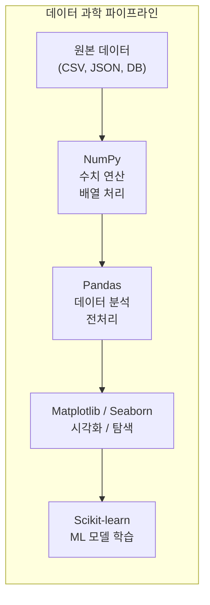
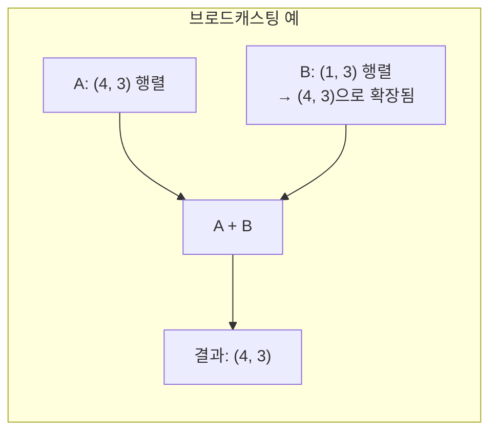
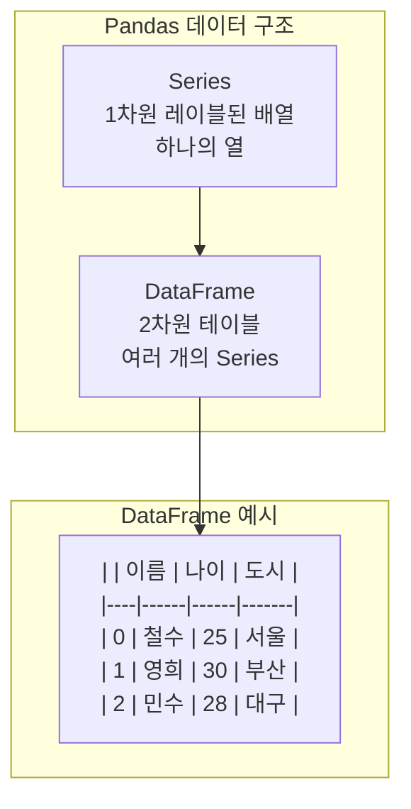
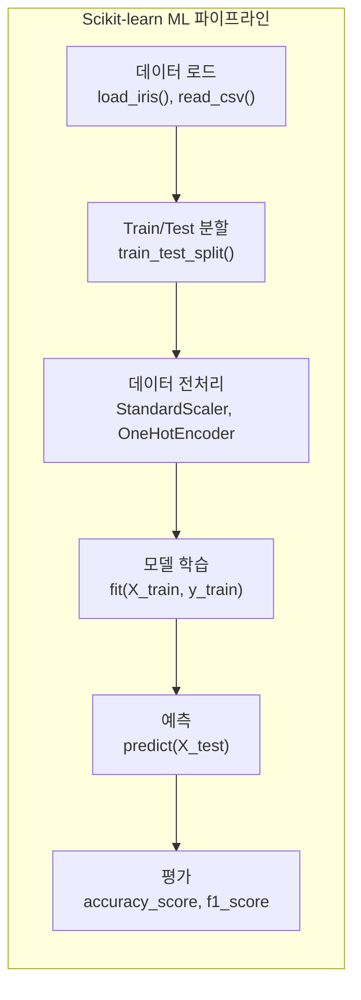

# 04장: Python 데이터 과학

> **🎯 학습 목표**
> - NumPy로 배열 연산과 선형대수를 자유롭게 다룰 수 있습니다.
> - Pandas로 CSV 데이터를 불러오고, 탐색하고, 전처리할 수 있습니다.
> - Matplotlib과 Seaborn으로 데이터를 시각화할 수 있습니다.
> - Scikit-learn으로 기본적인 ML 파이프라인을 구성할 수 있습니다.

---

## 4.1 개요

Python이 AI/ML 분야에서 가장 인기 있는 언어인 이유는 **풍부한 데이터 과학 라이브러리** 때문입니다. 이 장에서는 AI 프로그래밍의 80%를 차지하는 데이터 전처리와 분석을 위한 핵심 라이브러리를 배웁니다.



---

## 4.2 NumPy — 수치 연산의 기초

NumPy(Numerical Python)는 Python의 **수치 연산 핵심 라이브러리**입니다. 모든 AI/ML 라이브러리가 NumPy 배열을 기반으로 동작합니다.

### 4.2.1 배열 생성

```python
import numpy as np

# 1차원 배열
arr1 = np.array([1, 2, 3, 4, 5])
print(f"1차원 배열: {arr1}, shape: {arr1.shape}")

# 2차원 배열
arr2 = np.array([[1, 2, 3], [4, 5, 6]])
print(f"2차원 배열:\n{arr2}")
print(f"shape: {arr2.shape}, 차원: {arr2.ndim}")

# 특수 배열 생성
zeros = np.zeros((2, 3))        # 모든 원소가 0
ones = np.ones((3, 2))          # 모든 원소가 1
eye = np.eye(3)                 # 단위 행렬 (대각선이 1)
random = np.random.randn(2, 4)  # 정규 분포 난수
lin = np.linspace(0, 1, 5)      # 0부터 1까지 5개로 균등 분할

print(f"\n영행렬:\n{zeros}")
print(f"단위 행렬:\n{eye}")
print(f"linspace(0, 1, 5): {lin}")
```

### 4.2.2 배열 인덱싱과 슬라이싱

```python
import numpy as np

arr = np.array([[1, 2, 3, 4],
                [5, 6, 7, 8],
                [9, 10, 11, 12]])

print(f"전체 배열:\n{arr}")

# 인덱싱
print(f"arr[0]: {arr[0]}")           # 첫 번째 행
print(f"arr[1, 2]: {arr[1, 2]}")     # 2행 3열 (7)
print(f"arr[-1]: {arr[-1]}")         # 마지막 행

# 슬라이싱
print(f"arr[:, 1]: {arr[:, 1]}")     # 모든 행의 2번째 열
print(f"arr[1:, :2]:\n{arr[1:, :2]}")  # 2행부터, 처음 2열
print(f"arr[0:2, 1:3]:\n{arr[0:2, 1:3]}")  # 1-2행, 2-3열

# 조건부 인덱싱
print(f"7보다 큰 원소: {arr[arr > 7]}")
```

### 4.2.3 브로드캐스팅 (Broadcasting)

브로드캐스팅은 **서로 다른 shape의 배열 간 연산**을 가능하게 하는 NumPy의 강력한 기능입니다.



```python
import numpy as np

# 브로드캐스팅 예
A = np.array([[1, 2, 3],
              [4, 5, 6],
              [7, 8, 9],
              [10, 11, 12]])

B = np.array([1, 2, 3])  # (3,) → (4,3)으로 자동 확장

C = A + B
print(f"A + B:\n{C}")
# [[ 2  4  6]
#  [ 5  7  9]
#  [ 8 10 12]
#  [11 13 15]]

# 스칼라도 브로드캐스팅됨
print(f"A * 10:\n{A * 10}")

# 각 열의 평균으로 정규화
column_means = A.mean(axis=0)  # 각 열의 평균
A_normalized = A - column_means
print(f"열 평균: {column_means}")
print(f"정규화된 A:\n{A_normalized}")
```

### 4.2.4 주요 연산

```python
import numpy as np

A = np.array([[1, 2], [3, 4]])
B = np.array([[5, 6], [7, 8]])

# 기본 연산
print(f"A + B:\n{A + B}")
print(f"A * B (요소별 곱):\n{A * B}")
print(f"A @ B (행렬 곱):\n{A @ B}")       # Python 3.5+
print(f"np.dot(A, B):\n{np.dot(A, B)}")   # 같은 결과

# 통계 함수
data = np.array([1, 2, 3, 4, 5, 6, 7, 8, 9, 10])
print(f"합계: {np.sum(data)}")
print(f"평균: {np.mean(data)}")
print(f"중앙값: {np.median(data)}")
print(f"표준편차: {np.std(data)}")
print(f"최대값: {np.max(data)}, 최소값: {np.min(data)}")
print(f"분위수 (25%, 50%, 75%): {np.percentile(data, [25, 50, 75])}")

# 2차원 통계
M = np.array([[1, 2, 3], [4, 5, 6], [7, 8, 9]])
print(f"행 방향 합 (axis=0): {M.sum(axis=0)}")  # [12 15 18]
print(f"열 방향 합 (axis=1): {M.sum(axis=1)}")  # [6 15 24]
```

### 4.2.5 AI에서의 NumPy 활용 예

```python
import numpy as np

# 1. 데이터 정규화 (Normalization)
data = np.array([100, 200, 300, 400, 500])
normalized = (data - data.min()) / (data.max() - data.min())
print(f"정규화된 데이터: {normalized}")  # [0. 0.25 0.5 0.75 1.]

# 2. 표준화 (Standardization)
standardized = (data - data.mean()) / data.std()
print(f"표준화된 데이터: {standardized}")

# 3. Train/Test 분할
indices = np.random.permutation(len(data))  # 인덱스 섞기
split = int(0.8 * len(data))
train_idx, test_idx = indices[:split], indices[split:]
print(f"Train 인덱스: {train_idx}")
print(f"Test 인덱스: {test_idx}")

# 4. 원-핫 인코딩 (One-Hot Encoding)
labels = np.array([0, 2, 1, 0, 2])  # 3개 클래스
one_hot = np.zeros((len(labels), 3))
one_hot[np.arange(len(labels)), labels] = 1
print(f"원-핫 인코딩:\n{one_hot}")
```

---

## 4.3 Pandas — 데이터 분석의 표준

Pandas는 **표 형태의 데이터**를 다루는 라이브러리입니다. CSV, Excel, SQL 등 다양한 데이터 소스를 불러올 수 있습니다.

### 4.3.1 Series와 DataFrame



```python
import pandas as pd
import numpy as np

# Series
s = pd.Series([10, 20, 30, 40], index=['a', 'b', 'c', 'd'])
print(f"Series:\n{s}\n")

# DataFrame - 여러 방식으로 생성
# 1) 딕셔너리로 생성
df = pd.DataFrame({
    '이름': ['철수', '영희', '민수', '지현'],
    '나이': [25, 30, 28, 22],
    '도시': ['서울', '부산', '대구', '광주'],
    '점수': [85, 92, 78, 95]
})
print(f"DataFrame:\n{df}\n")

# 2) CSV 파일에서 불러오기 (가상)
# df = pd.read_csv('data.csv')
```

### 4.3.2 데이터 탐색

```python
import pandas as pd
import numpy as np

# 샘플 데이터 생성
np.random.seed(42)
df = pd.DataFrame({
    'A': np.random.randn(100),
    'B': np.random.randn(100) * 2 + 1,
    'C': np.random.choice(['X', 'Y', 'Z'], 100),
    'D': np.random.randint(1, 100, 100)
})

# 기본 정보 확인
print(f"처음 5행:\n{df.head()}\n")
print(f"데이터 정보:")
df.info()  # 각 열의 타입, null 개수
print()

print(f"기술 통계:\n{df.describe()}\n")  # 수치형 열의 통계 요약

# 주요 탐색 메서드
print(f"shape: {df.shape}")  # (100, 4)
print(f"열 이름: {df.columns.tolist()}")
print(f"고유값 개수:\n{df.nunique()}")
print(f"결측치 개수:\n{df.isnull().sum()}")
```

### 4.3.3 데이터 선택과 필터링

```python
import pandas as pd

df = pd.DataFrame({
    '이름': ['철수', '영희', '민수', '지현', '수진'],
    '나이': [25, 30, 28, 22, 35],
    '도시': ['서울', '부산', '대구', '광주', '서울'],
    '점수': [85, 92, 78, 95, 88],
    '합격': [True, True, False, True, True]
})

# 열 선택
print(f"하나의 열:\n{df['이름']}\n")
print(f"여러 열:\n{df[['이름', '점수']]}\n")

# 행 선택 (iloc = 정수 인덱스, loc = 레이블 인덱스)
print(f"첫 3행 (iloc):\n{df.iloc[:3]}\n")
print(f"인덱스 2부터:\n{df.loc[2:]}\n")

# 조건 필터링
print(f"점수 90점 이상:\n{df[df['점수'] >= 90]}\n")
print(f"서울 거주자:\n{df[df['도시'] == '서울']}\n")
print(f"서울 거주자 중 30세 이상:\n{df[(df['도시'] == '서울') & (df['나이'] >= 30)]}\n")

# query 메서드 (더 간결)
print(f"query 사용:\n{df.query('점수 >= 90 and 도시 == "서울"')}\n")
```

### 4.3.4 데이터 전처리

실제 데이터는 항상 깔끔하지 않습니다. 결측치, 이상치, 중복 등을 처리해야 합니다.

```python
import pandas as pd
import numpy as np

# 결측치가 있는 데이터
df = pd.DataFrame({
    'A': [1, 2, np.nan, 4, 5],
    'B': [np.nan, 2, 3, np.nan, 5],
    'C': ['a', 'b', 'c', 'd', 'e']
})

print(f"원본:\n{df}\n")

# 결측치 처리
print(f"결측치 여부:\n{df.isnull()}\n")
print(f"열별 결측치 개수:\n{df.isnull().sum()}\n")

# 방법 1: 결측치 제거
print(f"결측치가 있는 행 제거:\n{df.dropna()}\n")

# 방법 2: 결측치 채우기
print(f"0으로 채우기:\n{df.fillna(0)}\n")
print(f"평균으로 채우기:\n{df.fillna(df.mean())}\n")
print(f"앞 값으로 채우기:\n{df.fillna(method='ffill')}\n")  # forward fill

# 방법 3: 특정 열만 채우기
df['A'] = df['A'].fillna(df['A'].mean())
df['B'] = df['B'].fillna(df['B'].median())
print(f"열별 다른 방법:\n{df}\n")
```

#### 데이터 변환

```python
import pandas as pd

df = pd.DataFrame({
    '이름': ['철수', '영희', '민수'],
    '부서': ['개발', '마케팅', '개발'],
    '급여': [5000, 4500, 5200],
    '입사일': ['2020-01-15', '2019-03-20', '2021-07-01']
})

# 열 타입 변환
df['입사일'] = pd.to_datetime(df['입사일'])
print(f"데이터 타입:\n{df.dtypes}\n")

# 범주형 변환 (One-Hot Encoding)
df_encoded = pd.get_dummies(df, columns=['부서'])
print(f"원-핫 인코딩:\n{df_encoded}\n")

# 새로운 열 생성
df['보너스'] = df['급여'] * 0.1
df['연봉'] = df['급여'] * 12 + df['보너스']
print(f"파생 열:\n{df[['이름', '급여', '보너스', '연봉']]}\n")

# 그룹화와 집계
df2 = pd.DataFrame({
    '부서': ['개발', '마케팅', '개발', '마케팅', '개발'],
    '급여': [5000, 4500, 5200, 4800, 5100],
    '성과': [85, 90, 78, 92, 88]
})
print(f"부서별 평균:\n{df2.groupby('부서')[['급여', '성과']].mean()}\n")
```

### 4.3.5 실전 데이터 분석 예제

```python
import pandas as pd
import numpy as np

# 가상의 주택 데이터
np.random.seed(42)
n = 200

df = pd.DataFrame({
    'area': np.random.randint(20, 200, n),        # 평수
    'rooms': np.random.randint(1, 6, n),           # 방 개수
    'year': np.random.randint(1990, 2025, n),      # 건축년도
    'floor': np.random.randint(1, 20, n),          # 층수
    'location': np.random.choice(['강남', '강북', '강서', '강동'], n),
    'price': np.random.randint(1, 15, n) * 1000    # 가격 (만원/평)
})

# 데이터 전처리
print(f"기본 정보:")
print(df.head())
print(f"\n기술 통계:\n{df.describe()}")

# 이상치 처리 (IQR 방식)
Q1 = df['price'].quantile(0.25)
Q3 = df['price'].quantile(0.75)
IQR = Q3 - Q1
outliers = df[(df['price'] < Q1 - 1.5 * IQR) | (df['price'] > Q3 + 1.5 * IQR)]
print(f"\n이상치 개수: {len(outliers)}")

# 범주형 변수 인코딩
df_encoded = pd.get_dummies(df, columns=['location'])

# 상관관계 분석
numeric_cols = ['area', 'rooms', 'year', 'floor', 'price']
print(f"\n상관 행렬:\n{df[numeric_cols].corr()}")

# 가격과 면적의 상관계수가 가장 높아야 합니다.
```

---

## 4.4 Matplotlib & Seaborn — 데이터 시각화

### 4.4.1 Matplotlib 기본

```python
import numpy as np
import matplotlib.pyplot as plt

# 한글 폰트 설정 (Windows)
# plt.rcParams['font.family'] = 'Malgun Gothic'

# 기본 그래프
x = np.linspace(0, 10, 100)
y1 = np.sin(x)
y2 = np.cos(x)

plt.figure(figsize=(10, 5))
plt.plot(x, y1, label='sin(x)', linewidth=2)
plt.plot(x, y2, label='cos(x)', linewidth=2)
plt.xlabel('x')
plt.ylabel('y')
plt.title('사인과 코사인 곡선')
plt.legend()
plt.grid(True, alpha=0.3)
plt.show()
```

### 4.4.2 여러 그래프 유형

```python
import numpy as np
import matplotlib.pyplot as plt

np.random.seed(42)
data1 = np.random.randn(1000)
data2 = np.random.randn(1000) * 2 + 1

# 서브플롯 구성
fig, axes = plt.subplots(2, 3, figsize=(15, 8))

# 1. 선 그래프
x = np.linspace(0, 10, 50)
axes[0, 0].plot(x, np.sin(x), 'b-')
axes[0, 0].set_title('선 그래프 (Line)')

# 2. 산점도 (Scatter)
x_scatter = np.random.randn(100)
y_scatter = np.random.randn(100) + x_scatter * 0.5
axes[0, 1].scatter(x_scatter, y_scatter, alpha=0.5)
axes[0, 1].set_title('산점도 (Scatter)')

# 3. 히스토그램
axes[0, 2].hist(data1, bins=30, alpha=0.5, label='data1')
axes[0, 2].hist(data2, bins=30, alpha=0.5, label='data2')
axes[0, 2].set_title('히스토그램')
axes[0, 2].legend()

# 4. 막대 그래프
categories = ['A', 'B', 'C', 'D', 'E']
values = [23, 45, 56, 78, 32]
axes[1, 0].bar(categories, values)
axes[1, 0].set_title('막대 그래프 (Bar)')

# 5. 박스 플롯
axes[1, 1].boxplot([data1, data2], labels=['data1', 'data2'])
axes[1, 1].set_title('박스 플롯 (Boxplot)')

# 6. 파이 차트
sizes = [30, 25, 20, 15, 10]
labels = ['A', 'B', 'C', 'D', 'E']
axes[1, 2].pie(sizes, labels=labels, autopct='%1.1f%%')
axes[1, 2].set_title('파이 차트')

plt.tight_layout()
plt.show()
```


### 4.4.3 Seaborn — 통계 시각화

Seaborn은 Matplotlib 기반으로 **통계적 시각화**를 더 쉽게 만듭니다.

```python
import numpy as np
import pandas as pd
import seaborn as sns
import matplotlib.pyplot as plt

# 샘플 데이터 생성
np.random.seed(42)
df = pd.DataFrame({
    'x': np.random.randn(200),
    'y': np.random.randn(200) + np.random.randn(200) * 0.5,
    'category': np.random.choice(['A', 'B', 'C'], 200),
    'group': np.random.choice(['X', 'Y'], 200)
})

fig, axes = plt.subplots(2, 3, figsize=(15, 10))

# 1. 히트맵 (상관관계)
corr = df.corr()
sns.heatmap(corr, annot=True, cmap='RdBu', ax=axes[0, 0])
axes[0, 0].set_title('상관관계 히트맵')

# 2. 회귀선이 포함된 산점도
sns.regplot(x='x', y='y', data=df, ax=axes[0, 1])
axes[0, 1].set_title('회귀선 포함 산점도')

# 3. 범주별 분포 (바이올린 플롯)
sns.violinplot(x='category', y='y', data=df, ax=axes[0, 2])
axes[0, 2].set_title('범주별 분포 (Violin)')

# 4. 쌍별 관계 (PairPlot 샘플)
sns.kdeplot(x='x', y='y', data=df, ax=axes[1, 0])
axes[1, 0].set_title('KDE 등고선')

# 5. 범주별 막대 그래프
sns.barplot(x='category', y='y', hue='group', data=df, ax=axes[1, 1])
axes[1, 1].set_title('범주별 막대 그래프')

# 6. 카운트 플롯
sns.countplot(x='category', hue='group', data=df, ax=axes[1, 2])
axes[1, 2].set_title('범주별 빈도')

plt.tight_layout()
plt.show()
```

---

## 4.5 Scikit-learn — ML 첫걸음

Scikit-learn은 **가장 널리 사용되는 머신러닝 라이브러리**입니다. 일관된 API로 다양한 ML 알고리즘을 사용할 수 있습니다.



```python
from sklearn.datasets import load_iris
from sklearn.model_selection import train_test_split
from sklearn.preprocessing import StandardScaler
from sklearn.neighbors import KNeighborsClassifier
from sklearn.metrics import accuracy_score, classification_report

# 1. 데이터 로드
iris = load_iris()
X, y = iris.data, iris.target
print(f"데이터 shape: {X.shape}")  # (150, 4)
print(f"특성 이름: {iris.feature_names}")
print(f"클래스 이름: {iris.target_names}")

# 2. Train/Test 분할
X_train, X_test, y_train, y_test = train_test_split(
    X, y, test_size=0.2, random_state=42, stratify=y
)
print(f"Train: {X_train.shape}, Test: {X_test.shape}")

# 3. 데이터 표준화 (Standardization)
scaler = StandardScaler()
X_train_scaled = scaler.fit_transform(X_train)
X_test_scaled = scaler.transform(X_test)

# 4. 모델 학습
model = KNeighborsClassifier(n_neighbors=3)
model.fit(X_train_scaled, y_train)

# 5. 예측 및 평가
y_pred = model.predict(X_test_scaled)
accuracy = accuracy_score(y_test, y_pred)
print(f"\n정확도: {accuracy:.4f}")
print(f"\n분류 리포트:\n{classification_report(y_test, y_pred, target_names=iris.target_names)}")

# 6. 새로운 데이터 예측
new_flower = np.array([[5.1, 3.5, 1.4, 0.2]])  # 새 꽃 측정값
new_flower_scaled = scaler.transform(new_flower)
pred = model.predict(new_flower_scaled)
print(f"\n새 꽃 예측: {iris.target_names[pred[0]]}")
```

### Scikit-learn API 통일성

모든 Scikit-learn 모델은 동일한 API를 따릅니다:

| 단계 | 메서드 | 설명 |
|------|--------|------|
| 학습 | `model.fit(X, y)` | 모델 학습 |
| 예측 | `model.predict(X)` | 예측값 반환 |
| 확률 | `model.predict_proba(X)` | 각 클래스 확률 반환 |
| 정확도 | `model.score(X, y)` | 모델 정확도 반환 |

```python
# Scikit-learn의 일관된 API 예시
from sklearn.linear_model import LogisticRegression
from sklearn.tree import DecisionTreeClassifier
from sklearn.svm import SVC
from sklearn.ensemble import RandomForestClassifier

models = {
    "로지스틱 회귀": LogisticRegression(max_iter=1000),
    "결정 트리": DecisionTreeClassifier(),
    "SVM": SVC(),
    "랜덤 포레스트": RandomForestClassifier(),
}

for name, model in models.items():
    model.fit(X_train_scaled, y_train)
    score = model.score(X_test_scaled, y_test)
    print(f"{name}: {score:.4f}")
```

---

## 4.6 전체 파이프라인 예제

지금까지 배운 모든 것을 하나의 파이프라인으로 연결합니다.

```python
import numpy as np
import pandas as pd
import matplotlib.pyplot as plt
import seaborn as sns
from sklearn.datasets import load_iris
from sklearn.model_selection import train_test_split
from sklearn.preprocessing import StandardScaler
from sklearn.ensemble import RandomForestClassifier
from sklearn.metrics import confusion_matrix, classification_report

# 1. 데이터 로드
iris = load_iris()
df = pd.DataFrame(iris.data, columns=iris.feature_names)
df['species'] = pd.Categorical.from_codes(iris.target, iris.target_names)

# 2. 데이터 탐색 (EDA)
print("=== 데이터 탐색 ===")
print(df.head())
print(f"\n클래스 분포:\n{df['species'].value_counts()}")
print(f"\n기술 통계:\n{df.describe()}")

# 3. 시각화
fig, axes = plt.subplots(1, 2, figsize=(12, 4))
sns.scatterplot(data=df, x='sepal length (cm)', y='sepal width (cm)',
                hue='species', ax=axes[0])
axes[0].set_title('꽃받침 길이 vs 너비')
sns.scatterplot(data=df, x='petal length (cm)', y='petal width (cm)',
                hue='species', ax=axes[1])
axes[1].set_title('꽃잎 길이 vs 너비')
plt.tight_layout()
plt.show()

# 4. ML 파이프라인
X = iris.data
y = iris.target

X_train, X_test, y_train, y_test = train_test_split(
    X, y, test_size=0.2, random_state=42
)

scaler = StandardScaler()
X_train = scaler.fit_transform(X_train)
X_test = scaler.transform(X_test)

model = RandomForestClassifier(n_estimators=100, random_state=42)
model.fit(X_train, y_train)

# 5. 평가
y_pred = model.predict(X_test)
print(f"\n=== 모델 평가 ===")
print(f"정확도: {accuracy_score(y_test, y_pred):.4f}")
print(f"\n혼동 행렬:\n{confusion_matrix(y_test, y_pred)}")
print(f"\n분류 리포트:\n{classification_report(y_test, y_pred, target_names=iris.target_names)}")

# 6. 특성 중요도
feature_importance = pd.DataFrame({
    'feature': iris.feature_names,
    'importance': model.feature_importances_
}).sort_values('importance', ascending=False)
print(f"\n=== 특성 중요도 ===")
print(feature_importance)
```

---

## 📋 한눈에 정리

| 라이브러리 | 주요 기능 | 핵심 데이터 구조 | 핵심 메서드 |
|-----------|----------|-----------------|-----------|
| **NumPy** | 수치 연산, 배열 처리 | `ndarray` | `np.array()`, `.reshape()`, `.mean()`, `@` |
| **Pandas** | 데이터 분석, 전처리 | `DataFrame`, `Series` | `read_csv()`, `.info()`, `.groupby()`, `.fillna()` |
| **Matplotlib** | 기본 시각화 | Figure, Axes | `plt.plot()`, `plt.scatter()`, `plt.hist()` |
| **Seaborn** | 통계 시각화 | - | `sns.heatmap()`, `sns.boxplot()`, `sns.pairplot()` |
| **Scikit-learn** | 머신러닝 | - | `.fit()`, `.predict()`, `.score()`, `train_test_split()` |

---

## ✏️ 연습 문제

1. NumPy로 5×5 행렬을 만들고, 모든 원소의 합, 평균, 표준편차를 계산하세요. 그런 다음 각 열의 평균을 0으로 만드는 정규화를 수행하세요.

2. 다음 데이터를 Pandas DataFrame으로 만들고 분석하세요:
   ```
   이름, 나이, 성별, 점수
   철수, 25, 남, 85
   영희, 30, 여, 92
   민수, 28, 남, 78
   지현, 22, 여, 95
   수진, 35, 여, 88
   ```
   - 성별별 평균 점수는?
   - 30세 이상의 평균 점수는?
   - 점수가 90점 이상인 사람만 출력하세요.

3. Matplotlib으로 `y = x²` 그래프를 그리고, `y = 2x + 3` 그래프를 같은 그래프에 겹쳐서 그리세요. 범례와 제목을 추가하세요.

4. Scikit-learn의 `load_digits()` 데이터셋을 사용하여 손글씨 숫자를 분류하는 모델을 만드세요:
   - 데이터를 train/test로 분할 (test_size=0.2)
   - SVM 또는 랜덤 포레스트 사용
   - 정확도 출력

5. 여러분이 수집한 CSV 데이터가 있다고 가정하고, Pandas로 불러와서 결측치를 확인하고 처리하는 코드를 작성하세요. (가상 데이터 사용 가능)

---

## 📝 연습 문제 정답

<details>
<summary>정답 보기</summary>

**1. 5×5 행렬 생성, 통계, 정규화**
```python
import numpy as np
M = np.random.randn(5, 5)
print(f"합계: {M.sum():.3f}")
print(f"평균: {M.mean():.3f}")
print(f"표준편차: {M.std():.3f}")
# 각 열의 평균을 0으로 (열 중심화)
M_centered = M - M.mean(axis=0)
print(f"중심화 후 열 평균: {M_centered.mean(axis=0).round(10)}")  # 모두 0
```

**2. Pandas 데이터 분석**
```python
import pandas as pd
df = pd.DataFrame({
    '이름': ['철수','영희','민수','지현','수진'],
    '나이': [25,30,28,22,35],
    '성별': ['남','여','남','여','여'],
    '점수': [85,92,78,95,88]
})
print(f"성별 평균 점수:\n{df.groupby('성별')['점수'].mean()}")
# 여: 91.67, 남: 81.5
print(f"30세 이상 평균: {df[df['나이']>=30]['점수'].mean()}")  # 90.0
print(f"90점 이상:\n{df[df['점수']>=90][['이름','점수']]}")
```

**3. Matplotlib 그래프**
```python
import numpy as np, matplotlib.pyplot as plt
x = np.linspace(-5, 5, 100)
plt.plot(x, x**2, label='y=x²')
plt.plot(x, 2*x+3, label='y=2x+3')
plt.legend(); plt.title('그래프'); plt.grid(True); plt.show()
```

**4. 손글씨 숫자 분류**
```python
from sklearn.datasets import load_digits
from sklearn.model_selection import train_test_split
from sklearn.ensemble import RandomForestClassifier
from sklearn.metrics import accuracy_score

digits = load_digits()
X_train, X_test, y_train, y_test = train_test_split(
    digits.data, digits.target, test_size=0.2, random_state=42
)
model = RandomForestClassifier(n_estimators=100, random_state=42)
model.fit(X_train, y_train)
y_pred = model.predict(X_test)
print(f"정확도: {accuracy_score(y_test, y_pred):.4f}")  # 약 0.97
```

**5. CSV 결측치 처리**
```python
import pandas as pd
import numpy as np
df = pd.DataFrame({'A': [1,np.nan,3], 'B': [4,5,np.nan], 'C': [7,8,9]})
print(f"결측치:\n{df.isnull().sum()}")
df = df.fillna(df.mean())  # 평균으로 채우기
print(f"처리 후:\n{df}")
```

</details>

---

> **🔄 다음 장에서는** 머신러닝의 기본 개념을 본격적으로 배웁니다. 지도학습과 비지도학습의 차이, 모델의 학습 과정, 과대적합과 과소적합, 편향-분산 트레이드오프 등 ML의 핵심 개념을 다룹니다.
