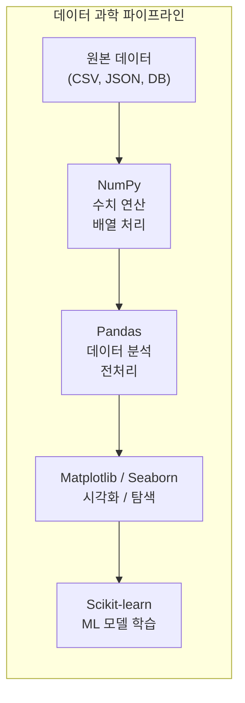
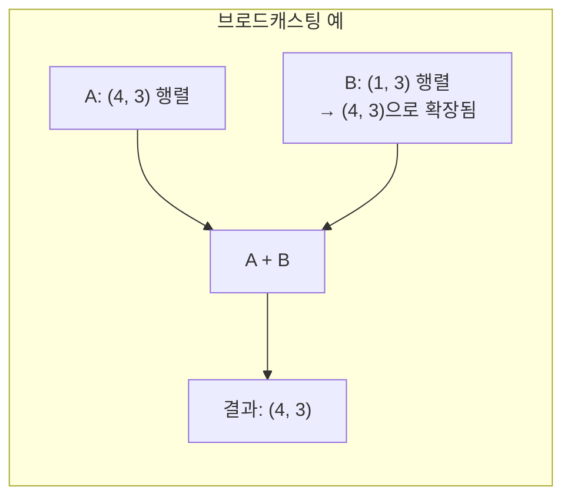
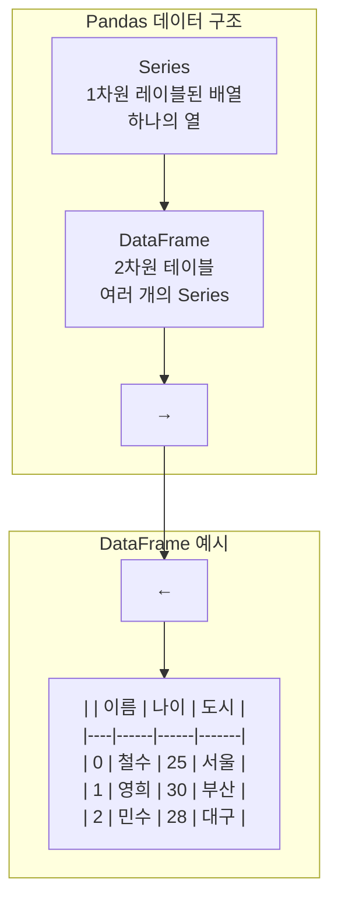
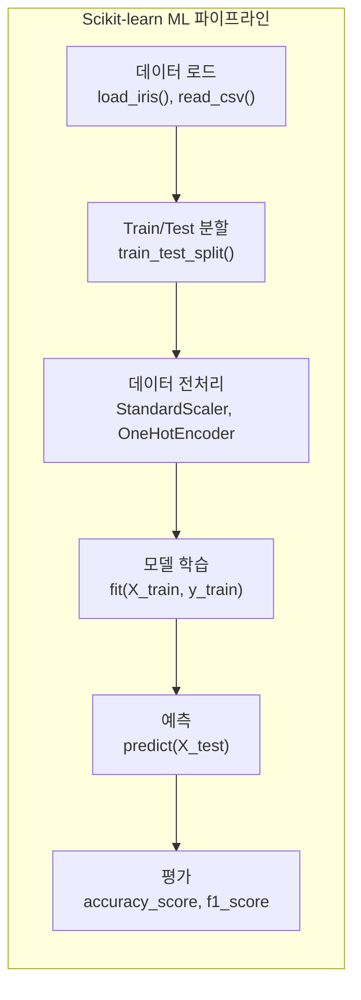

# 04장: AI 프로그래밍을 위한 Python 데이터 과학

> **🎯 학습 목표**
> - NumPy로 배열 연산과 선형대수를 자유롭게 다룰 수 있습니다.
> - Pandas로 CSV 데이터를 불러오고, 탐색하고, 전처리할 수 있습니다.
> - Matplotlib과 Seaborn으로 데이터를 시각화할 수 있습니다.
> - Scikit-learn으로 기본적인 ML 파이프라인을 구성할 수 있습니다.

---

## 👨‍💻 실전 프로젝트: 데이터로 첫 머신러닝 경험하기

본격적인 학습에 앞서, 먼저 실제 머신러닝 프로젝트를 경험해 보겠습니다. 이 프로젝트에서는 지금은 이해되지 않는 코드가 있더라도 전체적인 흐름을 경험하는 것에 집중하시기 바랍니다. 이 장을 모두 학습한 후에는 이 코드의 모든 줄이 완벽하게 이해될 것입니다. 데이터 과학의 진정한 재미는 실제 데이터를 다루고 의미 있는 인사이트를 도출하는 과정에 있기 때문입니다.

이 프로젝트에서는 Scikit-learn에 내장된 Iris(붓꽃) 데이터셋을 사용합니다. Iris 데이터셋은 꽃받침(sepal)과 꽃잎(petal)의 길이 및 너비라는 4가지 특성을 바탕으로 3가지 붓꽃 품종을 분류하는 고전적인 머신러닝 데이터셋입니다. 총 150개의 샘플로 구성되어 있으며 각 품종별로 50개씩의 균일한 분포를 가지고 있어, 초보자가 분류 알고리즘의 작동 방식을 직관적으로 이해하기에 가장 적합한 데이터셋 중 하나로 꼽힙니다.

```python
# 1. 필요한 라이브러리 임포트
import numpy as np
import pandas as pd
import matplotlib.pyplot as plt
import seaborn as sns
from sklearn.datasets import load_iris
from sklearn.model_selection import train_test_split
from sklearn.preprocessing import StandardScaler
from sklearn.neighbors import KNeighborsClassifier
from sklearn.metrics import accuracy_score, confusion_matrix, classification_report

# 2. 데이터 로드
iris = load_iris()
df = pd.DataFrame(iris.data, columns=iris.feature_names)
df['target'] = iris.target
df['species'] = iris.target_names[iris.target]

print("=== 데이터 미리보기 ===")
print(df.head(10))
```

첫 번째 코드 블록에서는 데이터 분석과 머신러닝에 필요한 모든 라이브러리를 임포트합니다. `numpy`는 수치 연산을, `pandas`는 데이터 프레임 처리를, `matplotlib`과 `seaborn`은 시각화를, `sklearn`의 각 모듈은 데이터 분할, 전처리, 모델 학습 및 평가를 각각 담당합니다. `load_iris()` 함수를 호출하여 Iris 데이터셋을 메모리에 로드한 후, 특성 데이터와 타깃 레이블을 하나의 DataFrame으로 통합합니다. `head(10)` 메서드는 상위 10개의 행을 출력하여 데이터의 구조와 값을 직관적으로 확인할 수 있게 해 줍니다.

```python
# 3. 데이터 탐색 (Exploratory Data Analysis)
print("\n=== 데이터 정보 ===")
print(f"데이터 shape: {df.shape}")
print(f"열 이름: {df.columns.tolist()}")
print(f"\n각 특성의 기술 통계:\n{df.describe()}")
print(f"\n클래스 분포:\n{df['species'].value_counts()}")
```

데이터 탐색 단계에서는 `shape` 속성으로 데이터의 행과 열 개수를 확인합니다. `describe()` 메서드는 각 수치형 열의 평균, 표준편차, 최소값, 사분위수, 최대값을 한 번에 계산하여 데이터의 전반적인 분포를 파악할 수 있게 합니다. `value_counts()` 메서드는 타깃 클래스별 샘플 개수를 출력하여 클래스 불균형 여부를 즉시 확인할 수 있습니다.

```python
# 4. 시각화를 통한 패턴 파악
sns.pairplot(df, hue='species', vars=iris.feature_names)
plt.suptitle("Iris 데이터셋 - 특성 간 관계", y=1.02)
plt.show()
```

`seaborn`의 `pairplot()` 함수는 모든 특성 쌍의 조합에 대한 산점도를 한 번에 그려줍니다. `hue='species'` 파라미터는 품종별로 데이터 포인트를 색상으로 구분하여 표시하므로, 어떤 특성 조합이 품종 분류에 가장 효과적인지 육안으로 확인할 수 있습니다. 특히 꽃잎 길이와 꽃잎 너비의 조합은 Setosa 품종을 다른 두 품종과 완벽하게 구분해 주는 것을 관찰할 수 있습니다.

```python
# 5. Train/Test 분할 및 데이터 표준화
X = iris.data
y = iris.target

X_train, X_test, y_train, y_test = train_test_split(
    X, y, test_size=0.2, random_state=42, stratify=y
)

scaler = StandardScaler()
X_train_scaled = scaler.fit_transform(X_train)
X_test_scaled = scaler.transform(X_test)

print(f"\nTrain set 크기: {X_train.shape[0]}개 샘플")
print(f"Test set 크기: {X_test.shape[0]}개 샘플")
```

`train_test_split()` 함수는 데이터를 학습용과 평가용으로 분할합니다. `test_size=0.2`는 전체의 20%를 테스트 세트로 사용한다는 의미이며, `stratify=y`는 각 클래스의 비율이 학습 세트와 테스트 세트에서 동일하게 유지되도록 계층적 샘플링을 수행합니다. `StandardScaler`는 각 특성의 평균을 0, 표준편차를 1로 변환하는 표준화를 수행하며, `fit_transform()`은 학습 데이터의 평균과 표준편차를 계산하여 변환까지 동시에 진행하고 `transform()`은 테스트 데이터에 학습 세트와 동일한 변환 파라미터를 적용합니다.

```python
# 6. KNN 분류기 학습 및 예측
model = KNeighborsClassifier(n_neighbors=3)
model.fit(X_train_scaled, y_train)

y_pred = model.predict(X_test_scaled)
```

`KNeighborsClassifier`는 K-최근접 이웃 알고리즘으로, 새로운 데이터 포인트와 가장 가까운 K개의 학습 데이터를 참고하여 다수결로 클래스를 결정합니다. `n_neighbors=3`은 3개의 가장 가까운 이웃을 참고하도록 설정한 것이며, 이 값이 작을수록 결정 경계가 복잡해지고 클수록 단순해집니다. `fit()` 메서드로 모델을 학습시킨 후 `predict()` 메서드로 테스트 데이터에 대한 예측을 수행합니다.

```python
# 7. 모델 평가
accuracy = accuracy_score(y_test, y_pred)
print(f"\n=== 모델 평가 결과 ===")
print(f"정확도: {accuracy:.4f}")

print(f"\n혼동 행렬 (Confusion Matrix):\n{confusion_matrix(y_test, y_pred)}")

print(f"\n분류 리포트:\n{classification_report(y_test, y_pred, target_names=iris.target_names)}")
```

`accuracy_score()` 함수는 전체 예측 중 올바르게 예측한 비율을 계산합니다. `confusion_matrix()`는 실제 클래스와 예측 클래스의 교차표를 출력하여 어떤 클래스에서 오분류가 발생했는지 상세히 보여줍니다. `classification_report()`는 정밀도, 재현율, F1-스코어 등 더 정교한 평가 지표를 클래스별로 제공하며, 이 지표들은 단순 정확도보다 모델의 성능을 다각도로 이해하는 데 도움을 줍니다.

```
예상 출력 예시:
정확도: 0.9667

혼동 행렬:
[[10  0  0]
 [ 0  9  1]
 [ 0  0 10]]

분류 리포트:
              precision    recall  f1-score   support

      setosa       1.00      1.00      1.00        10
  versicolor       1.00      0.90      0.95        10
   virginica       0.91      1.00      0.95        10
```

이제 여러분은 데이터 로드부터 탐색, 시각화, 모델 학습, 평가까지의 전체 머신러닝 파이프라인을 경험하였습니다. 지금부터 이 장에서는 이 파이프라인을 구성하는 각 라이브러리와 기술들을 하나씩 상세히 학습하게 됩니다. 각 라이브러리의 역할과 사용법을 깊이 이해하면, 앞서 경험한 프로젝트의 모든 코드가 자연스럽게 이해될 것입니다.

---

## 4.1 개요

Python이 AI/ML 분야에서 가장 인기 있는 언어인 이유는 그 무엇보다도 **풍부한 데이터 과학 라이브러리** 생태계에 있습니다. 데이터 과학이란 방대한 양의 데이터에서 의미 있는 패턴과 인사이트를 추출하는 학문 분야로, 통계학, 컴퓨터 과학, 도메인 지식이 융합된 종합 학문입니다. Python은 이러한 데이터 과학의 전 과정을 하나의 언어로 처리할 수 있는 유일한 생태계를 제공합니다.

이 장에서는 AI 프로그래밍의 약 80%를 차지하는 데이터 전처리와 분석을 위한 핵심 라이브러리를 체계적으로 학습합니다. 구체적으로는 수치 연산의 기초가 되는 NumPy, 표 형태의 데이터를 다루는 Pandas, 데이터 시각화를 위한 Matplotlib과 Seaborn, 그리고 머신러닝 모델을 구축하는 Scikit-learn까지를 다룹니다. 각 라이브러리는 독립적으로도 강력하지만, 서로 유기적으로 연결되어 하나의 완결된 데이터 과학 파이프라인을 구성합니다.



위 다이어그램은 데이터 과학 파이프라인의 전체 흐름을 한 눈에 보여줍니다. 원본 데이터가 NumPy의 수치 연산을 거쳐 Pandas에서 정리되고, 시각화 도구를 통해 패턴이 발견되며, 최종적으로 Scikit-learn에서 머신러닝 모델이 학습되는 구조입니다. 이 파이프라인의 각 단계는 독립적인 동시에 유기적으로 연결되어 있어, 하나의 단계가 완료되어야 다음 단계로 진행될 수 있습니다.

---

## 4.2 NumPy — 수치 연산의 기초

NumPy(Numerical Python)는 Python의 **수치 연산 핵심 라이브러리**로서, 대규모 다차원 배열과 행렬 연산을 위한 고성능 기능을 제공합니다. Python의 기본 리스트보다 훨씬 빠르고 메모리 효율적인 연산이 가능하며, 모든 AI/ML 라이브러리가 NumPy 배열을 기반으로 동작합니다. 이는 NumPy의 내부가 C 언어로 구현되어 있어 Python의 인터프리터 오버헤드 없이 저수준에서 고속 연산이 수행되기 때문입니다.

### 4.2.1 배열 생성

NumPy 배열을 생성하는 가장 기본적인 방법은 `np.array()` 함수에 Python 리스트를 전달하는 것입니다. 1차원 리스트를 전달하면 1차원 배열이, 중첩 리스트를 전달하면 다차원 배열이 생성됩니다. 배열의 `shape` 속성은 각 차원의 크기를 튜플로 반환하며, `ndim` 속성은 배열의 차원 수를 알려줍니다.

```python
import numpy as np

# 1차원 배열
arr1 = np.array([1, 2, 3, 4, 5])
print(f"1차원 배열: {arr1}, shape: {arr1.shape}")

# 2차원 배열
arr2 = np.array([[1, 2, 3], [4, 5, 6]])
print(f"2차원 배열:\n{arr2}")
print(f"shape: {arr2.shape}, 차원: {arr2.ndim}")

# 특수 배열 생성
zeros = np.zeros((2, 3))        # 모든 원소가 0
ones = np.ones((3, 2))          # 모든 원소가 1
eye = np.eye(3)                 # 단위 행렬 (대각선이 1)
random = np.random.randn(2, 4)  # 정규 분포 난수
lin = np.linspace(0, 1, 5)      # 0부터 1까지 5개로 균등 분할

print(f"\n영행렬:\n{zeros}")
print(f"단위 행렬:\n{eye}")
print(f"linspace(0, 1, 5): {lin}")
```

`np.zeros()`는 모든 원소가 0인 행렬을, `np.ones()`는 모든 원소가 1인 행렬을 생성합니다. `np.eye()`는 대각선 원소가 1이고 나머지는 0인 단위 행렬을 만들며, 이는 선형대수에서 항등 행렬로 사용됩니다. `np.random.randn()`은 평균 0, 표준편차 1의 정규 분포를 따르는 난수를 생성하고, `np.linspace()`는 시작점과 끝점 사이를 균등한 간격으로 분할한 값을 반환합니다. 위 코드를 실행하면 `arr1`의 shape은 `(5,)`로, `arr2`의 shape은 `(3,)`가 아닌 `(2, 3)`으로 출력되어 2차원 배열임을 확인할 수 있습니다.

### 4.2.2 배열 인덱싱과 슬라이싱

NumPy 배열의 인덱싱과 슬라이싱은 Python 리스트와 유사하지만, 다차원으로 확장된 강력한 기능을 제공합니다. 정수 인덱스를 사용하여 특정 위치의 원소에 접근하거나, 슬라이싱 문법을 사용하여 부분 배열을 추출할 수 있습니다. 특히 콜론(`:`)을 사용한 슬라이싱은 모든 차원에 걸쳐 적용할 수 있어 매우 유연합니다.

```python
import numpy as np

arr = np.array([[1, 2, 3, 4],
                [5, 6, 7, 8],
                [9, 10, 11, 12]])

print(f"전체 배열:\n{arr}")

# 인덱싱
print(f"arr[0]: {arr[0]}")           # 첫 번째 행
print(f"arr[1, 2]: {arr[1, 2]}")     # 2행 3열 (7)
print(f"arr[-1]: {arr[-1]}")         # 마지막 행

# 슬라이싱
print(f"arr[:, 1]: {arr[:, 1]}")     # 모든 행의 2번째 열
print(f"arr[1:, :2]:\n{arr[1:, :2]}")  # 2행부터, 처음 2열
print(f"arr[0:2, 1:3]:\n{arr[0:2, 1:3]}")  # 1-2행, 2-3열

# 조건부 인덱싱
print(f"7보다 큰 원소: {arr[arr > 7]}")
```

`arr[0]`은 첫 번째 행 전체를 1차원 배열로 반환합니다. `arr[1, 2]`는 2행 3열의 단일 원소값 7을 반환하는데, 이 때 행 인덱스가 0부터 시작함에 유의해야 합니다. `arr[:, 1]`에서 콜론은 "모든 행"을 의미하므로, 모든 행의 두 번째 열만 추출하여 1차원 배열로 만듭니다. 조건부 인덱싱 `arr[arr > 7]`은 7보다 큰 원소만을 골라 1차원 배열로 반환하며, 이는 데이터 필터링에 매우 유용하게 사용됩니다.

### 4.2.3 브로드캐스팅 (Broadcasting)

브로드캐스팅은 **서로 다른 shape의 배열 간 연산**을 가능하게 하는 NumPy의 가장 강력한 기능 중 하나입니다. 작은 배열이 큰 배열의 shape에 맞게 자동으로 확장되어 연산이 수행되므로, 명시적인 반복문 없이도 효율적인 벡터 연산이 가능합니다. 브로드캐스팅은 메모리 복사 없이 내부적으로 스트라이드만 조정하여 수행되므로 성능 저하가 없습니다.



```python
import numpy as np

# 브로드캐스팅 예
A = np.array([[1, 2, 3],
              [4, 5, 6],
              [7, 8, 9],
              [10, 11, 12]])

B = np.array([1, 2, 3])  # (3,) → (4,3)으로 자동 확장

C = A + B
print(f"A + B:\n{C}")
# [[ 2  4  6]
#  [ 5  7  9]
#  [ 8 10 12]
#  [11 13 15]]

# 스칼라도 브로드캐스팅됨
print(f"A * 10:\n{A * 10}")

# 각 열의 평균으로 정규화
column_means = A.mean(axis=0)  # 각 열의 평균
A_normalized = A - column_means
print(f"열 평균: {column_means}")
print(f"정규화된 A:\n{A_normalized}")
```

위 예제에서 행렬 `A`의 shape은 `(4, 3)`이고 배열 `B`의 shape은 `(3,)`입니다. NumPy는 `B`를 자동으로 `(4, 3)`으로 확장하여 각 행에 `B`의 값을 더합니다. 스칼라 `10` 역시 `A`의 shape에 맞게 브로드캐스팅되어 모든 원소에 10이 곱해집니다. `A.mean(axis=0)`은 각 열의 평균을 계산하여 `(3,)` shape의 배열을 반환하며, 이를 원본에서 빼는 것만으로 열 중심화 정규화가 즉시 수행됩니다. `axis=0`은 열 방향, `axis=1`은 행 방향 연산을 의미합니다.

### 4.2.4 주요 연산

NumPy는 요소별 연산과 행렬 연산을 모두 지원합니다. 요소별 곱셈(`*`)은 같은 위치의 원소끼리 곱하는 반면, 행렬 곱셈(`@`)은 선형대수에서 정의된 행렬 곱셈 규칙을 따릅니다. 또한 다양한 통계 함수를 내장하고 있어 기술 통계량을 손쉽게 계산할 수 있습니다.

```python
import numpy as np

A = np.array([[1, 2], [3, 4]])
B = np.array([[5, 6], [7, 8]])

# 기본 연산
print(f"A + B:\n{A + B}")
print(f"A * B (요소별 곱):\n{A * B}")
print(f"A @ B (행렬 곱):\n{A @ B}")       # Python 3.5+
print(f"np.dot(A, B):\n{np.dot(A, B)}")   # 같은 결과

# 통계 함수
data = np.array([1, 2, 3, 4, 5, 6, 7, 8, 9, 10])
print(f"합계: {np.sum(data)}")
print(f"평균: {np.mean(data)}")
print(f"중앙값: {np.median(data)}")
print(f"표준편차: {np.std(data)}")
print(f"최대값: {np.max(data)}, 최소값: {np.min(data)}")
print(f"분위수 (25%, 50%, 75%): {np.percentile(data, [25, 50, 75])}")

# 2차원 통계
M = np.array([[1, 2, 3], [4, 5, 6], [7, 8, 9]])
print(f"행 방향 합 (axis=0): {M.sum(axis=0)}")  # [12 15 18]
print(f"열 방향 합 (axis=1): {M.sum(axis=1)}")  # [6 15 24]
```

`A + B`는 요소별 덧셈을, `A * B`는 요소별 곱셈을 수행합니다. 반면 `A @ B`는 행렬 곱셈을 수행하는데, `A`의 열 수와 `B`의 행 수가 일치해야 하며 결과는 `(2, 2)` 행렬이 됩니다. `np.dot(A, B)`는 `@` 연산자와 동일한 결과를 반환합니다. 통계 함수 중 `np.percentile()`은 데이터의 분위수를 계산하여 이상치 탐지나 데이터 분포 파악에 활용됩니다. 2차원 통계에서 `axis=0`은 각 열에 대한 연산(수직 방향)을, `axis=1`은 각 행에 대한 연산(수평 방향)을 의미합니다.

### 4.2.5 AI에서의 NumPy 활용 예

NumPy는 머신러닝 파이프라인의 거의 모든 단계에서 사용됩니다. 데이터 정규화와 표준화는 모델 학습 전 필수적인 전처리 단계이며, 학습 데이터와 테스트 데이터를 무작위로 분할하는 과정도 NumPy로 간단히 구현할 수 있습니다. 원-핫 인코딩은 범주형 데이터를 신경망이 처리할 수 있는 형태로 변환하는 데 사용되는 중요한 기법입니다.

```python
import numpy as np

# 1. 데이터 정규화 (Normalization)
data = np.array([100, 200, 300, 400, 500])
normalized = (data - data.min()) / (data.max() - data.min())
print(f"정규화된 데이터: {normalized}")  # [0. 0.25 0.5 0.75 1.]

# 2. 표준화 (Standardization)
standardized = (data - data.mean()) / data.std()
print(f"표준화된 데이터: {standardized}")

# 3. Train/Test 분할
indices = np.random.permutation(len(data))  # 인덱스 섞기
split = int(0.8 * len(data))
train_idx, test_idx = indices[:split], indices[split:]
print(f"Train 인덱스: {train_idx}")
print(f"Test 인덱스: {test_idx}")

# 4. 원-핫 인코딩 (One-Hot Encoding)
labels = np.array([0, 2, 1, 0, 2])  # 3개 클래스
one_hot = np.zeros((len(labels), 3))
one_hot[np.arange(len(labels)), labels] = 1
print(f"원-핫 인코딩:\n{one_hot}")
```

정규화는 데이터를 0과 1 사이로 변환하고, 표준화는 평균을 0, 표준편차를 1로 만듭니다. `np.random.permutation()`은 인덱스를 무작위로 섞은 후, 80% 지점에서 분할하여 학습용과 테스트용 인덱스를 생성합니다. 원-핫 인코딩에서는 먼저 `np.zeros()`로 모든 원소가 0인 행렬을 만든 후, `np.arange()`로 생성한 행 인덱스와 `labels` 배열의 열 인덱스를 사용하여 해당 위치만 1로 설정합니다. 예를 들어 레이블 `[0, 2, 1, 0, 2]`는 각각 첫 번째, 세 번째, 두 번째, 첫 번째, 세 번째 열이 1이 되는 5×3 행렬로 변환됩니다.

---

## 4.3 Pandas — 데이터 분석의 표준

Pandas는 **표 형태의 데이터**를 다루는 Python의 대표적인 데이터 분석 라이브러리입니다. CSV, Excel, SQL 데이터베이스, JSON, HTML 등 다양한 데이터 소스로부터 데이터를 불러올 수 있어 실무에서 가장 널리 활용됩니다. Pandas의 가장 큰 장점은 직관적인 API를 통해 데이터 탐색, 필터링, 그룹화, 결측치 처리 등의 복잡한 작업을 단 몇 줄의 코드로 처리할 수 있다는 점입니다.

### 4.3.1 Series와 DataFrame

Pandas는 두 가지 핵심 데이터 구조를 제공합니다. **Series**는 1차원 레이블된 배열로, 하나의 열을 표현하며 각 원소는 인덱스를 통해 접근할 수 있습니다. **DataFrame**은 2차원 테이블 구조로, 여러 개의 Series가 열 방향으로 결합된 형태이며 엑셀 스프레드시트나 SQL 테이블과 유사합니다.



```python
import pandas as pd
import numpy as np

# Series
s = pd.Series([10, 20, 30, 40], index=['a', 'b', 'c', 'd'])
print(f"Series:\n{s}\n")

# DataFrame - 여러 방식으로 생성
# 1) 딕셔너리로 생성
df = pd.DataFrame({
    '이름': ['철수', '영희', '민수', '지현'],
    '나이': [25, 30, 28, 22],
    '도시': ['서울', '부산', '대구', '광주'],
    '점수': [85, 92, 78, 95]
})
print(f"DataFrame:\n{df}\n")

# 2) CSV 파일에서 불러오기 (가상)
# df = pd.read_csv('data.csv')
```

`pd.Series()`는 값 리스트와 인덱스 리스트를 받아 레이블된 1차원 배열을 생성합니다. 인덱스를 별도로 지정하지 않으면 0부터 시작하는 정수 인덱스가 자동으로 부여됩니다. `pd.DataFrame()`에 딕셔너리를 전달하면, 딕셔너리의 키가 열 이름이 되고 값 리스트가 각 열의 데이터가 됩니다. 실제 분석에서는 `pd.read_csv('파일경로.csv')`를 사용하여 CSV 파일을 직접 DataFrame으로 로드하는 것이 일반적입니다.

### 4.3.2 데이터 탐색

데이터 분석의 첫 단계는 데이터를 이해하는 것입니다. Pandas는 데이터의 구조와 내용을 빠르게 파악할 수 있는 다양한 탐색 메서드를 제공합니다. 이러한 탐색 과정을 EDA(Exploratory Data Analysis, 탐색적 데이터 분석)라고 하며, 데이터의 전반적인 특성과 패턴, 이상치 여부를 파악하는 것이 목적입니다.

```python
import pandas as pd
import numpy as np

# 샘플 데이터 생성
np.random.seed(42)
df = pd.DataFrame({
    'A': np.random.randn(100),
    'B': np.random.randn(100) * 2 + 1,
    'C': np.random.choice(['X', 'Y', 'Z'], 100),
    'D': np.random.randint(1, 100, 100)
})

# 기본 정보 확인
print(f"처음 5행:\n{df.head()}\n")
print(f"데이터 정보:")
df.info()  # 각 열의 타입, null 개수
print()

print(f"기술 통계:\n{df.describe()}\n")  # 수치형 열의 통계 요약

# 주요 탐색 메서드
print(f"shape: {df.shape}")  # (100, 4)
print(f"열 이름: {df.columns.tolist()}")
print(f"고유값 개수:\n{df.nunique()}")
print(f"결측치 개수:\n{df.isnull().sum()}")
```

`np.random.seed(42)`는 난수 생성 시드를 고정하여 실행할 때마다 동일한 결과가 나오도록 보장합니다. `head()`는 기본적으로 상위 5행을 출력하며, 괄호 안에 숫자를 넣어 출력할 행의 개수를 조정할 수 있습니다. `info()`는 각 열의 데이터 타입과 null이 아닌 값의 개수를 출력하여 결측치 존재 여부를 한 눈에 파악할 수 있게 합니다. `describe()`는 수치형 열에 대해 평균, 표준편차, 최소값, 4분위수, 최대값을 계산하며, 이를 통해 데이터의 분포와 이상치 가능성을 빠르게 평가할 수 있습니다.

### 4.3.3 데이터 선택과 필터링

DataFrame에서 특정 데이터를 선택하고 필터링하는 것은 데이터 분석의 가장 기본적인 작업입니다. Pandas는 열 선택, 행 선택, 조건부 필터링 등 다양한 방식으로 데이터에 접근할 수 있는 메서드를 제공합니다. `iloc`는 정수 인덱스를 기반으로 하고, `loc`는 레이블 인덱스를 기반으로 하여 데이터에 접근합니다.

```python
import pandas as pd

df = pd.DataFrame({
    '이름': ['철수', '영희', '민수', '지현', '수진'],
    '나이': [25, 30, 28, 22, 35],
    '도시': ['서울', '부산', '대구', '광주', '서울'],
    '점수': [85, 92, 78, 95, 88],
    '합격': [True, True, False, True, True]
})

# 열 선택
print(f"하나의 열:\n{df['이름']}\n")
print(f"여러 열:\n{df[['이름', '점수']]}\n")

# 행 선택 (iloc = 정수 인덱스, loc = 레이블 인덱스)
print(f"첫 3행 (iloc):\n{df.iloc[:3]}\n")
print(f"인덱스 2부터:\n{df.loc[2:]}\n")

# 조건 필터링
print(f"점수 90점 이상:\n{df[df['점수'] >= 90]}\n")
print(f"서울 거주자:\n{df[df['도시'] == '서울']}\n")
print(f"서울 거주자 중 30세 이상:\n{df[(df['도시'] == '서울') & (df['나이'] >= 30)]}\n")

# query 메서드 (더 간결)
print(f"query 사용:\n{df.query('점수 >= 90 and 도시 == "서울"')}\n")
```

`df['이름']`은 '이름' 열 하나를 Series 형태로 반환합니다. `df[['이름', '점수']]`는 대괄호를 두 번 사용하여 여러 열을 DataFrame 형태로 선택합니다. `df.iloc[:3]`은 정수 위치 기준으로 0행부터 2행까지를 선택하고, `df.loc[2:]`는 인덱스 레이블 기준으로 2번 인덱스부터 끝까지를 선택합니다. 조건 필터링 `df[df['점수'] >= 90]`은 내부에 불리언 Series를 생성하여 True인 행만 추출하는 방식으로 동작합니다. 여러 조건을 결합할 때는 `&`(AND)와 `|`(OR) 연산자를 사용하며, 각 조건을 괄호로 감싸야 합니다. `query()` 메서드는 SQL 스타일의 문자열로 더 간결하게 조건을 표현할 수 있습니다.

### 4.3.4 데이터 전처리

실제 데이터는 항상 깔끔하지 않습니다. 센서 오류, 입력 누락, 데이터 수집 과정의 문제 등으로 결측치(missing value)가 발생하거나, 측정 오류로 인한 이상치(outlier)가 포함되기도 합니다. 이러한 문제를 해결하지 않고 머신러닝 모델에 데이터를 주입하면 왜곡된 결과를 얻을 수 있으므로, 데이터 전처리는 모델 성능에 직접적인 영향을 미치는 매우 중요한 단계입니다.

```python
import pandas as pd
import numpy as np

# 결측치가 있는 데이터
df = pd.DataFrame({
    'A': [1, 2, np.nan, 4, 5],
    'B': [np.nan, 2, 3, np.nan, 5],
    'C': ['a', 'b', 'c', 'd', 'e']
})

print(f"원본:\n{df}\n")

# 결측치 처리
print(f"결측치 여부:\n{df.isnull()}\n")
print(f"열별 결측치 개수:\n{df.isnull().sum()}\n")

# 방법 1: 결측치 제거
print(f"결측치가 있는 행 제거:\n{df.dropna()}\n")

# 방법 2: 결측치 채우기
print(f"0으로 채우기:\n{df.fillna(0)}\n")
print(f"평균으로 채우기:\n{df.fillna(df.mean())}\n")
print(f"앞 값으로 채우기:\n{df.fillna(method='ffill')}\n")  # forward fill

# 방법 3: 특정 열만 채우기
df['A'] = df['A'].fillna(df['A'].mean())
df['B'] = df['B'].fillna(df['B'].median())
print(f"열별 다른 방법:\n{df}\n")
```

`np.nan`(Not a Number)은 Python에서 결측치를 나타내는 표준 값입니다. `isnull()`은 각 원소가 결측치인지 여부를 불리언으로 반환하고, `sum()`을 함께 사용하면 열별 결측치 개수를 쉽게 파악할 수 있습니다. 결측치 처리는 크게 제거(`dropna()`)와 대체(`fillna()`)로 나뉘며, 데이터가 충분히 많을 때는 제거가 간단한 해결책이 될 수 있습니다. 대체 방법으로는 0으로 채우기, 평균이나 중앙값으로 채우기, 앞이나 뒤의 값으로 채우기(시계열 데이터에 주로 사용) 등이 있으며, 각 열의 특성에 따라 적절한 방법을 선택해야 합니다.

#### 데이터 변환

데이터 변환은 원시 데이터를 분석에 적합한 형태로 가공하는 과정입니다. 날짜 문자열을 datetime 객체로 변환하거나, 범주형 데이터를 원-핫 인코딩으로 변환하고, 기존 열을 조합하여 새로운 파생 변수를 생성하는 작업 등이 포함됩니다. 그룹화와 집계는 데이터를 특정 기준으로 묶어 요약 통계를 계산하는 강력한 기능입니다.

```python
import pandas as pd

df = pd.DataFrame({
    '이름': ['철수', '영희', '민수'],
    '부서': ['개발', '마케팅', '개발'],
    '급여': [5000, 4500, 5200],
    '입사일': ['2020-01-15', '2019-03-20', '2021-07-01']
})

# 열 타입 변환
df['입사일'] = pd.to_datetime(df['입사일'])
print(f"데이터 타입:\n{df.dtypes}\n")

# 범주형 변환 (One-Hot Encoding)
df_encoded = pd.get_dummies(df, columns=['부서'])
print(f"원-핫 인코딩:\n{df_encoded}\n")

# 새로운 열 생성
df['보너스'] = df['급여'] * 0.1
df['연봉'] = df['급여'] * 12 + df['보너스']
print(f"파생 열:\n{df[['이름', '급여', '보너스', '연봉']]}\n")

# 그룹화와 집계
df2 = pd.DataFrame({
    '부서': ['개발', '마케팅', '개발', '마케팅', '개발'],
    '급여': [5000, 4500, 5200, 4800, 5100],
    '성과': [85, 90, 78, 92, 88]
})
print(f"부서별 평균:\n{df2.groupby('부서')[['급여', '성과']].mean()}\n")
```

`pd.to_datetime()`은 문자열을 Pandas의 datetime 타입으로 변환하여 날짜 기반 연산을 가능하게 합니다. `get_dummies()`는 범주형 열을 이진 특성으로 분리하는 원-핫 인코딩을 수행하는데, 예를 들어 '부서' 열의 값이 '개발'과 '마케팅' 두 가지라면 '부서_개발', '부서_마케팅'이라는 두 개의 새로운 열이 생성됩니다. 파생 열 생성은 단순한 산술 연산으로 새로운 정보를 만들어내는 과정이며, `groupby()`는 특정 열을 기준으로 데이터를 그룹화한 후 `mean()`, `sum()`, `count()` 등의 집계 함수를 적용하여 그룹별 요약 통계를 계산합니다.

### 4.3.5 실전 데이터 분석 예제

지금까지 배운 Pandas의 기능을 종합하여 실제 데이터 분석 시나리오를 경험해 보겠습니다. 주택 데이터를 예시로, 데이터 로드부터 전처리, 이상치 탐지, 범주형 인코딩, 상관관계 분석까지의 전체 과정을 살펴봅니다.

```python
import pandas as pd
import numpy as np

# 가상의 주택 데이터
np.random.seed(42)
n = 200

df = pd.DataFrame({
    'area': np.random.randint(20, 200, n),        # 평수
    'rooms': np.random.randint(1, 6, n),           # 방 개수
    'year': np.random.randint(1990, 2025, n),      # 건축년도
    'floor': np.random.randint(1, 20, n),          # 층수
    'location': np.random.choice(['강남', '강북', '강서', '강동'], n),
    'price': np.random.randint(1, 15, n) * 1000    # 가격 (만원/평)
})

# 데이터 전처리
print(f"기본 정보:")
print(df.head())
print(f"\n기술 통계:\n{df.describe()}")

# 이상치 처리 (IQR 방식)
Q1 = df['price'].quantile(0.25)
Q3 = df['price'].quantile(0.75)
IQR = Q3 - Q1
outliers = df[(df['price'] < Q1 - 1.5 * IQR) | (df['price'] > Q3 + 1.5 * IQR)]
print(f"\n이상치 개수: {len(outliers)}")

# 범주형 변수 인코딩
df_encoded = pd.get_dummies(df, columns=['location'])

# 상관관계 분석
numeric_cols = ['area', 'rooms', 'year', 'floor', 'price']
print(f"\n상관 행렬:\n{df[numeric_cols].corr()}")
```

`describe()`는 각 수치형 열의 기본 통계량을 출력하여 데이터의 전반적인 분포를 파악합니다. IQR 방식은 1사분위수(Q1)와 3사분위수(Q3)의 차이를 IQR로 정의하고, Q1 - 1.5×IQR보다 작거나 Q3 + 1.5×IQR보다 큰 값을 이상치로 간주합니다. `get_dummies()`로 범주형 위치 정보를 원-핫 인코딩한 후, `corr()`로 수치형 변수 간의 상관계수를 계산합니다. 상관계수는 -1에서 1 사이의 값을 가지며, 주택 가격과 면적 간의 상관계수가 가장 높게 나타나는 것이 일반적입니다.

---

## 4.4 Matplotlib & Seaborn — 데이터 시각화

데이터 시각화는 데이터의 패턴과 관계를 직관적으로 이해하기 위한 필수 도구입니다. 숫자로 된 통계 수치만으로는 발견하기 어려운 데이터의 구조적 특성이나 이상치가 시각화를 통해 즉시 드러나는 경우가 많습니다. Python의 데이터 시각화 생태계는 Matplotlib을 기반으로 Seaborn, Plotly 등 다양한 고수준 라이브러리로 확장됩니다.

### 4.4.1 Matplotlib 기본

Matplotlib은 Python에서 가장 널리 사용되는 데이터 시각화 라이브러리로, 출판물 수준의 고품질 그래프를 생성할 수 있습니다. `pyplot` 모듈은 MATLAB과 유사한 명령형 인터페이스를 제공하여 그래프의 각 요소를 직관적으로 제어할 수 있습니다. 기본적인 그래프는 `figure`(그래프 창)를 생성하고 `plot()` 함수로 데이터를 그린 후, 레이블, 제목, 범례, 그리드 등의 요소를 추가하는 순서로 작성됩니다.

```python
import numpy as np
import matplotlib.pyplot as plt

# 한글 폰트 설정 (Windows)
# plt.rcParams['font.family'] = 'Malgun Gothic'

# 기본 그래프
x = np.linspace(0, 10, 100)
y1 = np.sin(x)
y2 = np.cos(x)

plt.figure(figsize=(10, 5))
plt.plot(x, y1, label='sin(x)', linewidth=2)
plt.plot(x, y2, label='cos(x)', linewidth=2)
plt.xlabel('x')
plt.ylabel('y')
plt.title('사인과 코사인 곡선')
plt.legend()
plt.grid(True, alpha=0.3)
plt.show()
```

`np.linspace(0, 10, 100)`은 0부터 10까지를 100개의 균등 간격으로 분할한 배열을 생성하여 부드러운 곡선을 그릴 수 있게 합니다. `plt.figure(figsize=(10, 5))`는 그래프 창의 크기를 가로 10인치, 세로 5인치로 설정합니다. `plt.plot()`의 `linewidth` 파라미터로 선의 두께를 조절하고, `grid(True, alpha=0.3)`로 투명도 30%의 그리드선을 추가하여 가독성을 높입니다. `plt.show()`를 호출해야 그래프가 실제로 화면에 출력됩니다.

### 4.4.2 여러 그래프 유형

데이터의 특성과 분석 목적에 따라 적절한 그래프 유형을 선택하는 것이 중요합니다. Matplotlib은 선 그래프, 산점도, 히스토그램, 막대 그래프, 박스 플롯, 파이 차트 등 다양한 그래프 유형을 지원하며, `subplots()`를 사용하면 여러 그래프를 하나의 그림에 배열하여 한 번에 비교할 수 있습니다.

```python
import numpy as np
import matplotlib.pyplot as plt

np.random.seed(42)
data1 = np.random.randn(1000)
data2 = np.random.randn(1000) * 2 + 1

# 서브플롯 구성
fig, axes = plt.subplots(2, 3, figsize=(15, 8))

# 1. 선 그래프
x = np.linspace(0, 10, 50)
axes[0, 0].plot(x, np.sin(x), 'b-')
axes[0, 0].set_title('선 그래프 (Line)')

# 2. 산점도 (Scatter)
x_scatter = np.random.randn(100)
y_scatter = np.random.randn(100) + x_scatter * 0.5
axes[0, 1].scatter(x_scatter, y_scatter, alpha=0.5)
axes[0, 1].set_title('산점도 (Scatter)')

# 3. 히스토그램
axes[0, 2].hist(data1, bins=30, alpha=0.5, label='data1')
axes[0, 2].hist(data2, bins=30, alpha=0.5, label='data2')
axes[0, 2].set_title('히스토그램')
axes[0, 2].legend()

# 4. 막대 그래프
categories = ['A', 'B', 'C', 'D', 'E']
values = [23, 45, 56, 78, 32]
axes[1, 0].bar(categories, values)
axes[1, 0].set_title('막대 그래프 (Bar)')

# 5. 박스 플롯
axes[1, 1].boxplot([data1, data2], labels=['data1', 'data2'])
axes[1, 1].set_title('박스 플롯 (Boxplot)')

# 6. 파이 차트
sizes = [30, 25, 20, 15, 10]
labels = ['A', 'B', 'C', 'D', 'E']
axes[1, 2].pie(sizes, labels=labels, autopct='%1.1f%%')
axes[1, 2].set_title('파이 차트')

plt.tight_layout()
plt.show()
```

`plt.subplots(2, 3, figsize=(15, 8))`는 2행 3열의 서브플롯 그리드를 생성하고, 각각의 axes 객체를 2차원 배열로 반환합니다. `axes[0, 0]`은 첫 번째 행 첫 번째 열의 그래프를 의미하며, 각 axes에 대해 독립적으로 그래프를 그리고 제목을 설정할 수 있습니다. `hist()`의 `bins=30`은 데이터를 30개의 구간으로 나누어 분포를 표시하며, `alpha=0.5`는 투명도를 50%로 설정하여 두 데이터의 분포가 겹칠 때도 모두 보이도록 합니다. `pie()`의 `autopct='%1.1f%%'`는 각 파이 조각의 비율을 소수점 첫째 자리까지 표시합니다. `tight_layout()`은 서브플롯 간의 간격을 자동으로 조정하여 레이블이 겹치지 않게 합니다.


위 다이어그램은 분석 목적에 따른 그래프 선택 가이드를 제공합니다. 예를 들어 여러 항목의 값을 단순 비교할 때는 막대 그래프가, 시간에 따른 추세를 볼 때는 선 그래프가, 데이터의 분포와 집중도를 확인할 때는 히스토그램이 적합합니다. 이상치 탐지에는 박스 플롯이 가장 효과적인데, 이는 데이터의 사분위수 범위를 벗어난 값을 시각적으로 명확히 보여주기 때문입니다.

### 4.4.3 Seaborn — 통계 시각화

Seaborn은 Matplotlib을 기반으로 하면서 **통계적 시각화**를 더 쉽고 아름답게 만들기 위해 설계된 라이브러리입니다. 복잡한 통계 그래프를 몇 줄의 코드로 생성할 수 있으며, 기본 스타일이 Matplotlib보다 세련되어 발표 자료나 보고서에 바로 사용하기 좋습니다. Seaborn은 특히 DataFrame과의 호환성이 뛰어나 Pandas와 함께 사용할 때 그 진가를 발휘합니다.

```python
import numpy as np
import pandas as pd
import seaborn as sns
import matplotlib.pyplot as plt

# 샘플 데이터 생성
np.random.seed(42)
df = pd.DataFrame({
    'x': np.random.randn(200),
    'y': np.random.randn(200) + np.random.randn(200) * 0.5,
    'category': np.random.choice(['A', 'B', 'C'], 200),
    'group': np.random.choice(['X', 'Y'], 200)
})

fig, axes = plt.subplots(2, 3, figsize=(15, 10))

# 1. 히트맵 (상관관계)
corr = df.corr()
sns.heatmap(corr, annot=True, cmap='RdBu', ax=axes[0, 0])
axes[0, 0].set_title('상관관계 히트맵')

# 2. 회귀선이 포함된 산점도
sns.regplot(x='x', y='y', data=df, ax=axes[0, 1])
axes[0, 1].set_title('회귀선 포함 산점도')

# 3. 범주별 분포 (바이올린 플롯)
sns.violinplot(x='category', y='y', data=df, ax=axes[0, 2])
axes[0, 2].set_title('범주별 분포 (Violin)')

# 4. 쌍별 관계 (PairPlot 샘플)
sns.kdeplot(x='x', y='y', data=df, ax=axes[1, 0])
axes[1, 0].set_title('KDE 등고선')

# 5. 범주별 막대 그래프
sns.barplot(x='category', y='y', hue='group', data=df, ax=axes[1, 1])
axes[1, 1].set_title('범주별 막대 그래프')

# 6. 카운트 플롯
sns.countplot(x='category', hue='group', data=df, ax=axes[1, 2])
axes[1, 2].set_title('범주별 빈도')

plt.tight_layout()
plt.show()
```

`sns.heatmap()`은 상관 행렬을 시각화할 때 가장 많이 사용되며, `annot=True`는 각 셀에 상관계수 값을 표시하고 `cmap='RdBu'`는 빨간색에서 파란색으로 이어지는 컬러맵을 적용합니다. `sns.regplot()`은 산점도에 선형 회귀선과 95% 신뢰구간을 함께 표시하여 두 변수 간의 선형 관계를 직관적으로 평가할 수 있게 합니다. `sns.violinplot()`은 바이올린 플롯으로, 박스 플롯과 KDE(커널 밀도 추정)를 결합하여 데이터의 분포 형태와 밀도를 동시에 보여줍니다. `sns.kdeplot()`은 2차원 밀도 등고선을 그려 두 변수의 결합 분포를 시각화합니다. Seaborn 그래프의 `hue` 파라미터는 데이터를 추가 범주로 구분하여 색상으로 표시함으로써, 다차원적인 관계를 한 그래프에서 파악할 수 있게 해 줍니다.

---

## 4.5 Scikit-learn — ML 첫걸음

Scikit-learn은 Python에서 **가장 널리 사용되는 머신러닝 라이브러리**로, 분류, 회귀, 군집화, 차원 축소 등 다양한 ML 알고리즘을 일관된 API로 제공합니다. 모든 추정기(estimator) 객체가 `fit()`, `predict()`, `score()` 등의 통일된 메서드를 따르므로, 알고리즘을 쉽게 교체하고 비교할 수 있습니다. Scikit-learn은 NumPy와 Pandas 위에 구축되어 있으며, 데이터 과학자와 머신러닝 엔지니어에게 사실상의 표준 도구로 자리잡고 있습니다.



위 다이어그램은 Scikit-learn의 전형적인 머신러닝 파이프라인을 보여줍니다. 데이터 로드부터 시작하여 학습용과 테스트용 데이터로 분할하고, 전처리 과정을 거친 후 모델을 학습시키고, 학습된 모델로 예측을 수행한 다음, 최종적으로 성능을 평가합니다. 이 다섯 단계는 모든 머신러닝 프로젝트의 기본적인 프레임워크를 이루며, Scikit-learn은 각 단계마다 간결하고 일관된 API를 제공합니다.

```python
from sklearn.datasets import load_iris
from sklearn.model_selection import train_test_split
from sklearn.preprocessing import StandardScaler
from sklearn.neighbors import KNeighborsClassifier
from sklearn.metrics import accuracy_score, classification_report

# 1. 데이터 로드
iris = load_iris()
X, y = iris.data, iris.target
print(f"데이터 shape: {X.shape}")  # (150, 4)
print(f"특성 이름: {iris.feature_names}")
print(f"클래스 이름: {iris.target_names}")

# 2. Train/Test 분할
X_train, X_test, y_train, y_test = train_test_split(
    X, y, test_size=0.2, random_state=42, stratify=y
)
print(f"Train: {X_train.shape}, Test: {X_test.shape}")

# 3. 데이터 표준화 (Standardization)
scaler = StandardScaler()
X_train_scaled = scaler.fit_transform(X_train)
X_test_scaled = scaler.transform(X_test)

# 4. 모델 학습
model = KNeighborsClassifier(n_neighbors=3)
model.fit(X_train_scaled, y_train)

# 5. 예측 및 평가
y_pred = model.predict(X_test_scaled)
accuracy = accuracy_score(y_test, y_pred)
print(f"\n정확도: {accuracy:.4f}")
print(f"\n분류 리포트:\n{classification_report(y_test, y_pred, target_names=iris.target_names)}")

# 6. 새로운 데이터 예측
new_flower = np.array([[5.1, 3.5, 1.4, 0.2]])  # 새 꽃 측정값
new_flower_scaled = scaler.transform(new_flower)
pred = model.predict(new_flower_scaled)
print(f"\n새 꽃 예측: {iris.target_names[pred[0]]}")
```

`load_iris()`는 Iris 데이터셋을 Bunch 객체로 반환하며, `iris.data`는 150×4 특성 행렬, `iris.target`은 150개의 정수 레이블 배열입니다. `train_test_split()`의 `stratify=y` 파라미터는 원본 데이터의 클래스 비율을 학습/테스트 세트에서도 동일하게 유지하는 계층적 샘플링을 수행하여, 특히 불균형 데이터셋에서 중요한 역할을 합니다. `StandardScaler`는 각 특성의 평균을 0, 분산을 1로 맞추는 표준화를 수행하며, `fit_transform()`은 학습 데이터로 변환 파라미터를 학습한 후 변환까지 한 번에 수행하고 테스트 데이터에는 `transform()`만 적용하여 데이터 누수를 방지합니다. `KNeighborsClassifier(n_neighbors=3)`은 가장 가까운 3개의 이웃을 참조하여 분류를 수행하며, 학습된 모델로 새로운 꽃의 측정값을 입력하면 품종을 예측할 수 있습니다. 위 코드를 실행하면 약 97% 이상의 정확도가 출력되며, classification_report를 통해 각 클래스별 정밀도와 재현율을 상세히 확인할 수 있습니다.

### Scikit-learn API 통일성

Scikit-learn의 가장 큰 장점 중 하나는 모든 머신러닝 모델이 동일한 API를 따른다는 점입니다. 로지스틱 회귀, 결정 트리, SVM, 랜덤 포레스트 등 서로 다른 알고리즘도 `fit()`으로 학습하고 `predict()`로 예측하는 동일한 인터페이스를 공유합니다. 이러한 일관성 덕분에 여러 모델을 쉽게 교체하면서 성능을 비교할 수 있으며, 새로운 알고리즘을 배우더라도 기본 사용법을 다시 익힐 필요가 없습니다.

| 단계 | 메서드 | 설명 |
|------|--------|------|
| 학습 | `model.fit(X, y)` | 모델 학습 |
| 예측 | `model.predict(X)` | 예측값 반환 |
| 확률 | `model.predict_proba(X)` | 각 클래스 확률 반환 |
| 정확도 | `model.score(X, y)` | 모델 정확도 반환 |

```python
# Scikit-learn의 일관된 API 예시
from sklearn.linear_model import LogisticRegression
from sklearn.tree import DecisionTreeClassifier
from sklearn.svm import SVC
from sklearn.ensemble import RandomForestClassifier

models = {
    "로지스틱 회귀": LogisticRegression(max_iter=1000),
    "결정 트리": DecisionTreeClassifier(),
    "SVM": SVC(),
    "랜덤 포레스트": RandomForestClassifier(),
}

for name, model in models.items():
    model.fit(X_train_scaled, y_train)
    score = model.score(X_test_scaled, y_test)
    print(f"{name}: {score:.4f}")
```

위 코드는 4가지 다른 분류 알고리즘을 동일한 API로 학습하고 평가하는 예시입니다. 각 모델을 생성한 후 동일한 `fit()`과 `score()` 메서드를 호출하므로, 코드의 구조가 완전히 동일합니다. `model.score()`는 내부적으로 `predict()`를 호출한 후 `accuracy_score()`를 계산하여 반환하는 편의 메서드입니다. 이 예제를 실행하면 랜덤 포레스트와 SVM이 일반적으로 높은 성능을 보이는 것을 확인할 수 있으며, 이러한 비교를 통해 특정 데이터셋에 가장 적합한 알고리즘을 선택할 수 있습니다. 이러한 API 통일성은 머신러닝 모델의 실험과 비교를 획기적으로 단순화하며, 이것이 Scikit-learn이 연구와 산업 현장에서 널리 채택된 중요한 이유 중 하나입니다.

---

## 4.6 전체 파이프라인 예제

지금까지 배운 NumPy, Pandas, Matplotlib, Seaborn, Scikit-learn의 모든 기능을 하나의 통합된 파이프라인으로 연결해 보겠습니다. 데이터 로드부터 탐색, 시각화, 전처리, 모델 학습, 평가까지의 전체 과정을 하나의 스크립트로 구성하면, 각 단계가 어떻게 유기적으로 연결되는지 명확히 이해할 수 있습니다. 이 예제는 실제 머신러닝 프로젝트의 축소판으로, 연습 문제를 풀기 전에 전체 흐름을 복습하는 의미로 활용할 수 있습니다.

```python
import numpy as np
import pandas as pd
import matplotlib.pyplot as plt
import seaborn as sns
from sklearn.datasets import load_iris
from sklearn.model_selection import train_test_split
from sklearn.preprocessing import StandardScaler
from sklearn.ensemble import RandomForestClassifier
from sklearn.metrics import confusion_matrix, classification_report

# 1. 데이터 로드
iris = load_iris()
df = pd.DataFrame(iris.data, columns=iris.feature_names)
df['species'] = pd.Categorical.from_codes(iris.target, iris.target_names)

# 2. 데이터 탐색 (EDA)
print("=== 데이터 탐색 ===")
print(df.head())
print(f"\n클래스 분포:\n{df['species'].value_counts()}")
print(f"\n기술 통계:\n{df.describe()}")

# 3. 시각화
fig, axes = plt.subplots(1, 2, figsize=(12, 4))
sns.scatterplot(data=df, x='sepal length (cm)', y='sepal width (cm)',
                hue='species', ax=axes[0])
axes[0].set_title('꽃받침 길이 vs 너비')
sns.scatterplot(data=df, x='petal length (cm)', y='petal width (cm)',
                hue='species', ax=axes[1])
axes[1].set_title('꽃잎 길이 vs 너비')
plt.tight_layout()
plt.show()

# 4. ML 파이프라인
X = iris.data
y = iris.target

X_train, X_test, y_train, y_test = train_test_split(
    X, y, test_size=0.2, random_state=42
)

scaler = StandardScaler()
X_train = scaler.fit_transform(X_train)
X_test = scaler.transform(X_test)

model = RandomForestClassifier(n_estimators=100, random_state=42)
model.fit(X_train, y_train)

# 5. 평가
y_pred = model.predict(X_test)
print(f"\n=== 모델 평가 ===")
print(f"정확도: {accuracy_score(y_test, y_pred):.4f}")
print(f"\n혼동 행렬:\n{confusion_matrix(y_test, y_pred)}")
print(f"\n분류 리포트:\n{classification_report(y_test, y_pred, target_names=iris.target_names)}")

# 6. 특성 중요도
feature_importance = pd.DataFrame({
    'feature': iris.feature_names,
    'importance': model.feature_importances_
}).sort_values('importance', ascending=False)
print(f"\n=== 특성 중요도 ===")
print(feature_importance)
```

데이터 탐색 단계에서는 `head()`로 데이터의 구조를 확인하고, `value_counts()`로 클래스 분포의 균형을 검사하며, `describe()`로 수치형 특성의 통계적 분포를 파악합니다. 시각화 단계에서는 Seaborn의 `scatterplot()`을 사용하여 꽃받침과 꽃잎의 길이-너비 관계를 품종별로 색상 구분하여 표시함으로써, 어떤 특성 조합이 분류에 효과적인지 직관적으로 확인할 수 있습니다.

ML 파이프라인에서는 랜덤 포레스트 분류기를 사용하며, `n_estimators=100`은 100개의 결정 트리를 앙상블하여 더 안정적이고 정확한 예측을 수행하도록 설정합니다. 평가 단계에서는 혼동 행렬을 통해 실제로는 Versicolor이지만 Virginica로 오분류된 케이스가 있는지 등을 상세히 진단할 수 있습니다. 특성 중요도 분석은 랜덤 포레스트 모델의 `feature_importances_` 속성을 활용하여 어떤 특성이 분류에 가장 큰 기여를 했는지 수치로 보여주며, 이는 모델의 해석 가능성을 높이는 중요한 정보입니다.

---

## 📋 한눈에 정리

| 라이브러리 | 주요 기능 | 핵심 데이터 구조 | 핵심 메서드 |
|-----------|----------|-----------------|-----------|
| **NumPy** | 수치 연산, 배열 처리 | `ndarray` | `np.array()`, `.reshape()`, `.mean()`, `@` |
| **Pandas** | 데이터 분석, 전처리 | `DataFrame`, `Series` | `read_csv()`, `.info()`, `.groupby()`, `.fillna()` |
| **Matplotlib** | 기본 시각화 | Figure, Axes | `plt.plot()`, `plt.scatter()`, `plt.hist()` |
| **Seaborn** | 통계 시각화 | - | `sns.heatmap()`, `sns.boxplot()`, `sns.pairplot()` |
| **Scikit-learn** | 머신러닝 | - | `.fit()`, `.predict()`, `.score()`, `train_test_split()` |

---

## ✏️ 연습 문제

1. NumPy로 5×5 행렬을 만들고, 모든 원소의 합, 평균, 표준편차를 계산하세요. 그런 다음 각 열의 평균을 0으로 만드는 정규화를 수행하세요.

2. 다음 데이터를 Pandas DataFrame으로 만들고 분석하세요:
   ```
   이름, 나이, 성별, 점수
   철수, 25, 남, 85
   영희, 30, 여, 92
   민수, 28, 남, 78
   지현, 22, 여, 95
   수진, 35, 여, 88
   ```
   - 성별별 평균 점수는?
   - 30세 이상의 평균 점수는?
   - 점수가 90점 이상인 사람만 출력하세요.

3. Matplotlib으로 `y = x²` 그래프를 그리고, `y = 2x + 3` 그래프를 같은 그래프에 겹쳐서 그리세요. 범례와 제목을 추가하세요.

4. Scikit-learn의 `load_digits()` 데이터셋을 사용하여 손글씨 숫자를 분류하는 모델을 만드세요:
   - 데이터를 train/test로 분할 (test_size=0.2)
   - SVM 또는 랜덤 포레스트 사용
   - 정확도 출력

5. 여러분이 수집한 CSV 데이터가 있다고 가정하고, Pandas로 불러와서 결측치를 확인하고 처리하는 코드를 작성하세요. (가상 데이터 사용 가능)

---

## 📝 연습 문제 정답

<details>
<summary>정답 보기</summary>

**1. 5×5 행렬 생성, 통계, 정규화**
```python
import numpy as np
M = np.random.randn(5, 5)
print(f"합계: {M.sum():.3f}")
print(f"평균: {M.mean():.3f}")
print(f"표준편차: {M.std():.3f}")
# 각 열의 평균을 0으로 (열 중심화)
M_centered = M - M.mean(axis=0)
print(f"중심화 후 열 평균: {M_centered.mean(axis=0).round(10)}")  # 모두 0
```

**2. Pandas 데이터 분석**
```python
import pandas as pd
df = pd.DataFrame({
    '이름': ['철수','영희','민수','지현','수진'],
    '나이': [25,30,28,22,35],
    '성별': ['남','여','남','여','여'],
    '점수': [85,92,78,95,88]
})
print(f"성별 평균 점수:\n{df.groupby('성별')['점수'].mean()}")
# 여: 91.67, 남: 81.5
print(f"30세 이상 평균: {df[df['나이']>=30]['점수'].mean()}")  # 90.0
print(f"90점 이상:\n{df[df['점수']>=90][['이름','점수']]}")
```

**3. Matplotlib 그래프**
```python
import numpy as np, matplotlib.pyplot as plt
x = np.linspace(-5, 5, 100)
plt.plot(x, x**2, label='y=x²')
plt.plot(x, 2*x+3, label='y=2x+3')
plt.legend(); plt.title('그래프'); plt.grid(True); plt.show()
```

**4. 손글씨 숫자 분류**
```python
from sklearn.datasets import load_digits
from sklearn.model_selection import train_test_split
from sklearn.ensemble import RandomForestClassifier
from sklearn.metrics import accuracy_score

digits = load_digits()
X_train, X_test, y_train, y_test = train_test_split(
    digits.data, digits.target, test_size=0.2, random_state=42
)
model = RandomForestClassifier(n_estimators=100, random_state=42)
model.fit(X_train, y_train)
y_pred = model.predict(X_test)
print(f"정확도: {accuracy_score(y_test, y_pred):.4f}")  # 약 0.97
```

**5. CSV 결측치 처리**
```python
import pandas as pd
import numpy as np
df = pd.DataFrame({'A': [1,np.nan,3], 'B': [4,5,np.nan], 'C': [7,8,9]})
print(f"결측치:\n{df.isnull().sum()}")
df = df.fillna(df.mean())  # 평균으로 채우기
print(f"처리 후:\n{df}")
```

</details>

---

> **🔄 다음 장에서는** 머신러닝의 기본 개념을 본격적으로 배웁니다. 지도학습과 비지도학습의 차이, 모델의 학습 과정, 과대적합과 과소적합, 편향-분산 트레이드오프 등 ML의 핵심 개념을 다룹니다.
