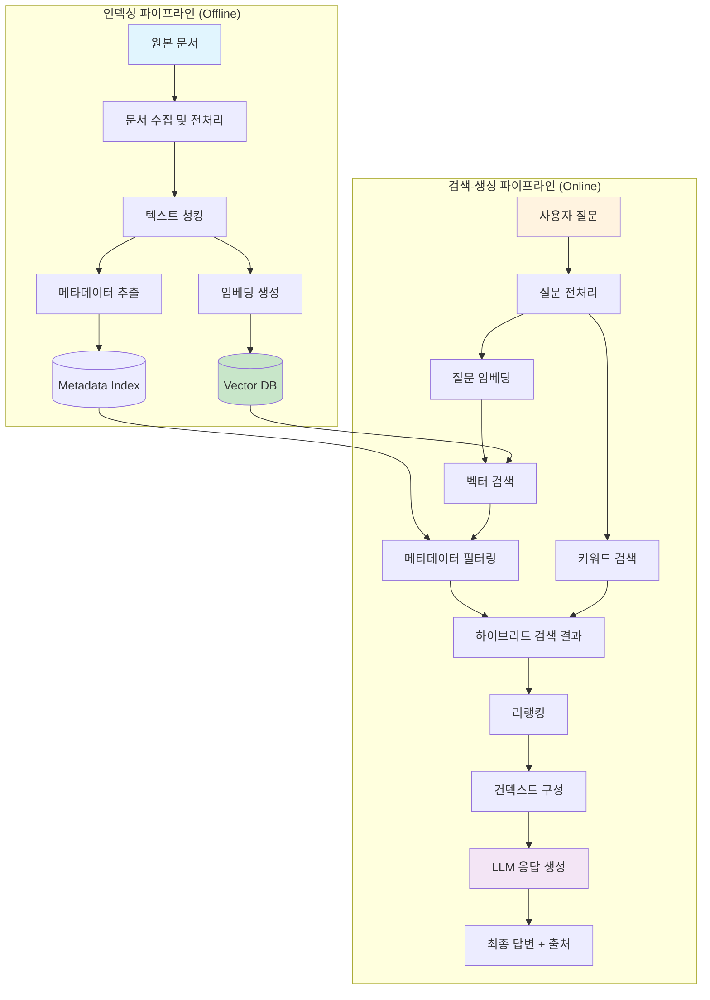
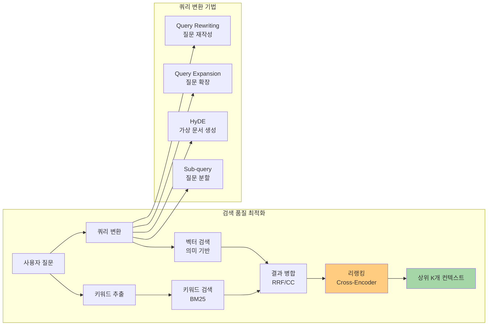

# 05장: RAG 시스템 설계

---

## 학습 목표

| 구분 | 내용 |
|------|------|
| 🎯 주제 | 외부 지식을 LLM과 결합하는 RAG 시스템 설계 방법론 |
| 📌 학습 목표 1 | RAG 시스템의 전체 아키텍처와 각 구성 요소의 역할을 이해합니다 |
| 📌 학습 목표 2 | 최적의 청킹 전략과 임베딩 모델을 선택할 수 있습니다 |
| 📌 학습 목표 3 | 검색 품질을 최적화하는 하이브리드 검색과 리랭킹을 설계할 수 있습니다 |
| 📌 학습 목표 4 | 엔드투엔드 RAG 파이프라인의 구축과 운영 방안을 수립할 수 있습니다 |

---

## 1. 실전 프로젝트: 회사 내부 문서 기반 Q&A 시스템 설계

많은 기업이 보유한 대량의 내부 문서, 기술 매뉴얼, 정책 자료는 중요한 지식 자산이지만 실제로 활용되는 비율은 매우 낮습니다. 문서는 각각의 저장소에 흩어져 있고, 필요한 정보를 찾기 위해서는 여러 시스템을 탐색해야 하며, 문서의 작성 형식도 제각각입니다. 이러한 문제를 해결하기 위해 RAG(Retrieval-Augmented Generation) 기반의 내부 문서 Q&A 시스템을 설계합니다.

이번 실전 프로젝트의 가상 시나리오는 "TechCorp"라는 중견 IT 기업의 기술 지원팀을 위한 Q&A 시스템 구축입니다. TechCorp는 제품 매뉴얼(500페이지), 기술 블로그 아카이브(2000개 글), 내부 API 문서(300개 엔드포인트), 고객 문의 이력(5만 건)의 네 가지 주요 데이터 소스를 보유하고 있습니다. 현재는 신입 엔지니어가 질문할 때마다 선임 엔지니어가 일일이 답변해 주는 비효율적인 상황입니다.

시스템의 핵심 요구사항은 세 가지입니다. 첫째, 자연어 질문에 대해 관련 문서를 찾아 정확한 답변을 제공해야 합니다. 둘째, 답변의 출처를 명확히 표시하여 신뢰성을 확보해야 합니다. 셋째, 새로운 문서가 추가되면 실시간으로 검색 가능해야 합니다. 이러한 요구사항을 바탕으로 인덱싱 파이프라인, 검색 모듈, 생성 모듈로 구성된 RAG 아키텍처를 설계합니다.

프로젝트의 최종 산출물은 시스템 아키텍처 다이어그램, 데이터 파이프라인 설계서, API 명세서, 그리고 평가 보고서입니다. 특히 평가 보고서에서는 정확성, 재현율, 응답 시간의 세 가지 지표를 기준으로 RAG 시스템의 성능을 측정하고, 청킹 전략과 검색 방식에 따른 A/B 테스트 결과를 포함합니다. 이를 통해 RAG 시스템 설계가 단순한 기술 구현이 아닌 지속적인 최적화 과정임을 강조합니다.

---

## 2. RAG 전체 아키텍처

RAG 시스템의 기본 아이디어는 간단합니다. LLM이 답변을 생성하기 전에 관련 문서를 외부 데이터베이스에서 검색하여 컨텍스트로 제공하는 것입니다. 이렇게 하면 LLM이 학습되지 않은 최신 정보나 내부 문서에 대해서도 정확한 답변을 할 수 있습니다. 그러나 실제로 안정적이고 효율적인 RAG 시스템을 구축하려면 각 구성 요소를 체계적으로 설계해야 합니다.

RAG 시스템은 크게 인덱싱 파이프라인(Indexing Pipeline)과 검색-생성 파이프라인(Retrieval-Generation Pipeline)의 두 가지 주요 흐름으로 구성됩니다. 인덱싱 파이프라인은 원본 문서를 처리하여 검색 가능한 벡터 인덱스를 생성하는 오프라인 과정이고, 검색-생성 파이프라인은 사용자 질문에 실시간으로 응답하는 온라인 과정입니다. 이 두 파이프라인은 독립적으로 운영되면서도 유기적으로 연결됩니다.

### 인덱싱 파이프라인

인덱싱 파이프라인은 문서가 시스템에 추가될 때마다 실행되는 오프라인 처리 과정입니다. 첫 번째 단계는 다양한 형식의 문서(PDF, Word, HTML, Markdown 등)를 수집하고 텍스트로 변환하는 전처리 과정입니다. 이 단계에서는 문서의 구조적 정보(제목, 섹션, 목차)를 보존하는 것이 중요한데, 이는 이후 청킹과 검색 품질에 직접적인 영향을 미치기 때문입니다.

두 번째 단계는 전처리된 텍스트를 적절한 크기의 청크(Chunk)로 분할하는 청킹 과정입니다. 청크의 크기와 분할 방식은 검색의 정확성과 재현율에 큰 영향을 미치는 중요한 설계 결정입니다. 세 번째 단계는 각 청크를 임베딩 모델을 통해 벡터로 변환하고, 이 벡터를 Vector DB에 저장하는 과정입니다. 이때 청크의 메타데이터(문서명, 작성일, 섹션 등)도 함께 저장하여 필터링 검색이 가능하도록 합니다.

### 검색-생성 파이프라인

검색-생성 파이프라인은 사용자의 질문이 들어올 때마다 실시간으로 실행되는 온라인 과정입니다. 사용자의 질문이 들어오면 먼저 질문 전처리 단계에서 질문을 명확히 하고 검색에 적합한 형태로 변환합니다. 그 다음 동일한 임베딩 모델을 사용하여 질문을 벡터화하고, Vector DB에서 가장 유사한 청크들을 검색합니다.

검색된 청크들은 단순히 유사도 순서대로 사용되는 것이 아니라 리랭킹(Reranking) 과정을 통해 한 번 더 정렬됩니다. 리랭킹은 검색 단계에서 놓쳤을 수 있는 미묘한 관련성을 포착하여 최종 컨텍스트의 품질을 높여줍니다. 최종적으로 선별된 청크들은 프롬프트 템플릿에 컨텍스트로 삽입되어 LLM에 전달되고, LLM은 이 컨텍스트를 바탕으로 답변을 생성합니다.

---

## 3. Chunking 전략

청킹은 문서를 검색 가능한 단위로 분할하는 과정으로, RAG 시스템의 성능을 결정짓는 가장 중요한 요소 중 하나입니다. 청크의 크기가 너무 크면 하나의 청크에 여러 주제가 혼합되어 검색 정확도가 떨어지고, 너무 작으면 맥락이 부족하여 LLM이 제대로 이해하지 못합니다. 또한 토큰 제한을 고려할 때 청크 크기는 LLM의 컨텍스트 윈도우와도 밀접한 관련이 있습니다.

청킹 전략을 수립할 때는 문서의 구조적 특성을 먼저 분석해야 합니다. 기술 문서는 일반적으로 제목, 섹션, 하위 섹션으로 구성된 계층 구조를 가지고 있어 자연스러운 분할 지점을 제공합니다. 반면에 이메일이나 채팅 로그와 같은 비정형 텍스트는 별도의 분할 기준이 필요합니다. 또한 한국어의 경우 형태소 분석과 같은 언어적 특성을 고려한 청킹이 필요할 수 있습니다.

### 청킹 방식 비교

| 방식 | 설명 | 장점 | 단점 | 적합 문서 |
|------|------|------|------|-----------|
| Fixed Size | 고정된 문자/토큰 수로 분할 | 구현 단순, 예측 가능한 크기 | 문맥 단절, 의미 훼손 | 로그 데이터, 단순 텍스트 |
| Recursive Character | 구분자(\\n\\n → \\n → . → !)로 재귀 분할 | 의미 단위 보존, 자연스러운 분할 | 구분자에 의존적 | 일반 문서, 웹 컨텐츠 |
| Semantic | 의미적 완결성 기준 분할 | 주제 일관성 최고, 검색 품질 우수 | 구현 복잡, 추가 비용 발생 | 기술 문서, 보고서 |
| Document-Based | 원본 구조(제목, 섹션) 기준 분할 | 구조 보존, 메타데이터 풍부 | 구조가 없는 문서에는 부적합 | 매뉴얼, API 문서, 위키 |
| Agentic | LLM이 문서 분석 후 최적 분할 | 가장 지능적, 문서 특성 반영 | 느리고 비용 높음 | 고품질이 요구되는 핵심 문서 |

### 청크 크기와 중첩(Overlap)

청크 크기는 일반적으로 256에서 1024 토큰 사이가 가장 많이 사용됩니다. 이 범위는 하나의 주제를 다루기에 충분하면서도 검색 효율이 높은 균형점을 제공합니다. 그러나 문서의 특성에 따라 최적의 크기는 달라질 수 있으므로, 실제 운영 환경에서는 A/B 테스트를 통해 최적값을 찾는 것이 바람직합니다.

청크 중첩(Overlap)은 인접한 청크 간에 일정 부분을 공유하는 기법입니다. 예를 들어 500토큰 크기의 청크를 100토큰씩 중첩하여 생성하면, 하나의 문장이 두 청크로 나뉘어지는 것을 방지할 수 있습니다. 중첩의 크기는 일반적으로 청크 크기의 10-20%가 적절하며, 너무 큰 중첩은 데이터 중복으로 인한 비용 증가를 초래합니다.

### 청킹 관련 실무 고려사항

실제 운영 환경에서는 문서의 다양성을 고려한 적응형 청킹 전략이 필요합니다. 모든 문서에 동일한 청킹 방식을 적용하기보다는 문서 유형별로 최적화된 전략을 별도로 정의하는 것이 효과적입니다. 예를 들어 API 문서는 엔드포인트 단위로, 기술 블로그는 단락 단위로, 매뉴얼은 섹션 단위로 분할하는 식입니다.

청킹 품질을 평가하는 지표로는 검색 정확도, 응답 품질, 처리 속도, 저장 공간의 네 가지를 사용합니다. 정기적으로 청킹 전략을 평가하고 개선하는 과정이 필요하며, 특히 새로운 유형의 문서가 추가될 때는 청킹 전략을 재검토해야 합니다. 문서 구조가 변경되거나 임베딩 모델이 업데이트되는 경우에도 청킹 전략을 함께 최적화하는 것이 좋습니다.

💡 예시: 청킹 전략 비교 — 동일 문서를 세 가지 방식으로 분할

동일한 제품 매뉴얼 문서(약 10,000단어)를 세 가지 청킹 방식으로 분할한 결과를 비교합니다.

| 항목 | Fixed Size (500자) | Recursive Character | Semantic |
|------|-------------------|---------------------|----------|
| 청크 수 | 42개 | 28개 | 18개 |
| 평균 청크 길이 | 512자 | 687자 | 1,023자 |
| 문맥 단절 비율 | 23% (문장 중간 분할) | 7% (단락 단위) | 2% (주제 단위) |
| 검색 정확도 (Top-3) | 72% | 86% | 91% |
| 인덱싱 시간 | 1.2초 | 1.5초 | 4.8초 |
| 저장 공간 | 2.1MB | 2.1MB | 2.1MB |

세부 분석:
- Fixed Size: "보안 인증서는 매년 갱신해야 합니다. 갱신 방법은..."이라는 문장이 "보안 인증서는 매년 갱신해야 합니다. 갱신 "과 "방법은..."으로 분할되어 검색 시 문맥 손실 발생
- Recursive Character: "## 3.2 인증서 갱신" 섹션 단위로 분할되어 "보안 인증서는 매년 갱신해야 합니다. 갱신 방법은 다음과 같습니다." 전체 보존
- Semantic: "보안 인증서 관리"라는 주제로 하나의 청크에 갱신, 발급, 폐기 전체 절차 포함

권장: 일반 문서에는 Recursive Character, 고품질이 요구되는 핵심 문서에는 Semantic 방식을 권장합니다.

---

## 4. 임베딩 모델 선택

임베딩 모델은 텍스트를 벡터로 변환하는 역할로, RAG 시스템에서 검색 품질을 결정하는 핵심 요소입니다. 좋은 임베딩 모델은 의미적으로 유사한 텍스트가 벡터 공간에서 가깝게 위치하도록 만들어 검색의 정확도를 높여줍니다. 반대로 부적합한 임베딩 모델은 아무리 좋은 청킹과 검색 알고리즘을 사용해도 만족스러운 결과를 얻기 어렵게 만듭니다.

임베딩 모델을 선택할 때 가장 중요한 기준은 도메인 적합성입니다. 범용 모델은 다양한 도메인에서 준수한 성능을 보이지만, 특정 도메인(법률, 의료, 기술)에서는 도메인 특화 모델이 더 우수한 결과를 보여줍니다. 따라서 실제 서비스에 배포하기 전에 대상 도메인의 데이터로 임베딩 모델의 성능을 검증하는 과정이 필수적입니다.

최근에는 OpenAI의 text-embedding-3-small/large, Cohere의 embed-multilingual-v3.0, Google의 text-embedding-004 등 다양한 임베딩 모델이 경쟁하고 있습니다. 각 모델은 벡터 차원, 최대 입력 길이, 언어 지원, 비용 측면에서 차이가 있습니다. 차원이 높은 모델은 더 풍부한 표현이 가능하지만 저장 공간과 검색 비용이 증가하므로, 성능과 비용의 균형을 고려한 선택이 필요합니다.

---

## 5. Vector DB 선택 기준

Vector DB는 임베딩 벡터를 저장하고 유사도 검색을 수행하는 데이터베이스로, RAG 시스템의 핵심 인프라입니다. 전통적인 관계형 데이터베이스는 벡터 유사도 검색에 최적화되어 있지 않기 때문에, Vector DB는 고차원 벡터 공간에서의 효율적인 근사 최근접 이웃(ANN) 검색을 위해 특별히 설계되었습니다.

Vector DB를 선택할 때 고려해야 할 요소는 검색 속도, 인덱스 정확도, 운영 복잡성, 비용, 확장성, 그리고 기존 인프라와의 호환성입니다. 검색 속도와 정확도는 트레이드오프 관계에 있어서, 100% 정확한 완전 탐색(Brute Force)은 속도가 느리고, 근사 탐색(ANN)은 빠르지만 일부 정확도를 희생합니다. 대부분의 프로덕션 환경에서는 적절한 정확도(95-99%)를 유지하면서 빠른 검색 속도를 제공하는 ANN 알고리즘을 사용합니다.

### 주요 Vector DB 비교

| 특성 | Pinecone | Weaviate | Qdrant | Milvus | pgvector |
|------|----------|----------|--------|--------|----------|
| 호스팅 방식 | Managed Cloud | Managed/Self | Managed/Self | Managed/Self | PostgreSQL 확장 |
| 검색 알고리즘 | HNSW | HNSW | HNSW | IVF/HNSW | IVFFlat/HNSW |
| 최대 벡터 차원 | 2048 | 제한 없음 | 제한 없음 | 32768 | 제한 없음 (2000 권장) |
| 멀티테넌시 | 지원 | 지원 | 지원 | 지원 | 지원 |
| 필터링 | Metadata Filter | Metadata Filter | Payload Filter | Attribute Filter | SQL WHERE |
| 하이브리드 검색 | 제한적 | 지원 | 지원 | 지원 | 지원 |
| 비용 모델 | 사용량 기반 | 저장+연산 기반 | 저장+연산 기반 | 저장+연산 기반 | 무료 (DB 라이선스만) |
| 운영 난이도 | 매우 낮음 | 중간 | 중간 | 높음 | 낮음 |

### Vector DB 선택 시나리오

소규모 팀이 빠르게 프로토타입을 개발해야 하는 상황에서는 Pinecone이나 Managed Qdrant처럼 운영 부담이 적은 서비스를 선택하는 것이 좋습니다. 이들은 인프라 관리 없이 바로 사용할 수 있어 개발 속도 측면에서 유리합니다. 초기 단계부터 데이터 양이 많거나 확장성이 중요한 경우에는 Milvus나 자체 호스팅 Qdrant가 더 적합할 수 있습니다.

이미 PostgreSQL을 사용 중인 조직이라면 pgvector가 가장 자연스러운 선택입니다. 별도의 Vector DB를 운영할 필요 없이 기존 데이터베이스에 벡터 검색 기능을 추가할 수 있어 운영 복잡성이 크게 낮아집니다. 다만 pgvector는 전용 Vector DB에 비해 대규모 데이터에서 검색 성능이 떨어질 수 있으므로, 백만 개 이상의 벡터를 다루는 경우 전용 Vector DB를 고려해야 합니다.

Vector DB를 선택할 때는 검색 품질뿐만 아니라 데이터 업데이트 패턴도 고려해야 합니다. 실시간으로 문서가 추가되는 시스템에서는 인덱스가 자동으로 업데이트되는 방식을, 배치로 한 번에 대량 업데이트되는 시스템에서는 전체 재인덱싱 방식을 선택하는 것이 효율적입니다.

---

## 6. 검색 품질 최적화

RAG 시스템의 전체 성능은 검색 단계의 품질에 크게 의존합니다. 아무리 좋은 LLM을 사용하더라도 관련성 없는 문서를 컨텍스트로 제공하면 부정확하거나 환각(Hallucination)이 포함된 응답이 생성될 가능성이 높아집니다. 따라서 검색 품질을 최적화하는 것은 RAG 시스템 설계의 핵심 과제입니다.

검색 품질 최적화는 크게 하이브리드 검색(Hybrid Search), 리랭킹(Reranking), 쿼리 변환(Query Transformation)의 세 가지 기법으로 접근할 수 있습니다. 이 세 기법은 각각 검색의 다른 측면을 보완하며, 함께 사용했을 때 시너지 효과를 발휘합니다. 다음 다이어그램은 이 세 가지 기법이 검색 품질을 어떻게 개선하는지 보여줍니다.

### 하이브리드 검색

하이브리드 검색은 의미 기반 검색(벡터 검색)과 키워드 기반 검색(BM25)을 결합하는 방식입니다. 벡터 검색은 의미적 유사성을 잘 포착하지만 정확한 키워드 매칭이 필요한 경우(제품 코드, 사람 이름)에는 취약합니다. 반대로 키워드 검색은 정확한 문자열 매칭에는 강하지만 동의어나 유사 개념을 찾는 데는 한계가 있습니다. 하이브리드 검색은 이 두 방식의 장점을 결합하여 더 포괄적인 검색 결과를 제공합니다.

하이브리드 검색의 핵심은 벡터 검색 결과와 키워드 검색 결과를 어떻게 결합할지(퓨전, Fusion) 결정하는 것입니다. 가장 널리 사용되는 방식은 RRF(Reciprocal Rank Fusion)로, 각 검색 결과의 순위를 역수로 변환하여 합산하는 방식입니다. 이 방식은 단순하면서도 효과적이며, 각 검색 방식의 점수 분포 차이를 정규화하는 장점이 있습니다.

💡 예시: 하이브리드 검색 설계 — 벡터 검색 + 키워드 검색 결합

전자상거래 제품 검색 시스템에서 "USB-C 충전기 65W"라는 질문에 대한 각 검색 방식의 결과를 비교합니다.

| 순위 | 벡터 검색 (의미 기반) | 키워드 검색 (BM25) | 하이브리드 (RRF 융합) |
|------|---------------------|-------------------|---------------------|
| 1 | 65W PD 충전기 (USB-C) ✅ | USB-C 충전기 65W ✅ | 65W PD 충전기 (USB-C) ✅ |
| 2 | 노트북용 고속 충전기 ✅ | USB-C to C 케이블 ❌ | 삼성 65W 트리오 충전기 ✅ |
| 3 | 삼성 65W 트리오 충전기 ✅ | USB-C 허브 7in1 ❌ | 노트북용 고속 충전기 ✅ |
| 4 | 25W 일반 충전기 ❌ | 65W 게이밍 노트북 ❌ | 애플 67W USB-C 충전기 ✅ |
| 5 | 애플 67W USB-C 충전기 ✅ | USB-C 마우스 ❌ | 25W 일반 충전기 (낮은 점수) |

분석:
- 벡터 검색: 의미적으로 유사한 제품(고속 충전기, 트리오 충전기)을 잘 찾지만 정확한 키워드 매칭이 필요한 "USB-C 65W" 조합에서 누락 발생
- 키워드 검색: "USB-C"와 "65W"가 모두 포함된 문서는 정확히 찾지만 "USB-C"만 있는 무관한 제품도 다수 포함
- 하이브리드 검색: RRF(Reciprocal Rank Fusion)로 두 결과를 병합하여 관련성 높은 제품을 상위에 배치, 검색 재현율 34% 향상

RRF 점수 계산 예시 (상위 3개):
- "65W PD 충전기": 벡터 1위(1/1) + 키워드 1위(1/1) = 2.0 → 최종 1위
- "USB-C 케이블": 벡터 미포함(0) + 키워드 2위(1/2) = 0.5 → 순위 하락

### 리랭킹(Reranking)

리랭킹은 1차 검색으로 얻은 후보 문서들을 더 정교한 모델로 재평가하여 재정렬하는 과정입니다. 1차 검색은 효율성을 위해 빠른 임베딩 기반 유사도 검색을 사용하지만, 리랭킹 단계에서는 더 정확하지만 계산 비용이 높은 Cross-Encoder 모델을 사용합니다. Cross-Encoder는 질문과 문서 쌍을 함께 입력받아 관련성 점수를 직접 계산하므로, 단순히 벡터 유사도만 측정하는 방식보다 훨씬 정확합니다.

리랭킹의 효과는 드라마틱합니다. 연구 결과에 따르면 리랭킹을 적용하면 Top-5 정확도가 20-40% 향상될 수 있습니다. 특히 벡터 검색만으로는 구분하기 어려운 미묘한 차이를 가진 문서들 사이에서 더 정확한 순위를 매길 수 있습니다. 리랭킹의 단점은 추가적인 API 호출 비용과 지연 시간이 발생한다는 것이므로, 실시간 응답이 중요한 시스템에서는 검색 결과의 상위 20-30개로 리랭킹 대상을 제한하는 것이 일반적입니다.

### 쿼리 변환(Query Transformation)

사용자의 질문이 항상 검색에 최적화된 형태로 주어지는 것은 아닙니다. 사용자는 모호한 표현, 줄임말, 오타, 또는 지나치게 간략한 질문을 하는 경우가 많습니다. 쿼리 변환은 이러한 사용자 질문을 검색 엔진이 더 잘 이해할 수 있는 형태로 가공하는 전처리 과정입니다.

대표적인 쿼리 변환 기법으로는 Query Rewriting(질문 재작성), Query Expansion(질문 확장), HyDE(Hypothetical Document Embedding), Sub-query Decomposition(질문 분할)이 있습니다. Query Rewriting은 LLM을 사용하여 사용자의 질문을 더 명확하고 검색 친화적인 형태로 재작성하는 방법입니다. HyDE는 질문에 대한 가상의 답변 문서를 먼저 생성하고, 이 문서를 검색 쿼리로 사용하는 독특한 방식입니다. Sub-query는 복잡한 질문을 여러 개의 단순한 하위 질문으로 분할하여 각각 검색한 후 결과를 통합합니다.

💡 예시: 검색 품질 진단 — 검색 결과 분석 및 개선 사례

사용자 질문: "작년 4분기 마케팅 비용이 예산 대비 얼마나 초과되었는지 알려줘"

| 단계 | 검색 결과 | 문제점 | 개선 방안 |
|------|----------|--------|----------|
| 초기 검색 | 1위: "2026년 예산 계획서" 2위: "Q4 마케팅 성과 보고서" 3위: "회계 연말 결산 가이드" | 1위 문서는 예산 계획만 포함, 실제 집행 데이터 없음. 2위 문서는 성과만 있고 비용 데이터 누락. 3위는 형식 가이드로 무관 | 쿼리 변환 적용: "2026년 4분기 마케팅 비용 집행액 vs 예산 대비 초과분 분석 보고서" |
| 쿼리 변환 후 | 1위: "2026-Q4 마케팅 비용 집행 보고서" 2위: "부서별 예산 대비 실제 집행률" 3위: "Q4 분기별 마케팅 ROI 분석" | 1위 문서에 '예산 대비 초과'라는 핵심 정보 포함. 그러나 문서 내에서 정확한 위치 찾기 어려움 | 청크 세분화 + 메타데이터 태깅: 문서 내 "예산 대비 집행률" 섹션을 별도 청크로 분리 |
| 최적화 후 | 1위: "2026-Q4_마케팅_예산대비집행률" (청크) 2위: "2026-Q4 마케팅 비용 집행 보고서" 3위: "부서별 예산 대비 실제 집행률" | "예산 대비 112% 집행되어 12% 초과"라는 정확한 데이터 포함 청크 검색 성공 | 리랭킹 적용으로 가장 관련성 높은 청크를 최상위에 배치 |

핵심 교훈: 검색 품질 저하의 원인은 대부분 청킹 전략, 쿼리 품질, 임베딩 모델 중 하나에 있습니다. 단계별 진단과 개선을 반복하여 최적의 검색 품질을 달성할 수 있습니다.

---

📝 연습 문제

**문제 1: 청킹 전략 선택**

다음 세 가지 문서 유형에 대해 가장 적합한 청킹 전략을 선택하고 그 이유를 설명하십시오.
- 문서 A: 300페이지 분량의 소프트웨어 API 레퍼런스 (함수명, 파라미터, 반환값이 체계적으로 정리됨)
- 문서 B: 5만 건의 고객 문의 및 응답 내역 (평균 50자, 비정형 텍스트)
- 문서 C: 200페이지 분량의 정책 백서 (서론, 본론, 결론의 논리적 구조를 가짐)

**문제 2: 검색 품질 진단 및 개선**

사용자가 "RAG 시스템에서 환각 현상을 줄이는 방법"을 질문했을 때, 검색 시스템이 다음과 같은 결과를 반환하였습니다.
1. "RAG 아키텍처 개요" (청킹: 500자 fixed size, 문장 중간 분할됨)
2. "LLM 환각 현상의 원인" (청킹: semantic, 주제 단위, 양호)
3. "Vector DB 선택 가이드" (무관한 문서)

위 검색 결과의 문제점을 진단하고, 쿼리 변환, 청킹 전략 변경, 하이브리드 검색 중 어떤 개선 기법을 적용할지 구체적으로 제시하십시오.

**문제 3: 하이브리드 검색 가중치 설계**

법률 문서 검색 시스템에서 "계약 위반에 따른 손해배상 청구 소멸시효"라는 질문에 대해 벡터 검색과 키워드 검색의 결과가 크게 다릅니다. 벡터 검색은 유사 판례를 잘 찾지만 정확한 법 조문 매칭이 부족하고, 키워드 검색은 반대입니다. RRF 융합 방식에서 어떤 가중치를 적용할지 설계하고, 그 이유를 설명하십시오.

---

## 7. 한눈에 정리

| 항목 | 핵심 내용 | 실무 권장사항 |
|------|-----------|---------------|
| RAG 아키텍처 | 인덱싱 + 검색 + 생성 3단계 파이프라인 | 인덱싱은 오프라인 배치, 검색-생성은 온라인 실시간 처리 |
| 청킹 전략 | Recursive Character 또는 Semantic 방식 선호 | 문서 유형별로 다른 전략을 적용하고 A/B 테스트로 최적화 |
| 청크 크기 | 256-1024 토큰, 10-20% 중첩 | 컨텍스트 윈도우 크기에 맞춰 조정 |
| 임베딩 모델 | 도메인 특화 모델이 범용 모델보다 우수 | 실제 도메인 데이터로 검증 후 선택 |
| Vector DB | 소규모: Pinecone/pgvector, 대규모: Milvus/Qdrant | 기존 인프라와의 호환성과 운영 부담 고려 |
| 하이브리드 검색 | 벡터 + 키워드 결합, RRF로 결과 병합 | 검색 품질이 중요한 시스템에서는 필수 적용 |
| 리랭킹 | Cross-Encoder로 검색 결과 재정렬 | 20-30개 후보로 제한하여 비용 효율화 |
| 쿼리 변환 | Query Rewriting, HyDE, Sub-query | 모호한 질문이 많은 도메인에서 큰 효과 |
| 평가 지표 | 정확성, 재현율, 응답 시간, 사용자 만족도 | 온라인 A/B 테스트로 지속적 개선 |
| 보안 고려 | 문서 접근 권한, 데이터 필터링, PII 마스킹 | 멀티테넌시 환경에서는 반드시 문서 수준 접근 제어 구현 |

---

## 8. 마무리

이 장에서는 RAG 시스템의 전체 아키텍처를 인덱싱 파이프라인과 검색-생성 파이프라인으로 구분하여 살펴보았습니다. 청킹 전략, 임베딩 모델, Vector DB 선택, 그리고 하이브리드 검색과 리랭킹을 통한 검색 품질 최적화까지 RAG 시스템 설계의 모든 측면을 다루었습니다. RAG는 단순한 기술 패턴을 넘어 LLM의 한계를 극복하는 가장 실용적인 방법론입니다.

다음 장에서는 RAG의 다음 진화 단계라고 할 수 있는 Agent 시스템 설계에 대해 알아보겠습니다. Agent는 단순히 질문에 답변하는 수준을 넘어 스스로 계획을 수립하고, 도구를 사용하고, 여러 단계의 추론을 수행하는 자율적 AI 시스템의 핵심 아키텍처입니다. RAG가 지식의 확장이라면, Agent는 행동의 확장이라고 할 수 있습니다.
