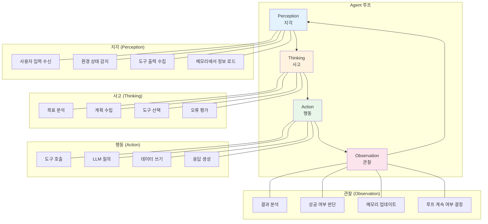

# 06장: Agent 시스템 설계

---

## 학습 목표

| 구분 | 내용 |
|------|------|
| 🎯 주제 | 자율적 추론과 행동이 가능한 Agent 시스템 설계 방법론 |
| 📌 학습 목표 1 | Agent의 핵심 아키텍처와 인지-행동 루프를 이해합니다 |
| 📌 학습 목표 2 | ReAct, Plan-and-Execute, Multi-agent 등 주요 Agent 유형을 구분할 수 있습니다 |
| 📌 학습 목표 3 | Agent의 도구(Tool)와 메모리(Memory)를 체계적으로 설계할 수 있습니다 |
| 📌 학습 목표 4 | 다중 Agent 협업 패턴을 설계하고 조정할 수 있습니다 |

---

## 1. 실전 프로젝트: 자동화된 데이터 분석 Agent 설계

현대 기업은 매일 엄청난 양의 데이터를 생성하지만, 이를 체계적으로 분석하여 인사이트를 도출하는 작업은 여전히 많은 시간과 노력이 필요합니다. 특히 데이터 분석은 데이터 수집, 전처리, 탐색적 분석, 시각화, 보고서 작성의 여러 단계를 거쳐야 하는 복잡한 과정입니다. 이러한 반복적이고 다단계인 분석 작업을 자동화할 수 있다면 기업의 의사 결정 속도를 획기적으로 높일 수 있습니다.

이번 실전 프로젝트에서는 "DataSage"라는 가상의 데이터 분석 Agent를 설계합니다. DataSage는 사용자의 자연어 요청을 받아 데이터를 수집하고, 분석하고, 인사이트를 도출하여 보고서로 작성하는 자율적 AI 시스템입니다. 예를 들어 "지난 분기 제품 카테고리별 매출 추세를 분석하고, 매출 감소가 있는 카테고리의 원인을 파악해 줘"라는 요청을 받으면, Agent는 이 작업을 위해 검색하고, 계산하고, 추론하는 일련의 행동을 자율적으로 수행합니다.

DataSage의 핵심 요구사항은 네 가지입니다. 첫째, 여러 데이터 소스(데이터베이스, API, 파일)에 접근하여 데이터를 수집할 수 있어야 합니다. 둘째, 수집된 데이터를 분석하고 통계적 인사이트를 도출할 수 있어야 합니다. 셋째, 분석 결과를 시각화하고 자연어 보고서로 작성할 수 있어야 합니다. 넷째, 사용자와의 대화 맥락을 유지하면서 점진적으로 분석을 발전시킬 수 있어야 합니다. 이러한 요구사항은 데이터 분석 Agent의 설계가 단순한 LLM 호출을 넘어 복잡한 도구 사용과 추론 능력을 요구함을 보여줍니다.

---

## 2. Agent 아키텍처

Agent 시스템의 핵심은 환경을 인지하고, 추론하며, 행동하고, 그 결과를 관찰하는 순환적 프로세스입니다. 이는 인간의 인지 과정을 모방한 것으로, 단순한 질문-응답 패턴을 넘어 목표 지향적인 행동을 가능하게 합니다. Agent가 단순한 LLM 호출과 다른 점은 바로 이 인지-행동 루프(Cognitive-Action Loop)에 있습니다.

Agent 아키텍처는 크게 네 가지 구성 요소로 이루어집니다. Perception(지각)은 외부 환경으로부터 정보를 수집하는 부분이고, Thinking(사고)은 수집된 정보를 바탕으로 계획을 수립하고 의사 결정을 내리는 부분입니다. Action(행동)은 결정된 계획을 실제로 실행하는 부분이며, Observation(관찰)은 행동의 결과를 분석하여 다음 사이클에 반영하는 부분입니다. 이 네 단계가 하나의 루프를 이루어 Agent가 자율적으로 작업을 완료할 때까지 반복됩니다.



### 지각(Perception) 단계

지각 단계는 Agent가 외부 환경으로부터 정보를 수집하는 첫 번째 과정입니다. 여기에는 사용자의 입력 메시지를 해석하고, 현재 시스템 상태를 파악하며, 이전 행동의 결과를 수집하는 활동이 포함됩니다. 특히 이전 단계에서 도구 호출의 결과물이 있다면 이를 구조화된 형태로 파싱하여 다음 사고 단계에 전달하는 것이 중요합니다.

지각 단계의 품질은 전체 Agent 성능을 결정짓는 중요한 요소입니다. 입력 정보를 얼마나 정확하게 구조화하느냐에 따라 이후의 추론 품질이 크게 달라집니다. 예를 들어 API 응답으로 받은 JSON 데이터를 그대로 LLM에 전달하는 것보다, 필요한 정보만 추출하고 불필요한 노이즈를 제거하는 전처리 과정이 필요합니다.

### 사고(Thinking) 단계

사고 단계는 Agent의 두뇌에 해당하는 가장 핵심적인 부분입니다. 이 단계에서 LLM은 현재까지 수집된 정보와 최종 목표를 바탕으로 다음에 수행할 행동을 결정합니다. 사고 단계의 출력은 일반적으로 자연어로 표현된 추론 과정(Chain of Thought)과 함께 구체적인 행동 계획을 포함합니다.

사고 단계의 핵심 설계 원칙은 구조화된 출력을 사용하는 것입니다. LLM이 자유 형식으로 생각한 내용을 출력하도록 하는 것보다, JSON이나 특정 스키마를 따르는 구조화된 응답을 요구하는 것이 더 안정적입니다. 예를 들어 {"thought": "매출 데이터가 필요하므로 DB를 조회해야 합니다", "action": "query_database", "parameters": {"sql": "SELECT * FROM sales WHERE quarter = '2026-Q2'"}}와 같은 구조화된 출력을 사용하면 파싱이 용이하고 오류 발생 가능성이 줄어듭니다.

### 행동(Action) 단계

행동 단계에서는 사고 단계에서 결정된 계획을 실제로 실행합니다. 이때 실행하는 행동은 크게 세 가지 유형으로 나눌 수 있습니다. 첫째는 도구 호출(Tool Call)로, 외부 API나 데이터베이스를 사용하는 행동입니다. 둘째는 LLM 호출로, 하위 작업을 처리하기 위해 내부적으로 LLM을 다시 호출하는 것입니다. 셋째는 사용자에게 응답을 반환하는 최종 행동입니다.

행동 단계의 중요한 설계 고려사항은 오류 처리입니다. 도구 호출이 실패했을 때 Agent가 어떻게 대응할지, 예상치 못한 입력이 들어왔을 때 어떻게 처리할지 등을 사전에 정의해야 합니다. 일반적으로는 오류 발생 시 관찰 단계로 돌아가서 재시도하거나 대체 계획을 수립하는 방식을 사용합니다.

### 관찰(Observation) 단계

관찰 단계는 행동의 결과를 평가하고 다음 루프의 입력으로 전달하는 과정입니다. 여기서는 도구 호출의 결과가 성공적인지, 목표에 얼마나 근접했는지, 추가 정보가 필요한지 등을 판단합니다. 이 단계의 판단에 따라 Agent는 루프를 계속할지, 사용자에게 최종 응답을 반환할지 결정합니다.

관찰 단계의 중요한 기능은 자기 반성(Self-Reflection)입니다. Agent는 자신의 행동 결과를 비판적으로 검토하고, 실패한 이유를 분석하며, 다음 시도에서 개선할 점을 도출해야 합니다. 이는 특히 여러 단계의 추론이 필요한 복잡한 작업에서 Agent의 성공률을 크게 향상시킵니다.

---

## 3. Agent 유형

Agent 시스템은 목적과 복잡도에 따라 여러 가지 유형으로 분류할 수 있습니다. 각 유형은 서로 다른 추론 패턴과 아키텍처를 가지며, 특정 사용 사례에 더 적합합니다. 올바른 Agent 유형을 선택하는 것은 시스템 설계의 첫 번째이자 가장 중요한 결정입니다.

세 가지 주요 Agent 유형은 ReAct Agent, Plan-and-Execute Agent, Multi-agent 시스템입니다. ReAct는 추론과 행동을 번갈아 가며 수행하는 단순하면서도 강력한 패턴이고, Plan-and-Execute는 먼저 전체 계획을 수립한 후 단계별로 실행하는 방식입니다. Multi-agent는 여러 전문 Agent가 협력하여 복잡한 작업을 처리하는 고급 아키텍처입니다.

### Agent 유형 비교

| 특성 | ReAct Agent | Plan-and-Execute | Multi-agent |
|------|-------------|-------------------|-------------|
| 작동 방식 | 추론 → 행동 → 관찰을 반복 | 전체 계획 수립 후 단계별 실행 | 여러 Agent가 역할 분담하여 협력 |
| 장점 | 단순하고 유연함, 상황 대응能力强 | 체계적, 긴 작업에 안정적 | 전문화, 확장성, 복잡한 작업 가능 |
| 단점 | 장기 계획 수립에 취약 | 계획 수립에 비용 소모 | 조정 복잡성, 통신 오버헤드 |
| 적합 작업 | 탐색적, 동적, 짧은 작업 | 정형화된 다단계 작업 | 대규모, 다양한 전문성 필요 작업 |
| 오류 내성 | 루프 내에서 자연스럽게 복구 | 계획 재수립 필요 | Agent 간 핸드오프에서 오류 가능 |
| 예시 | 고객 지원 챗봇, 간단한 리서치 | 데이터 분석 파이프라인, 보고서 생성 | 소프트웨어 개발 팀, 기업 운영 자동화 |

### ReAct Agent

ReAct(Reasoning + Acting)는 Agent 시스템의 가장 기본적이면서도 널리 사용되는 패턴입니다. 이 패턴의 핵심은 LLM이 추론(Reasoning)과 행동(Acting)을 번갈아 가며 수행하도록 하는 것입니다. 각 단계에서 LLM은 현재 상황을 분석하고(Think), 필요한 도구를 호출하고(Act), 그 결과를 관찰하여(Observe) 다시 추론하는 사이클을 반복합니다.

ReAct의 가장 큰 장점은 단순성과 유연성입니다. 복잡한 사전 계획 없이도 현재 상황에 따라 동적으로 행동을 결정할 수 있어 예측 불가능한 환경에 잘 대응합니다. 예를 들어 고객 지원 Agent의 경우, 고객의 첫 질문만으로는 어떤 정보가 필요할지 알 수 없으므로, 대화를 진행하면서 필요한 정보를 단계적으로 수집하는 ReAct 방식이 효과적입니다.

ReAct의 단점은 장기적인 계획 수립이 어렵다는 점입니다. 각 단계의 의사 결정이 국소적인 최적화에 치우칠 수 있어, 전체적인 작업 흐름을 고려한 글로벌 최적화가 어렵습니다. 또한 단계가 길어질수록 오류가 누적되고(Hallucination 누적), 언제 루프를 종료할지 판단하는 것도 까다로운 문제입니다.

💡 예시: ReAct Agent 동작 예시 — 연구 보조 Agent의 질문 처리 과정

사용자 질문: "2025년 글로벌 전기차 시장 점유율에서 테슬라의 위치는?"

| 단계 | Agent의 사고 및 행동 | 상세 내용 |
|------|---------------------|----------|
| Think 1 | "사용자가 2025년 전기차 시장 점유율 데이터를 요청합니다. 먼저 웹 검색으로 최신 데이터를 찾아야 합니다." | 질문을 분석하여 필요한 정보 유형 파악 |
| Act 1 | Tool: web_search(query="2025 global electric vehicle market share Tesla") | 검색 도구 호출 |
| Observe 1 | 검색 결과: "2025년 글로벌 EV 시장 점유율 — 테슬라 18.5%, BYD 22.3%, 폭스바겐 그룹 11.2%, 현대차그룹 7.8%..." | 구조화된 검색 결과 수신 |
| Think 2 | "데이터를 찾았습니다. 그런데 BYD가 테슬라를 앞섰네요. 추가로 지역별 데이터도 있으면 더 풍부한 답변이 가능할 것 같습니다." | 결과 분석 및 추가 정보 필요성 판단 |
| Act 2 | Tool: web_search(query="2025 electric vehicle market share by region Tesla BYD") | 지역별 데이터 추가 검색 |
| Observe 2 | "북미: 테슬라 48% (1위), 유럽: 폭스바겐 22% (테슬라 15% 2위), 중국: BYD 33% (테슬라 9% 3위)" | 지역별 상세 데이터 확보 |
| Think 3 | "Think 1, Act 1, Observe 1, Think 2, Act 2를 거쳐 충분한 데이터를 확보했습니다. 종합적인 답변을 생성합니다." | 목표 달성 판단, 루프 종료 |
| Final | "2025년 글로벌 전기차 시장에서 테슬라는 18.5%의 점유율로 2위를 기록했습니다. 1위는 BYD(22.3%)이며, 특히 중국 시장에서 BYD의 약진이 두드러집니다. 북미 시장에서는 테슬라가 48%로 여전히 압도적 1위입니다." | 최종 응답 생성 |

핵심 포인트: Agent는 Think → Act → Observe 사이클을 2회 반복하여 단순 검색 결과를 넘어 지역별 분석까지 포함한 풍부한 답변을 생성하였습니다. 각 단계에서 이전 결과를 분석하여 추가 행동을 결정하는 것이 ReAct의 핵심입니다.

### Plan-and-Execute Agent

Plan-and-Execute는 ReAct의 단점을 보완하기 위해 고안된 패턴입니다. 이 방식은 먼저 Planner LLM이 전체 작업 계획을 수립하고, 그 다음 Executor가 계획을 단계별로 실행하는 2단계 구조를 가집니다. 마치 소프트웨어 엔지니어링에서 설계 문서를 먼저 작성하고 구현하는 것과 유사한 접근 방식입니다.

Plan-and-Execute의 가장 큰 장점은 긴 작업에서도 안정성을 유지할 수 있다는 점입니다. 사전에 수립된 계획이 있기 때문에 각 단계에서 전체 맥락을 유지하기 쉽고, 작업의 진행 상황을 추적하기도 용이합니다. 또한 사용자에게 전체 작업 계획을 먼저 보여줌으로써 기대치를 조정할 수 있고, 사용자가 계획을 수정할 기회를 제공할 수도 있습니다.

Plan-and-Execute의 단점은 초기 계획 수립에 비용이 발생하고, 계획이 항상 최적이라는 보장이 없다는 것입니다. 실제로 작업을 수행하다 보면 예상치 못한 장애물이나 새로운 정보가 발견되어 계획을 변경해야 하는 경우가 빈번합니다. 따라서 Plan-and-Execute 방식에도 동적 계획 재수립(Dynamic Replanning) 메커니즘을 함께 구현하는 것이 좋습니다.

### Multi-agent 시스템

Multi-agent 시스템은 여러 개의 전문 Agent가 협력하여 하나의 목표를 달성하는 고급 아키텍처입니다. 각 Agent는 특정 도메인이나 기능에 특화되어 있으며, 자신의 전문 분야에서 독립적으로 작업을 수행합니다. 이는 마치 기업에서 각 부서가 전문성을 가지고 협력하는 것과 유사한 구조입니다.

Multi-agent 시스템의 가장 큰 장점은 전문화와 확장성입니다. 각 Agent가 자신의 전문 분야에 최적화되어 있으므로, 하나의 범용 Agent보다 더 높은 품질의 결과를 제공할 수 있습니다. 또한 새로운 기능이 필요할 때 기존 시스템을 수정하지 않고 새로운 Agent를 추가하기만 하면 되므로 확장성이 뛰어납니다.

Multi-agent 시스템의 핵심 과제는 Agent 간의 효과적인 조정(Coordination)입니다. 누가 어떤 작업을 담당할지, Agent 간에 정보를 어떻게 공유할지, 충돌이 발생했을 때 어떻게 해결할지 등을 체계적으로 설계해야 합니다. 이러한 조정 문제는 Multi-agent 시스템의 복잡성을 크게 증가시키는 요인이며, 단순한 작업에는 오히려 ReAct나 Plan-and-Execute가 더 효율적일 수 있습니다.

---

## 4. Tool 설계

Tool은 Agent가 외부 세계와 상호작용하는 인터페이스로, Agent 시스템의 핵심 구성 요소입니다. Agent는 Tool을 통해 데이터베이스를 조회하고, 외부 API를 호출하고, 파일을 읽고 쓰며, 계산을 수행할 수 있습니다. Tool의 설계 품질은 Agent의 능력과 안정성을 직접적으로 결정합니다.

Tool을 설계할 때 가장 중요한 원칙은 명확한 인터페이스와 철저한 오류 처리입니다. 각 Tool은 자신이 무엇을 하는지, 어떤 파라미터가 필요한지, 어떤 결과를 반환하는지가 명확히 정의되어야 합니다. 또한 예외 상황에서도 Agent가 적절히 대응할 수 있도록 구조화된 오류 메시지를 반환하는 것이 필수적입니다.

### 도구 정의와 스키마

각 Tool은 명확한 이름, 설명, 입력 파라미터, 출력 형식을 가져야 합니다. Tool의 이름과 설명은 Agent가 적절한 Tool을 선택하는 데 결정적인 역할을 하므로, 충분히 구체적이고 명확하게 작성해야 합니다. 특히 설명에는 이 Tool을 언제 사용해야 하는지, 어떤 상황에 적합한지에 대한 정보를 포함하는 것이 좋습니다.

입력 파라미터는 JSON Schema 형식으로 정의하는 것이 표준입니다. 각 파라미터의 이름, 타입, 설명, 필수 여부, 그리고 가능한 값의 범위를 명확히 지정해야 합니다. 예를 들어 데이터베이스 쿼리 Tool의 경우 table_name은 문자열이고 필수이며, limit은 정수이고 선택적이며 기본값이 10임을 명시합니다. 이러한 명세는 Agent가 Tool을 올바르게 사용할 확률을 크게 높여줍니다.

### 권한과 보안

Tool에 대한 접근 권한은 반드시 최소 권한 원칙(Principle of Least Privilege)에 따라 설계되어야 합니다. Agent에게 모든 데이터베이스에 대한 읽기/쓰기 권한을 부여하는 것이 아니라, 실제로 필요한 데이터와 작업에 대해서만 제한된 권한을 부여해야 합니다. 예를 들어 데이터 분석 Agent는 읽기 전용 권한만 가지고, 데이터 수정이 필요한 경우는 별도의 승인 프로세스를 거치도록 설계합니다.

권한 설계는 사용자 수준, Agent 수준, Tool 수준의 세 가지 계층으로 접근하는 것이 효과적입니다. 사용자 수준에서는 사용자가 Agent에게 부여한 권한의 범위를 정의하고, Agent 수준에서는 Agent가 가진 기본 권한을 설정합니다. Tool 수준에서는 각 Tool이 수행할 수 있는 작업의 범위를 제한합니다. 실제 Tool 호출 시에는 이 세 가지 권한의 교집합이 적용됩니다.

### 오류 처리

Tool 실행 중 발생하는 오류는 Agent의 전체 워크플로우에 영향을 미칠 수 있으므로, 체계적인 오류 처리 전략이 필요합니다. 모든 Tool은 성공 시 일관된 형식의 성공 응답을, 실패 시 구조화된 오류 응답을 반환해야 합니다. 오류 응답에는 오류 코드, 설명, 그리고 가능하다면 해결 방법에 대한 제안이 포함되어야 합니다.

Agent는 Tool의 오류 응답을 받았을 때 단순히 실패했다고 보고하는 것을 넘어, 오류의 원인을 분석하고 대체 방법을 모색할 수 있어야 합니다. 예를 들어 "데이터베이스 연결 실패" 오류가 발생하면 Agent는 "일정 시간 후 재시도"하거나 "캐시된 데이터 사용"과 같은 대체 전략을 실행할 수 있습니다. 이러한 적응적 오류 처리는 Agent의 견고성을 크게 향상시킵니다.

💡 예시: Tool 정의 예시 — 데이터 분석 Agent의 도구 설계

데이터 분석 Agent "DataSage"의 핵심 도구들을 JSON Schema로 정의한 예시입니다.

```
{
  "tools": [
    {
      "name": "query_database",
      "description": "PostgreSQL 데이터베이스에 SELECT 쿼리를 실행합니다. 읽기 전용이며, 데이터 수정은 불가능합니다. 테이블명과 컬럼명을 정확히 알고 있을 때 사용하십시오.",
      "parameters": {
        "type": "object",
        "properties": {
          "sql": {
            "type": "string",
            "description": "실행할 SQL SELECT 쿼리. 반드시 SELECT로 시작해야 하며, JOIN, WHERE, GROUP BY, ORDER BY 지원."
          },
          "limit": {
            "type": "integer",
            "description": "최대 반환 행 수 (기본값: 100, 최대: 1000)",
            "default": 100,
            "minimum": 1,
            "maximum": 1000
          }
        },
        "required": ["sql"]
      }
    },
    {
      "name": "calculate_statistics",
      "description": "숫자 배열에 대한 기초 통계량(평균, 중앙값, 표준편차, 최소값, 최대값)을 계산합니다. 데이터 분석 결과에서 추세를 파악할 때 사용하십시오.",
      "parameters": {
        "type": "object",
        "properties": {
          "values": {
            "type": "array",
            "items": {"type": "number"},
            "description": "통계를 계산할 숫자 배열"
          }
        },
        "required": ["values"]
      }
    },
    {
      "name": "create_chart",
      "description": "데이터를 기반으로 차트를 생성합니다. 막대 그래프, 선 그래프, 파이 차트를 지원합니다. 분석 결과를 시각화할 때 사용하십시오.",
      "parameters": {
        "type": "object",
        "properties": {
          "chart_type": {
            "type": "string",
            "enum": ["bar", "line", "pie"],
            "description": "차트 유형: bar(막대), line(선), pie(원형)"
          },
          "labels": {
            "type": "array",
            "items": {"type": "string"},
            "description": "X축 또는 범주 레이블"
          },
          "datasets": {
            "type": "array",
            "items": {
              "type": "object",
              "properties": {
                "label": {"type": "string"},
                "data": {"type": "array", "items": {"type": "number"}}
              },
              "required": ["label", "data"]
            },
            "description": "데이터셋 배열 (여러 시리즈 지원)"
          }
        },
        "required": ["chart_type", "labels", "datasets"]
      }
    }
  ]
}
```

설계 원칙:
- 각 도구의 description은 "언제 사용하는지"를 명확히 기술하였습니다.
- 필수 파라미터와 선택 파라미터를 구분하고, 기본값과 제약 조건(minimum, maximum, enum)을 명시하였습니다.
- query_database 도구는 의도적으로 SELECT만 허용하여 데이터 수정을 방지하는 안전 장치를 포함하였습니다.
- calculate_statistics는 단순 통계 계산으로 LLM의 계산 오류를 보완합니다.
- create_chart는 시각화를 담당하여 Agent가 분석 결과를 직관적으로 전달할 수 있게 합니다.

---

## 5. Memory 설계

Agent의 메모리는 단순히 대화 내역을 저장하는 것을 넘어, 에이전트가 경험을 통해 학습하고 더 나은 의사 결정을 내릴 수 있도록 하는 핵심 인프라입니다. 메모리는 단기 메모리(Short-term), 장기 메모리(Long-term), 작업 메모리(Working Memory)의 세 가지 계층으로 구성됩니다. 각 계층은 서로 다른 목적과 생명주기를 가집니다.

메모리 시스템의 설계에서 가장 중요한 고려사항은 정보의 선택적 저장과 검색입니다. 모든 대화와 경험을 무제한으로 저장하는 것은 비용과 성능 측면에서 비현실적이므로, 어떤 정보를 저장하고 어떤 정보를 폐기할지에 대한 명확한 기준이 필요합니다. 또한 저장된 정보 중에서 현재 맥락에 가장 관련성 높은 정보만 선택적으로 검색하는 메커니즘도 함께 설계해야 합니다.

### 단기 메모리 (Short-term Memory)

단기 메모리는 현재 대화 세션 동안의 정보를 일시적으로 저장합니다. 여기에는 사용자와의 대화 내역, 현재까지 수행한 작업의 로그, 최근 도구 호출 결과 등이 포함됩니다. 단기 메모리는 Agent가 현재 작업의 맥락을 유지하는 데 필수적이며, 세션이 종료되면 사라지는 휘발성 저장소입니다.

단기 메모리의 가장 중요한 설계 고려사항은 컨텍스트 윈도우 관리입니다. LLM의 컨텍스트 윈도우는 유한하기 때문에, 대화가 길어지면 과거 정보를 어떻게 압축하고 폐기할지 결정해야 합니다. 일반적인 전략은 최근 N개의 메시지만 유지하고, 오래된 메시지는 요약(Summarization)하여 보관하는 방식입니다.

### 장기 메모리 (Long-term Memory)

장기 메모리는 여러 세션에 걸쳐 지속되는 정보를 저장합니다. 여기에는 사용자의 선호도, 과거 작업의 결과, 학습한 지식, Agent의 경험적 규칙 등이 포함됩니다. 장기 메모리는 데이터베이스나 파일 시스템에 영구적으로 저장되며, Agent가 재시작된 후에도 유지됩니다.

장기 메모리를 구현하는 가장 일반적인 방법은 RAG 시스템을 활용하는 것입니다. 경험과 지식을 임베딩하여 Vector DB에 저장하고, 필요할 때 검색하여 사용합니다. 장기 메모리를 효과적으로 관리하기 위해서는 정보의 중요도를 평가하고 오래된 정보를 정리하는 메모리 관리 정책(Memory Consolidation and Eviction)이 필요합니다.

### 작업 메모리 (Working Memory)

작업 메모리는 현재 실행 중인 작업의 중간 상태를 저장하는 임시 저장소입니다. 여기에는 작업 계획, 현재 진행 단계, 중간 계산 결과, 수집된 증거 등이 포함됩니다. 작업 메모리는 단기 메모리보다 더 구조화된 형태로 정보를 관리하며, 작업이 완료되면 정리됩니다.

작업 메모리의 효과적인 관리는 복잡한 다단계 작업에서 특히 중요합니다. Agent가 여러 도구를 순차적으로 호출하고 그 결과를 조합해야 하는 경우, 각 단계의 결과를 작업 메모리에 체계적으로 저장하고 참조할 수 있어야 합니다. 이를 위해 구조화된 데이터 형식(예: JSON 객체)을 사용하고, 각 데이터에 고유한 식별자를 부여하는 방식이 일반적입니다.

---

## 6. 다중 Agent 협업 패턴

단일 Agent로 해결하기 어려운 복잡한 문제는 여러 Agent가 협력하여 해결할 수 있습니다. 다중 Agent 시스템은 각 Agent가 전문성을 가지고 특정 역할을 담당하며, 유기적으로 협력하여 더 큰 목표를 달성합니다. 이러한 접근 방식은 특히 대규모 소프트웨어 개발, 기업 운영 자동화, 복잡한 연구 분석과 같은 분야에서 효과적입니다.

다중 Agent 협업 패턴은 Agent 간의 관계와 의사 결정 구조에 따라 여러 가지로 분류할 수 있습니다. 가장 널리 사용되는 패턴은 Orchestrator 패턴, Supervisor 패턴, Debate 패턴입니다. 각 패턴은 서로 다른 조정 메커니즘과 장단점을 가지며, 작업의 특성에 따라 적절한 패턴을 선택해야 합니다.

### Orchestrator 패턴

Orchestrator 패턴은 중앙 조정자(Orchestrator) Agent가 전체 작업을 관리하고, 여러 전문 Worker Agent에게 작업을 할당하는 방식입니다. Orchestrator는 작업을 분석하여 하위 작업으로 분해하고, 각 하위 작업을 적합한 Worker Agent에게 할당하며, 결과를 수집하여 통합합니다. 이는 마치 프로젝트 매니저가 팀원들에게 작업을 배분하고 조정하는 것과 유사합니다.

Orchestrator 패턴의 장점은 작업 흐름이 명확하고 관리가 용이하다는 것입니다. 중앙에서 모든 것을 조정하므로 각 Agent의 상태와 진행 상황을 추적하기 쉽고, 오류 발생 시 빠르게 대응할 수 있습니다. 단점은 Orchestrator가 병목 지점이 될 수 있고, 시스템이 커질수록 Orchestrator의 부담이 증가한다는 것입니다.

### Supervisor 패턴

Supervisor 패턴은 Orchestrator 패턴의 변형으로, 계층적 구조로 Agent를 조직하는 방식입니다. 최상위 Supervisor Agent가 여러 하위 Supervisor를 관리하고, 각 하위 Supervisor는 다시 여러 Worker Agent를 관리하는 트리 형태의 구조를 가집니다. 이는 기업의 조직도를 연상시키는 계층적 관리 구조입니다.

Supervisor 패턴의 가장 큰 장점은 확장성입니다. 새로운 작업 도메인이 추가되면 해당 도메인을 담당하는 하위 Supervisor와 그 아래의 Worker Agent만 추가하면 되므로, 시스템을 점진적으로 확장할 수 있습니다. 또한 각 Supervisor는 자신의 하위 Agent에 대해서만 집중적으로 관리하면 되므로, 관리 부담이 분산됩니다.

### Debate 패턴

Debate 패턴은 여러 Agent가 동일한 문제에 대해 서로 다른 관점에서 분석하고 토론하여 최종 결론에 도달하는 방식입니다. 각 Agent는 자신의 전문성과 관점에 따라 분석 결과를 제시하고, 다른 Agent의 의견에 대해 반론을 제기합니다. 이러한 토론 과정을 통해 더 균형 잡히고 편향되지 않은 결정을 내릴 수 있습니다.

Debate 패턴은 특히 정확성과 객관성이 중요한 의사 결정에 효과적입니다. 여러 Agent의 의견을 종합함으로써 단일 Agent의 편향이나 오류를 보완할 수 있습니다. 예를 들어 투자 분석에서는 낙관적 Agent와 보수적 Agent가 각각 분석하고 토론함으로써 더 균형 잡힌 투자 권고를 도출할 수 있습니다.

Debate 패턴의 단점은 시간과 비용이 많이 든다는 것입니다. 여러 Agent가 여러 라운드에 걸쳐 토론을 진행해야 하므로, 단일 Agent를 사용할 때보다 지연 시간과 API 비용이 크게 증가합니다. 따라서 Debate 패턴은 빠른 응답이 필요한 작업보다는 정확성이 최우선인 작업에 적합합니다.

---

## 7. 한눈에 정리

| 항목 | 핵심 내용 | 실무 권장사항 |
|------|-----------|---------------|
| Agent 아키텍처 | 지각 → 사고 → 행동 → 관찰의 순환 루프 | 각 단계를 명확히 분리하고 구조화된 출력 사용 |
| ReAct Agent | 추론과 행동을 번갈아 수행, 단순하고 유연함 | 짧은 작업이나 탐색적 작업에 적합 |
| Plan-and-Execute | 사전 계획 수립 후 단계별 실행, 긴 작업에 안정적 | 복잡한 다단계 작업에 추천 |
| Multi-agent | 여러 전문 Agent가 협력, 확장성과 전문화 가능 | 대규모 시스템에 적합하나 조정 비용 고려 |
| Tool 설계 | 명확한 인터페이스 + 최소 권한 + 체계적 오류 처리 | JSON Schema로 파라미터 정의, 구조화된 오류 반환 |
| 단기 메모리 | 세션 내 대화 맥락 유지, 컨텍스트 윈도우 관리 중요 | 오래된 대화는 요약하여 보관 |
| 장기 메모리 | 세션 간 지식 유지, RAG 기반 검색 | 중요도 기반 메모리 관리 정책 필요 |
| 작업 메모리 | 현재 작업의 중간 상태 관리, 구조화된 데이터 저장 | 고유 식별자로 각 상태 추적 |
| Orchestrator 패턴 | 중앙 조정자가 작업 분배 및 통합, 관리 용이 | Orchestrator 병목에 주의 |
| Supervisor 패턴 | 계층적 구조로 확장성 우수, 관리 부담 분산 | 대규모 시스템에 적합 |
| Debate 패턴 | 다중 Agent 토론을 통한 편향 제거, 높은 정확성 | 비용과 시간 여유가 있을 때 사용 |

---

📝 연습 문제

**문제 1: ReAct Agent 설계**

사용자가 "서울에서 출발하여 도쿄, 오사카, 교토를 방문하는 7일 여행 일정을 계획해 줘. 항공권과 숙소 정보를 포함해야 해"라고 요청하였습니다. 이 요청을 처리하는 ReAct Agent의 Think → Act → Observe 사이클을 최소 3단계로 설계하고, 각 단계에서 어떤 도구를 호출할지 구체적으로 기술하십시오.

**문제 2: Tool 정의 작성**

다음 기능을 수행하는 Tool의 JSON Schema 정의를 작성하십시오.
- 기능: 이메일 발송 (수신자, 제목, 본문, 첨부 파일(선택))
- 보안 제약: 1회 발송 최대 수신자 10명, 첨부 파일 최대 10MB
- 오류 처리: 잘못된 이메일 주소, 첨부 파일 크기 초과 시 구체적인 오류 메시지 반환

**문제 3: Agent 유형 비교**

다음 두 가지 시나리오에 대해 ReAct Agent와 Plan-and-Execute 중 어떤 유형이 더 적합한지 선택하고 그 이유를 설명하십시오.
- 시나리오 A: 고객 문의를 접수하여 답변하는 쇼핑몰 챗봇 (문의 유형이 매우 다양하고 예측 불가능)
- 시나리오 B: 분기별 영업 보고서를 자동으로 생성하는 시스템 (데이터 수집 → 분석 → 시각화 → 보고서 작성의 정형화된 단계)

---

📌 정답 및 해설

**문제 1 정답 및 해설:**

ReAct Agent는 Think → Act → Observe 사이클을 반복하며 여행 일정을 계획할 수 있습니다. 1단계(Think 1): Agent는 "사용자가 서울 출발 도쿄-오사카-교토 7일 여행을 요청했습니다. 먼저 항공권 정보를 검색해야 합니다"라고 추론합니다. Act 1: `search_flights("서울", "도쿄", 출발일, 1인)` 도구를 호출하여 서울-도쿄 항공권을 검색합니다. Observe 1: 대한항공과 아시아나항공의 출발 시간과 가격 정보를 수신합니다. 2단계(Think 2): "도쿄 도착 후 오사카와 교토로 이동해야 하므로 일본 내 이동 수단도 확인해야 합니다. 또한 각 도시의 숙소도 검색해야 합니다"라고 추론합니다. Act 2: `search_hotels("도쿄", 체류일)`와 `search_transport("도쿄", "오사카")` 도구를 병렬 호출하여 도쿄 숙소와 도시간 이동 수단을 검색합니다. Observe 2: 도쿄 숙소 옵션과 신칸센 등 이동 수단 정보를 수신합니다. 3단계(Think 3): "오사카-교토는 인접해 있으므로 함께 고려해야 합니다. 지금까지 수집된 정보를 바탕으로 최적의 일정을 조합해야 합니다"라고 추론합니다. Act 3: `search_hotels("오사카", 체류일)`와 `search_hotels("교토", 체류일)`를 호출하고, 이후 `search_attractions("도쿄, 오사카, 교토")`로 관광 정보를 추가 수집합니다. Observe 3: 모든 숙소와 관광 정보가 수집되면 Agent가 최종 종합 일정을 생성하여 사용자에게 제시합니다. 이 과정에서 Agent는 각 도시의 체류 일수를 최적화하고 이동 경로의 효율성을 고려하여 자연스러운 여정을 구성합니다.

**문제 2 정답 및 해설:**

이메일 발송 Tool의 JSON Schema는 다음과 같이 설계할 수 있습니다. name은 "send_email"로, description은 "지정된 수신자에게 이메일을 발송합니다. 수신자는 최대 10명이며, 첨부 파일은 최대 10MB로 제한됩니다. 이메일 주소 형식이 올바른지 확인한 후 호출하십시오"로 정의합니다. parameters 객체에서 to는 문자열 배열로, items의 pattern으로 이메일 정규식을 지정하여 형식 검증을 수행합니다. maxItems를 10으로 설정하여 한 번에 최대 10명으로 제한합니다. subject는 문자열, body는 문자열로 각각 필수 파라미터로 지정합니다. attachments는 선택적 파라미터로, 각 첨부 파일은 filename(문자열)과 content_base64(문자열) 속성을 가진 객체 배열로 정의합니다. attachments에 maxItems 제한을 두고 각 파일의 content_base64 길이를 검증하여 총합 10MB를 초과하지 않도록 합니다. 오류 처리는 구조화된 응답 형식으로 설계합니다. 잘못된 이메일 주소가 포함된 경우 "invalid_recipients" 오류 코드와 함께 구체적으로 어떤 주소가 잘못되었는지를 명시하고, 첨부 파일 크기 초과 시에는 "attachment_size_exceeded" 오류 코드와 함께 현재 크기와 제한 크기를 함께 반환하여 Agent가 이를 사용자에게 명확히 설명할 수 있도록 해야 합니다.

**문제 3 정답 및 해설:**

시나리오 A(쇼핑몰 챗봇)에는 ReAct Agent가 더 적합합니다. 쇼핑몰 문의는 "배송 조회", "환불 요청", "상품 추천", "재고 문의" 등 매우 다양하고 예측이 불가능하며, 고객의 응답에 따라 대화가 동적으로 변화합니다. ReAct는 Think → Act → Observe 사이클을 통해 고객의 질문에 실시간으로 대응하고, 대화 흐름에 따라 유연하게 행동을 결정할 수 있으므로 예측 불가능한 환경에 강점을 발휘합니다. 반면 시나리오 B(분기별 영업 보고서 생성)에는 Plan-and-Execute가 더 적합합니다. 보고서 생성은 데이터 수집, 분석, 시각화, 보고서 작성이라는 명확하고 정형화된 단계를 거치므로, 먼저 전체 계획을 수립하고 단계별로 실행하는 방식이 효율적입니다. Plan-and-Execute는 사전에 수립된 계획을 기반으로 진행되므로 각 단계에서 전체 맥락을 유지하기 쉽고, 사용자에게 전체 작업 계획을 먼저 보여줌으로써 기대치를 조정할 수도 있습니다. 또한 데이터 수집 단계에서 예상치 못한 문제가 발생하더라도 해당 단계만 재계획하고 나머지 단계는 유지할 수 있어 작업의 안정성이 높습니다.

---

## 8. 마무리

이 장에서는 Agent 시스템의 핵심 아키텍처와 다양한 Agent 유형, 그리고 Tool과 Memory 설계 방법에 대해 살펴보았습니다. Agent는 단순한 LLM 호출을 넘어 자율적으로 추론하고 행동하는 AI 시스템의 핵심 패턴입니다. ReAct, Plan-and-Execute, Multi-agent 등 각 유형의 특성을 이해하고 상황에 맞게 선택하는 것이 중요합니다.

다음 장에서는 Agent가 외부 세계와 상호작용하는 구체적인 방법인 Tool 활용과 통합에 대해 알아보겠습니다. 특히 Function Calling의 개념과 MCP(Model Context Protocol), 외부 API 통합 패턴, 그리고 보안 고려사항을 다룰 예정입니다. Tool은 Agent의 능력을 무한히 확장시켜 주는 핵심 요소이므로, 이에 대한 깊은 이해는 실전 AI 시스템 구축의 필수 조건입니다.
