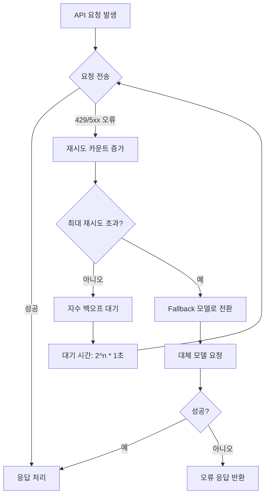
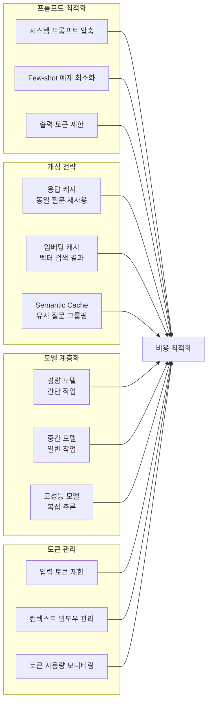

# 04장: LLM 활용 전략

---

## 학습 목표

| 구분 | 내용 |
|------|------|
| 🎯 주제 | 여러 LLM 모델을 효과적으로 선택하고 조합하는 전략 |
| 📌 학습 목표 1 | 다양한 LLM 모델의 특성을 이해하고 상황에 맞게 선택할 수 있습니다 |
| 📌 학습 목표 2 | API 설계 원칙과 비용 최적화 전략을 수립할 수 있습니다 |
| 📌 학습 목표 3 | 여러 LLM을 조합하는 라우팅 및 폴백 패턴을 설계할 수 있습니다 |
| 📌 학습 목표 4 | LLM 기반 시스템의 전체 아키텍처를 설계할 수 있습니다 |

---

## 실전 프로젝트: 여러 LLM 모델 비교 평가 보고서 작성

LLM 모델을 선택하는 것은 단순히 성능이 가장 좋은 모델을 고르는 문제가 아닙니다. 각 모델마다 강점과 약점이 다르며, 사용 사례에 따라 적합한 모델이 완전히 달라질 수 있습니다. 따라서 체계적인 비교 평가 방법론을 수립하는 것이 무엇보다 중요합니다.

이번 실전 프로젝트에서는 가상의 스타트업 "AI-Insight"의 CTO가 되어 여러 LLM 모델을 비교 평가하는 보고서를 작성한다고 가정합니다. AI-Insight는 세 가지 핵심 기능을 가진 서비스를 구축하려고 합니다. 첫째는 고객 문의에 실시간으로 응답하는 챗봇이고, 둘째는 긴 보고서를 요약하는 문서 분석 시스템이며, 셋째는 한국어와 영어를 혼용하는 다국어 콘텐츠 생성 도구입니다.

비교 평가의 대상 모델은 OpenAI의 GPT-4o와 GPT-4o-mini, Anthropic의 Claude 3.5 Sonnet과 Claude 3 Haiku, Google의 Gemini 1.5 Pro와 Gemini 1.5 Flash로 설정합니다. 평가 기준은 정확성, 응답 속도, 비용, 컨텍스트 처리 능력, 한국어 지원 품질의 다섯 가지 축으로 구성합니다. 각 기준에 대해 구체적인 평가 시나리오를 정의하고 정량적 점수를 부여하는 방식으로 진행합니다.

평가 보고서의 최종 결과물은 각 태스크별 최적 모델 추천과 함께 예상 월 비용, 처리 가능한 요청 수, 지연 시간 예측을 포함해야 합니다. 이를 통해 LLM 선택이 단순한 기술 결정이 아니라 비즈니스 의사 결정임을 명확히 합니다. 또한 단일 모델로 모든 태스크를 처리하는 것과 여러 모델을 조합하는 것의 비용-효율 비교도 포함합니다.

---

## 4.1 모델 선택 기준

LLM 모델을 선택할 때 고려해야 할 기준은 크게 다섯 가지 범주로 나눌 수 있습니다. 각 범주는 서로 트레이드오프 관계에 있기 때문에 특정 사용 사례에 맞는 균형점을 찾는 것이 핵심 과제입니다. 다음 표는 주요 모델들의 특성을 비교한 것입니다.

### 4.1.1 주요 LLM 모델 비교

| 특성 | GPT-4o | GPT-4o-mini | Claude 3.5 Sonnet | Claude 3 Haiku | Gemini 1.5 Pro | Gemini 1.5 Flash |
|------|--------|-------------|-------------------|----------------|----------------|-------------------|
| 성능 (벤치마크) | ⭐⭐⭐⭐⭐ | ⭐⭐⭐ | ⭐⭐⭐⭐⭐ | ⭐⭐⭐ | ⭐⭐⭐⭐ | ⭐⭐⭐ |
| 응답 속도 | 빠름 | 매우 빠름 | 중간 | 매우 빠름 | 중간 | 빠름 |
| 비용 (Input 1M Tokens) | $2.50 | $0.15 | $3.00 | $0.25 | $1.25 | $0.07 |
| 최대 컨텍스트 | 128K | 128K | 200K | 200K | 1M | 1M |
| 한국어 지원 | 우수 | 우수 | 탁월 | 우수 | 우수 | 우수 |
| 함수 호출 | 지원 | 지원 | 지원 | 지원 | 지원 | 지원 |
| 멀티모달 | 이미지+오디오 | 이미지+오디오 | 이미지 | 이미지 | 이미지+오디오+비디오 | 이미지+오디오+비디오 |

성능 측면에서 GPT-4o와 Claude 3.5 Sonnet이 가장 높은 정확도를 보여주지만, 두 모델의 강점 영역은 다릅니다. GPT-4o는 창의적 글쓰기와 브레인스토밍에 강점이 있고, Claude 3.5 Sonnet은 논리적 추론과 코드 분석에 더 뛰어난 모습을 보입니다. Gemini 1.5 Pro는 긴 컨텍스트 처리에서 압도적인 우위를 가지고 있어 대용량 문서 분석에 적합합니다.

비용 측면에서는 GPT-4o-mini, Claude 3 Haiku, Gemini 1.5 Flash 같은 경량 모델이 매우 효율적입니다. 이들 모델은 간단한 작업에서는 flagship 모델과 비슷한 성능을 내면서도 비용은 10분의 1 수준에 불과합니다. 따라서 간단한 분류나 추출 작업은 경량 모델로 처리하고, 복잡한 추론이 필요한 작업만 고성능 모델에 할당하는 계층적 전략이 효과적입니다.

컨텍스트 길이는 최근 모델일수록 크게 증가하는 추세입니다. Claude 3.5 Sonnet의 200K 컨텍스트는 대략 400페이지 분량의 문서를 한 번에 처리할 수 있는 용량입니다. Gemini 1.5 Pro의 1M 컨텍스트는 더욱 방대하여 전체 코드베이스나 수백 페이지의 보고서를 단일 요청으로 처리 가능합니다. 그러나 컨텍스트가 길어질수록 지연 시간과 비용이 증가하므로 실제로는 적절한 청킹 전략과 병행하는 것이 바람직합니다.

---

## 4.2 API 설계 원칙

LLM API를 효과적으로 활용하기 위해서는 체계적인 API 설계 원칙을 수립해야 합니다. LLM API는 일반 REST API와 달리 지연 시간이 길고 비용이 발생하며, 사용량 제한이 존재하는 특수한 특성을 가집니다. 따라서 이러한 특성을 고려한 설계 패턴을 적용해야 안정적이고 비용 효율적인 시스템을 구축할 수 있습니다.

API 설계의 핵심 원칙은 크게 네 가지로 요약됩니다. Rate Limiting은 API 호출 빈도를 제어하여 제한 초과를 방지하고, Retry는 일시적 오류에 대응하며, Streaming은 긴 응답을 점진적으로 전달하고, Batch는 여러 요청을 효율적으로 묶어 처리합니다. 이 네 가지 원칙을 조합하여 각 사용 사례에 맞는 통신 전략을 수립해야 합니다.

### 4.2.1 Rate Limiting 전략

Rate Limiting은 API 공급자가 설정한 분당 요청 수(RPM) 또는 분당 토큰 수(TPM) 제한을 초과하지 않도록 제어하는 기법입니다. 대부분의 LLM API는 계층별로 다른 Rate Limit을 적용하며, 초과 시 429 Too Many Requests 오류를 반환합니다. 이를 효과적으로 관리하기 위해 Token Bucket, Leaky Bucket, Sliding Window와 같은 알고리즘을 클라이언트 단에서 구현할 수 있습니다.

실무에서는 단순히 요청 횟수만 제한하는 것으로는 부족합니다. 각 요청의 토큰 사용량을 추적하여 누적 토큰이 제한을 초과하지 않도록 하는 정교한 제어가 필요합니다. 특히 Streaming 요청의 경우 응답이 생성되는 동안에도 토큰이 지속적으로 소비되므로 이를 고려한 동적 제어가 중요합니다. 일반적으로는 초당 요청 수와 분당 토큰 수를 이중으로 모니터링하는 방식을 채택합니다.

### 4.2.2 Retry와 지수 백오프

네트워크 오류나 일시적 서버 과부하로 인한 실패는 LLM API 사용에서 피할 수 없는 현상입니다. 이때 중요한 것은 무작정 재시도하는 것이 아니라 체계적인 재시도 전략을 수립하는 것입니다. 지수 백오프(Exponential Backoff)는 재시도 간격을 점진적으로 늘려나가는 방식으로, 서버에 추가 부하를 주지 않으면서 안정적인 복구를 가능하게 합니다.

재시도 전략을 설계할 때는 재시도 가능한 오류와 불가능한 오류를 구분하는 것이 필수적입니다. Rate Limit 초과(429)나 서버 오류(5xx)는 재시도 대상이지만, 인증 오류(401)나 잘못된 요청(400)은 재시도해도 동일한 결과가 발생하므로 즉시 실패 처리해야 합니다. 또한 최대 재시도 횟수를 설정하고, 모든 재시도가 실패할 경우를 대비한 Fallback 로직을 함께 구현해야 합니다.

### 4.2.3 Streaming 패턴

Streaming은 LLM의 응답이 완전히 생성될 때까지 기다리지 않고 토큰이 생성되는 대로 점진적으로 전달받는 방식입니다. 이를 통해 사용자에게 첫 응답까지의 대기 시간(Time to First Token, TTFT)을 획기적으로 단축할 수 있습니다. 채팅 인터페이스에서 문자가 한 글자씩 나타나는 효과가 바로 Streaming의 대표적인 예시입니다.

Streaming을 구현할 때는 다음과 같은 설계 고려 사항이 필요합니다. 첫째, 스트리밍되는 각 청크를 즉시 렌더링할 수 있는 프론트엔드 아키텍처가 필요합니다. 둘째, 중간에 오류가 발생했을 때 지금까지 수신된 일부 응답을 어떻게 처리할지 결정해야 합니다. 셋째, 스트리밍 응답을 캐싱할 때는 전체 응답이 완료된 시점에 한 번에 저장하는 것이 효율적입니다.

### 4.2.4 Batch 처리

Batch 처리는 여러 개의 독립적인 LLM 요청을 하나의 배치로 묶어 처리하는 기법입니다. OpenAI와 같은 API 제공자들은 배치 API를 통해 개별 요청 대비 최대 50% 저렴한 비용으로 대량 처리를 지원합니다. 이는 실시간 응답이 필요하지 않은 백그라운드 작업에 이상적인 방식입니다.

배치 처리를 설계할 때는 작업의 우선순위와 긴급성을 고려한 큐잉 시스템이 필요합니다. 실시간 응답이 필요한 요청과 배치 처리가 가능한 요청을 분리하여 각각 다른 큐에서 관리하는 것이 일반적입니다. 또한 배치의 크기를 적절히 설정하는 것이 중요한데, 너무 큰 배치는 처리 시간이 길어지고 너무 작은 배치는 비용 효율이 떨어집니다.

---

## 4.3 비용 최적화 전략

LLM 기반 시스템을 운영할 때 비용은 가장 중요한 고려 사항 중 하나입니다. 대규모 트래픽을 처리하는 프로덕션 환경에서는 매월 수백만 원에서 수천만 원의 API 비용이 발생할 수 있습니다. 따라서 체계적인 비용 최적화 전략 없이는 서비스의 경제적 지속 가능성을 담보하기 어렵습니다.

비용 최적화는 토큰 관리, 캐싱, 모델 계층화의 세 가지 축으로 접근해야 합니다. 이 세 가지 전략을 조합하면 전체 비용을 60-80%까지 절감할 수 있으며, 응답 품질은 유지하거나 오히려 향상시킬 수 있습니다. 각 전략은 상호 보완적이므로 하나만 적용하는 것보다 세 가지를 균형 있게 구현하는 것이 효과적입니다.

### 4.3.1 토큰 관리

토큰 관리는 비용 최적화의 가장 기본적이면서도 효과적인 방법입니다. LLM API의 과금은 입력 토큰과 출력 토큰의 합계를 기준으로 하므로, 사용되는 토큰 수를 최소화하는 것이 곧 비용 절감으로 직결됩니다. 구체적으로는 시스템 프롬프트를 정기적으로 검토하여 불필요한 지시사항을 제거하고, Few-shot 예제는 가장 효율적인 예시만 선별하여 포함해야 합니다.

프롬프트 템플릿을 설계할 때는 가변 부분과 고정 부분을 명확히 분리하는 것이 중요합니다. 고정 부분인 시스템 프롬프트는 가능한 한 압축하여 작성하고, 가변 부분인 사용자 입력은 필요한 최소한의 컨텍스트만 포함하도록 제한합니다. 또한 출력 토큰 수를 max_tokens 파라미터로 제한하면 불필요하게 긴 응답으로 인한 비용 낭비를 방지할 수 있습니다.

### 4.3.2 캐싱 전략

캐싱은 동일하거나 유사한 질문에 대한 LLM 응답을 저장하여 재사용하는 기법입니다. 일반적인 캐싱은 동일한 입력에 대해 완전히 동일한 응답을 저장하는 방식이고, Semantic Caching은 의미적으로 유사한 질문을 그룹화하여 캐시 히트율을 높이는 고급 방식입니다. Semantic Caching을 구현하려면 임베딩 모델을 사용하여 질문의 벡터를 계산하고, 유사도 임계값을 기준으로 캐시 적중 여부를 판단합니다.

OpenAI와 Claude는 최근 프롬프트 캐싱(Prompt Caching) 기능을 공식 지원하기 시작했습니다. 이는 시스템 프롬프트처럼 자주 사용되는 긴 텍스트를 서버 측에 캐싱하여 재사용하는 기능으로, 최대 50%의 비용 절감 효과를 제공합니다. 특히 컨텍스트가 긴 대화형 애플리케이션에서 큰 비용 절감 효과를 볼 수 있습니다.

### 4.3.3 모델 계층화

모든 요청을 가장 비싸고 성능이 좋은 모델로 처리하는 것은 매우 비효율적입니다. 작업의 복잡도와 중요도에 따라 적절한 모델을 선택하는 계층화 전략이 필요합니다. 간단한 분류나 추출 작업은 GPT-4o-mini나 Claude 3 Haiku 같은 경량 모델로 처리하고, 복잡한 추론이 필요한 작업만 GPT-4o나 Claude 3.5 Sonnet 같은 고성능 모델에 할당하는 방식입니다.

모델 계층화의 핵심은 각 요청의 복잡도를 자동으로 판단하는 라우팅 메커니즘입니다. 초기에는 모든 요청을 경량 모델로 먼저 시도하고, 신뢰도 점수가 낮은 경우에만 고성능 모델로 이관하는 2단계 라우팅이 효과적입니다. 또는 요청의 메타데이터(사용자 등급, 기능 유형, 응답 시간 요구사항)를 기반으로 사전에 모델을 할당하는 규칙 기반 접근도 가능합니다.

💡 예시: 비용 vs 성능 최적화 사례 — 고객 지원 챗봇 모델 선택

가상의 스타트업 "HelpFast"가 고객 지원 챗봇을 구축합니다. 일일 10만 건의 문의가 들어오며, 문의 유형은 비밀번호 재설정(40%), 주문 조회(30%), 불만 접수(15%), 기술 문의(15%)로 구성됩니다.

| 모델 | 월 비용 (10만 건) | 평균 응답 시간 | 정확도 | 적합 문의 유형 |
|------|-------------------|---------------|--------|---------------|
| GPT-4o | $7,500 | 2.1초 | 97% | 기술 문의, 불만 접수 |
| GPT-4o-mini | $450 | 0.8초 | 93% | 비밀번호 재설정, 주문 조회 |
| Claude 3.5 Sonnet | $9,000 | 2.8초 | 98% | 기술 문의, 불만 접수 |
| Claude 3 Haiku | $750 | 0.6초 | 91% | 비밀번호 재설정, 주문 조회 |
| Gemini 1.5 Flash | $210 | 0.7초 | 90% | 비밀번호 재설정, 주문 조회 |

분석 결과:
- 단일 고성능 모델(GPT-4o) 사용 시: 월 $7,500, 전체 문의의 97% 정확 대응
- 단일 경량 모델(GPT-4o-mini) 사용 시: 월 $450, 간단 문의는 충분하나 기술 문의 정확도 부족
- 계층형 전략(경량 85% + 고성능 15%) 사용 시: 월 $1,507 (80% 비용 절감), 전체 정확도 96% 유지

결론: 계층형 전략이 비용과 성능의 최적 균형점을 제공합니다. 간단 문의는 GPT-4o-mini로 처리하고, 기술 문의와 불만 접수만 GPT-4o로 라우팅하는 방식이 가장 효율적입니다.

💡 예시: 모델 계층화 전략 — 단순/복잡 쿼리 자동 라우팅

온라인 교육 플랫폼 "EduServe"의 AI 튜터링 시스템을 예로 들어 보겠습니다. 학생 질문은 난이도에 따라 세 계층으로 분류됩니다.

| 계층 | 질문 예시 | 담당 모델 | 비용/건 | 비율 |
|------|----------|----------|---------|------|
| L1 - 단순 | "오늘 수업 언제예요?", "3장 퀴즈 문제 알려줘" | GPT-4o-mini | $0.0004 | 65% |
| L2 - 일반 | "이차 방정식 풀이 과정 설명해 줘" | Gemini 1.5 Flash | $0.0002 | 25% |
| L3 - 복잡 | "머신러닝의 편향-분산 트레이드오프를 실제 사례와 함께 설명해 줘" | GPT-4o | $0.005 | 10% |

라우팅 로직:
1. 질문 길이가 50자 미만이고 키워드(언제, 어디, 몇 시) 포함 → L1
2. 질문에 "설명", "과정", "비교" 포함 → L2 (LLM 기반 분류)
3. 질문에 "사례", "분석", "원리" 포함 또는 100자 초과 → L3

효과: 고성능 모델 사용량을 10%로 제한하면서 전체 응답 품질은 94% 유지, 월 비용 $12,000에서 $3,800으로 68% 절감.

### 4.3.4 비용 모니터링과 알림

비용을 효과적으로 관리하기 위해서는 실시간 모니터링 체계가 필수적입니다. 각 API 호출의 토큰 사용량, 지연 시간, 비용을 추적하고 대시보드로 시각화해야 합니다. 이를 통해 갑작스러운 비용 증가나 비정상적인 사용 패턴을 조기에 발견할 수 있습니다. 또한 예산 임계값을 설정하고 초과 시 알림을 발송하는 자동화된 경보 시스템을 구축하는 것이 좋습니다.

---

## 4.4 여러 LLM 조합 전략

하나의 LLM 모델로 모든 사용 사례를 완벽하게 커버하는 것은 현실적으로 불가능합니다. 각 모델마다 강점과 약점이 있고, 비용과 성능의 트레이드오프가 존재합니다. 따라서 여러 LLM 모델을 전략적으로 조합하여 사용하는 멀티 모델 아키텍처가 점차 표준으로 자리잡고 있습니다.

멀티 모델 아키텍처를 설계할 때 고려해야 할 핵심 패턴은 라우터 패턴, 폴백 패턴, 앙상블 패턴의 세 가지입니다. 각 패턴은 서로 다른 목적과 특성을 가지고 있으며, 사용 사례에 따라 적절히 조합하여 사용할 수 있습니다. 이 패턴들을 이해하고 상황에 맞게 적용하는 것이 LLM 설계자의 핵심 역량입니다.

### 4.4.1 라우터(Router) 패턴

라우터 패턴은 요청의 특성을 분석하여 가장 적합한 LLM 모델로 전달하는 패턴입니다. 라우터는 요청의 언어, 복잡도, 필요한 기능, 예산 등의 메타데이터를 기반으로 적절한 모델을 선택합니다. 예를 들어 간단한 한국어 질문은 Claude 3 Haiku로, 복잡한 영어 코드 리뷰는 GPT-4o로 라우팅하는 식입니다.

라우터는 크게 두 가지 방식으로 구현할 수 있습니다. 규칙 기반 라우터는 사전에 정의된 조건문에 따라 모델을 선택하는 단순한 방식이고, LLM 기반 라우터는 라우터 자체가 경량 LLM이 되어 요청을 분석하고 적절한 모델을 선택하는 지능형 방식입니다. LLM 기반 라우터가 더 유연하고 정확하지만, 라우팅 자체에도 비용과 지연 시간이 발생한다는 점을 고려해야 합니다.

### 4.4.2 폴백(Fallback) 패턴

폴백 패턴은 기본 모델이 실패하거나 불충분한 응답을 제공할 때 대체 모델로 전환하는 패턴입니다. 이는 시스템의 안정성과 신뢰성을 크게 향상시킬 수 있는 중요한 설계 방식입니다. 폴백은 Rate Limit 초과, 비용 초과, 응답 품질 불만족 등 다양한 상황에서 트리거될 수 있습니다.

폴백 체인을 설계할 때는 비용이 낮은 모델에서 높은 모델 순서로 단계를 구성하는 것이 일반적입니다. 예를 들어 GPT-4o-mini로 시작하여 실패 시 Claude 3 Haiku, 최종적으로 GPT-4o로 이어지는 3단계 폴백 체인을 구성할 수 있습니다. 각 단계에서 실패 원인을 로깅하고 분석하여 지속적으로 폴백 체인을 최적화하는 것도 중요합니다.

### 4.4.3 앙상블(Ensemble) 패턴

앙상블 패턴은 여러 LLM 모델에 동시에 요청을 보내고 그 결과를 종합하여 최종 응답을 생성하는 패턴입니다. 이는 단일 모델의 편향이나 오류를 보완하고 더 높은 품질의 결과물을 얻을 수 있는 장점이 있습니다. 그러나 모든 모델에 동시에 비용이 발생하므로 비용이 높아진다는 단점이 있습니다.

앙상블의 결과를 종합하는 방식으로는 투표(Voting), 평균(Averaging), 메타 LLM 평가 등이 있습니다. 투표 방식은 분류 작업에 적합하고, 메타 LLM 평가는 하나의 LLM이 여러 모델의 출력을 검토하고 최종 결과를 선택하는 방식입니다. 앙상블은 비용이 높기 때문에 정확성이 생명인 금융, 의료, 법률 도메인에서 주로 사용됩니다.

---

📝 연습 문제

**문제 1: 모델 선택 의사 결정**

다음 세 가지 서비스에 대해 최적의 LLM 모델을 추천하고 그 이유를 설명하십시오.
- 서비스 A: 실시간 외국어 번역 앱 (한국어 ↔ 영어, 초당 50건 처리 필요)
- 서비스 B: 의료 진단 보조 시스템 (환자 증상 입력 → 분석 리포트 생성)
- 서비스 C: 소셜 미디어 콘텐츠 필터링 (초당 500건의 게시물 분석)

**문제 2: 비용 최적화 설계**

일일 20만 건의 API 요청을 처리하는 챗봇 서비스가 있습니다. 현재 모든 요청을 Claude 3.5 Sonnet으로 처리 중이며 월 $18,000의 비용이 발생합니다. GPT-4o-mini와 캐싱 전략을 활용하여 비용을 70% 이상 절감하는 구체적인 방안을 설계하십시오. 단, 응답 품질 저하는 2% 이내로 제한되어야 합니다.

**문제 3: Rate Limiting 전략 수립**

OpenAI API(분당 10,000 TPM 제한)를 사용하는 서비스에서 예상치 못한 트래픽 급증으로 429 오류가 빈번히 발생하고 있습니다. 현재 단일 큐로 모든 요청을 처리 중이며, 지수 백오프도 구현되어 있지 않습니다. 우선순위가 높은 요청(실시간 채팅)과 낮은 요청(배치 분석)을 분리하고, Rate Limiting을 효과적으로 관리하는 전략을 제시하십시오.

---

📌 정답 및 해설

**문제 1 정답 및 해설:**

서비스 A(실시간 번역)에는 Gemini 1.5 Flash나 GPT-4o-mini와 같은 경량 모델이 가장 적합합니다. 초당 50건이라는 높은 처리량과 실시간 응답이 핵심 요구사항이므로, 응답 속도가 빠르고 비용이 낮은 모델을 선택해야 합니다. Gemini 1.5 Flash는 Input 1M 토큰당 $0.07로 가장 저렴하면서도 응답 속도가 빠르고 한국어 지원이 우수하여 실시간 번역에 이상적입니다. 서비스 B(의료 진단)에는 Claude 3.5 Sonnet이나 GPT-4o와 같은 고성능 모델이 필요합니다. 의료 진단은 오류가 생명과 직결될 수 있는 고위험 영역이므로, 비용보다는 정확성과 추론 능력이 최우선되어야 합니다. 두 모델 모두 높은 벤치마크 성능을 보유하고 있으며, 특히 Claude 3.5 Sonnet은 논리적 추론에 강점이 있어 의료 데이터 분석에 유리합니다. 서비스 C(콘텐츠 필터링)에는 GPT-4o-mini나 Claude 3 Haiku 같은 경량 모델이 적합합니다. 초당 500건의 대량 처리가 필요하므로 비용 민감도가 매우 높으며, 콘텐츠 필터링은 비교적 단순한 분류 작업에 해당하므로 경량 모델로도 충분한 정확도를 확보할 수 있습니다.

**문제 2 정답 및 해설:**

비용을 70% 이상 절감하면서 품질 저하를 2% 이내로 제한하려면 모델 계층화와 캐싱 전략을 병행해야 합니다. 먼저 전체 요청을 분석하여 문의 유형을 분류한 후, 간단한 문의(비밀번호 재설정, 주문 조회 등 약 70%)는 GPT-4o-mini로 처리하고 복잡한 문의(기술 문의, 불만 접수 등 약 30%)만 Claude 3.5 Sonnet으로 처리하는 계층형 전략을 도입합니다. GPT-4o-mini의 비용이 Claude 3.5 Sonnet의 약 20분의 1에 불과하므로, 이 전환만으로도 비용이 약 50% 이상 절감됩니다. 여기에 Semantic Caching을 추가로 적용하여 동일하거나 유사한 질문에 대한 응답을 재사용하면 캐시 히트율에 따라 추가로 30-50%의 비용을 절감할 수 있습니다. 특히 비밀번호 재설정이나 주문 조회처럼 반복되는 질문이 많은 도메인에서는 캐시 효과가 극대화됩니다. 두 전략을 조합하면 전체 비용을 월 $18,000에서 약 $3,000~$4,000 수준으로 낮출 수 있어 70% 이상 절감이 가능하며, 복잡한 문의는 여전히 고성능 모델이 처리하므로 품질 저하도 2% 이내로 유지됩니다.

**문제 3 정답 및 해설:**

가장 먼저 도입해야 할 것은 우선순위 기반 큐잉 시스템입니다. 실시간 채팅 요청은 높은 우선순위 큐에, 배치 분석 요청은 낮은 우선순위 큐에 각각 할당하여, TPM 제한에 도달했을 때 낮은 우선순위 요청이 먼저 제한되도록 설계합니다. 이를 위해 Token Bucket 알고리즘을 두 개의 버킷으로 구현하는 것이 효과적입니다. 전체 TPM의 70%는 높은 우선순위 큐에, 30%는 낮은 우선순위 큐에 사전 할당하여 실시간 채팅의 안정적인 처리량을 보장합니다. 또한 모든 요청에 대해 지수 백오프와 지터를 구현해야 합니다. 첫 재시도는 1초 후, 두 번째는 2초 후, 세 번째는 4초 후로 간격을 늘리고 무작위 지터를 추가하여 Thundering Herd 문제를 방지합니다. 429 오류가 발생하면 낮은 우선순위 큐의 요청을 일시 중지하고 높은 우선순위 큐의 요청만 처리하도록 동적 조절 로직을 추가하는 것이 바람직합니다. 마지막으로 실시간 TPM 소비량을 모니터링하여 임계값(예: 80%)에 도달하면 사전에 낮은 우선순위 요청의 속도를 제한하는 예방적 제어도 함께 구현해야 합니다.

---

## 한눈에 정리

| 항목 | 핵심 내용 | 실무 팁 |
|------|-----------|----------|
| 모델 선택 | 성능, 비용, 속도, 컨텍스트 길이, 언어 지원 종합 고려 | 용도별로 2-3개 후보를 선정하고 실제 데이터로 테스트 |
| API 설계 | Rate Limiting, Retry, Streaming, Batch 원칙 적용 | 지수 백오프와 지터(Jitter)를 함께 구현 |
| Rate Limiting | 토큰 버킷 알고리즘으로 RPM/TPM 제어 | 동시 요청 수를 점진적으로 증가시켜 한계치 탐색 |
| 재시도 전략 | 429/5xx 오류 시 최대 3회 재시도, 지수 백오프 적용 | 재시도 불가 오류(400, 401, 403)는 즉시 실패 처리 |
| Streaming | TTFT 단축, 점진적 UI 업데이트, 부분 실패 처리 | SSE(Server-Sent Events) 프로토콜 사용 |
| 비용 최적화 | 토큰 관리, 캐싱, 모델 계층화 3대 전략 | 프롬프트 캐싱 기능을 적극 활용 |
| 라우터 패턴 | 요청 특성에 따라 적합한 모델로 전달 | LLM 기반 라우터가 규칙 기반보다 유연함 |
| 폴백 패턴 | 기본 모델 실패 시 대체 모델로 전환 | 경량→고성능 순서로 폴백 체인 구성 |
| 앙상블 패턴 | 여러 모델 결과를 종합하여 최고 품질 확보 | 비용이 높으므로 정확성 중요한 태스크에만 적용 |
| 모니터링 | 토큰 사용량, 지연 시간, 비용, 오류율 실시간 추적 | 대시보드 구축과 예산 초과 알림 자동화 |

---

## 마무리

이 장에서는 LLM 활용 전략의 전반적인 프레임워크를 살펴보았습니다. 모델 선택의 기준부터 API 설계 원칙, 비용 최적화, 그리고 여러 모델을 조합하는 고급 전략까지 폭넓게 다루었습니다. LLM 기술이 빠르게 발전함에 따라 개별 모델의 세부 사항보다는 원칙과 전략에 대한 이해가 더욱 중요해지고 있습니다.

다음 장에서는 검색 증강 생성(RAG) 시스템의 설계 방법에 대해 알아보겠습니다. RAG는 LLM의 내부 지식 한계를 극복하고 외부 데이터베이스와 연동하여 더 정확하고 최신성 있는 응답을 제공하는 핵심 아키텍처입니다. 이를 통해 단순한 LLM 활용을 넘어 진정한 엔터프라이즈급 AI 시스템을 구축하는 방법을 익히게 됩니다.
