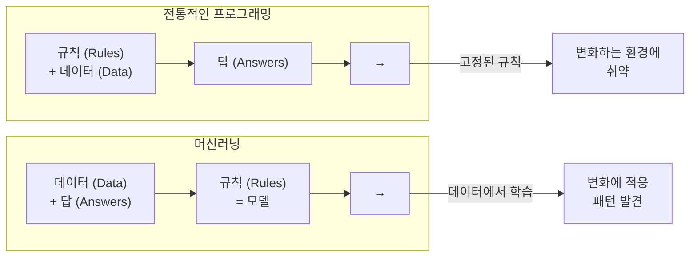
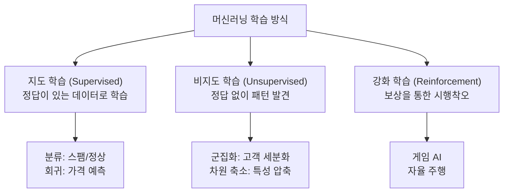
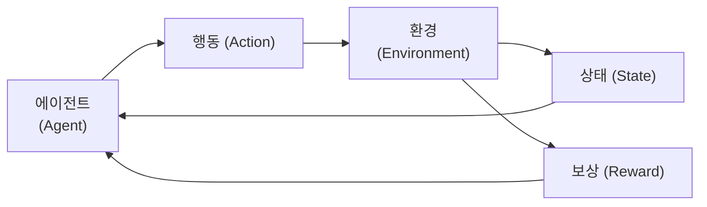
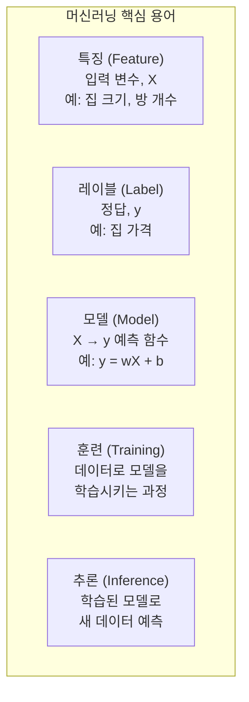
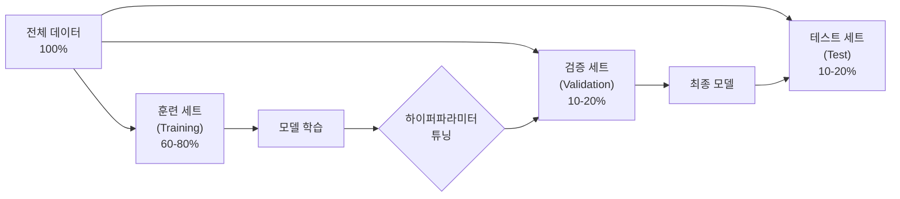
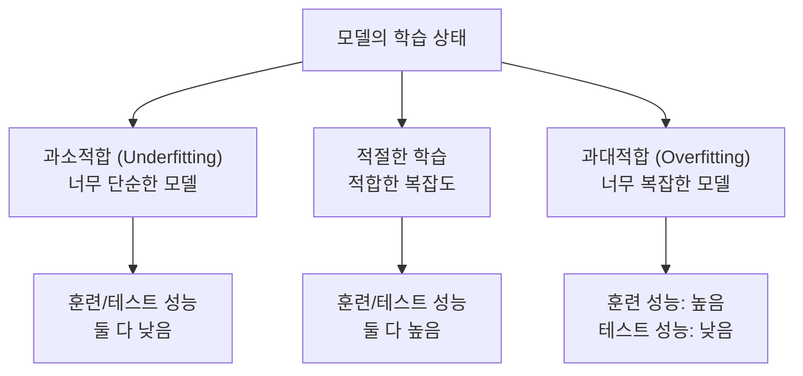
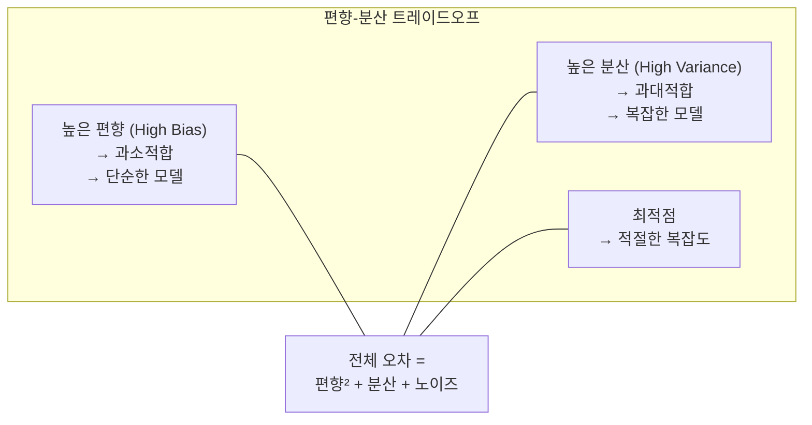
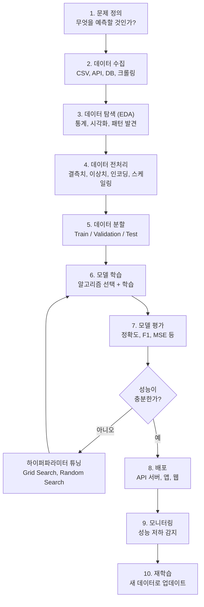

# 05장: 머신러닝 개념

> **🎯 학습 목표**
> - 머신러닝의 3가지 학습 방식(지도, 비지도, 강화학습)을 이해합니다.
> - 특징, 레이블, 모델의 개념을 설명할 수 있습니다.
> - 과대적합과 과소적합의 차이와 대처 방법을 이해합니다.
> - 편향-분산 트레이드오프의 개념을 직관적으로 이해합니다.

---

## 👨‍💻 실전 프로젝트: 당뇨병 예측 모델 만들기

이론을 배우기에 앞서, 먼저 실제 머신러닝 프로젝트가 어떤 흐름으로 진행되는지 직접 경험해 보겠습니다. Scikit-learn 라이브러리에 내장된 당뇨병(diabetes) 데이터셋을 사용하여, 환자의 여러 의학적 특성으로부터 당뇨병 진행 정도를 예측하는 회귀 모델을 처음부터 끝까지 구축해 볼 것입니다. 이 과정에서 데이터를 불러오고, 훈련용과 테스트용으로 분할하며, 선형 회귀 모델을 학습시키고, 최종적으로 모델의 예측 성능을 평가하는 전반적인 워크플로우를 체험할 수 있습니다.

```python
# 1. 필요한 라이브러리를 불러옵니다
from sklearn.datasets import load_diabetes   # 당뇨병 데이터셋 로드 함수
from sklearn.model_selection import train_test_split  # 데이터 분할 함수
from sklearn.linear_model import LinearRegression  # 선형 회귀 모델
from sklearn.metrics import mean_squared_error, r2_score  # 성능 평가 지표

# 2. 당뇨병 데이터셋을 불러옵니다
diabetes = load_diabetes()
# 설명: load_diabetes()는 당뇨병 환자의 10가지 특성(나이, 성별, BMI, 혈압 등)과
# 1년 후 당뇨병 진행 정도를 수치로 담고 있는 Bunch 객체를 반환합니다.

# 3. 특징(입력)과 레이블(정답)을 분리합니다
X = diabetes.data    # 특징 배열: (442, 10) 형태, 442명의 환자, 10개의 특성
y = diabetes.target  # 레이블 배열: (442,) 형태, 각 환자의 당뇨병 진행 정도
# 설명: X는 2차원 배열로 각 행이 한 명의 환자, 각 열이 하나의 의학적 특성입니다.
# y는 1차원 배열로 각 환자에 대응하는 당뇨병 진행 정도 수치(정답)입니다.
# 출력 예: X.shape → (442, 10), y.shape → (442,)

# 4. 데이터를 훈련 세트와 테스트 세트로 분할합니다
X_train, X_test, y_train, y_test = train_test_split(
    X, y, test_size=0.2, random_state=42
)
# 설명: 전체 데이터의 80%(약 354개)는 모델 학습에 사용하고, 20%(약 88개)는
# 평가용으로 따로 떼어 놓습니다. random_state=42는 난수 시드를 고정하여
# 실행할 때마다 동일하게 분할되도록 합니다.
# 출력 예: X_train.shape → (354, 10), X_test.shape → (88, 10)

# 5. 선형 회귀 모델을 생성하고 학습시킵니다
model = LinearRegression()
model.fit(X_train, y_train)
# 설명: LinearRegression()은 가장 기본적인 회귀 알고리즘으로, 입력 특성들과
# 정답 사이의 선형 관계를 학습합니다. fit() 메서드에 훈련 데이터를 전달하면
# 모델이 데이터 속의 패턴을 스스로 찾아내어 최적의 가중치를 계산합니다.

# 6. 학습된 모델로 테스트 데이터의 당뇨병 진행 정도를 예측합니다
y_pred = model.predict(X_test)
# 설명: predict() 메서드는 학습된 모델이 새롭게 본 테스트 데이터에 대해
# 가장 적합한 예측값을 계산하여 반환합니다. 반환값은 (88,)形状의 배열입니다.

# 7. 모델의 성능을 평가합니다
mse = mean_squared_error(y_test, y_pred)
r2 = r2_score(y_test, y_pred)
print(f"평균 제곱 오차 (MSE): {mse:.2f}")
print(f"결정 계수 (R²): {r2:.2f}")
# 설명: MSE는 예측값과 실제값 사이의 차이를 제곱하여 평균한 값으로,
# 작을수록 모델의 성능이 좋습니다. R²는 모델이 데이터를 얼마나 잘 설명하는지를
# 0~1 사이의 값으로 나타내며, 1에 가까울수록 완벽한 예측에 가깝습니다.
# 출력 예: MSE ≈ 2900~3000 사이, R² ≈ 0.45~0.50 사이
```

위 프로젝트에서 우리는 데이터를 불러오고(`load_diabetes`), 특징과 레이블을 분리한 뒤(`data`, `target`), 데이터를 훈련용과 테스트용으로 나누고(`train_test_split`), 모델을 학습시킨 후(`fit`), 예측하고(`predict`), 성능을 평가(`mean_squared_error`, `r2_score`)하는 일련의 과정을 경험하였습니다. 이 모든 단계는 머신러닝 프로젝트가 항상 거치는 기본적인 파이프라인이며, 앞으로 배울 모든 이론이 실제로는 이와 같은 형태로 적용됩니다. 이제부터 각 개념이 왜 필요한지, 어떤 원리로 동작하는지 하나씩 자세히 알아보겠습니다.

---

## 5.1 머신러닝이란?

**머신러닝(Machine Learning, ML)** 은 데이터로부터 패턴을 학습하여 예측이나 결정을 수행하는 알고리즘의 집합입니다. 전통적인 프로그래밍과의 차이는 다음과 같습니다.



전통적인 프로그래밍은 사람이 직접 작성한 규칙(예: "계좌 잔액이 출금액보다 크면 승인")에 따라 입력 데이터를 처리하여 결과를 도출합니다. 이 방식은 규칙이 명확하고 환경이 변하지 않을 때 매우 효과적이지만, 규칙을 정의하기 어렵거나 환경이 끊임없이 변화하는 문제에는 취약하다는 한계가 있습니다. 반면 머신러닝은 데이터와 그에 대응하는 정답(또는 데이터 자체의 구조)으로부터 알고리즘이 스스로 규칙을 학습합니다. 그 결과 스팸 메일 탐지, 얼굴 인식, 주식 가격 예측처럼 명시적인 규칙을 정의하기 어려운 복잡한 문제에서도 뛰어난 성능을 발휘합니다.

| 구분 | 전통적 프로그래밍 | 머신러닝 |
|------|------------------|---------|
| **접근 방식** | 사람이 규칙을 직접 코딩 | 데이터로부터 규칙을 자동 학습 |
| **적용 대상** | 규칙이 명확한 문제 | 규칙을 정의하기 어려운 문제 |
| **변화 대응** | 규칙을 수동으로 업데이트 | 새 데이터로 재학습 |
| **예시** | "계좌 잔액 ≥ 출금액" | 스팸 메일 탐지, 얼굴 인식 |

이처럼 머신러닝은 전통적인 프로그래밍과 근본적으로 다른 접근 방식을 취합니다. 그렇다면 머신러닝은 어떤 방식으로 데이터로부터 학습을 수행하는지, 학습 방식에 따른 분류를 다음 절에서 살펴보겠습니다.

---

## 5.2 학습 방식의 3가지 분류

머신러닝은 학습 데이터의 형태와 피드백 방식에 크게 세 가지로 분류됩니다. 각 방식은 서로 다른 문제 유형에 적합하며, 실무에서는 이들을 적절히 조합하여 사용하기도 합니다. 아래 다이어그램은 세 가지 학습 방식의 전체 구조와 각 방식이 주로 해결하는 문제의 예시를 한눈에 보여줍니다.



### 5.2.1 지도 학습 (Supervised Learning)

입력(X)과 정답(y)이 쌍으로 주어집니다. 모델은 입력에서 정답을 예측하도록 학습합니다.

지도 학습은 머신러닝에서 가장 널리 사용되는 학습 방식으로, 입력 데이터와 그에 대응하는 정답 레이블이 함께 제공됩니다. 모델은 주어진 입력으로부터 정답을 정확히 예측할 수 있도록 내부 파라미터를 조정해 나가며, 충분히 학습된 후에는 정답이 없는 새로운 입력에 대해서도 신뢰할 수 있는 예측을 수행할 수 있습니다. 지도 학습은 예측하려는 값이 이산적인 카테고리일 경우 **분류(Classification)** 문제, 연속적인 숫자일 경우 **회귀(Regression)** 문제로 세분화됩니다.

```python
from sklearn.linear_model import LinearRegression
import numpy as np

# 지도 학습 예: 주택 크기로 가격 예측
X = np.array([[30], [50], [80], [100], [120]])  # 주택 크기 (평)
# 설명: 입력 특징 X는 2차원 배열로, 각 행은 하나의 주택 데이터를 나타냅니다.
# 여기서는 5개 주택의 크기(평)를 특징으로 사용합니다.
y = np.array([15000, 25000, 40000, 50000, 60000])  # 가격 (만원)
# 설명: y는 각 주택에 대응하는 실제 가격(정답)으로, 모델이 예측해야 할 목표값입니다.

model = LinearRegression()
model.fit(X, y)  # 학습
# 설명: fit() 메서드는 X와 y 사이의 선형 관계(y = wX + b)를 학습합니다.
# 내부적으로 최적의 기울기(w)와 절편(b)을 계산합니다.

# 새로운 주택 가격 예측
new_house = np.array([[65]])
predicted = model.predict(new_house)
# 설명: predict()는 학습된 가중치를 바탕으로 새로운 입력 65평에 대한
# 가격을 계산합니다. 출력값은 배열 형태로 반환됩니다.
print(f"65평 주택 예측 가격: {predicted[0]:.0f}만원")
# 출력 예: "65평 주택 예측 가격: 32500만원"
```

### 5.2.2 비지도 학습 (Unsupervised Learning)

정답(y) 없이 입력(X)만 주어집니다. 데이터 자체의 구조나 패턴을 발견합니다.

비지도 학습은 정답 레이블이 없는 데이터만을 사용하여 학습이 이루어집니다. 모델은 외부의 지도 없이 데이터 자체가 가진 내재된 구조, 유사성, 또는 분포를 스스로 발견해야 합니다. 이 방식은 레이블을 구하기 어렵거나 비용이 많이 드는 현실 문제에서 특히 유용하며, 대표적으로 고객을 유사한 특성별로 묶는 **군집화(Clustering)** 와 고차원 데이터를 의미를 유지하면서 저차원으로 압축하는 **차원 축소(Dimensionality Reduction)** 가 있습니다.

```python
from sklearn.cluster import KMeans
import numpy as np

# 비지도 학습 예: 고객 군집화
X = np.random.randn(100, 2)  # 100명 고객의 2가지 특성
# 설명: 100명의 가상 고객에 대해 2개의 특성(예: 구매 빈도, 평균 구매 금액)을
# 표준 정규 분포에서 무작위로 생성합니다. 정답 레이블은 없습니다.
kmeans = KMeans(n_clusters=3, random_state=42)
kmeans.fit(X)
# 설명: KMeans 알고리즘은 데이터를 3개의 군집으로 나눕니다. fit()은 각 데이터
# 포인트를 가장 가까운 군집 중심에 할당하고, 중심점을 반복적으로 업데이트합니다.

print(f"각 고객의 군집 레이블: {kmeans.labels_[:10]}")
# 출력 예: [0 2 1 0 1 2 0 1 2 0] (10명의 고객이 각각 어느 군집에 속했는지 표시)
print(f"군집 중심점:\n{kmeans.cluster_centers_}")
# 출력 예: [[ 0.3,  0.5], [-0.2, -0.8], [ 0.7, -0.1]] (3개 군집 각각의 중심 좌표)
```

### 5.2.3 강화 학습 (Reinforcement Learning)

에이전트가 환경과 상호작용하며 **보상을 최대화**하도록 학습합니다.

강화 학습은 앞의 두 방식과 달리, 에이전트(Agent)라는 주체가 환경(Environment)과 지속적으로 상호작용하며 누적 보상(Cumulative Reward)을 최대화하는 방향으로 행동을 학습합니다. 각 행동의 결과로 환경으로부터 다음 상태(State)와 즉각적인 보상(Reward)을 받으며, 에이전트는 이를 바탕으로 장기적인 관점에서 가장 유리한 행동 전략(Policy)을 스스로 발견합니다.



> **참고:** 이 책에서는 지도 학습과 비지도 학습에 집중합니다. 강화 학습은 고급 주제로, 이 책의 범위를 벗어납니다.

지금까지 머신러닝의 세 가지 학습 방식을 각각 살펴보았습니다. 각 방식은 해결하려는 문제의 성격과 데이터의 형태에 따라 선택되며, 특히 지도 학습과 비지도 학습은 실무에서 가장 빈번하게 활용됩니다. 이어지는 절에서는 이 방식들을 이해하는 데 필수적인 핵심 용어들을 살펴보겠습니다.

---

## 5.3 핵심 용어

머신러닝을 정확히 이해하기 위해서는 반드시 알아야 하는 기본 용어들이 있습니다. 아래 다이어그램은 특징, 레이블, 모델, 훈련, 추론이라는 다섯 가지 핵심 용어와 이들 간의 관계를 시각적으로 정리한 것입니다.



### 예제로 이해하기

앞서 배운 핵심 용어들을 하나의 완전한 코드 예제로 통합하여 살펴보겠습니다. 이 예제는 주택의 크기, 방 개수, 연령이라는 세 가지 특성으로부터 주택 가격을 예측하는 전형적인 지도 학습 회귀 문제를 구현합니다. 각 코드 라인이 앞서 정의한 용어들과 어떻게 대응되는지 주목하며 읽어보시기 바랍니다.

```python
import pandas as pd
from sklearn.model_selection import train_test_split
from sklearn.linear_model import LinearRegression

# 주택 가격 데이터셋
data = {
    'size': [30, 50, 80, 100, 120, 40, 60, 90, 110, 70],  # 특징 (Feature)
    'rooms': [2, 3, 4, 4, 5, 2, 3, 4, 5, 3],
    'age': [20, 10, 5, 3, 1, 15, 8, 4, 2, 7],
    'price': [15000, 25000, 40000, 50000, 60000, 20000, 30000, 45000, 55000, 35000]  # 레이블
}
# 설명: 10개 주택에 대한 데이터로, size(평수), rooms(방 개수), age(건축 연한)는
# 특징(Feature)으로, price(가격)는 레이블(Label)로 사용됩니다.

df = pd.DataFrame(data)
# 설명: 딕셔너리를 pandas DataFrame으로 변환하여 테이블 형태로 다룰 수 있게 합니다.

# 특징과 레이블 분리
X = df[['size', 'rooms', 'age']]   # 특징 (입력)
y = df['price']                     # 레이블 (정답)
# 설명: X는 3개의 열을 가진 2차원 테이블(10×3), y는 1차원 배열입니다.

# 훈련/테스트 분할
X_train, X_test, y_train, y_test = train_test_split(X, y, test_size=0.2)
# 설명: 데이터의 80%는 모델 훈련(Training)에, 20%는 최종 평가용 테스트로 분할합니다.
# train_test_split은 데이터를 무작위로 섞은 후 지정된 비율로 나누어 줍니다.

# 모델 학습
model = LinearRegression()
model.fit(X_train, y_train)          # 훈련
# 설명: fit() 메서드를 호출하면 모델이 훈련 데이터의 패턴을 학습합니다.
# 이 과정이 바로 '훈련(Training)'입니다.

# 추론
y_pred = model.predict(X_test)       # 예측
# 설명: predict() 메서드는 학습된 모델이 테스트 데이터에 대해 가격을 예측합니다.
# 이 과정이 '추론(Inference)'이며, 모델이 실제 문제에 적용되는 순간입니다.
print(f"실제 가격: {y_test.values}")
print(f"예측 가격: {y_pred.round(0)}")
# 출력 예: 실제 가격: [40000 20000], 예측 가격: [38500. 21500.]
```

---

## 5.4 데이터 분할

모든 데이터를 학습에 사용하면 **모델이 데이터를 외워서** 새로운 데이터에 대한 성능이 떨어집니다. 따라서 데이터를 3개의 세트로 나눕니다.

머신러닝 모델의 궁극적인 목표는 학습에 사용되지 않은 새로운 데이터에 대해서도 좋은 성능을 내는 **일반화(Generalization)** 입니다. 만약 전체 데이터를 모두 모델 학습에 사용한다면, 모델은 학습 데이터의 패턴뿐만 아니라 노이즈까지 외워버려 새로운 데이터에 대한 예측 성능이 급격히 떨어지는 **과대적합(Overfitting)** 상태에 빠집니다. 이를 방지하기 위해 보유한 데이터를 훈련(Train), 검증(Validation), 테스트(Test)의 세 가지 세트로 분할하며, 각 세트는 서로 다른 목적을 가지고 사용됩니다.



| 세트 | 용도 | 사용 횟수 |
|------|------|----------|
| **훈련 (Train)** | 모델 가중치 학습 | 여러 번 |
| **검증 (Validation)** | 하이퍼파라미터 튜닝, 모델 선택 | 여러 번 |
| **테스트 (Test)** | 최종 성능 측정 | **단 한 번** |

훈련 세트는 모델의 가중치(파라미터)를 실제로 업데이트하는 학습 과정에 사용됩니다. 검증 세트는 여러 모델 후보 중 가장 좋은 것을 선택하거나 하이퍼파라미터(학습률, 트리 깊이 등 사람이 설정하는 값)를 튜닝할 때 활용됩니다. 테스트 세트는 모든 모델 선택과 튜닝이 완전히 끝난 후, 최종 모델의 일반화 성능을 객관적으로 측정하기 위해 **단 한 번만** 사용되어야 합니다. 테스트 세트를 여러 번 사용하면 모델이 테스트 세트에 간접적으로 과대적합될 수 있기 때문입니다.

```python
from sklearn.model_selection import train_test_split
import numpy as np

X = np.random.randn(1000, 10)
y = np.random.randn(1000)
# 설명: 1000개의 샘플, 10개의 특성을 가진 가상의 데이터를 생성합니다.

# Train / Test 분할
X_train, X_test, y_train, y_test = train_test_split(
    X, y, test_size=0.2, random_state=42
)
# 설명: 전체 데이터의 80%(800개)를 훈련용으로, 20%(200개)를 최종 테스트용으로 분할합니다.

# Train을 다시 Train / Validation으로 분할
X_train, X_val, y_train, y_val = train_test_split(
    X_train, y_train, test_size=0.2, random_state=42
)
# 설명: 훈련 세트 800개를 다시 80%(640개)는 실제 훈련, 20%(160개)는 검증용으로 나눕니다.
# 최종적으로 Train 640개, Validation 160개, Test 200개가 됩니다.

print(f"Train: {X_train.shape[0]} samples")
print(f"Validation: {X_val.shape[0]} samples")
print(f"Test: {X_test.shape[0]} samples")
# 출력: Train: 640 samples, Validation: 160 samples, Test: 200 samples
```

이처럼 데이터를 훈련, 검증, 테스트 세트로 분할하는 것은 모델의 일반화 성능을 확보하기 위한 필수적인 과정입니다. 그러나 적절한 분할 비율을 정했다 하더라도, 모델의 복잡도가 너무 높거나 낮으면 여전히 학습이 제대로 이루어지지 않을 수 있습니다. 다음 절에서는 이러한 모델의 복잡도와 관련된 두 가지 중요한 문제인 과대적합과 과소적합에 대해 알아보겠습니다.

---

## 5.5 과대적합과 과소적합



과소적합(Underfitting)은 모델이 너무 단순하여 데이터의 내재된 패턴을 충분히 학습하지 못하는 상태를 말합니다. 이 경우 훈련 세트와 테스트 세트 모두에서 성능이 낮게 나타나며, 모델이 데이터의 구조를 제대로 포착하지 못하고 있음을 의미합니다. 반대로 과대적합(Overfitting)은 모델이 너무 복잡하여 훈련 데이터의 미세한 노이즈까지 모두 암기해버린 상태입니다. 이때 훈련 세트에서는 매우 높은 성능을 보이지만, 새로운 데이터인 테스트 세트에서는 성능이 현저히 떨어집니다. 따라서 이상적인 모델은 훈련 세트와 테스트 세트 모두에서 일관되게 높은 성능을 보이는 **적절한 복잡도**의 모델입니다.

```python
import numpy as np
import matplotlib.pyplot as plt
from sklearn.preprocessing import PolynomialFeatures
from sklearn.linear_model import LinearRegression
from sklearn.pipeline import make_pipeline

# 데이터 생성
np.random.seed(42)
X = np.linspace(0, 10, 20)
y = np.sin(X) + np.random.randn(20) * 0.3
# 설명: 0부터 10까지 균등한 간격의 20개 점에 대해 sin 곡선에 무작위 노이즈를
# 더한 데이터를 생성합니다. 이 데이터는 비선형 패턴을 가지고 있습니다.

X_plot = np.linspace(0, 10, 100)

# 과소적합: 1차 모델 (너무 단순)
model_under = make_pipeline(PolynomialFeatures(1), LinearRegression())
model_under.fit(X[:, np.newaxis], y)
# 설명: 1차 다항식(직선)으로 데이터를 학습합니다. sin 곡선을 직선으로 표현하려
# 하므로 데이터의 패턴을 제대로 따라가지 못합니다.

# 적절: 3차 모델
model_good = make_pipeline(PolynomialFeatures(3), LinearRegression())
model_good.fit(X[:, np.newaxis], y)
# 설명: 3차 다항식은 sin 곡선의 주요 굴곡을 적절히 따라갈 수 있는 복잡도를
# 가집니다. 노이즈에 과도하게 반응하지 않으면서도 패턴을 잘 학습합니다.

# 과대적합: 15차 모델 (너무 복잡)
model_over = make_pipeline(PolynomialFeatures(15), LinearRegression())
model_over.fit(X[:, np.newaxis], y)
# 설명: 15차 다항식은 매우 유연한 곡선을 그릴 수 있어 훈련 데이터의 모든 점을
# 거의 완벽하게 통과합니다. 하지만 그 과정에서 데이터의 일반적 패턴이 아닌
# 노이즈까지 학습하게 되어 새로운 데이터에 대한 예측력이 떨어집니다.

# 시각화
plt.figure(figsize=(12, 4))

plt.subplot(1, 3, 1)
plt.scatter(X, y)
plt.plot(X_plot, model_under.predict(X_plot[:, np.newaxis]), 'r-')
plt.title('과소적합 (1차)')
# 설명: 1차 직선(붉은색)은 데이터의 상승/하강 패턴을 전혀 반영하지 못합니다.

plt.subplot(1, 3, 2)
plt.scatter(X, y)
plt.plot(X_plot, model_good.predict(X_plot[:, np.newaxis]), 'g-')
plt.title('적절 (3차)')
# 설명: 3차 곡선(초록색)은 데이터의 전반적인 흐름을 잘 따라가면서도 불필요한
# 굴곡이 없어 일반화에 적합합니다.

plt.subplot(1, 3, 3)
plt.scatter(X, y)
plt.plot(X_plot, model_over.predict(X_plot[:, np.newaxis]), 'r-')
plt.title('과대적합 (15차)')
# 설명: 15차 곡선(붉은색)은 모든 데이터 점을 통과하려다 보니 비현실적으로
# 출렁이는 형태가 됩니다.

plt.tight_layout()
plt.show()
```

### 과대적합 방지 방법

| 방법 | 설명 | 예시 |
|------|------|------|
| **더 많은 데이터** | 데이터가 많을수록 일반화 성능 향상 | 데이터 증강 |
| **모델 단순화** | 복잡도 줄이기 | 레이어 수 감소 |
| **정규화 (Regularization)** | 가중치가 너무 커지지 않도록 제약 | L1, L2 정규화 |
| **조기 종료 (Early Stopping)** | 검증 성능이 더 이상 오르지 않으면 중단 | `patience` 파라미터 |
| **드롭아웃 (Dropout)** | 랜덤으로 뉴런을 끄며 학습 (딥러닝) | `Dropout(0.5)` |
| **교차 검증 (Cross Validation)** | 여러 폴드로 검증 | K-Fold |

과대적합과 과소적합은 모델의 복잡도라는 하나의 축에서 이해할 수 있습니다. 이 두 현상은 본질적으로 모델의 **편향(Bias)** 과 **분산(Variance)** 이라는 더 근본적인 개념과 연결되어 있으며, 이 둘 사이에는 트레이드오프 관계가 존재합니다. 다음 절에서는 이 편향-분산 트레이드오프에 대해 자세히 알아보겠습니다.

---

## 5.6 편향-분산 트레이드오프 (Bias-Variance Tradeoff)

편향-분산 트레이드오프는 머신러닝에서 가장 근본적인 개념 중 하나로, 모델의 예측 오차를 편향, 분산, 그리고 줄일 수 없는 노이즈의 세 가지 요소로 분해하여 설명합니다. **편향(Bias)** 은 모델의 예측이 실제 정답과 얼마나 체계적으로 차이가 나는지를 나타내는 지표로, 편향이 높다는 것은 모델이 데이터의 실제 관계를 제대로 포착하지 못하고 있다는 의미입니다. **분산(Variance)** 은 동일한 문제에 대해 서로 다른 데이터셋으로 학습했을 때 모델의 예측이 얼마나 변동하는지를 측정하며, 분산이 높다는 것은 모델이 학습 데이터에 지나치게 민감하게 반응한다는 뜻입니다.



| 개념 | 설명 | 비유 |
|------|------|------|
| **편향 (Bias)** | 모델의 예측이 실제 값에서 얼마나 떨어져 있는가 | **정확도** — 과녁 중심에서의 거리 |
| **분산 (Variance)** | 데이터에 따라 예측이 얼마나 변동하는가 | **일관성** — 여러 번 쏜 화살의 퍼짐 정도 |

편향과 분산은 서로 반비례 관계에 있습니다. 모델을 단순하게 만들면(낮은 복잡도) 편향은 높아지지만 분산은 낮아지고, 모델을 복잡하게 만들면(높은 복잡도) 편향은 낮아지지만 분산은 높아집니다. 따라서 전체 오차(편향² + 분산 + 노이즈)를 최소화하는 최적의 복잡도 지점을 찾는 것이 머신러닝 모델 설계의 핵심 과제입니다. 아래 코드는 편향과 분산의 개념을 시각적으로 이해하기 위한 골격 코드로, 실제 학습보다는 개념 파악에 초점을 맞추고 있습니다.

```python
# 편향과 분산 시각화 개념

```

앞서 우리는 편향이 높으면 과소적합, 분산이 높으면 과대적합이 발생하며, 이 둘 사이의 균형을 찾는 것이 중요하다는 것을 배웠습니다. 이러한 개념적 이해를 바탕으로, 이제 실제 머신러닝 프로젝트가 전체적으로 어떤 단계를 거쳐 진행되는지 그 워크플로우를 알아보겠습니다.

---

## 5.7 머신러닝 프로젝트 워크플로우

실제 ML 프로젝트는 다음과 같은 단계로 진행됩니다.

머신러닝을 실제 문제에 적용할 때는 단순히 모델을 학습시키는 것만으로는 충분하지 않습니다. 문제 정의부터 데이터 수집, 전처리, 모델 학습, 평가, 배포, 그리고 지속적인 모니터링과 재학습에 이르기까지 체계적인 단계적 접근이 필요합니다. 아래 다이어그램은 머신러닝 프로젝트의 전체 생애주기를 10단계로 나누어 보여주며, 각 단계는 이전 단계의 결과물을 입력으로 받아 순차적으로 진행됩니다.



---

## 📋 한눈에 정리

| 개념 | 정의 | 핵심 키워드 |
|------|------|-----------|
| **지도 학습** | 정답이 있는 데이터로 학습 | 분류, 회귀 |
| **비지도 학습** | 정답 없이 패턴 발견 | 군집화, 차원 축소 |
| **강화 학습** | 보상을 최대화하도록 학습 | 에이전트, 환경, 보상 |
| **특징 (Feature)** | 입력 변수 | X, 독립 변수 |
| **레이블 (Label)** | 정답 | y, 종속 변수, 타겟 |
| **과소적합** | 모델이 너무 단순 | 높은 편향 |
| **과대적합** | 모델이 너무 복잡 | 높은 분산 |
| **편향** | 예측의 정확도 | 중심에서의 거리 |
| **분산** | 예측의 일관성 | 퍼짐 정도 |

---

## ✏️ 연습 문제

1. 다음 중 **지도 학습**에 해당하는 것은?
   - a) 고객을 3개의 그룹으로 나누기
   - b) 이메일이 스팸인지 예측하기
   - c) 게임 캐릭터가 점수를 최대화하도록 학습
   - d) 이미지를 10개의 카테고리로 분류
   - e) 주성분 분석으로 100차원 데이터를 2차원으로 축소

2. **과대적합과 과소적합**의 차이를 설명하고, 각각을 해결하는 방법을 2가지씩 쓰세요.

3. 다음 상황에서 어떤 학습 방식을 사용해야 할까요?
   - 수백만 장의 고양이/개 사진에 레이블이 있음
   - 고객 데이터만 있고, 어떤 그룹으로 나눠야 할지 모름
   - 로봇이 장애물을 피해 이동하는 방법을 학습해야 함

4. Scikit-learn의 `make_classification` 함수를 사용하여 가상 데이터를 생성하고, train_test_split으로 분할한 후, KNN 분류기를 학습하고 정확도를 측정하세요.

5. 편향-분산 트레이드오프를 **양궁**에 비유하여 설명해보세요. (높은 편향 vs 높은 분산의 차이)

---

## 📝 연습 문제 정답

<details>
<summary>정답 보기</summary>

**1. 지도 학습에 해당하는 것**
- a) ❌ 고객 그룹화 → **비지도 학습** (군집화)
- b) ✅ 스팸 예측 → **지도 학습** (분류)
- c) ❌ 게임 학습 → **강화 학습**
- d) ✅ 이미지 분류 → **지도 학습** (분류)
- e) ❌ 차원 축소 → **비지도 학습**
→ 정답: **b, d**

**2. 과대적합 vs 과소적합**
- **과소적합 (Underfitting):** 모델이 너무 단순해서 패턴을 다 학습하지 못함
  - 해결: 모델 복잡도 증가, 특성 공학, 더 많은 특성 추가
- **과대적합 (Overfitting):** 모델이 너무 복잡해서 데이터를 외움 (일반화 실패)
  - 해결: 정규화(L1/L2), 더 많은 데이터, 드롭아웃, 조기 종료

**3. 상황별 학습 방식**
- 수백만 장의 레이블된 사진 → **지도 학습** (분류)
- 레이블 없는 고객 데이터 → **비지도 학습** (군집화)
- 로봇 장애물 회피 → **강화 학습** (보상 기반)

**4. KNN 분류기 코드**
```python
from sklearn.datasets import make_classification
from sklearn.model_selection import train_test_split
from sklearn.neighbors import KNeighborsClassifier
from sklearn.metrics import accuracy_score

X, y = make_classification(n_samples=500, n_features=10, random_state=42)
X_train, X_test, y_train, y_test = train_test_split(X, y, test_size=0.2)
knn = KNeighborsClassifier(n_neighbors=5)
knn.fit(X_train, y_train)
y_pred = knn.predict(X_test)
print(f"정확도: {accuracy_score(y_test, y_pred):.4f}")
```

**5. 편향-분산 트레이드오프 (양궁 비유)**
- **높은 편향 (High Bias):** 화살이 한 곳에만 집중되지만 과녁 중심에서 멀리 떨어짐 → 정확도 낮음 (과소적합)
- **높은 분산 (High Variance):** 화살이 중심 주변에 퍼져 있지만 일관성 없음 → 일관성 낮음 (과대적합)
- **최적:** 화살이 중심에 밀집 → 낮은 편향 + 낮은 분산

</details>

---

> **🔄 다음 장에서는** 지도 학습의 주요 알고리즘을 배웁니다. 선형 회귀, 로지스틱 회귀, 결정 트리, 랜덤 포레스트, SVM, K-NN을 실습 코드와 함께 이해합니다.
