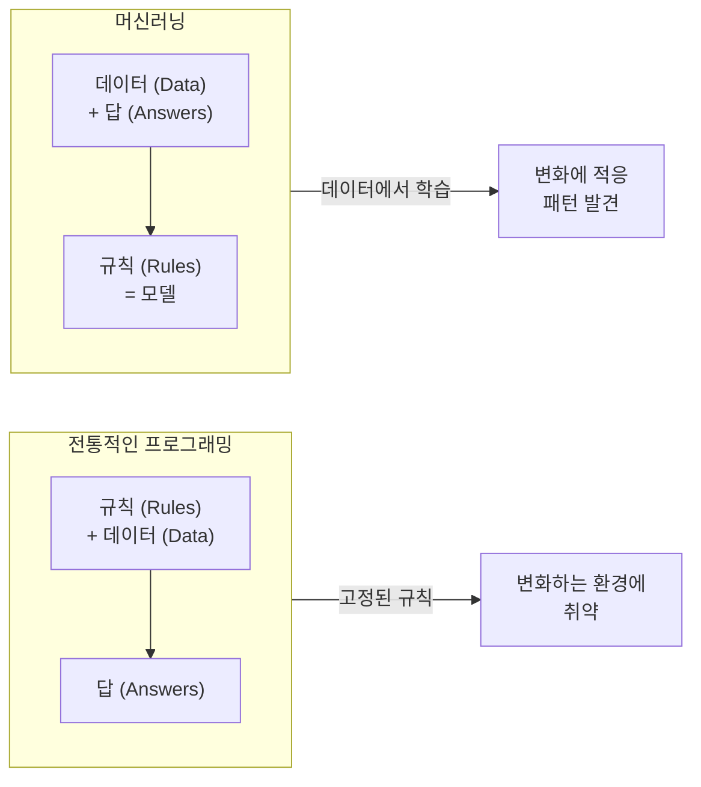
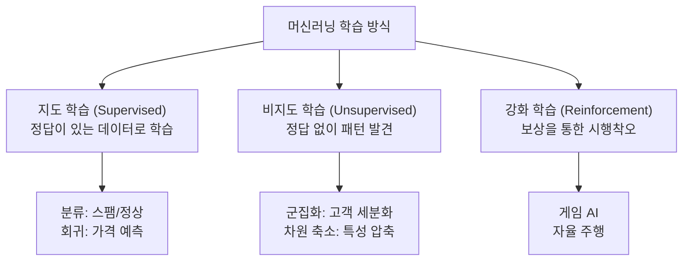
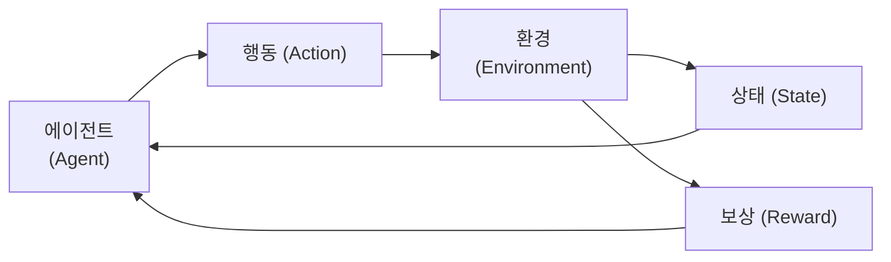
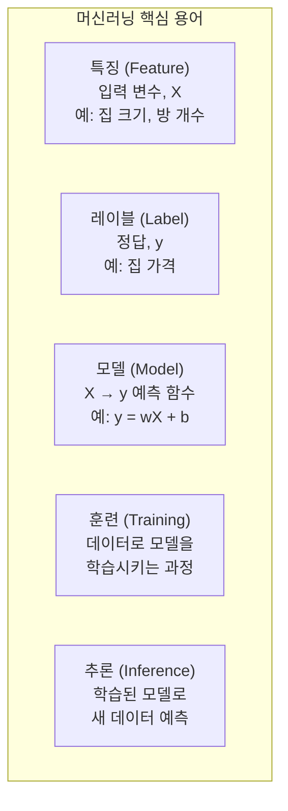
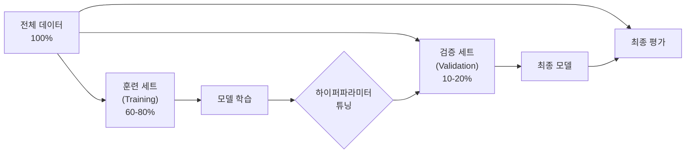
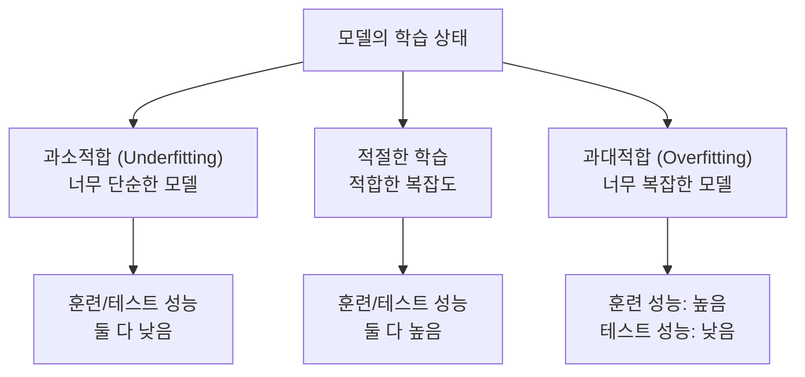
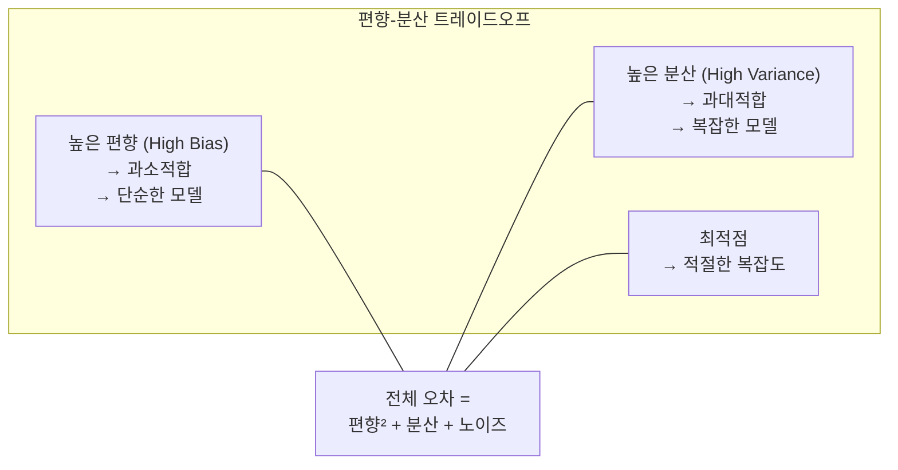
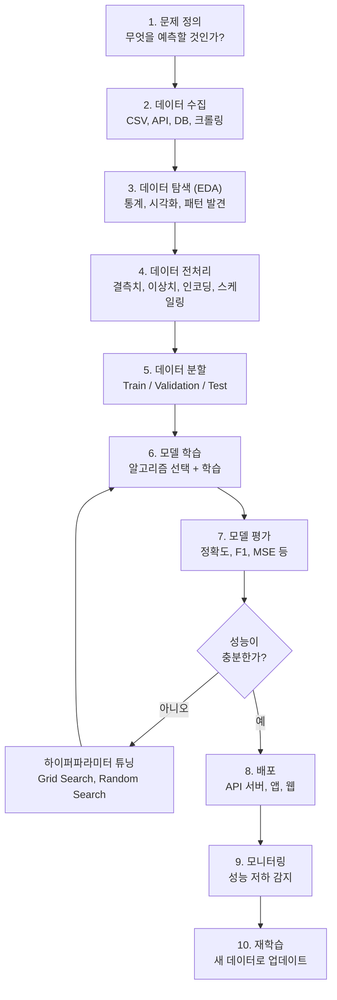

# 05장: 머신러닝 개념

> **🎯 학습 목표**
> - 머신러닝의 3가지 학습 방식(지도, 비지도, 강화학습)을 이해합니다.
> - 특징, 레이블, 모델의 개념을 설명할 수 있습니다.
> - 과대적합과 과소적합의 차이와 대처 방법을 이해합니다.
> - 편향-분산 트레이드오프의 개념을 직관적으로 이해합니다.

---

## 5.1 머신러닝이란?

**머신러닝(Machine Learning, ML)** 은 데이터로부터 패턴을 학습하여 예측이나 결정을 수행하는 알고리즘의 집합입니다. 전통적인 프로그래밍과의 차이는 다음과 같습니다.



| 구분 | 전통적 프로그래밍 | 머신러닝 |
|------|------------------|---------|
| **접근 방식** | 사람이 규칙을 직접 코딩 | 데이터로부터 규칙을 자동 학습 |
| **적용 대상** | 규칙이 명확한 문제 | 규칙을 정의하기 어려운 문제 |
| **변화 대응** | 규칙을 수동으로 업데이트 | 새 데이터로 재학습 |
| **예시** | "계좌 잔액 ≥ 출금액" | 스팸 메일 탐지, 얼굴 인식 |

---

## 5.2 학습 방식의 3가지 분류



### 5.2.1 지도 학습 (Supervised Learning)

입력(X)과 정답(y)이 쌍으로 주어집니다. 모델은 입력에서 정답을 예측하도록 학습합니다.

```python
from sklearn.linear_model import LinearRegression
import numpy as np

# 지도 학습 예: 주택 크기로 가격 예측
X = np.array([[30], [50], [80], [100], [120]])  # 주택 크기 (평)
y = np.array([15000, 25000, 40000, 50000, 60000])  # 가격 (만원)

model = LinearRegression()
model.fit(X, y)  # 학습

# 새로운 주택 가격 예측
new_house = np.array([[65]])
predicted = model.predict(new_house)
print(f"65평 주택 예측 가격: {predicted[0]:.0f}만원")
```

### 5.2.2 비지도 학습 (Unsupervised Learning)

정답(y) 없이 입력(X)만 주어집니다. 데이터 자체의 구조나 패턴을 발견합니다.

```python
from sklearn.cluster import KMeans
import numpy as np

# 비지도 학습 예: 고객 군집화
X = np.random.randn(100, 2)  # 100명 고객의 2가지 특성
kmeans = KMeans(n_clusters=3, random_state=42)
kmeans.fit(X)

print(f"각 고객의 군집 레이블: {kmeans.labels_[:10]}")
print(f"군집 중심점:\n{kmeans.cluster_centers_}")
```

### 5.2.3 강화 학습 (Reinforcement Learning)

에이전트가 환경과 상호작용하며 **보상을 최대화**하도록 학습합니다.



> **참고:** 이 책에서는 지도 학습과 비지도 학습에 집중합니다. 강화 학습은 고급 주제로, 이 책의 범위를 벗어납니다.

---

## 5.3 핵심 용어



### 예제로 이해하기

```python
import pandas as pd
from sklearn.model_selection import train_test_split
from sklearn.linear_model import LinearRegression

# 주택 가격 데이터셋
data = {
    'size': [30, 50, 80, 100, 120, 40, 60, 90, 110, 70],  # 특징 (Feature)
    'rooms': [2, 3, 4, 4, 5, 2, 3, 4, 5, 3],
    'age': [20, 10, 5, 3, 1, 15, 8, 4, 2, 7],
    'price': [15000, 25000, 40000, 50000, 60000, 20000, 30000, 45000, 55000, 35000]  # 레이블
}

df = pd.DataFrame(data)

# 특징과 레이블 분리
X = df[['size', 'rooms', 'age']]   # 특징 (입력)
y = df['price']                     # 레이블 (정답)

# 훈련/테스트 분할
X_train, X_test, y_train, y_test = train_test_split(X, y, test_size=0.2)

# 모델 학습
model = LinearRegression()
model.fit(X_train, y_train)          # 훈련

# 추론
y_pred = model.predict(X_test)       # 예측
print(f"실제 가격: {y_test.values}")
print(f"예측 가격: {y_pred.round(0)}")
```

---

## 5.4 데이터 분할

모든 데이터를 학습에 사용하면 **모델이 데이터를 외워서** 새로운 데이터에 대한 성능이 떨어집니다. 따라서 데이터를 3개의 세트로 나눕니다.



| 세트 | 용도 | 사용 횟수 |
|------|------|----------|
| **훈련 (Train)** | 모델 가중치 학습 | 여러 번 |
| **검증 (Validation)** | 하이퍼파라미터 튜닝, 모델 선택 | 여러 번 |
| **테스트 (Test)** | 최종 성능 측정 | **단 한 번** |

```python
from sklearn.model_selection import train_test_split
import numpy as np

X = np.random.randn(1000, 10)
y = np.random.randn(1000)

# Train / Test 분할
X_train, X_test, y_train, y_test = train_test_split(
    X, y, test_size=0.2, random_state=42
)

# Train을 다시 Train / Validation으로 분할
X_train, X_val, y_train, y_val = train_test_split(
    X_train, y_train, test_size=0.2, random_state=42
)

print(f"Train: {X_train.shape[0]} samples")
print(f"Validation: {X_val.shape[0]} samples")
print(f"Test: {X_test.shape[0]} samples")
```

---

## 5.5 과대적합과 과소적합



```python
import numpy as np
import matplotlib.pyplot as plt
from sklearn.preprocessing import PolynomialFeatures
from sklearn.linear_model import LinearRegression
from sklearn.pipeline import make_pipeline

# 데이터 생성
np.random.seed(42)
X = np.linspace(0, 10, 20)
y = np.sin(X) + np.random.randn(20) * 0.3

X_plot = np.linspace(0, 10, 100)

# 과소적합: 1차 모델 (너무 단순)
model_under = make_pipeline(PolynomialFeatures(1), LinearRegression())
model_under.fit(X[:, np.newaxis], y)

# 적절: 3차 모델
model_good = make_pipeline(PolynomialFeatures(3), LinearRegression())
model_good.fit(X[:, np.newaxis], y)

# 과대적합: 15차 모델 (너무 복잡)
model_over = make_pipeline(PolynomialFeatures(15), LinearRegression())
model_over.fit(X[:, np.newaxis], y)

# 시각화
plt.figure(figsize=(12, 4))

plt.subplot(1, 3, 1)
plt.scatter(X, y)
plt.plot(X_plot, model_under.predict(X_plot[:, np.newaxis]), 'r-')
plt.title('과소적합 (1차)')

plt.subplot(1, 3, 2)
plt.scatter(X, y)
plt.plot(X_plot, model_good.predict(X_plot[:, np.newaxis]), 'g-')
plt.title('적절 (3차)')

plt.subplot(1, 3, 3)
plt.scatter(X, y)
plt.plot(X_plot, model_over.predict(X_plot[:, np.newaxis]), 'r-')
plt.title('과대적합 (15차)')

plt.tight_layout()
plt.show()
```

### 과대적합 방지 방법

| 방법 | 설명 | 예시 |
|------|------|------|
| **더 많은 데이터** | 데이터가 많을수록 일반화 성능 향상 | 데이터 증강 |
| **모델 단순화** | 복잡도 줄이기 | 레이어 수 감소 |
| **정규화 (Regularization)** | 가중치가 너무 커지지 않도록 제약 | L1, L2 정규화 |
| **조기 종료 (Early Stopping)** | 검증 성능이 더 이상 오르지 않으면 중단 | `patience` 파라미터 |
| **드롭아웃 (Dropout)** | 랜덤으로 뉴런을 끄며 학습 (딥러닝) | `Dropout(0.5)` |
| **교차 검증 (Cross Validation)** | 여러 폴드로 검증 | K-Fold |

---

## 5.6 편향-분산 트레이드오프 (Bias-Variance Tradeoff)



| 개념 | 설명 | 비유 |
|------|------|------|
| **편향 (Bias)** | 모델의 예측이 실제 값에서 얼마나 떨어져 있는가 | **정확도** — 과녁 중심에서의 거리 |
| **분산 (Variance)** | 데이터에 따라 예측이 얼마나 변동하는가 | **일관성** — 여러 번 쏜 화살의 퍼짐 정도 |

```python
# 편향과 분산 시각화 개념

```

---

## 5.7 머신러닝 프로젝트 워크플로우

실제 ML 프로젝트는 다음과 같은 단계로 진행됩니다.



---

## 📋 한눈에 정리

| 개념 | 정의 | 핵심 키워드 |
|------|------|-----------|
| **지도 학습** | 정답이 있는 데이터로 학습 | 분류, 회귀 |
| **비지도 학습** | 정답 없이 패턴 발견 | 군집화, 차원 축소 |
| **강화 학습** | 보상을 최대화하도록 학습 | 에이전트, 환경, 보상 |
| **특징 (Feature)** | 입력 변수 | X, 독립 변수 |
| **레이블 (Label)** | 정답 | y, 종속 변수, 타겟 |
| **과소적합** | 모델이 너무 단순 | 높은 편향 |
| **과대적합** | 모델이 너무 복잡 | 높은 분산 |
| **편향** | 예측의 정확도 | 중심에서의 거리 |
| **분산** | 예측의 일관성 | 퍼짐 정도 |

---

## ✏️ 연습 문제

1. 다음 중 **지도 학습**에 해당하는 것은?
   - a) 고객을 3개의 그룹으로 나누기
   - b) 이메일이 스팸인지 예측하기
   - c) 게임 캐릭터가 점수를 최대화하도록 학습
   - d) 이미지를 10개의 카테고리로 분류
   - e) 주성분 분석으로 100차원 데이터를 2차원으로 축소

2. **과대적합과 과소적합**의 차이를 설명하고, 각각을 해결하는 방법을 2가지씩 쓰세요.

3. 다음 상황에서 어떤 학습 방식을 사용해야 할까요?
   - 수백만 장의 고양이/개 사진에 레이블이 있음
   - 고객 데이터만 있고, 어떤 그룹으로 나눠야 할지 모름
   - 로봇이 장애물을 피해 이동하는 방법을 학습해야 함

4. Scikit-learn의 `make_classification` 함수를 사용하여 가상 데이터를 생성하고, train_test_split으로 분할한 후, KNN 분류기를 학습하고 정확도를 측정하세요.

5. 편향-분산 트레이드오프를 **양궁**에 비유하여 설명해보세요. (높은 편향 vs 높은 분산의 차이)

---

## 📝 연습 문제 정답

<details>
<summary>정답 보기</summary>

**1. 지도 학습에 해당하는 것**
- a) ❌ 고객 그룹화 → **비지도 학습** (군집화)
- b) ✅ 스팸 예측 → **지도 학습** (분류)
- c) ❌ 게임 학습 → **강화 학습**
- d) ✅ 이미지 분류 → **지도 학습** (분류)
- e) ❌ 차원 축소 → **비지도 학습**
→ 정답: **b, d**

**2. 과대적합 vs 과소적합**
- **과소적합 (Underfitting):** 모델이 너무 단순해서 패턴을 다 학습하지 못함
  - 해결: 모델 복잡도 증가, 특성 공학, 더 많은 특성 추가
- **과대적합 (Overfitting):** 모델이 너무 복잡해서 데이터를 외움 (일반화 실패)
  - 해결: 정규화(L1/L2), 더 많은 데이터, 드롭아웃, 조기 종료

**3. 상황별 학습 방식**
- 수백만 장의 레이블된 사진 → **지도 학습** (분류)
- 레이블 없는 고객 데이터 → **비지도 학습** (군집화)
- 로봇 장애물 회피 → **강화 학습** (보상 기반)

**4. KNN 분류기 코드**
```python
from sklearn.datasets import make_classification
from sklearn.model_selection import train_test_split
from sklearn.neighbors import KNeighborsClassifier
from sklearn.metrics import accuracy_score

X, y = make_classification(n_samples=500, n_features=10, random_state=42)
X_train, X_test, y_train, y_test = train_test_split(X, y, test_size=0.2)
knn = KNeighborsClassifier(n_neighbors=5)
knn.fit(X_train, y_train)
y_pred = knn.predict(X_test)
print(f"정확도: {accuracy_score(y_test, y_pred):.4f}")
```

**5. 편향-분산 트레이드오프 (양궁 비유)**
- **높은 편향 (High Bias):** 화살이 한 곳에만 집중되지만 과녁 중심에서 멀리 떨어짐 → 정확도 낮음 (과소적합)
- **높은 분산 (High Variance):** 화살이 중심 주변에 퍼져 있지만 일관성 없음 → 일관성 낮음 (과대적합)
- **최적:** 화살이 중심에 밀집 → 낮은 편향 + 낮은 분산

</details>

---

> **🔄 다음 장에서는** 지도 학습의 주요 알고리즘을 배웁니다. 선형 회귀, 로지스틱 회귀, 결정 트리, 랜덤 포레스트, SVM, K-NN을 실습 코드와 함께 이해합니다.
