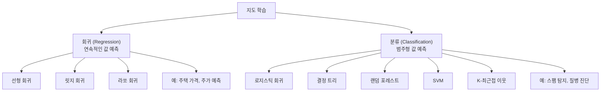
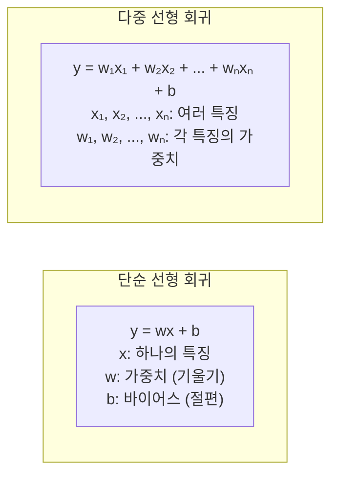
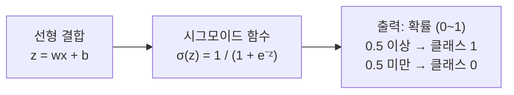
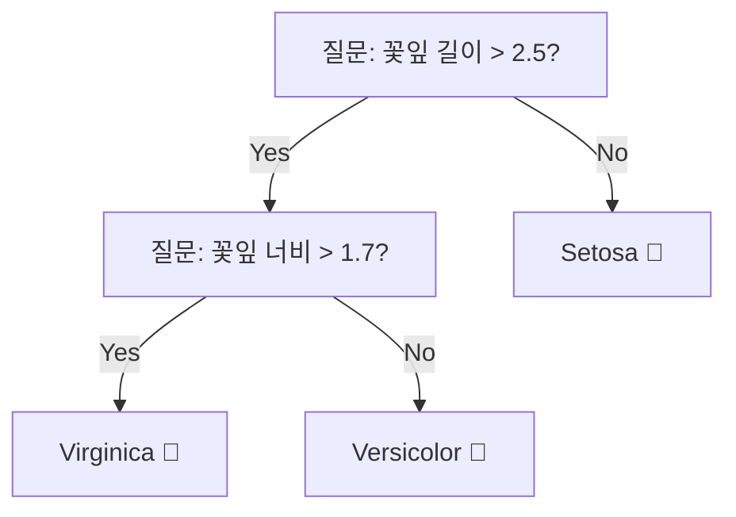
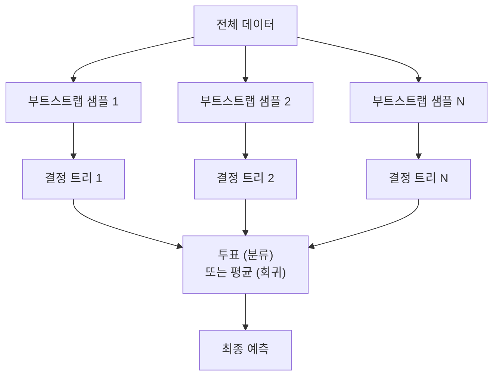
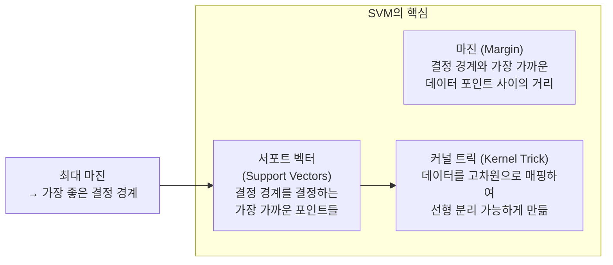
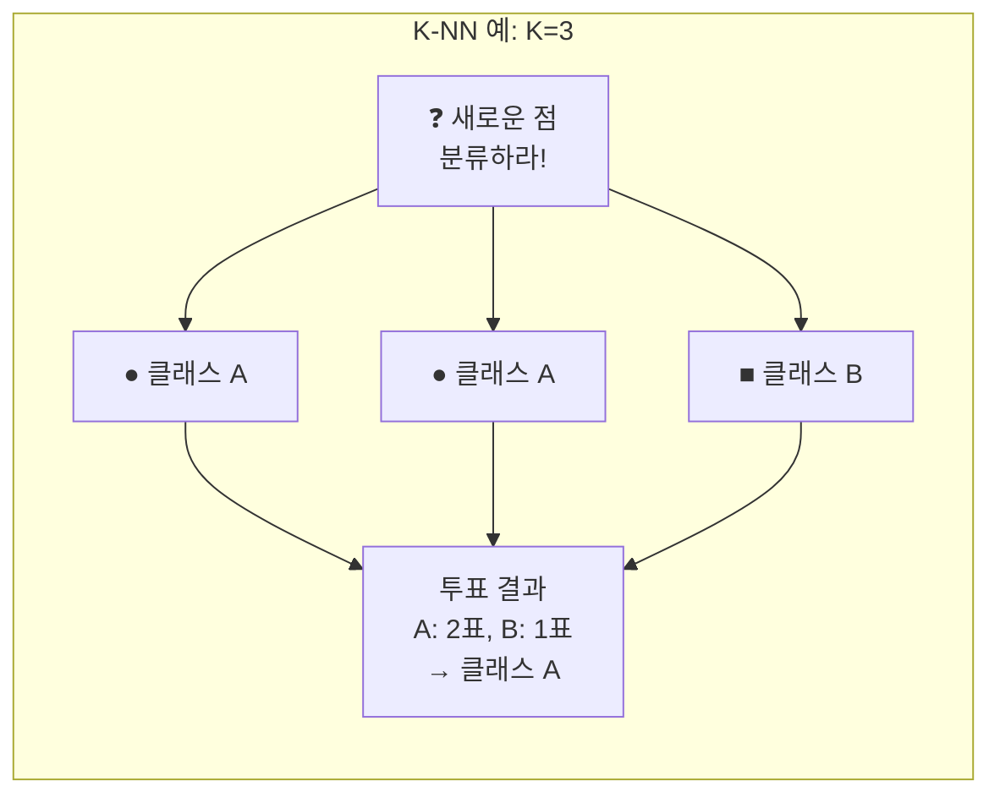
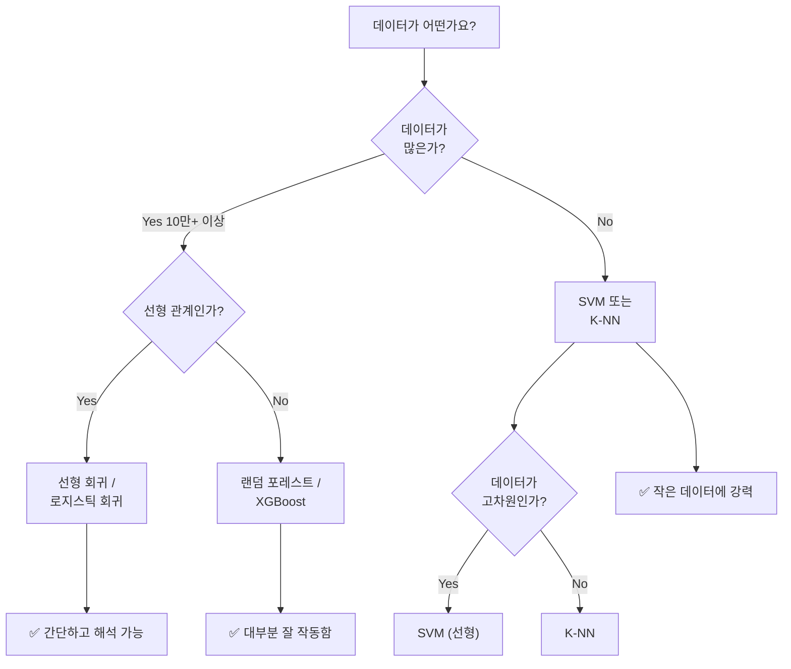

# 06장: 지도 학습 알고리즘 프로그래밍

> **🎯 학습 목표**
> - 선형 회귀와 로지스틱 회귀의 원리와 차이를 이해합니다.
> - 결정 트리와 랜덤 포레스트의 작동 방식을 이해합니다.
> - SVM과 K-NN의 개념과 특징을 이해합니다.
> - 문제 유형에 따라 적절한 알고리즘을 선택할 수 있습니다.

---

## 👨‍💻 실전 프로젝트: 주택 가격 예측 회귀 모델

지도 학습의 개념을 본격적으로 학습하기에 앞서, 실제 데이터에 여러 알고리즘을 적용해 보는 실전 프로젝트를 먼저 수행해 보겠습니다. 이 프로젝트는 앞으로 배울 이론적 내용이 실제 문제 해결에 어떻게 활용되는지를 직관적으로 이해하는 데 큰 도움이 될 것입니다. 캘리포니아 주택 가격 데이터셋(California Housing Dataset)을 사용하여 선형 회귀와 결정 트리 회귀 모델을 각각 학습시키고, 그 성능을 비교해 보도록 하겠습니다. 이 데이터셋은 8개의 특성(소득, 방 개수, 위도, 경도 등)으로 구성되어 있으며, 블록 그룹 단위의 중간 주택 가격을 예측하는 것이 목표입니다.

```python
from sklearn.datasets import fetch_california_housing
from sklearn.model_selection import train_test_split
from sklearn.linear_model import LinearRegression
from sklearn.tree import DecisionTreeRegressor
from sklearn.metrics import mean_squared_error, r2_score
import numpy as np

# 데이터 로드
housing = fetch_california_housing()
X, y = housing.data, housing.target
print(f"데이터 크기: {X.shape}")
print(f"특성 이름: {housing.feature_names}")

# 학습/테스트 분할
X_train, X_test, y_train, y_test = train_test_split(
    X, y, test_size=0.2, random_state=42
)

# 선형 회귀
lr = LinearRegression()
lr.fit(X_train, y_train)
y_pred_lr = lr.predict(X_test)

mse_lr = mean_squared_error(y_test, y_pred_lr)
rmse_lr = np.sqrt(mse_lr)
r2_lr = r2_score(y_test, y_pred_lr)
print(f"\n[선형 회귀]")
print(f"  RMSE: {rmse_lr:.4f}")
print(f"  R²  : {r2_lr:.4f}")

# 결정 트리 회귀
dt = DecisionTreeRegressor(max_depth=5, random_state=42)
dt.fit(X_train, y_train)
y_pred_dt = dt.predict(X_test)

mse_dt = mean_squared_error(y_test, y_pred_dt)
rmse_dt = np.sqrt(mse_dt)
r2_dt = r2_score(y_test, y_pred_dt)
print(f"\n[결정 트리 회귀 (max_depth=5)]")
print(f"  RMSE: {rmse_dt:.4f}")
print(f"  R²  : {r2_dt:.4f}")

# 특성 중요도 비교
print(f"\n[선형 회귀 계수]")
for name, coef in zip(housing.feature_names, lr.coef_):
    print(f"  {name}: {coef:.4f}")
print(f"\n[결정 트리 특성 중요도]")
for name, imp in zip(housing.feature_names, dt.feature_importances_):
    print(f"  {name}: {imp:.4f}")
```

실행 결과에서 선형 회귀와 결정 트리는 각기 다른 방식으로 데이터를 학습하며 상이한 성능을 보입니다. 선형 회귀는 각 특성에 대한 가중치를 학습하여 주택 가격과 특성 간의 선형 관계를 모델링하는 반면, 결정 트리는 특성 공간을 계층적으로 분할하여 비선형 패턴을 포착합니다. 일반적으로 결정 트리가 더 복잡한 패턴을 학습할 수 있지만, 트리의 깊이(max_depth)를 적절히 제한하지 않으면 과대적합(overfitting)이 발생할 수 있습니다. 이 프로젝트를 통해 동일한 데이터에 대해서도 알고리즘에 따라 예측 성능과 해석 방식이 크게 달라질 수 있다는 점을 경험할 수 있을 것입니다.

---

## 6.1 개요

지도 학습(Supervised Learning)은 입력 데이터와 그에 대응하는 정답(레이블)이 함께 제공되는 상황에서 모델을 학습시키는 머신러닝 패러다임입니다. 학습된 모델은 새로운 입력 데이터가 주어졌을 때 해당 데이터의 정답을 예측하는 능력을 갖게 되며, 이는 대부분의 실용적인 머신러닝 응용에서 핵심이 되는 개념입니다. 지도 학습은 예측하려는 대상의 성격에 따라 크게 회귀(Regression)와 분류(Classification) 두 가지 유형으로 구분됩니다. 회귀는 연속적인 숫자 값을 예측하는 문제(예: 주택 가격, 주가)인 반면, 분류는 이산적인 범주를 예측하는 문제(예: 스팸 탐지, 질병 진단)에 해당합니다. 이러한 구분은 문제 해결에 적합한 알고리즘을 선택하는 데 있어 가장 기본적이면서도 중요한 기준이 됩니다.



위 다이어그램에서 확인할 수 있듯이, 지도 학습 알고리즘은 해결하려는 문제의 유형에 따라 회귀 알고리즘과 분류 알고리즘으로 나누어집니다. 회귀 알고리즘에는 선형 회귀, 릿지 회귀, 라쏘 회귀 등이 있으며, 분류 알고리즘에는 로지스틱 회귀, 결정 트리, 랜덤 포레스트, SVM, K-최근접 이웃 등이 포함됩니다. 각 알고리즘은 고유한 가정과 학습 방식을 가지고 있으므로, 데이터의 특성과 문제의 요구사항에 맞게 적절히 선택하여 사용하여야 합니다. 이제부터 각 알고리즘의 원리와 구현 방법을 하나씩 자세히 살펴보겠습니다.

---

## 6.2 선형 회귀 (Linear Regression)

### 6.2.1 기본 개념

선형 회귀는 **가장 단순하고 직관적인 회귀 알고리즘**으로, 입력 변수와 출력 변수 사이의 관계를 직선(또는 초평면)의 형태로 모델링합니다. 이 알고리즘은 입력 특징들의 선형 결합을 사용하여 연속적인 목표 값을 예측하며, 모델의 가중치(기울기)와 바이어스(절편)를 학습하는 것이 핵심입니다. 선형 회귀는 수학적으로 이해하기 쉽고 계산 비용이 매우 낮아 대규모 데이터셋에서도 효율적으로 동작합니다. 또한 각 특성의 계수를 통해 해당 특성이 결과에 미치는 영향을 정량적으로 해석할 수 있다는 장점이 있습니다. 다만 현실 세계의 많은 관계가 비선형적이기 때문에, 선형 회귀만으로는 복잡한 패턴을 충분히 포착하지 못할 수 있다는 한계가 있습니다.



단순 선형 회귀는 하나의 입력 특징 $x$만을 사용하여 출력 $y$를 예측하는 가장 기초적인 형태입니다. 반면 다중 선형 회귀는 여러 개의 입력 특징 $x_1, x_2, \dots, x_n$을 동시에 사용하여 더 복잡한 관계를 모델링할 수 있습니다. 두 방식 모두 기본적인 수학 원리는 동일하며, 특징이 추가될수록 모델의 표현력이 증가하지만 동시에 과대적합의 위험도 함께 커지게 됩니다.

```python
import numpy as np
import matplotlib.pyplot as plt
from sklearn.linear_model import LinearRegression
from sklearn.metrics import mean_squared_error

# 데이터 생성: y = 2x + 1 + 노이즈
np.random.seed(42)
X = np.random.rand(50, 1) * 10  # 0~10 사이 값
y = 2 * X.flatten() + 1 + np.random.randn(50) * 2

# 모델 학습
model = LinearRegression()
model.fit(X, y)

print(f"기울기 (w): {model.coef_[0]:.2f}")  # ≈ 2.0
print(f"절편 (b): {model.intercept_:.2f}")   # ≈ 1.0
print(f"R² 점수: {model.score(X, y):.4f}")

# 예측
X_test = np.array([[4], [7], [9]])
y_pred = model.predict(X_test)
print(f"\n4의 예측: {y_pred[0]:.1f} (실제: {2*4+1})")
print(f"7의 예측: {y_pred[1]:.1f} (실제: {2*7+1})")
print(f"9의 예측: {y_pred[2]:.1f} (실제: {2*9+1})")
```

위 코드는 인위적으로 생성한 데이터에 단순 선형 회귀를 적용하는 예제입니다. 데이터는 $y = 2x + 1$ 관계에 정규 분포 노이즈를 추가하여 생성되었으며, 모델이 학습을 통해 실제 기울기 2.0과 절편 1.0에 가까운 값을 찾아내는 것을 확인할 수 있습니다. R² 점수는 1에 가까울수록 모델이 데이터를 잘 설명함을 의미하며, 0에 가까울수록 설명력이 낮음을 나타냅니다. 학습된 모델은 $x$ 값이 4, 7, 9일 때의 $y$ 값을 성공적으로 예측하며, 이는 선형 회귀가 학습하지 않은 새로운 데이터에 대해서도 일반화된 예측을 수행할 수 있음을 보여줍니다.

### 6.2.2 여러 특징으로 회귀

앞서 살펴본 단순 선형 회귀가 하나의 특징만을 다루었다면, 현실의 문제는 대부분 여러 특징을 동시에 고려하여 예측을 수행하여야 합니다. 주택 가격을 예측할 때는 평균값뿐만 아니라 방의 개수, 건축 연도, 위치 등 다양한 요소가 복합적으로 영향을 미칩니다. 다중 선형 회귀는 이러한 여러 특징들을 동시에 입력받아 각 특징이 결과에 미치는 영향을 가중치를 통해 학습합니다. 아래 코드는 주택의 크기, 방 개수, 건축 연도라는 세 가지 특징을 사용하여 가격을 예측하는 예제입니다.

```python
from sklearn.linear_model import LinearRegression

# 여러 특징: [크기, 방 개수, 건축년도] → 가격
X = np.array([
    [30, 2, 2000],
    [50, 3, 2010],
    [80, 4, 2015],
    [100, 4, 2020],
    [120, 5, 2023]
])
y = np.array([15000, 25000, 40000, 50000, 60000])

model = LinearRegression()
model.fit(X, y)

# 새 주택 예측
new_house = np.array([[65, 3, 2018]])
predicted = model.predict(new_house)
print(f"예측 가격: {predicted[0]:.0f}만원")

# 각 특징의 중요도
for name, coef in zip(['크기', '방 개수', '건축년도'], model.coef_):
    print(f"{name}의 가중치: {coef:.2f}")
```

학습이 완료된 후 출력되는 각 특징의 가중치(계수)는 해당 특징이 1단위 변화할 때 예측값이 얼마나 변하는지를 나타냅니다. 예를 들어 크기의 가중치가 양수라면 크기가 클수록 가격이 상승한다는 의미이며, 그 절대값이 클수록 영향력이 크다는 뜻입니다. 이러한 가중치 해석은 선형 회귀의 가장 큰 장점 중 하나로, 모델이 단순히 예측만 수행하는 것을 넘어 데이터에 대한 인사이트를 제공할 수 있게 해 줍니다.

### 6.2.3 평가지표

회귀 모델의 성능을 객관적으로 평가하기 위해서는 다양한 평가지표를 활용하여야 합니다. 각 지표는 서로 다른 측면에서 모델의 예측 오차를 측정하며, 문제의 성격에 따라 적절한 지표를 선택하는 것이 중요합니다. 가장 널리 사용되는 지표로는 MAE, MSE, RMSE, R² 등이 있으며, 이들은 각각 장단점이 다르므로 함께 고려하는 것이 바람직합니다.

```python
from sklearn.metrics import mean_absolute_error, mean_squared_error, r2_score
import numpy as np

y_true = np.array([3.0, 5.0, 4.0, 7.0, 6.0])
y_pred = np.array([2.8, 5.2, 4.1, 6.5, 6.3])

# MAE: 평균 절대 오차 (직관적)
mae = mean_absolute_error(y_true, y_pred)
print(f"MAE: {mae:.3f}")  # 평균적으로 0.2억 오차

# MSE: 평균 제곱 오차 (큰 오차에 패널티)
mse = mean_squared_error(y_true, y_pred)
print(f"MSE: {mse:.3f}")

# RMSE: MSE의 제곱근 (원래 단위로 변환)
rmse = np.sqrt(mse)
print(f"RMSE: {rmse:.3f}")

# R²: 설명력 (1에 가까울수록 좋음)
r2 = r2_score(y_true, y_pred)
print(f"R²: {r2:.3f}")  # 1.0 = 완벽 예측
```

MAE(Mean Absolute Error)는 예측값과 실제값의 차이에 절댓값을 취하여 평균을 낸 것으로, 단위가 원래 데이터와 같아 해석이 직관적이라는 장점이 있습니다. MSE(Mean Squared Error)는 오차를 제곱하여 평균을 내므로 큰 오차에 더 큰 패널티를 부과하며, 이는 이상치(outlier)에 민감하게 반응하게 만듭니다. RMSE(Root Mean Squared Error)는 MSE의 제곱근을 취하여 단위를 원래대로 되돌린 지표로, 실제 오차 크기와 비교하기 용이합니다. R²(결정 계수)는 모델이 데이터의 분산을 얼마나 설명하는지를 0에서 1 사이의 값으로 나타내며, 1에 가까울수록 완벽한 예측을 의미합니다. 이처럼 여러 지표를 종합적으로 활용하여 모델의 성능을 다각도로 평가하는 것이 중요합니다.

---

이상으로 선형 회귀의 기본 원리와 평가 방법을 살펴보았습니다. 선형 회귀는 단순하고 해석이 용이하여 많은 문제에서 첫 번째로 시도해 보는 알고리즘입니다. 이제 회귀와는 다른 패러다임인 분류 문제로 넘어가, 로지스틱 회귀를 통해 범주형 데이터를 예측하는 방법을 알아보겠습니다.

## 6.3 로지스틱 회귀 (Logistic Regression)

로지스틱 회귀는 이름에 "회귀"가 포함되어 있지만, 실제로는 **분류(Classification) 문제를 해결하기 위한 알고리즘**입니다. 이 알고리즘은 선형 회귀와 유사하게 입력 특징들의 선형 결합을 계산하지만, 그 결과를 시그모이드 함수(sigmoid function)에 통과시켜 0과 1 사이의 확률 값으로 변환합니다. 즉, 어떤 데이터가 특정 클래스에 속할 확률을 예측한 후, 그 확률이 임계값(보통 0.5) 이상이면 해당 클래스로 분류하는 방식입니다. 로지스틱 회귀는 구현이 간단하고 학습 속도가 빠르며, 확률 기반의 출력을 제공하여 예측 결과에 대한 신뢰도를 함께 확인할 수 있다는 장점이 있습니다.

### 6.3.1 시그모이드 함수

시그모이드 함수는 로지스틱 회귀의 핵심 구성 요소로, 임의의 실수 입력을 0과 1 사이의 값으로 변환하는 비선형 함수입니다. 수학적으로는 $\sigma(z) = 1 / (1 + e^{-z})$로 표현되며, $z$ 값이 음의 방향으로 갈수록 0에 수렴하고 양의 방향으로 갈수록 1에 수렴하는 S자 형태의 곡선을 가집니다. $z = 0$일 때 출력값은 정확히 0.5가 되며, 이 지점이 일반적인 분류의 결정 경계로 사용됩니다. 시그모이드 함수의 이러한 특성 덕분에 로지스틱 회귀는 선형 모델의 출력을 확률로 자연스럽게 변환할 수 있으며, 이는 이진 분류 문제에서 매우 유용하게 활용됩니다.



```python
import numpy as np
import matplotlib.pyplot as plt
from sklearn.linear_model import LogisticRegression
from sklearn.datasets import make_classification

# 시그모이드 함수 시각화
def sigmoid(z):
    return 1 / (1 + np.exp(-z))

z = np.linspace(-10, 10, 100)
s = sigmoid(z)

plt.plot(z, s, linewidth=2)
plt.axhline(0.5, color='gray', linestyle='--')
plt.axvline(0, color='gray', linestyle='--')
plt.xlabel('z = wx + b')
plt.ylabel('σ(z) = P(y=1)')
plt.title('시그모이드 함수')
plt.grid(True, alpha=0.3)
plt.show()
```

위 코드는 시그모이드 함수의 형태를 시각화하는 예제입니다. $z$가 -10에서 10까지 변할 때 시그모이드 함수의 출력이 0에서 1 사이로 부드럽게 변화하는 모습을 확인할 수 있습니다. 점선으로 표시된 $z=0$ 지점에서 함수값이 정확히 0.5가 되며, 이 지점을 기준으로 분류의 결정이 이루어집니다. $z=0$은 선형 결합 $wx + b = 0$에 해당하므로, 결국 로지스틱 회귀는 선형 결정 경계를 학습하면서도 그 출력을 확률로 해석할 수 있게 해 주는 것입니다.

### 6.3.2 분류 실습

시그모이드 함수의 원리를 이해하였으므로, 이제 실제 데이터에 로지스틱 회귀를 적용하여 분류를 수행하는 실습을 진행해 보겠습니다. 아래 예제에서는 두 개의 특징을 가진 가상의 데이터를 생성하고, 로지스틱 회귀 모델을 학습시킨 후 테스트 데이터에 대한 예측 성능을 평가합니다. 평가 지표로는 정확도(accuracy), 혼동 행렬(confusion matrix), 정밀도(precision), 재현율(recall) 등을 사용하여 모델의 성능을 다각도로 분석합니다.

```python
from sklearn.linear_model import LogisticRegression
from sklearn.model_selection import train_test_split
from sklearn.metrics import accuracy_score, confusion_matrix, classification_report

# 가상 데이터: 공부 시간으로 합격/불합격 예측
np.random.seed(42)
X = np.random.randn(100, 2)  # 2개의 특징
y = (X[:, 0] + X[:, 1] > 0).astype(int)  # 합계가 0보다 크면 합격

X_train, X_test, y_train, y_test = train_test_split(X, y, test_size=0.2)

model = LogisticRegression()
model.fit(X_train, y_train)

y_pred = model.predict(X_test)
print(f"정확도: {accuracy_score(y_test, y_pred):.4f}")
print(f"\n혼동 행렬:\n{confusion_matrix(y_test, y_pred)}")
print(f"\n분류 리포트:\n{classification_report(y_test, y_pred)}")

# 확률 예측
probs = model.predict_proba(X_test[:5])
print(f"\n첫 5개 샘플의 예측 확률:\n{probs}")
```

분류 모델의 평가는 단순히 정확도만으로 충분하지 않으며, 혼동 행렬과 분류 리포트를 함께 확인하는 것이 중요합니다. 혼동 행렬은 실제 클래스와 예측 클래스의 조합을 표 형태로 보여주며, TP(True Positive), TN(True Negative), FP(False Positive), FN(False Negative)의 개수를 확인할 수 있습니다. 분류 리포트는 각 클래스에 대한 정밀도(Precision), 재현율(Recall), F1-점수를 제공하여 모델이 특정 클래스를 얼마나 잘 예측하는지를 세부적으로 평가할 수 있게 해 줍니다. 특히 클래스 간 데이터 개수가 불균형한 경우에는 정확도보다 재현율과 정밀도가 더 중요한 지표가 될 수 있습니다. 또한 `predict_proba` 메서드를 통해 각 샘플이 각 클래스에 속할 확률을 직접 확인할 수 있어, 예측 결과에 대한 신뢰도를 정량적으로 파악할 수 있습니다.

---

로지스틱 회귀가 선형적인 결정 경계를 학습하는 반면, 결정 트리는 데이터를 계층적으로 분할하는 전혀 다른 접근 방식을 사용합니다. 결정 트리는 로지스틱 회귀로는 표현하기 어려운 복잡한 비선형 관계를 학습할 수 있으며, 그 결과를 직관적인 트리 구조로 시각화할 수 있다는 독특한 장점을 가지고 있습니다.

## 6.4 결정 트리 (Decision Tree)

결정 트리는 **IF-THEN 규칙을 자동으로 학습**하는 알고리즘으로, 데이터의 특징 공간을 재귀적으로 분할하여 예측을 수행합니다. 이 알고리즘은 트리 구조의 각 내부 노드에서 하나의 특징에 대한 질문을 던지고, 그 답변에 따라 자식 노드로 데이터를 분기시키는 방식으로 동작합니다. 최종적으로 도달하는 리프(leaf) 노드에는 해당 경로에 속하는 데이터의 예측값(분류의 경우 가장 빈도가 높은 클래스, 회귀의 경우 평균값)이 저장됩니다. 결정 트리의 가장 큰 장점은 학습된 결과를 사람이 이해할 수 있는 규칙의 형태로 시각화할 수 있어 모델의 의사 결정 과정을 투명하게 추적할 수 있다는 점입니다. 반면, 트리의 깊이가 깊어질수록 과대적합되기 쉬우며, 데이터의 작은 변화에도 트리 구조가 크게 달라질 수 있다는 단점이 있습니다.



위 다이어그램은 Iris(붓꽃) 데이터셋을 분류하는 간단한 결정 트리의 예를 보여줍니다. 루트 노드에서는 꽃잎 길이가 2.5cm를 초과하는지 먼저 질문하며, "No"인 경우 즉시 Setosa 품종으로 분류됩니다. "Yes"인 경우에는 두 번째 질문(꽃잎 너비 > 1.7cm)으로 이동하여 Virginica와 Versicolor를 구분합니다. 이처럼 결정 트리는 일련의 질문을 통해 데이터를 점진적으로 세분화해 나가며, 각 단계에서 데이터를 가장 잘 구분해 주는 특징과 임계값을 자동으로 찾아냅니다.

```python
from sklearn.tree import DecisionTreeClassifier, plot_tree
from sklearn.datasets import load_iris
import matplotlib.pyplot as plt

iris = load_iris()
X, y = iris.data, iris.target

model = DecisionTreeClassifier(max_depth=3, random_state=42)
model.fit(X, y)

# 트리 시각화
plt.figure(figsize=(15, 6))
plot_tree(model, feature_names=iris.feature_names,
          class_names=iris.target_names, filled=True)
plt.show()

# 특성 중요도
for name, imp in zip(iris.feature_names, model.feature_importances_):
    print(f"{name}: {imp:.3f}")
```

`max_depth=3`으로 설정하여 트리의 최대 깊이를 제한함으로써 과대적합을 방지하고 있습니다. `plot_tree` 함수를 사용하면 학습된 결정 트리를 그래픽으로 시각화할 수 있으며, 각 노드에서 어떤 특징을 기준으로 분할이 이루어졌는지와 각 클래스별 데이터 분포를 한눈에 확인할 수 있습니다. 또한 `feature_importances_` 속성을 통해 각 특징이 분류에 얼마나 기여했는지를 정량적으로 평가할 수 있으며, 이를 기반으로 특성 선택(feature selection)을 수행할 수도 있습니다.

### 결정 트리의 장단점

| 장점 | 단점 |
|------|------|
| 직관적이고 해석 가능 | 과대적합되기 쉬움 |
| 데이터 스케일링 불필요 | 조금만 데이터가 바뀌어도 트리 구조가 크게 변경 |
| 범주형/수치형 모두 처리 | 단일 트리의 성능 한계 |

결정 트리의 가장 큰 장점은 모델의 의사 결정 과정을 투명하게 공개한다는 점에 있습니다. 하지만 단일 트리는 과대적합에 취약하고 데이터 변화에 민감하여 예측 성능이 불안정할 수 있습니다. 이러한 단점을 극복하기 위해 등장한 방법이 바로 여러 개의 결정 트리를 결합하는 앙상블(ensemble) 기법입니다.

---

결정 트리의 과대적합 문제와 불안정성을 해결하기 위해 고안된 강력한 앙상블 방법이 바로 랜덤 포레스트입니다. 랜덤 포레스트는 여러 개의 결정 트리를 학습시키고 그 예측을 평균 또는 투표로 결합하여, 단일 트리에 비해 훨씬 안정적이고 높은 성능을 제공합니다.

## 6.5 랜덤 포레스트 (Random Forest)

랜덤 포레스트는 **여러 결정 트리를 모아서 평균을 내는 앙상블(ensemble) 방법**으로, 단일 결정 트리의 단점인 과대적합과 불안정성을 효과적으로 해결합니다. 이 알고리즘은 부트스트래핑(bootstrap sampling)을 통해 원본 데이터에서 여러 개의 서로 다른 샘플을 생성하고, 각 샘플에 대해 결정 트리를 학습시킵니다. 또한 각 트리를 학습할 때 전체 특징 중 일부만 무작위로 선택하여 사용함으로써, 트리들 간의 상관관계를 낮추고 다양성을 확보합니다. 최종 예측은 분류의 경우 다수결 투표(majority voting), 회귀의 경우 평균(averaging)을 통해 결정됩니다. 이러한 방식 덕분에 랜덤 포레스트는 다양한 데이터셋에서 우수한 성능을 보이며, 이상치에 강건하고 과대적합의 위험이 크게 줄어듭니다.



위 다이어그램은 랜덤 포레스트의 전체적인 작동 구조를 나타냅니다. 원본 데이터로부터 부트스트랩 샘플을 생성하고, 각 샘플에 대해 독립적인 결정 트리를 학습시킨 후, 모든 트리의 예측을 종합하여 최종 결과를 도출합니다. 이 과정에서 각 트리는 서로 다른 데이터와 특징을 사용하므로, 개별 트리의 예측은 다양성을 가지며 앙상블의 효과가 극대화됩니다.

```python
from sklearn.ensemble import RandomForestClassifier
from sklearn.datasets import load_iris
from sklearn.model_selection import train_test_split
from sklearn.metrics import accuracy_score

iris = load_iris()
X_train, X_test, y_train, y_test = train_test_split(
    iris.data, iris.target, test_size=0.2, random_state=42
)

# 랜덤 포레스트 학습
rf = RandomForestClassifier(n_estimators=100, max_depth=5, random_state=42)
rf.fit(X_train, y_train)

y_pred = rf.predict(X_test)
print(f"랜덤 포레스트 정확도: {accuracy_score(y_test, y_pred):.4f}")

# 특성 중요도
for name, imp in zip(iris.feature_names, rf.feature_importances_):
    print(f"{name}: {imp:.3f}")
```

위 코드에서는 100개의 결정 트리(`n_estimators=100`)를 사용하여 랜덤 포레스트를 학습시킵니다. 각 트리의 최대 깊이는 5로 제한되어 있어 개별 트리는 과대적합되지 않으면서도, 많은 수의 트리를 결합함으로써 전체 모델의 성능은 더욱 향상됩니다. 랜덤 포레스트 또한 `feature_importances_`를 제공하여 각 특징의 중요도를 평가할 수 있으며, 이는 단일 결정 트리의 특성 중요도보다 더 신뢰할 수 있는 경향이 있습니다.

### Random Forest vs Decision Tree

```python
# 단일 트리 vs 랜덤 포레스트 비교
dt = DecisionTreeClassifier(random_state=42)
dt.fit(X_train, y_train)
dt_score = dt.score(X_test, y_test)

rf = RandomForestClassifier(n_estimators=100, random_state=42)
rf.fit(X_train, y_train)
rf_score = rf.score(X_test, y_test)

print(f"결정 트리: {dt_score:.4f}")
print(f"랜덤 포레스트: {rf_score:.4f}")
# 일반적으로 랜덤 포레스트의 성능이 더 좋고 안정적입니다.
```

동일한 데이터에 대해 결정 트리와 랜덤 포레스트의 성능을 직접 비교해 보면, 대부분의 경우 랜덤 포레스트가 더 높은 정확도를 보입니다. 이는 단일 트리의 분산이 크고 과대적합되기 쉬운 반면, 랜덤 포레스트는 여러 트리의 예측을 평균내어 분산을 크게 줄이기 때문입니다. 또한 랜덤 포레스트는 결정 트리에 비해 하이퍼파라미터 변화에 덜 민감하여, 기본 설정만으로도 준수한 성능을 내는 경우가 많습니다.

---

의사 결정 과정의 앙상블과는 다른 관점에서, SVM(Support Vector Machine)은 결정 경계 자체를 최적화하는 강력한 알고리즘입니다. SVM은 클래스 간의 마진(margin)을 최대화하는 초평면을 찾음으로써, 특히 고차원 데이터와 작은 데이터셋에서 뛰어난 성능을 발휘합니다.

## 6.6 SVM (Support Vector Machine)

SVM은 **데이터를 가장 잘 나누는 결정 경계(초평면)** 를 찾는 알고리즘으로, 두 클래스 사이의 마진을 최대화하는 데 초점을 맞춥니다. 마진이란 결정 경계와 가장 가까운 데이터 포인트(서포트 벡터) 사이의 거리를 의미하며, SVM은 이 마진을 최대화하는 방향으로 최적의 초평면을 학습합니다. 서포트 벡터는 결정 경계를 결정하는 가장 중요한 데이터 포인트들로, 이들만으로도 모델이 정의되므로 다른 데이터 포인트들은 모델에 영향을 미치지 않습니다. 또한 SVM은 커널 트릭(kernel trick)을 사용하여 데이터를 고차원 공간으로 매핑함으로써, 원래 공간에서는 선형 분리가 불가능한 문제도 효과적으로 해결할 수 있습니다.



SVM의 핵심 개념은 위 다이어그램에 잘 정리되어 있습니다. 최대 마진 원칙은 일반화 성능이 가장 높은 결정 경계를 선택하게 해 주며, 이는 구조적 위험 최소화(structural risk minimization) 원리와도 연결됩니다. 서포트 벡터만이 모델을 결정하므로, 다른 데이터 포인트들이 추가되거나 제거되어도 서포트 벡터가 변하지 않는 한 결정 경계는 동일하게 유지됩니다. 커널 트릭은 데이터를 명시적으로 고차원으로 변환하지 않고도 고차원 공간에서의 내적을 효율적으로 계산할 수 있게 해 주는 수학적 기법입니다.

```python
from sklearn.svm import SVC
from sklearn.datasets import make_classification
from sklearn.model_selection import train_test_split
from sklearn.metrics import accuracy_score

# 선형 SVM
X, y = make_classification(n_samples=200, n_features=2, n_classes=2,
                           n_redundant=0, random_state=42)
X_train, X_test, y_train, y_test = train_test_split(X, y, test_size=0.2)

svm = SVC(kernel='linear')  # 선형 커널
svm.fit(X_train, y_train)
y_pred = svm.predict(X_test)
print(f"SVM (선형) 정확도: {accuracy_score(y_test, y_pred):.4f}")
print(f"서포트 벡터 개수: {len(svm.support_vectors_)}")

# RBF 커널 (비선형)
svm_rbf = SVC(kernel='rbf')  # 기본값, 비선형 문제에 좋음
svm_rbf.fit(X_train, y_train)
y_pred_rbf = svm_rbf.predict(X_test)
print(f"SVM (RBF) 정확도: {accuracy_score(y_test, y_pred_rbf):.4f}")
```

선형 커널을 사용한 SVM은 데이터가 선형적으로 분리 가능한 경우에 효과적이며, 서포트 벡터의 개수를 확인함으로써 결정 경계의 복잡도를 간접적으로 평가할 수 있습니다. RBF(Radial Basis Function) 커널은 비선형 결정 경계를 학습할 수 있으며, 데이터가 선형 분리 불가능한 경우에도 우수한 성능을 발휘합니다. SVM의 성능은 커널 선택과 하이퍼파라미터(C, gamma 등) 튜닝에 크게 의존하므로, 여러 조합을 실험해 보는 것이 좋습니다.

### SVM의 장단점

| 장점 | 단점 |
|------|------|
| 고차원 데이터에 효과적 | 데이터가 많을수록 느려짐 |
| 결정 경계가 명확하고 강건 | 커널 선택과 하이퍼파라미터 튜닝이 까다로움 |
| 다양한 커널로 비선형 문제 해결 | 확률 예측이 어려움 |

SVM은 고차원 특징 공간에서도 효과적으로 작동하며, 특히 특징의 수가 샘플의 수보다 많은 경우(예: 텍스트 분류)에 강점을 보입니다. 그러나 데이터 포인트가 많아질수록 학습 시간이 이차적으로 증가하여 대규모 데이터셋에서는 비효율적일 수 있습니다. 또한 SVM은 기본적으로 확률적 출력을 제공하지 않으며, 확률이 필요한 경우 추가적인 교차 검증(Platt scaling)이 필요합니다.

---

모델을 학습하지 않고 데이터 포인트 간의 거리만으로 예측을 수행하는 알고리즘으로 K-최근접 이웃(K-Nearest Neighbors)이 있습니다. K-NN은 지금까지 배운 알고리즘들과 달리 별도의 학습 과정 없이 저장된 데이터와의 유사도만으로 예측을 수행하는 독특한 방식입니다.

## 6.7 K-최근접 이웃 (K-Nearest Neighbors)

K-NN은 **가장 가까운 K개의 이웃을 보고 투표하는 가장 직관적인 알고리즘**으로, 별도의 모델 학습 과정 없이 새로운 데이터가 들어올 때마다 기존 데이터와의 거리를 계산하여 예측을 수행합니다. 이 방식은 "게으른 학습(Lazy Learning)"이라고도 불리며, 학습 단계에서는 단순히 모든 훈련 데이터를 메모리에 저장만 하고 실제 계산은 예측 시점에 이루어집니다. K-NN은 새로운 데이터 포인트와 가장 가까운 K개의 훈련 데이터 포인트를 찾은 후, 분류의 경우 다수결 투표로, 회귀의 경우 평균값으로 예측 결과를 결정합니다. 이 알고리즘은 구현이 매우 간단하고 직관적이지만, 예측 시 모든 훈련 데이터와의 거리를 계산해야 하므로 데이터가 많아질수록 예측 속도가 느려집니다.



K=3인 경우의 예측 과정을 보여주는 위 다이어그램에서, 새로운 점(❓)과 가장 가까운 세 개의 이웃 중 두 개가 클래스 A이고 하나가 클래스 B이므로, 새로운 점은 클래스 A로 분류됩니다. 이처럼 K-NN은 주변 이웃들의 클래스 분포를 기반으로 예측을 수행하며, K값이 작을수록 결정 경계가 복잡해지고 클수록 단순해지는 특성을 가집니다.

```python
from sklearn.neighbors import KNeighborsClassifier
from sklearn.datasets import load_iris
from sklearn.model_selection import train_test_split
from sklearn.preprocessing import StandardScaler
from sklearn.metrics import accuracy_score

iris = load_iris()
X_train, X_test, y_train, y_test = train_test_split(
    iris.data, iris.target, test_size=0.2, random_state=42
)

# K-NN은 스케일에 민감하므로 표준화 필수
scaler = StandardScaler()
X_train_scaled = scaler.fit_transform(X_train)
X_test_scaled = scaler.transform(X_test)

# K=3, 5, 7 비교
for k in [1, 3, 5, 7, 11]:
    knn = KNeighborsClassifier(n_neighbors=k)
    knn.fit(X_train_scaled, y_train)
    score = knn.score(X_test_scaled, y_test)
    print(f"K={k}: 정확도 {score:.4f}")
```

K-NN을 사용할 때 반드시 주의해야 할 점은 데이터의 스케일(scale)에 매우 민감하다는 것입니다. 특징 간의 단위가 다를 경우(예: 나이와 소득), 단위가 큰 특징이 거리 계산을 지배하게 되어 다른 특징의 영향력이 무시될 수 있습니다. 따라서 위 코드에서처럼 `StandardScaler`를 사용하여 모든 특징을 평균 0, 분산 1로 표준화하는 전처리가 필수적입니다. 또한 K값은 모델의 복잡도를 결정하는 중요한 하이퍼파라미터로, 너무 작으면 과대적합, 너무 크면 과소적합이 발생할 수 있으므로 교차 검증을 통해 적절한 값을 선택하여야 합니다.

---

지금까지 배운 다양한 알고리즘들을 실제 문제에 적용할 때는 데이터의 특성과 문제의 요구사항에 따라 적절한 알고리즘을 선택하는 것이 무엇보다 중요합니다. 각 알고리즘은 고유한 장단점과 가정을 가지고 있으므로, 이를 종합적으로 고려하여 최적의 선택을 내릴 수 있어야 합니다.

## 6.8 알고리즘 선택 가이드

알고리즘 선택은 머신러닝 프로젝트의 성패를 좌우하는 중요한 결정입니다. 데이터의 크기, 차원, 선형성, 그리고 해석 가능성 요구사항 등 다양한 요소를 종합적으로 고려하여 알고리즘을 선택하여야 합니다. 다음 다이어그램은 이러한 의사 결정 과정을 체계적으로 안내하는 의사 결정 트리입니다. 이 가이드를 참고하면 주어진 문제에 가장 적합한 알고리즘을 빠르게 좁혀 나갈 수 있을 것입니다.



데이터가 매우 많다면(10만 개 이상), 복잡한 모델보다는 선형 회귀나 로지스틱 회귀와 같은 단순하면서도 빠른 알고리즘이 효율적입니다. 데이터가 적고 고차원이라면 SVM이 효과적이며, 데이터가 적고 저차원이라면 K-NN을 고려해 볼 수 있습니다. 데이터가 선형 관계인지 확실하지 않다면, 랜덤 포레스트와 같은 비선형 앙상블 모델이 대부분의 경우 안정적인 성능을 보장합니다. 어떤 알고리즘이 가장 적합한지는 이론적 판단과 함께 실제 교차 검증을 통해 확인하는 것이 가장 확실한 방법입니다.

### 알고리즘 비교표

| 알고리즘 | 문제 유형 | 장점 | 단점 | 사용 예 |
|---------|---------|------|------|---------|
| **선형 회귀** | 회귀 | 간단, 빠름, 해석 용이 | 선형 관계만 학습 | 주택 가격 예측 |
| **로지스틱 회귀** | 분류 | 간단, 확률 출력, 해석 용이 | 복잡한 패턴 학습 어려움 | 스팸 탐지 |
| **결정 트리** | 분류/회귀 | 직관적, 해석 가능, 스케일 불필요 | 과대적합, 불안정 | 진단 의사 결정 |
| **랜덤 포레스트** | 분류/회귀 | 대부분 잘 작동, 변수 중요도 제공 | 느림, 해석 어려움 | 고객 이탈 예측 |
| **SVM** | 분류/회귀 | 고차원에 강함, 결정 경계 명확 | 대규모 데이터에 느림 | 얼굴 인식 |
| **K-NN** | 분류/회귀 | 직관적, 학습 불필요 | 느린 예측, 스케일 민감 | 추천 시스템 |

위 비교표는 각 알고리즘의 핵적인 특징을 한눈에 비교할 수 있도록 정리한 것입니다. 문제의 유형(회귀인지 분류인지), 장점과 단점, 그리고 실제 사용 예를 참고하여 상황에 맞는 알고리즘을 선택할 수 있습니다. 예를 들어 주택 가격 예측 문제에는 해석이 용이한 선형 회귀를 우선 시도해 보고, 성능이 충분하지 않다면 랜덤 포레스트로 전환하는 방식의 접근이 효과적입니다. 또한 스팸 탐지와 같은 텍스트 분류에는 로지스틱 회귀나 선형 SVM이 자주 사용되며, 추천 시스템에는 K-NN이 활용될 수 있습니다.

---

## 📋 한눈에 정리

| 알고리즘 | 가정 | 학습 방식 | 예측 방식 |
|---------|------|----------|----------|
| 선형 회귀 | 선형 관계 | 최소제곱법 | 직선/초평면 |
| 로지스틱 회귀 | 선형 결정 경계 | 최대 우도 추정 | 시그모이드 → 확률 |
| 결정 트리 | 계층적 규칙 | 정보 이득 최대화 | IF-THEN 규칙 따르기 |
| 랜덤 포레스트 | 여러 트리의 평균 | 부트스트랩 + 랜덤 특성 선택 | 다수결 투표 |
| SVM | 최대 마진 | 마진 최대화 최적화 | 결정 경계 기준 |
| K-NN | 유사한 데이터는 같은 클래스 | 없음 (게으른 학습) | 가장 가까운 이웃 투표 |

---

## ✏️ 연습 문제

1. Scikit-learn의 `make_regression`으로 회귀 데이터를 생성하고, 선형 회귀를 학습한 후 MSE와 R²를 계산하세요.

2. Iris 데이터셋으로 **로지스틱 회귀, 결정 트리, 랜덤 포레스트, SVM, K-NN**의 정확도를 비교하는 코드를 작성하세요. 가장 성능이 좋은 알고리즘은 무엇인가요?

3. **결정 트리와 랜덤 포레스트**의 차이점을 설명하고, 랜덤 포레스트가 더 좋은 이유를 쓰세요.

4. K-NN에서 **K값이 너무 작을 때(1)와 너무 클 때(50)** 각각 어떤 문제가 발생할까요?

5. 다음 문제에 어떤 알고리즘이 가장 적합할지 선택하고 이유를 설명하세요.
   - 수백만 개의 뉴스 기사를 5개 주제로 분류
   - 적은 데이터로 암 진단 (생존/사망)
   - 실시간으로 들어오는 주식 거래 사기 탐지
   - 고객의 나이, 소득, 거주 지역으로 구매 금액 예측

---

## 📝 연습 문제 정답

<details>
<summary>정답 보기</summary>

**1. 선형 회귀 MSE와 R²**
```python
from sklearn.datasets import make_regression
from sklearn.model_selection import train_test_split
from sklearn.linear_model import LinearRegression
from sklearn.metrics import mean_squared_error, r2_score

X, y = make_regression(n_samples=200, n_features=5, noise=10, random_state=42)
X_train, X_test, y_train, y_test = train_test_split(X, y, test_size=0.2)
model = LinearRegression().fit(X_train, y_train)
y_pred = model.predict(X_test)
print(f"MSE: {mean_squared_error(y_test, y_pred):.2f}")
print(f"R²: {r2_score(y_test, y_pred):.4f}")  # 1에 가까울수록 좋음
```

**2. Iris 데이터 알고리즘 비교**
```python
from sklearn.datasets import load_iris
from sklearn.model_selection import train_test_split, cross_val_score
from sklearn.linear_model import LogisticRegression
from sklearn.tree import DecisionTreeClassifier
from sklearn.ensemble import RandomForestClassifier
from sklearn.svm import SVC
from sklearn.neighbors import KNeighborsClassifier

iris = load_iris()
X, y = iris.data, iris.target
models = {
    "로지스틱 회귀": LogisticRegression(max_iter=1000),
    "결정 트리": DecisionTreeClassifier(),
    "랜덤 포레스트": RandomForestClassifier(),
    "SVM": SVC(),
    "K-NN": KNeighborsClassifier()
}
for name, model in models.items():
    scores = cross_val_score(model, X, y, cv=5)
    print(f"{name}: {scores.mean():.4f} (±{scores.std():.4f})")
```
→ 일반적으로 랜덤 포레스트나 SVM이 가장 높은 성능을 보입니다.

**3. 결정 트리 vs 랜덤 포레스트**
- **결정 트리:** 하나의 트리, 과대적합 위험, 데이터 변화에 민감
- **랜덤 포레스트:** 여러 트리의 앙상블, 분산 감소, 과대적합 방지, 더 안정적
- 랜덤 포레스트가 더 좋은 이유: 부트스트래핑 + 랜덤 특성 선택으로 트리들의 상관관계를 낮춰 앙상블 효과 극대화

**4. K값의 영향**
- **K=1 (너무 작음):** 과대적합, 노이즈에 민감, 결정 경계가 불규칙
- **K=50 (너무 큼):** 과소적합, 경계가 너무 부드러워짐, 지역적 패턴을 놓침
→ 적절한 K값은 데이터에 따라 다르며, 보통 √n 주변에서 찾습니다.

**5. 알고리즘 선택**
- 수백만 뉴스 분류 → **나이브 베이즈 또는 선형 SVM** (대규모 텍스트에 효율적)
- 적은 데이터 암 진단 → **SVM (RBF 커널)** (적은 데이터에 강함)
- 실시간 사기 탐지 → **로지스틱 회귀 또는 결정 트리** (빠른 예측)
- 고객 정보로 가격 예측 → **랜덤 포레스트 또는 XGBoost** (수치 + 범주형 혼합에 강함)

</details>

---

> **🔄 다음 장에서는** 비지도 학습을 배웁니다. 정답 없이 데이터의 숨겨진 패턴을 찾는 K-Means 군집화, 계층적 군집화, DBSCAN, PCA 차원 축소 등을 다룹니다.
