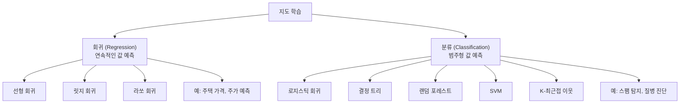
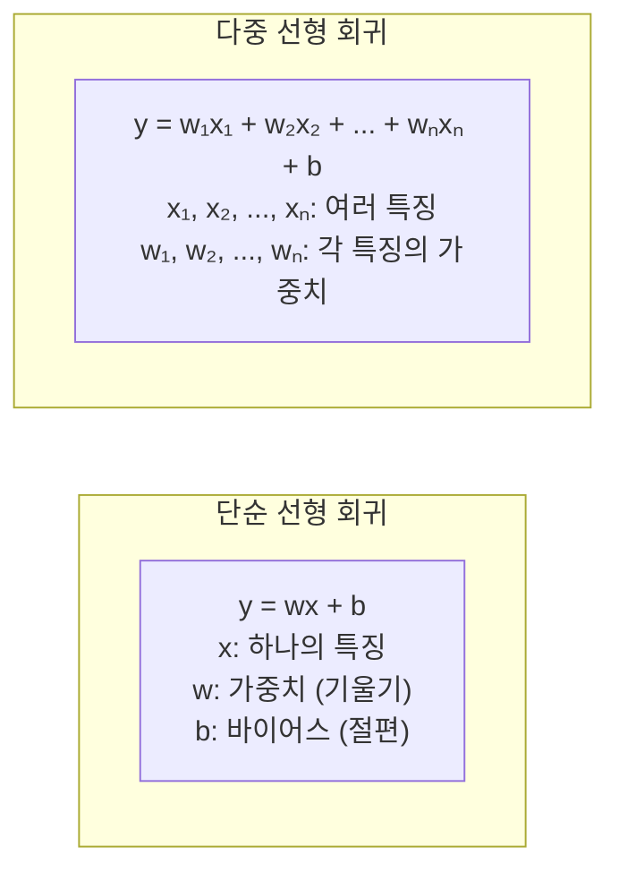
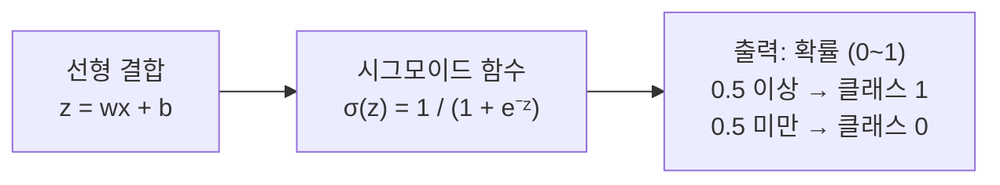
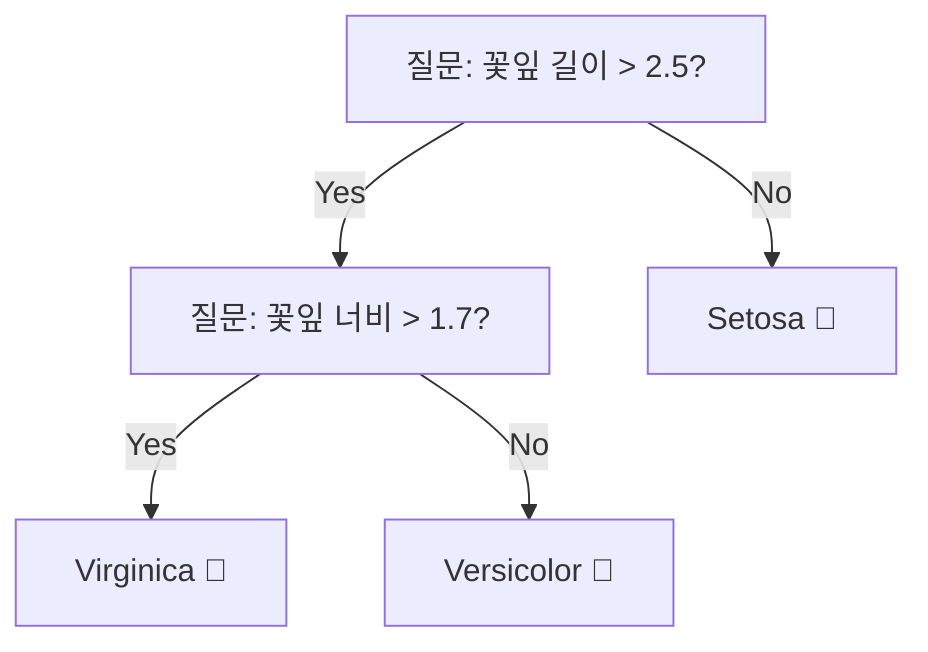
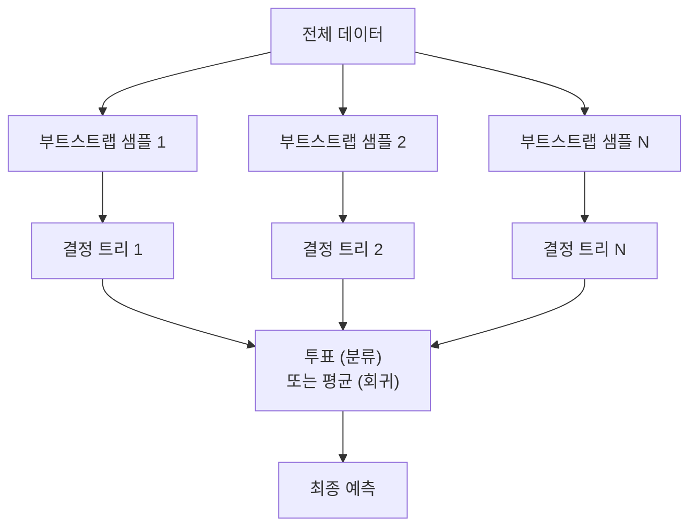
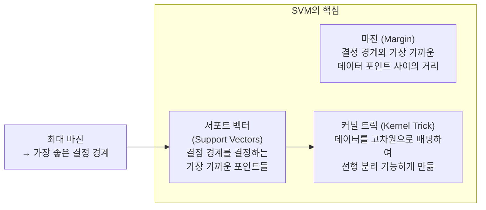
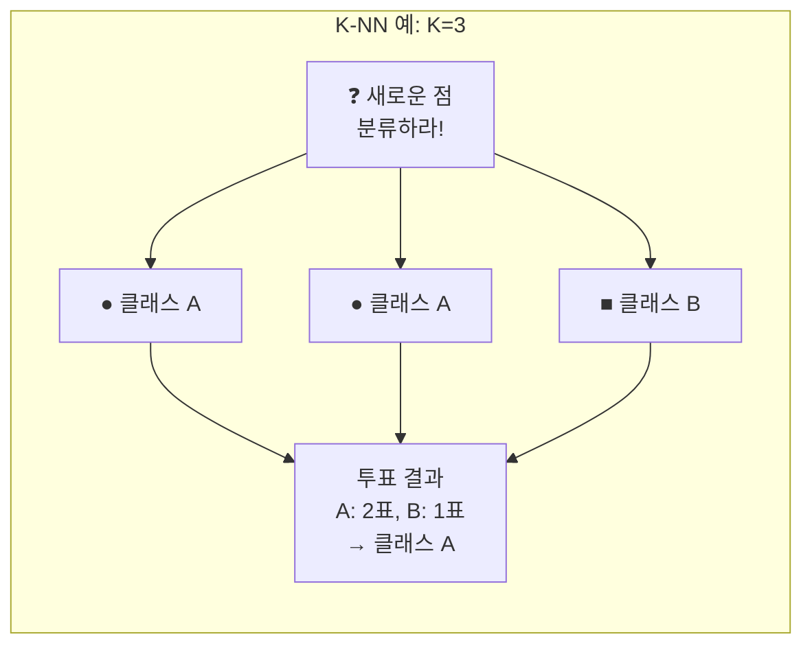
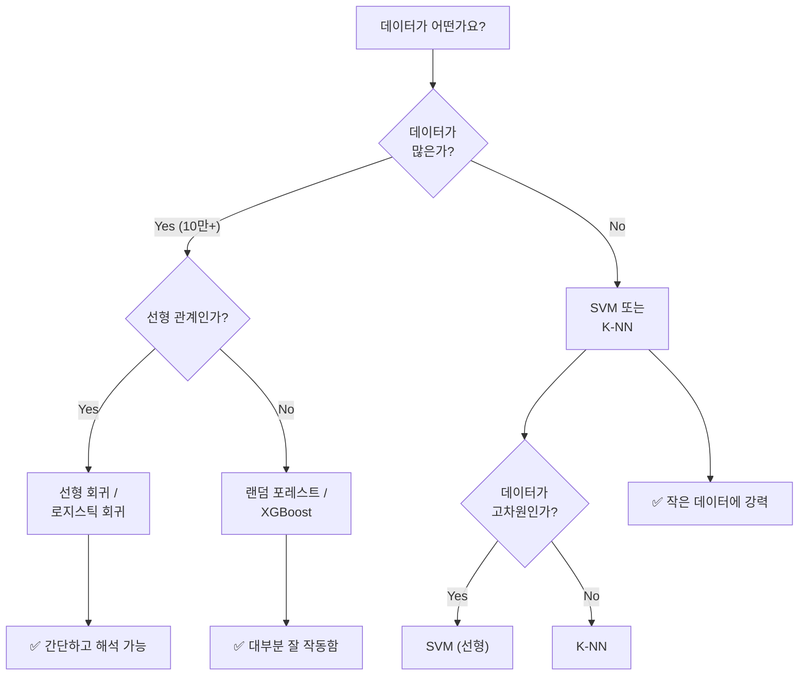

# 06장: 지도 학습 알고리즘

> **🎯 학습 목표**
> - 선형 회귀와 로지스틱 회귀의 원리와 차이를 이해합니다.
> - 결정 트리와 랜덤 포레스트의 작동 방식을 이해합니다.
> - SVM과 K-NN의 개념과 특징을 이해합니다.
> - 문제 유형에 따라 적절한 알고리즘을 선택할 수 있습니다.

---

## 6.1 개요

지도 학습은 **정답이 있는 데이터**로 모델을 학습시키는 방법입니다. 크게 **회귀 (Regression)** 와 **분류 (Classification)** 로 나뉩니다.



---

## 6.2 선형 회귀 (Linear Regression)

### 6.2.1 기본 개념

선형 회귀는 **가장 단순하고 직관적인 회귀 알고리즘**입니다. 입력과 출력의 관계를 직선(또는 초평면)으로 모델링합니다.



```python
import numpy as np
import matplotlib.pyplot as plt
from sklearn.linear_model import LinearRegression
from sklearn.metrics import mean_squared_error

# 데이터 생성: y = 2x + 1 + 노이즈
np.random.seed(42)
X = np.random.rand(50, 1) * 10  # 0~10 사이 값
y = 2 * X.flatten() + 1 + np.random.randn(50) * 2

# 모델 학습
model = LinearRegression()
model.fit(X, y)

print(f"기울기 (w): {model.coef_[0]:.2f}")  # ≈ 2.0
print(f"절편 (b): {model.intercept_:.2f}")   # ≈ 1.0
print(f"R² 점수: {model.score(X, y):.4f}")

# 예측
X_test = np.array([[4], [7], [9]])
y_pred = model.predict(X_test)
print(f"\n4의 예측: {y_pred[0]:.1f} (실제: {2*4+1})")
print(f"7의 예측: {y_pred[1]:.1f} (실제: {2*7+1})")
print(f"9의 예측: {y_pred[2]:.1f} (실제: {2*9+1})")
```

### 6.2.2 여러 특징으로 회귀

```python
from sklearn.linear_model import LinearRegression

# 여러 특징: [크기, 방 개수, 건축년도] → 가격
X = np.array([
    [30, 2, 2000],
    [50, 3, 2010],
    [80, 4, 2015],
    [100, 4, 2020],
    [120, 5, 2023]
])
y = np.array([15000, 25000, 40000, 50000, 60000])

model = LinearRegression()
model.fit(X, y)

# 새 주택 예측
new_house = np.array([[65, 3, 2018]])
predicted = model.predict(new_house)
print(f"예측 가격: {predicted[0]:.0f}만원")

# 각 특징의 중요도
for name, coef in zip(['크기', '방 개수', '건축년도'], model.coef_):
    print(f"{name}의 가중치: {coef:.2f}")
```

### 6.2.3 평가지표

```python
from sklearn.metrics import mean_absolute_error, mean_squared_error, r2_score
import numpy as np

y_true = np.array([3.0, 5.0, 4.0, 7.0, 6.0])
y_pred = np.array([2.8, 5.2, 4.1, 6.5, 6.3])

# MAE: 평균 절대 오차 (직관적)
mae = mean_absolute_error(y_true, y_pred)
print(f"MAE: {mae:.3f}")  # 평균적으로 0.2억 오차

# MSE: 평균 제곱 오차 (큰 오차에 패널티)
mse = mean_squared_error(y_true, y_pred)
print(f"MSE: {mse:.3f}")

# RMSE: MSE의 제곱근 (원래 단위로 변환)
rmse = np.sqrt(mse)
print(f"RMSE: {rmse:.3f}")

# R²: 설명력 (1에 가까울수록 좋음)
r2 = r2_score(y_true, y_pred)
print(f"R²: {r2:.3f}")  # 1.0 = 완벽 예측
```

---

## 6.3 로지스틱 회귀 (Logistic Regression)

로지스틱 회귀는 이름은 회귀이지만 **분류 알고리즘**입니다. 출력을 0~1 사이의 확률로 변환합니다.

### 6.3.1 시그모이드 함수



```python
import numpy as np
import matplotlib.pyplot as plt
from sklearn.linear_model import LogisticRegression
from sklearn.datasets import make_classification

# 시그모이드 함수 시각화
def sigmoid(z):
    return 1 / (1 + np.exp(-z))

z = np.linspace(-10, 10, 100)
s = sigmoid(z)

plt.plot(z, s, linewidth=2)
plt.axhline(0.5, color='gray', linestyle='--')
plt.axvline(0, color='gray', linestyle='--')
plt.xlabel('z = wx + b')
plt.ylabel('σ(z) = P(y=1)')
plt.title('시그모이드 함수')
plt.grid(True, alpha=0.3)
plt.show()
```

### 6.3.2 분류 실습

```python
from sklearn.linear_model import LogisticRegression
from sklearn.model_selection import train_test_split
from sklearn.metrics import accuracy_score, confusion_matrix, classification_report

# 가상 데이터: 공부 시간으로 합격/불합격 예측
np.random.seed(42)
X = np.random.randn(100, 2)  # 2개의 특징
y = (X[:, 0] + X[:, 1] > 0).astype(int)  # 합계가 0보다 크면 합격

X_train, X_test, y_train, y_test = train_test_split(X, y, test_size=0.2)

model = LogisticRegression()
model.fit(X_train, y_train)

y_pred = model.predict(X_test)
print(f"정확도: {accuracy_score(y_test, y_pred):.4f}")
print(f"\n혼동 행렬:\n{confusion_matrix(y_test, y_pred)}")
print(f"\n분류 리포트:\n{classification_report(y_test, y_pred)}")

# 확률 예측
probs = model.predict_proba(X_test[:5])
print(f"\n첫 5개 샘플의 예측 확률:\n{probs}")
```

---

## 6.4 결정 트리 (Decision Tree)

결정 트리는 **IF-THEN 규칙을 자동으로 학습**하는 알고리즘입니다. 직관적이고 해석하기 쉽습니다.



```python
from sklearn.tree import DecisionTreeClassifier, plot_tree
from sklearn.datasets import load_iris
import matplotlib.pyplot as plt

iris = load_iris()
X, y = iris.data, iris.target

model = DecisionTreeClassifier(max_depth=3, random_state=42)
model.fit(X, y)

# 트리 시각화
plt.figure(figsize=(15, 6))
plot_tree(model, feature_names=iris.feature_names,
          class_names=iris.target_names, filled=True)
plt.show()

# 특성 중요도
for name, imp in zip(iris.feature_names, model.feature_importances_):
    print(f"{name}: {imp:.3f}")
```

### 결정 트리의 장단점

| 장점 | 단점 |
|------|------|
| 직관적이고 해석 가능 | 과대적합되기 쉬움 |
| 데이터 스케일링 불필요 | 조금만 데이터가 바뀌어도 트리 구조가 크게 변경 |
| 범주형/수치형 모두 처리 | 단일 트리의 성능 한계 |

---

## 6.5 랜덤 포레스트 (Random Forest)

랜덤 포레스트는 **여러 결정 트리를 모아서 평균**을 내는 앙상블(ensemble) 방법입니다.



```python
from sklearn.ensemble import RandomForestClassifier
from sklearn.datasets import load_iris
from sklearn.model_selection import train_test_split
from sklearn.metrics import accuracy_score

iris = load_iris()
X_train, X_test, y_train, y_test = train_test_split(
    iris.data, iris.target, test_size=0.2, random_state=42
)

# 랜덤 포레스트 학습
rf = RandomForestClassifier(n_estimators=100, max_depth=5, random_state=42)
rf.fit(X_train, y_train)

y_pred = rf.predict(X_test)
print(f"랜덤 포레스트 정확도: {accuracy_score(y_test, y_pred):.4f}")

# 특성 중요도
for name, imp in zip(iris.feature_names, rf.feature_importances_):
    print(f"{name}: {imp:.3f}")
```

### Random Forest vs Decision Tree

```python
# 단일 트리 vs 랜덤 포레스트 비교
dt = DecisionTreeClassifier(random_state=42)
dt.fit(X_train, y_train)
dt_score = dt.score(X_test, y_test)

rf = RandomForestClassifier(n_estimators=100, random_state=42)
rf.fit(X_train, y_train)
rf_score = rf.score(X_test, y_test)

print(f"결정 트리: {dt_score:.4f}")
print(f"랜덤 포레스트: {rf_score:.4f}")
# 일반적으로 랜덤 포레스트의 성능이 더 좋고 안정적입니다.
```

---

## 6.6 SVM (Support Vector Machine)

SVM은 **데이터를 가장 잘 나누는 결정 경계(초평면)** 를 찾습니다.



```python
from sklearn.svm import SVC
from sklearn.datasets import make_classification
from sklearn.model_selection import train_test_split
from sklearn.metrics import accuracy_score

# 선형 SVM
X, y = make_classification(n_samples=200, n_features=2, n_classes=2,
                           n_redundant=0, random_state=42)
X_train, X_test, y_train, y_test = train_test_split(X, y, test_size=0.2)

svm = SVC(kernel='linear')  # 선형 커널
svm.fit(X_train, y_train)
y_pred = svm.predict(X_test)
print(f"SVM (선형) 정확도: {accuracy_score(y_test, y_pred):.4f}")
print(f"서포트 벡터 개수: {len(svm.support_vectors_)}")

# RBF 커널 (비선형)
svm_rbf = SVC(kernel='rbf')  # 기본값, 비선형 문제에 좋음
svm_rbf.fit(X_train, y_train)
y_pred_rbf = svm_rbf.predict(X_test)
print(f"SVM (RBF) 정확도: {accuracy_score(y_test, y_pred_rbf):.4f}")
```

### SVM의 장단점

| 장점 | 단점 |
|------|------|
| 고차원 데이터에 효과적 | 데이터가 많을수록 느려짐 |
| 결정 경계가 명확하고 강건 | 커널 선택과 하이퍼파라미터 튜닝이 까다로움 |
| 다양한 커널로 비선형 문제 해결 | 확률 예측이 어려움 |

---

## 6.7 K-최근접 이웃 (K-Nearest Neighbors)

K-NN은 **가장 가까운 K개의 이웃을 보고 투표**하는 가장 직관적인 알고리즘입니다.



```python
from sklearn.neighbors import KNeighborsClassifier
from sklearn.datasets import load_iris
from sklearn.model_selection import train_test_split
from sklearn.preprocessing import StandardScaler
from sklearn.metrics import accuracy_score

iris = load_iris()
X_train, X_test, y_train, y_test = train_test_split(
    iris.data, iris.target, test_size=0.2, random_state=42
)

# K-NN은 스케일에 민감하므로 표준화 필수
scaler = StandardScaler()
X_train_scaled = scaler.fit_transform(X_train)
X_test_scaled = scaler.transform(X_test)

# K=3, 5, 7 비교
for k in [1, 3, 5, 7, 11]:
    knn = KNeighborsClassifier(n_neighbors=k)
    knn.fit(X_train_scaled, y_train)
    score = knn.score(X_test_scaled, y_test)
    print(f"K={k}: 정확도 {score:.4f}")
```

---

## 6.8 알고리즘 선택 가이드



### 알고리즘 비교표

| 알고리즘 | 문제 유형 | 장점 | 단점 | 사용 예 |
|---------|---------|------|------|---------|
| **선형 회귀** | 회귀 | 간단, 빠름, 해석 용이 | 선형 관계만 학습 | 주택 가격 예측 |
| **로지스틱 회귀** | 분류 | 간단, 확률 출력, 해석 용이 | 복잡한 패턴 학습 어려움 | 스팸 탐지 |
| **결정 트리** | 분류/회귀 | 직관적, 해석 가능, 스케일 불필요 | 과대적합, 불안정 | 진단 의사 결정 |
| **랜덤 포레스트** | 분류/회귀 | 대부분 잘 작동, 변수 중요도 제공 | 느림, 해석 어려움 | 고객 이탈 예측 |
| **SVM** | 분류/회귀 | 고차원에 강함, 결정 경계 명확 | 대규모 데이터에 느림 | 얼굴 인식 |
| **K-NN** | 분류/회귀 | 직관적, 학습 불필요 | 느린 예측, 스케일 민감 | 추천 시스템 |

---

## 📋 한눈에 정리

| 알고리즘 | 가정 | 학습 방식 | 예측 방식 |
|---------|------|----------|----------|
| 선형 회귀 | 선형 관계 | 최소제곱법 | 직선/초평면 |
| 로지스틱 회귀 | 선형 결정 경계 | 최대 우도 추정 | 시그모이드 → 확률 |
| 결정 트리 | 계층적 규칙 | 정보 이득 최대화 | IF-THEN 규칙 따르기 |
| 랜덤 포레스트 | 여러 트리의 평균 | 부트스트랩 + 랜덤 특성 선택 | 다수결 투표 |
| SVM | 최대 마진 | 마진 최대화 최적화 | 결정 경계 기준 |
| K-NN | 유사한 데이터는 같은 클래스 | 없음 (게으른 학습) | 가장 가까운 이웃 투표 |

---

## ✏️ 연습 문제

1. Scikit-learn의 `make_regression`으로 회귀 데이터를 생성하고, 선형 회귀를 학습한 후 MSE와 R²를 계산하세요.

2. Iris 데이터셋으로 **로지스틱 회귀, 결정 트리, 랜덤 포레스트, SVM, K-NN**의 정확도를 비교하는 코드를 작성하세요. 가장 성능이 좋은 알고리즘은 무엇인가요?

3. **결정 트리와 랜덤 포레스트**의 차이점을 설명하고, 랜덤 포레스트가 더 좋은 이유를 쓰세요.

4. K-NN에서 **K값이 너무 작을 때(1)와 너무 클 때(50)** 각각 어떤 문제가 발생할까요?

5. 다음 문제에 어떤 알고리즘이 가장 적합할지 선택하고 이유를 설명하세요.
   - 수백만 개의 뉴스 기사를 5개 주제로 분류
   - 적은 데이터로 암 진단 (생존/사망)
   - 실시간으로 들어오는 주식 거래 사기 탐지
   - 고객의 나이, 소득, 거주 지역으로 구매 금액 예측

---

## 📝 연습 문제 정답

<details>
<summary>정답 보기</summary>

**1. 선형 회귀 MSE와 R²**
```python
from sklearn.datasets import make_regression
from sklearn.model_selection import train_test_split
from sklearn.linear_model import LinearRegression
from sklearn.metrics import mean_squared_error, r2_score

X, y = make_regression(n_samples=200, n_features=5, noise=10, random_state=42)
X_train, X_test, y_train, y_test = train_test_split(X, y, test_size=0.2)
model = LinearRegression().fit(X_train, y_train)
y_pred = model.predict(X_test)
print(f"MSE: {mean_squared_error(y_test, y_pred):.2f}")
print(f"R²: {r2_score(y_test, y_pred):.4f}")  # 1에 가까울수록 좋음
```

**2. Iris 데이터 알고리즘 비교**
```python
from sklearn.datasets import load_iris
from sklearn.model_selection import train_test_split, cross_val_score
from sklearn.linear_model import LogisticRegression
from sklearn.tree import DecisionTreeClassifier
from sklearn.ensemble import RandomForestClassifier
from sklearn.svm import SVC
from sklearn.neighbors import KNeighborsClassifier

iris = load_iris()
X, y = iris.data, iris.target
models = {
    "로지스틱 회귀": LogisticRegression(max_iter=1000),
    "결정 트리": DecisionTreeClassifier(),
    "랜덤 포레스트": RandomForestClassifier(),
    "SVM": SVC(),
    "K-NN": KNeighborsClassifier()
}
for name, model in models.items():
    scores = cross_val_score(model, X, y, cv=5)
    print(f"{name}: {scores.mean():.4f} (±{scores.std():.4f})")
```
→ 일반적으로 랜덤 포레스트나 SVM이 가장 높은 성능을 보입니다.

**3. 결정 트리 vs 랜덤 포레스트**
- **결정 트리:** 하나의 트리, 과대적합 위험, 데이터 변화에 민감
- **랜덤 포레스트:** 여러 트리의 앙상블, 분산 감소, 과대적합 방지, 더 안정적
- 랜덤 포레스트가 더 좋은 이유: 부트스트래핑 + 랜덤 특성 선택으로 트리들의 상관관계를 낮춰 앙상블 효과 극대화

**4. K값의 영향**
- **K=1 (너무 작음):** 과대적합, 노이즈에 민감, 결정 경계가 불규칙
- **K=50 (너무 큼):** 과소적합, 경계가 너무 부드러워짐, 지역적 패턴을 놓침
→ 적절한 K값은 데이터에 따라 다르며, 보통 √n 주변에서 찾습니다.

**5. 알고리즘 선택**
- 수백만 뉴스 분류 → **나이브 베이즈 또는 선형 SVM** (대규모 텍스트에 효율적)
- 적은 데이터 암 진단 → **SVM (RBF 커널)** (적은 데이터에 강함)
- 실시간 사기 탐지 → **로지스틱 회귀 또는 결정 트리** (빠른 예측)
- 고객 정보로 가격 예측 → **랜덤 포레스트 또는 XGBoost** (수치 + 범주형 혼합에 강함)

</details>

---

> **🔄 다음 장에서는** 비지도 학습을 배웁니다. 정답 없이 데이터의 숨겨진 패턴을 찾는 K-Means 군집화, 계층적 군집화, DBSCAN, PCA 차원 축소 등을 다룹니다.
