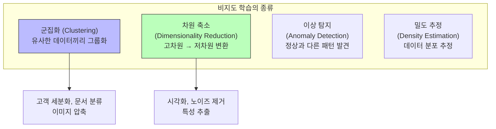
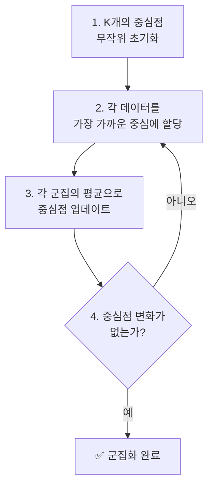
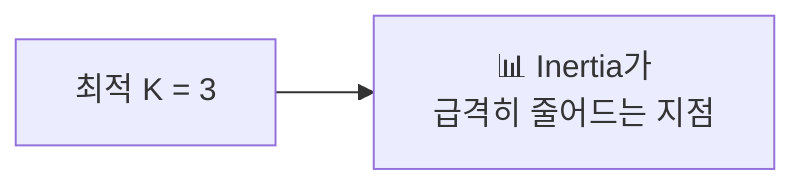
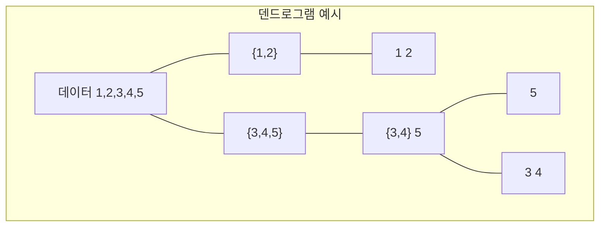
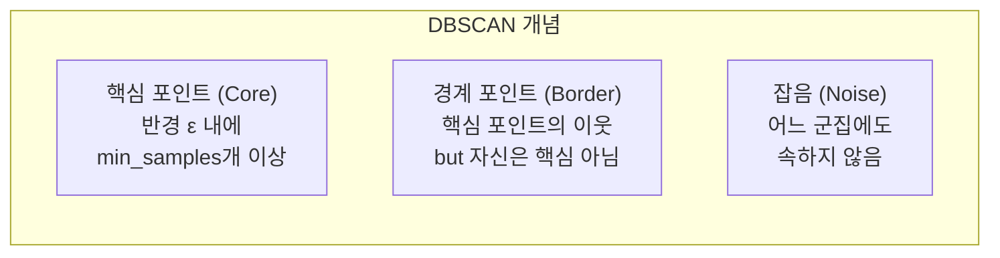
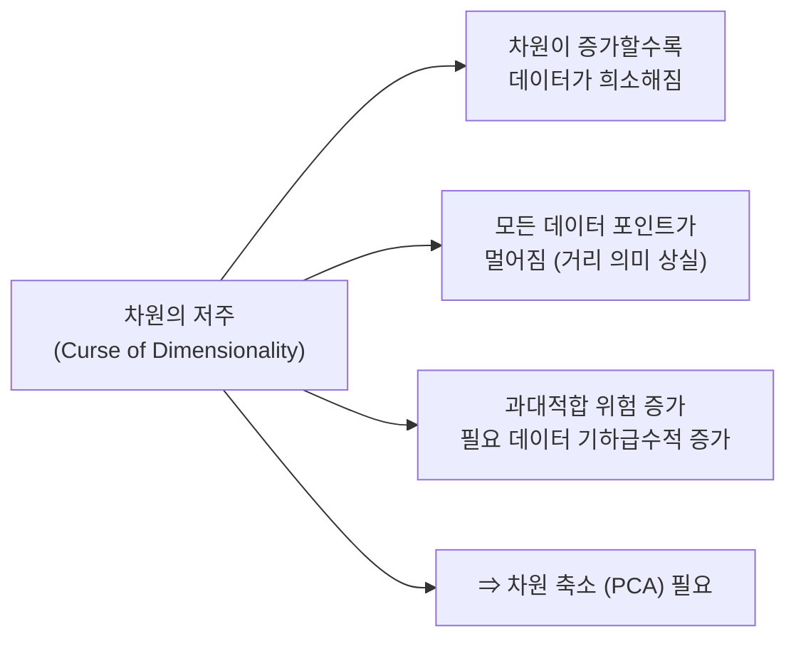
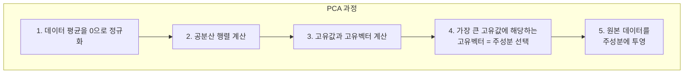
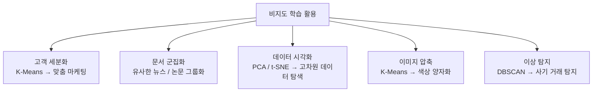

# 07장: 비지도 학습

> **🎯 학습 목표**
> - K-Means 군집화의 원리와 한계를 이해합니다.
> - 계층적 군집화와 DBSCAN의 특징을 이해합니다.
> - PCA의 원리와 차원 축소의 목적을 이해합니다.
> - 비지도 학습을 실제 데이터에 적용할 수 있습니다.

---

## 7.1 비지도 학습이란?

비지도 학습은 **정답(레이블) 없이 데이터 자체의 구조**를 발견하는 학습 방법입니다.



---

## 7.2 K-Means 군집화

K-Means는 **가장 널리 사용되는 군집화 알고리즘**입니다. K개의 중심점을 기준으로 데이터를 그룹화합니다.

### 7.2.1 알고리즘 과정



```python
import numpy as np
import matplotlib.pyplot as plt
from sklearn.cluster import KMeans
from sklearn.datasets import make_blobs

# 데이터 생성: 3개의 군집
X, y_true = make_blobs(n_samples=300, centers=3, cluster_std=0.60, random_state=42)

# K-Means 군집화
kmeans = KMeans(n_clusters=3, random_state=42)
kmeans.fit(X)
y_kmeans = kmeans.predict(X)

# 시각화
plt.scatter(X[:, 0], X[:, 1], c=y_kmeans, s=50, cmap='viridis')
centers = kmeans.cluster_centers_
plt.scatter(centers[:, 0], centers[:, 1], c='red', s=200, marker='X')
plt.title('K-Means 군집화 결과')
plt.show()

print(f"군집 중심점:\n{centers}")
print(f"각 데이터의 군집 레이블 (처음 10개): {y_kmeans[:10]}")
```

### 7.2.2 적절한 K값 찾기 (엘보우 방법)

```python
from sklearn.cluster import KMeans

inertias = []
K_range = range(1, 11)

for k in K_range:
    kmeans = KMeans(n_clusters=k, random_state=42)
    kmeans.fit(X)
    inertias.append(kmeans.inertia_)  # 군집 내 거리 제곱합

# 엘보우 그래프
plt.plot(K_range, inertias, 'bo-')
plt.xlabel('K (군집 수)')
plt.ylabel('Inertia (군집 내 거리)')
plt.title('엘보우 방법으로 최적 K 찾기')
plt.grid(True, alpha=0.3)
plt.show()
```



### 7.2.3 실전 예제: 고객 세분화

```python
import pandas as pd
import numpy as np
from sklearn.cluster import KMeans
from sklearn.preprocessing import StandardScaler
import matplotlib.pyplot as plt

# 가상의 고객 데이터
np.random.seed(42)
n = 200

customers = pd.DataFrame({
    'age': np.random.randint(18, 70, n),
    'income': np.random.randint(2000, 15000, n),  # 월 소득 (만원)
    'spending_score': np.random.randint(1, 100, n),  # 지출 점수 (1-100)
    'visit_frequency': np.random.randint(1, 30, n),  # 월 방문 횟수
})

# 표준화 (K-Means는 스케일에 민감)
scaler = StandardScaler()
customers_scaled = scaler.fit_transform(customers)

# K-Means 군집화
kmeans = KMeans(n_clusters=4, random_state=42)
customers['cluster'] = kmeans.fit_predict(customers_scaled)

# 군집별 특성 분석
print("=== 군집별 특성 ===")
print(customers.groupby('cluster').mean().round(1))

# 각 군집의 특징 파악
for cluster in range(4):
    cluster_data = customers[customers['cluster'] == cluster]
    print(f"\n군집 {cluster}: {len(cluster_data)}명")
    print(f"  평균 나이: {cluster_data['age'].mean():.0f}세")
    print(f"  평균 소득: {cluster_data['income'].mean():.0f}만원")
    print(f"  평균 지출: {cluster_data['spending_score'].mean():.0f}점")
```

---

## 7.3 계층적 군집화 (Hierarchical Clustering)

계층적 군집화는 **군집의 계층 구조를 트리 형태로** 만듭니다.



```python
import numpy as np
import matplotlib.pyplot as plt
from sklearn.cluster import AgglomerativeClustering
from scipy.cluster.hierarchy import dendrogram, linkage

# 데이터 생성
np.random.seed(42)
X = np.random.randn(30, 2)

# 계층적 군집화
hc = AgglomerativeClustering(n_clusters=3, linkage='ward')
labels = hc.fit_predict(X)

# 덴드로그램 그리기
Z = linkage(X, method='ward')
plt.figure(figsize=(10, 5))
dendrogram(Z)
plt.title('계층적 군집화 덴드로그램')
plt.xlabel('데이터 포인트')
plt.ylabel('거리')
plt.show()
```

---

## 7.4 DBSCAN

DBSCAN은 **밀도 기반 군집화**로, **이상치 탐지**에 효과적이고 군집의 형태가 원형이 아니어도 됩니다.



```python
from sklearn.cluster import DBSCAN
from sklearn.datasets import make_moons

# 복잡한 형태의 데이터 (K-Means가 잘 못하는)
X, _ = make_moons(n_samples=200, noise=0.05, random_state=42)

# DBSCAN
dbscan = DBSCAN(eps=0.3, min_samples=5)
labels = dbscan.fit_predict(X)

print(f"군집 레이블 (처음 20개): {labels[:20]}")
print(f"잡음으로 분류된 포인트 수: {list(labels).count(-1)}")

# K-Means와 비교
kmeans = KMeans(n_clusters=2, random_state=42)
kmeans_labels = kmeans.fit_predict(X)

fig, (ax1, ax2) = plt.subplots(1, 2, figsize=(12, 4))
ax1.scatter(X[:, 0], X[:, 1], c=labels, cmap='viridis', s=50)
ax1.set_title('DBSCAN')
ax2.scatter(X[:, 0], X[:, 1], c=kmeans_labels, cmap='viridis', s=50)
ax2.set_title('K-Means (잘못된 군집화)')
plt.show()
```

---

## 7.5 PCA (주성분 분석)

PCA는 **차원 축소**의 가장 대표적인 방법입니다. 고차원 데이터를 저차원으로 변환하면서 정보를 최대한 보존합니다.

### 7.5.1 차원의 저주



### 7.5.2 PCA 실습

```python
import numpy as np
import matplotlib.pyplot as plt
from sklearn.decomposition import PCA
from sklearn.datasets import load_iris

iris = load_iris()
X, y = iris.data, iris.target

# PCA 변환 (4차원 → 2차원)
pca = PCA(n_components=2)
X_pca = pca.fit_transform(X)

print(f"원본 shape: {X.shape}")
print(f"PCA 후 shape: {X_pca.shape}")
print(f"설명 분산 비율: {pca.explained_variance_ratio_}")
print(f"누적 설명 분산: {sum(pca.explained_variance_ratio_):.3f}")

# 2D 시각화
plt.figure(figsize=(8, 6))
scatter = plt.scatter(X_pca[:, 0], X_pca[:, 1], c=y, cmap='viridis', s=50)
plt.xlabel('제1 주성분')
plt.ylabel('제2 주성분')
plt.title('Iris 데이터 — PCA 2D 시각화')
plt.colorbar(scatter)
plt.show()
```



```python
# 주성분의 의미 파악
components = pd.DataFrame(
    pca.components_,
    columns=iris.feature_names,
    index=['PC1', 'PC2']
)
print("\n주성분 로딩 (각 특성의 기여도):")
print(components)

# 재구성 오차 확인
X_reconstructed = pca.inverse_transform(X_pca)
reconstruction_error = np.mean((X - X_reconstructed) ** 2)
print(f"\n재구성 오차 (MSE): {reconstruction_error:.5f}")
```

### 7.5.3 PCA로 노이즈 제거

```python
from sklearn.datasets import load_digits

# 손글씨 숫자 데이터
digits = load_digits()
X_digits, y_digits = digits.data, digits.target
print(f"데이터 shape: {X_digits.shape}")  # (1797, 64) - 8x8 이미지

# 다양한 차원으로 PCA
for n in [2, 8, 16, 32]:
    pca = PCA(n_components=n)
    X_pca = pca.fit_transform(X_digits)
    var_ratio = sum(pca.explained_variance_ratio_)
    print(f"PCA({n}D): 설명 분산 {var_ratio:.3f}")
```

---

## 7.6 비지도 학습 활용 사례



### 이미지 압축 예제 (K-Means 색상 양자화)

```python
from sklearn.cluster import KMeans
import numpy as np
from PIL import Image
import matplotlib.pyplot as plt

# 이미지를 색상 양자화로 압축
# (이미지가 없으므로 랜덤 데이터로 데모)
np.random.seed(42)
image = np.random.randint(0, 256, (100, 100, 3), dtype=np.uint8)

# 이미지 데이터를 픽셀 목록으로 변환
pixels = image.reshape(-1, 3)

# K-Means로 주요 색상 추출
k = 16  # 16가지 색상으로 압축
kmeans = KMeans(n_clusters=k, random_state=42)
labels = kmeans.fit_predict(pixels)
colors = kmeans.cluster_centers_.astype(np.uint8)

# 압축된 이미지 재구성
compressed = colors[labels].reshape(image.shape)

print(f"원본 색상 수: {len(np.unique(pixels, axis=0))}")
print(f"압축 후 색상 수: {k}")
print(f"압축 전 크기: {image.nbytes} bytes")
print(f"압축 후 크기: {k * 3 + len(labels) * 1} bytes (색상표 + 인덱스)")
```

---

## 📋 한눈에 정리

| 알고리즘 | 유형 | K 사전 지정 | 군집 형태 | 이상치 처리 | 스케일 |
|---------|------|-----------|----------|-----------|-------|
| **K-Means** | 군집화 | 필요 | 원형 | 민감 | 중요 |
| **계층적** | 군집화 | 불필요 | 다양 | 보통 | 영향 있음 |
| **DBSCAN** | 군집화 | 불필요 | 자유로움 | **강건** | 영향 있음 |
| **PCA** | 차원 축소 | 출력 차원 지정 | N/A | N/A | 중요 |

---

## ✏️ 연습 문제

1. `make_blobs(n_samples=500, centers=5)`로 데이터를 생성하고 K-Means로 군집화하세요. 엘보우 방법으로 최적의 K 값을 찾으세요.

2. **K-Means의 한계**는 무엇인가요? DBSCAN이 K-Means보다 더 잘하는 경우는 언제인가요?

3. Iris 데이터셋에 PCA를 적용하여 2차원으로 축소하고 시각화하세요. 원본 4차원의 분산을 얼마나 보존하나요?

4. 다음 각 상황에 가장 적합한 비지도 학습 알고리즘을 선택하세요.
   - a) 고객 데이터에서 5개의 세그먼트를 찾아야 함 (군집 수를 미리 알고 있음)
   - b) 나선형(spiral) 모양의 데이터에서 군집 발견
   - c) 1000차원 데이터를 2차원으로 줄여서 시각화
   - d) 센서 데이터에서 이상치(고장 징후) 탐지

5. `load_digits()` 데이터에 PCA를 적용하고, 처음 2개 주성분으로 산점도를 그리고, 숫자 레이블로 색상을 칠해보세요. 같은 숫자가 가까이 모여 있나요?

---

## 📝 연습 문제 정답

<details>
<summary>정답 보기</summary>

**1. K-Means 엘보우 방법**
```python
from sklearn.datasets import make_blobs
from sklearn.cluster import KMeans
import matplotlib.pyplot as plt

X, _ = make_blobs(n_samples=500, centers=5, random_state=42)
inertias = []
for k in range(1, 11):
    kmeans = KMeans(n_clusters=k, random_state=42).fit(X)
    inertias.append(kmeans.inertia_)

plt.plot(range(1, 11), inertias, 'bo-')
plt.xlabel('K'); plt.ylabel('Inertia'); plt.title('엘보우 방법')
plt.show()
```
→ Inertia가 급격히 줄어드는 지점이 최적 K (여기서는 K=5)

**2. K-Means의 한계와 DBSCAN의 장점**
- **K-Means 한계:** (1) K를 미리 지정해야 함 (2) 원형 군집만 가능 (3) 이상치에 민감 (4) 밀도가 다른 군집 처리 어려움
- **DBSCAN이 더 잘하는 경우:** (1) 나선형/초승달 모양의 군집 (2) 이상치가 많은 데이터 (3) 군집 수를 모를 때 (4) 밀도가 다양한 군집

**3. Iris PCA**
```python
from sklearn.datasets import load_iris
from sklearn.decomposition import PCA
import matplotlib.pyplot as plt

iris = load_iris()
pca = PCA(n_components=2).fit(iris.data)
print(f"설명 분산 비율: {pca.explained_variance_ratio_}")
print(f"누적 설명 분산: {sum(pca.explained_variance_ratio_):.3f}")
# 보통 0.95~0.98로 4차원 분산의 대부분을 2차원으로 보존
```

**4. 상황별 알고리즘 선택**
- a) 5개 세그먼트 필요 → **K-Means** (K를 미리 앎)
- b) 나선형 군집 → **DBSCAN** (원형이 아닌 형태 처리)
- c) 1000→2차원 시각화 → **PCA** 또는 **t-SNE**
- d) 이상치(고장) 탐지 → **DBSCAN** (이상치를 잡음으로 분류)

**5. Digits PCA 시각화**
```python
from sklearn.datasets import load_digits
from sklearn.decomposition import PCA
import matplotlib.pyplot as plt

digits = load_digits()
pca = PCA(n_components=2)
X_pca = pca.fit_transform(digits.data)
plt.scatter(X_pca[:,0], X_pca[:,1], c=digits.target, cmap='tab10', s=30)
plt.colorbar()
plt.title('Digits PCA 시각화')
plt.show()
```
→ 같은 숫자가 대체로 가까이 모여 있습니다. 예: 0은 왼쪽 아래, 1은 오른쪽 위 등.

</details>

---

> **🔄 다음 장에서는** 모델의 성능을 평가하고 최적화하는 방법을 배웁니다. 교차 검증, 하이퍼파라미터 튜닝, 특성 공학, 앙상블 기법 등을 다룹니다.
