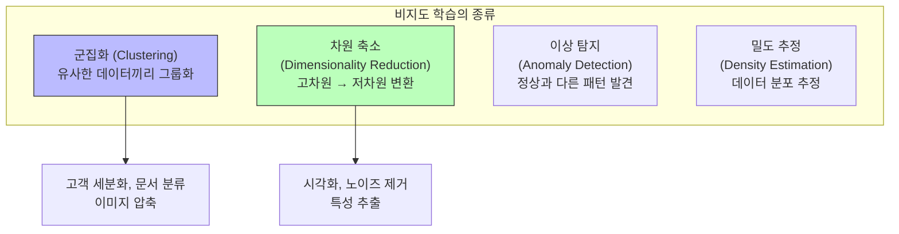
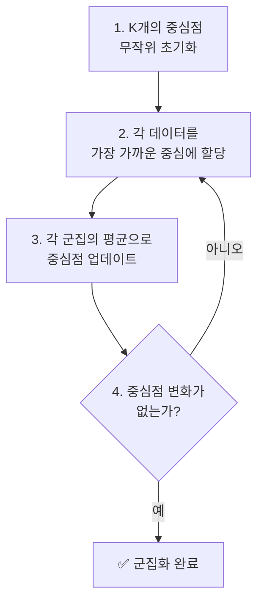
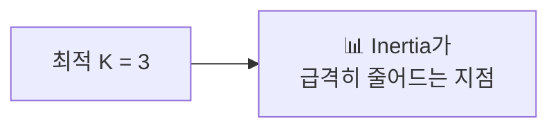
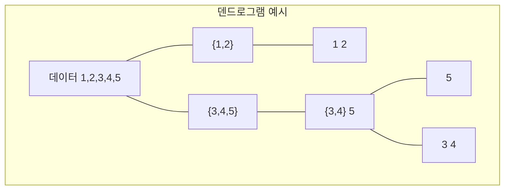
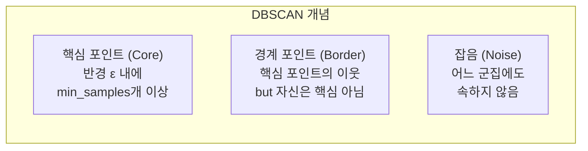
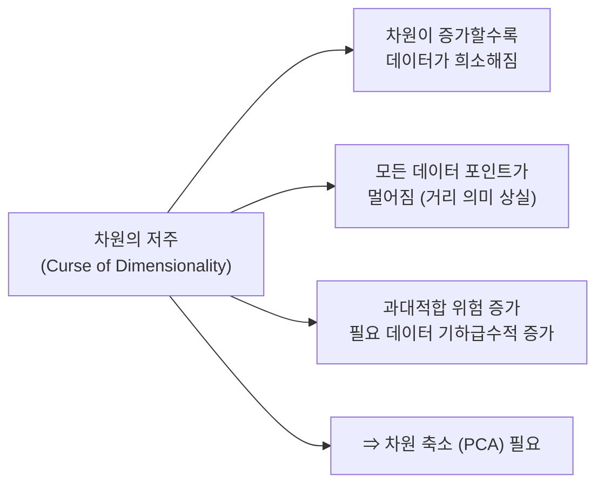
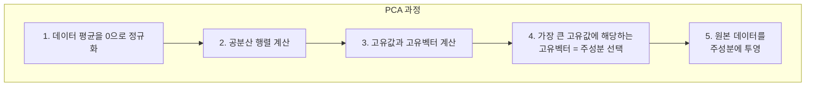
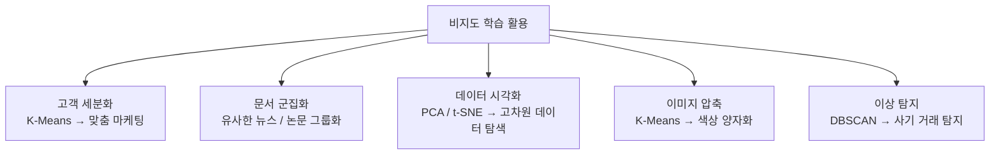

# 07장: 비지도 학습

> **🎯 학습 목표**
> - K-Means 군집화의 원리와 한계를 이해합니다.
> - 계층적 군집화와 DBSCAN의 특징을 이해합니다.
> - PCA의 원리와 차원 축소의 목적을 이해합니다.
> - 비지도 학습을 실제 데이터에 적용할 수 있습니다.

---

## 👨‍💻 실전 프로젝트: 고객 세그먼트 클러스터링

비지도 학습의 실제 응용을 체험하기 위하여, 이번 프로젝트에서는 가상의 고객 데이터를 생성하고 K-Means 알고리즘을 적용하여 고객 세그먼트를 발견해 보겠습니다. 고객 세그먼트 클러스터링은 마케팅 분야에서 가장 널리 활용되는 비지도 학습 기법 중 하나로, 기업은 이를 통해 고객을 유사한 특성을 가진 그룹으로 나누고 각 그룹에 맞춤형 전략을 수립할 수 있습니다. 본 프로젝트에서는 make_blobs 함수를 사용하여 여러 개의 군집으로 이루어진 데이터를 생성한 후, K-Means를 적용하여 군집을 찾고 그 결과를 시각화할 것입니다. 또한 각 군집의 중심점을 함께 표시하여 군집의 대표 지점을 파악하는 방법도 살펴보겠습니다.

```python
import numpy as np
import matplotlib.pyplot as plt
from sklearn.cluster import KMeans
from sklearn.datasets import make_blobs

# 1. 가상의 고객 데이터 생성
X, y_true = make_blobs(n_samples=500, centers=4, cluster_std=1.2, random_state=42)

# 2. K-Means 군집화 수행
kmeans = KMeans(n_clusters=4, random_state=42, n_init=10)
y_pred = kmeans.fit_predict(X)

# 3. 군집화 결과 시각화
plt.figure(figsize=(10, 6))
colors = ['#FF6B6B', '#4ECDC4', '#45B7D1', '#96CEB4']
for i in range(4):
    plt.scatter(X[y_pred == i, 0], X[y_pred == i, 1], 
                c=colors[i], label=f'세그먼트 {i+1}', s=50, alpha=0.7)

# 군집 중심점 표시
centers = kmeans.cluster_centers_
plt.scatter(centers[:, 0], centers[:, 1], c='black', marker='X', 
            s=200, linewidths=3, label='군집 중심점')
plt.xlabel('특성 1')
plt.ylabel('특성 2')
plt.title('K-Means를 활용한 고객 세그먼트 클러스터링 결과')
plt.legend()
plt.grid(True, alpha=0.3)
plt.show()

print("=== 세그먼트 분석 결과 ===")
for i in range(4):
    print(f"세그먼트 {i+1}: {len(X[y_pred == i])}명의 고객")
print(f"\n군집 중심점 좌표:\n{centers}")
```

위 코드를 실행하면 4개의 고객 세그먼트가 시각적으로 표현됩니다. 각 세그먼트는 서로 다른 색상으로 구분되며, 검은색 X 표시는 각 군집의 중심점을 나타냅니다. 이렇게 발견된 세그먼트는 이후 마케팅 팀에서 맞춤형 프로모션을 기획하거나 제품 전략을 수립하는 데 기초 자료로 활용될 수 있습니다. 이제 비지도 학습의 개념을 체계적으로 이해하기 위하여, 먼저 비지도 학습이 무엇인지부터 자세히 알아보겠습니다.

---

## 7.1 비지도 학습이란?

비지도 학습은 **정답(레이블) 없이 데이터 자체의 구조**를 발견하는 학습 방법입니다. 지도 학습이 입력과 출력 간의 매핑 관계를 학습하는 것과 달리, 비지도 학습은 오직 입력 데이터 X만을 사용하여 데이터 내부에 숨겨진 패턴이나 구조를 스스로 찾아내야 합니다. 이러한 학습 방식은 데이터에 레이블을 부여하는 것이 어렵거나 비용이 많이 드는 상황에서 특히 유용합니다. 예를 들어 수백만 명의 고객 데이터를 수동으로 레이블링하는 것은 현실적으로 불가능에 가깝지만, 비지도 학습을 활용하면 데이터만으로도 유용한 인사이트를 얻을 수 있습니다. 비지도 학습의 주요 범주로는 군집화, 차원 축소, 이상 탐지, 밀도 추정 등이 있으며, 아래 다이어그램에서 각 범주의 관계를 확인할 수 있습니다.



비지도 학습의 여러 범주 중에서도 가장 실용적으로 널리 활용되는 분야는 바로 군집화입니다. 이제부터 군집화의 대표적인 알고리즘인 K-Means에 대해 자세히 살펴보도록 하겠습니다.

---

## 7.2 K-Means 군집화

K-Means는 **가장 널리 사용되는 군집화 알고리즘**입니다. K개의 중심점을 기준으로 데이터를 그룹화합니다. 이 알고리즘은 전체 데이터를 K개의 그룹으로 나누기 위하여 각 데이터 포인트와 가장 가까운 중심점을 할당하는 방식으로 동작합니다. 모든 할당이 완료된 후에는 각 군집에 속한 데이터들의 평균 위치로 중심점이 재조정되며, 이 과정을 중심점의 변화가 없을 때까지 반복 수행합니다. K-Means는 구현이 간단하고 계산 속도가 빠르며 대용량 데이터에도 효율적으로 적용할 수 있다는 장점을 지니고 있습니다.

### 7.2.1 알고리즘 과정

K-Means 알고리즘은 크게 네 단계로 구성되며, 각 단계가 순차적으로 반복 실행되면서 점진적으로 최적의 군집을 찾아갑니다. 아래 다이어그램은 이 과정을 시각적으로 정리한 것입니다.



첫 번째 단계에서는 K개의 중심점을 데이터 공간 내에 무작위로 배치합니다. 두 번째 단계에서는 각 데이터 포인트를 가장 가까운 중심점에 할당하여 임시적인 군집을 형성합니다. 세 번째 단계에서는 각 군집에 속한 데이터들의 평균 좌표를 계산하여 중심점을 새로운 위치로 이동시킵니다. 마지막으로 네 번째 단계에서는 중심점의 위치 변화가 더 이상 없는지 확인하고, 변화가 없다면 알고리즘을 종료하고 그렇지 않다면 두 번째 단계로 돌아가 반복합니다. 다음 코드는 make_blobs 함수를 사용하여 3개의 군집으로 이루어진 데이터를 생성하고 K-Means로 군집화하는 실제 예제입니다.

```python
import numpy as np
import matplotlib.pyplot as plt
from sklearn.cluster import KMeans
from sklearn.datasets import make_blobs

# 데이터 생성: 3개의 군집
X, y_true = make_blobs(n_samples=300, centers=3, cluster_std=0.60, random_state=42)

# K-Means 군집화
kmeans = KMeans(n_clusters=3, random_state=42)
kmeans.fit(X)
y_kmeans = kmeans.predict(X)

# 시각화
plt.scatter(X[:, 0], X[:, 1], c=y_kmeans, s=50, cmap='viridis')
centers = kmeans.cluster_centers_
plt.scatter(centers[:, 0], centers[:, 1], c='red', s=200, marker='X')
plt.title('K-Means 군집화 결과')
plt.show()

print(f"군집 중심점:\n{centers}")
print(f"각 데이터의 군집 레이블 (처음 10개): {y_kmeans[:10]}")
```

### 7.2.2 적절한 K값 찾기 (엘보우 방법)

K-Means를 사용할 때 가장 중요한 결정 중 하나는 군집의 개수 K를 어떻게 정할 것인가입니다. 엘보우 방법은 이 문제를 해결하기 위한 대표적인 기법으로, K값을 변화시키면서 군집 내 거리 제곱합(inertia)을 계산하고 그 변화를 그래프로 확인합니다. 일반적으로 K가 증가할수록 inertia는 감소하지만, 어느 지점부터는 감소 폭이 급격히 줄어듭니다. 이때 inertia가 급격히 감소하는 지점, 즉 그래프에서 팔꿈치(elbow)처럼 꺾이는 지점이 최적의 K로 판단됩니다. 아래 코드는 K를 1부터 10까지 변화시키면서 inertia 값을 계산하고 엘보우 그래프를 그리는 과정을 보여줍니다.

```python
from sklearn.cluster import KMeans

inertias = []
K_range = range(1, 11)

for k in K_range:
    kmeans = KMeans(n_clusters=k, random_state=42)
    kmeans.fit(X)
    inertias.append(kmeans.inertia_)  # 군집 내 거리 제곱합

# 엘보우 그래프
plt.plot(K_range, inertias, 'bo-')
plt.xlabel('K (군집 수)')
plt.ylabel('Inertia (군집 내 거리)')
plt.title('엘보우 방법으로 최적 K 찾기')
plt.grid(True, alpha=0.3)
plt.show()
```



### 7.2.3 실전 예제: 고객 세분화

이번 예제에서는 앞서 배운 K-Means를 실제 비즈니스 문제에 적용해 보겠습니다. 고객 세분화는 기업이 보유한 고객 데이터를 분석하여 유사한 특성을 가진 그룹으로 나누는 과정으로, 마케팅 전략 수립의 핵심적인 기초 자료를 제공합니다. 아래 코드는 나이, 소득, 지출 점수, 방문 빈도 등의 특성을 가진 가상의 고객 데이터를 생성한 후 K-Means로 세그먼트를 발견하는 전체 과정을 보여줍니다. 특히 K-Means는 데이터의 스케일에 민감하므로 StandardScaler를 사용하여 모든 특성을 표준화한 후 군집화를 수행한다는 점에 주목해야 합니다.

```python
import pandas as pd
import numpy as np
from sklearn.cluster import KMeans
from sklearn.preprocessing import StandardScaler
import matplotlib.pyplot as plt

# 가상의 고객 데이터
np.random.seed(42)
n = 200

customers = pd.DataFrame({
    'age': np.random.randint(18, 70, n),
    'income': np.random.randint(2000, 15000, n),  # 월 소득 (만원)
    'spending_score': np.random.randint(1, 100, n),  # 지출 점수 (1-100)
    'visit_frequency': np.random.randint(1, 30, n),  # 월 방문 횟수
})

# 표준화 (K-Means는 스케일에 민감)
scaler = StandardScaler()
customers_scaled = scaler.fit_transform(customers)

# K-Means 군집화
kmeans = KMeans(n_clusters=4, random_state=42)
customers['cluster'] = kmeans.fit_predict(customers_scaled)

# 군집별 특성 분석
print("=== 군집별 특성 ===")
print(customers.groupby('cluster').mean().round(1))

# 각 군집의 특징 파악
for cluster in range(4):
    cluster_data = customers[customers['cluster'] == cluster]
    print(f"\n군집 {cluster}: {len(cluster_data)}명")
    print(f"  평균 나이: {cluster_data['age'].mean():.0f}세")
    print(f"  평균 소득: {cluster_data['income'].mean():.0f}만원")
    print(f"  평균 지출: {cluster_data['spending_score'].mean():.0f}점")
```

K-Means가 원형 군집에 효과적인 반면, 계층 구조가 필요하거나 군집 간의 관계를 분석해야 하는 경우에는 다른 접근법이 필요합니다. 다음 절에서는 군집 간의 계층 관계를 시각적으로 파악할 수 있는 계층적 군집화에 대해 알아보겠습니다.

---

## 7.3 계층적 군집화 (Hierarchical Clustering)

계층적 군집화는 **군집의 계층 구조를 트리 형태로** 만듭니다. 이 알고리즘은 처음에는 각 데이터 포인트를 하나의 독립된 군집으로 간주하고, 가장 가까운 군집끼리 순차적으로 병합해 나가는 방식(Agglomerative Clustering)을 사용합니다. 이 과정은 모든 데이터가 하나의 군집으로 합쳐질 때까지 계속되며, 그 결과는 덴드로그램(dendrogram)이라는 트리 구조로 시각화할 수 있습니다. 덴드로그램을 통해 사용자는 적절한 군집 개수를 사후적으로 결정할 수 있다는 장점이 있습니다. 즉, K-Means와 달리 K를 미리 정하지 않고도 군집화를 수행한 후 결과를 보며 적절한 수준에서 군집을 나눌 수 있습니다.



덴드로그램은 데이터가 어떻게 병합되어 왔는지를 보여주는 계층적 트리입니다. 아래쪽에서 위쪽으로 갈수록 개별 데이터 포인트가 점차 큰 군집으로 합쳐지는 과정을 확인할 수 있습니다. 사용자는 덴드로그램의 특정 높이에서 가지를 잘라 원하는 수의 군집을 얻을 수 있는데, 이는 사전에 K를 지정해야 하는 K-Means와의 중요한 차이점입니다. 다음 코드는 AgglomerativeClustering을 사용하여 계층적 군집화를 수행하고 덴드로그램을 시각화하는 예제입니다.

```python
import numpy as np
import matplotlib.pyplot as plt
from sklearn.cluster import AgglomerativeClustering
from scipy.cluster.hierarchy import dendrogram, linkage

# 데이터 생성
np.random.seed(42)
X = np.random.randn(30, 2)

# 계층적 군집화
hc = AgglomerativeClustering(n_clusters=3, linkage='ward')
labels = hc.fit_predict(X)

# 덴드로그램 그리기
Z = linkage(X, method='ward')
plt.figure(figsize=(10, 5))
dendrogram(Z)
plt.title('계층적 군집화 덴드로그램')
plt.xlabel('데이터 포인트')
plt.ylabel('거리')
plt.show()
```

계층적 군집화는 덴드로그램을 통해 직관적인 계층 정보를 제공하지만, 데이터가 많아질수록 계산량이 급격히 증가한다는 단점이 있습니다. 반면 DBSCAN은 밀도 기반의 접근 방식으로 이러한 한계를 보완하면서도 원형이 아닌 다양한 형태의 군집을 발견할 수 있습니다. 다음 절에서는 DBSCAN의 원리와 장점에 대해 자세히 알아보겠습니다.

---

## 7.4 DBSCAN

DBSCAN은 **밀도 기반 군집화**로, **이상치 탐지**에 효과적이고 군집의 형태가 원형이 아니어도 됩니다. 이 알고리즘은 데이터 포인트의 밀도를 기준으로 군집을 형성하기 때문에, K-Means가 잘 처리하지 못하는 초승달 모양이나 나선형과 같은 복잡한 형태의 군집도 효과적으로 발견할 수 있습니다. 또한 DBSCAN은 군집에 속하지 않는 포인트를 잡음(noise)으로 분류하므로, 이상치 탐지에도 매우 유용합니다. DBSCAN의 성능은 두 가지 하이퍼파라미터, 즉 이웃을 정의하는 반경 ε(eps)과 핵심 포인트로 간주하기 위한 최소 이웃 수(min_samples)에 크게 의존합니다.



DBSCAN은 데이터 포인트를 핵심 포인트, 경계 포인트, 잡음의 세 가지 유형으로 분류합니다. 핵심 포인트는 반경 ε 내에 min_samples개 이상의 이웃을 가진 포인트이며, 경계 포인트는 핵심 포인트의 이웃이지만 자신은 핵심 포인트가 아닌 경우를 말합니다. 잡음 포인트는 어느 군집에도 속하지 않는 포인트로, 이상치로 간주됩니다. 아래 코드는 make_moons 함수로 생성한 초승달 모양의 데이터에 DBSCAN을 적용하고, 그 결과를 K-Means와 비교하는 예제입니다.

```python
from sklearn.cluster import DBSCAN
from sklearn.datasets import make_moons

# 복잡한 형태의 데이터 (K-Means가 잘 못하는)
X, _ = make_moons(n_samples=200, noise=0.05, random_state=42)

# DBSCAN
dbscan = DBSCAN(eps=0.3, min_samples=5)
labels = dbscan.fit_predict(X)

print(f"군집 레이블 (처음 20개): {labels[:20]}")
print(f"잡음으로 분류된 포인트 수: {list(labels).count(-1)}")

# K-Means와 비교
kmeans = KMeans(n_clusters=2, random_state=42)
kmeans_labels = kmeans.fit_predict(X)

fig, (ax1, ax2) = plt.subplots(1, 2, figsize=(12, 4))
ax1.scatter(X[:, 0], X[:, 1], c=labels, cmap='viridis', s=50)
ax1.set_title('DBSCAN')
ax2.scatter(X[:, 0], X[:, 1], c=kmeans_labels, cmap='viridis', s=50)
ax2.set_title('K-Means (잘못된 군집화)')
plt.show()
```

위 코드의 실행 결과를 보면, DBSCAN은 초승달 모양의 두 군집을 정확하게 구분하는 반면 K-Means는 원형 군집을 가정하기 때문에 두 군집을 제대로 분리하지 못하는 것을 확인할 수 있습니다. 또한 DBSCAN은 잡음 포인트를 별도로 표시하므로 데이터의 품질을 평가하는 데에도 유용합니다. 이제 비지도 학습의 또 다른 중요한 축인 차원 축소에 대해 살펴보겠습니다.

---

## 7.5 PCA (주성분 분석)

PCA는 **차원 축소**의 가장 대표적인 방법입니다. 고차원 데이터를 저차원으로 변환하면서 정보를 최대한 보존합니다. PCA의 핵심 아이디어는 데이터의 분산이 가장 큰 방향을 찾아 그 방향으로 데이터를 투영하는 것입니다. 이렇게 찾은 방향을 주성분(principal component)이라고 하며, 첫 번째 주성분이 데이터의 분산을 가장 많이 설명하고 두 번째 주성분이 그다음으로 많이 설명합니다. PCA는 데이터 시각화, 노이즈 제거, 특성 추출, 계산 효율성 향상 등 다양한 목적으로 활용됩니다.

### 7.5.1 차원의 저주

차원의 저주는 고차원 데이터에서 발생하는 여러 가지 문제점을 통칭하는 개념입니다. 차원이 증가할수록 데이터 공간은 기하급수적으로 커지고, 그에 따라 데이터 포인트 간의 거리가 의미를 잃게 됩니다. 또한 동일한 수의 데이터로는 고차원 공간을 충분히 채울 수 없어 데이터가 희소해지며, 이는 모델의 과대적합 위험을 크게 증가시킵니다. PCA를 비롯한 차원 축소 기법은 이러한 문제를 완화하는 핵심적인 해결책을 제공합니다.



### 7.5.2 PCA 실습

이번 실습에서는 Iris 데이터셋을 사용하여 PCA를 적용하는 과정을 살펴보겠습니다. Iris 데이터는 4개의 특성(꽃받침 길이, 꽃받침 너비, 꽃잎 길이, 꽃잎 너비)을 가지고 있으며, 이를 PCA를 사용하여 2차원으로 축소하면 데이터의 구조를 2D 평면에서 직관적으로 시각화할 수 있습니다. 아래 코드는 PCA 변환을 수행하고, 각 주성분이 전체 분산을 얼마나 설명하는지 확인한 후 2차원으로 시각화하는 과정을 보여줍니다.

```python
import numpy as np
import matplotlib.pyplot as plt
from sklearn.decomposition import PCA
from sklearn.datasets import load_iris

iris = load_iris()
X, y = iris.data, iris.target

# PCA 변환 (4차원 → 2차원)
pca = PCA(n_components=2)
X_pca = pca.fit_transform(X)

print(f"원본 shape: {X.shape}")
print(f"PCA 후 shape: {X_pca.shape}")
print(f"설명 분산 비율: {pca.explained_variance_ratio_}")
print(f"누적 설명 분산: {sum(pca.explained_variance_ratio_):.3f}")

# 2D 시각화
plt.figure(figsize=(8, 6))
scatter = plt.scatter(X_pca[:, 0], X_pca[:, 1], c=y, cmap='viridis', s=50)
plt.xlabel('제1 주성분')
plt.ylabel('제2 주성분')
plt.title('Iris 데이터 — PCA 2D 시각화')
plt.colorbar(scatter)
plt.show()
```

PCA의 수학적 과정은 아래 다이어그램에 정리되어 있습니다. 데이터의 평균을 0으로 정규화한 후, 공분산 행렬을 계산하고 이 행렬의 고유값과 고유벡터를 구합니다. 가장 큰 고유값에 해당하는 고유벡터가 첫 번째 주성분이 되며, 이 주성분에 원본 데이터를 투영함으로써 차원이 축소된 데이터를 얻을 수 있습니다.



또한 PCA 변환의 결과로 얻은 주성분 로딩(loading)을 분석하면 각 특성이 주성분에 얼마나 기여하는지 파악할 수 있습니다. 아래 코드는 주성분의 의미를 해석하고, 축소된 데이터에서 원본으로 재구성했을 때의 오차를 계산하는 방법을 보여줍니다.

```python
# 주성분의 의미 파악
components = pd.DataFrame(
    pca.components_,
    columns=iris.feature_names,
    index=['PC1', 'PC2']
)
print("\n주성분 로딩 (각 특성의 기여도):")
print(components)

# 재구성 오차 확인
X_reconstructed = pca.inverse_transform(X_pca)
reconstruction_error = np.mean((X - X_reconstructed) ** 2)
print(f"\n재구성 오차 (MSE): {reconstruction_error:.5f}")
```

### 7.5.3 PCA로 노이즈 제거

PCA는 차원 축소를 통해 데이터의 노이즈를 제거하는 효과도 제공합니다. 고차원 데이터에서 낮은 분산을 가진 차원은 대부분 노이즈일 가능성이 높으므로, 이를 제거하면 오히려 데이터의 본질적인 구조가 더 선명해집니다. 아래 코드는 손글씨 숫자 데이터(digits)에 다양한 차원의 PCA를 적용하고 각각이 원본 분산을 얼마나 보존하는지 확인합니다.

```python
from sklearn.datasets import load_digits

# 손글씨 숫자 데이터
digits = load_digits()
X_digits, y_digits = digits.data, digits.target
print(f"데이터 shape: {X_digits.shape}")  # (1797, 64) - 8x8 이미지

# 다양한 차원으로 PCA
for n in [2, 8, 16, 32]:
    pca = PCA(n_components=n)
    X_pca = pca.fit_transform(X_digits)
    var_ratio = sum(pca.explained_variance_ratio_)
    print(f"PCA({n}D): 설명 분산 {var_ratio:.3f}")
```

지금까지 K-Means, 계층적 군집화, DBSCAN, PCA 등 다양한 비지도 학습 알고리즘을 살펴보았습니다. 이제 이러한 알고리즘들이 실제 산업 현장에서 어떻게 활용되고 있는지 구체적인 사례를 통해 알아보도록 하겠습니다.

---

## 7.6 비지도 학습 활용 사례

비지도 학습 알고리즘은 다양한 산업 분야에서 실무적으로 광범위하게 활용되고 있습니다. 아래 다이어그램은 주요 활용 사례를 한눈에 정리한 것입니다.



고객 세분화는 가장 대표적인 비지도 학습 활용 사례로, K-Means를 사용하여 유사한 구매 패턴을 가진 고객들을 그룹화하고 각 그룹에 맞춤형 마케팅을 수행합니다. 문서 군집화는 대량의 뉴스 기사나 학술 논문을 주제별로 자동 분류하는 데 사용됩니다. 데이터 시각화 분야에서는 PCA나 t-SNE를 활용하여 고차원 데이터를 2차원 또는 3차원으로 축소함으로써 데이터의 전반적인 구조를 탐색합니다. 이미지 압축에서는 K-Means의 색상 양자화 기법이 사용되는데, 다음 예제에서 이 과정을 자세히 살펴보겠습니다.

### 이미지 압축 예제 (K-Means 색상 양자화)

색상 양자화는 이미지에서 사용되는 고유한 색상의 수를 줄여 파일 크기를 감소시키는 기법입니다. K-Means는 이미지의 모든 픽셀을 K개의 색상 군집으로 묶고, 각 픽셀을 가장 가까운 군집의 중심 색상으로 대체함으로써 색상 양자화를 수행합니다. 아래 코드는 100x100 크기의 무작위 이미지를 16가지 색상으로 압축하는 과정을 보여줍니다.

```python
from sklearn.cluster import KMeans
import numpy as np
from PIL import Image
import matplotlib.pyplot as plt

# 이미지를 색상 양자화로 압축
# (이미지가 없으므로 랜덤 데이터로 데모)
np.random.seed(42)
image = np.random.randint(0, 256, (100, 100, 3), dtype=np.uint8)

# 이미지 데이터를 픽셀 목록으로 변환
pixels = image.reshape(-1, 3)

# K-Means로 주요 색상 추출
k = 16  # 16가지 색상으로 압축
kmeans = KMeans(n_clusters=k, random_state=42)
labels = kmeans.fit_predict(pixels)
colors = kmeans.cluster_centers_.astype(np.uint8)

# 압축된 이미지 재구성
compressed = colors[labels].reshape(image.shape)

print(f"원본 색상 수: {len(np.unique(pixels, axis=0))}")
print(f"압축 후 색상 수: {k}")
print(f"압축 전 크기: {image.nbytes} bytes")
print(f"압축 후 크기: {k * 3 + len(labels) * 1} bytes (색상표 + 인덱스)")
```

---

## 📋 한눈에 정리

| 알고리즘 | 유형 | K 사전 지정 | 군집 형태 | 이상치 처리 | 스케일 |
|---------|------|-----------|----------|-----------|-------|
| **K-Means** | 군집화 | 필요 | 원형 | 민감 | 중요 |
| **계층적** | 군집화 | 불필요 | 다양 | 보통 | 영향 있음 |
| **DBSCAN** | 군집화 | 불필요 | 자유로움 | **강건** | 영향 있음 |
| **PCA** | 차원 축소 | 출력 차원 지정 | N/A | N/A | 중요 |

---

## ✏️ 연습 문제

1. `make_blobs(n_samples=500, centers=5)`로 데이터를 생성하고 K-Means로 군집화하세요. 엘보우 방법으로 최적의 K 값을 찾으세요.

2. **K-Means의 한계**는 무엇인가요? DBSCAN이 K-Means보다 더 잘하는 경우는 언제인가요?

3. Iris 데이터셋에 PCA를 적용하여 2차원으로 축소하고 시각화하세요. 원본 4차원의 분산을 얼마나 보존하나요?

4. 다음 각 상황에 가장 적합한 비지도 학습 알고리즘을 선택하세요.
   - a) 고객 데이터에서 5개의 세그먼트를 찾아야 함 (군집 수를 미리 알고 있음)
   - b) 나선형(spiral) 모양의 데이터에서 군집 발견
   - c) 1000차원 데이터를 2차원으로 줄여서 시각화
   - d) 센서 데이터에서 이상치(고장 징후) 탐지

5. `load_digits()` 데이터에 PCA를 적용하고, 처음 2개 주성분으로 산점도를 그리고, 숫자 레이블로 색상을 칠해보세요. 같은 숫자가 가까이 모여 있나요?

---

## 📝 연습 문제 정답

<details>
<summary>정답 보기</summary>

**1. K-Means 엘보우 방법**
```python
from sklearn.datasets import make_blobs
from sklearn.cluster import KMeans
import matplotlib.pyplot as plt

X, _ = make_blobs(n_samples=500, centers=5, random_state=42)
inertias = []
for k in range(1, 11):
    kmeans = KMeans(n_clusters=k, random_state=42).fit(X)
    inertias.append(kmeans.inertia_)

plt.plot(range(1, 11), inertias, 'bo-')
plt.xlabel('K'); plt.ylabel('Inertia'); plt.title('엘보우 방법')
plt.show()
```
→ Inertia가 급격히 줄어드는 지점이 최적 K (여기서는 K=5)

**2. K-Means의 한계와 DBSCAN의 장점**
- **K-Means 한계:** (1) K를 미리 지정해야 함 (2) 원형 군집만 가능 (3) 이상치에 민감 (4) 밀도가 다른 군집 처리 어려움
- **DBSCAN이 더 잘하는 경우:** (1) 나선형/초승달 모양의 군집 (2) 이상치가 많은 데이터 (3) 군집 수를 모를 때 (4) 밀도가 다양한 군집

**3. Iris PCA**
```python
from sklearn.datasets import load_iris
from sklearn.decomposition import PCA
import matplotlib.pyplot as plt

iris = load_iris()
pca = PCA(n_components=2).fit(iris.data)
print(f"설명 분산 비율: {pca.explained_variance_ratio_}")
print(f"누적 설명 분산: {sum(pca.explained_variance_ratio_):.3f}")
# 보통 0.95~0.98로 4차원 분산의 대부분을 2차원으로 보존
```

**4. 상황별 알고리즘 선택**
- a) 5개 세그먼트 필요 → **K-Means** (K를 미리 앎)
- b) 나선형 군집 → **DBSCAN** (원형이 아닌 형태 처리)
- c) 1000→2차원 시각화 → **PCA** 또는 **t-SNE**
- d) 이상치(고장) 탐지 → **DBSCAN** (이상치를 잡음으로 분류)

**5. Digits PCA 시각화**
```python
from sklearn.datasets import load_digits
from sklearn.decomposition import PCA
import matplotlib.pyplot as plt

digits = load_digits()
pca = PCA(n_components=2)
X_pca = pca.fit_transform(digits.data)
plt.scatter(X_pca[:,0], X_pca[:,1], c=digits.target, cmap='tab10', s=30)
plt.colorbar()
plt.title('Digits PCA 시각화')
plt.show()
```
→ 같은 숫자가 대체로 가까이 모여 있습니다. 예: 0은 왼쪽 아래, 1은 오른쪽 위 등.

</details>

---

> **🔄 다음 장에서는** 모델의 성능을 평가하고 최적화하는 방법을 배웁니다. 교차 검증, 하이퍼파라미터 튜닝, 특성 공학, 앙상블 기법 등을 다룹니다.
