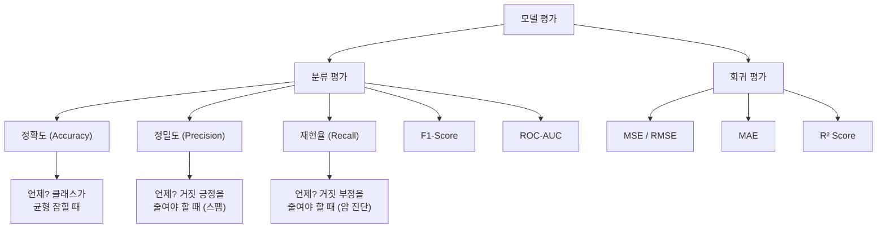
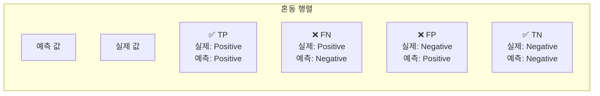
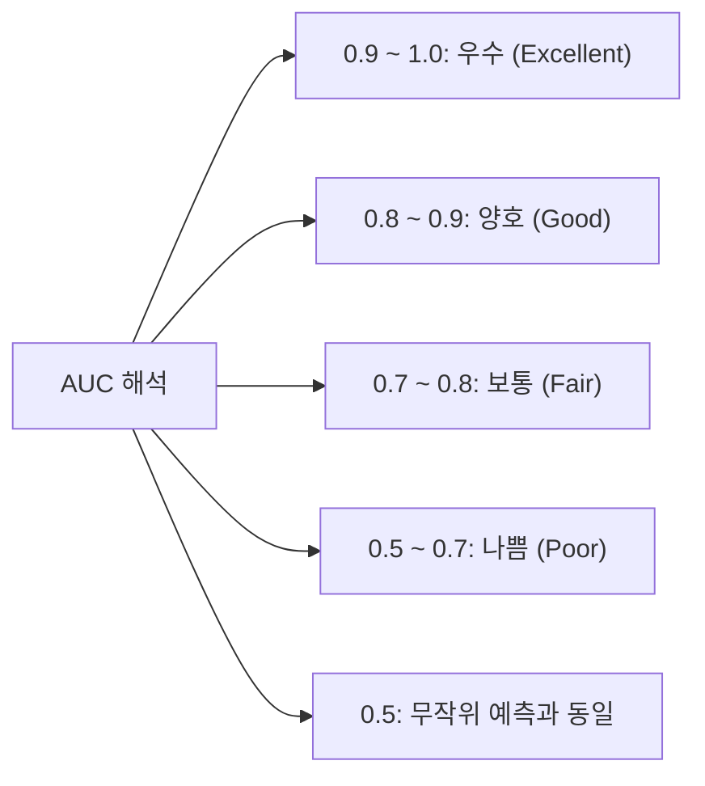
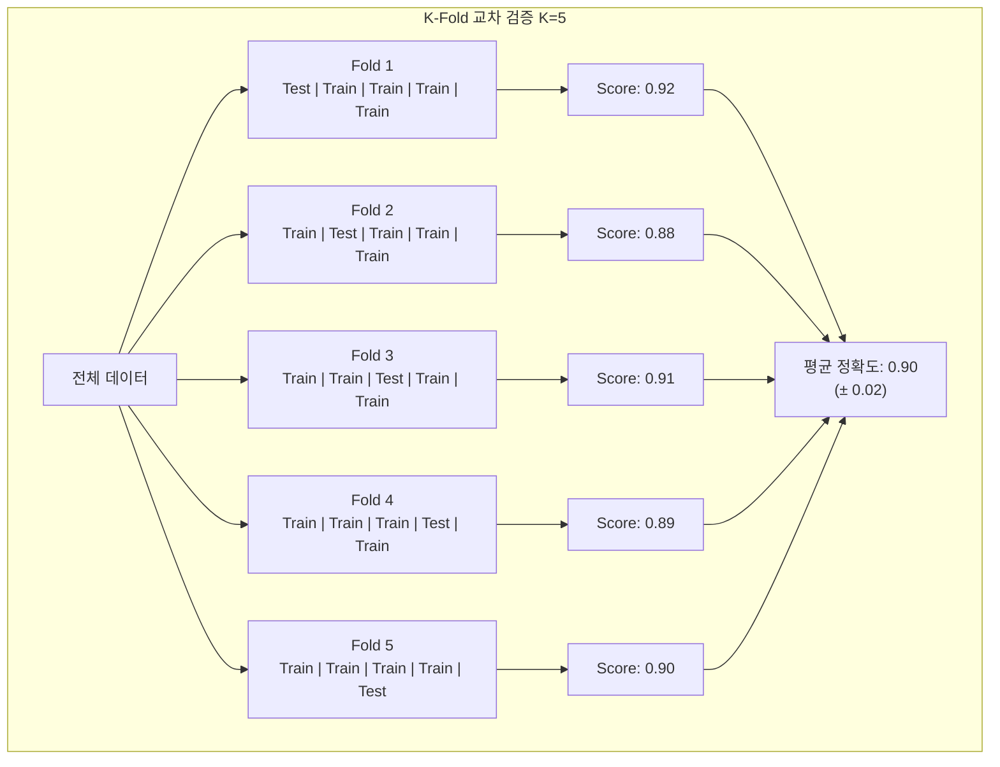
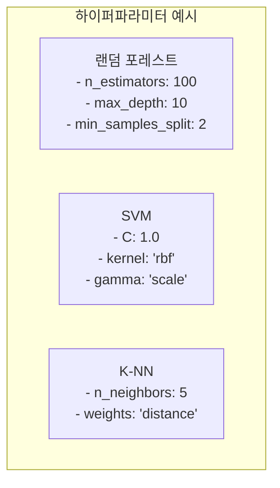
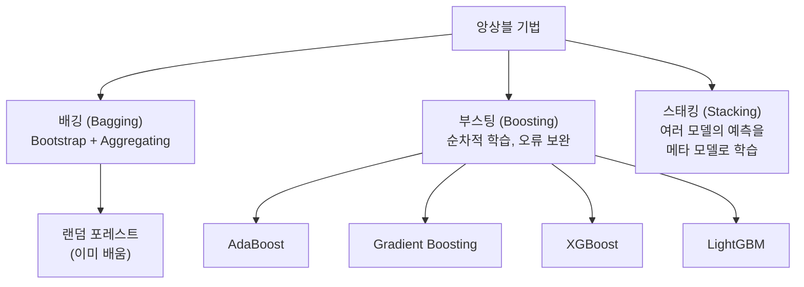

# 08장: 모델 평가와 최적화 프로그래밍

> **🎯 학습 목표**
> - 분류와 회귀 모델의 평가지표를 이해하고 계산할 수 있습니다.
> - 교차 검증의 개념과 필요성을 이해합니다.
> - 하이퍼파라미터 튜닝(Grid Search, Random Search)을 수행할 수 있습니다.
> - 특성 공학과 앙상블 기법을 활용할 수 있습니다.

---

## 👨‍💻 실전 프로젝트: 모델 성능 비교 대시보드

실제 머신러닝 프로젝트에서는 단 하나의 모델만을 사용하는 것이 아니라, 여러 후보 모델을 동시에 평가하고 그중 가장 우수한 모델을 선정하는 과정이 필수적입니다. 각 모델마다 데이터에 대한 가정과 학습 방식이 다르기 때문에, 동일한 데이터셋에서도 모델별로 전혀 다른 성능과 오류 패턴이 나타날 수 있습니다. 따라서 교차 검증(cross_val_score)을 통해 각 모델의 일반화 성능을 객관적으로 비교하고, 혼동 행렬(Confusion Matrix)을 시각화하여 모델별 오류 패턴을 분석하는 것은 매우 중요합니다. 본 프로젝트에서는 유방암 데이터셋(breast cancer dataset)을 사용하여 로지스틱 회귀, 랜덤 포레스트, 그래디언트 부스팅, 서포트 벡터 머신 등 네 가지 모델의 성능을 체계적으로 비교해 보겠습니다. 또한 최종적으로 선정된 모델의 혼동 행렬을 시각화하여 각 클래스에 대한 분류 성능을 직관적으로 파악할 것입니다.

```python
from sklearn.datasets import load_breast_cancer
from sklearn.model_selection import cross_val_score, train_test_split
from sklearn.ensemble import RandomForestClassifier, GradientBoostingClassifier
from sklearn.linear_model import LogisticRegression
from sklearn.svm import SVC
from sklearn.metrics import confusion_matrix, ConfusionMatrixDisplay, classification_report
import matplotlib.pyplot as plt
import numpy as np

# 1. 데이터 로드
data = load_breast_cancer()
X, y = data.data, data.target
print(f"데이터 shape: {X.shape}, 클래스: {data.target_names}")

# 2. Train/Test 분할 (홀드아웃)
X_train, X_test, y_train, y_test = train_test_split(
    X, y, test_size=0.2, random_state=42, stratify=y
)

# 3. 여러 모델 정의
models = {
    'Logistic Regression': LogisticRegression(max_iter=1000, random_state=42),
    'Random Forest': RandomForestClassifier(n_estimators=100, random_state=42),
    'Gradient Boosting': GradientBoostingClassifier(n_estimators=100, random_state=42),
    'SVM': SVC(kernel='rbf', random_state=42)
}

# 4. 교차 검증으로 각 모델 성능 비교
print("=" * 60)
print("📊 모델 성능 비교 대시보드")
print("=" * 60)

for name, model in models.items():
    scores = cross_val_score(model, X_train, y_train, cv=5, scoring='accuracy')
    print(f"\n{name}")
    print(f"  CV 정확도: {scores.mean():.4f} (±{scores.std():.4f})")
    print(f"  개별 Fold 점수: {scores.round(4)}")

# 5. 최고 성능 모델로 최종 평가 및 혼동 행렬 시각화
print("\n\n=== 최종 평가: Random Forest ===")
best_model = RandomForestClassifier(n_estimators=100, random_state=42)
best_model.fit(X_train, y_train)
y_pred = best_model.predict(X_test)

print(classification_report(y_test, y_pred, target_names=data.target_names))

# 혼동 행렬 출력
cm = confusion_matrix(y_test, y_pred)
print(f"혼동 행렬:\n{cm}")

# 혼동 행렬 시각화
ConfusionMatrixDisplay(cm, display_labels=data.target_names).plot()
plt.title('Confusion Matrix - Random Forest')
plt.show()
```

위 코드를 실행하면 각 모델의 5-Fold 교차 검증 점수를 한눈에 비교할 수 있으며, 최종적으로 선택된 랜덤 포레스트 모델의 혼동 행렬을 통해 양성(악성)과 음성(양성) 클래스 각각에 대한 분류 성능을 세부적으로 분석할 수 있습니다. 교차 검증 점수는 단순한 정확도 비교를 넘어 각 모델의 분산까지 고려한 안정적인 평가를 가능하게 해 줍니다. 이 프로젝트는 앞으로 배울 모든 평가 기법과 최적화 방법을 실제로 적용해 보는 종합 실습의 성격을 가지며, 이후 각 개념을 하나씩 자세히 학습해 나가겠습니다.

---

## 8.1 모델 평가 개요

모델 평가는 머신러닝 프로젝트의 전체 워크플로우에서 가장 중요한 단계 중 하나입니다. 아무리 정교한 알고리즘을 사용하여 모델을 훈련하더라도, 그 성능을 객관적이고 신뢰할 수 있는 방식으로 측정할 수 없다면 모델의 실질적인 가치를 판단할 수 없기 때문입니다. 평가 방식은 크게 분류(Classification) 문제와 회귀(Regression) 문제로 나뉘며, 각 문제 유형에 따라 적절한 평가지표를 선택하여 사용하여야 합니다. 분류 문제에서는 정확도(Accuracy), 정밀도(Precision), 재현율(Recall), F1-Score, ROC-AUC 등의 지표를 활용하고, 회귀 문제에서는 MSE, RMSE, MAE, R² 등의 지표를 사용합니다. 아래 다이어그램은 모델 평가의 전체 구조와 각 지표가 언제 적합한지를 시각적으로 정리한 것입니다.



---

## 8.2 분류 모델 평가

분류 모델의 평가는 단순히 "맞혔다/틀렸다"라는 이진 결과만을 확인하는 것을 넘어, 모델이 어떤 유형의 오류를 얼마나 자주 범하는지를 세밀하게 분석하는 과정입니다. 실제로 동일한 정확도를 가진 두 모델이라도 그 오류의 성격이 완전히 다를 수 있으므로, 다양한 지표를 종합적으로 검토하여야 합니다. 예를 들어 암 진단 모델에서는 암 환자를 놓치는 오류(거짓 음성)가 특히 치명적이지만, 스팸 필터에서는 정상 메일을 스팸으로 잘못 분류하는 오류(거짓 양성)가 더 큰 문제가 됩니다. 분류 모델 평가의 첫걸음은 바로 혼동 행렬(Confusion Matrix)을 이해하는 것이며, 이를 기반으로 모든 분류 평가지표가 파생됩니다.

### 8.2.1 혼동 행렬 (Confusion Matrix)

혼동 행렬(Confusion Matrix)은 모델의 예측 결과를 실제 값과 비교하여 2×2 행렬 형태로 정리한 표입니다. 이 행렬은 모델이 얼마나 많은 샘플을 올바르게 예측했는지(TP, TN)와 잘못 예측했는지(FP, FN)를 한눈에 보여 주므로, 정확도만으로는 알 수 없는 오류의 구체적인 유형과 분포를 파악할 수 있게 해 줍니다. 예를 들어 전체 정확도가 90%인 모델이라도, FP와 FN 중 어느 쪽이 더 많은지에 따라 실제 현장에서의 유용성이 완전히 달라질 수 있습니다. 아래 다이어그램과 표는 혼동 행렬의 네 가지 요소를 명확히 정리한 것입니다.



| | 예측: Positive | 예측: Negative |
|---|---|---|
| **실제: Positive** | TP (참 양성) | FN (거짓 음성) |
| **실제: Negative** | FP (거짓 양성) | TN (참 음성) |

```python
import numpy as np
from sklearn.metrics import confusion_matrix, classification_report
from sklearn.metrics import accuracy_score, precision_score, recall_score, f1_score

# 실제 값과 예측 값
y_true = np.array([1, 0, 1, 1, 0, 1, 0, 0, 1, 0])
y_pred = np.array([1, 0, 1, 0, 0, 1, 0, 1, 1, 0])

# 혼동 행렬
cm = confusion_matrix(y_true, y_pred)
print(f"혼동 행렬:\n{cm}")
# [[TN, FP],
#  [FN, TP]]

# 혼동 행렬에서 값 추출
tn, fp, fn, tp = cm.ravel()
print(f"TP: {tp}, FN: {fn}, FP: {fp}, TN: {tn}")

# 주요 지표 계산
accuracy = accuracy_score(y_true, y_pred)
precision = precision_score(y_true, y_pred)
recall = recall_score(y_true, y_pred)
f1 = f1_score(y_true, y_pred)

print(f"\n정확도 (Accuracy):  {accuracy:.4f}")
print(f"정밀도 (Precision): {precision:.4f}")
print(f"재현율 (Recall):    {recall:.4f}")
print(f"F1-Score:           {f1:.4f}")

# 공식
print(f"\nAccuracy  = (TP + TN) / (TP + TN + FP + FN) = {(tp+tn)/(tp+tn+fp+fn):.4f}")
print(f"Precision = TP / (TP + FP)                   = {tp/(tp+fp):.4f}")
print(f"Recall    = TP / (TP + FN)                   = {tp/(tp+fn):.4f}")
print(f"F1        = 2 * P * R / (P + R)              = {f1:.4f}")
```

### 8.2.2 언제 어떤 지표를 사용할까?

앞서 살펴본 네 가지 지표(정확도, 정밀도, 재현율, F1)는 각각 강조하는 관점이 다르므로, 문제의 도메인과 비즈니스 요구사항에 따라 적절한 지표를 선택하여야 합니다. 정확도는 가장 직관적인 지표이지만 클래스 불균형이 심한 데이터에서는 실제 모델의 성능을 왜곡할 위험이 있습니다. 정밀도는 FP(거짓 양성)를 최소화해야 하는 상황에서 중요하고, 재현율은 FN(거짓 음성)을 최소화해야 하는 상황에서 중요합니다. F1-Score는 정밀도와 재현율의 조화 평균으로, 두 지표 사이의 균형이 필요할 때 사용됩니다. 아래 코드는 암 진단과 스팸 메일 필터라는 두 가지 실제 시나리오를 통해 각 지표의 중요성을 직관적으로 보여 줍니다.

```python
# 시나리오 1: 암 진단 (재현율 중요)
# "암 환자를 놓치는 것(FN)이 더 위험"
print("=== 시나리오 1: 암 진단 ===")
y_true_cancer = np.array([1, 0, 1, 0, 1, 0, 0, 1])
y_pred_model_a = np.array([1, 0, 0, 0, 1, 0, 0, 1])  # FN 1개
y_pred_model_b = np.array([1, 1, 1, 1, 1, 0, 1, 1])  # FP 많음

print(f"Model A (보수적) - Recall: {recall_score(y_true_cancer, y_pred_model_a):.3f}")
print(f"Model B (적극적) - Recall: {recall_score(y_true_cancer, y_pred_model_b):.3f}")
print(f"Model A - Precision: {precision_score(y_true_cancer, y_pred_model_a):.3f}")
print(f"Model B - Precision: {precision_score(y_true_cancer, y_pred_model_b):.3f}")
# 암 진단에서는 Recall이 높은 Model B가 더 안전

# 시나리오 2: 스팸 메일 (정밀도 중요)
# "정상 메일을 스팸으로 잘못 분류(FP)하는 것이 더 위험"
print("\n=== 시나리오 2: 스팸 메일 ===")
y_true_spam = y_true_cancer.copy()
# 스팸 분류에서는 정밀도(Precision)가 중요
print("스팸 필터는 정밀도가 중요: 정상 메일을 스팸으로 보내면 안 됨")
```

### 8.2.3 ROC 곡선과 AUC

ROC(Receiver Operating Characteristic) 곡선은 분류 모델의 성능을 다양한 임계값(threshold)에서 종합적으로 평가할 수 있는 강력한 도구입니다. 가로축을 FPR(False Positive Rate, 1-특이도)로, 세로축을 TPR(True Positive Rate, 재현율)로 설정하여 그래프를 그리면, 임계값이 변화함에 따라 두 비율이 어떻게 변하는지 한눈에 확인할 수 있습니다. AUC(Area Under the Curve)는 이 ROC 곡선 아래 면적을 수치화한 값으로, 1에 가까울수록 완벽한 분류 성능을, 0.5에 가까울수록 무작위 예측 수준임을 의미합니다. AUC는 클래스 불균형이 있는 데이터에서도 비교적 안정적인 평가 지표로 널리 사용됩니다.

```python
from sklearn.metrics import roc_curve, roc_auc_score
from sklearn.datasets import make_classification
from sklearn.model_selection import train_test_split
from sklearn.linear_model import LogisticRegression
import matplotlib.pyplot as plt

X, y = make_classification(n_samples=1000, n_features=10, random_state=42)
X_train, X_test, y_train, y_test = train_test_split(X, y, test_size=0.2)

model = LogisticRegression()
model.fit(X_train, y_train)

# 예측 확률
y_scores = model.predict_proba(X_test)[:, 1]

# ROC 곡선
fpr, tpr, thresholds = roc_curve(y_test, y_scores)
auc = roc_auc_score(y_test, y_scores)

plt.figure(figsize=(8, 6))
plt.plot(fpr, tpr, label=f'ROC (AUC = {auc:.3f})', linewidth=2)
plt.plot([0, 1], [0, 1], 'k--', label='무작위 분류기')
plt.xlabel('False Positive Rate (1 - 특이도)')
plt.ylabel('True Positive Rate (재현율)')
plt.title('ROC 곡선')
plt.legend()
plt.grid(True, alpha=0.3)
plt.show()

print(f"AUC 점수: {auc:.4f}")
# AUC 1.0 = 완벽, 0.5 = 무작위, < 0.5 = 더 나쁨
```



---

## 8.3 회귀 모델 평가

분류 모델과 달리 회귀 모델은 연속적인 숫자 값을 예측하므로, "맞고 틀림"이라는 이진 개념으로 성능을 평가할 수 없습니다. 대신 회귀 모델에서는 실제 값과 예측 값 사이의 차이, 즉 오차(error)를 기반으로 다양한 평가지표를 사용하여 성능을 측정합니다. 가장 널리 사용되는 지표로는 MAE(Mean Absolute Error), MSE(Mean Squared Error), RMSE(Root Mean Squared Error), R²(결정 계수)가 있으며, 각 지표는 오차를 바라보는 관점과 이상치에 대한 민감도가 다릅니다. 따라서 데이터의 특성과 분석 목적에 따라 적절한 지표를 선택하거나 여러 지표를 함께 검토하는 것이 바람직합니다. 아래 코드는 동일한 예측 결과에 대해 네 가지 회귀 평가지표를 모두 계산하고 비교하는 예제입니다.

```python
import numpy as np
from sklearn.metrics import mean_absolute_error, mean_squared_error, r2_score

y_true = np.array([3.0, 5.0, 4.0, 7.0, 6.0, 8.0, 2.0])
y_pred = np.array([2.8, 5.2, 4.1, 6.5, 6.3, 7.5, 2.3])

# MAE (Mean Absolute Error) — 직관적, 단위 동일
mae = mean_absolute_error(y_true, y_pred)
print(f"MAE: {mae:.3f}")
print(f"  → 평균적으로 {mae:.2f}만큼 오차")

# MSE (Mean Squared Error) — 큰 오차에 더 큰 패널티
mse = mean_squared_error(y_true, y_pred)
print(f"MSE: {mse:.3f}")

# RMSE (Root Mean Squared Error) — 단위가 원래 값과 동일
rmse = np.sqrt(mse)
print(f"RMSE: {rmse:.3f}")

# R² (결정 계수) — 1에 가까울수록 좋음, 음수도 가능
r2 = r2_score(y_true, y_pred)
print(f"R²: {r2:.4f}")
print(f"  → 모델이 분산의 {r2*100:.1f}%를 설명")
```

---

## 8.4 교차 검증 (Cross Validation)

지금까지의 평가 방식은 하나의 Train/Test 분할에 의존하였기 때문에, 데이터 분할 방식에 따라 성능이 크게 달라질 수 있는 불안정성이 존재합니다. 교차 검증(Cross Validation)은 이러한 문제를 해결하기 위해 데이터를 여러 번 나누어 모델을 반복적으로 평가하고 그 결과를 평균내는 방법입니다. 가장 널리 사용되는 K-Fold 교차 검증은 데이터를 K개의 폴드(fold)로 균등하게 나눈 뒤, K-1개의 폴드로 훈련하고 남은 1개의 폴드로 평가하는 과정을 K번 반복합니다. 이렇게 하면 모든 데이터가 한 번씩 평가에 사용되므로, 특정 데이터 분할에 대한 의존도를 줄이고 모델의 일반화 성능을 더욱 신뢰성 있게 추정할 수 있습니다. 아래 다이어그램은 K=5인 경우의 교차 검증 과정을 시각화한 것입니다.



```python
from sklearn.model_selection import cross_val_score, cross_validate
from sklearn.ensemble import RandomForestClassifier
from sklearn.datasets import load_iris
import numpy as np

iris = load_iris()
model = RandomForestClassifier(n_estimators=100, random_state=42)

# 5-Fold 교차 검증
scores = cross_val_score(model, iris.data, iris.target, cv=5, scoring='accuracy')
print(f"각 Fold 정확도: {scores}")
print(f"평균 정확도: {scores.mean():.4f} (± {scores.std():.4f})")

# 여러 지표 한 번에
cv_results = cross_validate(
    model, iris.data, iris.target,
    cv=5,
    scoring=['accuracy', 'f1_macro', 'precision_macro']
)
print(f"\n정확도: {cv_results['test_accuracy'].mean():.3f}")
print(f"F1-Score: {cv_results['test_f1_macro'].mean():.3f}")
```

### 교차 검증 방법 비교

K-Fold 이외에도 데이터의 특성과 규모에 따라 다양한 교차 검증 방법을 선택할 수 있습니다. 기본 K-Fold는 무작위 분할을 수행하지만, 분류 문제에서 클래스 비율을 유지해야 한다면 Stratified K-Fold가 더 적합합니다. 데이터의 수가 매우 적을 때는 Leave-One-Out(LOO)을 사용하여 하나의 샘플만 남기고 모두 훈련에 사용하는 극단적인 방식도 가능합니다. 각 방법은 장단점이 있으므로, 데이터의 크기와 문제의 성격을 고려하여 적절한 교차 검증 전략을 선택하여야 합니다.

```python
from sklearn.model_selection import KFold, StratifiedKFold, LeaveOneOut, ShuffleSplit

X = np.random.randn(100, 5)
y = np.random.randint(0, 2, 100)

# K-Fold (기본)
kf = KFold(n_splits=5, shuffle=True, random_state=42)
for fold, (train_idx, test_idx) in enumerate(kf.split(X)):
    print(f"Fold {fold+1}: Train {len(train_idx)}, Test {len(test_idx)}")

# Stratified K-Fold (분류에서 클래스 비율 유지)
skf = StratifiedKFold(n_splits=5, shuffle=True, random_state=42)
print("\nStratified K-Fold: 각 Fold의 클래스 비율이 전체와 동일")

# Leave-One-Out (데이터가 적을 때)
loo = LeaveOneOut()
print(f"Leave-One-Out: {loo.get_n_splits(X)} folds (데이터 수만큼)")
```

---

## 8.5 하이퍼파라미터 튜닝

지금까지 우리는 모델의 성능을 평가하는 방법을 배웠습니다. 그러나 평가만으로 성능이 향상되는 것은 아니며, 모델의 성능을 극대화하기 위해서는 **하이퍼파라미터(Hyperparameter)** 를 최적화하는 과정이 필수적입니다. 하이퍼파라미터는 모델 학습이 시작되기 전에 사람이 직접 설정해야 하는 값으로, 예를 들어 랜덤 포레스트의 트리 개수(n_estimators), 최대 깊이(max_depth), SVM의 커널 종류(kernel)와 규제 강도(C) 등이 이에 해당합니다. 이러한 하이퍼파라미터는 데이터에 따라 최적값이 달라지므로, 체계적인 탐색 방법을 통해 최적의 조합을 찾아내는 것이 중요합니다. 아래 다이어그램은 주요 알고리즘별 하이퍼파라미터 예시를 정리한 것입니다.



### 8.5.1 Grid Search (격자 탐색)

Grid Search는 가장 기본적이면서도 널리 사용되는 하이퍼파라미터 튜닝 방법으로, 사전에 정의된 후보 값들의 모든 조합을 하나씩 시도하여 최적의 조합을 찾아냅니다. 예를 들어 `n_estimators`에 [50, 100, 200]이라는 3개의 후보를, `max_depth`에 [None, 5, 10, 15]라는 4개의 후보를 지정하면 총 3×4=12개의 조합이 생성되며, 각 조합마다 교차 검증을 수행하여 가장 높은 점수를 기록한 조합을 최종 선택합니다. 이 방법은 모든 조합을 빠짐없이 검사하므로 최적해를 보장한다는 장점이 있지만, 후보 값과 하이퍼파라미터의 수가 늘어날수록 조합이 기하급수적으로 증가하여 계산 비용이 매우 커진다는 단점이 있습니다. 따라서 Grid Search는 비교적 적은 수의 하이퍼파라미터를 튜닝할 때 효과적입니다.

```python
from sklearn.model_selection import GridSearchCV
from sklearn.ensemble import RandomForestClassifier
from sklearn.datasets import load_iris
import pandas as pd

iris = load_iris()
X, y = iris.data, iris.target

# 탐색할 하이퍼파라미터 그리드
param_grid = {
    'n_estimators': [50, 100, 200],
    'max_depth': [None, 5, 10, 15],
    'min_samples_split': [2, 5, 10],
    'min_samples_leaf': [1, 2, 4]
}

print(f"총 조합 수: 3 × 4 × 3 × 3 = {3*4*3*3}")

rf = RandomForestClassifier(random_state=42)
grid_search = GridSearchCV(
    rf, param_grid,
    cv=5, scoring='accuracy',
    n_jobs=-1, verbose=1
)
grid_search.fit(X, y)

print(f"\n최적 하이퍼파라미터:")
print(grid_search.best_params_)
print(f"최고 점수: {grid_search.best_score_:.4f}")

# 결과를 DataFrame으로 확인
results = pd.DataFrame(grid_search.cv_results_)
print(f"\n상위 5개 결과:")
print(results.sort_values('rank_test_score').head(5)[['params', 'mean_test_score', 'std_test_score']])
```

### 8.5.2 Random Search (랜덤 탐색)

Grid Search는 모든 조합을 체계적으로 검사하지만, 하이퍼파라미터 공간이 고차원이고 각 파라미터의 후보 값이 많을 때는 조합의 수가 폭발적으로 증가하여 현실적인 시간 내에 탐색이 불가능해집니다. Random Search는 이러한 문제를 해결하기 위해 각 하이퍼파라미터에 확률 분포(균등 분포, 정수 분포 등)를 지정하고, 지정된 횟수(n_iter)만큼 무작위로 샘플링하여 조합을 탐색합니다. 연구 결과에 따르면 Random Search는 동일한 계산 예산 내에서 Grid Search보다 더 넓은 하이퍼파라미터 공간을 효율적으로 탐색할 수 있으며, 특히 일부 하이퍼파라미터만이 모델 성능에 큰 영향을 미치는 경우에 더 좋은 결과를 보여 줍니다. 따라서 하이퍼파라미터의 수가 많거나 탐색 범위가 넓은 상황에서는 Random Search가 더 실용적인 선택입니다.

```python
from sklearn.model_selection import RandomizedSearchCV
from scipy.stats import randint, uniform

# 확률 분포로 하이퍼파라미터 정의
param_dist = {
    'n_estimators': randint(50, 500),
    'max_depth': [None] + list(range(10, 50)),
    'min_samples_split': randint(2, 20),
    'min_samples_leaf': randint(1, 10),
    'max_features': ['sqrt', 'log2', None]
}

rf = RandomForestClassifier(random_state=42)
random_search = RandomizedSearchCV(
    rf, param_dist,
    n_iter=50,  # 50번만 랜덤 탐색
    cv=5, scoring='accuracy',
    n_jobs=-1, random_state=42, verbose=1
)
random_search.fit(X, y)

print(f"\n최적 하이퍼파라미터:")
print(random_search.best_params_)
print(f"최고 점수: {random_search.best_score_:.4f}")
```


---

## 8.6 특성 공학 (Feature Engineering)

하이퍼파라미터 튜닝으로 모델 자체를 최적화하는 것도 중요하지만, 모델에 입력되는 데이터의 품질을 향상시키는 것도 그에 못지않게 중요합니다. 특성 공학(Feature Engineering)은 **기존 특성에서 더 좋은 특성을 만들어내거나 변환하는 과정**으로, 머신러닝 프로젝트의 성공을 좌우하는 핵심 요소 중 하나입니다. 실제 산업 현장에서는 데이터 과학자의 대부분의 시간을 데이터 전처리와 특성 공학에 투자할 정도로 중요한 단계이며, 동일한 모델이라도 입력 특성의 품질에 따라 성능 차이가 크게 벌어질 수 있습니다. 특성 공학의 대표적인 기법으로는 도메인 지식을 활용한 새로운 특성 생성, 다항식 특성(Polynomial Features) 추가, 중요한 특성만 선택하는 특성 선택(Feature Selection), 그리고 특성 스케일링(Scaling) 등이 있습니다.

```python
import pandas as pd
import numpy as np
from sklearn.preprocessing import PolynomialFeatures, StandardScaler
from sklearn.feature_selection import SelectKBest, f_regression

# 원본 데이터
df = pd.DataFrame({
    'length': [3, 5, 7, 2, 8],
    'width': [2, 3, 4, 1, 5],
    'weight': [10, 20, 30, 5, 40]
})

# 1. 새로운 특성 생성
df['area'] = df['length'] * df['width']        # 면적
df['aspect_ratio'] = df['length'] / df['width']  # 종횡비
df['volume_est'] = df['area'] * df['weight']     # 부피 추정
print("1. 특성 생성:")
print(df)

# 2. 다항식 특성 (Polynomial Features)
X = df[['length', 'width']]
poly = PolynomialFeatures(degree=2, include_bias=False)
X_poly = poly.fit_transform(X)
print(f"\n2. 다항식 특성 shape: {X_poly.shape}")
print(f"   원본: {X.shape[1]}개 → 다항식: {X_poly.shape[1]}개")
print(f"   특성 이름: {poly.get_feature_names_out()}")

# 3. 특성 선택
np.random.seed(42)
X_big = np.random.randn(100, 20)
y_big = X_big[:, 0] * 2 + X_big[:, 5] * 3 + np.random.randn(100) * 0.1

selector = SelectKBest(score_func=f_regression, k=5)
X_selected = selector.fit_transform(X_big, y_big)
print(f"\n3. 특성 선택: 20개 → {X_selected.shape[1]}개")
print(f"   선택된 특성 점수: {selector.scores_[selector.get_support()].round(2)}")

# 4. 특성 스케일링
scaler = StandardScaler()
X_scaled = scaler.fit_transform(df[['length', 'width', 'weight']])
print(f"\n4. 표준화 결과 (처음 3행):\n{X_scaled[:3]}")
```

---

## 8.7 앙상블 기법 (Ensemble Methods)

지금까지 단일 모델의 평가, 하이퍼파라미터 튜닝, 특성 공학을 학습하였습니다. 그러나 실제로 최고 수준의 예측 성능을 달성하기 위해 가장 자주 사용되는 전략은 여러 모델을 결합하는 앙상블(Ensemble) 기법입니다. 앙상블의 기본 원리는 "여러 약한 모델(weak learner)의 예측을 결합하면 하나의 강력한 모델(strong learner)을 만들 수 있다"는 것으로, 이는 집단 지성의 개념을 머신러닝에 적용한 것이라고 볼 수 있습니다. 앙상블 기법은 크게 배깅(Bagging), 부스팅(Boosting), 스태킹(Stacking)의 세 가지 범주로 나뉘며, 각각 모델을 결합하는 방식과 학습 순서에서 차이를 보입니다. 아래 다이어그램은 다양한 앙상블 기법의 관계를 계층적으로 정리한 것입니다.



### 8.7.1 배깅 vs 부스팅

배깅(Bootstrap Aggregating)은 원본 데이터에서 중복을 허용하여 여러 개의 부트스트랩 샘플을 추출한 뒤, 각 샘플로 모델을 독립적으로 학습시키고 그 예측 결과를 평균(회귀) 또는 투표(분류)하여 최종 예측을 수행합니다. 대표적인 배깅 기법인 랜덤 포레스트는 결정 트리를 기반으로 하여 각 트리가 서로 다른 특성 부분 집합을 사용하도록 함으로써 모델 간의 상관관계를 낮추고 일반화 성능을 높입니다. 반면 부스팅은 이전 모델이 잘못 예측한 데이터에 가중치를 부여하여 순차적으로 모델을 학습시키는 방식으로, 약한 학습기를 강한 학습기로 점진적으로 개선해 나갑니다. 부스팅 계열의 알고리즘으로는 AdaBoost, Gradient Boosting, XGBoost, LightGBM 등이 있으며, 이들은 일반적으로 배깅보다 높은 성능을 보이지만 이상치에 더 민감하고 과적합 위험이 더 큽니다.

```python
from sklearn.ensemble import BaggingClassifier, AdaBoostClassifier, GradientBoostingClassifier
from sklearn.tree import DecisionTreeClassifier
from sklearn.datasets import make_classification
from sklearn.model_selection import cross_val_score

X, y = make_classification(n_samples=500, n_features=20, random_state=42)

# 단일 결정 트리
dt = DecisionTreeClassifier(random_state=42)
dt_score = cross_val_score(dt, X, y, cv=5).mean()
print(f"단일 결정 트리: {dt_score:.4f}")

# 배깅 (Bagging)
bagging = BaggingClassifier(
    DecisionTreeClassifier(), n_estimators=100, random_state=42
)
bagging_score = cross_val_score(bagging, X, y, cv=5).mean()
print(f"배깅 (100 트리): {bagging_score:.4f}")

# 부스팅 (AdaBoost)
ada = AdaBoostClassifier(n_estimators=100, random_state=42)
ada_score = cross_val_score(ada, X, y, cv=5).mean()
print(f"AdaBoost: {ada_score:.4f}")

# Gradient Boosting
gb = GradientBoostingClassifier(n_estimators=100, random_state=42)
gb_score = cross_val_score(gb, X, y, cv=5).mean()
print(f"Gradient Boosting: {gb_score:.4f}")
```

---

## 8.8 전체 ML 워크플로우

지금까지 배운 모든 개념과 기법 — 데이터 분할, 특성 스케일링, 모델 선택, 하이퍼파라미터 튜닝, 교차 검증, 최종 평가 — 을 하나의 체계적인 파이썬 코드로 통합하여 전체 머신러닝 워크플로우를 완성해 보겠습니다. 실제 프로젝트에서는 이러한 단계들을 일관된 파이프라인(Pipeline)으로 구성하여 코드의 재사용성과 유지보수성을 높이는 것이 일반적입니다. 아래 코드는 Scikit-learn의 Pipeline과 GridSearchCV를 결합하여 특성 스케일링부터 하이퍼파라미터 튜닝까지를 하나의 객체로 처리하는 방법을 보여 줍니다. 유방암 데이터셋을 사용하여 이 파이프라인을 실행한 후, 최종적으로 테스트 세트에서 정확도와 AUC 점수를 산출하고 분류 리포트를 출력합니다.

```python
import numpy as np
import pandas as pd
from sklearn.datasets import load_breast_cancer
from sklearn.model_selection import train_test_split, GridSearchCV
from sklearn.preprocessing import StandardScaler
from sklearn.ensemble import RandomForestClassifier
from sklearn.pipeline import Pipeline
from sklearn.metrics import classification_report, confusion_matrix, roc_auc_score

# 1. 데이터 로드
data = load_breast_cancer()
X, y = data.data, data.target
print(f"데이터: {X.shape}, 클래스: {data.target_names}")

# 2. Train/Test 분할
X_train, X_test, y_train, y_test = train_test_split(
    X, y, test_size=0.2, random_state=42, stratify=y
)

# 3. 파이프라인 구성
pipeline = Pipeline([
    ('scaler', StandardScaler()),
    ('classifier', RandomForestClassifier(random_state=42))
])

# 4. 하이퍼파라미터 튜닝
param_grid = {
    'classifier__n_estimators': [50, 100, 200],
    'classifier__max_depth': [None, 5, 10],
    'classifier__min_samples_split': [2, 5],
}

grid = GridSearchCV(
    pipeline, param_grid,
    cv=5, scoring='accuracy', n_jobs=-1
)
grid.fit(X_train, y_train)

print(f"\n최적 파라미터: {grid.best_params_}")
print(f"CV 점수: {grid.best_score_:.4f}")

# 5. 최종 평가
y_pred = grid.predict(X_test)
y_prob = grid.predict_proba(X_test)[:, 1]

print(f"\n=== 최종 평가 (Test Set) ===")
print(f"정확도: {grid.score(X_test, y_test):.4f}")
print(f"AUC: {roc_auc_score(y_test, y_prob):.4f}")
print(f"\n분류 리포트:\n{classification_report(y_test, y_pred, target_names=data.target_names)}")
```

---

## 📋 한눈에 정리

| 평가 항목 | 분류 | 회귀 |
|-----------|------|------|
| **주요 지표** | 정확도, 정밀도, 재현율, F1, AUC | MAE, MSE, RMSE, R² |
| **검증 방법** | Stratified K-Fold | K-Fold |
| **튜닝 방법** | Grid Search, Random Search | 동일 |
| **최적화 목표** | F1 또는 AUC 최대화 | RMSE 최소화 또는 R² 최대화 |

---

## ✏️ 연습 문제

1. **혼동 행렬**이 다음과 같을 때, 정확도, 정밀도, 재현율, F1을 계산하세요.
   ```
        Pred: Pos  Pred: Neg
  실제 Pos    80        20
  실제 Neg    10        90
   ```

2. 암 진단 모델에서 **재현율(Recall)이 중요한 이유**는 무엇인가요? 반대로 스팸 메일 필터에서 **정밀도(Precision)가 중요한 이유**는 무엇인가요?

3. Iris 데이터셋에 대해 **5-Fold 교차 검증**을 수행하고, 각 Fold의 정확도와 평균 ± 표준편차를 출력하세요.

4. `load_digits()` 데이터로 **랜덤 포레스트**를 학습하고, Grid Search로 `n_estimators`와 `max_depth`를 튜닝하세요. 최적 파라미터와 성능을 출력하세요.

5. 다음 중 올바른 설명은?
   - a) Grid Search는 Random Search보다 항상 좋은 결과를 찾는다.
   - b) K-Fold 교차 검증에서 K가 클수록 평가 시간이 오래 걸린다.
   - c) RMSE는 MAE보다 이상치에 덜 민감하다.
   - d) AUC가 0.5면 모델이 완벽하다는 뜻이다.

---

## 📝 연습 문제 정답

<details>
<summary>정답 보기</summary>

**1. 혼동 행렬 계산**
- TP=80, FN=20, FP=10, TN=90
- Accuracy = (80+90)/(80+20+10+90) = 170/200 = **0.85**
- Precision = 80/(80+10) = 80/90 = **0.889**
- Recall = 80/(80+20) = 80/100 = **0.8**
- F1 = 2 × (0.889×0.8)/(0.889+0.8) = **0.842**

**2. Recall vs Precision의 중요성**
- **암 진단에서 Recall이 중요한 이유:** 암 환자를 놓치는 것(FN)이 가장 위험합니다. "암이 아닌데 암이라고 진단(FP)"하는 것은 추가 검사로 확인 가능하지만, "암인데 놓치는 것(FN)"은 생명과 직결됩니다.
- **스팸에서 Precision이 중요한 이유:** 정상 메일을 스팸으로 분류(FP)하는 것이 더 위험합니다. 중요한 업무 메일을 놓칠 수 있고, 스팸 하나를 놓치는 것(FN)은 상대적으로 덜 심각합니다.

**3. Iris 5-Fold 교차 검증**
```python
from sklearn.datasets import load_iris
from sklearn.model_selection import cross_val_score
from sklearn.ensemble import RandomForestClassifier

iris = load_iris()
model = RandomForestClassifier(random_state=42)
scores = cross_val_score(model, iris.data, iris.target, cv=5)
print(f"각 Fold: {scores}")
print(f"평균: {scores.mean():.4f} (±{scores.std():.4f})")
```

**4. Digits Grid Search**
```python
from sklearn.datasets import load_digits
from sklearn.model_selection import GridSearchCV
from sklearn.ensemble import RandomForestClassifier

digits = load_digits()
param_grid = {'n_estimators': [50, 100], 'max_depth': [5, 10, None]}
grid = GridSearchCV(RandomForestClassifier(), param_grid, cv=5)
grid.fit(digits.data, digits.target)
print(f"최적 파라미터: {grid.best_params_}")
print(f"최고 점수: {grid.best_score_:.4f}")
```

**5. 올바른 설명 찾기**
- a) **거짓:** Random Search가 더 넓은 공간을 효율적으로 탐색하여 더 좋은 결과를 찾을 수 있음
- b) **참:** K가 클수록 더 많은 학습/평가를 반복하므로 시간이 오래 걸림
- c) **거짓:** RMSE는 제곱 오차이므로 이상치에 더 민감함 (MAE가 덜 민감)
- d) **거짓:** AUC 0.5 = 무작위 예측, 1.0이 완벽
→ 정답: **b**

</details>

---

> **🔄 다음 장에서는** 드디어 딥러닝으로 넘어갑니다! 신경망의 기본 구조, 퍼셉트론, 활성화 함수, 순전파와 역전파, PyTorch 기초를 배웁니다.
