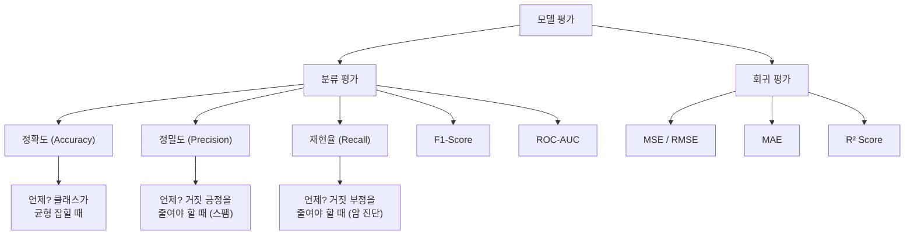
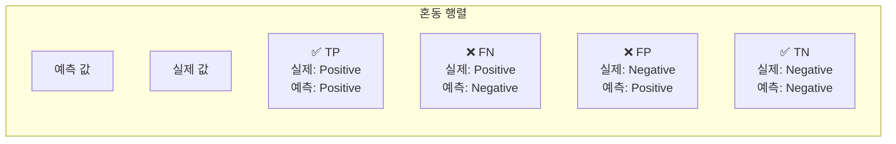
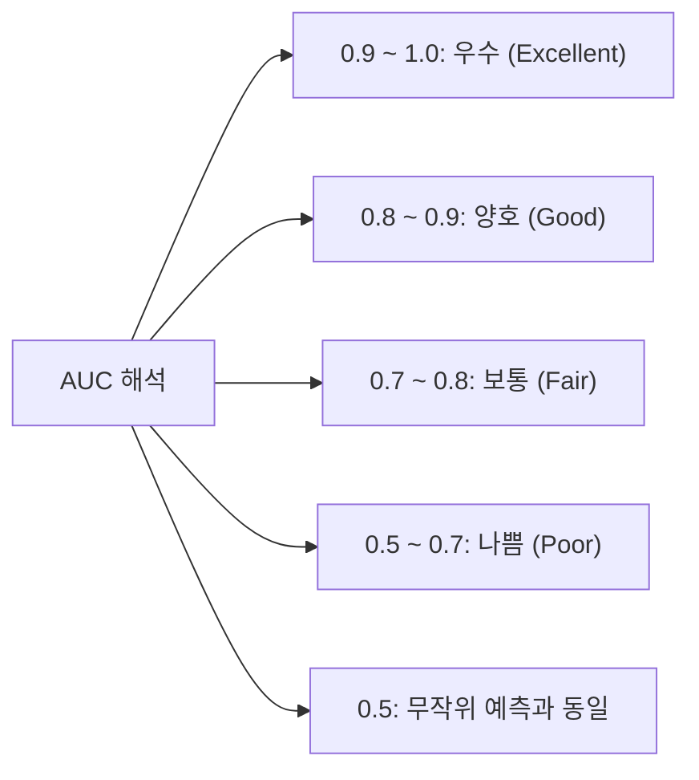
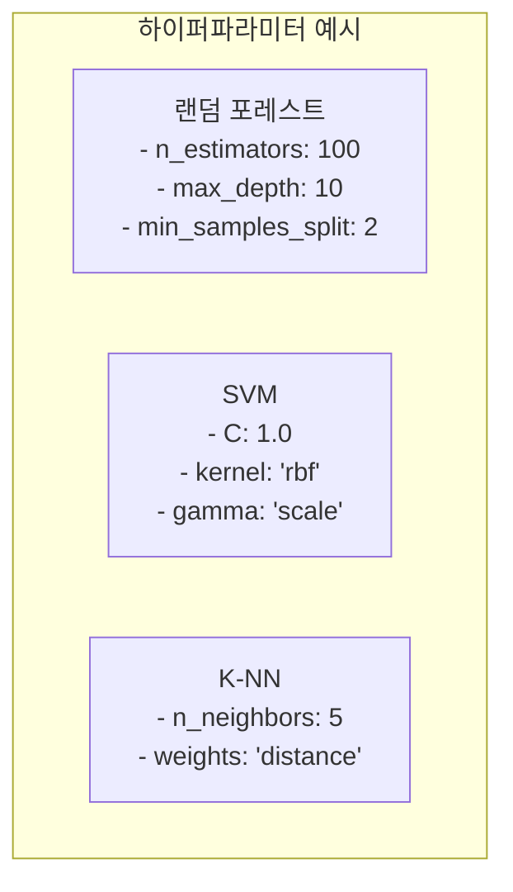
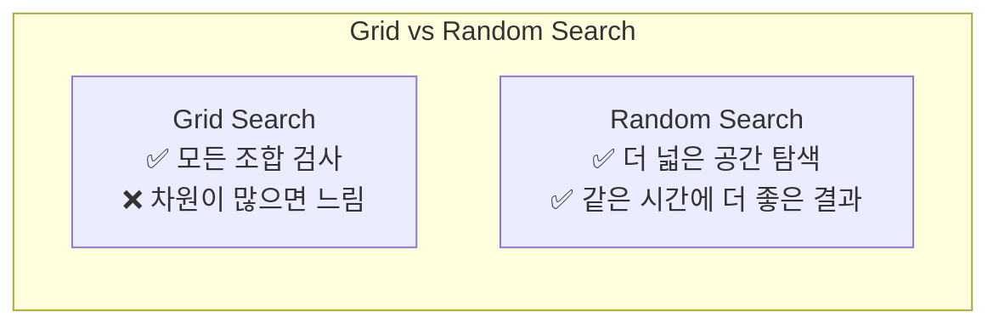
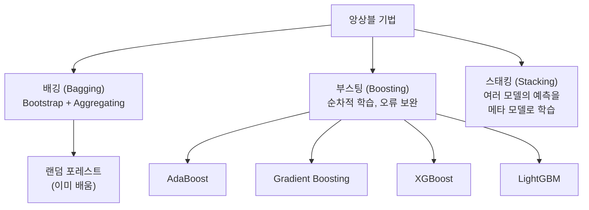

# 08장: 모델 평가와 최적화

> **🎯 학습 목표**
> - 분류와 회귀 모델의 평가지표를 이해하고 계산할 수 있습니다.
> - 교차 검증의 개념과 필요성을 이해합니다.
> - 하이퍼파라미터 튜닝(Grid Search, Random Search)을 수행할 수 있습니다.
> - 특성 공학과 앙상블 기법을 활용할 수 있습니다.

---

## 8.1 모델 평가 개요

모델을 만든 후에는 **"이 모델이 얼마나 좋은가?"** 를 측정해야 합니다. 평가는 문제 유형(분류/회귀)에 따라 다른 지표를 사용합니다.



---

## 8.2 분류 모델 평가

### 8.2.1 혼동 행렬 (Confusion Matrix)



| | 예측: Positive | 예측: Negative |
|---|---|---|
| **실제: Positive** | TP (참 양성) | FN (거짓 음성) |
| **실제: Negative** | FP (거짓 양성) | TN (참 음성) |

```python
import numpy as np
from sklearn.metrics import confusion_matrix, classification_report
from sklearn.metrics import accuracy_score, precision_score, recall_score, f1_score

# 실제 값과 예측 값
y_true = np.array([1, 0, 1, 1, 0, 1, 0, 0, 1, 0])
y_pred = np.array([1, 0, 1, 0, 0, 1, 0, 1, 1, 0])

# 혼동 행렬
cm = confusion_matrix(y_true, y_pred)
print(f"혼동 행렬:\n{cm}")
# [[TN, FP],
#  [FN, TP]]

# 혼동 행렬에서 값 추출
tn, fp, fn, tp = cm.ravel()
print(f"TP: {tp}, FN: {fn}, FP: {fp}, TN: {tn}")

# 주요 지표 계산
accuracy = accuracy_score(y_true, y_pred)
precision = precision_score(y_true, y_pred)
recall = recall_score(y_true, y_pred)
f1 = f1_score(y_true, y_pred)

print(f"\n정확도 (Accuracy):  {accuracy:.4f}")
print(f"정밀도 (Precision): {precision:.4f}")
print(f"재현율 (Recall):    {recall:.4f}")
print(f"F1-Score:           {f1:.4f}")

# 공식
print(f"\nAccuracy  = (TP + TN) / (TP + TN + FP + FN) = {(tp+tn)/(tp+tn+fp+fn):.4f}")
print(f"Precision = TP / (TP + FP)                   = {tp/(tp+fp):.4f}")
print(f"Recall    = TP / (TP + FN)                   = {tp/(tp+fn):.4f}")
print(f"F1        = 2 * P * R / (P + R)              = {f1:.4f}")
```

### 8.2.2 언제 어떤 지표를 사용할까?

```python
# 시나리오 1: 암 진단 (재현율 중요)
# "암 환자를 놓치는 것(FN)이 더 위험"
print("=== 시나리오 1: 암 진단 ===")
y_true_cancer = np.array([1, 0, 1, 0, 1, 0, 0, 1])
y_pred_model_a = np.array([1, 0, 0, 0, 1, 0, 0, 1])  # FN 1개
y_pred_model_b = np.array([1, 1, 1, 1, 1, 0, 1, 1])  # FP 많음

print(f"Model A (보수적) - Recall: {recall_score(y_true_cancer, y_pred_model_a):.3f}")
print(f"Model B (적극적) - Recall: {recall_score(y_true_cancer, y_pred_model_b):.3f}")
print(f"Model A - Precision: {precision_score(y_true_cancer, y_pred_model_a):.3f}")
print(f"Model B - Precision: {precision_score(y_true_cancer, y_pred_model_b):.3f}")
# 암 진단에서는 Recall이 높은 Model B가 더 안전

# 시나리오 2: 스팸 메일 (정밀도 중요)
# "정상 메일을 스팸으로 잘못 분류(FP)하는 것이 더 위험"
print("\n=== 시나리오 2: 스팸 메일 ===")
y_true_spam = y_true_cancer.copy()
# 스팸 분류에서는 정밀도(Precision)가 중요
print("스팸 필터는 정밀도가 중요: 정상 메일을 스팸으로 보내면 안 됨")
```

### 8.2.3 ROC 곡선과 AUC

```python
from sklearn.metrics import roc_curve, roc_auc_score
from sklearn.datasets import make_classification
from sklearn.model_selection import train_test_split
from sklearn.linear_model import LogisticRegression
import matplotlib.pyplot as plt

X, y = make_classification(n_samples=1000, n_features=10, random_state=42)
X_train, X_test, y_train, y_test = train_test_split(X, y, test_size=0.2)

model = LogisticRegression()
model.fit(X_train, y_train)

# 예측 확률
y_scores = model.predict_proba(X_test)[:, 1]

# ROC 곡선
fpr, tpr, thresholds = roc_curve(y_test, y_scores)
auc = roc_auc_score(y_test, y_scores)

plt.figure(figsize=(8, 6))
plt.plot(fpr, tpr, label=f'ROC (AUC = {auc:.3f})', linewidth=2)
plt.plot([0, 1], [0, 1], 'k--', label='무작위 분류기')
plt.xlabel('False Positive Rate (1 - 특이도)')
plt.ylabel('True Positive Rate (재현율)')
plt.title('ROC 곡선')
plt.legend()
plt.grid(True, alpha=0.3)
plt.show()

print(f"AUC 점수: {auc:.4f}")
# AUC 1.0 = 완벽, 0.5 = 무작위, < 0.5 = 더 나쁨
```



---

## 8.3 회귀 모델 평가

```python
import numpy as np
from sklearn.metrics import mean_absolute_error, mean_squared_error, r2_score

y_true = np.array([3.0, 5.0, 4.0, 7.0, 6.0, 8.0, 2.0])
y_pred = np.array([2.8, 5.2, 4.1, 6.5, 6.3, 7.5, 2.3])

# MAE (Mean Absolute Error) — 직관적, 단위 동일
mae = mean_absolute_error(y_true, y_pred)
print(f"MAE: {mae:.3f}")
print(f"  → 평균적으로 {mae:.2f}만큼 오차")

# MSE (Mean Squared Error) — 큰 오차에 더 큰 패널티
mse = mean_squared_error(y_true, y_pred)
print(f"MSE: {mse:.3f}")

# RMSE (Root Mean Squared Error) — 단위가 원래 값과 동일
rmse = np.sqrt(mse)
print(f"RMSE: {rmse:.3f}")

# R² (결정 계수) — 1에 가까울수록 좋음, 음수도 가능
r2 = r2_score(y_true, y_pred)
print(f"R²: {r2:.4f}")
print(f"  → 모델이 분산의 {r2*100:.1f}%를 설명")
```

---

## 8.4 교차 검증 (Cross Validation)

교차 검증은 **데이터를 여러 번 나누어 모델을 평가**하는 방법입니다.

```mermaid
flowchart TB
  subgraph KFold[K-Fold 교차 검증 (K=5)]
    All_Data["전체 데이터"] --> Fold1["Fold 1<br/>Test | Train | Train | Train | Train"]
    All_Data --> Fold2["Fold 2<br/>Train | Test | Train | Train | Train"]
    All_Data --> Fold3["Fold 3<br/>Train | Train | Test | Train | Train"]
    All_Data --> Fold4["Fold 4<br/>Train | Train | Train | Test | Train"]
    All_Data --> Fold5["Fold 5<br/>Train | Train | Train | Train | Test"]

    Fold1 --> Score1["Score: 0.92"]
    Fold2 --> Score2["Score: 0.88"]
    Fold3 --> Score3["Score: 0.91"]
    Fold4 --> Score4["Score: 0.89"]
    Fold5 --> Score5["Score: 0.90"]

    Score1 --> Avg["평균 정확도: 0.90<br/>(± 0.02)"]
    Score2 --> Avg
    Score3 --> Avg
    Score4 --> Avg
    Score5 --> Avg
  end
```

```python
from sklearn.model_selection import cross_val_score, cross_validate
from sklearn.ensemble import RandomForestClassifier
from sklearn.datasets import load_iris
import numpy as np

iris = load_iris()
model = RandomForestClassifier(n_estimators=100, random_state=42)

# 5-Fold 교차 검증
scores = cross_val_score(model, iris.data, iris.target, cv=5, scoring='accuracy')
print(f"각 Fold 정확도: {scores}")
print(f"평균 정확도: {scores.mean():.4f} (± {scores.std():.4f})")

# 여러 지표 한 번에
cv_results = cross_validate(
    model, iris.data, iris.target,
    cv=5,
    scoring=['accuracy', 'f1_macro', 'precision_macro']
)
print(f"\n정확도: {cv_results['test_accuracy'].mean():.3f}")
print(f"F1-Score: {cv_results['test_f1_macro'].mean():.3f}")
```

### 교차 검증 방법 비교

```python
from sklearn.model_selection import KFold, StratifiedKFold, LeaveOneOut, ShuffleSplit

X = np.random.randn(100, 5)
y = np.random.randint(0, 2, 100)

# K-Fold (기본)
kf = KFold(n_splits=5, shuffle=True, random_state=42)
for fold, (train_idx, test_idx) in enumerate(kf.split(X)):
    print(f"Fold {fold+1}: Train {len(train_idx)}, Test {len(test_idx)}")

# Stratified K-Fold (분류에서 클래스 비율 유지)
skf = StratifiedKFold(n_splits=5, shuffle=True, random_state=42)
print("\nStratified K-Fold: 각 Fold의 클래스 비율이 전체와 동일")

# Leave-One-Out (데이터가 적을 때)
loo = LeaveOneOut()
print(f"Leave-One-Out: {loo.get_n_splits(X)} folds (데이터 수만큼)")
```

---

## 8.5 하이퍼파라미터 튜닝

**하이퍼파라미터(Hyperparameter)** 는 모델 학습 전에 사람이 설정하는 값입니다.



### 8.5.1 Grid Search (격자 탐색)

```python
from sklearn.model_selection import GridSearchCV
from sklearn.ensemble import RandomForestClassifier
from sklearn.datasets import load_iris
import pandas as pd

iris = load_iris()
X, y = iris.data, iris.target

# 탐색할 하이퍼파라미터 그리드
param_grid = {
    'n_estimators': [50, 100, 200],
    'max_depth': [None, 5, 10, 15],
    'min_samples_split': [2, 5, 10],
    'min_samples_leaf': [1, 2, 4]
}

print(f"총 조합 수: 3 × 4 × 3 × 3 = {3*4*3*3}")

rf = RandomForestClassifier(random_state=42)
grid_search = GridSearchCV(
    rf, param_grid,
    cv=5, scoring='accuracy',
    n_jobs=-1, verbose=1
)
grid_search.fit(X, y)

print(f"\n최적 하이퍼파라미터:")
print(grid_search.best_params_)
print(f"최고 점수: {grid_search.best_score_:.4f}")

# 결과를 DataFrame으로 확인
results = pd.DataFrame(grid_search.cv_results_)
print(f"\n상위 5개 결과:")
print(results.sort_values('rank_test_score').head(5)[['params', 'mean_test_score', 'std_test_score']])
```

### 8.5.2 Random Search (랜덤 탐색)

Grid Search는 조합이 많아질수록 시간이 오래 걸립니다. Random Search는 랜덤 샘플링으로 더 효율적입니다.

```python
from sklearn.model_selection import RandomizedSearchCV
from scipy.stats import randint, uniform

# 확률 분포로 하이퍼파라미터 정의
param_dist = {
    'n_estimators': randint(50, 500),
    'max_depth': [None] + list(range(10, 50)),
    'min_samples_split': randint(2, 20),
    'min_samples_leaf': randint(1, 10),
    'max_features': ['sqrt', 'log2', None]
}

rf = RandomForestClassifier(random_state=42)
random_search = RandomizedSearchCV(
    rf, param_dist,
    n_iter=50,  # 50번만 랜덤 탐색
    cv=5, scoring='accuracy',
    n_jobs=-1, random_state=42, verbose=1
)
random_search.fit(X, y)

print(f"\n최적 하이퍼파라미터:")
print(random_search.best_params_)
print(f"최고 점수: {random_search.best_score_:.4f}")
```



---

## 8.6 특성 공학 (Feature Engineering)

특성 공학은 **기존 특성에서 더 좋은 특성을 만들어내는 과정**입니다.

```python
import pandas as pd
import numpy as np
from sklearn.preprocessing import PolynomialFeatures, StandardScaler
from sklearn.feature_selection import SelectKBest, f_regression

# 원본 데이터
df = pd.DataFrame({
    'length': [3, 5, 7, 2, 8],
    'width': [2, 3, 4, 1, 5],
    'weight': [10, 20, 30, 5, 40]
})

# 1. 새로운 특성 생성
df['area'] = df['length'] * df['width']        # 면적
df['aspect_ratio'] = df['length'] / df['width']  # 종횡비
df['volume_est'] = df['area'] * df['weight']     # 부피 추정
print("1. 특성 생성:")
print(df)

# 2. 다항식 특성 (Polynomial Features)
X = df[['length', 'width']]
poly = PolynomialFeatures(degree=2, include_bias=False)
X_poly = poly.fit_transform(X)
print(f"\n2. 다항식 특성 shape: {X_poly.shape}")
print(f"   원본: {X.shape[1]}개 → 다항식: {X_poly.shape[1]}개")
print(f"   특성 이름: {poly.get_feature_names_out()}")

# 3. 특성 선택
np.random.seed(42)
X_big = np.random.randn(100, 20)
y_big = X_big[:, 0] * 2 + X_big[:, 5] * 3 + np.random.randn(100) * 0.1

selector = SelectKBest(score_func=f_regression, k=5)
X_selected = selector.fit_transform(X_big, y_big)
print(f"\n3. 특성 선택: 20개 → {X_selected.shape[1]}개")
print(f"   선택된 특성 점수: {selector.scores_[selector.get_support()].round(2)}")

# 4. 특성 스케일링
scaler = StandardScaler()
X_scaled = scaler.fit_transform(df[['length', 'width', 'weight']])
print(f"\n4. 표준화 결과 (처음 3행):\n{X_scaled[:3]}")
```

---

## 8.7 앙상블 기법 (Ensemble Methods)

앙상블은 **여러 모델을 결합**하여 더 좋은 성능을 내는 방법입니다.



### 8.7.1 배깅 vs 부스팅

```python
from sklearn.ensemble import BaggingClassifier, AdaBoostClassifier, GradientBoostingClassifier
from sklearn.tree import DecisionTreeClassifier
from sklearn.datasets import make_classification
from sklearn.model_selection import cross_val_score

X, y = make_classification(n_samples=500, n_features=20, random_state=42)

# 단일 결정 트리
dt = DecisionTreeClassifier(random_state=42)
dt_score = cross_val_score(dt, X, y, cv=5).mean()
print(f"단일 결정 트리: {dt_score:.4f}")

# 배깅 (Bagging)
bagging = BaggingClassifier(
    DecisionTreeClassifier(), n_estimators=100, random_state=42
)
bagging_score = cross_val_score(bagging, X, y, cv=5).mean()
print(f"배깅 (100 트리): {bagging_score:.4f}")

# 부스팅 (AdaBoost)
ada = AdaBoostClassifier(n_estimators=100, random_state=42)
ada_score = cross_val_score(ada, X, y, cv=5).mean()
print(f"AdaBoost: {ada_score:.4f}")

# Gradient Boosting
gb = GradientBoostingClassifier(n_estimators=100, random_state=42)
gb_score = cross_val_score(gb, X, y, cv=5).mean()
print(f"Gradient Boosting: {gb_score:.4f}")
```

---

## 8.8 전체 ML 워크플로우

지금까지 배운 모든 것을 하나의 파이프라인으로 통합합니다.

```python
import numpy as np
import pandas as pd
from sklearn.datasets import load_breast_cancer
from sklearn.model_selection import train_test_split, GridSearchCV
from sklearn.preprocessing import StandardScaler
from sklearn.ensemble import RandomForestClassifier
from sklearn.pipeline import Pipeline
from sklearn.metrics import classification_report, confusion_matrix, roc_auc_score

# 1. 데이터 로드
data = load_breast_cancer()
X, y = data.data, data.target
print(f"데이터: {X.shape}, 클래스: {data.target_names}")

# 2. Train/Test 분할
X_train, X_test, y_train, y_test = train_test_split(
    X, y, test_size=0.2, random_state=42, stratify=y
)

# 3. 파이프라인 구성
pipeline = Pipeline([
    ('scaler', StandardScaler()),
    ('classifier', RandomForestClassifier(random_state=42))
])

# 4. 하이퍼파라미터 튜닝
param_grid = {
    'classifier__n_estimators': [50, 100, 200],
    'classifier__max_depth': [None, 5, 10],
    'classifier__min_samples_split': [2, 5],
}

grid = GridSearchCV(
    pipeline, param_grid,
    cv=5, scoring='accuracy', n_jobs=-1
)
grid.fit(X_train, y_train)

print(f"\n최적 파라미터: {grid.best_params_}")
print(f"CV 점수: {grid.best_score_:.4f}")

# 5. 최종 평가
y_pred = grid.predict(X_test)
y_prob = grid.predict_proba(X_test)[:, 1]

print(f"\n=== 최종 평가 (Test Set) ===")
print(f"정확도: {grid.score(X_test, y_test):.4f}")
print(f"AUC: {roc_auc_score(y_test, y_prob):.4f}")
print(f"\n분류 리포트:\n{classification_report(y_test, y_pred, target_names=data.target_names)}")
```

---

## 📋 한눈에 정리

| 평가 항목 | 분류 | 회귀 |
|-----------|------|------|
| **주요 지표** | 정확도, 정밀도, 재현율, F1, AUC | MAE, MSE, RMSE, R² |
| **검증 방법** | Stratified K-Fold | K-Fold |
| **튜닝 방법** | Grid Search, Random Search | 동일 |
| **최적화 목표** | F1 또는 AUC 최대화 | RMSE 최소화 또는 R² 최대화 |

---

## ✏️ 연습 문제

1. **혼동 행렬**이 다음과 같을 때, 정확도, 정밀도, 재현율, F1을 계산하세요.
   ```
         Pred: Pos  Pred: Neg
   실제 Pos    80        20
   실제 Neg    10        90
   ```

2. 암 진단 모델에서 **재현율(Recall)이 중요한 이유**는 무엇인가요? 반대로 스팸 메일 필터에서 **정밀도(Precision)가 중요한 이유**는 무엇인가요?

3. Iris 데이터셋에 대해 **5-Fold 교차 검증**을 수행하고, 각 Fold의 정확도와 평균 ± 표준편차를 출력하세요.

4. `load_digits()` 데이터로 **랜덤 포레스트**를 학습하고, Grid Search로 `n_estimators`와 `max_depth`를 튜닝하세요. 최적 파라미터와 성능을 출력하세요.

5. 다음 중 올바른 설명은?
   - a) Grid Search는 Random Search보다 항상 좋은 결과를 찾는다.
   - b) K-Fold 교차 검증에서 K가 클수록 평가 시간이 오래 걸린다.
   - c) RMSE는 MAE보다 이상치에 덜 민감하다.
   - d) AUC가 0.5면 모델이 완벽하다는 뜻이다.

---

> **🔄 다음 장에서는** 드디어 딥러닝으로 넘어갑니다! 신경망의 기본 구조, 퍼셉트론, 활성화 함수, 순전파와 역전파, PyTorch 기초를 배웁니다.
