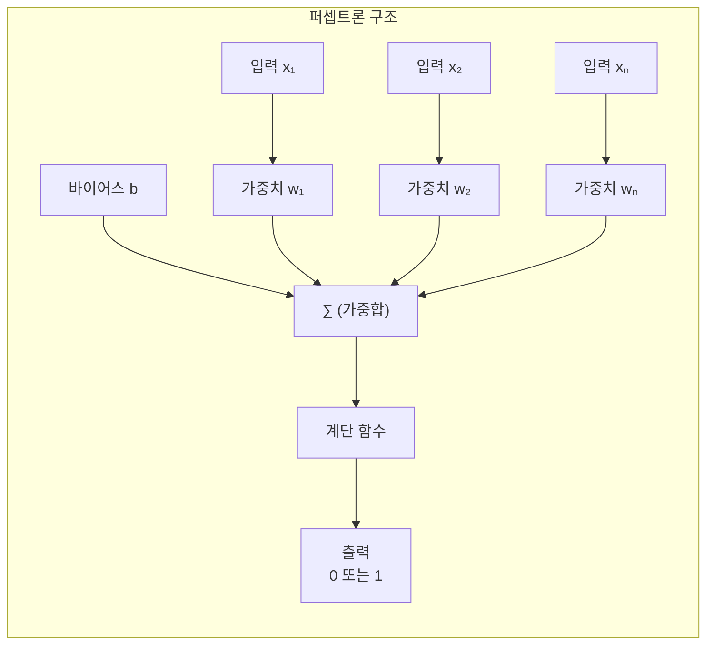
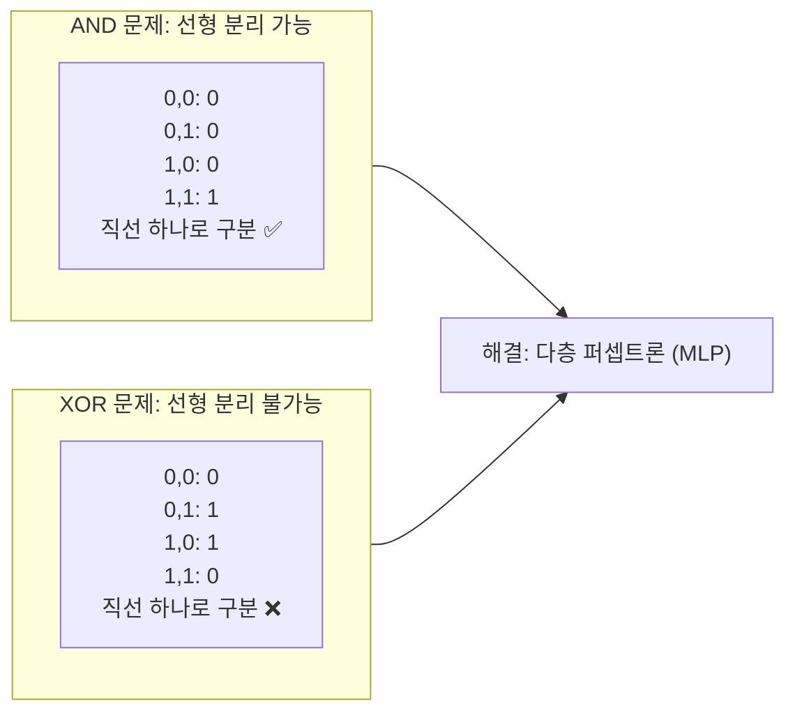
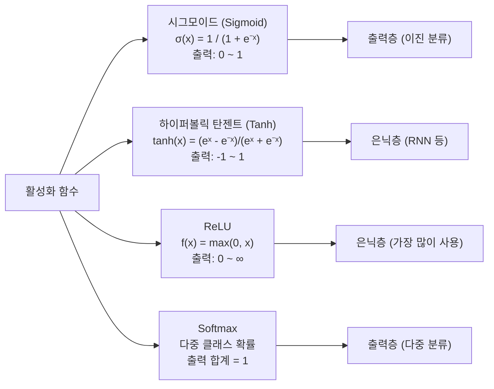
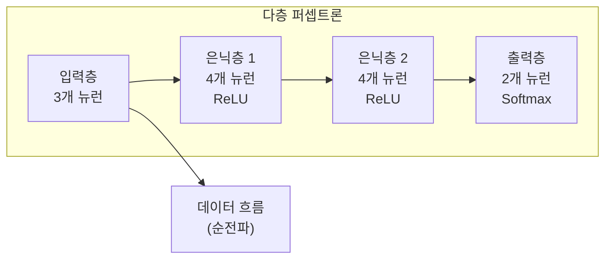
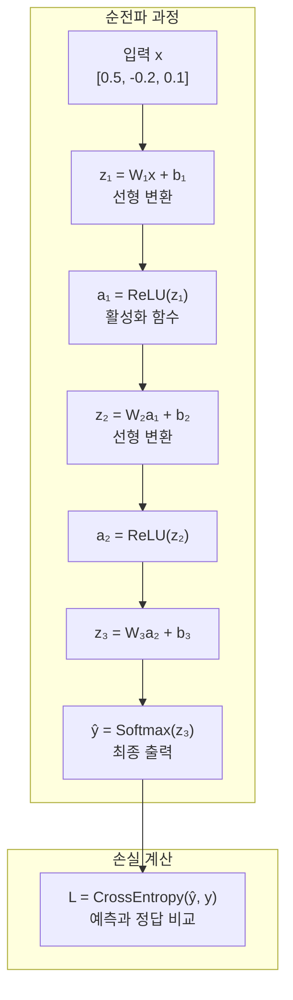
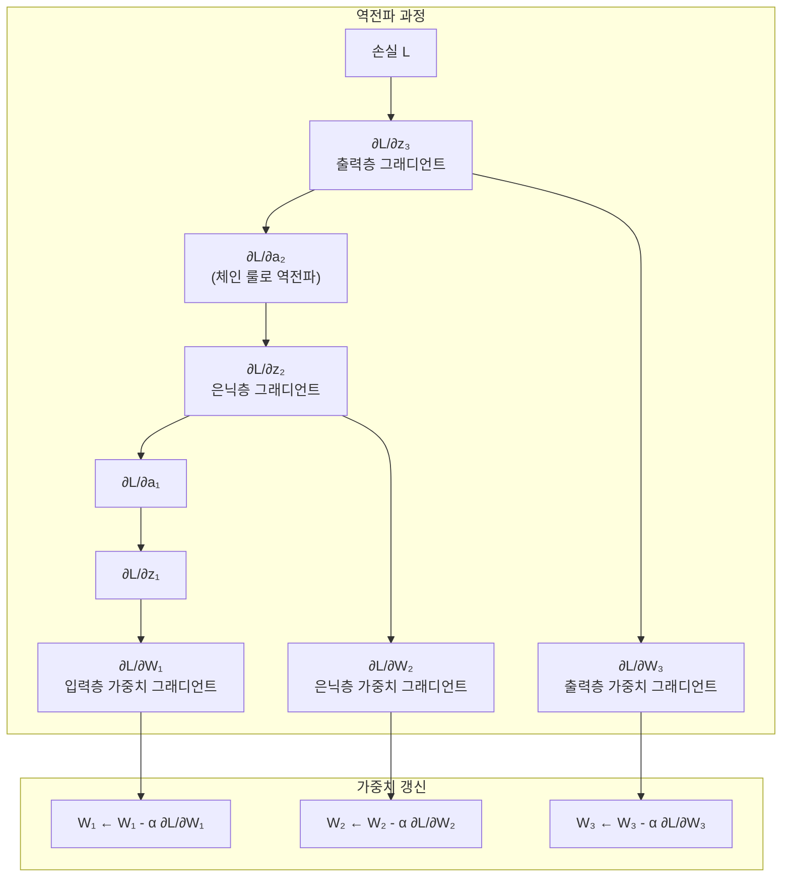
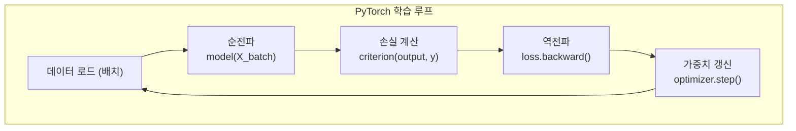
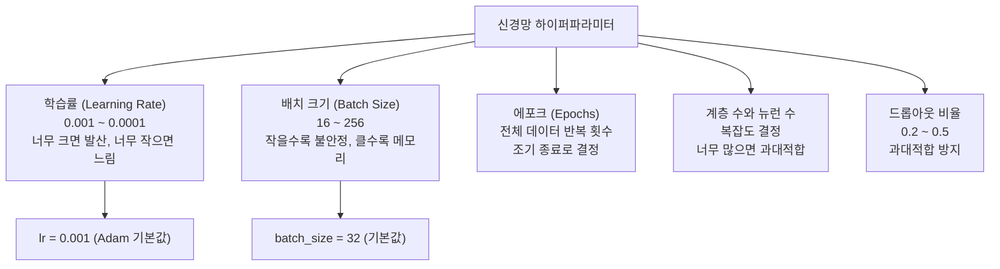

# 09장: 신경망 기초

> **🎯 학습 목표**
> - 퍼셉트론의 작동 원리와 한계를 이해합니다.
> - 활성화 함수의 종류와 역할을 설명할 수 있습니다.
> - 다층 퍼셉트론(MLP)의 구조를 이해합니다.
> - 순전파와 역전파의 개념을 직관적으로 이해합니다.
> - PyTorch로 기본 신경망을 구현할 수 있습니다.

---

## 9.1 퍼셉트론 (Perceptron)

퍼셉트론은 **가장 단순한 인공 신경망**으로, 1957년 Frank Rosenblatt이 개발했습니다.



### 9.1.1 퍼셉트론 구현

```python
import numpy as np

class Perceptron:
    def __init__(self, learning_rate=0.01, epochs=100):
        self.lr = learning_rate
        self.epochs = epochs

    def activation(self, z):
        """계단 함수: z >= 0 → 1, z < 0 → 0"""
        return np.where(z >= 0, 1, 0)

    def fit(self, X, y):
        n_samples, n_features = X.shape
        self.weights = np.zeros(n_features)
        self.bias = 0

        for epoch in range(self.epochs):
            for i in range(n_samples):
                linear_output = np.dot(X[i], self.weights) + self.bias
                y_pred = self.activation(linear_output)

                # 가중치 업데이트
                update = self.lr * (y[i] - y_pred)
                self.weights += update * X[i]
                self.bias += update

            if epoch % 50 == 0:
                predictions = self.activation(np.dot(X, self.weights) + self.bias)
                accuracy = np.mean(predictions == y)
                print(f"Epoch {epoch}: 정확도 {accuracy:.3f}")

    def predict(self, X):
        linear_output = np.dot(X, self.weights) + self.bias
        return self.activation(linear_output)


# AND 게이트 학습
X_and = np.array([[0, 0], [0, 1], [1, 0], [1, 1]])
y_and = np.array([0, 0, 0, 1])

p = Perceptron(learning_rate=0.1, epochs=100)
p.fit(X_and, y_and)
print(f"\nAND 게이트 예측: {p.predict(X_and)}")  # [0, 0, 0, 1]

# XOR 게이트 - 퍼셉트론의 한계
X_xor = np.array([[0, 0], [0, 1], [1, 0], [1, 1]])
y_xor = np.array([0, 1, 1, 0])

p2 = Perceptron(learning_rate=0.1, epochs=100)
p2.fit(X_xor, y_xor)
print(f"\nXOR 게이트 예측: {p2.predict(X_xor)}")  # 선형 분리 불가능!
```

### 9.1.2 퍼셉트론의 한계



---

## 9.2 활성화 함수 (Activation Functions)

활성화 함수는 **비선형성**을 추가하여 신경망이 복잡한 패턴을 학습할 수 있게 합니다.



```python
import numpy as np
import matplotlib.pyplot as plt

def sigmoid(x):
    return 1 / (1 + np.exp(-x))

def tanh(x):
    return np.tanh(x)

def relu(x):
    return np.maximum(0, x)

def leaky_relu(x, alpha=0.01):
    return np.where(x > 0, x, alpha * x)

x = np.linspace(-5, 5, 100)

fig, axes = plt.subplots(2, 2, figsize=(12, 8))

axes[0, 0].plot(x, sigmoid(x))
axes[0, 0].set_title('Sigmoid')
axes[0, 0].grid(True)

axes[0, 1].plot(x, tanh(x))
axes[0, 1].set_title('Tanh')
axes[0, 1].grid(True)

axes[1, 0].plot(x, relu(x))
axes[1, 0].set_title('ReLU')
axes[1, 0].grid(True)

axes[1, 1].plot(x, leaky_relu(x))
axes[1, 1].set_title('Leaky ReLU')
axes[1, 1].grid(True)

plt.tight_layout()
plt.show()

# 활성화 함수 비교표
print(f"{'함수':<12} {'출력 범위':<16} {'기울기 소실':<14} {'사용처'}")
print(f"{'Sigmoid':<12} {'0 ~ 1':<16} {'심함':<14} {'이진 분류 출력'}")
print(f"{'Tanh':<12} {'-1 ~ 1':<16} {'심함':<14} {'RNN 은닉층'}")
print(f"{'ReLU':<12} {'0 ~ ∞':<16} {'없음':<14} {'CNN, MLP 은닉층 ✅'}")
```

---

## 9.3 다층 퍼셉트론 (MLP)

MLP는 입력층, 은닉층, 출력층으로 구성된 **여러 계층의 신경망**입니다.



```python
import torch
import torch.nn as nn
import torch.nn.functional as F

# PyTorch로 MLP 구현
class MLP(nn.Module):
    def __init__(self, input_size, hidden_size, num_classes):
        super().__init__()
        self.fc1 = nn.Linear(input_size, hidden_size)  # 입력 → 은닉
        self.fc2 = nn.Linear(hidden_size, hidden_size) # 은닉 → 은닉
        self.fc3 = nn.Linear(hidden_size, num_classes) # 은닉 → 출력

    def forward(self, x):
        x = F.relu(self.fc1(x))
        x = F.relu(self.fc2(x))
        x = self.fc3(x)  # 출력층은 활성화 없이 (CrossEntropyLoss가 내부 처리)
        return x

# MNIST (손글씨) 분류 MLP
model = MLP(input_size=784, hidden_size=128, num_classes=10)
print(model)

# 파라미터 수 계산
total_params = sum(p.numel() for p in model.parameters())
trainable_params = sum(p.numel() for p in model.parameters() if p.requires_grad)
print(f"\n총 파라미터: {total_params:,}")
print(f"학습 가능 파라미터: {trainable_params:,}")
```

---

## 9.4 순전파 (Forward Propagation)

순전파는 **입력이 네트워크를 통과하여 출력까지 도달하는 과정**입니다.

```python
import torch
import torch.nn as nn

# 간단한 순전파 예제
input_data = torch.tensor([[0.5, -0.2, 0.1]])  # 1개 샘플, 3개 특성

# 신경망 계층
fc1 = nn.Linear(3, 4)
fc2 = nn.Linear(4, 2)

# 순전파
h1 = torch.relu(fc1(input_data))
h2 = torch.relu(fc2(h1))

print(f"입력: {input_data}")
print(f"은닉층 출력: {h1}")
print(f"출력층 출력 (Logits): {h2}")

# Softmax로 확률 변환
probs = torch.softmax(h2, dim=1)
print(f"확률: {probs}")

# argmax로 최종 예측
predictions = torch.argmax(probs, dim=1)
print(f"예측 클래스: {predictions}")
```



---

## 9.5 역전파 (Backpropagation)

역전파는 **손실을 줄이기 위해 각 가중치의 그래디언트를 계산하는 과정**입니다.



### PyTorch에서 자동 미분 (Autograd)

```python
import torch

# PyTorch가 자동으로 그래디언트 계산
x = torch.tensor([[2.0, 3.0]], requires_grad=True)
w = torch.tensor([[1.0, -1.0], [2.0, 0.0]], requires_grad=True)
b = torch.tensor([1.0, -2.0], requires_grad=True)

# 순전파
z = torch.mm(x, w) + b  # 행렬 곱 + 바이어스
y = torch.sigmoid(z)
loss = y.sum()

# 역전파 (자동!)
loss.backward()

# 그래디언트 확인
print(f"x의 그래디언트:\n{x.grad}")
print(f"w의 그래디언트:\n{w.grad}")
print(f"b의 그래디언트:\n{b.grad}")
```

---

## 9.6 PyTorch로 MNIST 학습

실제 데이터로 MLP를 학습시켜보겠습니다.

### 데이터 로드 및 준비

```python
import torch
import torch.nn as nn
import torch.optim as optim
from torch.utils.data import DataLoader, TensorDataset
from sklearn.datasets import load_digits
from sklearn.model_selection import train_test_split
from sklearn.preprocessing import StandardScaler
import numpy as np

# MNIST-like 데이터 로드
digits = load_digits()
X, y = digits.data, digits.target

# 데이터 전처리
scaler = StandardScaler()
X = scaler.fit_transform(X)

# Train/Test 분할
X_train, X_test, y_train, y_test = train_test_split(
    X, y, test_size=0.2, random_state=42
)

# PyTorch 텐서로 변환
X_train_t = torch.FloatTensor(X_train)
y_train_t = torch.LongTensor(y_train)
X_test_t = torch.FloatTensor(X_test)
y_test_t = torch.LongTensor(y_test)

# DataLoader
train_dataset = TensorDataset(X_train_t, y_train_t)
train_loader = DataLoader(train_dataset, batch_size=32, shuffle=True)
```

### 모델 정의, 학습, 평가

```python
# 1. 모델 정의
class MNISTClassifier(nn.Module):
    def __init__(self):
        super().__init__()
        self.net = nn.Sequential(
            nn.Linear(64, 128),
            nn.ReLU(),
            nn.Dropout(0.2),
            nn.Linear(128, 64),
            nn.ReLU(),
            nn.Dropout(0.2),
            nn.Linear(64, 10)
        )

    def forward(self, x):
        return self.net(x)

model = MNISTClassifier()

# 2. 손실 함수와 옵티마이저
criterion = nn.CrossEntropyLoss()
optimizer = optim.Adam(model.parameters(), lr=0.001)

# 3. 학습 루프
epochs = 50
train_losses = []
test_accuracies = []

for epoch in range(epochs):
    # 학습
    model.train()
    running_loss = 0.0

    for X_batch, y_batch in train_loader:
        optimizer.zero_grad()
        outputs = model(X_batch)
        loss = criterion(outputs, y_batch)
        loss.backward()
        optimizer.step()
        running_loss += loss.item()

    avg_loss = running_loss / len(train_loader)
    train_losses.append(avg_loss)

    # 평가
    model.eval()
    with torch.no_grad():
        outputs = model(X_test_t)
        _, predicted = torch.max(outputs, 1)
        accuracy = (predicted == y_test_t).float().mean()
        test_accuracies.append(accuracy.item())

    if (epoch + 1) % 10 == 0:
        print(f"Epoch {epoch+1}/{epochs}: Loss={avg_loss:.4f}, Accuracy={accuracy:.4f}")
```



### 학습 결과 시각화

```python
import matplotlib.pyplot as plt

plt.figure(figsize=(12, 4))

plt.subplot(1, 2, 1)
plt.plot(train_losses)
plt.title('학습 손실')
plt.xlabel('Epoch')
plt.ylabel('Loss')
plt.grid(True)

plt.subplot(1, 2, 2)
plt.plot(test_accuracies)
plt.title('테스트 정확도')
plt.xlabel('Epoch')
plt.ylabel('Accuracy')
plt.grid(True)

plt.tight_layout()
plt.show()

print(f"\n최종 테스트 정확도: {test_accuracies[-1]:.4f}")
```

---

## 9.7 주요 하이퍼파라미터



### 학습률 비교 실험

```python
# 다양한 학습률 비교
learning_rates = [0.1, 0.01, 0.001, 0.0001]

for lr in learning_rates:
    model = MNISTClassifier()
    optimizer = optim.Adam(model.parameters(), lr=lr)
    criterion = nn.CrossEntropyLoss()

    # 1 에포크만 학습
    model.train()
    for X_batch, y_batch in train_loader:
        optimizer.zero_grad()
        outputs = model(X_batch)
        loss = criterion(outputs, y_batch)
        loss.backward()
        optimizer.step()

    # 평가
    model.eval()
    with torch.no_grad():
        outputs = model(X_test_t)
        _, predicted = torch.max(outputs, 1)
        acc = (predicted == y_test_t).float().mean()

    print(f"Learning Rate {lr}: Accuracy {acc:.4f}")
```

---

## 📋 한눈에 정리

| 개념 | 설명 | 비유 |
|------|------|------|
| **퍼셉트론** | 가장 단순한 신경망 (입력 → 가중합 → 출력) | 하나의 뉴런 |
| **활성화 함수** | 비선형성을 추가 (ReLU, Sigmoid, Tanh) | 스위치 (켜짐/꺼짐) |
| **MLP** | 여러 계층의 퍼셉트론 | 여러 계층의 처리 |
| **순전파** | 입력 → 은닉 → 출력 | 정보의 흐름 |
| **역전파** | 출력 → 은닉 → 입력 (그래디언트 전파) | 책임 전가 |
| **PyTorch** | 자동 미분 + GPU 가속 딥러닝 라이브러리 | 자동 계산기 |

---

## ✏️ 연습 문제

1. **퍼셉트론의 XOR 문제**란 무엇이며, MLP는 어떻게 이를 해결하나요?

2. 다음 활성화 함수 중 **기울기 소실(Vanishing Gradient) 문제**가 심한 것은?
   - a) ReLU
   - b) Sigmoid
   - c) Leaky ReLU
   - d) Tanh

3. PyTorch로 3개의 은닉층(각 256, 128, 64 뉴런)을 가진 MLP를 만들고, MNIST 데이터를 분류하세요. Dropout(0.3)을 추가하고 결과를 비교하세요.

4. **순전파와 역전파**의 차이점을 설명하고, 각각이 언제 발생하는지 쓰세요.

5. 학습률이 **너무 크면** 어떤 문제가 발생하고, **너무 작으면** 어떤 문제가 발생하나요?

---

## 📝 연습 문제 정답

<details>
<summary>정답 보기</summary>

**1. XOR 문제와 MLP의 해결**
퍼셉트론은 선형 분리만 가능하여 XOR(베타적 논리합)을 하나의 직선으로 분류할 수 없습니다. XOR은 (0,0)→0, (0,1)→1, (1,0)→1, (1,1)→0의 출력을 가지며, 직선 하나로 0과 1을 구분하는 것이 불가능합니다. MLP(다층 퍼셉트론)는 은닉층을 추가하여 비선형 결정 경계를 만들 수 있어 XOR을 해결합니다. 즉, 첫 번째 은닉층이 NAND와 OR 게이트를 학습하고, 출력층이 이를 조합하여 XOR을 구현합니다.

**2. 기울기 소실 문제가 심한 활성화 함수**
- a) ReLU → **기울기 소실 없음** (양수 영역에서 기울기=1)
- b) Sigmoid → **✅ 심함** (0~1 출력, 양 끝에서 기울기 거의 0)
- c) Leaky ReLU → **기울기 소실 없음** (음수에서 작은 기울기 유지)
- d) Tanh → **✅ 심함** (-1~1 출력, 양 끝에서 기울기 거의 0)
→ 정답: **b, d** (Sigmoid와 Tanh)

**3. 3층 MLP 구현**
```python
class DeepMLP(nn.Module):
    def __init__(self, input_size=64, num_classes=10):
        super().__init__()
        self.net = nn.Sequential(
            nn.Linear(input_size, 256), nn.ReLU(), nn.Dropout(0.3),
            nn.Linear(256, 128), nn.ReLU(), nn.Dropout(0.3),
            nn.Linear(128, 64), nn.ReLU(), nn.Dropout(0.3),
            nn.Linear(64, num_classes)
        )
    def forward(self, x): return self.net(x)
```

**4. 순전파 vs 역전파**
- **순전파 (Forward):** 입력 → 은닉 → 출력 방향으로 데이터가 흐르며 예측값 계산
- **역전파 (Backward):** 출력 → 은닉 → 입력 방향으로 손실의 그래디언트 전파 (체인 룰)
- 순전파는 예측을 위해, 역전파는 가중치 갱신을 위해 사용됩니다.

**5. 학습률 문제**
- **너무 큼:** 손실이 발산(diverge)하여 NaN이 되거나 최저점을 계속 지나침
- **너무 작음:** 수렴이 매우 느려져서 많은 epoch이 필요하고, 지역 최소점에 갇힐 위험 증가

</details>

---

> **🔄 다음 장에서는** 컴퓨터 비전(CV)을 배웁니다. CNN의 구조, 합성곱과 풀링, 주요 CNN 아키텍처(VGG, ResNet), 전이 학습, 그리고 이미지 분류 실습을 진행합니다.
