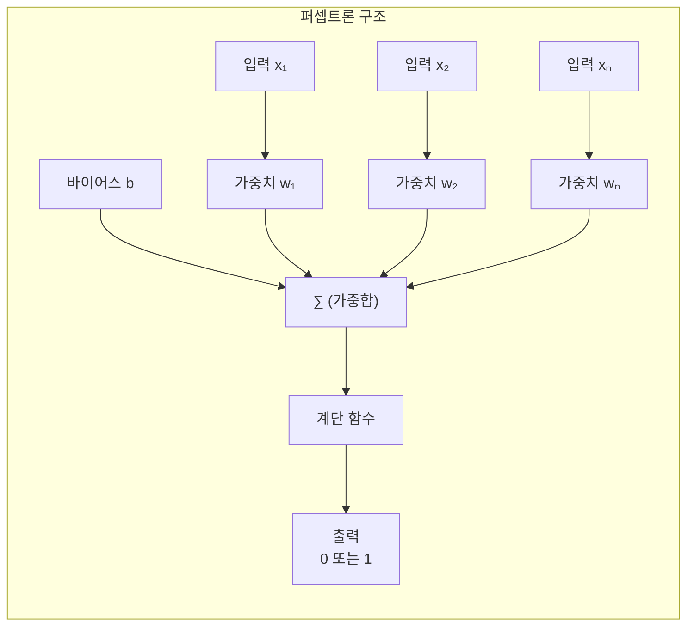
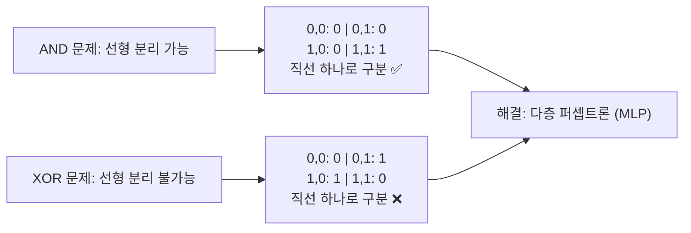
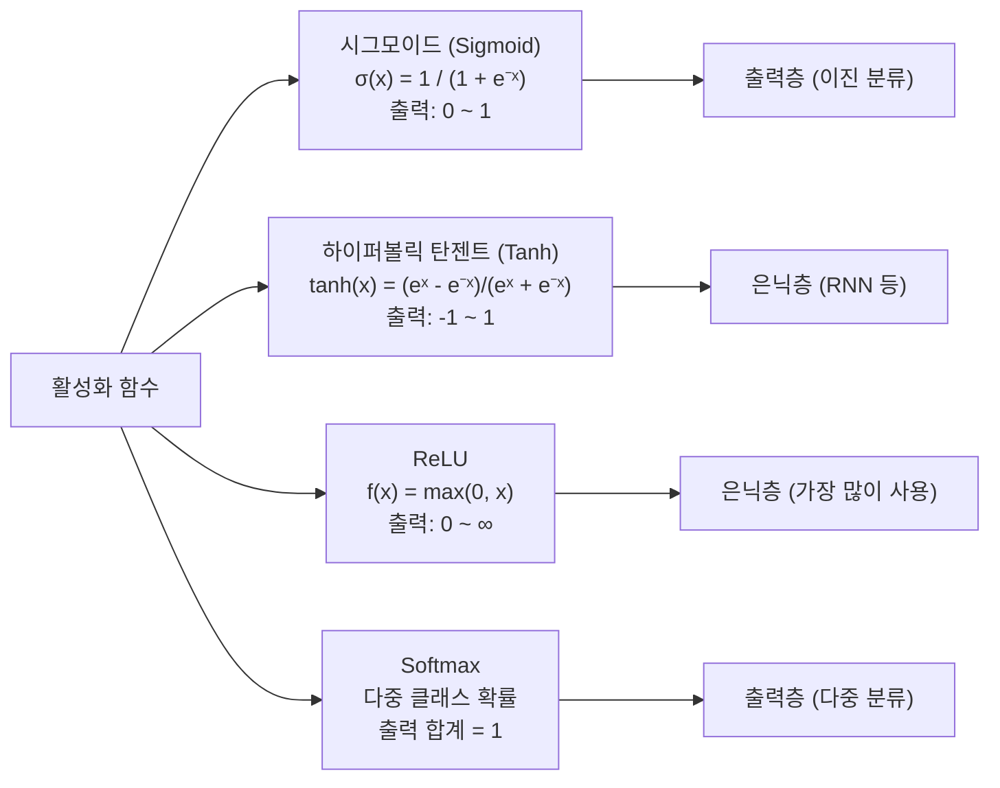
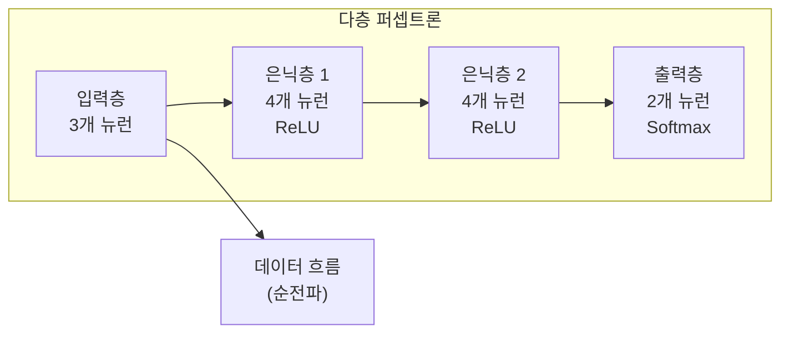
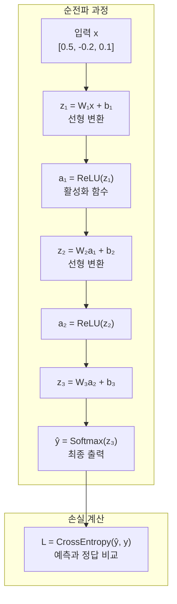
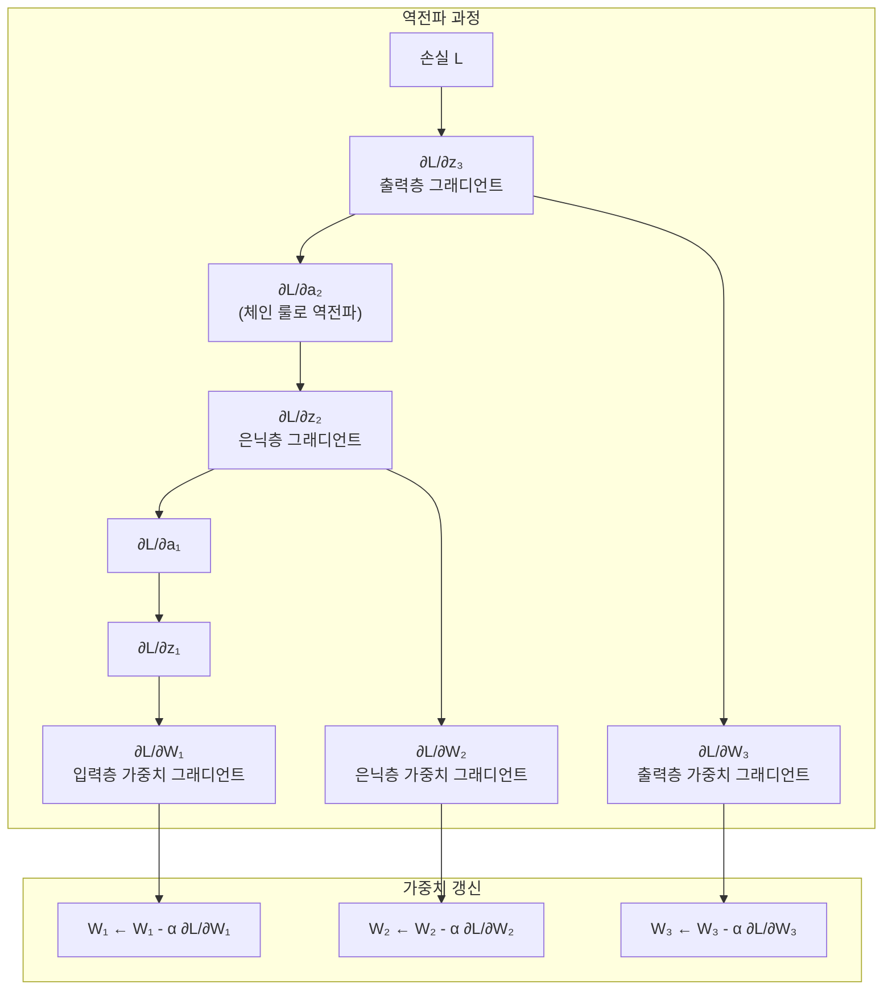
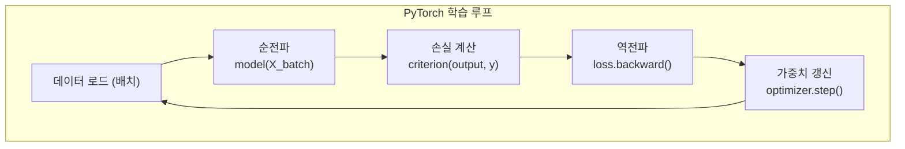
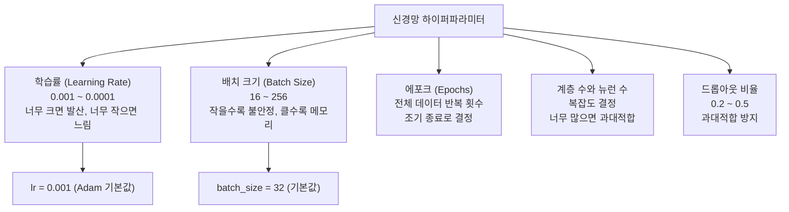

# 09장: 신경망 프로그래밍 기초

> **🎯 학습 목표**
> - 신경망의 가장 기본적인 단위인 퍼셉트론의 작동 원리와 그 한계를 이해합니다.
> - 비선형성을 부여하는 활성화 함수의 다양한 종류와 각각의 역할을 설명할 수 있습니다.
> - 다층 퍼셉트론(MLP)의 구조와 보편 근사 원리를 이해합니다.
> - 순전파와 역전파의 개념을 직관적으로 이해하고 설명할 수 있습니다.
> - PyTorch를 사용하여 실제 데이터로 학습하는 신경망을 직접 구현할 수 있습니다.
> - 주요 하이퍼파라미터가 모델 성능에 미치는 영향을 이해하고 적절한 값을 선택할 수 있습니다.

---

## 👨‍💻 실전 프로젝트: PyTorch로 만드는 첫 신경망

이번 장에서는 이론적인 개념을 학습하기에 앞서, 실제로 동작하는 신경망을 직접 구현해보는 경험을 먼저 제공하고자 합니다. 신경망의 내부 동작 원리를 완전히 이해하지 못하더라도, 코드를 통해 실행 결과를 확인하면서 학습하면 추상적인 개념이 훨씬 더 구체적으로 다가오기 때문입니다. 이 프로젝트에서는 PyTorch 라이브러리를 사용하여 2개의 입력 특성을 받아 1개의 출력(이진 분류)을 내는 간단한 2층 신경망을 구축하고, sklearn의 `make_moons` 함수로 생성한 합성 데이터를 분류하는 작업을 수행할 것입니다.

`make_moons` 데이터는 두 개의 초승달 모양 클래스가 서로 맞물려 있는 형태로서, 단순한 직선 하나로는 두 클래스를 구분할 수 없는 전형적인 비선형 분류 문제입니다. 따라서 선형 모델인 퍼셉트론으로는 이 데이터를 제대로 분류할 수 없지만, 은닉층을 추가한 2층 신경망은 비선형 결정 경계를 학습하여 높은 정확도를 달성할 수 있습니다. 아래 코드를 실행하면서 신경망이 어떻게 데이터의 패턴을 학습하는지 직접 확인해보시기 바랍니다.


```python
import torch
import torch.nn as nn
import torch.optim as optim
from sklearn.datasets import make_moons
from sklearn.model_selection import train_test_split
from sklearn.preprocessing import StandardScaler
import numpy as np

# 1. 데이터 생성
X, y = make_moons(n_samples=500, noise=0.2, random_state=42)
print(f"데이터 shape: {X.shape}, 레이블 shape: {y.shape}")
print(f"클래스 분포: 0={np.sum(y==0)}, 1={np.sum(y==1)}")

# 2. 데이터 전처리
scaler = StandardScaler()
X = scaler.fit_transform(X)
X_train, X_test, y_train, y_test = train_test_split(
    X, y, test_size=0.2, random_state=42
)

X_train_t = torch.FloatTensor(X_train)
y_train_t = torch.FloatTensor(y_train).unsqueeze(1)
X_test_t = torch.FloatTensor(X_test)
y_test_t = torch.FloatTensor(y_test).unsqueeze(1)

print(f"\n학습 데이터: {X_train_t.shape}, 테스트 데이터: {X_test_t.shape}")

# 3. 2층 신경망 정의
class SimpleNN(nn.Module):
    def __init__(self, input_size=2, hidden_size=16):
        super().__init__()
        self.fc1 = nn.Linear(input_size, hidden_size)
        self.fc2 = nn.Linear(hidden_size, 1)
        self.sigmoid = nn.Sigmoid()

    def forward(self, x):
        x = torch.relu(self.fc1(x))
        x = self.sigmoid(self.fc2(x))
        return x

model = SimpleNN()
criterion = nn.BCELoss()
optimizer = optim.Adam(model.parameters(), lr=0.01)

print(f"\n모델 구조:\n{model}")

# 4. 학습 루프
epochs = 100
for epoch in range(epochs):
    model.train()
    outputs = model(X_train_t)
    loss = criterion(outputs, y_train_t)

    optimizer.zero_grad()
    loss.backward()
    optimizer.step()

    if (epoch + 1) % 20 == 0:
        with torch.no_grad():
            preds = (outputs > 0.5).float()
            accuracy = (preds == y_train_t).float().mean()
        print(f"Epoch {epoch+1:3d}/{epochs} | Loss: {loss.item():.4f} | Acc: {accuracy.item():.4f}")

# 5. 평가
model.eval()
with torch.no_grad():
    test_outputs = model(X_test_t)
    test_preds = (test_outputs > 0.5).float()
    test_accuracy = (test_preds == y_test_t).float().mean()
print(f"\n테스트 정확도: {test_accuracy.item():.4f}")
```

---

## 9.1 퍼셉트론 (Perceptron)

퍼셉트론은 인공 신경망의 가장 기본적인 구성 요소로서, 1957년 Frank Rosenblatt에 의해 처음 소개된 이래로 오늘날 딥러닝의 기초 토대를 제공한 핵심 개념입니다. 이 구조는 여러 개의 입력값에 각각 가중치를 곱하고 바이어스를 더한 후, 계단 함수(step function)를 통과시켜 최종 출력을 0 또는 1로 결정하는 단순한 메커니즘으로 동작합니다. 이러한 단순함에도 불구하고 퍼셉트론은 AND, OR, NAND와 같은 선형 분리 가능한 논리 게이트 문제를 완벽하게 해결할 수 있었으며, 이는 당시 학계에 인공 신경망의 가능성을 강력하게 시사하는 결과였습니다. 그러나 퍼셉트론의 학습 알고리즘은 출력과 정답의 차이만큼 가중치를 조정하는 매우 직관적인 방식으로 설계되어 있어, 구현이 간단하면서도 직관적인 이해를 돕는다는 장점을 지닙니다.



### 9.1.1 퍼셉트론 구현

퍼셉트론의 학습 과정을 코드로 직접 구현하면 그 동작 원리를 더욱 명확하게 이해할 수 있습니다. 아래 코드는 NumPy를 사용하여 퍼셉트론 클래스를 정의하고, AND 게이트와 XOR 게이트에 대해 각각 학습을 수행합니다. AND 게이트의 경우 퍼셉트론이 완벽하게 학습에 성공하여 모든 입력 조합에 대해 정확한 출력을 내놓지만, XOR 게이트의 경우 선형 분리가 불가능하여 학습이 제대로 이루어지지 않는 것을 확인할 수 있습니다.

```python
import numpy as np

class Perceptron:
    def __init__(self, learning_rate=0.01, epochs=100):
        self.lr = learning_rate
        self.epochs = epochs

    def activation(self, z):
        """계단 함수: z >= 0 → 1, z < 0 → 0"""
        return np.where(z >= 0, 1, 0)

    def fit(self, X, y):
        n_samples, n_features = X.shape
        self.weights = np.zeros(n_features)
        self.bias = 0

        for epoch in range(self.epochs):
            for i in range(n_samples):
                linear_output = np.dot(X[i], self.weights) + self.bias
                y_pred = self.activation(linear_output)

                # 가중치 업데이트
                update = self.lr * (y[i] - y_pred)
                self.weights += update * X[i]
                self.bias += update

            if epoch % 50 == 0:
                predictions = self.activation(np.dot(X, self.weights) + self.bias)
                accuracy = np.mean(predictions == y)
                print(f"Epoch {epoch}: 정확도 {accuracy:.3f}")

    def predict(self, X):
        linear_output = np.dot(X, self.weights) + self.bias
        return self.activation(linear_output)


# AND 게이트 학습
X_and = np.array([[0, 0], [0, 1], [1, 0], [1, 1]])
y_and = np.array([0, 0, 0, 1])

p = Perceptron(learning_rate=0.1, epochs=100)
p.fit(X_and, y_and)
print(f"\nAND 게이트 예측: {p.predict(X_and)}")  # [0, 0, 0, 1]

# XOR 게이트 - 퍼셉트론의 한계
X_xor = np.array([[0, 0], [0, 1], [1, 0], [1, 1]])
y_xor = np.array([0, 1, 1, 0])

p2 = Perceptron(learning_rate=0.1, epochs=100)
p2.fit(X_xor, y_xor)
print(f"\nXOR 게이트 예측: {p2.predict(X_xor)}")  # 선형 분리 불가능!
```

### 9.1.2 퍼셉트론의 한계

퍼셉트론은 선형 분리 가능한 문제에 대해서는 완벽하게 작동하지만, XOR과 같이 하나의 직선으로 두 클래스를 구분할 수 없는 비선형 문제는 해결하지 못한다는 근본적인 한계를 지닙니다. 이는 1969년 Minsky와 Papert가 저서 "Perceptrons"에서 수학적으로 증명한 내용으로, 이후 인공 신경망 연구가 한동안 침체기에 빠지는 계기가 되었습니다. 아래 다이어그램은 AND 문제는 직선 하나로 분류 가능하지만 XOR 문제는 불가능하다는 사실을 시각적으로 보여줍니다.



이처럼 퍼셉트론은 선형 분리 가능한 문제에 대해서는 효과적으로 작동하지만, XOR과 같은 비선형 문제는 해결할 수 없다는 근본적인 한계를 지니고 있습니다. 이러한 한계를 극복하기 위해서는 신경망에 비선형성을 도입해야 하며, 그 핵심 역할을 하는 것이 바로 활성화 함수(activation function)입니다. 다음 절에서는 다양한 활성화 함수의 종류와 각각의 특징, 그리고 적절한 사용 시기에 대해 자세히 살펴보도록 하겠습니다.

---

## 9.2 활성화 함수 (Activation Functions)

활성화 함수는 인공 신경망에 비선형성을 부여하는 핵심적인 요소로서, 신경망이 단순한 선형 변환의 조합 이상으로 복잡한 패턴을 학습할 수 있도록 만들어줍니다. 만약 활성화 함수가 존재하지 않거나 항등 함수만 사용한다면, 아무리 많은 층을 쌓아도 결과적으로 하나의 선형 변환과 동일해지기 때문에 XOR과 같은 비선형 문제를 해결할 수 없게 됩니다. 따라서 적절한 활성화 함수를 선택하는 것은 신경망의 표현력과 학습 능력을 결정짓는 중요한 설계 요소라고 할 수 있으며, 각 활성화 함수는 고유한 출력 범위와 기울기 특성을 지니고 있어 문제의 성격에 따라 신중히 선택되어야 합니다.



```python
import numpy as np
import matplotlib.pyplot as plt

def sigmoid(x):
    return 1 / (1 + np.exp(-x))

def tanh(x):
    return np.tanh(x)

def relu(x):
    return np.maximum(0, x)

def leaky_relu(x, alpha=0.01):
    return np.where(x > 0, x, alpha * x)

x = np.linspace(-5, 5, 100)

fig, axes = plt.subplots(2, 2, figsize=(12, 8))

axes[0, 0].plot(x, sigmoid(x))
axes[0, 0].set_title('Sigmoid')
axes[0, 0].grid(True)

axes[0, 1].plot(x, tanh(x))
axes[0, 1].set_title('Tanh')
axes[0, 1].grid(True)

axes[1, 0].plot(x, relu(x))
axes[1, 0].set_title('ReLU')
axes[1, 0].grid(True)

axes[1, 1].plot(x, leaky_relu(x))
axes[1, 1].set_title('Leaky ReLU')
axes[1, 1].grid(True)

plt.tight_layout()
plt.show()

# 활성화 함수 비교표
print(f"{'함수':<12} {'출력 범위':<16} {'기울기 소실':<14} {'사용처'}")
print(f"{'Sigmoid':<12} {'0 ~ 1':<16} {'심함':<14} {'이진 분류 출력'}")
print(f"{'Tanh':<12} {'-1 ~ 1':<16} {'심함':<14} {'RNN 은닉층'}")
print(f"{'ReLU':<12} {'0 ~ ∞':<16} {'없음':<14} {'CNN, MLP 은닉층 ✅'}")
```

지금까지 살펴본 활성화 함수는 단일 퍼셉트론에 비선형성을 부여하는 역할을 수행합니다. 그러나 하나의 퍼셉트론만으로는 복잡한 패턴을 학습하는 데 한계가 있으므로, 여러 개의 퍼셉트론을 계층적으로 연결한 구조가 필요합니다. 다음 절에서는 입력층, 은닉층, 출력층으로 구성된 다층 퍼셉트론(MLP)의 구조와 동작 원리를 학습하겠습니다.

---

## 9.3 다층 퍼셉트론 (MLP)

다층 퍼셉트론은 입력층과 출력층 사이에 하나 이상의 은닉층을 추가한 신경망 구조로서, 단일 퍼셉트론이 해결할 수 없었던 XOR 문제를 비롯한 다양한 비선형 문제를 해결할 수 있습니다. 은닉층의 각 뉴런은 입력 신호를 가중합한 후 활성화 함수를 적용하여 다음 층으로 전달하며, 이러한 과정이 반복되면서 점차 더 추상적이고 고차원적인 특징이 학습됩니다. 이론적으로는 하나의 은닉층만으로도 임의의 연속 함수를 근사할 수 있다는 보편 근사 정리(Universal Approximation Theorem)가 증명되어 있으며, 이는 MLP가 매우 강력한 표현력을 지니고 있음을 뒷받침합니다. 아래 코드는 PyTorch를 사용하여 3개의 은닉층을 가진 MLP를 정의한 예시로서, 입력 크기, 은닉층 크기, 출력 클래스 수를 파라미터로 전달받아 유연하게 모델을 구성할 수 있도록 설계되어 있습니다.



```python
import torch
import torch.nn as nn
import torch.nn.functional as F

# PyTorch로 MLP 구현
class MLP(nn.Module):
    def __init__(self, input_size, hidden_size, num_classes):
        super().__init__()
        self.fc1 = nn.Linear(input_size, hidden_size)  # 입력 → 은닉
        self.fc2 = nn.Linear(hidden_size, hidden_size) # 은닉 → 은닉
        self.fc3 = nn.Linear(hidden_size, num_classes) # 은닉 → 출력

    def forward(self, x):
        x = F.relu(self.fc1(x))
        x = F.relu(self.fc2(x))
        x = self.fc3(x)  # 출력층은 활성화 없이 (CrossEntropyLoss가 내부 처리)
        return x

# MNIST (손글씨) 분류 MLP
model = MLP(input_size=784, hidden_size=128, num_classes=10)
print(model)

# 파라미터 수 계산
total_params = sum(p.numel() for p in model.parameters())
trainable_params = sum(p.numel() for p in model.parameters() if p.requires_grad)
print(f"\n총 파라미터: {total_params:,}")
print(f"학습 가능 파라미터: {trainable_params:,}")
```

MLP의 구조를 이해하였다면, 이제 실제로 데이터가 이 네트워크를 어떻게 통과하는지 살펴볼 차례입니다. 입력 데이터가 각 층의 가중치와 활성화 함수를 거쳐 최종 출력까지 도달하는 과정을 순전파(forward propagation)라고 합니다. 다음 절에서는 순전파의 수학적 과정과 PyTorch를 이용한 구현 방법을 상세히 알아보겠습니다.

---

## 9.4 순전파 (Forward Propagation)

순전파는 신경망의 입력층으로 들어온 데이터가 각 층의 가중치 행렬과 바이어스를 거쳐 활성화 함수를 통과하면서 최종 출력층까지 도달하는 전체 과정을 의미합니다. 이 과정에서 각 뉴런은 이전 층의 출력값과 자신의 가중치를 선형 결합한 후 비선형 활성화 함수를 적용하여 다음 층으로 전달하는 역할을 수행합니다. 순전파가 완료되면 출력층에서 얻은 예측값과 실제 정답 사이의 차이, 즉 손실(loss)이 계산되며, 이 손실 값을 바탕으로 역전파 과정이 시작됩니다. 아래 코드와 다이어그램은 3개의 입력 특성을 가진 데이터가 2개의 은닉층을 거쳐 최종 출력 클래스로 변환되는 순전파의 전 과정을 보여줍니다.

```python
import torch
import torch.nn as nn

# 간단한 순전파 예제
input_data = torch.tensor([[0.5, -0.2, 0.1]])  # 1개 샘플, 3개 특성

# 신경망 계층
fc1 = nn.Linear(3, 4)
fc2 = nn.Linear(4, 2)

# 순전파
h1 = torch.relu(fc1(input_data))
h2 = torch.relu(fc2(h1))

print(f"입력: {input_data}")
print(f"은닉층 출력: {h1}")
print(f"출력층 출력 (Logits): {h2}")

# Softmax로 확률 변환
probs = torch.softmax(h2, dim=1)
print(f"확률: {probs}")

# argmax로 최종 예측
predictions = torch.argmax(probs, dim=1)
print(f"예측 클래스: {predictions}")
```



순전파를 통해 예측값을 계산하고 손실을 구하였다면, 다음 단계는 이 손실을 줄이기 위해 가중치를 업데이트하는 것입니다. 이를 위해 출력층에서 입력층 방향으로 그래디언트를 전파하는 역전파(backpropagation) 알고리즘이 사용됩니다. 다음 절에서는 역전파의 원리와 PyTorch의 자동 미분 기능에 대해 알아보겠습니다.

---

## 9.5 역전파 (Backpropagation)

역전파는 순전파를 통해 계산된 손실 값을 줄이기 위하여, 출력층에서부터 입력층 방향으로 각 가중치에 대한 그래디언트(기울기)를 연쇄 법칙(chain rule)을 사용하여 계산하는 알고리즘입니다. 이 과정에서 각 층의 가중치가 손실에 얼마나 기여했는지를 미분을 통해 정량적으로 평가하며, 계산된 그래디언트는 경사 하강법(gradient descent)에 활용되어 가중치를 갱신하는 데 사용됩니다. PyTorch와 같은 현대적인 딥러닝 프레임워크는 이러한 역전파 과정을 자동 미분(autograd) 기능을 통해 완전히 자동화하고 있으므로, 개발자는 순전파만 정의하면 나머지는 프레임워크가 처리해줍니다. 아래 다이어그램은 출력층에서 시작된 그래디언트가 체인 룰을 따라 입력층까지 거슬러 올라가며 각 가중치의 그래디언트를 계산하는 역전파의 전체 흐름을 시각화한 것입니다.



### PyTorch에서 자동 미분 (Autograd)

PyTorch의 자동 미분 엔진인 autograd는 텐서에 수행된 모든 연산을 자동으로 기록하고, 역전파 시에 각 변수에 대한 그래디언트를 계산해주는 강력한 기능입니다. `requires_grad=True`로 설정된 텐서에 대해 연산이 수행되면 PyTorch는 계산 그래프(computational graph)를 내부적으로 구축하며, `loss.backward()`가 호출될 때 이 그래프를 따라 역방향으로 그래디언트가 전파됩니다. 아래 코드는 이러한 자동 미분이 어떻게 작동하는지를 보여주는 간단한 예제로서, 행렬 곱, 시그모이드 활성화 함수, 합계 연산을 거친 후 역전파를 수행하여 각 텐서의 그래디언트를 확인할 수 있습니다.

```python
import torch

# PyTorch가 자동으로 그래디언트 계산
x = torch.tensor([[2.0, 3.0]], requires_grad=True)
w = torch.tensor([[1.0, -1.0], [2.0, 0.0]], requires_grad=True)
b = torch.tensor([1.0, -2.0], requires_grad=True)

# 순전파
z = torch.mm(x, w) + b  # 행렬 곱 + 바이어스
y = torch.sigmoid(z)
loss = y.sum()

# 역전파 (자동!)
loss.backward()

# 그래디언트 확인
print(f"x의 그래디언트:\n{x.grad}")
print(f"w의 그래디언트:\n{w.grad}")
print(f"b의 그래디언트:\n{b.grad}")
```

지금까지 배운 순전파와 역전파의 개념은 모든 신경망 학습의 핵심 원리입니다. 이러한 이론적 기반 위에서, 이번 절에서는 실제 데이터셋인 MNIST 손글씨 숫자 분류 문제를 MLP로 해결하는 전체 과정을 실습해보겠습니다. 데이터 로드부터 전처리, 모델 정의, 학습 루프, 평가까지의 전체 파이프라인을 경험할 것입니다.

---

## 9.6 PyTorch로 MNIST 학습

지금까지 배운 이론적 개념들을 종합하여, 이번 절에서는 실제 데이터셋인 MNIST 손글씨 숫자 분류 문제를 MLP로 해결해보겠습니다. MNIST는 0부터 9까지의 손글씨 숫자 이미지로 구성된 데이터셋으로, 각 이미지는 8×8 픽셀의 그레이스케일 값(또는 28×28 픽셀의 확장 버전)으로 표현됩니다. 이 실습을 통해 데이터 전처리, 모델 정의, 학습 루프 구현, 평가 및 시각화까지 전체 파이프라인을 경험할 수 있으며, 앞서 배운 순전파와 역전파가 실제 코드에서 어떻게 구현되는지 확인할 수 있습니다.

### 데이터 로드 및 준비

데이터를 로드하고 신경망 학습에 적합한 형태로 변환하는 것은 모든 딥러닝 프로젝트의 첫 번째 단계입니다. 아래 코드에서는 sklearn의 `load_digits` 함수를 사용하여 MNIST와 유사한 손글씨 숫자 데이터를 불러온 후, StandardScaler로 각 특성의 스케일을 조정하고 학습용과 테스트용으로 분할합니다. 또한 PyTorch의 DataLoader를 사용하여 미니배치 단위로 데이터를 공급할 수 있도록 준비합니다.

```python
import torch
import torch.nn as nn
import torch.optim as optim
from torch.utils.data import DataLoader, TensorDataset
from sklearn.datasets import load_digits
from sklearn.model_selection import train_test_split
from sklearn.preprocessing import StandardScaler
import numpy as np

# MNIST-like 데이터 로드
digits = load_digits()
X, y = digits.data, digits.target

# 데이터 전처리
scaler = StandardScaler()
X = scaler.fit_transform(X)

# Train/Test 분할
X_train, X_test, y_train, y_test = train_test_split(
    X, y, test_size=0.2, random_state=42
)

# PyTorch 텐서로 변환
X_train_t = torch.FloatTensor(X_train)
y_train_t = torch.LongTensor(y_train)
X_test_t = torch.FloatTensor(X_test)
y_test_t = torch.LongTensor(y_test)

# DataLoader
train_dataset = TensorDataset(X_train_t, y_train_t)
train_loader = DataLoader(train_dataset, batch_size=32, shuffle=True)
```

### 모델 정의, 학습, 평가

모델을 정의하고 학습 루프를 구현하는 것은 신경망 실습의 핵심 부분입니다. 아래 코드에서는 `nn.Sequential`을 사용하여 은닉층에 Dropout을 포함한 MLP를 간결하게 정의하고, CrossEntropyLoss와 Adam 옵티마이저를 설정한 후 50 에포크 동안 학습을 수행합니다. 학습 루프 내에서는 순전파로 예측값을 계산하고, 손실을 구한 다음, `loss.backward()`로 역전파를 수행하고, `optimizer.step()`으로 가중치를 갱신하는 일련의 과정이 반복됩니다.

```python
# 1. 모델 정의
class MNISTClassifier(nn.Module):
    def __init__(self):
        super().__init__()
        self.net = nn.Sequential(
            nn.Linear(64, 128),
            nn.ReLU(),
            nn.Dropout(0.2),
            nn.Linear(128, 64),
            nn.ReLU(),
            nn.Dropout(0.2),
            nn.Linear(64, 10)
        )

    def forward(self, x):
        return self.net(x)

model = MNISTClassifier()

# 2. 손실 함수와 옵티마이저
criterion = nn.CrossEntropyLoss()
optimizer = optim.Adam(model.parameters(), lr=0.001)

# 3. 학습 루프
epochs = 50
train_losses = []
test_accuracies = []

for epoch in range(epochs):
    # 학습
    model.train()
    running_loss = 0.0

    for X_batch, y_batch in train_loader:
        optimizer.zero_grad()
        outputs = model(X_batch)
        loss = criterion(outputs, y_batch)
        loss.backward()
        optimizer.step()
        running_loss += loss.item()

    avg_loss = running_loss / len(train_loader)
    train_losses.append(avg_loss)

    # 평가
    model.eval()
    with torch.no_grad():
        outputs = model(X_test_t)
        _, predicted = torch.max(outputs, 1)
        accuracy = (predicted == y_test_t).float().mean()
        test_accuracies.append(accuracy.item())

    if (epoch + 1) % 10 == 0:
        print(f"Epoch {epoch+1}/{epochs}: Loss={avg_loss:.4f}, Accuracy={accuracy:.4f}")
```



### 학습 결과 시각화

학습이 완료된 후에는 손실과 정확도의 변화 추이를 그래프로 시각화하여 모델이 올바르게 학습되고 있는지 확인하는 것이 중요합니다. 아래 코드는 에포크에 따른 학습 손실의 감소 추세와 테스트 정확도의 증가 추세를 나란히 출력하여, 모델이 과대적합 없이 안정적으로 수렴하고 있는지 판단할 수 있도록 도와줍니다.

```python
import matplotlib.pyplot as plt

plt.figure(figsize=(12, 4))

plt.subplot(1, 2, 1)
plt.plot(train_losses)
plt.title('학습 손실')
plt.xlabel('Epoch')
plt.ylabel('Loss')
plt.grid(True)

plt.subplot(1, 2, 2)
plt.plot(test_accuracies)
plt.title('테스트 정확도')
plt.xlabel('Epoch')
plt.ylabel('Accuracy')
plt.grid(True)

plt.tight_layout()
plt.show()

print(f"\n최종 테스트 정확도: {test_accuracies[-1]:.4f}")
```

MNIST 분류 실습을 통해 신경망의 학습 과정을 경험하였다면, 이제 모델의 성능을 좌우하는 다양한 하이퍼파라미터에 대해 이해할 필요가 있습니다. 학습률, 배치 크기, 에포크 수, 은닉층의 크기 등은 신경망의 학습 속도와 최종 성능에 지대한 영향을 미칩니다. 다음 절에서는 이러한 하이퍼파라미터들의 역할과 적절한 설정 방법에 대해 알아보겠습니다.

---

## 9.7 주요 하이퍼파라미터

신경망의 성능은 모델의 구조 자체뿐만 아니라 학습 과정을 제어하는 다양한 하이퍼파라미터에 의해 크게 영향을 받습니다. 하이퍼파라미터는 모델이 학습되기 전에 사전에 설정해야 하는 값들로서, 학습률(learning rate), 배치 크기(batch size), 에포크 수(epochs), 은닉층의 개수와 뉴런 수, 드롭아웃 비율 등이 대표적인 예시입니다. 이러한 하이퍼파라미터의 최적값은 데이터의 특성과 문제의 난이도에 따라 달라지므로, 여러 실험을 통해 적절한 값을 찾아내는 과정(하이퍼파라미터 튜닝)이 필요합니다. 아래 다이어그램은 각 하이퍼파라미터가 신경망 학습에 미치는 영향과 일반적으로 권장되는 범위를 한눈에 보여줍니다.



### 학습률 비교 실험

학습률은 하이퍼파라미터 중에서도 가장 중요한 값 중 하나로, 너무 크면 손실이 발산하여 모델이 수렴하지 못하고 너무 작으면 학습 속도가 지나치게 느려집니다. 아래 코드는 동일한 모델과 데이터에 대해 네 가지 다른 학습률(0.1, 0.01, 0.001, 0.0001)을 적용하여 1 에포크만 학습한 후의 정확도를 비교함으로써, 학습률이 모델 성능에 미치는 영향을 직관적으로 보여줍니다.

```python
# 다양한 학습률 비교
learning_rates = [0.1, 0.01, 0.001, 0.0001]

for lr in learning_rates:
    model = MNISTClassifier()
    optimizer = optim.Adam(model.parameters(), lr=lr)
    criterion = nn.CrossEntropyLoss()

    # 1 에포크만 학습
    model.train()
    for X_batch, y_batch in train_loader:
        optimizer.zero_grad()
        outputs = model(X_batch)
        loss = criterion(outputs, y_batch)
        loss.backward()
        optimizer.step()

    # 평가
    model.eval()
    with torch.no_grad():
        outputs = model(X_test_t)
        _, predicted = torch.max(outputs, 1)
        acc = (predicted == y_test_t).float().mean()

    print(f"Learning Rate {lr}: Accuracy {acc:.4f}")
```

---

## 📋 한눈에 정리

| 개념 | 설명 | 비유 |
|------|------|------|
| **퍼셉트론** | 가장 단순한 신경망 (입력 → 가중합 → 출력) | 하나의 뉴런 |
| **활성화 함수** | 비선형성을 추가 (ReLU, Sigmoid, Tanh) | 스위치 (켜짐/꺼짐) |
| **MLP** | 여러 계층의 퍼셉트론 | 여러 계층의 처리 |
| **순전파** | 입력 → 은닉 → 출력 | 정보의 흐름 |
| **역전파** | 출력 → 은닉 → 입력 (그래디언트 전파) | 책임 전가 |
| **PyTorch** | 자동 미분 + GPU 가속 딥러닝 라이브러리 | 자동 계산기 |

---

## ✏️ 연습 문제

1. **퍼셉트론의 XOR 문제**란 무엇이며, MLP는 어떻게 이를 해결하나요?

2. 다음 활성화 함수 중 **기울기 소실(Vanishing Gradient) 문제**가 심한 것은?
   - a) ReLU
   - b) Sigmoid
   - c) Leaky ReLU
   - d) Tanh

3. PyTorch로 3개의 은닉층(각 256, 128, 64 뉴런)을 가진 MLP를 만들고, MNIST 데이터를 분류하세요. Dropout(0.3)을 추가하고 결과를 비교하세요.

4. **순전파와 역전파**의 차이점을 설명하고, 각각이 언제 발생하는지 쓰세요.

5. 학습률이 **너무 크면** 어떤 문제가 발생하고, **너무 작으면** 어떤 문제가 발생하나요?

---

## 📝 연습 문제 정답

<details>
<summary>정답 보기</summary>

**1. XOR 문제와 MLP의 해결**
퍼셉트론은 선형 분리만 가능하여 XOR(베타적 논리합)을 하나의 직선으로 분류할 수 없습니다. XOR은 (0,0)→0, (0,1)→1, (1,0)→1, (1,1)→0의 출력을 가지며, 직선 하나로 0과 1을 구분하는 것이 불가능합니다. MLP(다층 퍼셉트론)는 은닉층을 추가하여 비선형 결정 경계를 만들 수 있어 XOR을 해결합니다. 즉, 첫 번째 은닉층이 NAND와 OR 게이트를 학습하고, 출력층이 이를 조합하여 XOR을 구현합니다.

**2. 기울기 소실 문제가 심한 활성화 함수**
- a) ReLU → **기울기 소실 없음** (양수 영역에서 기울기=1)
- b) Sigmoid → **✅ 심함** (0~1 출력, 양 끝에서 기울기 거의 0)
- c) Leaky ReLU → **기울기 소실 없음** (음수에서 작은 기울기 유지)
- d) Tanh → **✅ 심함** (-1~1 출력, 양 끝에서 기울기 거의 0)
→ 정답: **b, d** (Sigmoid와 Tanh)

**3. 3층 MLP 구현**
```python
class DeepMLP(nn.Module):
    def __init__(self, input_size=64, num_classes=10):
        super().__init__()
        self.net = nn.Sequential(
            nn.Linear(input_size, 256), nn.ReLU(), nn.Dropout(0.3),
            nn.Linear(256, 128), nn.ReLU(), nn.Dropout(0.3),
            nn.Linear(128, 64), nn.ReLU(), nn.Dropout(0.3),
            nn.Linear(64, num_classes)
        )
    def forward(self, x): return self.net(x)
```

**4. 순전파 vs 역전파**
- **순전파 (Forward):** 입력 → 은닉 → 출력 방향으로 데이터가 흐르며 예측값 계산
- **역전파 (Backward):** 출력 → 은닉 → 입력 방향으로 손실의 그래디언트 전파 (체인 룰)
- 순전파는 예측을 위해, 역전파는 가중치 갱신을 위해 사용됩니다.

**5. 학습률 문제**
- **너무 큼:** 손실이 발산(diverge)하여 NaN이 되거나 최저점을 계속 지나침
- **너무 작음:** 수렴이 매우 느려져서 많은 epoch이 필요하고, 지역 최소점에 갇힐 위험 증가

</details>

---

> **🔄 다음 장에서는** 컴퓨터 비전(CV)을 배웁니다. CNN의 구조, 합성곱과 풀링, 주요 CNN 아키텍처(VGG, ResNet), 전이 학습, 그리고 이미지 분류 실습을 진행합니다.
