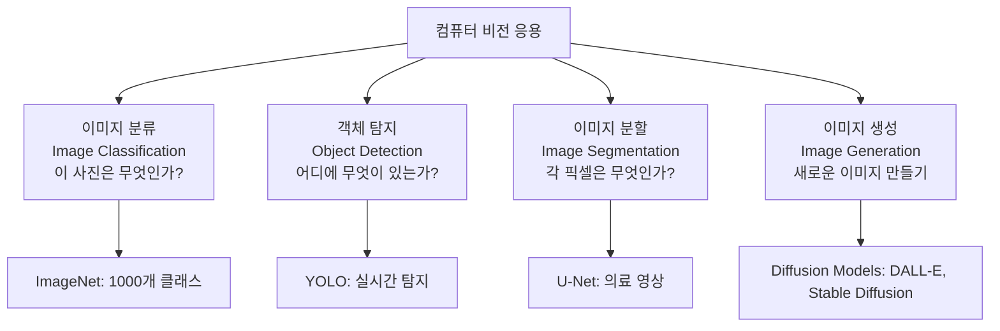
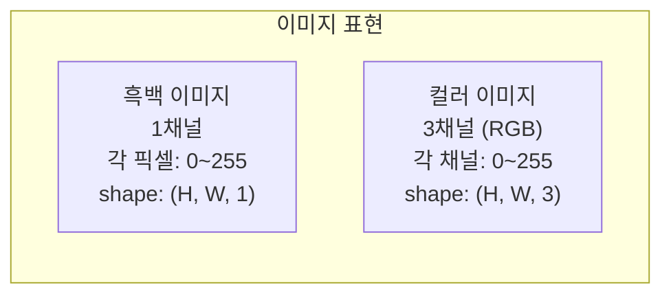
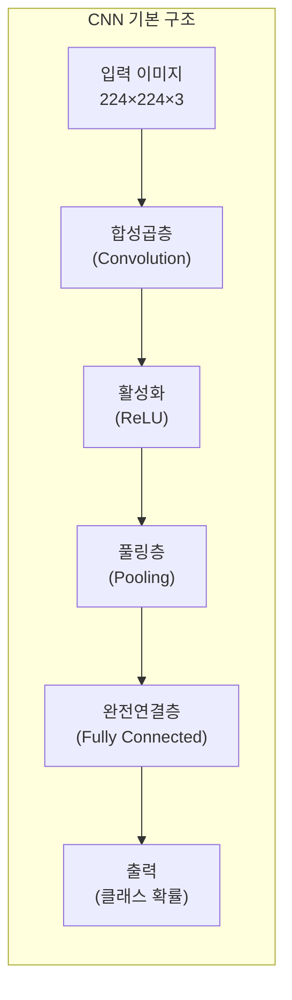
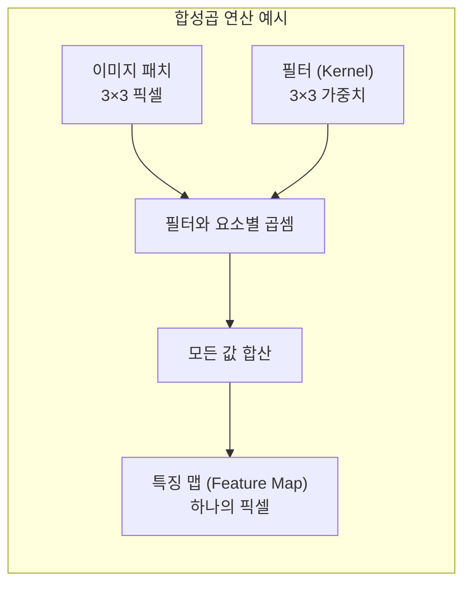
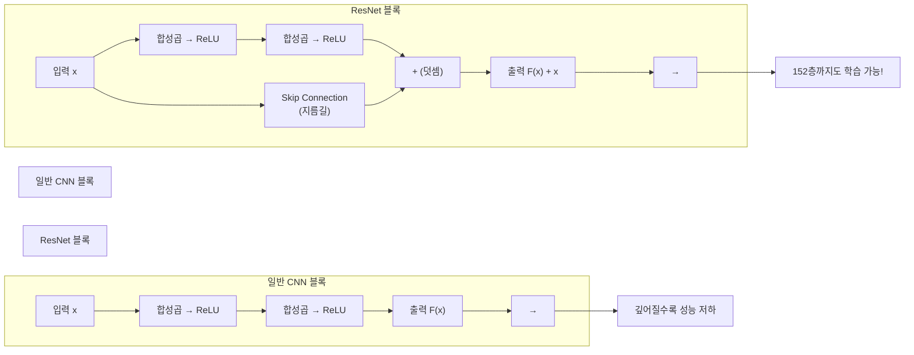
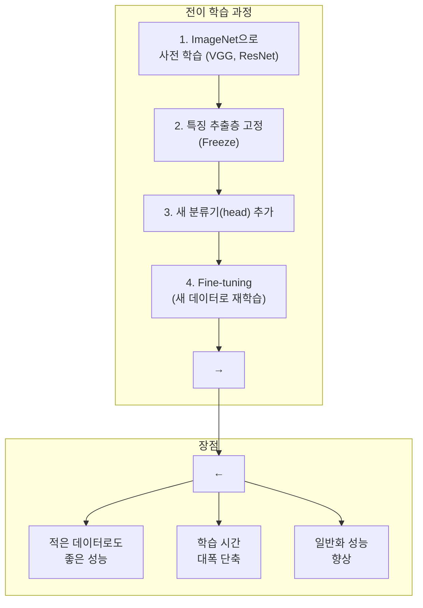

# 10장: 컴퓨터 비전 프로그래밍 (CNN)

> **🎯 학습 목표**
> - CNN의 핵심 구성 요소(합성곱, 풀링)를 이해합니다.
> - 주요 CNN 아키텍처(VGG, ResNet)의 특징을 설명할 수 있습니다.
> - 전이 학습(Transfer Learning)을 활용할 수 있습니다.
> - 이미지 분류와 객체 탐지의 기본 원리를 이해합니다.

---

## 👨‍💻 실전 프로젝트: ResNet으로 개와 고양이 분류하기

이번 실전 프로젝트에서는 지금까지 배운 CNN 이론과 전이 학습 기법을 실제로 적용하여 개와 고양이를 구분하는 이진 분류 모델을 구축합니다. 구체적으로는 ImageNet이라는 대규모 데이터셋으로 이미 사전 학습된 ResNet-18 모델을 torchvision 라이브러리를 통하여 불러온 후, 개와 고양이 이미지 데이터에 맞추어 분류기를 교체하고 미세 조정(Fine-tuning)을 수행합니다. 이 과정을 통하여 전이 학습이 실제 문제에서 어떻게 작동하는지 체험할 수 있으며, 적은 양의 데이터로도 높은 성능의 모델을 얻을 수 있다는 사실을 직접 확인할 수 있습니다.

### 프로젝트 개요

본 프로젝트의 목표는 총 25,000장의 개와 고양이 이미지(Kaggle Dogs vs Cats 데이터셋)를 활용하여 새로운 이미지가 개인지 고양이인지 자동으로 판별하는 분류기를 만드는 것입니다. 실무에서는 수십만 장의 이미지로 처음부터 모델을 학습시키는 것이 일반적이지만, 여기서는 전이 학습을 통하여 사전 학습된 ResNet-18 모델을 단 5에폭만 미세 조정하여 높은 성능의 분류기를 구축할 것입니다. 이를 위하여 데이터 전처리 및 증강부터 모델 로딩, 분류기 교체, 학습, 평가, 예측에 이르기까지의 전체 파이프라인을 단계적으로 구현합니다.

### 1단계: 데이터 준비 및 전처리

먼저 Kaggle의 "Dogs vs Cats" 데이터셋을 다운로드한 후, 다음과 같이 학습용(train)과 검증용(val) 디렉토리로 나누어 정리합니다. 각 클래스(개, 고양이)별로 서브디렉토리를 생성하고 해당 이미지를 배치하면, torchvision의 ImageFolder 클래스가 디렉토리 구조를 자동으로 인식하여 레이블을 할당합니다. 이는 실제 프로젝트에서 가장 널리 사용되는 데이터 로딩 방식입니다.

```
data/
  train/
    cat/    # 고양이 이미지 (약 10,000장)
    dog/    # 개 이미지 (약 10,000장)
  val/
    cat/    # 고양이 이미지 (약 2,500장)
    dog/    # 개 이미지 (약 2,500장)
```

데이터 증강(Data Augmentation)은 제한된 데이터로부터 모델의 일반화 성능을 극대화하는 중요한 기법입니다. 학습 데이터에는 무작위 수평 뒤집기(RandomHorizontalFlip)와 10도 범위의 무작위 회전(RandomRotation)을 적용하여 모델이 다양한 변형에 강건하도록 만듭니다. 또한 모든 이미지를 ResNet이 요구하는 224×224 크기로 통일한 후, ImageNet 데이터셋의 평균(mean=[0.485, 0.456, 0.406])과 표준편차(std=[0.229, 0.224, 0.225])를 사용하여 정규화합니다. 검증 데이터에는 증강 없이 리사이즈와 정규화만 적용하여 일관된 평가 기준을 유지합니다.

### 2단계: 사전 학습된 ResNet 불러오기 및 분류기 교체

torchvision.models에서 제공하는 resnet18(pretrained=True) 함수를 호출하면 ImageNet의 1,000개 클래스로 이미 학습이 완료된 ResNet-18 모델을 손쉽게 불러올 수 있습니다. 전이 학습의 첫 번째 단계로, 특징 추출을 담당하는 모든 합성곱 층의 파라미터를 requires_grad = False로 설정하여 학습되지 않도록 고정(Freeze)합니다. 이렇게 하면 ImageNet에서 학습된 일반적인 시각 특징(에지, 질감, 형태 등)을 그대로 보존하면서, 새로 추가되는 분류기만 우리의 데이터에 맞추어 학습할 수 있습니다. 마지막으로 원래의 1,000개 출력 뉴런을 가진 완전연결층(fc)을 256개의 은닉 뉴런과 드롭아웃을 포함하는 2층 분류기로 교체하여, 최종적으로 개와 고양이 두 클래스를 출력하도록 변경합니다.

### 3단계: 모델 학습 및 평가

교체된 분류기 부분만 Adam 옵티마이저로 학습하며, 손실 함수는 분류 문제의 표준인 크로스엔트로피 손실(CrossEntropyLoss)을 사용합니다. 각 에폭이 끝날 때마다 학습 데이터와 검증 데이터에 대한 정확도를 계산하여 모델의 성능을 모니터링합니다. 학습이 완료된 후에는 새로운 이미지에 대하여 예측을 수행할 수 있는 함수를 정의하여, 임의의 개 또는 고양이 이미지를 입력하면 해당 클래스와 신뢰도 점수를 반환받을 수 있습니다.

```python
import torch
import torch.nn as nn
import torch.optim as optim
from torch.utils.data import DataLoader
from torchvision import datasets, transforms, models
import matplotlib.pyplot as plt
import numpy as np
from PIL import Image

# 1. 데이터 전처리 및 증강
transform_train = transforms.Compose([
    transforms.Resize((224, 224)),
    transforms.RandomHorizontalFlip(),
    transforms.RandomRotation(10),
    transforms.ToTensor(),
    transforms.Normalize(mean=[0.485, 0.456, 0.406],
                         std=[0.229, 0.224, 0.225])
])

transform_val = transforms.Compose([
    transforms.Resize((224, 224)),
    transforms.ToTensor(),
    transforms.Normalize(mean=[0.485, 0.456, 0.406],
                         std=[0.229, 0.224, 0.225])
])

# 2. 데이터셋 및 데이터로더 생성
train_dataset = datasets.ImageFolder(root='data/train', transform=transform_train)
val_dataset = datasets.ImageFolder(root='data/val', transform=transform_val)

train_loader = DataLoader(train_dataset, batch_size=32, shuffle=True)
val_loader = DataLoader(val_dataset, batch_size=32, shuffle=False)

print(f"학습 이미지 수: {len(train_dataset)}")
print(f"검증 이미지 수: {len(val_dataset)}")
print(f"클래스: {train_dataset.classes}")

# 3. 사전 학습된 ResNet18 불러오기
device = torch.device('cuda' if torch.cuda.is_available() else 'cpu')
model = models.resnet18(pretrained=True)

# 특징 추출층 고정
for param in model.parameters():
    param.requires_grad = False

# 분류기 교체 (2클래스: 개, 고양이)
num_features = model.fc.in_features
model.fc = nn.Sequential(
    nn.Linear(num_features, 256),
    nn.ReLU(),
    nn.Dropout(0.3),
    nn.Linear(256, 2)
)
model = model.to(device)

print(f"\n사용 장치: {device}")
print(f"변경된 분류기:\n{model.fc}")

# 4. 손실 함수, 옵티마이저, 에폭 설정
criterion = nn.CrossEntropyLoss()
optimizer = optim.Adam(model.fc.parameters(), lr=0.001)
epochs = 5

# 5. 학습 루프
print("\n===== 학습 시작 =====")
for epoch in range(epochs):
    model.train()
    running_loss = 0.0
    correct = 0
    total = 0

    for images, labels in train_loader:
        images, labels = images.to(device), labels.to(device)

        optimizer.zero_grad()
        outputs = model(images)
        loss = criterion(outputs, labels)
        loss.backward()
        optimizer.step()

        running_loss += loss.item()
        _, predicted = torch.max(outputs, 1)
        total += labels.size(0)
        correct += (predicted == labels).sum().item()

    train_acc = 100 * correct / total

    # 검증
    model.eval()
    val_correct = 0
    val_total = 0
    with torch.no_grad():
        for images, labels in val_loader:
            images, labels = images.to(device), labels.to(device)
            outputs = model(images)
            _, predicted = torch.max(outputs, 1)
            val_total += labels.size(0)
            val_correct += (predicted == labels).sum().item()

    val_acc = 100 * val_correct / val_total
    print(f"Epoch {epoch+1}/{epochs}: Loss={running_loss/len(train_loader):.4f}, "
          f"Train Acc={train_acc:.2f}%, Val Acc={val_acc:.2f}%")

# 6. 예측 함수 정의
def predict_image(image_path, model, transform):
    model.eval()
    image = Image.open(image_path).convert('RGB')
    image_tensor = transform(image).unsqueeze(0).to(device)

    with torch.no_grad():
        output = model(image_tensor)
        prob = torch.softmax(output, dim=1)
        _, predicted = torch.max(output, 1)

    class_names = ['고양이', '개']
    confidence = prob[0][predicted].item()
    return class_names[predicted.item()], confidence

# 사용 예시
# result, conf = predict_image('test_cat.jpg', model, transform_val)
# print(f"예측 결과: {result} (신뢰도: {conf:.3f})")
```

### 프로젝트 요약

이번 프로젝트를 통하여 우리는 사전 학습된 ResNet-18 모델을 불과 5에폭만 미세 조정하여 개와 고양이를 높은 정확도로 분류할 수 있음을 확인하였습니다. 만약 처음부터 무작위 가중치로 CNN을 학습시켰다면 동일한 성능에 도달하기 위해 훨씬 더 많은 데이터와 학습 시간이 필요했을 것입니다. 이 프로젝트에서 사용한 전이 학습 기법은 컴퓨터 비전 문제를 해결할 때 가장 먼저 고려해야 할 방법론이며, 앞으로 배울 CNN의 세부 개념과 전이 학습의 이론적 배경을 이해하는 좋은 출발점이 될 것입니다.

---

## 10.1 컴퓨터 비전이란?

컴퓨터 비전(Computer Vision, CV)은 컴퓨터가 이미지와 비디오를 이해하고 해석하는 인공지능의 핵심 분야입니다. 인간의 시각 시스템은 사물을 인식하고 공간을 이해하는 데 놀라운 능력을 보유하고 있지만, 이를 컴퓨터로 구현하는 것은 매우 복잡한 문제입니다. 컴퓨터 비전의 궁극적인 목표는 인간의 시각 인지 능력을 모방하여 기계가 시각적 입력으로부터 의미 있는 정보를 추출하고 이를 바탕으로 지능적인 결정을 내릴 수 있도록 하는 것입니다. 최근 딥러닝의 발전과 함께 컴퓨터 비전은 자율 주행 자동차, 의료 영상 진단, 얼굴 인식, 증강 현실 등 다양한 산업 분야에서 혁신적인 변화를 주도하고 있습니다. 특히 합성곱 신경망(CNN)의 등장은 이미지 분류, 객체 탐지, 이미지 분할 등 컴퓨터 비전의 거의 모든 하위 분야에서 획기적인 성능 향상을 가져왔습니다.



컴퓨터 비전의 정의와 다양한 응용 분야를 살펴보았습니다. 컴퓨터 비전 모델이 이미지를 처리하려면 먼저 컴퓨터가 이미지를 어떤 형태의 데이터로 인식하는지 이해하는 것이 중요합니다. 이제 이미지가 컴퓨터 내부에서 어떻게 숫자 데이터로 표현되는지 자세히 알아보겠습니다.

---

## 10.2 이미지 데이터의 이해

컴퓨터에게 이미지는 단순한 픽셀 값의 2차원 또는 3차원 행렬에 불과합니다. 각 픽셀은 0부터 255 사이의 정수 값으로 표현되는데, 이 값은 해당 위치의 밝기(brightness) 또는 색상 강도를 나타냅니다. 흑백(그레이스케일) 이미지는 하나의 채널(Channel)만을 가지므로 각 픽셀이 단일 값으로 표현되지만, 컬러 이미지는 빨강(Red), 초록(Green), 파랑(Blue)의 세 가지 채널이 겹쳐져 각 픽셀이 세 개의 값(R, G, B)으로 표현됩니다. 따라서 컬러 이미지의 전체 shape은 (높이 H, 너비 W, 채널 C)의 3차원 텐서 형태가 됩니다. 이러한 이미지 데이터를 신경망에 입력하기 위해서는 적절한 전처리 과정이 필수적이며, 특히 평탄화(Flatten) 과정을 통하여 이미지 행렬을 1차원 벡터로 변환하는 작업이 필요합니다.



```python
import numpy as np
import matplotlib.pyplot as plt
from sklearn.datasets import load_digits

# 이미지 데이터 구조 이해
digits = load_digits()
print(f"이미지 데이터 shape: {digits.images.shape}")  # (1797, 8, 8)
print(f"첫 번째 이미지 (8×8):")
print(digits.images[0])

# 픽셀 값 확인
plt.imshow(digits.images[0], cmap='gray')
plt.title(f"레이블: {digits.target[0]}")
plt.colorbar()
plt.show()

# 이미지 전처리: 평탄화 (Flatten)
X_flat = digits.images.reshape(len(digits.images), -1)
print(f"평탄화 후 shape: {X_flat.shape}")  # (1797, 64)
```

이미지가 픽셀 값의 행렬로 표현된다는 사실을 확인하였습니다. 그렇다면 이러한 원시 픽셀 데이터로부터 의미 있는 패턴과 특징을 자동으로 추출할 수 있는 방법은 무엇일까요? 바로 이러한 문제를 해결하기 위하여 고안된 것이 합성곱 신경망(CNN)입니다.

---

## 10.3 CNN (Convolutional Neural Network)

일반적인 완전연결 신경망(Fully Connected Network)은 입력 데이터를 1차원 벡터로 평탄화하여 처리하므로 이미지의 공간적 구조, 즉 인접 픽셀 간의 위치 관계 정보가 모두 소실됩니다. 반면 합성곱 신경망(Convolutional Neural Network, CNN)은 이미지의 2차원 공간 구조를 그대로 유지하면서 학습을 수행하는 특화된 신경망 구조입니다. CNN의 핵심 아이디어는 작은 필터(커널)가 이미지 전체를 슬라이딩하면서 지역적인 특징을 추출하고, 여러 층을 거치면서 점차 고수준의 추상적인 특징을 학습할 수 있다는 데 있습니다. 이러한 특성 덕분에 CNN은 이미지 분류, 객체 탐지, 이미지 분할 등 거의 모든 컴퓨터 비전 작업에서 탁월한 성능을 보여주고 있습니다. CNN의 기본 구조는 합성곱층(Convolution Layer), 활성화 함수(ReLU), 풀링층(Pooling Layer), 그리고 마지막의 완전연결층(Fully Connected Layer)으로 구성됩니다.



### 10.3.1 합성곱 (Convolution) 연산

합성곱(Convolution) 연산은 CNN의 가장 핵심이 되는 연산으로, 작은 크기의 필터(Filter) 또는 커널(Kernel)이 입력 이미지를 좌에서 우로, 위에서 아래로 슬라이딩하면서 각 위치에서 요소별 곱셈과 합산을 수행합니다. 이 과정을 통하여 필터는 이미지의 특정 패턴이나 특징, 예를 들어 수직 에지, 수평 에지, 질감, 모서리 등을 감지하게 됩니다. 하나의 합성곱 층에는 일반적으로 여러 개의 필터가 존재하며, 각 필터는 서로 다른 특징을 학습합니다. 필터의 크기(kernel size), 이동 간격(stride), 그리고 이미지 가장자리 처리 방식(padding)은 모두 합성곱 연산의 중요한 하이퍼파라미터로서 출력 특징 맵(Feature Map)의 크기를 결정합니다. 합성곱 연산의 또 다른 중요한 장점은 가중치 공유(Weight Sharing)로서, 동일한 필터가 이미지 전체에 걸쳐 동일한 가중치로 적용되므로 파라미터 수가 대폭 감소하고 과대적합 위험이 줄어듭니다.

```python
import numpy as np
import matplotlib.pyplot as plt
from scipy import signal

# 간단한 이미지 (8×8)
image = np.array([
    [0, 0, 0, 0, 0, 0, 0, 0],
    [0, 1, 1, 1, 1, 1, 1, 0],
    [0, 1, 1, 1, 1, 1, 1, 0],
    [0, 1, 1, 1, 1, 1, 1, 0],
    [0, 1, 1, 1, 1, 1, 1, 0],
    [0, 1, 1, 1, 1, 1, 1, 0],
    [0, 1, 1, 1, 1, 1, 1, 0],
    [0, 0, 0, 0, 0, 0, 0, 0]
])

# 다양한 필터
sobel_x = np.array([[-1, 0, 1], [-2, 0, 2], [-1, 0, 1]])  # 수직 에지 검출
sobel_y = np.array([[-1, -2, -1], [0, 0, 0], [1, 2, 1]])  # 수평 에지 검출
blur = np.ones((3, 3)) / 9  # 블러 필터

# 합성곱 적용
edge_x = signal.convolve2d(image, sobel_x, mode='same')
edge_y = signal.convolve2d(image, sobel_y, mode='same')
blurred = signal.convolve2d(image, blur, mode='same')

fig, axes = plt.subplots(1, 4, figsize=(15, 4))
axes[0].imshow(image, cmap='gray')
axes[0].set_title('원본')
axes[1].imshow(edge_x, cmap='gray')
axes[1].set_title('수직 에지')
axes[2].imshow(edge_y, cmap='gray')
axes[2].set_title('수평 에지')
axes[3].imshow(blurred, cmap='gray')
axes[3].set_title('블러')
plt.show()
```



### 10.3.2 풀링 (Pooling)

풀링(Pooling)은 합성곱 층에서 추출된 특징 맵(Feature Map)의 공간적 크기를 줄이는 다운샘플링(Downsampling) 연산입니다. 풀링의 주요 목적은 첫째, 계산 효율성을 높이기 위하여 특징 맵의 차원을 축소하고, 둘째, 작은 위치 변화에 강건한(translation-invariant) 특징을 추출하는 데 있습니다. 가장 널리 사용되는 Max Pooling은 각 패치(window) 내에서 최댓값만을 선택하여 가장 강하게 활성화된 특징만을 다음 층으로 전달합니다. 반면 Average Pooling은 패치 내 모든 값의 평균을 사용하여 전체적인 정보를 보존하는 특성이 있습니다. 일반적으로 합성곱 신경망에서는 Max Pooling이 더 자주 사용되는데, 이는 에지나 질감과 같은 뚜렷한 특징을 보존하는 데 더 효과적이기 때문입니다.

```python
import numpy as np

feature_map = np.array([
    [1, 3, 2, 4],
    [5, 6, 7, 8],
    [9, 10, 11, 12],
    [13, 14, 15, 16]
])

# Max Pooling (2×2)
def max_pooling(feature_map, pool_size=2, stride=2):
    h, w = feature_map.shape
    out_h, out_w = h // pool_size, w // pool_size
    pooled = np.zeros((out_h, out_w))

    for i in range(out_h):
        for j in range(out_w):
            patch = feature_map[i*stride:i*stride+pool_size,
                               j*stride:j*stride+pool_size]
            pooled[i, j] = np.max(patch)

    return pooled

pooled = max_pooling(feature_map)
print(f"원본 크기: {feature_map.shape}")
print(f"풀링 후 크기: {pooled.shape}")
print(f"Max Pooling 결과:\n{pooled}")
```

### 10.3.3 전체 CNN 구현

지금까지 합성곱과 풀링의 개별 개념을 살펴보았습니다. 이제 이 두 구성 요소를 결합하여 하나의 완전한 CNN 모델을 PyTorch로 직접 구현해 보겠습니다. 아래 코드는 입력 이미지에서 합성곱과 풀링을 반복 적용하여 특징을 추출한 후, 완전연결층을 통하여 최종 클래스를 예측하는 간단한 CNN의 전체 구조를 보여줍니다. 이 모델은 8×8 크기의 입력 이미지를 받아 10개의 클래스 중 하나로 분류하며, 각 층의 출력 크기를 주석으로 표시하여 데이터의 흐름을 쉽게 추적할 수 있도록 하였습니다.

```python
import torch
import torch.nn as nn
import torch.nn.functional as F

class SimpleCNN(nn.Module):
    def __init__(self, num_classes=10):
        super().__init__()
        self.conv1 = nn.Conv2d(1, 32, kernel_size=3, padding=1)  # 1채널 → 32채널
        self.conv2 = nn.Conv2d(32, 64, kernel_size=3, padding=1) # 32채널 → 64채널
        self.pool = nn.MaxPool2d(2, 2)  # 2×2 풀링

        # CNN 출력 크기 계산 (8×8 입력 기준)
        # conv1 → 8×8, pool → 4×4
        # conv2 → 4×4, pool → 2×2
        # FC 입력: 64 * 2 * 2 = 256
        self.fc1 = nn.Linear(64 * 2 * 2, 128)
        self.fc2 = nn.Linear(128, num_classes)

    def forward(self, x):
        x = self.pool(F.relu(self.conv1(x)))  # Conv1 + ReLU + Pool
        x = self.pool(F.relu(self.conv2(x)))  # Conv2 + ReLU + Pool
        x = x.view(x.size(0), -1)  # Flatten
        x = F.relu(self.fc1(x))
        x = self.fc2(x)
        return x

model = SimpleCNN()
print(model)

# 가상 입력으로 테스트
fake_input = torch.randn(1, 1, 8, 8)  # 배치=1, 채널=1, H=8, W=8
output = model(fake_input)
print(f"\n입력 shape: {fake_input.shape}")
print(f"출력 shape: {output.shape}")  # (1, 10)
```

지금까지 CNN의 기본 구성 요소인 합성곱 연산과 풀링, 그리고 간단한 CNN 모델을 직접 구현해 보았습니다. 이러한 기본 아이디어를 바탕으로 수많은 연구자들이 더욱 깊고 강력한 CNN 아키텍처를 개발하기 위하여 노력해 왔습니다. 이제 컴퓨터 비전 역사에 중요한 이정표를 남긴 대표적인 CNN 아키텍처들을 시대순으로 살펴보겠습니다.

---

## 10.4 주요 CNN 아키텍처

CNN의 기본 개념이 확립된 이후, 수많은 연구자들이 더욱 깊고 강력한 CNN 아키텍처를 개발하기 위하여 노력해 왔습니다. 각 아키텍처는 당대의 기술적 한계를 극복하고 성능을 혁신적으로 향상시켰으며, 그 아이디어는 이후의 모든 컴퓨터 비전 연구에 큰 영향을 미쳤습니다. 여기서는 컴퓨터 비전 역사에 중요한 이정표를 남긴 주요 CNN 아키텍처들을 시대순으로 살펴보겠습니다. 각 아키텍처의 핵심 아이디어와 구조적 특징을 이해하는 것은 현대 컴퓨터 비전의 발전 흐름을 파악하는 데 큰 도움이 될 것입니다.

### 10.4.1 LeNet-5 (1998)

LeNet-5는 Yann LeCun에 의하여 1998년에 발표된 최초의 성공적인 CNN 아키텍처입니다. 이 모델은 우편 번호와 수표의 손글씨 숫자를 인식하기 위하여 개발되었으며, 당시 은행 시스템에서 실제로 활용될 정도로 뛰어난 성능을 입증하였습니다. LeNet-5는 합성곱층, 풀링층, 완전연결층을 차례로 쌓는 기본적인 CNN 구조를 확립하였으며, 이러한 설계 원칙은 현재까지도 CNN 아키텍처의 근간을 이루고 있습니다. 비록 오늘날의 기준으로는 매우 얕은 네트워크이지만, LeNet-5는 합성곱 신경망이 실제 문제에 적용될 수 있음을 최초로 증명한 역사적인 모델입니다.

### 10.4.2 AlexNet (2012)

AlexNet은 2012년 ImageNet 대규모 시각 인식 대회(ILSVRC)에서 Alex Krizhevsky, Ilya Sutskever, Geoffrey Hinton에 의하여 제안된 모델로, 딥러닝 혁명의 시작을 알린 기념비적인 아키텍처입니다. AlexNet은 기존의 전통적인 컴퓨터 비전 방법론을 크게 앞지르는 성능으로 ImageNet 대회에서 우승하였으며, 이는 딥러닝이 컴퓨터 비전 분야를 완전히 지배하게 되는 계기가 되었습니다. AlexNet은 LeNet-5보다 훨씬 더 깊고 큰 네트워크로, 약 6,000만 개의 파라미터를 가지고 있습니다. 또한 ReLU 활성화 함수의 도입으로 기울기 소실 문제를 완화하고 학습 속도를 크게 향상시켰으며, 드롭아웃(Dropout)과 데이터 증강(Data Augmentation) 기법을 적용하여 과대적합을 효과적으로 방지하였습니다.

### 10.4.3 VGG (2014)

VGG(Visual Geometry Group)는 2014년 옥스포드 대학의 연구팀이 제안한 아키텍처로, 그 이름을 딴 연구 그룹의 명칭에서 유래하였습니다. VGG의 가장 큰 특징은 모든 합성곱 층에서 3×3 크기의 작은 필터만을 일관되게 사용한다는 점입니다. 3×3 필터 두 개를 연속으로 쌓으면 5×5 필터 하나와 동일한 수용 영역(Receptive Field)을 가지면서도 더 적은 파라미터로 더 많은 비선형성을 확보할 수 있습니다. VGG는 이러한 단순한 설계 원칙으로도 네트워크를 깊게 쌓는 것만으로 성능이 향상될 수 있음을 보여주었습니다. 하지만 VGG는 약 1억 3,800만 개에 달하는 매우 많은 파라미터를 가지고 있어 학습 시간이 오래 걸리고 메모리 사용량이 크다는 단점이 있었습니다.

```python
# VGG 스타일 블록
def conv_block(in_channels, out_channels):
    return nn.Sequential(
        nn.Conv2d(in_channels, out_channels, kernel_size=3, padding=1),
        nn.ReLU(),
        nn.Conv2d(out_channels, out_channels, kernel_size=3, padding=1),
        nn.ReLU(),
        nn.MaxPool2d(2)
    )

class MiniVGG(nn.Module):
    def __init__(self, num_classes=10):
        super().__init__()
        self.features = nn.Sequential(
            conv_block(1, 32),    # 32채널
            conv_block(32, 64),   # 64채널
            conv_block(64, 128),  # 128채널
        )
        self.classifier = nn.Sequential(
            nn.Flatten(),
            nn.Linear(128, 256),
            nn.ReLU(),
            nn.Dropout(0.5),
            nn.Linear(256, num_classes)
        )

    def forward(self, x):
        x = self.features(x)
        x = self.classifier(x)
        return x
```

### 10.4.4 ResNet (2015)

ResNet(Residual Network)은 2015년 Microsoft Research의 Kaiming He 등에 의하여 제안된 아키텍처로, ILSVRC 2015에서 우승하며 딥러닝 커뮤니티에 큰 반향을 일으켰습니다. ResNet 이전까지는 단순히 층을 깊게 쌓을수록 오히려 성능이 저하되는 열화(Degradation) 문제가 발생하였는데, 이는 기울기 소실(Vanishing Gradient)과 학습의 어려움 때문이었습니다. ResNet은 이러한 문제를 해결하기 위하여 잔차 학습(Residual Learning)이라는 혁신적인 아이디어를 도입하였습니다. 구체적으로, 입력 x를 몇 개의 층을 건너뛰어 출력에 직접 더해주는 Skip Connection(또는 Shortcut Connection)을 추가함으로써 그래디언트가 직접 역전파될 수 있는 경로를 제공합니다. 이를 통하여 ResNet은 무려 152층까지도 성공적으로 학습할 수 있었으며, 이는 당시 기준으로 엄청난 깊이였습니다. Skip Connection의 아이디어는 이후 Transformer, DenseNet 등 거의 모든 최신 딥러닝 아키텍처에 영향을 미친 가장 영향력 있는 개념 중 하나입니다.



```python
# ResNet 기본 블록
class ResidualBlock(nn.Module):
    def __init__(self, in_channels, out_channels, stride=1):
        super().__init__()
        self.conv1 = nn.Conv2d(in_channels, out_channels, 3, stride, padding=1)
        self.bn1 = nn.BatchNorm2d(out_channels)
        self.conv2 = nn.Conv2d(out_channels, out_channels, 3, padding=1)
        self.bn2 = nn.BatchNorm2d(out_channels)

        # 차원 맞춤
        self.shortcut = nn.Sequential()
        if stride != 1 or in_channels != out_channels:
            self.shortcut = nn.Sequential(
                nn.Conv2d(in_channels, out_channels, 1, stride),
                nn.BatchNorm2d(out_channels)
            )

    def forward(self, x):
        residual = self.shortcut(x)
        x = F.relu(self.bn1(self.conv1(x)))
        x = self.bn2(self.conv2(x))
        x += residual  # Skip Connection
        x = F.relu(x)
        return x
```

지금까지 LeNet-5부터 ResNet까지 CNN 아키텍처의 발전 과정을 살펴보았습니다. 그런데 이러한 깊은 CNN 모델을 처음부터 끝까지 직접 학습하려면 방대한 양의 데이터와 막대한 컴퓨팅 자원이 필요합니다. 이러한 현실적 어려움을 해결하면서도 높은 성능을 얻을 수 있는 강력한 기법이 바로 전이 학습입니다.

---

## 10.5 전이 학습 (Transfer Learning)

전이 학습(Transfer Learning)은 대규모 데이터셋(예: ImageNet)으로 이미 학습이 완료된 모델을 가져와서 자신이 풀고자 하는 새로운 문제에 맞게 조정하는 효율적인 학습 방법론입니다. 이 방법이 효과적인 이유는 초기 층에서 학습된 에지, 질감, 형태와 같은 저수준 특징이 대부분의 이미지 처리 작업에서 공통적으로 유용하게 사용되기 때문입니다. 전이 학습의 대표적인 두 가지 전략으로는 특징 추출(Feature Extraction)과 미세 조정(Fine-tuning)이 있습니다. 특징 추출은 사전 학습된 모델의 합성곱 층을 고정(Freeze)하고 새로운 분류기만 학습하는 방식이며, 미세 조정은 전체 모델을 새로운 데이터로 추가 학습시키는 방식입니다. 전이 학습의 가장 큰 장점은 적은 데이터로도 높은 성능을 달성할 수 있고, 학습 시간이 대폭 단축되며, 과대적합의 위험이 감소한다는 점입니다.



```python
import torchvision.models as models
import torch.nn as nn
import torch.optim as optim

# 1. 사전 학습된 ResNet 불러오기
resnet = models.resnet18(pretrained=True)
print(f"원본 분류기: {resnet.fc}")

# 2. 특징 추출층 고정
for param in resnet.parameters():
    param.requires_grad = False

# 3. 새 분류기 (Head) 교체
num_features = resnet.fc.in_features  # 512
resnet.fc = nn.Sequential(
    nn.Linear(num_features, 256),
    nn.ReLU(),
    nn.Dropout(0.3),
    nn.Linear(256, 2)  # 개/고양이 이진 분류
)

print(f"\n새 분류기: {resnet.fc}")

# 4. Fine-tuning (분류기만 학습)
optimizer = optim.Adam(resnet.fc.parameters(), lr=0.001)
criterion = nn.CrossEntropyLoss()

# 실제 사용 예:
# for images, labels in dataloader:
#     outputs = resnet(images)
#     loss = criterion(outputs, labels)
#     loss.backward()
#     optimizer.step()
```

전이 학습의 개념과 장점을 이해하였습니다. 이제 지금까지 배운 모든 내용을 종합하여 하나의 완전한 이미지 분류 파이프라인을 코드로 구현해 보겠습니다. 데이터 로딩부터 모델 학습, 평가까지의 전 과정을 하나의 흐름으로 연결하여 실제 프로젝트에서 어떻게 적용되는지 확인할 것입니다.

---

## 10.6 이미지 분류 전체 파이프라인

지금까지 CNN의 구성 요소와 주요 아키텍처, 그리고 전이 학습까지 폭넓게 학습하였습니다. 이제 이러한 개념을 바탕으로 CIFAR-10 데이터셋을 사용한 이미지 분류 전체 파이프라인을 처음부터 끝까지 완성해 보겠습니다. CIFAR-10은 32×32 크기의 작은 컬러 이미지 60,000장으로 구성된 데이터셋으로, 비행기, 자동차, 새, 고양이 등 10개의 클래스로 이루어져 있습니다. 아래 코드는 데이터 로딩과 전처리, CNN 모델 정의, 학습 루프, 평가까지의 전체 과정을 하나의 스크립트로 보여줍니다. 이 코드를 실행하면 합성곱 신경망이 어떻게 실제 이미지 데이터를 학습하고 분류하는지 전체적인 흐름을 파악할 수 있습니다.

```python
import torch
import torch.nn as nn
import torch.optim as optim
import torchvision
import torchvision.transforms as transforms
from torch.utils.data import DataLoader

# 1. 데이터 전처리 (Transform)
transform = transforms.Compose([
    transforms.ToTensor(),
    transforms.Normalize((0.5,), (0.5,))  # [-1, 1]로 정규화
])

# 2. CIFAR-10 데이터 로드
trainset = torchvision.datasets.CIFAR10(
    root='./data', train=True, download=True, transform=transform
)
testset = torchvision.datasets.CIFAR10(
    root='./data', train=False, download=True, transform=transform
)

train_loader = DataLoader(trainset, batch_size=64, shuffle=True)
test_loader = DataLoader(testset, batch_size=64, shuffle=False)

# 3. CNN 모델 정의
class CIFAR10_CNN(nn.Module):
    def __init__(self):
        super().__init__()
        self.conv1 = nn.Conv2d(3, 32, 3, padding=1)
        self.conv2 = nn.Conv2d(32, 64, 3, padding=1)
        self.conv3 = nn.Conv2d(64, 128, 3, padding=1)
        self.pool = nn.MaxPool2d(2, 2)
        self.fc1 = nn.Linear(128 * 4 * 4, 256)
        self.fc2 = nn.Linear(256, 10)
        self.dropout = nn.Dropout(0.3)

    def forward(self, x):
        x = self.pool(F.relu(self.conv1(x)))  # 32×16×16
        x = self.pool(F.relu(self.conv2(x)))  # 64×8×8
        x = self.pool(F.relu(self.conv3(x)))  # 128×4×4
        x = x.view(x.size(0), -1)
        x = F.relu(self.fc1(x))
        x = self.dropout(x)
        x = self.fc2(x)
        return x

model = CIFAR10_CNN()
criterion = nn.CrossEntropyLoss()
optimizer = optim.Adam(model.parameters(), lr=0.001)

# 4. 학습
epochs = 10
for epoch in range(epochs):
    model.train()
    running_loss = 0.0

    for images, labels in train_loader:
        optimizer.zero_grad()
        outputs = model(images)
        loss = criterion(outputs, labels)
        loss.backward()
        optimizer.step()
        running_loss += loss.item()

    # 평가
    model.eval()
    correct = 0
    total = 0
    with torch.no_grad():
        for images, labels in test_loader:
            outputs = model(images)
            _, predicted = torch.max(outputs, 1)
            total += labels.size(0)
            correct += (predicted == labels).sum().item()

    accuracy = 100 * correct / total
    print(f"Epoch {epoch+1}/{epochs}: Loss={running_loss/len(train_loader):.4f}, Accuracy={accuracy:.2f}%")

# 5. 클래스별 성능 확인
classes = ('비행기', '자동차', '새', '고양이', '사슴',
           '개', '개구리', '말', '배', '트럭')
print(f"\n클래스: {classes}")
```

지금까지는 이미지 전체를 하나의 클래스로 분류하는 이미지 분류에 초점을 맞추었습니다. 하지만 실제 응용에서는 한 장의 이미지 안에 여러 객체가 공존하고 각 객체의 위치까지 파악해야 하는 경우가 빈번합니다. 이러한 한계를 극복하고 더 풍부한 정보를 제공하는 것이 바로 객체 탐지입니다.

---

## 10.7 객체 탐지 (Object Detection) 개요

지금까지 다룬 이미지 분류(Image Classification)는 이미지 전체를 하나의 클래스로 할당하는 작업입니다. 그러나 실제 세계의 이미지에는 여러 객체가 함께 존재하는 경우가 대부분이며, 객체의 종류뿐만 아니라 이미지 내에서의 위치 정보까지 파악해야 하는 경우가 많습니다. 객체 탐지(Object Detection)는 이러한 요구를 충족시키는 컴퓨터 비전 작업으로, 이미지 내에 존재하는 모든 객체에 대하여 바운딩 박스(Bounding Box)의 좌표와 해당 객체의 클래스 레이블을 동시에 예측합니다. 객체 탐지 모델은 크게 2단계 검출기(Two-stage Detector, 예: Faster R-CNN)와 1단계 검출기(One-stage Detector, 예: YOLO, SSD)로 분류됩니다. 2단계 검출기는 먼저 객체가 있을 법한 영역을 제안(Region Proposal)한 후 해당 영역을 분류하는 방식으로 정확도가 높지만 속도가 느린 반면, 1단계 검출기는 한 번의 네트워크 통과로 모든 객체를 동시에 탐지하여 속도가 매우 빠르다는 장점이 있습니다.

```mermaid
flowchart LR
  OD_O["→"]
  YOLO_I["←"]

  subgraph OD[객체 탐지]
    Input_OD["입력 이미지"] --> Model_OD["객체 탐지 모델<br/>(YOLO, Faster R-CNN)"]
    Model_OD --> Output_OD["출력<br/>각 객체의:<br/>- 바운딩 박스 (x, y, w, h)<br/>- 클래스 레이블<br/>- 신뢰도 점수"]
    Output_OD --> OD_O
  end

  subgraph YOLO[YOLO (You Only Look Once)]
    YOLO_I --> YOLO_Step["한 번에 모든 객체 탐지<br/>속도가 매우 빠름<br/>실시간 탐지에 최적"]
  end

  OD_O --> YOLO_I
```

```python
# YOLOv8 사용 예 (ultralytics 라이브러리)
# pip install ultralytics
"""
from ultralytics import YOLO

# 모델 로드
model = YOLO('yolov8n.pt')  # nano 버전 (가장 가벼움)

# 이미지에서 객체 탐지
results = model('image.jpg')

# 결과 출력
for r in results:
    for box in r.boxes:
        x1, y1, x2, y2 = box.xyxy[0].tolist()
        conf = box.conf[0].item()
        cls = int(box.cls[0].item())
        print(f"클래스: {cls}, 신뢰도: {conf:.3f}, 위치: ({x1:.0f}, {y1:.0f}, {x2:.0f}, {y2:.0f})")

# 실시간 웹캠 탐지
# results = model(0)  # 0 = 첫 번째 카메라
# results.show()
"""
```

이미지 분류에서 객체 탐지까지 컴퓨터 비전의 핵심 작업들을 살펴보았습니다. 지금까지 배운 주요 개념들을 한눈에 정리하는 표를 통하여 내용을 최종 복습하도록 하겠습니다.

---

## 📋 한눈에 정리

| 개념 | 설명 | 핵심 키워드 |
|------|------|-----------|
| **합성곱 (Convolution)** | 필터로 이미지 특징 추출 | 커널, 특징 맵, 스트라이드 |
| **풀링 (Pooling)** | 특징 맵 크기 축소 | Max Pooling, Average Pooling |
| **VGG** | 3×3 Conv 반복, 단순 구조 | 16~19층 |
| **ResNet** | Skip Connection으로 깊은 네트워크 | 잔차 학습, 152층 |
| **전이 학습** | 사전 학습 모델 활용 | Fine-tuning, Feature Extraction |
| **YOLO** | 실시간 객체 탐지 | 한 번에 탐지 |

---

## ✏️ 연습 문제

1. **합성곱 연산**의 과정을 설명하고, 5×5 이미지에 3×3 필터(stride=1, padding=0)를 적용했을 때 출력 특징 맵의 크기는?

2. **Max Pooling과 Average Pooling**의 차이는 무엇인가요?

3. **ResNet의 Skip Connection**이 왜 중요한가요? 깊은 네트워크에서 발생하는 문제를 어떻게 해결하나요?

4. torchvision의 `models.resnet18(pretrained=True)`를 불러오고, 마지막 분류기를 10개 클래스로 교체하는 코드를 작성하세요.

5. **전이 학습**을 사용할 때 특징 추출층을 고정(Freeze)하는 이유는 무엇인가요? 언제 Fine-tuning을 전체 모델로 확장해야 하나요?

---

## 📝 연습 문제 정답

<details>
<summary>정답 보기</summary>

**1. 합성곱 연산과 출력 크기**
합성곱은 필터(커널)가 입력 이미지를 슬라이딩하며 요소별 곱셈 후 합산하는 연산입니다.
- 출력 크기 = (입력 크기 - 필터 크기 + 2×패딩) / 스트라이드 + 1
- (5 - 3 + 2×0) / 1 + 1 = **3×3**

**2. Max Pooling vs Average Pooling**
- **Max Pooling:** 각 패치에서 최대값만 선택 → 가장 강한 특징만 유지, 에지/텍스처 검출에 효과적
- **Average Pooling:** 각 패치의 평균값을 사용 → 전체적인 정보 유지, 부드러운 특징
- 일반적으로 Max Pooling이 CNN에서 더 많이 사용됩니다.

**3. Skip Connection의 중요성**
깊은 네트워크에서는 기울기 소실(Gradient Vanishing)로 인해 학습이 어려워집니다. Skip Connection은 입력을 몇 개 층을 건너뛰어 출력에 더함으로써:
- 그래디언트가 직접 역전파될 수 있는 지름길을 제공
- 152층 이상의 매우 깊은 네트워크 학습 가능
- 기울기 소실 문제 해결

**4. ResNet 분류기 교체**
```python
import torchvision.models as models
import torch.nn as nn

resnet = models.resnet18(pretrained=True)
for param in resnet.parameters():
    param.requires_grad = False
resnet.fc = nn.Linear(resnet.fc.in_features, 10)
print(resnet)
```

**5. 특징 추출층 고정 이유**
- 적은 데이터로도 과대적합 없이 학습 가능
- ImageNet에서 학습한 일반적인 특징(에지, 질감)은 대부분의 이미지 작업에 공통으로 유용
- 학습 시간과 메모리를 크게 절약
- **언제 전체 Fine-tuning:** (1) 새로운 데이터가 많을 때 (2) 내 데이터가 ImageNet과 매우 다를 때 (3) 의료 영상처럼 특수한 도메인일 때

</details>

---

> **🔄 다음 장에서는** 자연어 처리(NLP)를 배웁니다. 텍스트 전처리, 임베딩, RNN/LSTM, 그리고 혁명적인 Transformer 아키텍처와 BERT까지 다룹니다.
