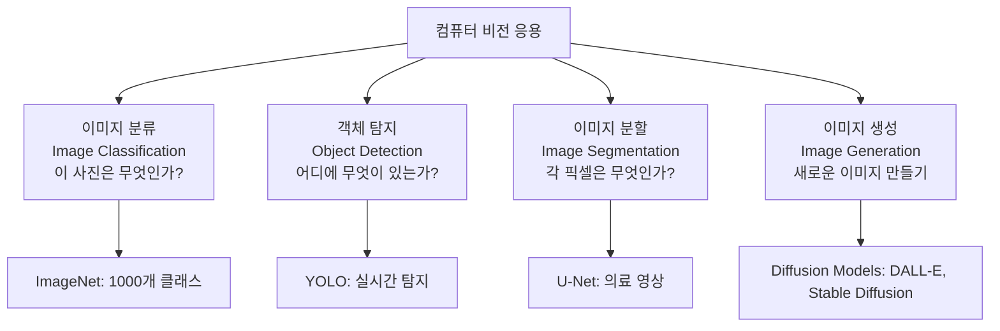
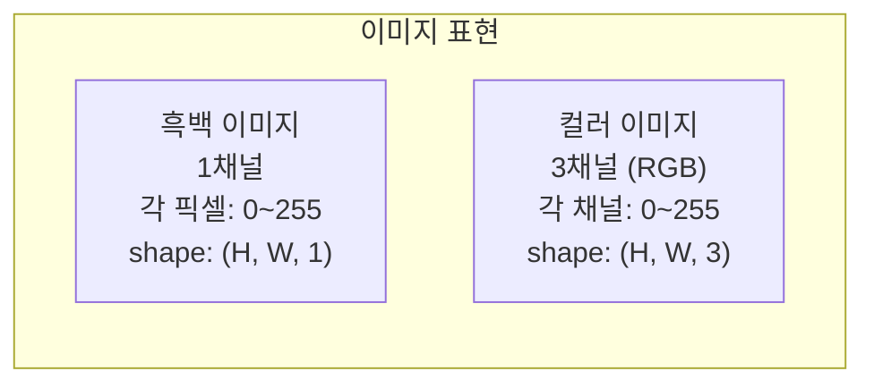
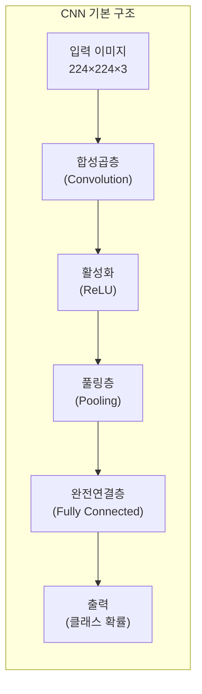
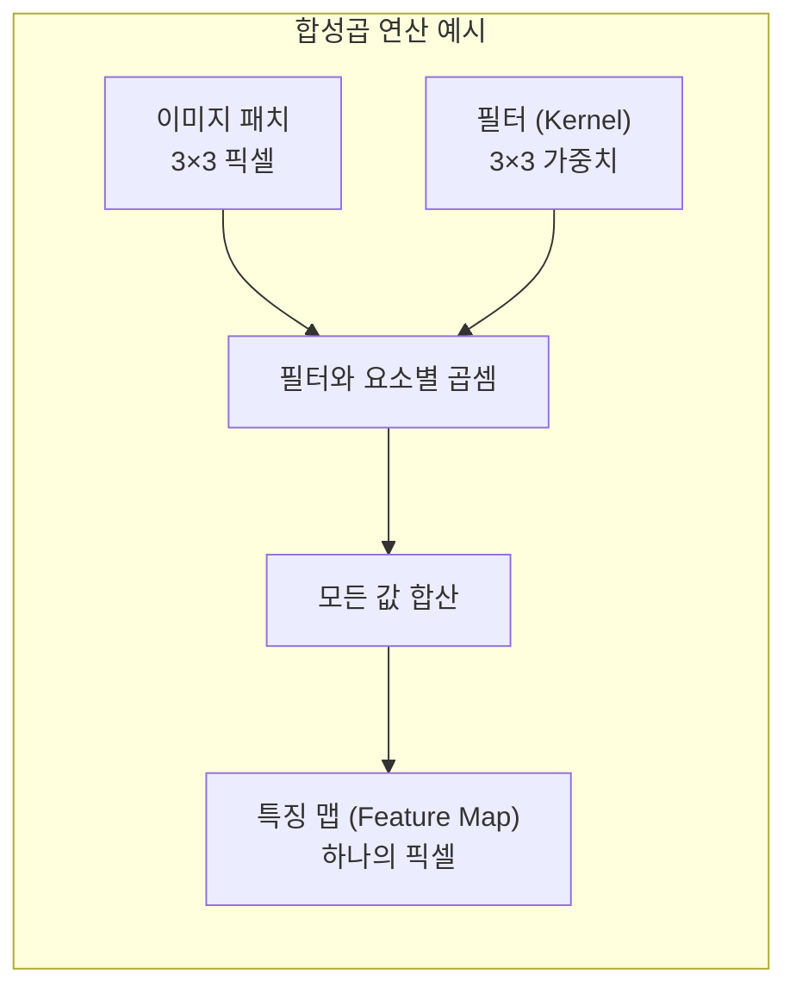
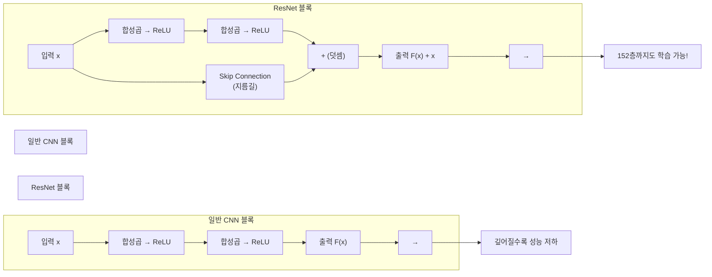
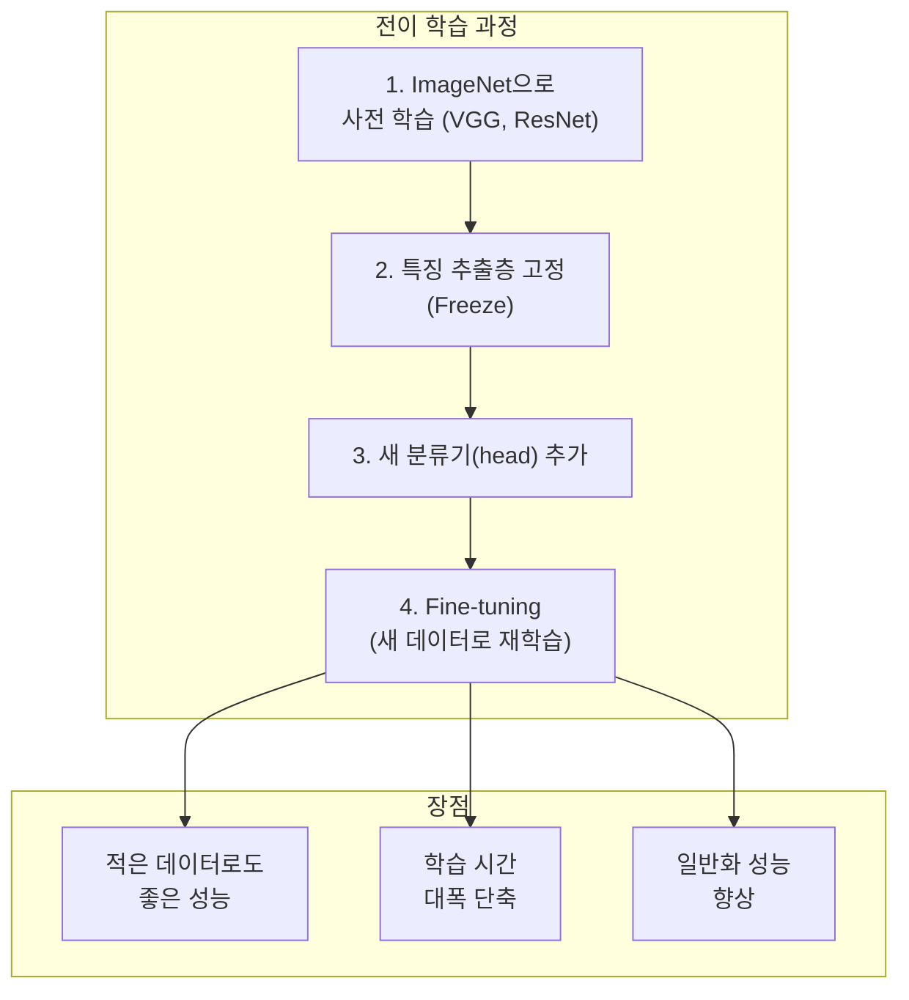

# 10장: 컴퓨터 비전 (Computer Vision)

> **🎯 학습 목표**
> - CNN의 핵심 구성 요소(합성곱, 풀링)를 이해합니다.
> - 주요 CNN 아키텍처(VGG, ResNet)의 특징을 설명할 수 있습니다.
> - 전이 학습(Transfer Learning)을 활용할 수 있습니다.
> - 이미지 분류와 객체 탐지의 기본 원리를 이해합니다.

---

## 10.1 컴퓨터 비전이란?

**컴퓨터 비전(Computer Vision, CV)** 은 컴퓨터가 이미지와 비디오를 이해하고 해석하는 AI 분야입니다.



---

## 10.2 이미지 데이터의 이해

컴퓨터에게 이미지는 **픽셀 값의 행렬**입니다.



```python
import numpy as np
import matplotlib.pyplot as plt
from sklearn.datasets import load_digits

# 이미지 데이터 구조 이해
digits = load_digits()
print(f"이미지 데이터 shape: {digits.images.shape}")  # (1797, 8, 8)
print(f"첫 번째 이미지 (8×8):")
print(digits.images[0])

# 픽셀 값 확인
plt.imshow(digits.images[0], cmap='gray')
plt.title(f"레이블: {digits.target[0]}")
plt.colorbar()
plt.show()

# 이미지 전처리: 평탄화 (Flatten)
X_flat = digits.images.reshape(len(digits.images), -1)
print(f"평탄화 후 shape: {X_flat.shape}")  # (1797, 64)
```

---

## 10.3 CNN (Convolutional Neural Network)

CNN은 **이미지의 공간적 구조(인접 픽셀 간의 관계)** 를 보존하면서 학습하는 신경망입니다.



### 10.3.1 합성곱 (Convolution) 연산

합성곱은 **필터(커널)가 이미지를 슬라이딩하며 특징을 추출**하는 연산입니다.

```python
import numpy as np
import matplotlib.pyplot as plt
from scipy import signal

# 간단한 이미지 (8×8)
image = np.array([
    [0, 0, 0, 0, 0, 0, 0, 0],
    [0, 1, 1, 1, 1, 1, 1, 0],
    [0, 1, 1, 1, 1, 1, 1, 0],
    [0, 1, 1, 1, 1, 1, 1, 0],
    [0, 1, 1, 1, 1, 1, 1, 0],
    [0, 1, 1, 1, 1, 1, 1, 0],
    [0, 1, 1, 1, 1, 1, 1, 0],
    [0, 0, 0, 0, 0, 0, 0, 0]
])

# 다양한 필터
sobel_x = np.array([[-1, 0, 1], [-2, 0, 2], [-1, 0, 1]])  # 수직 에지 검출
sobel_y = np.array([[-1, -2, -1], [0, 0, 0], [1, 2, 1]])  # 수평 에지 검출
blur = np.ones((3, 3)) / 9  # 블러 필터

# 합성곱 적용
edge_x = signal.convolve2d(image, sobel_x, mode='same')
edge_y = signal.convolve2d(image, sobel_y, mode='same')
blurred = signal.convolve2d(image, blur, mode='same')

fig, axes = plt.subplots(1, 4, figsize=(15, 4))
axes[0].imshow(image, cmap='gray')
axes[0].set_title('원본')
axes[1].imshow(edge_x, cmap='gray')
axes[1].set_title('수직 에지')
axes[2].imshow(edge_y, cmap='gray')
axes[2].set_title('수평 에지')
axes[3].imshow(blurred, cmap='gray')
axes[3].set_title('블러')
plt.show()
```



### 10.3.2 풀링 (Pooling)

풀링은 **특징 맵의 크기를 줄이면서 중요한 정보를 유지**하는 다운샘플링입니다.

```python
import numpy as np

feature_map = np.array([
    [1, 3, 2, 4],
    [5, 6, 7, 8],
    [9, 10, 11, 12],
    [13, 14, 15, 16]
])

# Max Pooling (2×2)
def max_pooling(feature_map, pool_size=2, stride=2):
    h, w = feature_map.shape
    out_h, out_w = h // pool_size, w // pool_size
    pooled = np.zeros((out_h, out_w))

    for i in range(out_h):
        for j in range(out_w):
            patch = feature_map[i*stride:i*stride+pool_size,
                               j*stride:j*stride+pool_size]
            pooled[i, j] = np.max(patch)

    return pooled

pooled = max_pooling(feature_map)
print(f"원본 크기: {feature_map.shape}")
print(f"풀링 후 크기: {pooled.shape}")
print(f"Max Pooling 결과:\n{pooled}")
```

### 10.3.3 전체 CNN 구현

```python
import torch
import torch.nn as nn
import torch.nn.functional as F

class SimpleCNN(nn.Module):
    def __init__(self, num_classes=10):
        super().__init__()
        self.conv1 = nn.Conv2d(1, 32, kernel_size=3, padding=1)  # 1채널 → 32채널
        self.conv2 = nn.Conv2d(32, 64, kernel_size=3, padding=1) # 32채널 → 64채널
        self.pool = nn.MaxPool2d(2, 2)  # 2×2 풀링

        # CNN 출력 크기 계산 (8×8 입력 기준)
        # conv1 → 8×8, pool → 4×4
        # conv2 → 4×4, pool → 2×2
        # FC 입력: 64 * 2 * 2 = 256
        self.fc1 = nn.Linear(64 * 2 * 2, 128)
        self.fc2 = nn.Linear(128, num_classes)

    def forward(self, x):
        x = self.pool(F.relu(self.conv1(x)))  # Conv1 + ReLU + Pool
        x = self.pool(F.relu(self.conv2(x)))  # Conv2 + ReLU + Pool
        x = x.view(x.size(0), -1)  # Flatten
        x = F.relu(self.fc1(x))
        x = self.fc2(x)
        return x

model = SimpleCNN()
print(model)

# 가상 입력으로 테스트
fake_input = torch.randn(1, 1, 8, 8)  # 배치=1, 채널=1, H=8, W=8
output = model(fake_input)
print(f"\n입력 shape: {fake_input.shape}")
print(f"출력 shape: {output.shape}")  # (1, 10)
```

---

## 10.4 주요 CNN 아키텍처

### 10.4.1 LeNet-5 (1998)

최초의 성공적인 CNN, 손글씨 숫자 인식용.

### 10.4.2 AlexNet (2012)

ImageNet 대회에서 딥러닝의 우수성을 입증.

### 10.4.3 VGG (2014)

**3×3 합성곱만 반복**해서 사용하는 단순하고 강력한 구조.

```python
# VGG 스타일 블록
def conv_block(in_channels, out_channels):
    return nn.Sequential(
        nn.Conv2d(in_channels, out_channels, kernel_size=3, padding=1),
        nn.ReLU(),
        nn.Conv2d(out_channels, out_channels, kernel_size=3, padding=1),
        nn.ReLU(),
        nn.MaxPool2d(2)
    )

class MiniVGG(nn.Module):
    def __init__(self, num_classes=10):
        super().__init__()
        self.features = nn.Sequential(
            conv_block(1, 32),    # 32채널
            conv_block(32, 64),   # 64채널
            conv_block(64, 128),  # 128채널
        )
        self.classifier = nn.Sequential(
            nn.Flatten(),
            nn.Linear(128, 256),
            nn.ReLU(),
            nn.Dropout(0.5),
            nn.Linear(256, num_classes)
        )

    def forward(self, x):
        x = self.features(x)
        x = self.classifier(x)
        return x
```

### 10.4.4 ResNet (2015)

**잔차 연결(Residual Connection)** 을 도입하여 깊은 네트워크도 학습 가능하게 만듦.



```python
# ResNet 기본 블록
class ResidualBlock(nn.Module):
    def __init__(self, in_channels, out_channels, stride=1):
        super().__init__()
        self.conv1 = nn.Conv2d(in_channels, out_channels, 3, stride, padding=1)
        self.bn1 = nn.BatchNorm2d(out_channels)
        self.conv2 = nn.Conv2d(out_channels, out_channels, 3, padding=1)
        self.bn2 = nn.BatchNorm2d(out_channels)

        # 차원 맞춤
        self.shortcut = nn.Sequential()
        if stride != 1 or in_channels != out_channels:
            self.shortcut = nn.Sequential(
                nn.Conv2d(in_channels, out_channels, 1, stride),
                nn.BatchNorm2d(out_channels)
            )

    def forward(self, x):
        residual = self.shortcut(x)
        x = F.relu(self.bn1(self.conv1(x)))
        x = self.bn2(self.conv2(x))
        x += residual  # Skip Connection
        x = F.relu(x)
        return x
```

---

## 10.5 전이 학습 (Transfer Learning)

전이 학습은 **대규모 데이터로 미리 학습된 모델을 가져와 내 문제에 맞게 조정**하는 방법입니다.



```python
import torchvision.models as models
import torch.nn as nn
import torch.optim as optim

# 1. 사전 학습된 ResNet 불러오기
resnet = models.resnet18(pretrained=True)
print(f"원본 분류기: {resnet.fc}")

# 2. 특징 추출층 고정
for param in resnet.parameters():
    param.requires_grad = False

# 3. 새 분류기 (Head) 교체
num_features = resnet.fc.in_features  # 512
resnet.fc = nn.Sequential(
    nn.Linear(num_features, 256),
    nn.ReLU(),
    nn.Dropout(0.3),
    nn.Linear(256, 2)  # 개/고양이 이진 분류
)

print(f"\n새 분류기: {resnet.fc}")

# 4. Fine-tuning (분류기만 학습)
optimizer = optim.Adam(resnet.fc.parameters(), lr=0.001)
criterion = nn.CrossEntropyLoss()

# 실제 사용 예:
# for images, labels in dataloader:
#     outputs = resnet(images)
#     loss = criterion(outputs, labels)
#     loss.backward()
#     optimizer.step()
```

---

## 10.6 이미지 분류 전체 파이프라인

```python
import torch
import torch.nn as nn
import torch.optim as optim
import torchvision
import torchvision.transforms as transforms
from torch.utils.data import DataLoader

# 1. 데이터 전처리 (Transform)
transform = transforms.Compose([
    transforms.ToTensor(),
    transforms.Normalize((0.5,), (0.5,))  # [-1, 1]로 정규화
])

# 2. CIFAR-10 데이터 로드
trainset = torchvision.datasets.CIFAR10(
    root='./data', train=True, download=True, transform=transform
)
testset = torchvision.datasets.CIFAR10(
    root='./data', train=False, download=True, transform=transform
)

train_loader = DataLoader(trainset, batch_size=64, shuffle=True)
test_loader = DataLoader(testset, batch_size=64, shuffle=False)

# 3. CNN 모델 정의
class CIFAR10_CNN(nn.Module):
    def __init__(self):
        super().__init__()
        self.conv1 = nn.Conv2d(3, 32, 3, padding=1)
        self.conv2 = nn.Conv2d(32, 64, 3, padding=1)
        self.conv3 = nn.Conv2d(64, 128, 3, padding=1)
        self.pool = nn.MaxPool2d(2, 2)
        self.fc1 = nn.Linear(128 * 4 * 4, 256)
        self.fc2 = nn.Linear(256, 10)
        self.dropout = nn.Dropout(0.3)

    def forward(self, x):
        x = self.pool(F.relu(self.conv1(x)))  # 32×16×16
        x = self.pool(F.relu(self.conv2(x)))  # 64×8×8
        x = self.pool(F.relu(self.conv3(x)))  # 128×4×4
        x = x.view(x.size(0), -1)
        x = F.relu(self.fc1(x))
        x = self.dropout(x)
        x = self.fc2(x)
        return x

model = CIFAR10_CNN()
criterion = nn.CrossEntropyLoss()
optimizer = optim.Adam(model.parameters(), lr=0.001)

# 4. 학습
epochs = 10
for epoch in range(epochs):
    model.train()
    running_loss = 0.0

    for images, labels in train_loader:
        optimizer.zero_grad()
        outputs = model(images)
        loss = criterion(outputs, labels)
        loss.backward()
        optimizer.step()
        running_loss += loss.item()

    # 평가
    model.eval()
    correct = 0
    total = 0
    with torch.no_grad():
        for images, labels in test_loader:
            outputs = model(images)
            _, predicted = torch.max(outputs, 1)
            total += labels.size(0)
            correct += (predicted == labels).sum().item()

    accuracy = 100 * correct / total
    print(f"Epoch {epoch+1}/{epochs}: Loss={running_loss/len(train_loader):.4f}, Accuracy={accuracy:.2f}%")

# 5. 클래스별 성능 확인
classes = ('비행기', '자동차', '새', '고양이', '사슴',
           '개', '개구리', '말', '배', '트럭')
print(f"\n클래스: {classes}")
```

---

## 10.7 객체 탐지 (Object Detection) 개요

**객체 탐지**는 이미지에서 **여러 객체의 위치와 종류를 동시에** 찾는 작업입니다.

```mermaid
flowchart LR
  subgraph OD[객체 탐지]
    Input_OD["입력 이미지"] --> Model_OD["객체 탐지 모델<br/>(YOLO, Faster R-CNN)"]
    Model_OD --> Output_OD["출력<br/>각 객체의:<br/>- 바운딩 박스 (x, y, w, h)<br/>- 클래스 레이블<br/>- 신뢰도 점수"]
    Output_OD --> OD_O["→"]
  end

  subgraph YOLO[YOLO (You Only Look Once)]
    YOLO_I["←"] --> YOLO_Step["한 번에 모든 객체 탐지<br/>속도가 매우 빠름<br/>실시간 탐지에 최적"]
  end

  OD_O --> YOLO_I
```

```python
# YOLOv8 사용 예 (ultralytics 라이브러리)
# pip install ultralytics
"""
from ultralytics import YOLO

# 모델 로드
model = YOLO('yolov8n.pt')  # nano 버전 (가장 가벼움)

# 이미지에서 객체 탐지
results = model('image.jpg')

# 결과 출력
for r in results:
    for box in r.boxes:
        x1, y1, x2, y2 = box.xyxy[0].tolist()
        conf = box.conf[0].item()
        cls = int(box.cls[0].item())
        print(f"클래스: {cls}, 신뢰도: {conf:.3f}, 위치: ({x1:.0f}, {y1:.0f}, {x2:.0f}, {y2:.0f})")

# 실시간 웹캠 탐지
# results = model(0)  # 0 = 첫 번째 카메라
# results.show()
"""
```

---

## 📋 한눈에 정리

| 개념 | 설명 | 핵심 키워드 |
|------|------|-----------|
| **합성곱 (Convolution)** | 필터로 이미지 특징 추출 | 커널, 특징 맵, 스트라이드 |
| **풀링 (Pooling)** | 특징 맵 크기 축소 | Max Pooling, Average Pooling |
| **VGG** | 3×3 Conv 반복, 단순 구조 | 16~19층 |
| **ResNet** | Skip Connection으로 깊은 네트워크 | 잔차 학습, 152층 |
| **전이 학습** | 사전 학습 모델 활용 | Fine-tuning, Feature Extraction |
| **YOLO** | 실시간 객체 탐지 | 한 번에 탐지 |

---

## ✏️ 연습 문제

1. **합성곱 연산**의 과정을 설명하고, 5×5 이미지에 3×3 필터(stride=1, padding=0)를 적용했을 때 출력 특징 맵의 크기는?

2. **Max Pooling과 Average Pooling**의 차이는 무엇인가요?

3. **ResNet의 Skip Connection**이 왜 중요한가요? 깊은 네트워크에서 발생하는 문제를 어떻게 해결하나요?

4. torchvision의 `models.resnet18(pretrained=True)`를 불러오고, 마지막 분류기를 10개 클래스로 교체하는 코드를 작성하세요.

5. **전이 학습**을 사용할 때 특징 추출층을 고정(Freeze)하는 이유는 무엇인가요? 언제 Fine-tuning을 전체 모델로 확장해야 하나요?

---

## 📝 연습 문제 정답

<details>
<summary>정답 보기</summary>

**1. 합성곱 연산과 출력 크기**
합성곱은 필터(커널)가 입력 이미지를 슬라이딩하며 요소별 곱셈 후 합산하는 연산입니다.
- 출력 크기 = (입력 크기 - 필터 크기 + 2×패딩) / 스트라이드 + 1
- (5 - 3 + 2×0) / 1 + 1 = **3×3**

**2. Max Pooling vs Average Pooling**
- **Max Pooling:** 각 패치에서 최대값만 선택 → 가장 강한 특징만 유지, 에지/텍스처 검출에 효과적
- **Average Pooling:** 각 패치의 평균값을 사용 → 전체적인 정보 유지, 부드러운 특징
- 일반적으로 Max Pooling이 CNN에서 더 많이 사용됩니다.

**3. Skip Connection의 중요성**
깊은 네트워크에서는 기울기 소실(Gradient Vanishing)로 인해 학습이 어려워집니다. Skip Connection은 입력을 몇 개 층을 건너뛰어 출력에 더함으로써:
- 그래디언트가 직접 역전파될 수 있는 지름길을 제공
- 152층 이상의 매우 깊은 네트워크 학습 가능
- 기울기 소실 문제 해결

**4. ResNet 분류기 교체**
```python
import torchvision.models as models
import torch.nn as nn

resnet = models.resnet18(pretrained=True)
for param in resnet.parameters():
    param.requires_grad = False
resnet.fc = nn.Linear(resnet.fc.in_features, 10)
print(resnet)
```

**5. 특징 추출층 고정 이유**
- 적은 데이터로도 과대적합 없이 학습 가능
- ImageNet에서 학습한 일반적인 특징(에지, 질감)은 대부분의 이미지 작업에 공통으로 유용
- 학습 시간과 메모리를 크게 절약
- **언제 전체 Fine-tuning:** (1) 새로운 데이터가 많을 때 (2) 내 데이터가 ImageNet과 매우 다를 때 (3) 의료 영상처럼 특수한 도메인일 때

</details>

---

> **🔄 다음 장에서는** 자연어 처리(NLP)를 배웁니다. 텍스트 전처리, 임베딩, RNN/LSTM, 그리고 혁명적인 Transformer 아키텍처와 BERT까지 다룹니다.
