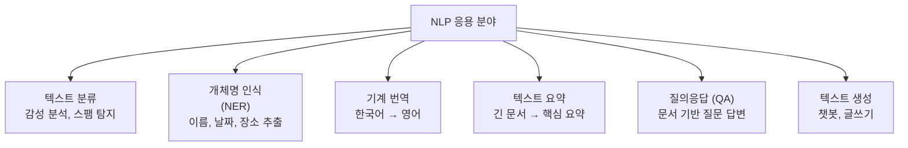
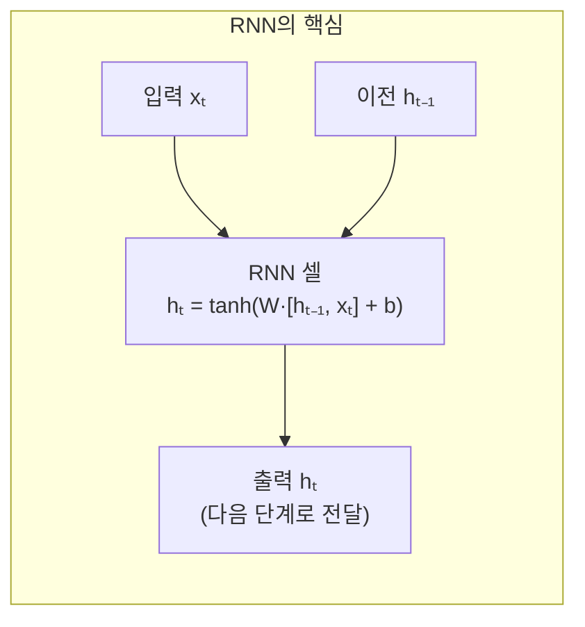
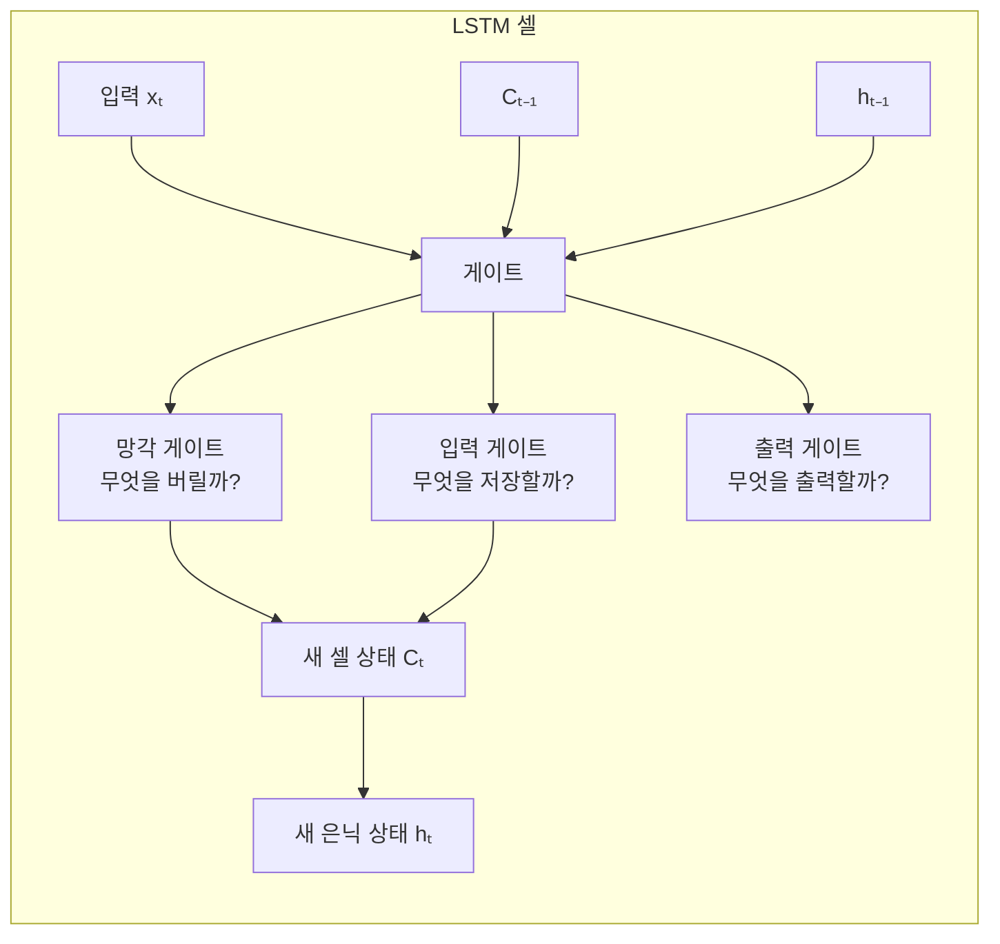
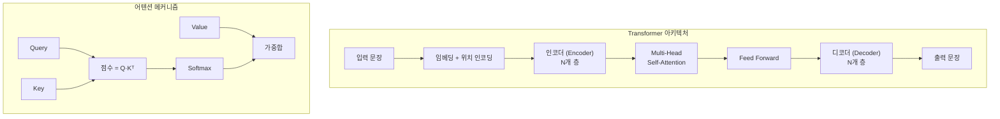
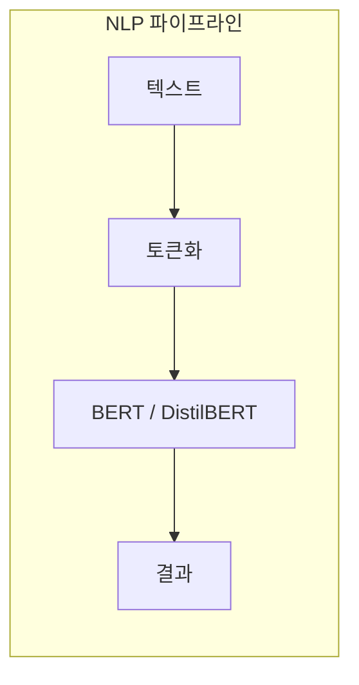

# 11장: 자연어 처리 프로그래밍 (NLP)

> **🎯 학습 목표**
> - 텍스트 전처리 과정(토큰화, 정제, 임베딩)을 이해합니다.
> - RNN과 LSTM의 개념과 차이를 이해합니다.
> - Transformer 아키텍처의 핵심 개념을 이해합니다.
> - Hugging Face Transformers로 BERT를 활용할 수 있습니다.

---

## 👨‍💻 실전 프로젝트: 영화 리뷰 감성 분류기

본 프로젝트는 IMDb 영화 리뷰 데이터셋을 활용하여 감성 분류기를 구축하는 종합 실습입니다. 자연어 처리의 핵심 과정인 토큰화, 사전 학습 모델 활용, Fine-tuning을 하나의 엔드투엔드 파이프라인으로 경험할 수 있습니다. Hugging Face Transformers 라이브러리의 Trainer API를 사용하면 학습 루프, 평가, 체크포인트 저장 등의 복잡한 과정을 자동화할 수 있으므로, 단 몇 줄의 코드로도 강력한 감성 분류기를 구축할 수 있습니다. 다음 코드를 통해 사전 학습된 DistilBERT 모델을 IMDb 리뷰 데이터에 맞게 Fine-tuning하고, 새로운 리뷰에 대한 긍정/부정을 예측하는 과정을 살펴보겠습니다.

```python
# 프로젝트: IMDb 영화 리뷰 감성 분류기
from transformers import AutoTokenizer, AutoModelForSequenceClassification, Trainer, TrainingArguments
from datasets import load_dataset
import torch
import numpy as np

# 1. IMDb 데이터셋 로드
dataset = load_dataset("imdb")
print(f"학습 데이터: {len(dataset['train'])}개")
print(f"테스트 데이터: {len(dataset['test'])}개")

# 2. 토크나이저 초기화 (DistilBERT 사용)
model_name = "distilbert-base-uncased"
tokenizer = AutoTokenizer.from_pretrained(model_name)

def tokenize_function(examples):
    return tokenizer(examples["text"], padding="max_length", truncation=True, max_length=256)

tokenized_datasets = dataset.map(tokenize_function, batched=True)

# 3. 학습 및 평가 데이터 준비 (빠른 실습을 위해 일부만 사용)
train_dataset = tokenized_datasets["train"].shuffle(seed=42).select(range(2000))
eval_dataset = tokenized_datasets["test"].shuffle(seed=42).select(range(500))

# 4. 사전 학습 모델 로드 (분류 헤드 포함)
model = AutoModelForSequenceClassification.from_pretrained(model_name, num_labels=2)

# 5. 학습 설정
training_args = TrainingArguments(
    output_dir="./results",
    num_train_epochs=3,
    per_device_train_batch_size=16,
    per_device_eval_batch_size=16,
    evaluation_strategy="epoch",
    save_strategy="epoch",
    logging_dir="./logs",
    logging_steps=10,
)

def compute_metrics(eval_pred):
    predictions, labels = eval_pred
    predictions = np.argmax(predictions, axis=1)
    return {"accuracy": np.mean(predictions == labels)}

trainer = Trainer(
    model=model,
    args=training_args,
    train_dataset=train_dataset,
    eval_dataset=eval_dataset,
    tokenizer=tokenizer,
    compute_metrics=compute_metrics,
)

# 6. 학습 실행
trainer.train()

# 7. 평가
eval_result = trainer.evaluate()
print(f"평가 정확도: {eval_result['eval_accuracy']:.4f}")

# 8. 새로운 리뷰에 대한 예측
test_reviews = [
    "This movie was absolutely fantastic! I loved every moment of it.",
    "Terrible film, complete waste of time. The acting was horrible.",
    "It was an okay movie, nothing special but not bad either.",
]
inputs = tokenizer(test_reviews, padding=True, truncation=True, return_tensors="pt")
with torch.no_grad():
    outputs = model(**inputs)
    predictions = torch.softmax(outputs.logits, dim=1)
    labels = ["부정", "긍정"]

for review, pred in zip(test_reviews, predictions):
    label = labels[pred.argmax().item()]
    confidence = pred.max().item()
    print(f"리뷰: {review[:50]}...")
    print(f"예측: {label} (신뢰도: {confidence:.4f})\n")
```

**프로젝트 요약:** 위 프로젝트는 Hugging Face의 Trainer API를 사용하여 사전 학습된 DistilBERT 모델을 IMDb 영화 리뷰 데이터로 Fine-tuning하는 과정을 보여줍니다. Trainer API는 학습 루프, 그래디언트 누적, 평가, 체크포인트 저장 등 복잡한 학습 과정을 자동으로 처리하므로, 개발자는 모델 아키텍처와 데이터 전처리에 집중할 수 있습니다. 실제로 전체 데이터(25,000건의 학습 데이터)를 사용하여 충분히 학습할 경우 90% 이상의 정확도를 쉽게 달성할 수 있습니다. 이 프로젝트를 통해 토큰화, 사전 학습 모델, Fine-tuning이라는 자연어 처리의 핵심 개념을 하나의 통합된 파이프라인으로 경험할 수 있습니다. 이제부터 프로젝트에서 사용된 각 개념을 하나씩 상세히 학습해 보겠습니다.

---

## 11.1 자연어 처리란?

**자연어 처리(Natural Language Processing, NLP)** 는 컴퓨터가 인간의 언어를 이해하고 분석하며 생성할 수 있도록 하는 인공지능의 핵심 분야입니다. 이는 단순한 키워드 매칭을 넘어 문맥과 의도를 파악해야 하므로 인공지능 연구에서 가장 난이도가 높은 분야 중 하나로 꼽힙니다. 최근에는 딥러닝 기술의 발전, 특히 Transformer 아키텍처의 등장으로 자연어 처리의 성능이 비약적으로 향상되었으며, 이제는 인간 수준에 근접한 언어 이해와 생성을 수행할 수 있게 되었습니다. 현재 자연어 처리는 감성 분석, 기계 번역, 질의응답 시스템, 텍스트 요약, 챗봇 등 다양한 응용 분야에서 활발히 활용되고 있으며, 일상생활에서도 쉽게 접할 수 있는 기술이 되었습니다. 아래 다이어그램은 자연어 처리의 주요 응용 분야를 시각적으로 정리한 것입니다.



자연어 처리 모델을 구축하기 위한 첫 번째 단계는 원시 텍스트 데이터를 모델이 처리할 수 있는 형태로 변환하는 전처리 과정입니다. 텍스트는 컴퓨터가 직접 이해할 수 없는 형태이므로, 이를 숫자로 변환하는 체계적인 절차가 필수적으로 요구됩니다. 이제 텍스트 전처리의 각 단계를 자세히 알아보겠습니다.

---

## 11.2 텍스트 전처리

텍스트 데이터는 인간이 이해할 수 있는 자연어 형태로 되어 있으나, 컴퓨터는 오직 숫자만을 처리할 수 있습니다. 따라서 모든 자연어 처리 작업의 첫 단계는 텍스트를 컴퓨터가 이해할 수 있는 숫자 형태로 변환하는 전처리 과정입니다. 이러한 전처리는 토큰화, 정제, 임베딩의 세 가지 주요 단계로 구성되며, 각 단계는 텍스트의 품질과 모델의 성능에 직접적인 영향을 미칩니다. 특히 전처리 과정에서 발생하는 노이즈나 정보 손실은 이후 모델의 학습 능력을 저하시킬 수 있으므로, 각 단계를 신중하게 설계하고 적용하는 것이 중요합니다. 다음 다이어그램은 전처리의 전체 흐름을 보여줍니다.


### 11.2.1 기본 전처리

기본적인 텍스트 전처리는 소문자 변환, 특수문자 제거, 토큰화, 불용어 제거, 단어-ID 매핑의 다섯 단계로 이루어집니다. 소문자 변환은 "Hello"와 "hello"를 동일한 단어로 처리하여 어휘 사전의 크기를 줄이고 일반화 성능을 높이기 위한 과정입니다. 특수문자 제거는 구두점이나 기호가 노이즈로 작용하는 것을 방지하며, 특히 감성 분석과 같은 작업에서는 특수문자가 의미를 가지는 경우가 있으므로 주의가 필요합니다. 불용어(Stop Words)는 "is", "the", "a"처럼 자주 등장하지만 문서의 의미에 큰 기여를 하지 않는 단어들로, 이를 제거하면 모델이 더 중요한 단어에 집중할 수 있습니다. 마지막으로 각 단어에 고유한 정수 ID를 부여하여 컴퓨터가 처리할 수 있는 형태로 변환하며, 이 과정에서 생성된 어휘 사전(Vocabulary)은 모델의 입력 차원을 결정짓는 중요한 요소가 됩니다.

```python
import re
import numpy as np
from collections import Counter

text = "Hello World! I'm learning NLP. NLP is fun!!"

# 1. 소문자 변환
text = text.lower()
print(f"소문자: {text}")

# 2. 특수문자 제거
text = re.sub(r'[^a-zA-Z0-9\s]', '', text)
print(f"특수문자 제거: {text}")

# 3. 토큰화 (단어 분할)
tokens = text.split()
print(f"토큰: {tokens}")

# 4. 불용어 제거 (Stop Words)
stop_words = {'is', 'the', 'a', 'an', 'in', 'i', 'am'}
tokens = [t for t in tokens if t not in stop_words]
print(f"불용어 제거: {tokens}")

# 5. 단어 → ID 매핑
vocab = {word: idx for idx, word in enumerate(set(tokens))}
print(f"어휘 사전: {vocab}")

# 6. 텍스트 → ID 시퀀스
ids = [vocab[word] for word in tokens]
print(f"ID 시퀀스: {ids}")
```

### 11.2.2 Hugging Face Tokenizer

위의 기본 전처리는 간단한 작업에 유용하지만, 최신 딥러닝 모델에서는 더 정교한 토크나이저가 사용됩니다. Hugging Face Transformers 라이브러리는 BERT, GPT, T5 등 최신 사전 학습 모델에 최적화된 다양한 토크나이저를 제공하며, 이를 통해 일관된 전처리 파이프라인을 구축할 수 있습니다. 이 토크나이저들은 BPE(Byte Pair Encoding)나 WordPiece와 같은 서브워드 토큰화 방식을 사용하여, 기존의 단순 단어 분할보다 훨씬 효과적으로 텍스트를 처리합니다. 특히 BERT의 토크나이저는 [CLS], [SEP], [PAD]와 같은 특수 토큰을 자동으로 추가하여 모델의 입력 형식을 정확히 맞춰 주며, `tokenizer.encode()` 메서드는 토큰화와 ID 변환을 한 번에 수행합니다. 반대로 `tokenizer.decode()`는 ID 시퀀스를 다시 원래 텍스트로 복원하므로, 모델의 출력을 해석할 때 유용하게 사용할 수 있습니다.

```python
from transformers import AutoTokenizer

# BERT 토크나이저
tokenizer = AutoTokenizer.from_pretrained('bert-base-uncased')

text = "I love learning about AI!"
tokens = tokenizer.tokenize(text)
print(f"토큰: {tokens}")

# ID로 변환
ids = tokenizer.encode(text)
print(f"ID: {ids}")

# 다시 텍스트로
decoded = tokenizer.decode(ids)
print(f"디코딩: {decoded}")

# 특수 토큰 확인
print(f"CLS 토큰: {tokenizer.cls_token} (ID: {tokenizer.cls_token_id})")
print(f"SEP 토큰: {tokenizer.sep_token} (ID: {tokenizer.sep_token_id})")
print(f"PAD 토큰: {tokenizer.pad_token} (ID: {tokenizer.pad_token_id})")
```

전처리를 마친 텍스트의 각 단어는 임베딩 과정을 통해 밀집 벡터로 변환됩니다. 단어 임베딩은 이산적인 단어 ID를 연속적인 의미 공간에 매핑하는 핵심 기술로, 모델이 단어 간의 의미적 유사성을 학습할 수 있게 합니다. 이제 단어 임베딩의 개념과 구현 방법을 학습하겠습니다.

---

## 11.3 단어 임베딩 (Word Embedding)

임베딩은 **단어를 밀집 벡터로 변환**하는 기술입니다. 유사한 의미의 단어는 벡터 공간에서 가깝게 위치합니다.

단어 임베딩은 이산적인(discrete) 단어 ID를 연속적인(continuous) 밀집 벡터로 변환하는 중요한 기술입니다. 원-핫 인코딩이 단어 개수만큼의 차원을 필요로 하는 반면, 임베딩은 일반적으로 100~300차원의 저차원 벡터로 단어를 표현하므로 메모리 효율성이 뛰어납니다. 더 중요한 장점은 임베딩 공간에서 유사한 의미를 가진 단어들이 서로 가깝게 위치한다는 점으로, "왕"과 "왕비"의 관계가 "남자"와 "여자"의 관계와 유사하게 표현되는 흥미로운 특성을 보입니다. 이러한 의미적 관계는 임베딩 벡터 간의 산술 연산으로도 표현될 수 있으며, 예를 들어 "왕" - "남자" + "여자" = "왕비"와 같은 벡터 연산이 가능합니다. PyTorch의 `nn.Embedding`은 이러한 임베딩을 구현한 가장 기본적인 레이어로, 학습 과정에서 단어 벡터가 데이터에 맞게 조정되어 점차 정교한 의미 표현을 학습하게 됩니다.

```python
import torch
import torch.nn as nn

# 임베딩 레이어
vocab_size = 10000
embedding_dim = 128

embedding = nn.Embedding(vocab_size, embedding_dim)

# 단어 ID를 임베딩 벡터로 변환
word_ids = torch.tensor([5, 100, 500])
vectors = embedding(word_ids)
print(f"단어 ID: {word_ids}")
print(f"임베딩 벡터 shape: {vectors.shape}")
print(f"첫 번째 단어 벡터 (처음 10개): {vectors[0][:10]}")
```

임베딩된 단어 벡터들은 시퀀스를 이루며, 이 시퀀스를 처리하기 위해 고안된 가장 기본적인 신경망 구조가 순환 신경망(RNN)입니다. RNN은 이전 시점의 정보를 현재 시점으로 전달하는 은닉 상태를 통해 순차 데이터를 처리합니다. 이제 RNN의 구조와 동작 원리를 자세히 알아보겠습니다.

---

## 11.4 RNN (Recurrent Neural Network)

RNN은 **시퀀스 데이터(텍스트, 시계열)** 를 처리하기 위한 신경망입니다.

순환 신경망(Recurrent Neural Network, RNN)은 텍스트, 음성, 시계열 데이터와 같은 순차적인 데이터를 처리하기 위해 설계된 신경망 구조입니다. RNN의 핵심 아이디어는 은닉 상태(hidden state)라는 내부 메모리를 통해 이전 시점의 정보를 현재 시점으로 전달하는 것입니다. 예를 들어 "나는 어제 영화를 봤다. 그 영화는 매우 재미있었다."라는 문장에서 "그 영화"가 "어제 본 영화"를 가리킨다는 것을 학습하려면 이전 정보를 기억하는 구조가 필수적입니다. 수식으로 표현하면 hₜ = tanh(W·[hₜ₋₁, xₜ] + b)와 같이 현재 입력 xₜ와 이전 은닉 상태 hₜ₋₁을 결합하여 새로운 은닉 상태 hₜ를 계산하며, 이렇게 계산된 은닉 상태는 다음 시점으로 계속 전달됩니다. 그러나 RNN은 시퀀스가 길어질수록 초기 정보가 소실되는 장기 의존성 문제를 가지고 있으며, 이는 역전파 과정에서 그래디언트가 기하급수적으로 감소하는 기울기 소실(Vanishing Gradient) 현상 때문입니다.



```python
import torch
import torch.nn as nn

class SimpleRNN(nn.Module):
    def __init__(self, vocab_size, embedding_dim, hidden_dim, num_classes):
        super().__init__()
        self.embedding = nn.Embedding(vocab_size, embedding_dim)
        self.rnn = nn.RNN(embedding_dim, hidden_dim, batch_first=True)
        self.fc = nn.Linear(hidden_dim, num_classes)

    def forward(self, x):
        embedded = self.embedding(x)
        output, hidden = self.rnn(embedded)
        logits = self.fc(hidden.squeeze(0))
        return logits

model = SimpleRNN(vocab_size=10000, embedding_dim=100, hidden_dim=128, num_classes=2)
print(model)
```

앞서 언급한 장기 의존성 문제를 해결하기 위해 고안된 구조가 LSTM(Long Short-Term Memory)입니다. LSTM은 게이트 메커니즘을 도입하여 정보의 흐름을 정교하게 제어함으로써, 먼 과거의 정보도 효과적으로 보존하고 활용할 수 있습니다. 이제 LSTM의 구조와 동작 방식을 RNN과 비교하며 학습하겠습니다.

---

## 11.5 LSTM (Long Short-Term Memory)

LSTM은 RNN의 장기 의존성 문제를 해결하기 위해 **게이트(Gate) 메커니즘**을 추가한 구조입니다.

LSTM(Long Short-Term Memory)은 RNN의 장기 의존성 문제, 즉 역전파 과정에서 기울기가 소실되어 먼 과거의 정보를 학습하지 못하는 문제를 해결하기 위해 제안된 구조입니다. LSTM은 망각 게이트(forget gate), 입력 게이트(input gate), 출력 게이트(output gate)라는 세 가지 게이트 메커니즘을 도입하여 정보의 흐름을 정교하게 제어합니다. 특히 셀 상태(cell state)라는 별도의 장기 메모리 경로를 통해 정보가 오랜 시간 동안 보존될 수 있으며, 게이트는 시그모이드 함수를 사용하여 0과 1 사이의 값을 출력함으로써 각 정보를 얼마나 통과시킬지 결정합니다. 망각 게이트는 이전 셀 상태 중에서 버릴 정보를 결정하고, 입력 게이트는 새로운 정보 중에서 저장할 내용을 선택하며, 출력 게이트는 최종 은닉 상태로 내보낼 정보를 조절합니다. 이러한 구조 덕분에 LSTM은 기계 번역, 음성 인식, 감성 분석 등 다양한 시퀀스 처리 작업에서 RNN보다 월등한 성능을 보여주었습니다.



```python
class LSTMClassifier(nn.Module):
    def __init__(self, vocab_size, embedding_dim, hidden_dim, num_classes):
        super().__init__()
        self.embedding = nn.Embedding(vocab_size, embedding_dim)
        self.lstm = nn.LSTM(embedding_dim, hidden_dim,
                           num_layers=2, batch_first=True,
                           bidirectional=True, dropout=0.3)
        self.fc = nn.Linear(hidden_dim * 2, num_classes)
        self.dropout = nn.Dropout(0.3)

    def forward(self, x):
        embedded = self.dropout(self.embedding(x))
        output, (hidden, cell) = self.lstm(embedded)
        hidden_fwd = hidden[-2, :, :]
        hidden_bwd = hidden[-1, :, :]
        hidden_concat = torch.cat((hidden_fwd, hidden_bwd), dim=1)
        logits = self.fc(hidden_concat)
        return logits
```

| 특징 | RNN | LSTM |
|------|-----|------|
| 구조 | 단순 | 복잡 (3개 게이트) |
| 장기 기억 | 어려움 | 가능 |
| 학습 안정성 | 낮음 | 높음 |
| 속도 | 빠름 | 느림 |
| 성능 | 낮음 | 높음 |

LSTM이 RNN보다 성능이 우수하기는 하지만, 여전히 순차적으로 데이터를 처리해야 한다는 근본적인 한계를 가지고 있습니다. 이러한 순차 처리 방식은 병렬화가 어렵고 긴 시퀀스에서 여전히 정보 손실이 발생할 수 있습니다. 이러한 한계를 획기적으로 극복한 구조가 바로 Transformer이며, 다음 절에서 자세히 살펴보겠습니다.

---

## 11.6 Transformer (트랜스포머)

2017년 Google의 **"Attention Is All You Need"** 논문에서 발표된 Transformer는 RNN을 완전히 대체했습니다.

Transformer는 2017년 Google 연구팀이 발표한 "Attention Is All You Need" 논문에서 처음 소개된 혁신적인 아키텍처입니다. 이 모델의 가장 큰 혁신은 순환(recurrence)이나 합성곱(convolution)을 전혀 사용하지 않고, 오직 어텐션(attention) 메커니즘만으로 시퀀스 데이터를 처리한다는 점입니다. Self-Attention은 입력 문장의 모든 단어 쌍 사이의 관계를 한 번에 계산할 수 있어, RNN처럼 순차적으로 처리할 필요가 없으므로 병렬 계산이 가능합니다. 또한 Multi-Head Attention을 통해 다양한 관점에서 단어 간 관계를 학습하며, 위치 인코딩(positional encoding)을 통해 단어의 순서 정보를 모델에 주입합니다. Transformer의 인코더-디코더 구조는 기계 번역 작업을 위해 설계되었으나, 이후 인코더만 사용한 BERT와 디코더만 사용한 GPT 등 다양한 변형 모델의 기반이 되었습니다.



```python
import torch
import torch.nn.functional as F

def scaled_dot_product_attention(Q, K, V):
    scores = torch.matmul(Q, K.transpose(-2, -1)) / (K.size(-1) ** 0.5)
    attention_weights = F.softmax(scores, dim=-1)
    output = torch.matmul(attention_weights, V)
    return output, attention_weights

seq_len, d_k = 4, 8
Q = torch.randn(1, seq_len, d_k)
K = torch.randn(1, seq_len, d_k)
V = torch.randn(1, seq_len, d_k)

output, attn_weights = scaled_dot_product_attention(Q, K, V)
print(f"어텐션 가중치:\n{attn_weights.squeeze(0).round(2)}")
```

Transformer의 인코더 부분을 활용하여 양방향 문맥을 학습한 대표적인 모델이 BERT입니다. BERT는 Masked Language Model 방식을 통해 문장의 양쪽 문맥을 동시에 고려함으로써, 기존 단방향 모델보다 훨씬 풍부한 언어 표현을 학습할 수 있었습니다. 다음 절에서 BERT의 구조와 활용 방법을 자세히 알아보겠습니다.

---

## 11.7 BERT

BERT는 **양방향 문맥을 이해**하는 사전 학습된 언어 모델입니다.

BERT(Bidirectional Encoder Representations from Transformers)는 Google이 2018년에 발표한 사전 학습 언어 모델로, Transformer의 인코더 부분을 쌓아서 구성됩니다. BERT의 가장 큰 특징은 양방향성(bidirectional)으로, 문장의 각 단어를 이해할 때 왼쪽과 오른쪽 문맥을 모두 동시에 고려한다는 점입니다. 이는 기존의 GPT가 왼쪽에서 오른쪽으로만 문맥을 고려한 것과 대비되며, BERT는 Masked Language Model(MLM)이라는 사전 학습 방식을 통해 입력 토큰의 일부를 마스킹하고 이를 양방향 문맥으로 예측하도록 학습합니다. 또한 Next Sentence Prediction(NSP)을 통해 두 문장 간의 관계를 학습하여 질의응답이나 자연어 추론과 같은 작업에서 강력한 성능을 발휘합니다. 사전 학습된 BERT는 감성 분석, 질의응답, 개체명 인식 등 다양한 다운스트림 작업에 Fine-tuning되어 최고 수준의 성능을 달성하며, Hugging Face 라이브러리를 통해 손쉽게 활용할 수 있습니다.

```python
from transformers import BertTokenizer, BertModel
import torch

tokenizer = BertTokenizer.from_pretrained('bert-base-multilingual-cased')
model = BertModel.from_pretrained('bert-base-multilingual-cased')

text = "나는 AI 프로그래밍을 배우고 있어요."

inputs = tokenizer(text, return_tensors='pt', padding=True, truncation=True)
print(f"토큰: {tokenizer.convert_ids_to_tokens(inputs['input_ids'][0])}")

with torch.no_grad():
    outputs = model(**inputs)

cls_embedding = outputs.last_hidden_state[:, 0, :]
print(f"[CLS] 임베딩 shape: {cls_embedding.shape}")
```

### BERT Fine-tuning

사전 학습된 BERT를 특정 작업에 맞게 Fine-tuning하는 과정은 비교적 간단하면서도 매우 효과적입니다. `BertForSequenceClassification`과 같은 작업별 헤드가 포함된 모델을 로드한 후, 분류기 층만 새로 초기화하여 학습하거나 필요에 따라 전체 모델을 Fine-tuning할 수 있습니다. 일반적으로 사전 학습된 BERT의 가중치는 고정(freeze)하고 분류기 헤드만 학습하는 방식이 적은 데이터로도 좋은 성능을 내는 데 효과적입니다. 학습률은 2e-5와 같은 매우 작은 값을 사용하는 것이 일반적이며, 이는 사전 학습된 가중치를 크게 훼손하지 않으면서 새로운 작업에 적응시키기 위함입니다.

```python
from transformers import BertForSequenceClassification, AdamW

model = BertForSequenceClassification.from_pretrained(
    'bert-base-multilingual-cased', num_labels=2
)

for param in model.bert.parameters():
    param.requires_grad = False

optimizer = AdamW(model.classifier.parameters(), lr=2e-5)
print(f"분류기: {model.classifier}")
```

지금까지 배운 모든 개념을 종합하여, Hugging Face의 pipeline API를 사용한 실제 감성 분석 파이프라인을 구축해 보겠습니다. pipeline API는 토큰화, 모델 추론, 결과 후처리까지의 모든 과정을 하나의 인터페이스로 통합하여 제공합니다. 이를 통해 사전 학습된 모델을 단 몇 줄의 코드로 즉시 사용할 수 있으며, 내부 동작 방식을 이해한 상태에서 활용하면 더욱 효과적입니다.

---

## 11.8 실전: 감성 분석 파이프라인

Hugging Face Transformers 라이브러리는 pipeline API를 통해 사전 학습된 모델을 극히 간단하게 사용할 수 있는 방법을 제공합니다. `sentiment-analysis` 파이프라인은 내부적으로 토큰화, 모델 추론, 결과 후처리를 모두 자동으로 처리하므로, 단 몇 줄의 코드로 강력한 감성 분석기를 사용할 수 있습니다. 아래 코드는 DistilBERT를 감성 분석용으로 Fine-tuning한 모델을 로드하여 여러 문장의 긍정과 부정을 판별합니다. pipeline은 입력 텍스트에 대해 레이블(긍정 또는 부정)과 신뢰도 점수를 함께 반환하므로, 결과에 대한 신뢰 수준을 함께 확인할 수 있습니다. 이 파이프라인은 다양한 언어와 도메인에 적용 가능하며, 모델 이름만 변경하면 다른 작업(예: 텍스트 분류, 개체명 인식)으로도 쉽게 확장할 수 있습니다.

```python
from transformers import pipeline

classifier = pipeline(
    'sentiment-analysis',
    model='distilbert-base-uncased-finetuned-sst-2-english'
)

texts = [
    "I love this product! It's amazing!",
    "This is the worst experience ever.",
    "It's okay, nothing special."
]

for text in texts:
    result = classifier(text)[0]
    print(f"'{text}' → {result['label']} ({result['score']:.4f})")
```



---

## 📋 한눈에 정리

| 개념 | 설명 | 한계/장점 |
|------|------|----------|
| **토큰화** | 텍스트 → 단어/서브워드 분할 | 언어마다 다른 규칙 |
| **임베딩** | 단어 → 밀집 벡터 | 유사 단어는 가까운 벡터 |
| **RNN** | 순차 데이터 처리 | 장기 의존성 문제 |
| **LSTM** | 게이트로 장기 기억 가능 | RNN보다 느림 |
| **Transformer** | 어텐션만으로 시퀀스 처리 | 병렬 처리 가능 |
| **BERT** | 양방향 사전 학습 모델 | Fine-tuning으로 다양한 작업 |

---

## ✏️ 연습 문제

1. **RNN의 장기 의존성 문제**란 무엇이며, LSTM이 이를 어떻게 해결하나요?

2. Hugging Face의 `pipeline('sentiment-analysis')`를 사용하여 5개 문장의 감성을 분석하세요.

3. **Transformer의 Self-Attention**이 RNN보다 가진 장점 3가지는?

4. BERT의 **사전 학습**과 **Fine-tuning**의 차이는 무엇인가요?

5. 다음 각 작업에 가장 적합한 모델은?
   - 짧은 텍스트 감성 분석
   - 문서 요약
   - 실시간 번역

---

## 📝 연습 문제 정답

<details>
<summary>정답 보기</summary>

**1. RNN의 장기 의존성 문제와 LSTM 해결책**
RNN은 시간이 지날수록 기울기가 소실(Vanishing Gradient)되어 먼 과거의 정보를 기억하지 못합니다. 예를 들어 "나는 1990년에 ... (50단어) ... 그해 여름은 매우 더웠다"에서 "그해"가 1990년을 가리킨다는 것을 학습하기 어렵습니다. LSTM은 **망각 게이트, 입력 게이트, 출력 게이트**라는 3개의 게이트를 사용하여 필요한 정보는 오래 기억하고 불필요한 정보는 버립니다. 셀 상태(Cell State)라는 컨베이어 벨트를 통해 정보가 장기간 전달될 수 있습니다.

**2. 감성 분석 파이프라인**
```python
from transformers import pipeline
classifier = pipeline('sentiment-analysis')
texts = [
    "I love this!",
    "This is terrible.",
    "It's okay.",
    "Absolutely wonderful experience!",
    "Waste of money and time."
]
for text in texts:
    result = classifier(text)[0]
    print(f"{text} → {result['label']} ({result['score']:.3f})")
```

**3. Transformer Self-Attention의 장점**
- **병렬 처리 가능:** RNN은 순차 처리해야 하지만, Self-Attention은 한 번에 모든 토큰 간 관계 계산 가능 → 학습 속도 대폭 향상
- **장기 의존성 해결:** 모든 토큰 쌍이 직접 연결되어 먼 거리의 토큰도 잘 참조 가능
- **문맥 이해력 향상:** 각 토큰이 문장 내 모든 다른 토큰과의 관계를 학습

**4. BERT 사전 학습 vs Fine-tuning**
- **사전 학습 (Pre-training):** 대규모 데이터(위키백과 등)로 Masked Language Model(빈칸 맞추기)과 Next Sentence Prediction(다음 문장 예측)을 학습
- **Fine-tuning:** 사전 학습된 BERT에 작은 분류기를 붙여 특정 작업(감성 분석, QA 등)에 맞게 추가 학습
- 사전 학습은 한 번만 수행되고, Fine-tuning은 각 작업마다 수행됩니다.

**5. 작업별 적합한 모델**
- 짧은 텍스트 감성 분석 → **DistilBERT 또는 BERT** (분류에 강함)
- 문서 요약 → **BART 또는 T5** (인코더-디코더 구조가 요약에 적합)
- 실시간 번역 → **T5 또는 MarianMT** (속도가 중요하면 작은 모델 선택)

</details>

---

> **🔄 다음 장에서는** 생성형 AI와 LLM을 배웁니다. GPT, 프롬프트 엔지니어링, RAG, LangChain을 다룹니다.
