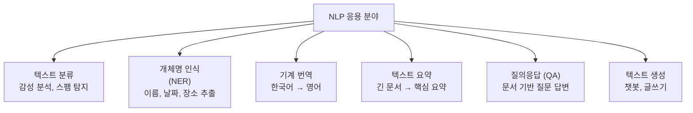
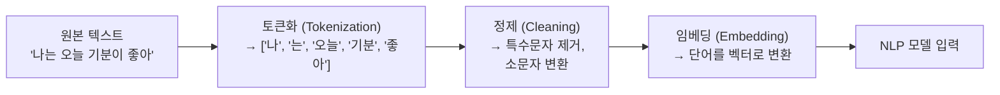
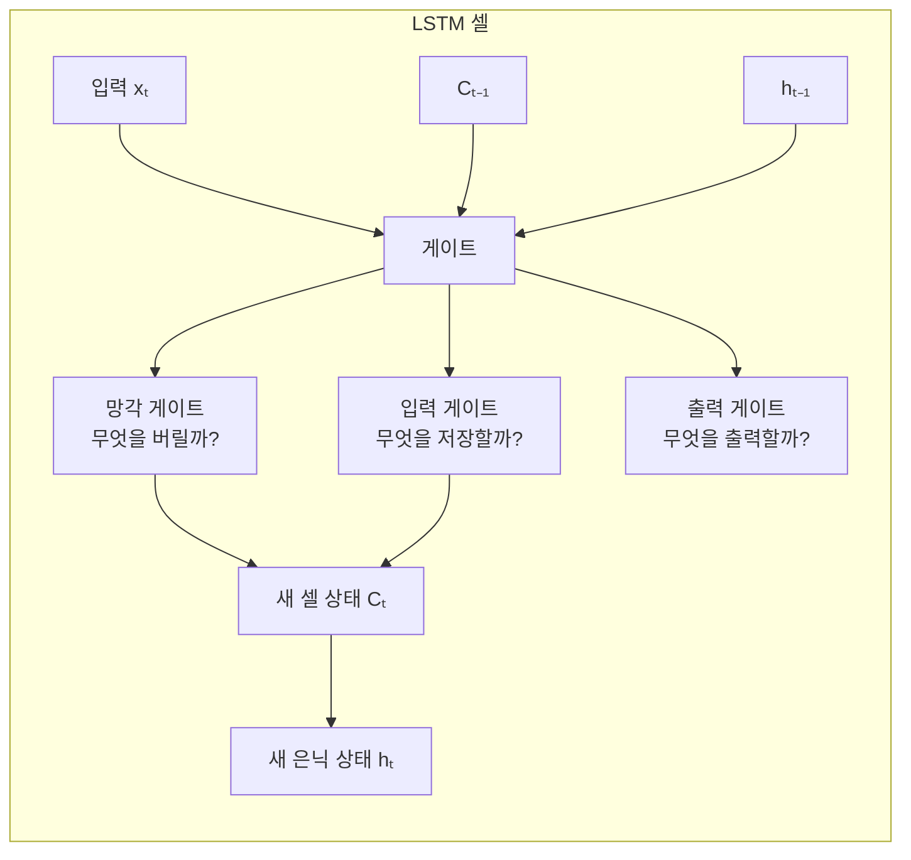
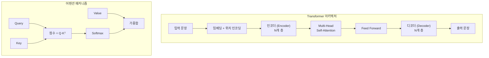
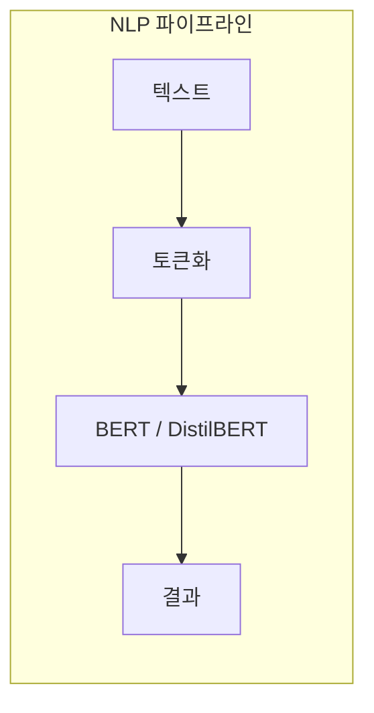

# 11장: 자연어 처리 (Natural Language Processing)

> **🎯 학습 목표**
> - 텍스트 전처리 과정(토큰화, 정제, 임베딩)을 이해합니다.
> - RNN과 LSTM의 개념과 차이를 이해합니다.
> - Transformer 아키텍처의 핵심 개념을 이해합니다.
> - Hugging Face Transformers로 BERT를 활용할 수 있습니다.

---

## 11.1 자연어 처리란?

**자연어 처리(Natural Language Processing, NLP)** 는 컴퓨터가 인간의 언어를 이해하고 생성하는 AI 분야입니다.



---

## 11.2 텍스트 전처리

텍스트는 컴퓨터가 직접 이해할 수 없으므로 **숫자로 변환하는 과정**이 필요합니다.



### 11.2.1 기본 전처리

```python
import re
import numpy as np
from collections import Counter

text = "Hello World! I'm learning NLP. NLP is fun!!"

# 1. 소문자 변환
text = text.lower()
print(f"소문자: {text}")

# 2. 특수문자 제거
text = re.sub(r'[^a-zA-Z0-9\s]', '', text)
print(f"특수문자 제거: {text}")

# 3. 토큰화 (단어 분할)
tokens = text.split()
print(f"토큰: {tokens}")

# 4. 불용어 제거 (Stop Words)
stop_words = {'is', 'the', 'a', 'an', 'in', 'i', 'am'}
tokens = [t for t in tokens if t not in stop_words]
print(f"불용어 제거: {tokens}")

# 5. 단어 → ID 매핑
vocab = {word: idx for idx, word in enumerate(set(tokens))}
print(f"어휘 사전: {vocab}")

# 6. 텍스트 → ID 시퀀스
ids = [vocab[word] for word in tokens]
print(f"ID 시퀀스: {ids}")
```

### 11.2.2 Hugging Face Tokenizer

```python
from transformers import AutoTokenizer

# BERT 토크나이저
tokenizer = AutoTokenizer.from_pretrained('bert-base-uncased')

text = "I love learning about AI!"
tokens = tokenizer.tokenize(text)
print(f"토큰: {tokens}")

# ID로 변환
ids = tokenizer.encode(text)
print(f"ID: {ids}")

# 다시 텍스트로
decoded = tokenizer.decode(ids)
print(f"디코딩: {decoded}")

# 특수 토큰 확인
print(f"CLS 토큰: {tokenizer.cls_token} (ID: {tokenizer.cls_token_id})")
print(f"SEP 토큰: {tokenizer.sep_token} (ID: {tokenizer.sep_token_id})")
print(f"PAD 토큰: {tokenizer.pad_token} (ID: {tokenizer.pad_token_id})")
```

---

## 11.3 단어 임베딩 (Word Embedding)

임베딩은 **단어를 밀집 벡터로 변환**하는 기술입니다. 유사한 의미의 단어는 벡터 공간에서 가깝게 위치합니다.

```python
import torch
import torch.nn as nn

# 임베딩 레이어
vocab_size = 10000
embedding_dim = 128

embedding = nn.Embedding(vocab_size, embedding_dim)

# 단어 ID를 임베딩 벡터로 변환
word_ids = torch.tensor([5, 100, 500])
vectors = embedding(word_ids)
print(f"단어 ID: {word_ids}")
print(f"임베딩 벡터 shape: {vectors.shape}")
print(f"첫 번째 단어 벡터 (처음 10개): {vectors[0][:10]}")
```

---

## 11.4 RNN (Recurrent Neural Network)

RNN은 **시퀀스 데이터(텍스트, 시계열)** 를 처리하기 위한 신경망입니다.

```mermaid
flowchart LR
  subgraph RNN_Cell[RNN의 핵심]
    Input_T["입력 xₜ"] --> RNN_Cell["RNN 셀<br/>은닉 상태 hₜ =<br/>tanh(W·[hₜ₋₁, xₜ] + b)"]
    Prev_H["이전 은닉 상태<br/>hₜ₋₁"] --> RNN_Cell
    RNN_Cell --> Output_H["출력 hₜ<br/>(다음 단계로 전달)"]
  end
```

```python
import torch
import torch.nn as nn

class SimpleRNN(nn.Module):
    def __init__(self, vocab_size, embedding_dim, hidden_dim, num_classes):
        super().__init__()
        self.embedding = nn.Embedding(vocab_size, embedding_dim)
        self.rnn = nn.RNN(embedding_dim, hidden_dim, batch_first=True)
        self.fc = nn.Linear(hidden_dim, num_classes)

    def forward(self, x):
        embedded = self.embedding(x)
        output, hidden = self.rnn(embedded)
        logits = self.fc(hidden.squeeze(0))
        return logits

model = SimpleRNN(vocab_size=10000, embedding_dim=100, hidden_dim=128, num_classes=2)
print(model)
```

---

## 11.5 LSTM (Long Short-Term Memory)

LSTM은 RNN의 장기 의존성 문제를 해결하기 위해 **게이트(Gate) 메커니즘**을 추가한 구조입니다.



```python
class LSTMClassifier(nn.Module):
    def __init__(self, vocab_size, embedding_dim, hidden_dim, num_classes):
        super().__init__()
        self.embedding = nn.Embedding(vocab_size, embedding_dim)
        self.lstm = nn.LSTM(embedding_dim, hidden_dim,
                           num_layers=2, batch_first=True,
                           bidirectional=True, dropout=0.3)
        self.fc = nn.Linear(hidden_dim * 2, num_classes)
        self.dropout = nn.Dropout(0.3)

    def forward(self, x):
        embedded = self.dropout(self.embedding(x))
        output, (hidden, cell) = self.lstm(embedded)
        hidden_fwd = hidden[-2, :, :]
        hidden_bwd = hidden[-1, :, :]
        hidden_concat = torch.cat((hidden_fwd, hidden_bwd), dim=1)
        logits = self.fc(hidden_concat)
        return logits
```

| 특징 | RNN | LSTM |
|------|-----|------|
| 구조 | 단순 | 복잡 (3개 게이트) |
| 장기 기억 | 어려움 | 가능 |
| 학습 안정성 | 낮음 | 높음 |
| 속도 | 빠름 | 느림 |
| 성능 | 낮음 | 높음 |

---

## 11.6 Transformer (트랜스포머)

2017년 Google의 **"Attention Is All You Need"** 논문에서 발표된 Transformer는 RNN을 완전히 대체했습니다.



```python
import torch
import torch.nn.functional as F

def scaled_dot_product_attention(Q, K, V):
    scores = torch.matmul(Q, K.transpose(-2, -1)) / (K.size(-1) ** 0.5)
    attention_weights = F.softmax(scores, dim=-1)
    output = torch.matmul(attention_weights, V)
    return output, attention_weights

seq_len, d_k = 4, 8
Q = torch.randn(1, seq_len, d_k)
K = torch.randn(1, seq_len, d_k)
V = torch.randn(1, seq_len, d_k)

output, attn_weights = scaled_dot_product_attention(Q, K, V)
print(f"어텐션 가중치:\n{attn_weights.squeeze(0).round(2)}")
```

---

## 11.7 BERT

BERT는 **양방향 문맥을 이해**하는 사전 학습된 언어 모델입니다.

```python
from transformers import BertTokenizer, BertModel
import torch

tokenizer = BertTokenizer.from_pretrained('bert-base-multilingual-cased')
model = BertModel.from_pretrained('bert-base-multilingual-cased')

text = "나는 AI 프로그래밍을 배우고 있어요."

inputs = tokenizer(text, return_tensors='pt', padding=True, truncation=True)
print(f"토큰: {tokenizer.convert_ids_to_tokens(inputs['input_ids'][0])}")

with torch.no_grad():
    outputs = model(**inputs)

cls_embedding = outputs.last_hidden_state[:, 0, :]
print(f"[CLS] 임베딩 shape: {cls_embedding.shape}")
```

### BERT Fine-tuning

```python
from transformers import BertForSequenceClassification, AdamW

model = BertForSequenceClassification.from_pretrained(
    'bert-base-multilingual-cased', num_labels=2
)

for param in model.bert.parameters():
    param.requires_grad = False

optimizer = AdamW(model.classifier.parameters(), lr=2e-5)
print(f"분류기: {model.classifier}")
```

---

## 11.8 실전: 감성 분석 파이프라인

```python
from transformers import pipeline

classifier = pipeline(
    'sentiment-analysis',
    model='distilbert-base-uncased-finetuned-sst-2-english'
)

texts = [
    "I love this product! It's amazing!",
    "This is the worst experience ever.",
    "It's okay, nothing special."
]

for text in texts:
    result = classifier(text)[0]
    print(f"'{text}' → {result['label']} ({result['score']:.4f})")
```



---

## 📋 한눈에 정리

| 개념 | 설명 | 한계/장점 |
|------|------|----------|
| **토큰화** | 텍스트 → 단어/서브워드 분할 | 언어마다 다른 규칙 |
| **임베딩** | 단어 → 밀집 벡터 | 유사 단어는 가까운 벡터 |
| **RNN** | 순차 데이터 처리 | 장기 의존성 문제 |
| **LSTM** | 게이트로 장기 기억 가능 | RNN보다 느림 |
| **Transformer** | 어텐션만으로 시퀀스 처리 | 병렬 처리 가능 |
| **BERT** | 양방향 사전 학습 모델 | Fine-tuning으로 다양한 작업 |

---

## ✏️ 연습 문제

1. **RNN의 장기 의존성 문제**란 무엇이며, LSTM이 이를 어떻게 해결하나요?

2. Hugging Face의 `pipeline('sentiment-analysis')`를 사용하여 5개 문장의 감성을 분석하세요.

3. **Transformer의 Self-Attention**이 RNN보다 가진 장점 3가지는?

4. BERT의 **사전 학습**과 **Fine-tuning**의 차이는 무엇인가요?

5. 다음 각 작업에 가장 적합한 모델은?
   - 짧은 텍스트 감성 분석
   - 문서 요약
   - 실시간 번역

---

> **🔄 다음 장에서는** 생성형 AI와 LLM을 배웁니다. GPT, 프롬프트 엔지니어링, RAG, LangChain을 다룹니다.
