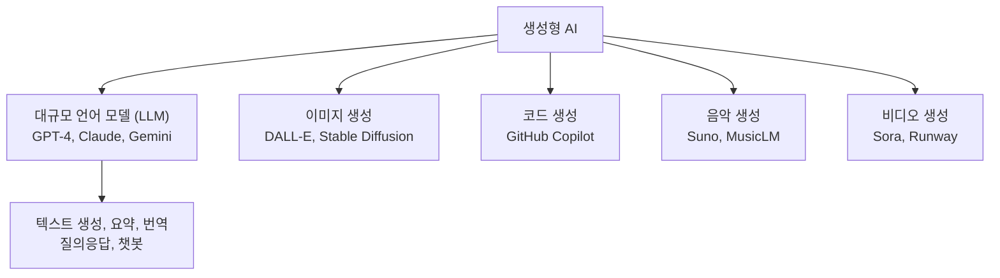
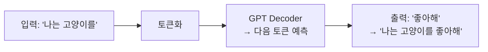
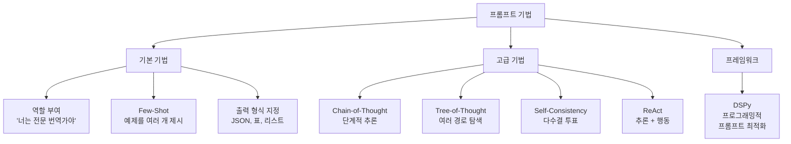
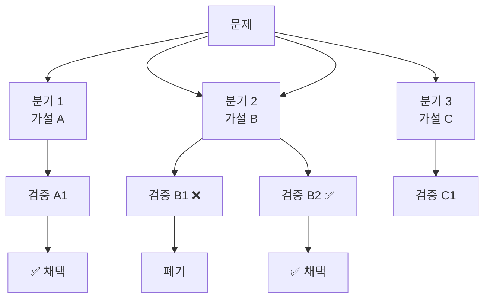
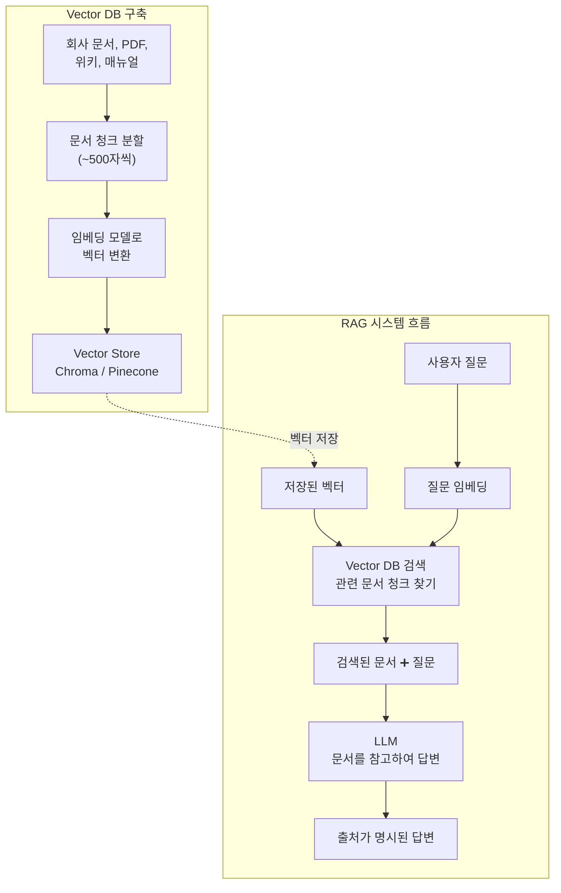
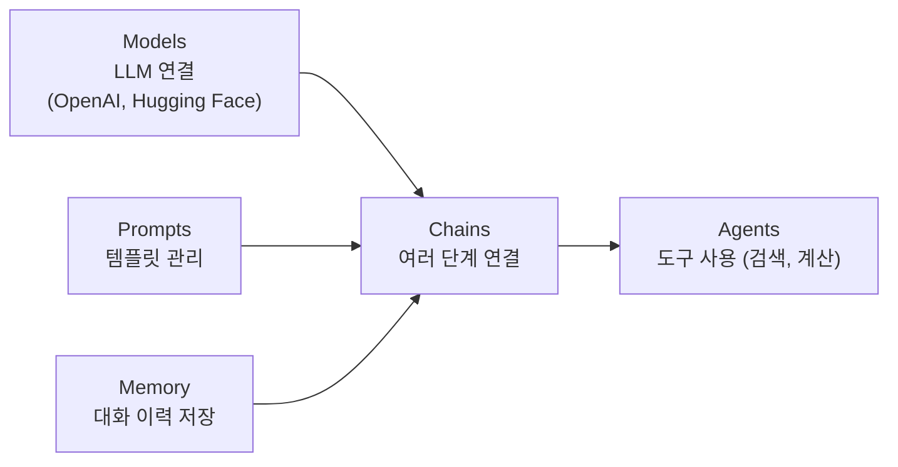
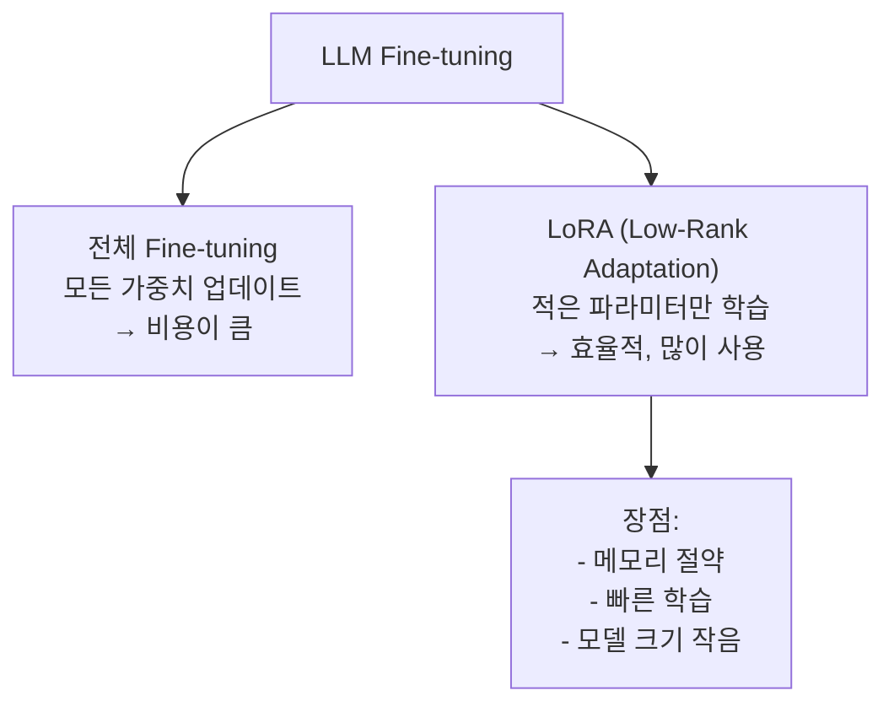
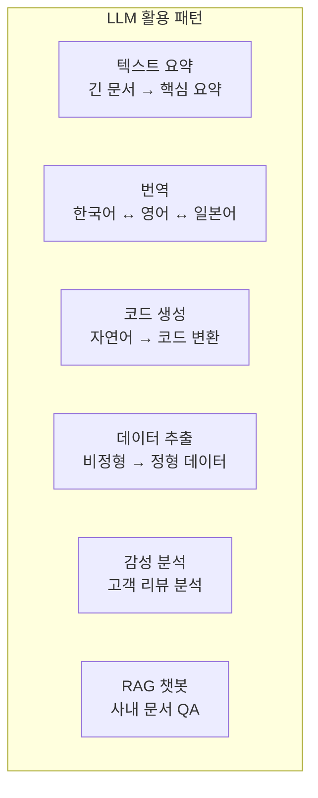

# 12장: 생성형 AI와 LLM

> **🎯 학습 목표**
> - 생성형 AI의 개념과 GPT 아키텍처를 이해합니다.
> - 프롬프트 엔지니어링의 고급 기법(ReAct, ToT, DSPy)을 익힙니다.
> - RAG(Retrieval Augmented Generation)의 구조를 이해합니다.
> - OpenAI API를 활용한 실전 챗봇 프로젝트를 수행합니다.

---

## 👨‍💻 실전 프로젝트: OpenAI API로 챗봇 만들기

이번 실전 프로젝트에서는 OpenAI API를 활용하여 단계별로 발전하는 챗봇을 직접 구축해 보겠습니다. 먼저 기본적인 대화 기능만 갖춘 단순한 챗봇에서 시작하여, 외부 문서를 검색하여 답변을 보강하는 RAG(Retrieval Augmented Generation) 기능을 추가하고, 마지막으로 Function Calling을 통해 외부 도구와 연동하는 지능형 에이전트로 확장할 것입니다. 각 단계는 이전 단계의 코드를 기반으로 점진적으로 발전시키는 방식으로 진행되므로, 전체적인 LLM 애플리케이션 개발의 흐름을 자연스럽게 이해할 수 있을 것입니다.

### Step 1: 기본 챗봇 구현

가장 먼저 OpenAI의 Chat Completion API를 호출하여 사용자와 대화할 수 있는 기본적인 챗봇을 구현합니다. 이 챗봇은 시스템 프롬프트를 통해 AI의 성격과 역할을 정의하고, 대화 이력을 `messages` 배열에 순차적으로 저장하여 맥락을 유지합니다. 사용자가 새로운 입력을 보낼 때마다 전체 대화 이력을 API에 전송함으로써, 이전에 나눈 대화의 내용을 기억하고 연속성 있는 답변을 생성할 수 있게 됩니다. 이는 LLM 자체가 상태를 가지고 있지 않기 때문에, 애플리케이션 레벨에서 대화 상태를 관리해야 한다는 중요한 원칙을 보여줍니다.

```python
# Step 1: 기본 챗봇
from openai import OpenAI

client = OpenAI()

class SimpleChatbot:
    def __init__(self, system_prompt="너는 친절한 AI 도우미입니다."):
        self.messages = [
            {"role": "system", "content": system_prompt}
        ]

    def chat(self, user_input):
        self.messages.append({"role": "user", "content": user_input})

        response = client.chat.completions.create(
            model="gpt-4o-mini",
            messages=self.messages,
            temperature=0.7,
            max_tokens=1024
        )

        assistant_message = response.choices[0].message.content
        self.messages.append({"role": "assistant", "content": assistant_message})
        return assistant_message

    def reset(self):
        self.messages = [self.messages[0]]  # system prompt 유지

# 실행 예제
bot = SimpleChatbot()
print(bot.chat("안녕! 나는 철수라고 해."))
print(bot.chat("내 이름이 뭐라고 생각해?"))  # '철수'라고 기억함
```

위 코드에서 가장 중요한 설계 원칙은 **상태 유지(State Management)**입니다. `messages` 리스트는 시스템 프롬프트를 첫 번째 요소로 유지하면서, 사용자의 모든 입력과 AI의 모든 응답을 순서대로 저장합니다. 이렇게 함으로써 LLM이 단순한 질문-응답 방식을 넘어, 대화의 흐름을 이해하고 맥락에 맞는 답변을 생성할 수 있습니다. `temperature=0.7`은 창의성과 일관성 사이의 적절한 균형을 제공하며, 필요에 따라 이 값을 조정하여 응답의 스타일을 제어할 수 있습니다. 또한 `max_tokens=1024`는 한 번의 응답에서 생성될 최대 토큰 수를 제한하여, 과도하게 긴 응답이나 무한 루프를 방지하는 안전 장치 역할을 수행합니다.

### Step 2: RAG 컨텍스트 검색 추가

기본 챗봇은 모델이 사전 학습된 지식에만 의존하므로, 최신 정보나 조직 내부 문서와 같은 외부 지식을 활용할 수 없는 근본적인 한계가 있습니다. 이를 해결하기 위해 RAG(Retrieval Augmented Generation) 파이프라인을 추가하여, 사용자의 질문과 의미적으로 관련된 문서를 사전에 구축된 벡터 데이터베이스에서 검색하고, 검색된 결과를 프롬프트에 포함시킴으로써 답변의 정확성과 신뢰성을 획기적으로 높일 수 있습니다. 이 접근법은 LLM이 학습하지 않은 정보에 대해서도 출처를 명시하며 답변할 수 있게 해주며, 특히 기업용 챗봇이나 최신 정보가 중요한 애플리케이션에서 필수적인 기술로 자리잡고 있습니다.

```python
# Step 2: RAG 검색 기능 추가 (LangChain 활용)
from langchain.embeddings import OpenAIEmbeddings
from langchain.vectorstores import Chroma
from langchain.text_splitter import RecursiveCharacterTextSplitter
from langchain.document_loaders import TextLoader

class RAGChatbot:
    def __init__(self, document_paths, system_prompt="너는 문서를 참고하여 답변하는 AI 도우미입니다."):
        # 1. 문서 로드 및 분할
        self.documents = []
        for path in document_paths:
            loader = TextLoader(path)
            self.documents.extend(loader.load())

        text_splitter = RecursiveCharacterTextSplitter(chunk_size=500, chunk_overlap=50)
        chunks = text_splitter.split_documents(self.documents)

        # 2. Vector Store 구축
        embeddings = OpenAIEmbeddings()
        self.vectorstore = Chroma.from_documents(chunks, embeddings)
        self.retriever = self.vectorstore.as_retriever(search_kwargs={"k": 3})

        # 3. 대화 기록 초기화
        self.messages = [{"role": "system", "content": system_prompt}]

    def chat(self, user_input):
        # 관련 문서 검색
        retrieved_docs = self.retriever.get_relevant_documents(user_input)
        context = "\n\n".join([doc.page_content for doc in retrieved_docs])

        # 컨텍스트를 포함한 사용자 메시지
        augmented_input = f"""참고 문서:
{context}

질문: {user_input}

참고 문서의 내용을 바탕으로 답변해주세요. 문서에 없는 내용은 '문서에서 찾을 수 없습니다'라고 말해주세요."""

        self.messages.append({"role": "user", "content": augmented_input})

        response = client.chat.completions.create(
            model="gpt-4o-mini",
            messages=self.messages,
            temperature=0.3,  # 낮은 temperature로 사실 정확성 향상
            max_tokens=1024
        )

        assistant_message = response.choices[0].message.content
        self.messages.append({"role": "assistant", "content": assistant_message})
        return assistant_message

# 실행 예제 (가정: company_policy.txt 파일 존재)
# bot = RAGChatbot(["./data/company_policy.txt"])
# print(bot.chat("우리 회사의 휴가 정책은 무엇인가요?"))
```

Step 2에서 주목할 점은 **검색된 문서 청크를 단순히 프롬프트에 추가하는 것만으로도 LLM의 답변 품질이 크게 향상**된다는 사실입니다. `temperature`를 0.3으로 낮춘 이유는 RAG 시스템에서는 사실 정확성이 창의성보다 훨씬 더 중요하기 때문이며, 이는 검색 기반 시스템의 특성을 반영한 설계 결정입니다. 또한 검색 결과가 없거나 부적절한 경우에 대비하여 "문서에서 찾을 수 없습니다"라는 안전 장치를 프롬프트에 포함시킴으로써, LLM이 존재하지 않는 정보를 지어내는 환각(Hallucination) 현상을 효과적으로 방지할 수 있습니다. 이렇게 구축된 RAG 챗봇은 문서가 업데이트될 때마다 벡터 데이터베이스만 재구축하면 되므로, 모델 자체를 재학습시킬 필요 없이 항상 최신 정보를 유지할 수 있는 실용적인 장점이 있습니다.

### Step 3: Function Calling 추가

마지막 단계에서는 OpenAI의 Function Calling 기능을 활용하여 챗봇이 외부 도구(API 호출, 데이터베이스 쿼리, 수학 계산 등)와 능동적으로 상호작용할 수 있도록 확장합니다. Function Calling은 LLM이 사용자의 의도를 분석하여 적절한 함수를 선택하고, 필요한 인자를 추출한 후, 해당 함수의 실행 결과를 바탕으로 최종 답변을 생성하는 강력한 패턴입니다. 이를 통해 챗봇은 단순한 텍스트 생성기를 넘어 실시간 데이터를 조회하고, 외부 시스템과 연동하며, 복잡한 작업을 자동으로 수행하는 지능형 에이전트로 진화할 수 있습니다.

```python
# Step 3: Function Calling 추가
import json

# 사용할 함수 정의
def get_current_weather(location: str) -> str:
    """특정 위치의 현재 날씨 정보를 반환합니다."""
    weather_data = {
        "서울": {"temperature": 25, "condition": "맑음", "humidity": 60},
        "부산": {"temperature": 22, "condition": "흐림", "humidity": 75},
        "제주": {"temperature": 24, "condition": "비", "humidity": 85}
    }
    result = weather_data.get(location, {"temperature": "알 수 없음", "condition": "알 수 없음", "humidity": "알 수 없음"})
    return json.dumps(result, ensure_ascii=False)

def search_flights(departure: str, arrival: str, date: str) -> str:
    """항공편 정보를 검색합니다."""
    flights = [
        {"flight": "KE1001", "departure": "07:00", "arrival": "08:30", "price": 80000},
        {"flight": "KE1002", "departure": "12:00", "arrival": "13:30", "price": 95000},
        {"flight": "KE1003", "departure": "18:00", "arrival": "19:30", "price": 110000},
    ]
    return json.dumps(flights, ensure_ascii=False)

# 함수 명세 (OpenAI Function Calling 형식)
functions = [
    {
        "type": "function",
        "function": {
            "name": "get_current_weather",
            "description": "특정 도시의 현재 날씨를 조회합니다.",
            "parameters": {
                "type": "object",
                "properties": {
                    "location": {
                        "type": "string",
                        "description": "도시 이름 (예: 서울, 부산, 제주)"
                    }
                },
                "required": ["location"]
            }
        }
    },
    {
        "type": "function",
        "function": {
            "name": "search_flights",
            "description": "항공편 정보를 검색합니다.",
            "parameters": {
                "type": "object",
                "properties": {
                    "departure": {
                        "type": "string",
                        "description": "출발 도시"
                    },
                    "arrival": {
                        "type": "string",
                        "description": "도착 도시"
                    },
                    "date": {
                        "type": "string",
                        "description": "출발 날짜 (YYYY-MM-DD 형식)"
                    }
                },
                "required": ["departure", "arrival", "date"]
            }
        }
    }
]

# 사용 가능한 함수 매핑
available_functions = {
    "get_current_weather": get_current_weather,
    "search_flights": search_flights
}

class FunctionCallingChatbot:
    def __init__(self, system_prompt="너는 도구를 사용하여 정보를 제공하는 AI 도우미입니다."):
        self.messages = [{"role": "system", "content": system_prompt}]

    def chat(self, user_input):
        self.messages.append({"role": "user", "content": user_input})

        # 첫 번째 API 호출: 함수 호출 결정
        response = client.chat.completions.create(
            model="gpt-4o-mini",
            messages=self.messages,
            tools=functions,
            tool_choice="auto",
            max_tokens=4096
        )

        response_message = response.choices[0].message

        # 함수 호출 처리
        if response_message.tool_calls:
            self.messages.append(response_message)

            for tool_call in response_message.tool_calls:
                function_name = tool_call.function.name
                function_args = json.loads(tool_call.function.arguments)

                # 함수 실행
                function_response = available_functions[function_name](**function_args)

                # 함수 실행 결과를 메시지에 추가
                self.messages.append({
                    "role": "tool",
                    "tool_call_id": tool_call.id,
                    "content": function_response
                })

            # 두 번째 API 호출: 함수 결과를 바탕으로 최종 답변 생성
            second_response = client.chat.completions.create(
                model="gpt-4o-mini",
                messages=self.messages
            )

            final_message = second_response.choices[0].message.content
        else:
            final_message = response_message.content

        self.messages.append({"role": "assistant", "content": final_message})
        return final_message

# 실행 예제
fc_bot = FunctionCallingChatbot()
print(fc_bot.chat("서울 날씨가 어때?"))
print(fc_bot.chat("다음 주 월요일에 서울에서 부산 가는 항공편 알려줘."))
```

Function Calling의 핵심은 **LLM이 단순히 텍스트를 생성하는 것을 넘어, 외부 시스템과의 지능적인 인터페이스 역할을 수행**한다는 점에 있습니다. 위 코드에서 볼 수 있듯이, 첫 번째 API 호출에서 LLM은 사용자의 의도를 분석하여 `get_current_weather` 또는 `search_flights` 함수 중 적절한 함수를 선택하고, 필요한 인자를 대화 맥락에서 자동으로 추출합니다. 그 후 함수의 실행 결과를 다시 LLM에 전달하여 자연스러운 문장으로 가공된 최종 답변을 생성하는데, 이때 LLM은 함수의 반환값(JSON)을 이해하고 사용자가 이해하기 쉬운 형태로 재구성합니다. 이러한 패턴은 날씨 조회, 항공편 예약, 데이터베이스 쿼리, 이메일 전송, 문서 생성 등 다양한 실제 업무 시나리오에 확장하여 적용할 수 있으며, 현대 LLM 애플리케이션 아키텍처의 핵심 구성 요소로 자리잡고 있습니다.

### 프로젝트 요약

| 단계 | 주요 기능 | 활용 기술 |
|------|-----------|-----------|
| **기본 챗봇** | 대화 이력 관리, 시스템 프롬프트 | OpenAI Chat Completion API |
| **RAG 추가** | 문서 검색, 컨텍스트 증강 | LangChain, Vector Store |
| **Function Calling** | 외부 도구 연동, 함수 실행 | OpenAI Function Calling API |

---

지금까지 OpenAI API를 활용한 실전 프로젝트를 통해 LLM 기반 애플리케이션의 실제 구현 과정을 단계별로 경험해 보았습니다. 기본적인 챗봇에서 출발하여 RAG로 외부 지식을 보강하고, Function Calling으로 외부 도구와 연동하는 과정은 현대 LLM 애플리케이션 개발의 전형적인 패턴을 보여줍니다. 이제부터는 이러한 실전 경험을 바탕으로, 생성형 AI의 이론적 개념과 각 구성 요소의 원리를 체계적으로 학습해 보겠습니다.

## 12.1 생성형 AI란?

**생성형 AI(Generative AI)** 는 기존 데이터를 단순히 분석하거나 분류하는 전통적인 AI 모델과 달리, 학습된 패턴을 기반으로 전혀 새로운 콘텐츠를 창조해 내는 인공지능 기술입니다. 여기서 생성되는 콘텐츠는 텍스트, 이미지, 음악, 코드, 비디오에 이르기까지 다양한 형태를 포함하며, 최근에는 인간이 작성한 것과 구분하기 어려울 정도로 높은 품질의 결과물을 만들어 내고 있습니다. 이러한 생성형 AI의 핵심 동력은 대규모 데이터와 강력한 연산 능력을 바탕으로 한 딥러닝 아키텍처의 발전에 있으며, 특히 Transformer 구조의 등장이 가장 결정적인 전환점이 되었습니다. 현재 GPT-4, Claude, Gemini와 같은 대규모 언어 모델(LLM)이 텍스트 생성 분야를 선도하고 있으며, DALL-E와 Stable Diffusion은 이미지 생성, GitHub Copilot은 코드 생성, Suno와 MusicLM은 음악 생성, Sora와 Runway는 비디오 생성 분야에서 각각 혁신을 이끌고 있습니다.



### 12.1.1 GPT 아키텍처

GPT(Generative Pre-trained Transformer)는 Transformer 아키텍처에서 **인코더(Encoder)를 제외하고 디코더(Decoder)만 사용**하는 것이 가장 큰 특징입니다. 기계 번역과 같은 시퀀스-투-시퀀스(Seq2Seq) 작업에서는 인코더-디코더 구조가 필수적이지만, 언어 생성 자체만을 목적으로 할 때는 디코더만으로도 충분히 강력한 성능을 발휘할 수 있음이 밝혀졌습니다. GPT의 학습 과정은 크게 두 단계로 나뉘는데, 먼저 대규모 텍스트 코퍼스로 사전 학습(Pre-training)을 수행하여 언어의 일반적인 패턴과 지식을 습득하고, 이후 특정 작업에 맞게 미세 조정(Fine-tuning)을 통해 성능을 최적화합니다. 사전 학습 단계에서는 자기회귀(Autoregressive) 방식으로 이전 토큰들이 주어졌을 때 다음 토큰을 예측하도록 학습되며, 이러한 단순하면서도 강력한 학습 목표 덕분에 방대한 양의 텍스트 데이터로부터 효과적으로 언어 능력을 습득할 수 있습니다.



```python
from transformers import pipeline

# GPT-2로 텍스트 생성
generator = pipeline('text-generation', model='gpt2')

prompt = "Once upon a time"
result = generator(
    prompt,
    max_length=50,
    num_return_sequences=1,
    temperature=0.8,
    do_sample=True
)
print(result[0]['generated_text'])

# 파라미터 설명:
# temperature: 0~1 (높을수록 창의적, 낮을수록 보수적)
# max_length: 생성할 최대 토큰 수
# do_sample: 확률적 샘플링 사용 여부
```

---

지금까지 생성형 AI의 전반적인 개념과 GPT 아키텍처의 핵심 원리를 살펴보았습니다. 생성형 AI가 방대한 데이터를 학습하여 새로운 콘텐츠를 창조하는 원리를 이해했다면, 이제 이러한 모델을 효과적으로 제어하고 원하는 결과를 이끌어 내는 방법을 알아볼 차례입니다. 다음 절에서는 LLM에게 정확하고 유용한 출력을 얻기 위한 입력 설계 기술인 **프롬프트 엔지니어링(Prompt Engineering)**에 대해 자세히 학습하겠습니다.

## 12.2 프롬프트 엔지니어링 (Prompt Engineering)

**프롬프트 엔지니어링**은 대규모 언어 모델이 사용자의 의도에 부합하는 정확하고 유용한 출력을 생성하도록 입력 프롬프트를 체계적으로 설계하는 기술입니다. 동일한 LLM이라도 프롬프트의 구성 방식에 따라 출력의 품질과 정확도가 극적으로 달라질 수 있기 때문에, 이는 LLM 기반 애플리케이션 개발에서 가장 기본적이면서도 중요한 역량으로 간주됩니다. 프롬프트 엔지니어링은 단순히 질문을 잘 작성하는 것을 넘어, 역할 부여(Role Prompting), 예제 제시(Few-Shot), 단계적 추론 유도(Chain-of-Thought), 여러 경로 탐색(Tree-of-Thought), 외부 도구 연계(ReAct) 등 다양한 고급 기법을 포함하는 체계적인 학문 분야로 발전하였습니다. 또한 DSPy와 같은 프레임워크는 이러한 프롬프트 설계 과정을 프로그래밍적으로 자동화하여, 사람이 직접 프롬프트를 튜닝하는 수고를 덜어 주고 있습니다.



### 12.2.1 기본 기법

기본 프롬프트 기법은 누구나 쉽게 적용할 수 있으면서도 효과가 즉각적으로 나타나는 방법들입니다. 가장 대표적인 기법인 **역할 부여(Role Prompting)**는 LLM에 특정 정체성(전문가, 튜터, 번역가 등)을 부여하여 해당 역할에 맞는 어조와 전문성으로 응답하도록 유도합니다. **Few-Shot**은 하나 또는 여러 개의 예제를 프롬프트에 포함시켜 모델이 원하는 출력 패턴을 학습하도록 하는 방법이며, **출력 형식 지정**은 결과물을 JSON, 표, 리스트 등 특정 구조로 제한하여 후처리를 용이하게 만듭니다. 이러한 기본 기법들은 복잡한 설정 없이도 LLM의 출력 품질을 획기적으로 개선할 수 있는 강력한 도구입니다.

```python
# OpenAI API 예제 (개념)
"""
import openai

# 역할 부여
response = openai.ChatCompletion.create(
    model="gpt-4",
    messages=[
        {"role": "system", "content": "너는 친절한 AI 튜터야. 초보자도 이해할 수 있도록 설명해줘."},
        {"role": "user", "content": "머신러닝이 뭐야?"}
    ]
)
print(response.choices[0].message.content)
"""

# 좋은 프롬프트 vs 나쁜 프롬프트
print("=== 나쁜 프롬프트 예시 ===")
print("'코드 짜줘' → 너무 모호함")
print("'기계학습에 대해 알려줘' → 너무 광범위함")

print("\n=== 좋은 프롬프트 예시 ===")
print("'Python으로 선형 회귀를 구현해줘. Scikit-learn을 사용하지 말고 NumPy만 사용해줘.'")
print("→ 구체적, 제약 조건 명시, 목표 명확")
```

### 12.2.2 Few-Shot 프롬프팅

Few-Shot 프롬프팅은 프롬프트 내에 입력-출력의 예시 쌍을 여러 개 포함시켜, LLM이 원하는 작업의 패턴을 이해하고 동일한 형식으로 응답하도록 유도하는 기법입니다. 이 방법은 별도의 모델 학습 없이도 몇 가지 예제만으로 모델의 행동을 원하는 방향으로 조정할 수 있다는 점에서 매우 실용적입니다. 특히 레이블링된 데이터가 부족한 상황에서도 LLM의 Few-Shot 학습 능력을 활용하여 높은 품질의 결과를 얻을 수 있습니다.

```python
# Few-Shot 예제: 감성 분석
few_shot_prompt = """
텍스트의 감성을 분석해 '긍정' 또는 '부정'으로만 답변해.

텍스트: "이 영화 정말 재미있어! 배우 연기도 훌륭하고."
감성: 긍정

텍스트: "시간 낭비였어. 줄거리도 별로고.."
감성: 부정

텍스트: "음식이 맛있고 서비스도 좋았어요."
감성: 긍정

텍스트: "오늘 날씨가 너무 더워서 힘들다."
감성:
"""

# (실제로는 이 프롬프트를 LLM API에 전송)
print("Few-Shot 프롬프트를 LLM에 전송하면 '부정'이라고 응답할 것입니다.")
```

### 12.2.3 Chain-of-Thought (사고 사슬)

Chain-of-Thought(CoT)는 LLM이 최종 답변에 도달하기까지의 중간 추론 과정을 단계별로 명시적으로 표현하도록 유도하는 기법입니다. 복잡한 문제일수록 한 번에 정답을 도출하기 어렵지만, 중간 단계를 순차적으로 거쳐가면서 추론하면 오류 가능성을 크게 줄일 수 있습니다. 이 기법은 특히 수학 문제 풀이, 논리적 추론, 상식 추론 등 여러 단계의 사고가 필요한 작업에서 두드러진 성능 향상을 보여줍니다.

```python
# 단계적 추론 유도
cot_prompt = """
문제: 10개의 사과가 있습니다. 3개를 먹고 2개를 더 샀습니다. 모두 몇 개인가요?

단계별로 생각해보세요:
1. 처음에 10개의 사과가 있었습니다.
2. 3개를 먹었으므로 10 - 3 = 7개가 남았습니다.
3. 2개를 더 샀으므로 7 + 2 = 9개가 되었습니다.
답: 9

문제: 한 반에 학생이 25명 있습니다. 그 중 40%가 여학생입니다. 여학생은 몇 명인가요?

단계별로 생각해보세요:
"""
```

### 12.2.4 Tree-of-Thought (ToT, 사고 트리)

ToT는 Chain-of-Thought를 확장하여 **여러 추론 경로를 동시에 탐색**하고 각 경로를 평가한 후 최적의 경로를 선택하는 기법입니다. CoT가 하나의 선형적인 추론 사슬을 따르는 반면, ToT는 각 단계에서 여러 가능한 다음 단계를 생성하고, 이들 각각에 대해 중간 평가를 수행하여 유망한 경로만을 선택적으로 확장해 나갑니다. 이는 인간이 복잡한 문제를 해결할 때 여러 가지 가능성을 동시에 고려하고, 막다른 길은 조기에 포기하며, 가장 유망한 방향으로 사고를 집중하는 방식과 유사합니다.



```python
# ToT 의사 코드 (개념)
"""
def tree_of_thought(problem, branching=3, depth=3):
    # 1. 여러 개의 중간 추론 생성
    thoughts = generate_thoughts(problem, n=branching)

    for level in range(depth):
        evaluated = []
        for thought in thoughts:
            value = evaluate_thought(thought)  # 각 추론 평가
            evaluated.append((thought, value))

        # 2. 가장 유망한 추론만 선택
        top_thoughts = select_top_k(evaluated, k=branching)

        # 3. 선택된 추론에서 다음 단계 분기
        thoughts = []
        for t in top_thoughts:
            next_thoughts = expand_thought(t, n=branching)
            thoughts.extend(next_thoughts)

    return best_solution(thoughts)
"""
```

### 12.2.5 Self-Consistency (자기 일관성)

Self-Consistency는 동일한 프롬프트를 **여러 번 실행**(temperature를 높게 설정하여 다양한 출력을 유도)하고, 그중에서 가장 빈번하게 등장하는 답변을 최종 결과로 선택하는 기법입니다. 이 방법은 단일 실행에서 발생할 수 있는 확률적 변동성과 우연한 오류를 효과적으로 완화하며, 특히 정답이 하나로 정해지는 수학 문제나 사실 기반 질문에서 성능 향상 효과가 큽니다.

```python
# Self-Consistency 의사 코드
"""
def self_consistency(prompt, n=5):
    responses = []
    for _ in range(n):
        # temperature를 높여 다양한 출력 생성
        response = llm.generate(prompt, temperature=0.7)
        responses.append(extract_answer(response))

    # 가장 빈번한 답변 선택 (다수결)
    final_answer = majority_vote(responses)
    return final_answer
"""
```

| 기법 | 설명 | 효과 |
|------|------|------|
| **Chain-of-Thought** | 단계적 추론 | 수학/논리 문제 성능 ↑ |
| **Tree-of-Thought** | 여러 경로 탐색 + 평가 | 복잡한 문제 해결력 ↑ |
| **Self-Consistency** | 여러 번 실행 후 다수결 | 안정성 ↑ |
| **ReAct** | 추론 + 행동(도구 사용) | 외부 상호작용 가능 |

### 12.2.6 DSPy (Declarative Self-improving Python)

DSPy는 **프롬프트를 코드로 작성하고 자동 최적화**하는 혁신적인 프레임워크입니다. 기존의 프롬프트 엔지니어링이 사람의 직관과 반복적인 수동 실험에 의존했다면, DSPy는 예제 데이터와 평가 메트릭만 제공하면 시스템이 자동으로 최적의 프롬프트를 탐색하고 찾아냅니다. 이를 통해 프롬프트 엔지니어링의 재현성과 체계성이 크게 향상되었으며, 버전 관리와 실험 추적이 용이해졌습니다.

```python
# DSPy 예제 (개념)
"""
import dspy

# 1. 언어 모델 설정
lm = dspy.LM('openai/gpt-4')
dspy.configure(lm=lm)

# 2. 서명(Signature) 정의 - 입출력 명세
class SentimentAnalysis(dspy.Signature):
    """텍스트의 감성을 분석합니다."""
    text: str = dspy.InputField()
    sentiment: str = dspy.OutputField(desc="'긍정' 또는 '부정'")

# 3. 모듈 정의
class Classifier(dspy.Module):
    def __init__(self):
        self.predictor = dspy.Predict(SentimentAnalysis)

    def forward(self, text):
        return self.predictor(text=text)

# 4. 자동 최적화 (직접 프롬프트 작성 불필요)
from dspy.teleprompt import BootstrapFewShot

optimizer = BootstrapFewShot(metric=accuracy_metric)
optimized_classifier = optimizer.compile(
    Classifier(),
    trainset=training_examples
)

# 5. 사용
result = optimized_classifier(text="이 영화 정말 재미있어요!")
print(result.sentiment)  # "긍정"
"""
```

DSPy의 핵심 장점은 **프롬프트를 수동으로 튜닝하지 않고**, 예제 데이터와 평가 메트릭만 제공하면 시스템이 자동으로 최적의 프롬프트를 찾아준다는 점입니다. 이를 통해 프롬프트 엔지니어링의 재현성과 체계성이 크게 향상되었습니다.

---

지금까지 LLM의 출력을 제어하고 최적화하는 다양한 프롬프트 엔지니어링 기법들을 학습하였습니다. 그러나 아무리 정교한 프롬프트를 설계하더라도 LLM이 학습한 지식의 한계(cutoff date)를 넘어서는 정보나, 조직 내부의 비공개 문서에 기반한 답변을 요구하는 경우에는 근본적인 한계에 부딪히게 됩니다. 이러한 문제를 해결하기 위해 등장한 기술이 바로 **RAG(Retrieval Augmented Generation)**이며, 다음 절에서 자세히 살펴보겠습니다.

## 12.3 RAG (Retrieval Augmented Generation)

RAG는 **외부 지식을 검색하여 LLM의 답변을 보강**하는 기술로, LLM이 가지고 있는 지식의 한계를 극복하고 더 정확하고 신뢰할 수 있는 답변을 생성할 수 있게 해줍니다. RAG 시스템의 기본 동작 방식은 크게 두 단계로 구성됩니다. 먼저 인덱싱(Indexing) 단계에서는 PDF, 위키, 매뉴얼 등의 문서를 작은 청크(Chunk)로 분할하고, 각 청크를 임베딩 모델을 통해 벡터로 변환하여 벡터 데이터베이스(Vector Store)에 저장합니다. 그다음 검색 및 생성(Retrieval & Generation) 단계에서는 사용자의 질문이 들어오면 동일한 임베딩 모델로 질문을 벡터화하고, 벡터 데이터베이스에서 가장 유사한 문서 청크들을 검색한 후, 이 검색 결과를 질문과 함께 LLM에 전달하여 출처가 명시된 답변을 생성합니다.



### 왜 RAG가 필요한가?

| 문제점 | 설명 | 해결 (RAG) |
|--------|------|-----------|
| **지식 한계** | LLM은 학습 이후의 정보 모름 | 최신 문서를 검색해서 참고 |
| **환각 (Hallucination)** | 없는 정보를 지어냄 | 실제 문서에 기반한 답변 |
| **사내 정보** | 민감한 내부 정보를 LLM이 모름 | 사내 문서를 검색 |
| **출처 불명** | 왜 그렇게 답변했는지 알 수 없음 | 어떤 문서를 참고했는지 표시 |

### RAG 구현 예제

```python
# LangChain을 사용한 RAG 구현
"""
from langchain.embeddings import OpenAIEmbeddings
from langchain.vectorstores import Chroma
from langchain.text_splitter import RecursiveCharacterTextSplitter
from langchain.llms import OpenAI
from langchain.chains import RetrievalQA

# 1. 문서 로드 및 분할
text_splitter = RecursiveCharacterTextSplitter(chunk_size=500, chunk_overlap=50)
documents = text_splitter.split_documents(raw_docs)

# 2. Vector Store 구축
embeddings = OpenAIEmbeddings()
vectorstore = Chroma.from_documents(documents, embeddings)

# 3. RAG 체인 생성
qa = RetrievalQA.from_chain_type(
    llm=OpenAI(),
    chain_type="stuff",
    retriever=vectorstore.as_retriever(search_kwargs={"k": 3})
)

# 4. 질문
answer = qa.run("회사의 휴가 정책은 무엇인가요?")
print(answer)
"""

# RAG 없이 vs RAG 사용
print("=== RAG 없이 ===")
print("Q: '2024년 회사 매출은?'")
print("A: '죄송합니다. 2024년 데이터는 학습되어 있지 않습니다.'")

print("\n=== RAG 사용 ===")
print("Q: '2024년 회사 매출은?'")
print("A: '2024년 회사 매출은 500억 원입니다.'")
print("   (출처: 2024_연례보고서.pdf, 3페이지)")
```

---

RAG가 LLM의 지식 한계를 외부 문서 검색을 통해 보완하는 기술이라면, 이제 이러한 모든 구성 요소(LLM 호출, 프롬프트 관리, RAG 파이프라인, 도구 사용, 대화 기억 등)를 하나의 체계적인 프레임워크에서 통합적으로 개발할 수 있는 도구가 필요합니다. 다음 절에서는 LLM 애플리케이션 개발의 사실상 표준 프레임워크로 자리잡은 **LangChain**에 대해 학습하겠습니다.

## 12.4 LangChain

**LangChain**은 LLM 애플리케이션 개발을 위한 종합 프레임워크로, Models, Prompts, Chains, Agents, Memory라는 다섯 가지 핵심 구성 요소로 이루어져 있습니다. LangChain이 제공하는 가장 큰 가치는 개발자가 복잡한 LLM 워크플로우를 모듈화된 컴포넌트를 조립하는 방식으로 손쉽게 구축할 수 있다는 점입니다. 각 컴포넌트는 독립적으로 동작하면서도 서로 유기적으로 연결될 수 있도록 설계되어 있어, 개발 생산성과 코드 재사용성을 크게 향상시킵니다.



### LangChain 예제

```python
# LangChain 기본 사용법
"""
from langchain.llms import OpenAI
from langchain.prompts import PromptTemplate
from langchain.chains import LLMChain

# 1. LLM 설정
llm = OpenAI(temperature=0.7)

# 2. 프롬프트 템플릿
template = """
당신은 {role}입니다.
다음 질문에 답변해주세요: {question}
"""
prompt = PromptTemplate(
    input_variables=["role", "question"],
    template=template
)

# 3. 체인 생성
chain = LLMChain(llm=llm, prompt=prompt)

# 4. 실행
result = chain.run({
    "role": "전문가 AI 튜터",
    "question": "딥러닝이 왜 최근에 성공했나요?"
})
print(result)
"""

# 실제 실행 없이 구조만 설명
print("LangChain 체인 구조:")
print("1. LLM(OpenAI) ← 2. PromptTemplate ← 3. Chain 실행 → 결과")
```

### LangChain Agent와 Tool 사용

```python
# LangChain Agent 예제 (개념)
"""
from langchain.agents import AgentExecutor, create_react_agent
from langchain.tools import Tool
from langchain.llms import OpenAI
from langchain.prompts import PromptTemplate

# 1. 도구(Tool) 정의
def search_web(query: str) -> str:
    '''웹 검색을 수행합니다.'''
    # 실제 검색 로직
    return f"'{query}' 검색 결과입니다."

def calculate(expression: str) -> str:
    '''수학 계산을 수행합니다.'''
    return str(eval(expression))

tools = [
    Tool(name="WebSearch", func=search_web, description="웹 검색 결과 반환"),
    Tool(name="Calculator", func=calculate, description="수학 계산 수행")
]

# 2. Agent 생성 (ReAct 패턴)
llm = OpenAI(temperature=0)
agent = create_react_agent(llm, tools, prompt_template)
agent_executor = AgentExecutor(
    agent=agent,
    tools=tools,
    verbose=True  # 추론 과정 출력
)

# 3. 실행
agent_executor.run("지금 서울 온도가 몇 도인지 알려주고, 화씨로 변환해줘")
# → Agent의 사고 과정:
#   Thought: 사용자가 서울 온도와 화씨 변환을 요청함.
#   Action: WebSearch (서울 현재 온도)
#   Observation: 서울 현재 25도
#   Action: Calculator (25 * 9/5 + 32)
#   Observation: 77
#   Final Answer: 서울 현재 온도는 25°C이며, 화씨로 77°F입니다.
"""
```

### LangChain의 Agent 유형

```
Agent 유형별 특징:
├── ReAct Agent: 추론(Thought) → 행동(Action) → 관찰(Observation) 반복
├── OpenAI Functions Agent: OpenAI 함수 호출 API 사용 (가장 안정적)
├── Plan-and-Execute Agent: 전체 계획 수립 → 단계별 실행
└── Structured Chat Agent: 여러 입력이 필요한 도구에 적합
```


```python
# 대화 기억 추가
"""
from langchain.memory import ConversationBufferMemory
from langchain.chains import ConversationChain

memory = ConversationBufferMemory()
conversation = ConversationChain(
    llm=llm,
    memory=memory
)

conversation.run("내 이름은 철수야.")
conversation.run("내 이름이 뭐라고 생각해?")  # '철수'라고 기억함
"""
```

---

LangChain을 통해 LLM 애플리케이션을 체계적으로 구축하는 방법을 학습하였습니다. 그러나 때로는 프롬프트 엔지니어링이나 RAG만으로는 원하는 수준의 성능을 얻기 어려운 경우가 있습니다. 예를 들어 특정 도메인의 전문 용어를 정확히 이해해야 하거나, 특정 출력 형식을 일관되게 따라야 하는 경우에는 모델 자체를 해당 작업에 맞게 추가로 학습시키는 **Fine-tuning**이 필요할 수 있습니다. 다음 절에서는 LLM Fine-tuning의 개념과 효율적인 기법인 LoRA에 대해 살펴보겠습니다.

## 12.5 LLM Fine-tuning

Fine-tuning은 **특정 task에 맞게 LLM을 추가 학습**시키는 과정입니다. 사전 학습(Pre-training)이 방대한 일반 데이터로 언어의 기본적인 이해 능력을 키우는 단계라면, Fine-tuning은 이렇게 학습된 범용 모델을 특정 도메인(법률, 의료, 고객 응대 등)이나 특정 작업(감성 분석, 요약, 분류 등)에 특화되도록 조정하는 단계입니다. Fine-tuning의 가장 큰 장점은 적은 양의 데이터로도 높은 성능을 얻을 수 있다는 점이며, 최근에는 LoRA와 같은 파라미터 효율적 미세 조정(PEFT) 기법을 통해 비용과 시간을 획기적으로 절약할 수 있게 되었습니다.



```python
# Hugging Face Transformers로 Fine-tuning (개념)
"""
from transformers import AutoModelForCausalLM, TrainingArguments, Trainer
from datasets import Dataset

model = AutoModelForCausalLM.from_pretrained("gpt2")

# LoRA 적용 (PEFT 라이브러리)
from peft import LoraConfig, get_peft_model

lora_config = LoraConfig(
    r=8,  # rank
    lora_alpha=32,
    target_modules=["q_proj", "v_proj"],
    lora_dropout=0.1
)

model = get_peft_model(model, lora_config)
model.print_trainable_parameters()  # 전체의 ~0.1%만 학습
"""

print("Fine-tuning 전: 범용 모델")
print("Fine-tuning 후: 특화 모델 (예: 법률, 의료, 고객 응대)")
```

---

지금까지 생성형 AI의 이론적 개념과 다양한 응용 기술들을 학습하였습니다. 이 절에서는 지금까지 배운 모든 내용을 종합하여, OpenAI API를 사용한 간단한 챗봇 구현 예제를 통해 실제 LLM 애플리케이션의 전체적인 구조를 살펴보겠습니다.

## 12.6 LLM 애플리케이션 구축

### 12.6.1 간단한 챗봇

```python
"""
import openai

class SimpleChatbot:
    def __init__(self, system_prompt="너는 친절한 AI 도우미야."):
        self.messages = [{"role": "system", "content": system_prompt}]

    def chat(self, user_input):
        self.messages.append({"role": "user", "content": user_input})

        response = openai.ChatCompletion.create(
            model="gpt-3.5-turbo",
            messages=self.messages,
            temperature=0.7
        )

        assistant_message = response.choices[0].message.content
        self.messages.append({"role": "assistant", "content": assistant_message})
        return assistant_message

# 사용
bot = SimpleChatbot()
print(bot.chat("안녕!"))
print(bot.chat("AI가 뭐야?"))
print(bot.chat("아까 내가 뭐라고 했지?"))  # 메모리가 기억
"""
```

---

LLM 애플리케이션의 구축 방법을 실제 코드로 확인하였습니다. 이제 LLM이 실제로 어떤 방식으로 다양한 산업 현장에서 활용되고 있는지 구체적인 활용 패턴들을 살펴보면서, 각 패턴별로 어떤 프롬프트 설계 전략이 효과적인지 알아보겠습니다.

## 12.7 LLM 활용 패턴

LLM은 텍스트 요약, 번역, 코드 생성, 데이터 추출, 감성 분석 등 매우 다양한 작업에 활용될 수 있으며, 각 작업에 따라 최적의 프롬프트 설계 방식이 달라집니다. 이러한 활용 패턴을 이해하면 LLM의 강점을 극대화할 수 있는 애플리케이션을 기획하고 설계하는 데 큰 도움이 됩니다.



```python
# LLM 활용 패턴: 요약
summary_prompt = """
다음 텍스트를 3문장으로 요약해줘:

텍스트: "딥러닝은 인공 신경망을 기반으로 한 머신러닝의 하위 분야입니다.
최근 GPU 성능 향상과 대규모 데이터셋의 등장으로 급속도로 발전했습니다.
이미지 인식, 자연어 처리, 음성 인식 등 다양한 분야에서 인간 수준의
성능을 보여주고 있습니다."
"""

# LLM 활용 패턴: 코드 생성
code_prompt = """
Python으로 CSV 파일을 읽고, 각 열의 평균을 계산하는 함수를 작성해줘.
Pandas를 사용하지 말고 기본 Python만 사용해줘.
"""

# LLM 활용 패턴: 데이터 추출
extract_prompt = """
다음 이메일에서 정보를 추출해서 JSON 형식으로 출력해줘:

이메일: "안녕하세요, 홍길동입니다. 다음 주 화요일 오후 3시에
회의실 A에서 프로젝트 회의가 있습니다. 참석 인원은 5명입니다."

출력 형식: {{"name": "", "date": "", "time": "", "location": "", "attendees": int}}
"""
```

---

지금까지 생성형 AI와 LLM의 개념부터 프롬프트 엔지니어링, RAG, LangChain, Fine-tuning, 그리고 실전 프로젝트까지 광범위한 내용을 학습하였습니다. 다음 표는 이 장에서 배운 모든 주요 개념을 한눈에 정리한 것입니다.

## 📋 한눈에 정리

| 개념 | 설명 | 핵심 포인트 |
|------|------|-----------|
| **생성형 AI** | 새로운 콘텐츠를 생성하는 AI | GPT, DALL-E 등 |
| **프롬프트 엔지니어링** | LLM 입력 설계 기술 | 역할 부여, Few-Shot, CoT, ToT, DSPy |
| **RAG** | 검색 → LLM 답변 보강 | 외부 지식 활용, 환각 감소 |
| **LangChain** | LLM 앱 개발 프레임워크 | Chain, Agent, Memory, Tool |
| **Fine-tuning** | LLM 추가 학습 | LoRA로 효율적 학습 |


---

## ✏️ 연습 문제

1. **프롬프트 엔지니어링**의 중요성을 설명하고, 좋은 프롬프트와 나쁜 프롬프트의 예를 각각 1개씩 들어보세요.

2. **RAG**가 필요한 상황 3가지를 설명하세요. RAG가 없을 때 LLM의 한계는 무엇인가요?

3. **Few-Shot 프롬프팅**을 사용하여 제품 리뷰(긍정/부정/중립)를 분류하는 프롬프트를 작성하세요.

4. LangChain의 **Chain**과 **Agent**의 차이는 무엇인가요?

5. **Fine-tuning과 RAG**의 차이점을 설명하고, 각각이 적합한 상황을 쓰세요.

6. **Tree-of-Thought(ToT)**와 **Chain-of-Thought(CoT)**의 차이점을 설명하세요.

7. **DSPy**가 기존 프롬프트 엔지니어링과 다른 점은 무엇인가요?

---

## 📝 연습 문제 정답

<details>
<summary>정답 보기</summary>

**1. 프롬프트 엔지니어링의 중요성**
LLM의 출력 품질은 입력 프롬프트에 크게 좌우됩니다. 같은 모델이라도 프롬프트에 따라 결과가 완전히 달라질 수 있습니다.
- **좋은 프롬프트 예:** "너는 전문 번역가야. 다음 문장을 한국어로 번역해줘: 'The quick brown fox jumps over the lazy dog.' 한 가지 번역만 출력해줘."
- **나쁜 프롬프트 예:** "번역해줘" (너무 모호, 어떤 언어로 번역할지, 어떤 형식으로 출력할지 불명확)

**2. RAG가 필요한 상황**
- **최신 정보:** LLM은 학습 후의 정보를 모름. RAG로 최신 뉴스나 문서 검색
- **사내 정보:** LLM은 회사 내부 문서를 모름. RAG로 내부 매뉴얼 검색
- **환각 방지:** LLM이 모르는 정보를 지어내는 현상(Hallucination) 방지
- RAG가 없으면: (1) 지식 cutoff 이후 정보 모름 (2) 내부 정보 모름 (3) 환각으로 잘못된 정보 생성

**3. Few-Shot 프롬프트 (제품 리뷰 분류)**
```
다음 리뷰를 긍정/부정/중립으로 분류해줘.

리뷰: "배송이 정말 빠르고 상품도 좋아요!"
분류: 긍정

리뷰: "상품이 파손되어 왔어요. 환불 요청했습니다."
분류: 부정

리뷰: "그냥 평범해요. 특별히 좋거나 나쁘지 않아요."
분류: 중립

리뷰: "가격 대비 괜찮은 제품입니다."
분류:
```

**4. Chain vs Agent**
- **Chain:** 정해진 순서대로 실행 (결정적). 예: 번역 → 요약 → 출력
- **Agent:** LLM이 상황에 따라 어떤 도구(검색, 계산, API)를 사용할지 스스로 결정 (비결정적)
- Agent는 더 유연하지만 예측 불가능하고 비용이 더 높습니다.

**5. Fine-tuning vs RAG**
- **Fine-tuning:** 모델 자체를 특정 도메인에 맞게 학습시킴. 예: 법률 용어 이해, 의료 지식 습득
  - 적합: 모델의 지식 자체를 바꿔야 할 때, 특정 형식/스타일을 학습시켜야 할 때
- **RAG:** 외부 문서를 검색해서 답변 생성. 모델 자체는 변경되지 않음
  - 적합: 최신 정보가 중요할 때, 사내 문서 참조, 출처 표기가 필요할 때
- 차이점: "모델이 아는 것 자체를 바꾸는 것(Fine-tuning)" vs "필요할 때 문서를 찾아보는 것(RAG)"

**6. Chain-of-Thought vs Tree-of-Thought**
- **CoT (Chain-of-Thought):** 단일 추론 경로를 따라 단계적으로 사고. 선형적이고 단순함. 수학 문제나 논리적 추론에 효과적.
- **ToT (Tree-of-Thought):** 여러 추론 경로를 동시에 탐색하고 각 경로를 평가. 비선형적이고 복잡함. 창의적 문제 해결이나 여러 가능성이 존재하는 문제에 효과적.
- **비유:** CoT는 한 가지 길을 깊게 파는 것, ToT는 여러 갈림길을 동시에 탐색하는 것
- **ToT의 장점:** 막다른 길을 빨리 포기하고 다른 경로 시도 가능, 더 창의적인 해결책 발견 가능
- **ToT의 단점:** 더 많은 LLM 호출 필요, 비용과 시간이 더 소요됨

**7. DSPy vs 기존 프롬프트 엔지니어링**
- **기존 방식:** 사람이 수동으로 프롬프트를 작성하고 튜닝 (few-shot 예제 선정, instruction 문구 실험 등). 경험과 직관에 의존, 재현성 낮음.
- **DSPy 방식:**
  - 프롬프트를 코드(Signature + Module)로 작성
  - 예제 데이터와 평가 메트릭만 제공하면 시스템이 자동 최적화
  - BootstrapFewShot, MIPRO 등 다양한 최적화 기법 내장
  - 실험 재현성 높음, 버전 관리 용이
- **핵심 차이:** "사람이 직접 프롬프트를 작성하는 것" → "프로그램이 자동으로 최적 프롬프트를 찾는 것"</details>

---

> **🔄 다음 장에서는** AI Agent와 MCP, 테스트 하네스를 배웁니다. Agent의 개념부터 Function Calling, MCP 프로토콜, 그리고 AI 시스템 평가 방법까지 다룹니다.
