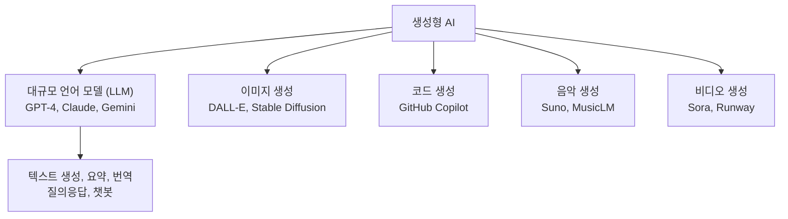
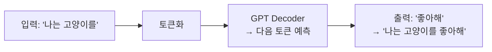
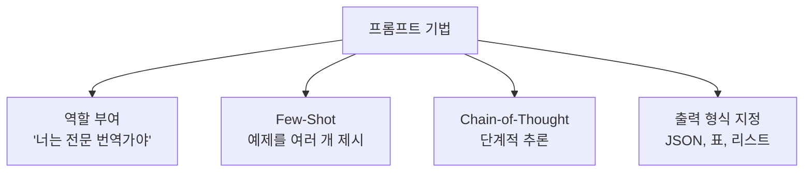
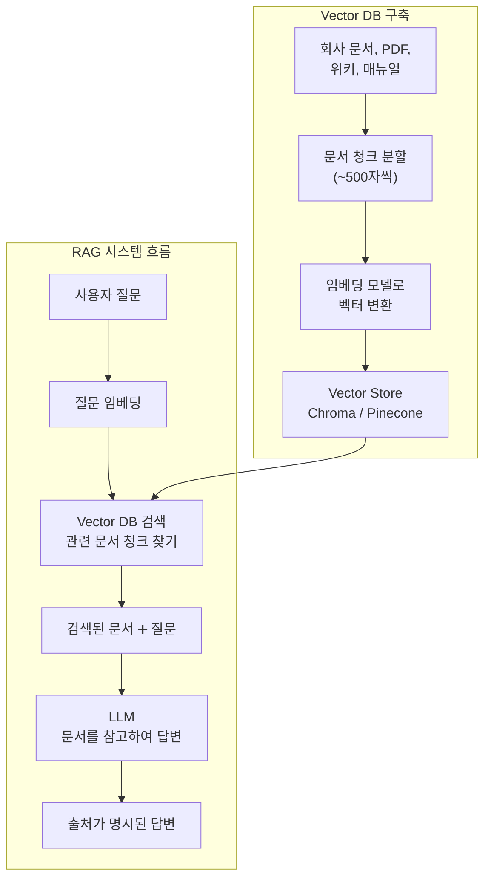
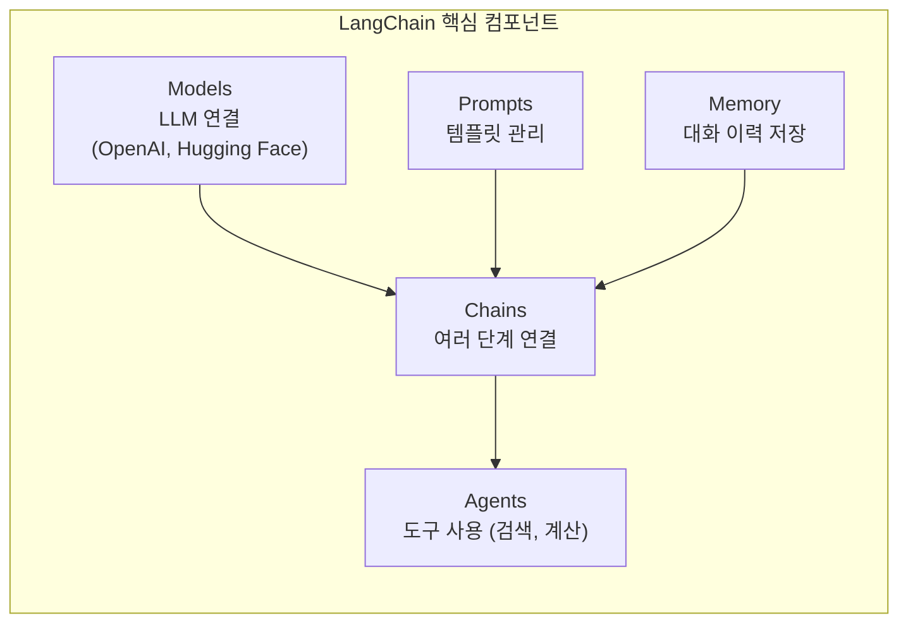
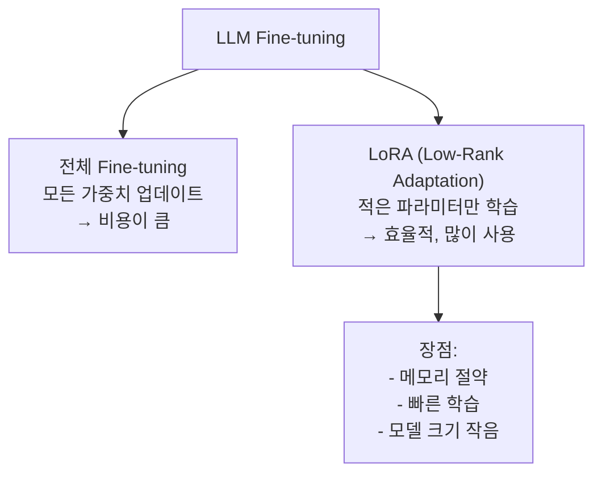
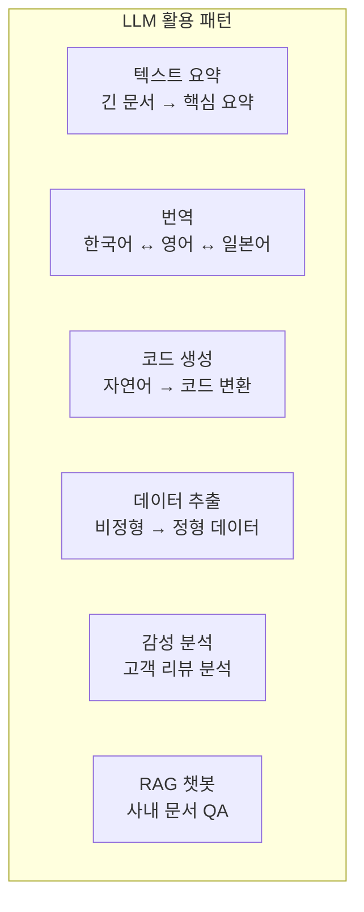

# 12장: 생성형 AI와 LLM

> **🎯 학습 목표**
> - 생성형 AI의 개념과 GPT 아키텍처를 이해합니다.
> - 프롬프트 엔지니어링의 기본 기법을 익힙니다.
> - RAG(Retrieval Augmented Generation)의 구조를 이해합니다.
> - LangChain으로 LLM 기반 애플리케이션을 구축할 수 있습니다.

---

## 12.1 생성형 AI란?

**생성형 AI(Generative AI)** 는 새로운 콘텐츠(텍스트, 이미지, 음악, 코드)를 생성하는 AI입니다.



### 12.1.1 GPT 아키텍처

GPT는 **디코더(Decoder)만 사용**하는 Transformer 기반 언어 모델입니다.



```python
from transformers import pipeline

# GPT-2로 텍스트 생성
generator = pipeline('text-generation', model='gpt2')

prompt = "Once upon a time"
result = generator(
    prompt,
    max_length=50,
    num_return_sequences=1,
    temperature=0.8,
    do_sample=True
)
print(result[0]['generated_text'])

# 파라미터 설명:
# temperature: 0~1 (높을수록 창의적, 낮을수록 보수적)
# max_length: 생성할 최대 토큰 수
# do_sample: 확률적 샘플링 사용 여부
```

---

## 12.2 프롬프트 엔지니어링 (Prompt Engineering)

**프롬프트 엔지니어링**은 LLM에게 원하는 출력을 얻기 위해 입력을 설계하는 기술입니다.



### 12.2.1 기본 프롬프트 예제

```python
# OpenAI API 예제 (개념)
"""
import openai

# 역할 부여
response = openai.ChatCompletion.create(
    model="gpt-4",
    messages=[
        {"role": "system", "content": "너는 친절한 AI 튜터야. 초보자도 이해할 수 있도록 설명해줘."},
        {"role": "user", "content": "머신러닝이 뭐야?"}
    ]
)
print(response.choices[0].message.content)
"""

# 좋은 프롬프트 vs 나쁜 프롬프트
print("=== 나쁜 프롬프트 예시 ===")
print("'코드 짜줘' → 너무 모호함")
print("'기계학습에 대해 알려줘' → 너무 광범위함")

print("\n=== 좋은 프롬프트 예시 ===")
print("'Python으로 선형 회귀를 구현해줘. Scikit-learn을 사용하지 말고 NumPy만 사용해줘.'")
print("→ 구체적, 제약 조건 명시, 목표 명확")
```

### 12.2.2 Few-Shot 프롬프팅

```python
# Few-Shot 예제: 감성 분석
few_shot_prompt = """
텍스트의 감성을 분석해 '긍정' 또는 '부정'으로만 답변해.

텍스트: "이 영화 정말 재미있어! 배우 연기도 훌륭하고."
감성: 긍정

텍스트: "시간 낭비였어. 줄거리도 별로고.."
감성: 부정

텍스트: "음식이 맛있고 서비스도 좋았어요."
감성: 긍정

텍스트: "오늘 날씨가 너무 더워서 힘들다."
감성:
"""

# (실제로는 이 프롬프트를 LLM API에 전송)
print("Few-Shot 프롬프트를 LLM에 전송하면 '부정'이라고 응답할 것입니다.")
```

### 12.2.3 Chain-of-Thought (사고 사슬)

```python
# 단계적 추론 유도
cot_prompt = """
문제: 10개의 사과가 있습니다. 3개를 먹고 2개를 더 샀습니다. 모두 몇 개인가요?

단계별로 생각해보세요:
1. 처음에 10개의 사과가 있었습니다.
2. 3개를 먹었으므로 10 - 3 = 7개가 남았습니다.
3. 2개를 더 샀으므로 7 + 2 = 9개가 되었습니다.
답: 9

문제: 한 반에 학생이 25명 있습니다. 그 중 40%가 여학생입니다. 여학생은 몇 명인가요?

단계별로 생각해보세요:
"""
```

---

## 12.3 RAG (Retrieval Augmented Generation)

RAG는 **외부 지식을 검색하여 LLM의 답변을 보강**하는 기술입니다.



### 왜 RAG가 필요한가?

| 문제점 | 설명 | 해결 (RAG) |
|--------|------|-----------|
| **지식 한계** | LLM은 학습 이후의 정보 모름 | 최신 문서를 검색해서 참고 |
| **환각 (Hallucination)** | 없는 정보를 지어냄 | 실제 문서에 기반한 답변 |
| **사내 정보** | 민감한 내부 정보를 LLM이 모름 | 사내 문서를 검색 |
| **출처 불명** | 왜 그렇게 답변했는지 알 수 없음 | 어떤 문서를 참고했는지 표시 |

### RAG 구현 예제

```python
# LangChain을 사용한 RAG 구현
"""
from langchain.embeddings import OpenAIEmbeddings
from langchain.vectorstores import Chroma
from langchain.text_splitter import RecursiveCharacterTextSplitter
from langchain.llms import OpenAI
from langchain.chains import RetrievalQA

# 1. 문서 로드 및 분할
text_splitter = RecursiveCharacterTextSplitter(chunk_size=500, chunk_overlap=50)
documents = text_splitter.split_documents(raw_docs)

# 2. Vector Store 구축
embeddings = OpenAIEmbeddings()
vectorstore = Chroma.from_documents(documents, embeddings)

# 3. RAG 체인 생성
qa = RetrievalQA.from_chain_type(
    llm=OpenAI(),
    chain_type="stuff",
    retriever=vectorstore.as_retriever(search_kwargs={"k": 3})
)

# 4. 질문
answer = qa.run("회사의 휴가 정책은 무엇인가요?")
print(answer)
"""

# RAG 없이 vs RAG 사용
print("=== RAG 없이 ===")
print("Q: '2024년 회사 매출은?'")
print("A: '죄송합니다. 2024년 데이터는 학습되어 있지 않습니다.'")

print("\n=== RAG 사용 ===")
print("Q: '2024년 회사 매출은?'")
print("A: '2024년 회사 매출은 500억 원입니다.'")
print("   (출처: 2024_연례보고서.pdf, 3페이지)")
```

---

## 12.4 LangChain

**LangChain**은 LLM 애플리케이션 개발을 위한 프레임워크입니다.



### LangChain 예제

```python
# LangChain 기본 사용법
"""
from langchain.llms import OpenAI
from langchain.prompts import PromptTemplate
from langchain.chains import LLMChain

# 1. LLM 설정
llm = OpenAI(temperature=0.7)

# 2. 프롬프트 템플릿
template = """
당신은 {role}입니다.
다음 질문에 답변해주세요: {question}
"""
prompt = PromptTemplate(
    input_variables=["role", "question"],
    template=template
)

# 3. 체인 생성
chain = LLMChain(llm=llm, prompt=prompt)

# 4. 실행
result = chain.run({
    "role": "전문가 AI 튜터",
    "question": "딥러닝이 왜 최근에 성공했나요?"
})
print(result)
"""

# 실제 실행 없이 구조만 설명
print("LangChain 체인 구조:")
print("1. LLM(OpenAI) ← 2. PromptTemplate ← 3. Chain 실행 → 결과")
```

### 메모리 추가

```python
# 대화 기억 추가
"""
from langchain.memory import ConversationBufferMemory
from langchain.chains import ConversationChain

memory = ConversationBufferMemory()
conversation = ConversationChain(
    llm=llm,
    memory=memory
)

conversation.run("내 이름은 철수야.")
conversation.run("내 이름이 뭐라고 생각해?")  # '철수'라고 기억함
"""
```

---

## 12.5 LLM Fine-tuning

Fine-tuning은 **특정 task에 맞게 LLM을 추가 학습**시키는 것입니다.



```python
# Hugging Face Transformers로 Fine-tuning (개념)
"""
from transformers import AutoModelForCausalLM, TrainingArguments, Trainer
from datasets import Dataset

model = AutoModelForCausalLM.from_pretrained("gpt2")

# LoRA 적용 (PEFT 라이브러리)
from peft import LoraConfig, get_peft_model

lora_config = LoraConfig(
    r=8,  # rank
    lora_alpha=32,
    target_modules=["q_proj", "v_proj"],
    lora_dropout=0.1
)

model = get_peft_model(model, lora_config)
model.print_trainable_parameters()  # 전체의 ~0.1%만 학습
"""

print("Fine-tuning 전: 범용 모델")
print("Fine-tuning 후: 특화 모델 (예: 법률, 의료, 고객 응대)")
```

---

## 12.6 LLM 애플리케이션 구축

### 12.6.1 간단한 챗봇

```python
"""
import openai

class SimpleChatbot:
    def __init__(self, system_prompt="너는 친절한 AI 도우미야."):
        self.messages = [{"role": "system", "content": system_prompt}]

    def chat(self, user_input):
        self.messages.append({"role": "user", "content": user_input})

        response = openai.ChatCompletion.create(
            model="gpt-3.5-turbo",
            messages=self.messages,
            temperature=0.7
        )

        assistant_message = response.choices[0].message.content
        self.messages.append({"role": "assistant", "content": assistant_message})
        return assistant_message

# 사용
bot = SimpleChatbot()
print(bot.chat("안녕!"))
print(bot.chat("AI가 뭐야?"))
print(bot.chat("아까 내가 뭐라고 했지?"))  # 메모리가 기억
"""
```

---

## 12.7 LLM 활용 패턴



```python
# LLM 활용 패턴: 요약
summary_prompt = """
다음 텍스트를 3문장으로 요약해줘:

텍스트: "딥러닝은 인공 신경망을 기반으로 한 머신러닝의 하위 분야입니다.
최근 GPU 성능 향상과 대규모 데이터셋의 등장으로 급속도로 발전했습니다.
이미지 인식, 자연어 처리, 음성 인식 등 다양한 분야에서 인간 수준의
성능을 보여주고 있습니다."
"""

# LLM 활용 패턴: 코드 생성
code_prompt = """
Python으로 CSV 파일을 읽고, 각 열의 평균을 계산하는 함수를 작성해줘.
Pandas를 사용하지 말고 기본 Python만 사용해줘.
"""

# LLM 활용 패턴: 데이터 추출
extract_prompt = """
다음 이메일에서 정보를 추출해서 JSON 형식으로 출력해줘:

이메일: "안녕하세요, 홍길동입니다. 다음 주 화요일 오후 3시에
회의실 A에서 프로젝트 회의가 있습니다. 참석 인원은 5명입니다."

출력 형식: {{"name": "", "date": "", "time": "", "location": "", "attendees": int}}
"""
```

---

## 📋 한눈에 정리

| 개념 | 설명 | 핵심 포인트 |
|------|------|-----------|
| **생성형 AI** | 새로운 콘텐츠를 생성하는 AI | GPT, DALL-E 등 |
| **프롬프트 엔지니어링** | LLM 입력 설계 기술 | 역할 부여, Few-Shot, CoT |
| **RAG** | 검색 → LLM 답변 보강 | 외부 지식 활용, 환각 감소 |
| **LangChain** | LLM 앱 개발 프레임워크 | Chain, Agent, Memory |
| **Fine-tuning** | LLM 추가 학습 | LoRA로 효율적 학습 |
| **임베딩** | 텍스트 → 벡터 변환 | 유사도 검색의 기초 |

---

## ✏️ 연습 문제

1. **프롬프트 엔지니어링**의 중요성을 설명하고, 좋은 프롬프트와 나쁜 프롬프트의 예를 각각 1개씩 들어보세요.

2. **RAG**가 필요한 상황 3가지를 설명하세요. RAG가 없을 때 LLM의 한계는 무엇인가요?

3. **Few-Shot 프롬프팅**을 사용하여 제품 리뷰(긍정/부정/중립)를 분류하는 프롬프트를 작성하세요.

4. LangChain의 **Chain**과 **Agent**의 차이는 무엇인가요?

5. **Fine-tuning과 RAG**의 차이점을 설명하고, 각각이 적합한 상황을 쓰세요.

---

## 📝 연습 문제 정답

<details>
<summary>정답 보기</summary>

**1. 프롬프트 엔지니어링의 중요성**
LLM의 출력 품질은 입력 프롬프트에 크게 좌우됩니다. 같은 모델이라도 프롬프트에 따라 결과가 완전히 달라질 수 있습니다.
- **좋은 프롬프트 예:** "너는 전문 번역가야. 다음 문장을 한국어로 번역해줘: 'The quick brown fox jumps over the lazy dog.' 한 가지 번역만 출력해줘."
- **나쁜 프롬프트 예:** "번역해줘" (너무 모호, 어떤 언어로 번역할지, 어떤 형식으로 출력할지 불명확)

**2. RAG가 필요한 상황**
- **최신 정보:** LLM은 학습 후의 정보를 모름. RAG로 최신 뉴스나 문서 검색
- **사내 정보:** LLM은 회사 내부 문서를 모름. RAG로 내부 매뉴얼 검색
- **환각 방지:** LLM이 모르는 정보를 지어내는 현상(Hallucination) 방지
- RAG가 없으면: (1) 지식 cutoff 이후 정보 모름 (2) 내부 정보 모름 (3) 환각으로 잘못된 정보 생성

**3. Few-Shot 프롬프트 (제품 리뷰 분류)**
```
다음 리뷰를 긍정/부정/중립으로 분류해줘.

리뷰: "배송이 정말 빠르고 상품도 좋아요!"
분류: 긍정

리뷰: "상품이 파손되어 왔어요. 환불 요청했습니다."
분류: 부정

리뷰: "그냥 평범해요. 특별히 좋거나 나쁘지 않아요."
분류: 중립

리뷰: "가격 대비 괜찮은 제품입니다."
분류:
```

**4. Chain vs Agent**
- **Chain:** 정해진 순서대로 실행 (결정적). 예: 번역 → 요약 → 출력
- **Agent:** LLM이 상황에 따라 어떤 도구(검색, 계산, API)를 사용할지 스스로 결정 (비결정적)
- Agent는 더 유연하지만 예측 불가능하고 비용이 더 높습니다.

**5. Fine-tuning vs RAG**
- **Fine-tuning:** 모델 자체를 특정 도메인에 맞게 학습시킴. 예: 법률 용어 이해, 의료 지식 습득
  - 적합: 모델의 지식 자체를 바꿔야 할 때, 특정 형식/스타일을 학습시켜야 할 때
- **RAG:** 외부 문서를 검색해서 답변 생성. 모델 자체는 변경되지 않음
  - 적합: 최신 정보가 중요할 때, 사내 문서 참조, 출처 표기가 필요할 때
- 차이점: "모델이 아는 것 자체를 바꾸는 것(Fine-tuning)" vs "필요할 때 문서를 찾아보는 것(RAG)"

</details>

---

> **🔄 다음 장에서는** 실제 AI 개발 워크플로우를 배웁니다. 프로젝트 구조, 실험 관리, 모델 배포, MLOps의 기본 개념을 다룹니다.
