# 13장: AI Agent, MCP, Harness

> **🎯 학습 목표**
> - AI Agent의 개념과 ReAct 패턴을 이해하고 구현할 수 있습니다.
> - Function Calling과 Tool Use의 원리를 이해합니다.
> - MCP(Model Context Protocol)의 구조와 장점을 설명할 수 있습니다.
> - AI Harness의 개념과 LLM/Agent 평가 방법을 익힙니다.
> - API 제공자(Provider)와 토큰(Token) 관리 방법을 익힙니다.

---

## 13.1 AI Agent와 Agentic AI

### 13.1.1 AI Agent란?

**AI Agent**는 LLM이 중심이 되어 **스스로 계획하고, 도구를 사용하며, 결과를 관찰하고, 다음 행동을 결정**하는 자율적 AI 시스템입니다.

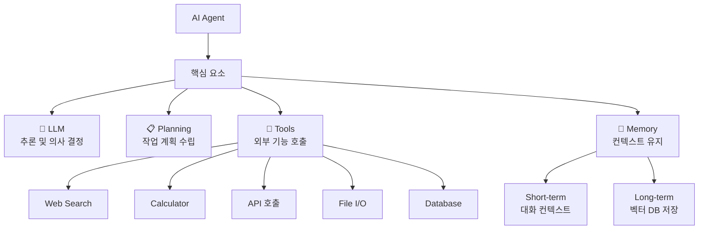

| 구성 요소 | 역할 | 예시 |
|-----------|------|------|
| **LLM** | 추론 엔진, 의사 결정 | GPT-4, Claude |
| **Planning** | 작업을 하위 단계로 분해 | "이메일 보내기" → 주소 확인 → 내용 작성 → 전송 |
| **Tools** | 외부 기능 실행 | 검색, 계산, 파일 읽기, DB 쿼리 |
| **Memory** | 정보 유지 및 관리 | 대화 이력, 선호도 저장 |

### 13.1.2 Agent의 작동 방식

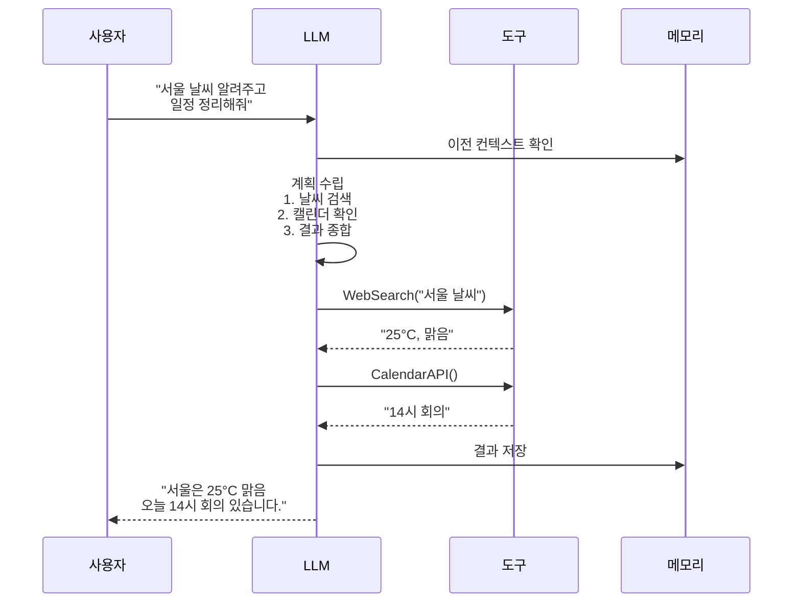

### 13.1.3 ReAct 패턴 (추론 + 행동)

ReAct(Reasoning + Acting)는 **Thought → Action → Observation** 루프를 반복하며 문제를 해결합니다.

```python
# ReAct 패턴 의사 코드
"""
def react_agent(question):
    context = []
    max_steps = 5

    for step in range(max_steps):
        # 1. Thought: 현재 상황 분석
        thought = llm.infer(f"""
        질문: {question}
        지금까지: {context}
        다음에 무엇을 해야 하나요?
        """)

        if "답변:" in thought:
            return thought.split("답변:")[-1]

        # 2. Action: 도구 실행
        action = parse_action(thought)
        observation = execute_tool(action)

        # 3. Observation: 결과 관찰
        context.append(f"Action: {action} → Observation: {observation}")

    return "최대 단계 초과"
"""
```

```python
# ReAct Agent 실제 예제 (OpenAI Function Calling)
"""
import json
from openai import OpenAI

client = OpenAI()

# 도구 정의
tools = [
    {
        "type": "function",
        "function": {
            "name": "get_weather",
            "description": "특정 도시의 현재 날씨 조회",
            "parameters": {
                "type": "object",
                "properties": {
                    "city": {"type": "string", "description": "도시 이름 (한국어)"}
                },
                "required": ["city"]
            }
        }
    },
    {
        "type": "function",
        "function": {
            "name": "calculate",
            "description": "수학 계산 수행",
            "parameters": {
                "type": "object",
                "properties": {
                    "expression": {"type": "string", "description": "수식"}
                },
                "required": ["expression"]
            }
        }
    }
]

messages = [{"role": "user", "content": "서울 날씨가 몇 도인지 알려주고 화씨로 변환해줘"}]

# 1단계: LLM이 도구 호출 결정
response = client.chat.completions.create(
    model="gpt-4",
    messages=messages,
    tools=tools,
    tool_choice="auto"
)

# 2단계: 도구 실행
if response.choices[0].message.tool_calls:
    for tool_call in response.choices[0].message.tool_calls:
        name = tool_call.function.name
        args = json.loads(tool_call.function.arguments)
        if name == "get_weather":
            result = get_weather(args["city"])
        elif name == "calculate":
            result = calculate(args["expression"])
        messages.append({
            "role": "tool",
            "tool_call_id": tool_call.id,
            "content": str(result)
        })

# 3단계: 최종 응답 생성
final = client.chat.completions.create(
    model="gpt-4",
    messages=messages
)
print(final.choices[0].message.content)
# → "서울은 현재 25°C이며, 화씨로 77°F입니다."
"""
```

### 13.1.4 Function Calling / Tool Use

**Function Calling**은 LLM이 사전 정의된 함수(도구)를 호출할 수 있게 하는 기능입니다.

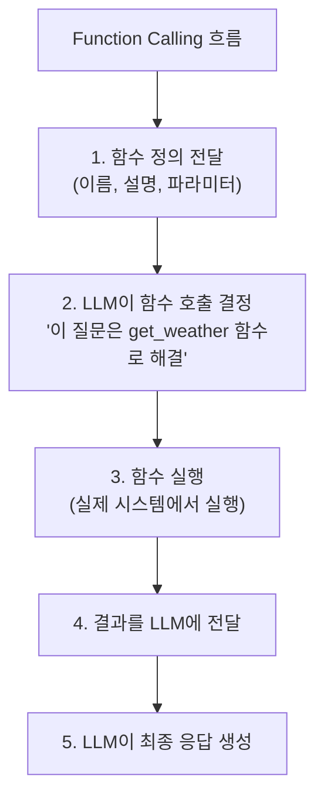

**OpenAI Function Calling vs Claude Tool Use:**

| 기능 | OpenAI | Claude (Anthropic) |
|------|--------|-------------------|
| API 이름 | `tools` / `tool_choice` | `tools` / `tool_choice` |
| 함수 정의 | JSON Schema | JSON Schema |
| 강제 호출 | `tool_choice: "required"` | `tool_choice: {"type": "any"}` |
| 병렬 호출 | 자동 지원 | 수동 구현 필요 |

### 13.1.5 Plan-and-Execute 패턴

복잡한 작업을 **미리 계획**하고 단계별로 실행하는 패턴입니다.

```python
# Plan-and-Execute 의사 코드
"""
def plan_and_execute(goal):
    # 1. 계획 수립
    plan = llm.infer(f"""
    목표: {goal}
    이 목표를 달성하기 위한 단계별 계획을 세워주세요.
    """)
    # 출력: "1. 서울 날씨 검색 → 2. 날씨 데이터 분석 → 3. 옷차림 추천"

    # 2. 단계별 실행
    results = []
    for step in plan.steps:
        result = execute_step(step)
        results.append(result)

        # 중간 점검 및 계획 수정
        if needs_replan(step, result):
            plan = llm.infer(f"현재 진행 상황: {results}. 남은 계획 수정: {plan.remaining}")

    # 3. 최종 결과 종합
    return llm.infer(f"단계별 결과: {results}. 최종 답변 생성")
"""
```

### 13.1.6 Multi-Agent 시스템

여러 Agent가 협력하여 복잡한 문제를 해결합니다.

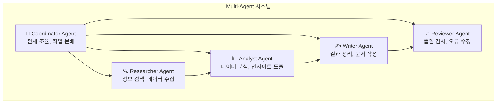

```python
# Multi-Agent 시스템 의사 코드
"""
class AgentTeam:
    def __init__(self):
        self.coordinator = Agent("Coordinator", system_prompt="작업 분배 및 조율")
        self.researcher = Agent("Researcher", tools=[search, fetch])
        self.analyst = Agent("Analyst", tools=[analyze, visualize])
        self.writer = Agent("Writer", tools=[format_doc])

    def execute(self, task):
        # Coordinator가 작업 분배
        plan = self.coordinator.plan(task)

        # Researcher가 정보 수집
        data = self.researcher.run(plan.research_task)

        # Analyst가 분석
        insights = self.analyst.run(data)

        # Writer가 결과 정리
        report = self.writer.run(insights)

        # Coordinator가 최종 검토
        return self.coordinator.review(report)
"""
```

### 13.1.7 Skills (스킬)

**Skills**는 Agent가 재사용할 수 있는 **도구 모음**입니다. 하나의 Skill은 관련된 여러 Tool과 Prompt 템플릿을 그룹화합니다.

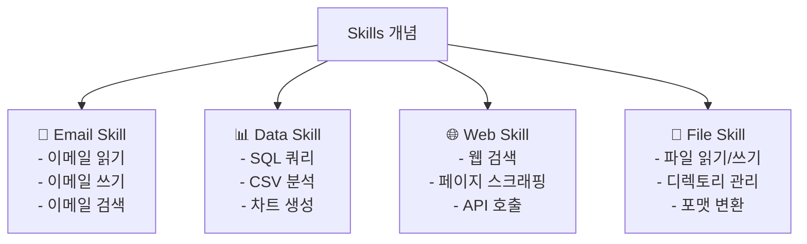

```python
# Skills 의사 코드 (OpenAI Custom GPT / Claude Skills)
"""
# Skill 정의 예시
class EmailSkill:
    name = "email_skill"
    description = "이메일 관련 작업 처리"

    tools = [
        {"name": "read_emails", "description": "받은 편지함 읽기"},
        {"name": "send_email", "description": "이메일 전송"},
        {"name": "search_emails", "description": "이메일 검색"}
    ]

    prompts = {
        "system": "당신은 이메일 전문 도우미입니다.",
        "examples": [
            {"user": "최근 이메일 보여줘", "tool": "read_emails"},
            {"user": "홍길동에게 이메일 보내줘", "tool": "send_email"}
        ]
    }
"""
```

**Skills의 장점:**
- **재사용성:** 같은 Skill을 여러 Agent에서 활용
- **모듈성:** 독립적으로 개발 및 테스트 가능
- **구성성:** 필요에 따라 Skills 조합

---

## 13.2 MCP (Model Context Protocol)

### 13.2.1 MCP란?

**MCP(Model Context Protocol)**는 Anthropic이 제안한 **LLM과 외부 도구/데이터 소스를 연결하는 표준 프로토콜**입니다.

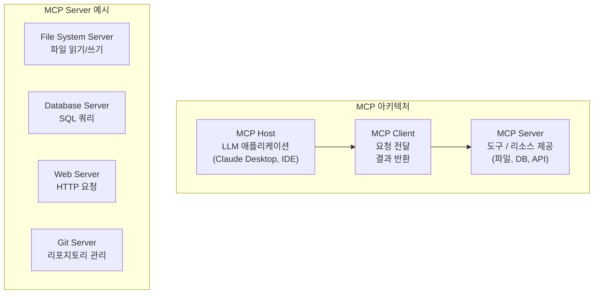

**MCP의 핵심 개념:**

| 용어 | 설명 | 비유 |
|------|------|------|
| **Host** | LLM 앱 (Claude Desktop, VS Code 등) | 웹 브라우저 |
| **Client** | Host와 Server 사이의 연결 | HTTP 클라이언트 |
| **Server** | 도구/리소스 제공자 | 웹 서버 |
| **Resource** | 노출된 데이터 (파일, DB) | REST API 리소스 |
| **Tool** | 실행 가능한 함수 | POST 엔드포인트 |
| **Prompt** | 재사용 가능한 템플릿 | API 템플릿 |

### 13.2.2 MCP 작동 방식

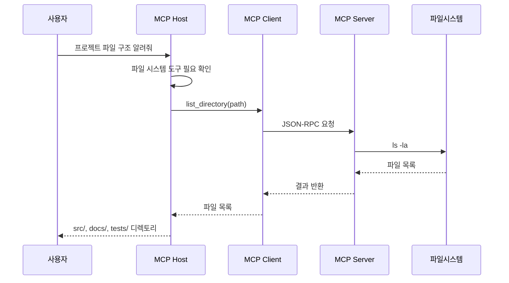

**JSON-RPC 통신 예시:**

```json
// MCP 요청 예시
{
  "jsonrpc": "2.0",
  "method": "tools/call",
  "params": {
    "name": "read_file",
    "arguments": {
      "path": "/project/src/main.py"
    }
  },
  "id": 1
}

// MCP 응답 예시
{
  "jsonrpc": "2.0",
  "result": {
    "content": [
      {
        "type": "text",
        "text": "def main():\n    print('Hello')\n"
      }
    ]
  },
  "id": 1
}
```

### 13.2.3 MCP Server 구현 예제

```python
# 간단한 MCP Server 예제 (개념)
"""
from mcp.server import Server
from mcp.server.stdio import stdio_server
from mcp.types import Tool, TextContent

# MCP Server 생성
server = Server("my-tools")

# 도구 정의
@server.list_tools()
async def list_tools():
    return [
        Tool(
            name="search_files",
            description="파일 검색",
            inputSchema={
                "type": "object",
                "properties": {
                    "pattern": {"type": "string"},
                    "path": {"type": "string"}
                }
            }
        ),
        Tool(
            name="read_file",
            description="파일 내용 읽기",
            inputSchema={
                "type": "object",
                "properties": {
                    "path": {"type": "string"}
                }
            }
        )
    ]

# 도구 실행
@server.call_tool()
async def call_tool(name: str, arguments: dict):
    if name == "search_files":
        result = glob.glob(f"{arguments['path']}/**/{arguments['pattern']}", recursive=True)
        return [TextContent(type="text", text=str(result))]
    elif name == "read_file":
        content = open(arguments["path"]).read()
        return [TextContent(type="text", text=content)]

# 실행
async def main():
    async with stdio_server() as (read, write):
        await server.run(read, write, server.create_initialization_options())
"""
```

### 13.2.4 MCP vs Function Calling vs Skills

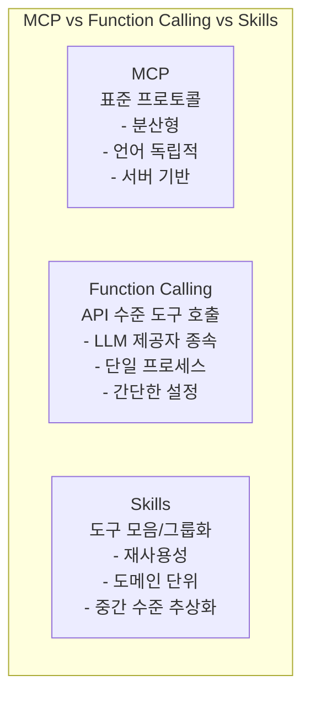

| 특징 | Function Calling | Skills | MCP |
|------|-----------------|--------|-----|
| **수준** | API 수준 | 구현 수준 | 프로토콜 수준 |
| **범위** | 단일 함수 호출 | 관련 도구 그룹 | 전체 시스템 연결 |
| **의존성** | LLM 제공자 종속 | 프레임워크 종속 | 표준 프로토콜 |
| **분산** | 불가능 | 제한적 | 완전 분산형 |
| **사용처** | Agent의 Tool 실행 | Agent 구성 | Host-Server 연결 |

### 13.2.5 MCP의 장점

1. **표준화:** 모든 MCP Server는 동일한 프로토콜로 통신 → 플러그 앤 플레이
2. **보안:** Host가 Server 연결을 관리, 사용자 승인 필요
3. **분산:** Server는 원격으로 실행 가능 (네트워크를 통해 연결)
4. **언어 독립적:** Python, JavaScript, Go 등 어떤 언어로도 Server 작성 가능
5. **동적 발견:** Server가 제공하는 도구/리소스를 런타임에 조회 가능

```
MCP 생태계 예시:
├── Claude Desktop (Host)
│   ├── File System Server (로컬 파일 접근)
│   ├── GitHub Server (이슈, PR 관리)
│   ├── Database Server (SQL 쿼리)
│   ├── Slack Server (메시지 전송)
│   └── Web Search Server (인터넷 검색)
│
├── VS Code Extension (Host)
│   └── File System Server
│
└── Custom App (Host)
    └── Custom MCP Server
```

---

## 13.3 AI Harness (테스트 하네스)

### 13.3.1 Harness란?

**Harness(테스트 하네스)** 는 AI/ML 시스템을 **체계적으로 평가, 테스트, 디버깅**하는 프레임워크입니다.

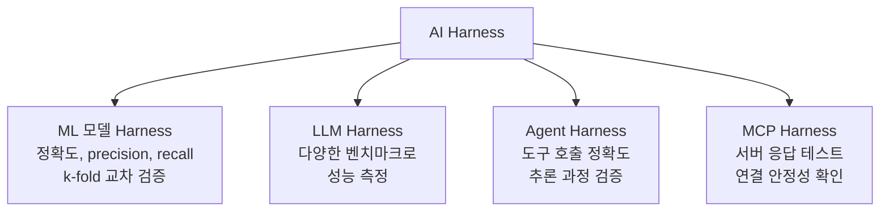

### 13.3.2 Provider와 Token 관리

LLM API를 사용하려면 **API 제공자(Provider)** 와 **인증 토큰(Token/API Key)** 이 필요합니다.

**주요 API 제공자:**

| 제공자 | 대표 모델 | API 가격 (대략) | 특징 |
|---------|----------|----------------|------|
| **OpenAI** | GPT-4, GPT-4o | 입력 $2.50~$10/1M tokens | 가장 널리 사용됨 |
| **Anthropic** | Claude 3.5 Sonnet | 입력 $3/1M tokens | 긴 컨텍스트, 안전성 |
| **Google** | Gemini 1.5 Pro | 입력 $1.25/1M tokens | 1M 토큰 컨텍스트 |
| **Meta (Llama)** | Llama 3 (via Groq/Perplexity) | 무료~$0.59/1M tokens | 오픈소스 |
| **Mistral** | Mistral Large | 입력 $2/1M tokens | 유럽, 다국어 강점 |
| **Hugging Face** | 다양한 오픈 모델 | 추론: 무료~유료 | 오픈소스 모델 허브 |

**대표 모델 상세 비교:**

| 모델 |提供商 제공자 | 출시일 | 컨텍스트 | 특징 |
|------|-----------|--------|---------|------|
| **GPT-4o** | OpenAI | 2024-05 | 128K | 멀티모달(텍스트+이미지+오디오), 빠름 |
| **GPT-4 Turbo** | OpenAI | 2023-11 | 128K | 이전 주력, 안정적 |
| **GPT-3.5 Turbo** | OpenAI | 2023-03 | 16K | 저렴함, 간단한 작업에 적합 |
| **Claude 3.5 Sonnet** | Anthropic | 2024-06 | 200K | 코딩 최강, 안전성 우수 |
| **Claude 3 Haiku** | Anthropic | 2024-03 | 200K | 빠르고 저렴 |
| **Gemini 1.5 Pro** | Google | 2024-02 | 1M | 가장 긴 컨텍스트 |
| **Gemini 1.5 Flash** | Google | 2024-05 | 1M | 빠르고 저렴 |
| **Llama 3.1 405B** | Meta | 2024-07 | 128K | 가장 큰 오픈소스 모델 |
| **Mistral Large** | Mistral | 2024-02 | 32K | 유럽 규제 준수, 다국어 |

**토큰 발급 및 사용:**

```python
# 1. 환경 변수로 토큰 관리 (보안 필수!)
import os

# .env 파일에 저장하고 git에 절대 커밋하지 말 것
# OPENAI_API_KEY=sk-...
# ANTHROPIC_API_KEY=sk-ant-...

os.environ["OPENAI_API_KEY"] = "sk-..."  # 실제로는 .env에서 로드

# python-dotenv 사용 (추천)
"""
from dotenv import load_dotenv
load_dotenv()  # .env 파일에서 환경 변수 로드
api_key = os.getenv("OPENAI_API_KEY")
"""

# 2. OpenAI 예제
from openai import OpenAI
client = OpenAI(api_key=os.getenv("OPENAI_API_KEY"))
response = client.chat.completions.create(
    model="gpt-4o",
    messages=[{"role": "user", "content": "Hello"}]
)

# 3. Anthropic 예제
"""
from anthropic import Anthropic
client = Anthropic(api_key=os.getenv("ANTHROPIC_API_KEY"))
response = client.messages.create(
    model="claude-3-5-sonnet-20240620",
    max_tokens=1000,
    messages=[{"role": "user", "content": "Hello"}]
)
"""
```

**토큰 관리 Best Practice:**

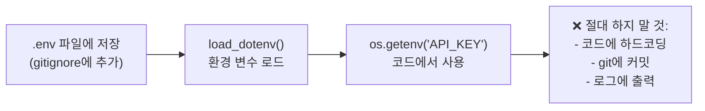

```bash
# .gitignore에 추가 (토큰 유출 방지)
echo ".env" >> .gitignore
echo "*.env" >> .gitignore

# .env 파일 예시
cat > .env << 'EOF'
OPENAI_API_KEY=sk-your-key-here
ANTHROPIC_API_KEY=sk-ant-your-key-here
EOF
```

> **⚠️ 중요:** API 토큰은 **절대** GitHub 등의 공개 저장소에 커밋하지 마세요. 토큰이 유출되면 타인이 사용한 비용이 청구될 수 있습니다. `.env` 파일을 사용하고 `.gitignore`에 반드시 추가하세요.

### 13.3.3 ML Test Harness

ML 모델 학습 시 자동화된 평가 파이프라인입니다.

```python
# ML Test Harness 예제
"""
from sklearn.model_selection import cross_val_score, GridSearchCV
from sklearn.ensemble import RandomForestClassifier
import numpy as np

# 1. Harness: 교차 검증
model = RandomForestClassifier()
scores = cross_val_score(model, X, y, cv=5, scoring='accuracy')
print(f"5-fold CV 정확도: {scores.mean():.3f} +/- {scores.std():.3f}")

# 2. Harness: 하이퍼파라미터 검색
param_grid = {'n_estimators': [50, 100, 200], 'max_depth': [5, 10, None]}
grid = GridSearchCV(model, param_grid, cv=5, scoring='f1')
grid.fit(X_train, y_train)
print(f"최적 파라미터: {grid.best_params_}")
print(f"최고 F1 점수: {grid.best_score_:.3f}")

# 3. Harness: 최종 평가
from sklearn.metrics import classification_report
y_pred = grid.predict(X_test)
print(classification_report(y_test, y_pred))
"""
```

### 13.3.4 LLM Evaluation Harness

LLM의 성능을 객관적으로 측정합니다.

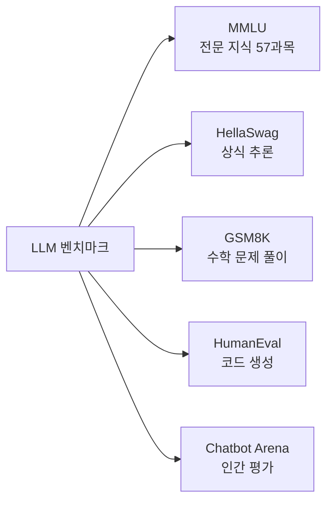

```python
# lm-evaluation-harness 예제 (개념)
"""
# 설치: pip install lm-eval

import lm_eval
from lm_eval.models.huggingface import HFLM

# 1. 모델 로드
model = HFLM("gpt2")

# 2. 벤치마크 실행
results = lm_eval.simple_evaluate(
    model=model,
    tasks=["mmlu", "hellaswag", "gsm8k"],
    num_fewshot=5,
    batch_size=auto
)

# 3. 결과 출력
for task, metrics in results["results"].items():
    print(f"{task}: {metrics['acc']:.3f}")
"""
```

**주요 LLM 평가 도구:**

| 도구 | 용도 | 특징 |
|------|------|------|
| **lm-evaluation-harness** | LLM 벤치마크 평가 | EleutherAI, 200+ tasks |
| **OpenAI Evals** | LLM 응답 평가 | OpenAI 공식, 커스텀 eval |
| **DeepEval** | LLM 앱 테스트 | 단위 테스트 스타일, CI/CD |
| **LangSmith** | LangChain 앱 모니터링 | 추적, 평가, 디버깅 |

### 13.3.5 Agent Test Harness

Agent의 행동을 체계적으로 검증합니다.

```python
# Agent Harness 의사 코드
"""
class AgentHarness:
    def __init__(self, agent):
        self.agent = agent
        self.results = []

    def run_test(self, task, expected_tools=None, expected_answer=None):
        # 1. Agent 실행
        start = time.time()
        response = self.agent.run(task)
        elapsed = time.time() - start

        # 2. 결과 검증
        test_result = {
            "task": task,
            "response": response,
            "time": elapsed,
            "tools_used": extract_tools(response),
            "correct": expected_answer in str(response) if expected_answer else None
        }

        # 3. Assertions
        if expected_tools:
            assert all(t in test_result["tools_used"] for t in expected_tools),
                f"필요 도구 {expected_tools} 누락"

        self.results.append(test_result)
        return test_result

    def summary(self):
        # 전체 테스트 통계
        total = len(self.results)
        passed = sum(1 for r in self.results if r["correct"])
        avg_time = sum(r["time"] for r in self.results) / total
        print(f"통과: {passed}/{total}, 평균 응답 시간: {avg_time:.2f}초")

# 사용
harness = AgentHarness(my_agent)
harness.run_test(
    "서울 날씨 알려줘",
    expected_tools=["get_weather"],
    expected_answer="25°C"
)
harness.summary()
"""
```

### 13.3.6 Harness의 중요성

Harness가 없으면 다음과 같은 문제가 발생합니다:

| 문제 | 설명 | Harness로 해결 |
|------|------|---------------|
| **주관적 평가** | "더 좋아진 것 같아" | 객관적 메트릭으로 측정 |
| **재현 불가** | 지난주 결과와 비교 불가 | 자동화된 반복 테스트 |
| **회귀 미발견** | 새로운 기능이 기존 성능 하락 | CI/CD에서 자동 탐지 |
| **디버깅 어려움** | 어디서 실패했는지 모름 | 단계별 로깅 및 검증 |
| **비교 불가** | 모델 A vs B 객관적 비교 불가 | 동일한 벤치마크로 측정 |

---


## 📋 한눈에 정리

| 개념 | 설명 | 핵심 포인트 |
|------|------|-----------|
| **AI Agent** | 자율적 의사 결정 + 도구 사용 | ReAct, Plan-and-Execute, Multi-Agent |
| **Function Calling** | LLM이 함수 호출 | OpenAI tools, Claude tools |
| **ReAct 패턴** | Thought → Action → Observation 반복 | 추론과 행동의 순환 |
| **Multi-Agent** | 여러 Agent 협력 시스템 | Coordinator, Researcher, Analyst, Writer, Reviewer |
| **Skills** | 도구 모음 그룹화 | 재사용성, 모듈성 |
| **MCP** | 표준 프로토콜 (Host-Client-Server) | 표준화, 분산형, 보안 |
| **AI Harness** | AI 시스템 평가/테스트 프레임워크 | ML/LLM/Agent/MCP Harness |
| **API Provider** | LLM API 제공자 | OpenAI, Anthropic, Google, Meta 등 |
| **Token 관리** | API 인증 키 안전 관리 | .env, gitignore, 환경 변수 |

---

## ✏️ 연습 문제

1. **AI Agent**의 4가지 핵심 구성 요소(LLM, Planning, Tools, Memory)를 설명하고, 각 요소의 역할을 쓰세요.

2. **ReAct 패턴**의 세 가지 단계(Thought/Action/Observation)를 설명하고, Agent가 "서울 날씨 알려주고 화씨로 변환해줘"라는 질문에 어떻게 단계적으로 응답하는지 예를 들어 설명하세요.

3. **Function Calling**과 **MCP**의 차이점을 설명하세요. 어떤 상황에서 MCP가 더 적합한가요?

4. **Multi-Agent 시스템**의 장점과 단점을 설명하세요.

5. **MCP 아키텍처**의 세 가지 구성 요소(Host, Client, Server)를 설명하고, 각각의 역할을 쓰세요.

6. **AI Harness**가 왜 중요한가요? Harness가 없을 때 발생할 수 있는 문제 3가지를 설명하세요.

7. API 토큰을 안전하게 관리하는 방법을 설명하고, 절대 해서는 안 되는 행동을 2가지 이상 쓰세요.

---

## 📝 연습 문제 정답

<details>
<summary>정답 보기</summary>

**1. AI Agent의 4가지 핵심 구성 요소**
- **LLM (추론 엔진):** Agent의 두뇌 역할. 상황 분석, 의사 결정, 계획 수립. GPT-4, Claude 등
- **Planning:** 작업을 하위 단계로 분해. 예: "이메일 보내기" → 주소 확인 → 내용 작성 → 전송
- **Tools:** 외부 기능 실행. 검색, 계산, 파일 읽기, DB 쿼리, API 호출
- **Memory:** 정보 유지 및 관리. 단기(대화 컨텍스트), 장기(벡터 DB 저장)

**2. ReAct 패턴 예시 (서울 날씨 → 화씨 변환)**
- **Thought (추론):** "사용자가 서울 날씨와 화씨 변환을 요청했으므로, 먼저 날씨를 검색해야 함"
- **Action (행동):** WebSearch("서울 현재 온도") 실행 → 결과: "25°C"
- **Observation (관찰):** "검색 결과 서울이 25°C. 이제 계산기 도구가 필요함"
- **Thought:** "25°C를 화씨로 변환: 25 × 9/5 + 32 = 77"
- **Action:** Calculator("25 * 9/5 + 32") 실행 → 결과: 77
- **Final Answer:** "서울은 현재 25°C이며, 화씨로 77°F입니다."

**3. Function Calling vs MCP**
- **Function Calling:** LLM API 수준 기능. 같은 프로세스 내 함수 호출. LLM 제공자 종속. 설정 간단.
- **MCP (Model Context Protocol):** 표준 프로토콜. Host-Client-Server 분산 구조. LLM 제공자 독립. 보안 우수.
- **MCP가 더 적합한 상황:** (1) 여러 앱에서 동일 도구 세트 재사용 (2) 원격 서버 데이터 접근 (3) 다양한 LLM 제공자 전환 (4) 엔터프라이즈 보안 환경

**4. Multi-Agent 시스템 장단점**
- **장점:** 전문화(역할별 특화), 병렬 처리(동시 작업), 모듈성(독립 개발/교체), 확장성(필요시 추가)
- **단점:** 복잡성(통신/조율 어려움), 비용(여러 LLM 호출), 지연 시간(순차 처리), Coordinator 병목

**5. MCP 아키텍처 구성 요소**
- **Host:** LLM 애플리케이션 (Claude Desktop, VS Code 등). 사용자와 직접 상호작용
- **Client:** Host와 Server 사이의 연결. 요청 전달, 결과 반환
- **Server:** 도구/리소스 제공자 (파일 시스템, DB, Web, Git 등). 실제 기능 실행

**6. AI Harness의 중요성**
Harness가 없으면 발생하는 문제:
- **주관적 평가:** "더 좋아진 것 같아"라는 직관에 의존. Harness는 객관적 메트릭 제공
- **재현 불가:** 지난주와 오늘 모델 비교 불가. Harness는 자동화된 반복 테스트로 재현성 보장
- **회귀 미발견:** 새 기능이 기존 성능 하락시켜도 모름. CI/CD에서 자동 탐지
- **디버깅 어려움:** 실패 지점 특정 불가. 단계별 로깅 및 검증으로 정확한 실패 지점 파악

**7. API 토큰 안전 관리**
- **올바른 방법:**
  - `.env` 파일에 토큰 저장, `load_dotenv()`로 로드
  - `.gitignore`에 `.env` 추가하여 git 커밋 방지
  - 환경 변수(`os.getenv()`)를 통해 코드에서 사용
- **절대 하면 안 되는 행동:**
  1. 코드에 API 키를 하드코딩 (`api_key = "sk-..."`)
  2. `.env` 파일을 git에 커밋 (공개 저장소에 토큰 유출)
  3. 로그나 콘솔 출력에 API 키 포함
  4. 프론트엔드 코드에 API 키 포함 (누구나 열람 가능)

</details>

---

> **🔄 다음 장에서는** 실제 AI 개발 워크플로우를 배웁니다. 프로젝트 구조, 실험 관리, 모델 배포, MLOps의 기본 개념을 다룹니다.
