# 13장: AI Agent, MCP, Harness 프로그래밍

> **🎯 학습 목표**
> - AI Agent의 개념과 ReAct 패턴을 이해하고 구현할 수 있습니다.
> - Function Calling과 Tool Use의 원리를 이해합니다.
> - MCP(Model Context Protocol)의 구조와 장점을 설명할 수 있습니다.
> - AI Harness의 개념과 LLM/Agent 평가 방법을 익힙니다.
> - API 제공자(Provider)와 토큰(Token) 관리 방법을 익힙니다.

---

## 👨‍💻 실전 프로젝트: 나만의 AI Agent 만들기

> **도입 질문:** "지금까지 배운 이론을 바탕으로, 실제로 동작하는 AI Agent를 직접 만들어 본다면 어떻게 해야 할까요? LLM이 스스로 판단하여 도구를 호출하고, 결과를 바탕으로 다음 행동을 결정하는 시스템을 단 100줄의 코드로 구현할 수 있을까요?"

이번 실전 프로젝트에서는 지금까지 배운 AI Agent의 이론적 개념을 실제 코드로 구현해 보는 것을 목표로 합니다. 우리는 OpenAI의 Function Calling 기능을 활용하여 날씨 검색과 수학 계산이라는 두 가지 도구를 사용할 수 있는 간단한 ReAct Agent를 처음부터 끝까지 직접 구축할 것입니다. 이 프로젝트를 완료하면 여러분은 AI Agent가 내부적으로 어떻게 동작하는지, LLM이 어떻게 도구 호출을 결정하고 그 결과를 해석하는지를 체계적으로 이해할 수 있을 것입니다. 또한 이 기본 구조를 확장하여 원하는 어떤 도구든 Agent에 추가할 수 있는 능력을 갖추게 될 것입니다.

### 프로젝트 개요

우리가 만들 Agent는 사용자의 자연어 요청을 분석하여 필요에 따라 날씨 검색(Weather Search)과 수학 계산(Calculator)이라는 두 가지 도구를 자율적으로 사용합니다. 예를 들어 사용자가 "서울 날씨가 몇 도인지 알려주고 화씨로 변환해줘"라고 요청하면, Agent는 먼저 `get_weather` 도구를 호출하여 서울의 현재 온도를 가져온 후, `calculate` 도구를 호출하여 섭씨를 화씨로 변환하는 계산을 수행하고, 최종적으로 자연어 응답을 생성합니다. 이러한 과정은 모두 LLM의 추론 능력에 의해 자동으로 결정되며, 개발자는 단지 도구의 정의만 제공하면 됩니다.

```python
# 프로젝트: 나만의 ReAct Agent 만들기
# OpenAI Function Calling을 활용한 간단한 AI Agent

import json
import os
from openai import OpenAI

# ============================================================
# 1단계: API 클라이언트 초기화
# ============================================================
# OpenAI API 키는 환경 변수에서 안전하게 로드합니다.
# 실제 사용 시 .env 파일에 저장하고 절대 코드에 하드코딩하지 마십시오.
client = OpenAI(api_key=os.getenv("OPENAI_API_KEY"))


# ============================================================
# 2단계: 도구(Tool) 함수 구현
# ============================================================
# 각 도구는 실제로 실행될 로직을 가진 Python 함수입니다.
# Agent는 LLM의 판단에 따라 이 함수들을 호출하게 됩니다.

def get_weather(city: str) -> str:
    """
    특정 도시의 현재 날씨 정보를 반환합니다.
    실제 서비스에서는 OpenWeatherMap 등의 API를 연동하지만,
    이 예제에서는 시뮬레이션된 데이터를 사용합니다.
    """
    weather_db = {
        "서울": {"temp": 25, "condition": "맑음", "humidity": 60},
        "부산": {"temp": 22, "condition": "흐림", "humidity": 75},
        "제주": {"temp": 28, "condition": "비", "humidity": 85},
        "뉴욕": {"temp": 18, "condition": "맑음", "humidity": 55},
        "도쿄": {"temp": 20, "condition": "흐림", "humidity": 70},
        "파리": {"temp": 15, "condition": "비", "humidity": 80},
    }
    city_info = weather_db.get(city, {"temp": "N/A", "condition": "알 수 없음", "humidity": "N/A"})
    return f"{city}의 현재 날씨: {city_info['temp']}°C, 조건: {city_info['condition']}, 습도: {city_info['humidity']}%"


def calculate(expression: str) -> str:
    """
    수학 수식을 안전하게 계산하여 결과를 반환합니다.
    eval() 사용 시 보안 위험이 있으므로, 허용된 문자만 필터링합니다.
    실제 프로덕션에서는 ast.literal_eval이나 안전한 수식 파서를 사용하십시오.
    """
    # 안전성 검증: 숫자, 연산자, 공백, 소수점, 괄호만 허용
    allowed_chars = set("0123456789+-*/().% ")
    if not all(c in allowed_chars for c in expression):
        return "오류: 수식에 허용되지 않은 문자가 포함되어 있습니다."
    try:
        result = eval(expression, {"__builtins__": {}}, {})
        return f"{expression} = {result}"
    except Exception as e:
        return f"계산 오류: {str(e)}"


# ============================================================
# 3단계: 도구 정의 (Tool Schema / JSON Schema 형식)
# ============================================================
# 이 스키마는 LLM에게 '어떤 도구가 있고, 어떤 파라미터가 필요한지'를 알려줍니다.
# LLM은 사용자의 질문을 분석하여 이 중 적절한 도구를 선택하고,
# 필요한 파라미터를 JSON 형태로 생성하여 반환합니다.

tools = [
    {
        "type": "function",
        "function": {
            "name": "get_weather",
            "description": "특정 도시의 현재 날씨 정보를 조회합니다. 도시 이름은 한국어로 입력받습니다.",
            "parameters": {
                "type": "object",
                "properties": {
                    "city": {
                        "type": "string",
                        "description": "날씨를 조회할 도시 이름 (예: 서울, 부산, 제주, 뉴욕, 도쿄, 파리)"
                    }
                },
                "required": ["city"]
            }
        }
    },
    {
        "type": "function",
        "function": {
            "name": "calculate",
            "description": "수학 수식을 계산합니다. 사칙연산(+, -, *, /)과 괄호, 퍼센트(%)를 지원합니다.",
            "parameters": {
                "type": "object",
                "properties": {
                    "expression": {
                        "type": "string",
                        "description": "계산할 수학 수식 (예: 25 * 9 / 5 + 32)"
                    }
                },
                "required": ["expression"]
            }
        }
    }
]


# ============================================================
# 4단계: ReAct Agent 코어 로직
# ============================================================
# 이 함수가 바로 Agent의 핵심입니다. 다음과 같은 순서로 동작합니다.
#   Step 1 - Thought:  LLM이 현재 상황을 분석하고 다음 행동을 결정
#   Step 2 - Action:   결정된 도구를 실제로 실행
#   Step 3 - Observation: 실행 결과를 관찰하고 컨텍스트에 추가
#   (필요시 1~3단계를 반복)
#   Step 4 - Final:    최종 응답을 생성하여 사용자에게 반환

def react_agent(user_query: str, max_steps: int = 5) -> str:
    """
    ReAct 패턴을 구현한 AI Agent 함수입니다.
    
    Args:
        user_query: 사용자의 자연어 질문 (예: "서울 날씨 알려주고 화씨로 변환해줘")
        max_steps: 최대 반복 횟수 (무한 루프 방지)
    
    Returns:
        Agent가 생성한 최종 자연어 응답
    """
    # 메시지 이력: 대화의 컨텍스트를 유지합니다.
    # Agent의 'Memory' 구성 요소 역할을 합니다.
    messages = [
        {
            "role": "system",
            "content": (
                "당신은 도구를 사용하여 질문에 답변하는 AI Assistant입니다. "
                "다음 규칙을 반드시 따라주세요:\n"
                "1. 사용자의 질문을 분석하고, 필요한 도구가 있으면 도구를 호출하세요.\n"
                "2. 도구 호출 결과를 바탕으로 답변을 생성하세요.\n"
                "3. 모든 답변은 한국어로 자연스럽게 작성하세요.\n"
                "4. 도구가 필요 없는 질문에는 바로 답변하세요.\n"
                "5. 모르는 질문은 모른다고 말하세요."
            )
        },
        {"role": "user", "content": user_query}
    ]

    for step in range(max_steps):
        print(f"\n{'='*50}")
        print(f"🔄 Step {step + 1}: LLM 추론 중...")
        print(f"{'='*50}")

        # --- Thought 단계: LLM 호출 ---
        # LLM은 현재까지의 대화 컨텍스트를 바탕으로
        # (1) 바로 답변을 생성할지, (2) 도구를 호출할지 결정합니다.
        response = client.chat.completions.create(
            model="gpt-4o",
            messages=messages,
            tools=tools,
            tool_choice="auto",  # LLM이 자율적으로 도구 호출 결정
            temperature=0  # 결정론적 응답을 위해 temperature=0
        )

        assistant_message = response.choices[0].message

        # --- 최종 답변 확인 ---
        # LLM이 도구 호출 없이 직접 답변을 생성한 경우,
        # 더 이상의 반복 없이 결과를 반환합니다.
        if not assistant_message.tool_calls:
            print("✅ 최종 답변 생성 완료")
            return assistant_message.content

        # --- Action 단계: 도구 실행 ---
        # LLM이 하나 이상의 도구 호출을 결정한 경우,
        # 각 도구 호출을 순차적으로 실행합니다.
        messages.append(assistant_message)

        for tool_call in assistant_message.tool_calls:
            function_name = tool_call.function.name
            function_args = json.loads(tool_call.function.arguments)
            
            print(f"🔧 도구 호출: {function_name}({function_args})")

            # 도구 라우팅: 함수 이름에 따라 적절한 실제 함수 실행
            if function_name == "get_weather":
                function_response = get_weather(city=function_args.get("city"))
            elif function_name == "calculate":
                function_response = calculate(expression=function_args.get("expression"))
            else:
                function_response = f"오류: 알 수 없는 도구 '{function_name}'입니다."

            print(f"📊 관찰 결과: {function_response}")

            # --- Observation 단계: 도구 실행 결과를 컨텍스트에 추가 ---
            # 도구의 실행 결과는 'tool' 역할의 메시지로 추가되어,
            # 다음 LLM 호출에서 참조할 수 있습니다.
            messages.append({
                "role": "tool",
                "tool_call_id": tool_call.id,
                "content": function_response
            })

    # 최대 단계 초과 시 안전 장치
    return "죄송합니다. 요청을 처리하는 데 너무 많은 단계가 필요합니다. 질문을 더 간단히 해주세요."


# ============================================================
# 5단계: Agent 실행 및 테스트
# ============================================================

if __name__ == "__main__":
    # 테스트 케이스 1: 도구 두 개를 순차적으로 사용하는 복합 질문
    print("\n" + "★"*50)
    print("테스트 1: 복합 질문 (날씨 검색 + 계산)")
    print("★"*50)
    query1 = "서울 날씨가 몇 도인지 알려주고 화씨로 변환해줘"
    result1 = react_agent(query1)
    print(f"\n📌 사용자: {query1}")
    print(f"🤖 Agent: {result1}")

    # 테스트 케이스 2: 하나의 도구만 필요한 단순 질문
    print("\n" + "★"*50)
    print("테스트 2: 단순 질문 (계산만)")
    print("★"*50)
    query2 = "25 * 9 / 5 + 32 계산해줘"
    result2 = react_agent(query2)
    print(f"\n📌 사용자: {query2}")
    print(f"🤖 Agent: {result2}")

    # 테스트 케이스 3: 도구가 필요 없는 일반 질문
    print("\n" + "★"*50)
    print("테스트 3: 일반 질문 (도구 불필요)")
    print("★"*50)
    query3 = "안녕하세요, 오늘 기분이 어떠신가요?"
    result3 = react_agent(query3)
    print(f"\n📌 사용자: {query3}")
    print(f"🤖 Agent: {result3}")
```

### 프로젝트 실행 결과 예측

위 코드를 실제로 실행하면 다음과 같은 출력을 확인할 수 있을 것입니다. 첫 번째 테스트 케이스에서는 Agent가 두 단계에 걸쳐 순차적으로 도구를 호출하는 모습을 관찰할 수 있습니다. 1단계에서는 `get_weather("서울")`을 호출하여 서울의 현재 온도(25°C)를 가져오고, 2단계에서는 `calculate("25 * 9 / 5 + 32")`를 호출하여 섭씨를 화씨로 변환합니다. 이러한 과정은 모두 LLM이 자율적으로 판단하여 수행하며, 개발자는 단지 도구의 정의만 제공하면 됩니다. 두 번째 테스트는 계산 도구만 필요한 단순한 경우이고, 세 번째 테스트는 인사말과 같이 도구가 전혀 필요 없는 경우입니다. Agent는 상황에 따라 유연하게 도구 호출 여부를 결정합니다.

### 프로젝트 확장 아이디어

이 기본 Agent 구조를 바탕으로 다음과 같은 확장이 가능합니다. 첫째, **새로운 도구 추가**입니다. `get_news`, `search_web`, `get_stock_price` 등의 도구를 추가하려면 도구 함수를 구현하고 tools 목록에 스키마만 추가하면 됩니다. 둘째, **메모리 기능 추가**입니다. 위 예제는 단일 대화만 처리하지만, 메시지 이력을 외부 데이터베이스에 저장하면 장기 기억이 가능한 Agent로 확장할 수 있습니다. 셋째, **Plan-and-Execute 패턴 적용**입니다. 복잡한 작업의 경우 Agent가 먼저 전체 계획을 수립한 후 단계별로 실행하도록 개선할 수 있습니다. 이 프로젝트는 여러분이 앞으로 더 정교한 AI Agent 시스템을 구축할 때 출발점이 될 것입니다.

---

## 13.1 AI Agent와 Agentic AI

> **도입 질문:** "챗봇에게 '서울 여행 계획 세워줘'라고 요청하면, 단순히 답변만 생성하는 것과 실제로 검색하고, 일정을 만들고, 사용자에게 알림을 보내는 것의 차이는 무엇일까요?"

**Agent**는 전통적인 인공지능 시스템과 달리, 단순히 입력에 대한 출력을 생성하는 것을 넘어 스스로 상황을 판단하고 행동을 결정하여 실행하는 능동적인 시스템을 의미합니다. 특히 **LLM(Large Language Model)** 을 기반으로 하는 AI Agent는 언어 이해 능력과 추론 능력을 바탕으로 사용자를 대신하여 복잡한 작업을 수행할 수 있습니다. 이러한 Agent의 개념이 확장되어 **Agentic AI**라는 패러다임이 등장하였는데, 이는 인공지능이 단순한 도구가 아니라 사용자의 목표를 이해하고 이를 달성하기 위해 자율적으로 행동하는 에이전트적 성격을 가져야 한다는 철학을 담고 있습니다. 전통적인 AI 시스템이 질문-응답의 수동적인 패턴을 따랐다면, Agentic AI는 목표 달성을 위해 스스로 판단하고 행동하는 능동적인 패턴을 따릅니다. 이러한 패러다임의 전환은 LLM의 추론 능력이 비약적으로 발전하면서 가능해졌으며, 현재 AI 업계에서 가장 주목받는 연구 방향 중 하나입니다. 방금 실전 프로젝트에서 우리가 직접 구현해 본 ReAct Agent 역시 이러한 Agentic AI 철학을 실제 코드로 구현한 구체적인 사례라고 할 수 있습니다.

### 13.1.1 AI Agent란?

**AI Agent**는 LLM이 중심이 되어 **스스로 계획하고, 도구를 사용하며, 결과를 관찰하고, 다음 행동을 결정**하는 자율적 AI 시스템입니다. 전통적인 규칙 기반 시스템이나 단순한 질의응답 모델과의 가장 큰 차이점은 **자율성(Autonomy)** 과 **목표 지향성(Goal-oriented behavior)** 에 있습니다. 규칙 기반 시스템은 미리 정해진 경로로만 동작하지만, AI Agent는 주어진 목표를 달성하기 위해 스스로 판단하고 행동하며 상황에 따라 전략을 변경할 수 있습니다. 이러한 차이는 특히 예측 불가능한 상황에서 두드러집니다. 규칙 기반 시스템은 미처 정의되지 않은 상황이 발생하면 작동을 멈추지만, AI Agent는 LLM의 추론 능력을 활용하여 새로운 상황에도 유연하게 대처할 수 있습니다. 또한 AI Agent는 단순히 한 번의 응답으로 끝나는 것이 아니라, 목표가 달성될 때까지 여러 단계의 추론과 행동을 반복적으로 수행한다는 점에서 기존 시스템과 근본적으로 다릅니다.

예를 들어 사용자가 "다음 주 제주도 여행 일정 짜줘"라고 요청했다고 가정해 보겠습니다. 기존 LLM은 단순히 제주도 여행에 대한 일반적인 정보를 텍스트로 생성할 것입니다. 그러나 AI Agent는 먼저 제주도의 날씨를 검색하고, 사용자의 캘린더를 확인하여 가능한 날짜를 파악한 후, 항공편과 숙소 정보를 조회하여 구체적인 일정표를 만들어 제공할 수 있습니다. 이 과정에서 Agent는 여러 도구(Tools)를 순차적으로 호출하고, 각 단계의 결과를 바탕으로 다음 행동을 결정합니다. 중요한 것은 Agent가 단순히 미리 정의된 스크립트를 실행하는 것이 아니라, LLM이 각 단계에서 실시간으로 판단하여 최적의 행동을 선택한다는 점입니다. 이는 마치 경험이 풍부한 여행사 직원이 고객의 요구사항을 듣고, 정보를 찾아보고, 최적의 일정을 제안하는 과정과 매우 유사합니다.

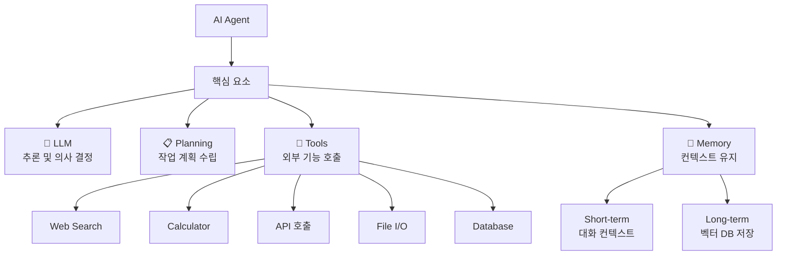

| 구성 요소 | 역할 | 예시 |
|-----------|------|------|
| **LLM** | 추론 엔진, 의사 결정 | GPT-4, Claude |
| **Planning** | 작업을 하위 단계로 분해 | "이메일 보내기" → 주소 확인 → 내용 작성 → 전송 |
| **Tools** | 외부 기능 실행 | 검색, 계산, 파일 읽기, DB 쿼리 |
| **Memory** | 정보 유지 및 관리 | 대화 이력, 선호도 저장 |

위 표에서 볼 수 있듯이 AI Agent는 크게 네 가지 핵심 구성 요소로 이루어집니다. **LLM**은 Agent의 두뇌 역할을 하여 언어 이해와 추론, 의사 결정을 담당합니다. **Planning** 모듈은 복잡한 목표를 더 작은 하위 작업으로 분해하여 체계적인 실행을 가능하게 합니다. **Tools**는 Agent가 외부 세계와 상호작용할 수 있는 창구 역할을 하며, **Memory**는 단기적인 대화 컨텍스트부터 장기적인 지식 저장까지 담당합니다. 이 네 가지 요소는 각각 독립적으로 동작하는 것이 아니라 유기적으로 연결되어 하나의 완전한 Agent 시스템을 구성합니다. 예를 들어, LLM이 Planning을 통해 수립한 계획을 Tools를 통해 실행하고, 그 결과를 Memory에 저장한 후, 다시 LLM이 이 Memory를 참조하여 다음 계획을 수립하는 식의 순환 구조가 만들어집니다. 바로 이 순환 구조가 AI Agent가 단순한 LLM 호출과 다른 점이며, 더 복잡하고 가치 있는 작업을 수행할 수 있는 이유입니다.

> **실무 팁:** Agent를 설계할 때는 모든 구성 요소를 처음부터 구현하기보다는, 먼저 단순한 LLM 호출에 도구 하나만 추가하는 것부터 시작하는 것이 좋습니다. 예를 들어, 검색 기능 하나만 추가한 단순한 Agent를 먼저 만들고, 점진적으로 Planning과 Memory 기능을 확장해 나가는 방식이 효과적입니다. 이는 소프트웨어 개발에서 MVP(Minimum Viable Product) 접근법과 같은 맥락으로, 복잡한 시스템을 한 번에 구축하려다 실패하는 것보다 작은 단위로 성공 경험을 쌓아가는 것이 중요합니다. 우리가 앞서 실전 프로젝트에서 두 개의 도구만으로 시작한 것도 같은 이유입니다.

### 13.1.2 Agent의 작동 방식

AI Agent는 사용자의 요청을 받았을 때 단순히 한 번의 LLM 호출로 응답을 생성하지 않습니다. 대신 여러 번의 추론과 도구 호출을 반복하며 점진적으로 답변을 완성해 나갑니다. 이 과정은 크게 **인지(Cognition) → 계획(Planning) → 실행(Action) → 관찰(Observation)** 의 순환 구조로 이루어집니다. 이러한 순환 구조는 인간이 복잡한 문제를 해결할 때 사용하는 방식과 유사합니다. 인간도 문제를 마주하면 먼저 생각하고, 계획을 세우고, 행동한 후, 그 결과를 관찰하여 다음 행동을 조정합니다. AI Agent는 이와 같은 인간의 문제 해결 방식을 모방한 것이라고 할 수 있으며, 이러한 관점에서 AI Agent를 **인지 아키텍처(Cognitive Architecture)** 의 한 형태로 이해할 수도 있습니다. 앞서 실전 프로젝트에서 구현한 `react_agent` 함수는 이러한 작동 방식을 코드로 정확히 구현한 것입니다. 특히 messages 리스트가 Memory의 역할을 하고, 각 반복 단계가 Thought-Action-Observation의 순환을 나타낸다는 점을 상기해 보십시오.

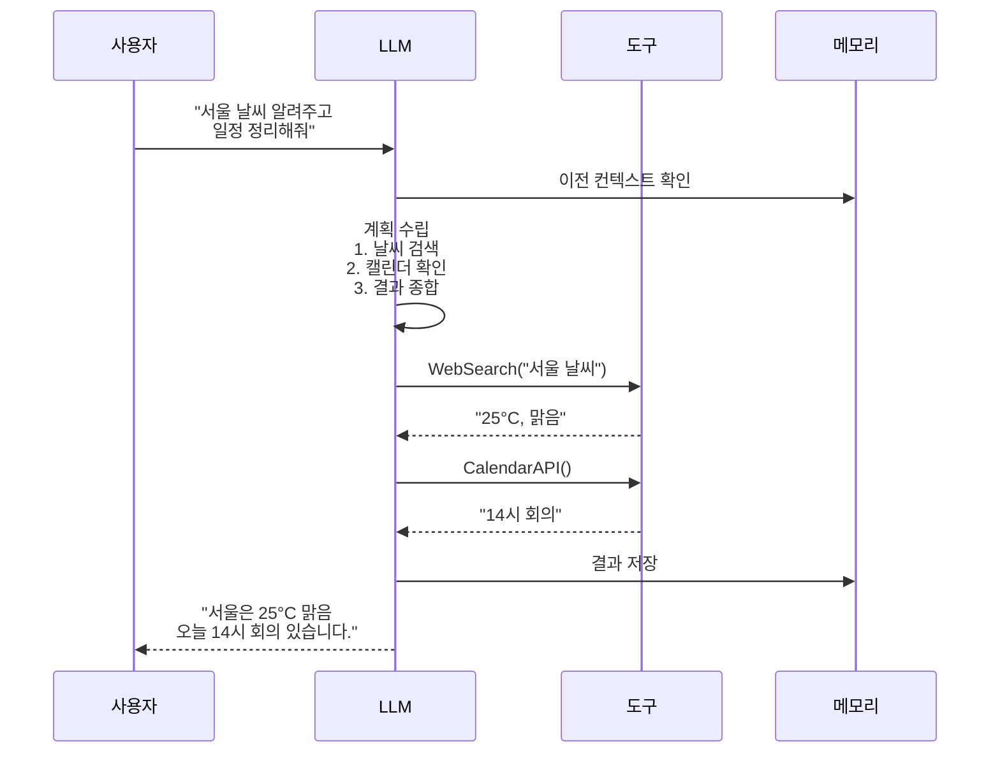

위 시퀀스 다이어그램을 살펴보면 Agent의 작동 방식을 더욱 명확히 이해할 수 있습니다. 사용자가 "서울 날씨 알려주고 일정 정리해줘"라는 복합적인 요청을 보내면, Agent의 LLM은 먼저 메모리에서 이전 대화 컨텍스트를 확인합니다. 그다음 LLM은 내부적으로 작업을 수행하기 위한 계획을 수립하는데, 여기서는 "날씨 검색 → 캘린더 확인 → 결과 종합"이라는 세 단계로 구성됩니다. 계획이 수립되면 LLM은 순차적으로 각 도구를 호출하고, 각 도구의 실행 결과를 관찰한 후 최종 응답을 생성하여 사용자에게 전달합니다. 이러한 과정에서 주목할 점은 LLM이 모든 단계를 스스로 판단하고 결정한다는 것입니다. 즉, 어떤 도구를 언제 호출할지, 호출 결과를 어떻게 해석할지 모두 LLM의 추론 능력에 의존합니다. 따라서 Agent의 성능은 사용하는 LLM의 추론 능력에 크게 좌우되며, 이는 Agent 설계 시 고려해야 할 가장 중요한 요소 중 하나입니다.

### 13.1.3 ReAct 패턴 (추론 + 행동)

ReAct(Reasoning + Acting)는 **Thought → Action → Observation** 루프를 반복하며 문제를 해결하는 패턴입니다. 이 패턴은 2022년 Google 연구팀이 제안한 개념으로, 기존의 단순한 사슬형 추론(Chain-of-Thought) 방식과 달리 추론과 행동이 상호작용하면서 문제를 해결하는 것이 특징입니다. Chain-of-Thought가 "생각만 하는" 방식이라면, ReAct는 "생각하고 행동하는" 방식이라고 할 수 있습니다. 이 차이는 특히 외부 정보가 필요한 문제에서 두드러집니다. 예를 들어, "2024년 하계 올림픽 개최지의 인구는?"이라는 질문에 Chain-of-Thought는 단순히 추론만 하지만, ReAct는 검색 도구를 사용하여 실제 정보를 가져온 후 추론합니다. 즉, ReAct는 언어 모델의 내부 지식(파라미터에 저장된 지식)과 외부 도구를 통한 실시간 정보 수집을 결합하여 더 정확하고 신뢰할 수 있는 답변을 생성합니다. 우리가 실전 프로젝트에서 구현한 `react_agent` 함수의 for 루프가 바로 이 ReAct 패턴의 핵심입니다.

```python
# ReAct 패턴 의사 코드
"""
def react_agent(question):
    context = []
    max_steps = 5

    for step in range(max_steps):
        # 1. Thought: 현재 상황 분석
        thought = llm.infer(f"""
        질문: {question}
        지금까지: {context}
        다음에 무엇을 해야 하나요?
        """)

        if "답변:" in thought:
            return thought.split("답변:")[-1]

        # 2. Action: 도구 실행
        action = parse_action(thought)
        observation = execute_tool(action)

        # 3. Observation: 결과 관찰
        context.append(f"Action: {action} → Observation: {observation}")

    return "최대 단계 초과"
"""
```

위 의사 코드는 ReAct 패턴의 핵심 로직을 보여줍니다. `react_agent` 함수는 사용자의 질문을 입력받아 최대 5단계까지 반복하면서 문제를 해결합니다. 각 반복 단계에서 LLM은 현재까지의 컨텍스트를 바탕으로 다음에 무엇을 해야 할지 추론합니다. 이때 LLM의 출력에 "답변:"이라는 키워드가 포함되어 있으면 최종 답변으로 간주하고 반복을 종료합니다. 만약 도구 호출이 필요하다고 판단되면, LLM의 출력에서 액션을 파싱하여 해당 도구를 실행하고 그 결과를 컨텍스트에 추가합니다. 이렇게 추가된 컨텍스트는 다음 단계의 LLM 입력으로 다시 사용되어 Thought을 형성하는 데 활용됩니다. 이 코드에서 특히 주목할 점은 `context` 리스트가 Agent의 단기 메모리(Short-term Memory) 역할을 한다는 것입니다. 각 단계의 Thought, Action, Observation이 모두 이 컨텍스트에 축적되어 LLM이 전체 문제 해결 과정을 추적할 수 있게 해줍니다.

이제 실제 OpenAI Function Calling을 활용한 ReAct Agent 예제를 살펴보겠습니다. 이 예제에서는 사용자가 "서울 날씨가 몇 도인지 알려주고 화씨로 변환해줘"라고 요청했을 때, Agent가 어떻게 두 개의 도구(get_weather, calculate)를 순차적으로 호출하는지 보여줍니다. 이 코드는 우리가 실전 프로젝트에서 구현한 코드와 동일한 패턴을 따르며, 실제 프로덕션 환경에서 사용되는 방식과 매우 유사합니다.

```python
# ReAct Agent 실제 예제 (OpenAI Function Calling)
"""
import json
from openai import OpenAI

client = OpenAI()

# 도구 정의
tools = [
    {
        "type": "function",
        "function": {
            "name": "get_weather",
            "description": "특정 도시의 현재 날씨 조회",
            "parameters": {
                "type": "object",
                "properties": {
                    "city": {"type": "string", "description": "도시 이름 (한국어)"}
                },
                "required": ["city"]
            }
        }
    },
    {
        "type": "function",
        "function": {
            "name": "calculate",
            "description": "수학 계산 수행",
            "parameters": {
                "type": "object",
                "properties": {
                    "expression": {"type": "string", "description": "수식"}
                },
                "required": ["expression"]
            }
        }
    }
]

messages = [{"role": "user", "content": "서울 날씨가 몇 도인지 알려주고 화씨로 변환해줘"}]

# 1단계: LLM이 도구 호출 결정
response = client.chat.completions.create(
    model="gpt-4",
    messages=messages,
    tools=tools,
    tool_choice="auto"
)

# 2단계: 도구 실행
if response.choices[0].message.tool_calls:
    for tool_call in response.choices[0].message.tool_calls:
        name = tool_call.function.name
        args = json.loads(tool_call.function.arguments)
        if name == "get_weather":
            result = get_weather(args["city"])
        elif name == "calculate":
            result = calculate(args["expression"])
        messages.append({
            "role": "tool",
            "tool_call_id": tool_call.id,
            "content": str(result)
        })

# 3단계: 최종 응답 생성
final = client.chat.completions.create(
    model="gpt-4",
    messages=messages
)
print(final.choices[0].message.content)
# → "서울은 현재 25°C이며, 화씨로 77°F입니다."
"""
```

이 코드에서 중요한 부분은 `tool_choice="auto"` 설정입니다. 이 설정은 LLM이 스스로 판단하여 필요할 때만 도구를 호출하도록 합니다. 첫 번째 LLM 호출(1단계)에서 모델은 사용자의 질문을 분석하여 두 개의 도구가 순차적으로 필요하다고 판단하고, `get_weather`와 `calculate` 함수 호출을 결정합니다. 이때 LLM이 반환하는 `tool_calls`에는 호출할 함수의 이름과 파라미터가 JSON 형식으로 포함되어 있습니다. 2단계에서는 이 파라미터를 실제로 실행하고, 그 결과를 메시지에 추가합니다. 마지막 3단계에서는 도구 실행 결과가 추가된 전체 메시지를 다시 LLM에 전달하여 최종 자연어 응답을 생성합니다. 이 코드 패턴은 실전 프로젝트의 `react_agent` 함수에서도 동일하게 적용되었으며, OpenAI Function Calling을 사용하는 모든 Agent 시스템의 기본 템플릿이라고 할 수 있습니다.

> **실무 팁:** `tool_choice` 파라미터는 "auto" 외에도 "none"(도구 호출 강제 비활성화)과 "required"(무조건 도구 호출) 옵션을 제공합니다. 디버깅 시에는 "required"로 설정하여 Agent가 항상 도구를 호출하도록 강제하면 테스트에 유용합니다. 프로덕션 환경에서는 "auto"를 사용하여 LLM이 필요에 따라 유연하게 대응하도록 하는 것이 일반적입니다. 또한 우리 실전 프로젝트에서는 `temperature=0`을 사용하여 결정론적인 응답을 보장했는데, 이 역시 디버깅과 테스트를 위한 중요한 설정입니다.

### 13.1.4 Function Calling / Tool Use

**Function Calling**은 LLM이 사전 정의된 함수(도구)를 호출할 수 있게 하는 기능입니다. 이는 AI Agent의 가장 핵심적인 기술 중 하나로, LLM이 단순한 텍스트 생성기를 넘어 실제 시스템과 상호작용할 수 있게 해주는 중요한 인터페이스입니다. Function Calling이 없었다면 LLM은 외부 세계와 단절된 채로 자신이 학습한 지식에만 의존할 수밖에 없었을 것입니다. 하지만 Function Calling을 통해 LLM은 실시간 정보 조회, 데이터베이스 질의, 외부 API 호출 등 다양한 동작을 수행할 수 있게 되었습니다. 실전 프로젝트에서 우리가 `tools` 리스트에 JSON 스키마 형식으로 도구를 정의한 것, 그리고 LLM이 이 스키마를 보고 적절한 도구를 선택한 것이 바로 Function Calling의 핵심 원리입니다.

Function Calling의 작동 방식은 다음과 같습니다. 개발자는 먼저 LLM에 사용 가능한 함수들을 정의하여 전달합니다. 각 함수는 이름, 설명, 파라미터(JSON Schema 형식)로 구성됩니다. LLM은 사용자의 질문을 분석하여 이 중 어떤 함수를 호출할지 결정하고, 필요한 파라미터를 JSON 형태로 생성하여 반환합니다. 이후 개발자는 LLM이 반환한 함수 호출 정보를 받아 실제 시스템에서 해당 함수를 실행하고, 그 결과를 다시 LLM에 전달하여 최종 응답을 생성합니다. 이 일련의 과정은 마치 인간이 도구 상자에서 필요한 도구를 꺼내 사용하는 것과 유사합니다. 중요한 점은 LLM이 함수를 **실행하지 않는다**는 것입니다. LLM은 단지 "이 함수를 이런 파라미터로 호출하라"는 결정만 내리고, 실제 실행은 개발자의 코드가 담당합니다. 이는 보안과 제어 측면에서 매우 중요한 설계 결정입니다.

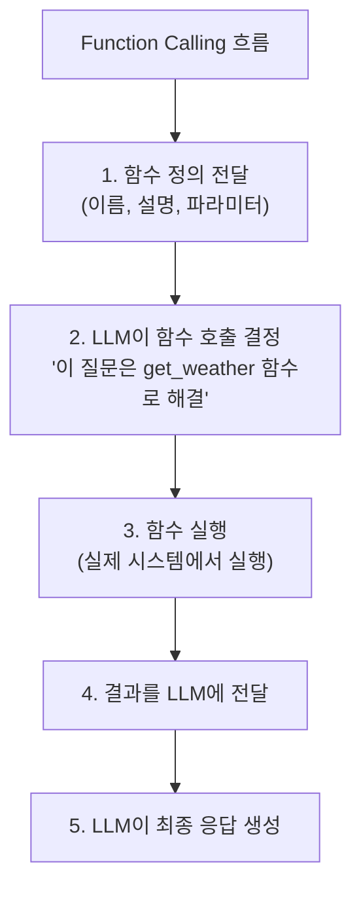

**OpenAI Function Calling vs Claude Tool Use:**

| 기능 | OpenAI | Claude (Anthropic) |
|------|--------|-------------------|
| API 이름 | `tools` / `tool_choice` | `tools` / `tool_choice` |
| 함수 정의 | JSON Schema | JSON Schema |
| 강제 호출 | `tool_choice: "required"` | `tool_choice: {"type": "any"}` |
| 병렬 호출 | 자동 지원 | 수동 구현 필요 |

OpenAI와 Claude는 모두 Function Calling(또는 Tool Use)을 지원하지만 구현 방식에 차이가 있습니다. 가장 큰 차이점은 **병렬 호출(Parallel Tool Calling)** 에 있습니다. OpenAI는 하나의 응답에서 여러 개의 도구 호출을 동시에 반환하는 병렬 호출을 자동으로 지원합니다. 반면 Claude는 기본적으로 한 번에 하나의 도구 호출만 반환하므로, 여러 도구를 순차적으로 호출해야 하는 경우 개발자가 직접 루프를 구현해야 합니다. 이러한 차이는 Agent의 응답 속도와 아키텍처 설계에 영향을 미칠 수 있으므로, 프로젝트의 요구사항에 따라 적절한 LLM 제공자를 선택하는 것이 중요합니다. 예를 들어, 실전 프로젝트에서 우리는 OpenAI를 사용했기 때문에 LLM이 한 번의 응답으로 두 개의 도구 호출(get_weather와 calculate)을 동시에 결정할 수 있었지만, Claude를 사용했다면 별도의 순차 처리 로직이 필요했을 것입니다.

### 13.1.5 Plan-and-Execute 패턴

복잡한 작업을 **미리 계획**하고 단계별로 실행하는 패턴입니다. ReAct 패턴이 "생각하고 행동하고 관찰하는" 것을 단계별로 반복하는 즉각적인 방식이라면, Plan-and-Execute는 작업을 시작하기 전에 전체 계획을 먼저 수립하고, 그 계획에 따라 체계적으로 실행하는 방식입니다. 이는 마치 건축가가 건물을 짓기 전에 설계도를 먼저 그리고, 설계도에 따라 공사를 진행하는 것과 유사합니다. ReAct가 소규모의 단순한 작업에 적합하다면, Plan-and-Execute는 여러 단계가 필요하고 각 단계 간의 의존성이 있는 복잡한 작업에 더 적합합니다. 실전 프로젝트의 Agent는 ReAct 패턴을 사용했지만, 만약 "한 달 치 제주도 여행 계획을 세워줘"와 같은 훨씬 복잡한 요청이 들어온다면 Plan-and-Execute 패턴이 더 효과적일 것입니다. 이 패턴은 작업의 규모와 복잡성에 따라 적절한 전략을 선택할 수 있는 유연성을 제공합니다.

이 패턴의 중요한 특징은 **중간 점검 및 재계획(Mid-course Replanning)** 기능입니다. 즉, 단계를 실행하다가 예상치 못한 상황이 발생하면 계획을 수정할 수 있습니다. 이는 현실 세계의 문제 해결에서 매우 중요한 능력입니다. 예를 들어, "온라인 쇼핑몰에서 노트북 구매하기"라는 작업을 계획했다면 초기 계획은 "1. 노트북 검색 → 2. 가격 비교 → 3. 구매 결정 → 4. 결제"일 것입니다. 하지만 2단계에서 예산을 초과하는 가격만 발견했다면, Agent는 계획을 수정하여 "1. 노트북 검색 → 2. 가격 비교 → 3. 예산 재설정 → 4. 대체 제품 검토 → 5. 구매 결정"과 같이 새로운 계획을 세울 수 있습니다. 이러한 재계획 능력은 Agent가 단순한 스크립트 실행기가 아니라 진정한 의미의 자율적 에이전트임을 보여주는 핵심 요소입니다. ReAct 패턴이 매 단계마다 생각하고 행동하는 미시적 접근(micro-level)이라면, Plan-and-Execute는 전체 작업을 조망하는 거시적 접근(macro-level)이라고 할 수 있습니다.

```python
# Plan-and-Execute 의사 코드
"""
def plan_and_execute(goal):
    # 1. 계획 수립
    plan = llm.infer(f"""
    목표: {goal}
    이 목표를 달성하기 위한 단계별 계획을 세워주세요.
    """)
    # 출력: "1. 서울 날씨 검색 → 2. 날씨 데이터 분석 → 3. 옷차림 추천"

    # 2. 단계별 실행
    results = []
    for step in plan.steps:
        result = execute_step(step)
        results.append(result)

        # 중간 점검 및 계획 수정
        if needs_replan(step, result):
            plan = llm.infer(f"현재 진행 상황: {results}. 남은 계획 수정: {plan.remaining}")

    # 3. 최종 결과 종합
    return llm.infer(f"단계별 결과: {results}. 최종 답변 생성")
"""
```

위 의사 코드에서 확인할 수 있듯이, Plan-and-Execute는 크게 세 단계로 구성됩니다. 첫 번째 단계에서는 LLM이 목표를 달성하기 위한 전체 계획을 수립합니다. 이 계획은 단계별로 구체적인 액션의 형태로 표현됩니다. 두 번째 단계에서는 각 단계를 순차적으로 실행하면서 중간 점검을 수행합니다. `needs_replan` 함수는 현재 단계의 실행 결과가 예상과 다를 경우 계획을 수정해야 한다고 판단하여 새로운 계획을 수립하도록 합니다. 마지막 세 번째 단계에서는 모든 단계가 완료되면 각 단계의 결과를 종합하여 최종 응답을 생성합니다. 이 패턴의 강점은 계획 수립과 실행이 분리되어 있어 각 단계에 최적화된 전략을 적용할 수 있다는 점입니다. 예를 들어, 계획 수립에는 강력한 추론 능력을 가진 LLM(GPT-4, Claude 3.5 Sonnet 등)을 사용하고, 각 단계의 실행에는 더 빠르고 저렴한 LLM(GPT-4o mini, Claude 3 Haiku 등)을 사용하는 식의 최적화가 가능합니다.

### 13.1.6 Multi-Agent 시스템

여러 Agent가 협력하여 복잡한 문제를 해결합니다. 이러한 접근 방식은 인간 조직의 작동 방식에서 영감을 얻었습니다. 하나의 팀이 다양한 전문가들로 구성되어 각자의 역할을 수행하듯이, Multi-Agent 시스템에서는 각 Agent가 특정 역할과 전문성을 가지고 협력합니다. 단일 Agent 시스템이 만능형(Generalist)이라면, Multi-Agent 시스템은 여러 전문가(Specialist)의 팀이라고 할 수 있습니다. 단일 Agent는 하나의 LLM이 모든 작업을 처리해야 하므로 복잡한 작업에서 성능이 저하될 수 있지만, Multi-Agent 시스템은 각 Agent가 자신에게 가장 적합한 작업만 수행하므로 전체적인 성능과 품질이 향상됩니다. 실전 프로젝트에서 구현한 단일 Agent 시스템을 확장하여, Coordinator Agent가 작업을 분석하고 Researcher Agent와 Analyst Agent가 협력하는 구조로 발전시킬 수 있습니다.

Multi-Agent 시스템의 대표적인 구성으로는 **Coordinator Pattern**이 있습니다. Coordinator Agent는 전체 팀의 조율자 역할을 하며, 작업을 분석하여 적절한 Agent에게 배분합니다. Researcher Agent는 정보 검색과 데이터 수집을 담당하고, Analyst Agent는 수집된 데이터를 분석하여 인사이트를 도출합니다. Writer Agent는 분석 결과를 바탕으로 최종 문서를 작성하며, Reviewer Agent는 전체 결과의 품질을 검사합니다. 이러한 역할 분담은 각 Agent가 자신의 전문 분야에 집중할 수 있게 하여 전체적인 결과물의 품질을 향상시킵니다. 또한 각 Agent는 서로 다른 system_prompt와 tools를 가질 수 있으므로, Researcher Agent는 웹 검색 도구를, Analyst Agent는 데이터 시각화 도구를, Writer Agent는 문서 포맷팅 도구를 각각 특화하여 사용할 수 있습니다.

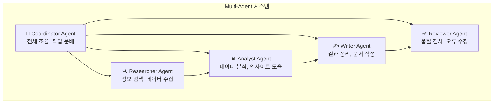

위 다이어그램에서 볼 수 있듯이, Coordinator Agent는 Researcher, Analyst, Writer, Reviewer Agent 모두와 연결되어 작업을 분배하고 결과를 취합합니다. 또한 Researcher → Analyst → Writer → Reviewer로 이어지는 데이터 흐름이 존재하는데, 이는 정보 처리의 파이프라인을 나타냅니다. 각 Agent는 이전 단계의 Agent로부터 결과를 전달받아 자신의 작업을 수행하고, 다음 단계의 Agent에게 결과를 전달합니다. 이 파이프라인 구조는 마치 공장의 조립 라인과 유사합니다. 각 Agent는 자신의 담당 구간에서 최선의 작업을 수행하고, 결과물을 다음 공정으로 넘깁니다. 이때 Coordinator는 전체 공정의 흐름을 모니터링하고, 필요시 병목 현상을 해결하거나 작업 우선순위를 조정하는 역할을 합니다.

```python
# Multi-Agent 시스템 의사 코드
"""
class AgentTeam:
    def __init__(self):
        self.coordinator = Agent("Coordinator", system_prompt="작업 분배 및 조율")
        self.researcher = Agent("Researcher", tools=[search, fetch])
        self.analyst = Agent("Analyst", tools=[analyze, visualize])
        self.writer = Agent("Writer", tools=[format_doc])

    def execute(self, task):
        # Coordinator가 작업 분배
        plan = self.coordinator.plan(task)

        # Researcher가 정보 수집
        data = self.researcher.run(plan.research_task)

        # Analyst가 분석
        insights = self.analyst.run(data)

        # Writer가 결과 정리
        report = self.writer.run(insights)

        # Coordinator가 최종 검토
        return self.coordinator.review(report)
"""
```

위 코드는 Multi-Agent 시스템의 구현 예시입니다. `AgentTeam` 클래스는 Coordinator, Researcher, Analyst, Writer라는 네 개의 Agent를 관리합니다. `execute` 메서드가 호출되면 Coordinator가 먼저 작업을 분석하여 계획을 수립하고, 각 Agent에게 적절한 작업을 할당합니다. 각 Agent는 순차적으로 실행되며 이전 Agent의 출력이 다음 Agent의 입력으로 전달됩니다. 마지막으로 Coordinator가 전체 결과를 검토하여 최종 응답을 생성합니다. 이때 주목할 점은 각 Agent가 자신의 역할에 맞는 system_prompt와 tools를 가지고 있다는 것입니다. Researcher는 검색 도구만, Analyst는 분석 도구만, Writer는 문서 작성 도구만 가지고 있어 각자의 역할에 특화되어 있습니다. 이러한 전문화(Specialization)는 단일 Agent가 모든 도구를 가지고 있을 때 발생할 수 있는 도구 선택의 혼란을 방지하고, 각 Agent가 자신의 역할에 더 집중할 수 있게 해줍니다.

> **실무 팁:** Multi-Agent 시스템을 구현할 때는 각 Agent에 할당하는 system_prompt가 매우 중요합니다. Agent의 역할과 행동 방침을 명확히 정의하는 system_prompt는 Agent의 전문성을 결정합니다. 또한 각 Agent 간의 통신 형식을 표준화하는 것이 중요합니다. 예를 들어, 모든 Agent가 JSON 형식으로 데이터를 주고받도록 설계하면 시스템의 안정성과 확장성이 크게 향상됩니다. 추가로, 각 Agent의 실행 시간을 모니터링하여 특정 Agent가 병목이 되지 않도록 주의해야 합니다. 만약 Writer Agent가 너무 오래 걸린다면, 더 빠른 LLM(GPT-4o mini 등)으로 교체하는 것을 고려할 수 있습니다.

### 13.1.7 Skills (스킬)

**Skills**는 Agent가 재사용할 수 있는 **도구 모음**입니다. 하나의 Skill은 관련된 여러 Tool과 Prompt 템플릿을 그룹화합니다. 이는 소프트웨어 공학에서의 라이브러리(Library)나 모듈(Module) 개념과 유사합니다. 특정 도메인에서 자주 사용되는 도구들의 집합을 하나의 Skill로 정의해 두면, 여러 Agent에서 동일한 Skill을 재사용할 수 있어 개발 효율성이 크게 향상됩니다. 예를 들어, 이메일 관련 도구들(읽기, 쓰기, 검색)을 하나의 Email Skill로 묶어두면, Agent가 이메일 기능이 필요할 때마다 개별 도구를 등록할 필요 없이 Email Skill 하나만 추가하면 됩니다. 실전 프로젝트에서 우리가 사용한 날씨 검색과 계산 도구 역시 하나의 "정보 처리 Skill"로 묶어 재사용할 수 있습니다.

Skill의 개념을 이해하기 위해 비유를 들어보겠습니다. 만약 여러분이 주방에서 요리를 한다고 가정해 봅시다. 칼, 도마, 프라이팬은 각각 개별 도구(Tool)입니다. 하지만 "일식 요리 스킬"은 생선 손질용 칼, 초밥을 싸는 매트, 간장 접시 등 일식 요리에 특화된 도구들의 모음입니다. 마찬가지로 "데이터 분석 Skill"은 SQL 쿼리 도구, CSV 파싱 도구, 차트 생성 도구 등을 하나로 묶어 데이터 분석 작업에 최적화된 도구 세트를 제공합니다. 이 비유에서 중요한 점은 Skill이 단순히 도구의 리스트가 아니라, 해당 도메인의 작업을 효율적으로 수행하기 위해 최적화된 도구의 조합이라는 것입니다. 즉, Skill은 "무슨 도구가 있는지"뿐만 아니라 "이 도메인의 작업을 어떻게 수행하는지"에 대한 지식까지 포함합니다.

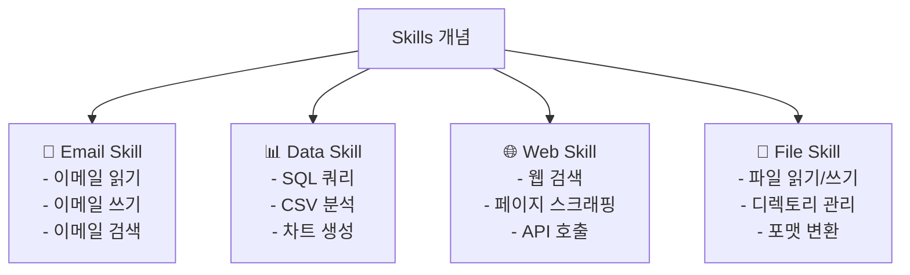

```python
# Skills 의사 코드 (OpenAI Custom GPT / Claude Skills)
"""
# Skill 정의 예시
class EmailSkill:
    name = "email_skill"
    description = "이메일 관련 작업 처리"

    tools = [
        {"name": "read_emails", "description": "받은 편지함 읽기"},
        {"name": "send_email", "description": "이메일 전송"},
        {"name": "search_emails", "description": "이메일 검색"}
    ]

    prompts = {
        "system": "당신은 이메일 전문 도우미입니다.",
        "examples": [
            {"user": "최근 이메일 보여줘", "tool": "read_emails"},
            {"user": "홍길동에게 이메일 보내줘", "tool": "send_email"}
        ]
    }
"""
```

Skills의 핵심적인 장점 중 하나는 Skill이 단순히 도구의 모음일 뿐만 아니라, 해당 도메인에 특화된 **Prompt 템플릿**도 함께 포함할 수 있다는 점입니다. 위 코드에서 `prompts` 필드에 정의된 system prompt와 예시는 Agent가 Email Skill을 사용할 때 더 적절한 판단을 내릴 수 있도록 도와줍니다. 이는 마치 새 직원에게 업무 설명서와 함께 실제 업무 예시를 함께 제공하는 것과 같습니다. 실전 프로젝트에서 우리가 system prompt에 "당신은 도구를 사용하여 질문에 답변하는 AI Assistant입니다"라고 정의한 것처럼, Skills는 이러한 시스템 프롬프트를 도메인별로 최적화하여 제공합니다.

**Skills의 장점:**
- **재사용성:** 같은 Skill을 여러 Agent에서 활용
- **모듈성:** 독립적으로 개발 및 테스트 가능
- **구성성:** 필요에 따라 Skills 조합

이러한 Skills의 개념은 이어서 살펴볼 MCP(Model Context Protocol)와 밀접한 관련이 있습니다. MCP는 이러한 Skills와 도구들을 표준화된 프로토콜로 연결하는 더 상위의 개념이라고 할 수 있습니다. 즉, Skills는 도구들을 논리적으로 그룹화하는 방법론이라면, MCP는 이러한 도구들을 실제로 네트워크를 통해 안전하고 표준화된 방식으로 제공하는 인프라입니다. 두 개념은 상호 보완적이며, 함께 사용될 때 더 큰 시너지를 발휘합니다.

---

## 13.2 MCP (Model Context Protocol)

> **도입 질문:** "여러분이 만든 AI Agent가 파일 시스템에 접근하고, 데이터베이스에 질의하고, Slack 메시지를 보내야 한다면, 매번 새로운 LLM 제공자마다 다른 방식으로 도구를 연결해야 한다고 생각해 보세요. 이러한 비효율을 해결할 표준적인 방법은 없을까요?"

앞서 우리는 AI Agent가 다양한 도구(Tools)를 사용하여 외부 세계와 상호작용한다는 것을 배웠습니다. 실전 프로젝트에서 우리는 OpenAI의 Function Calling 방식으로 두 개의 도구를 직접 코드에 정의하여 사용했습니다. 그러나 각각의 도구 연결 방식은 LLM 제공자마다, 구현 프레임워크마다 조금씩 달랐습니다. OpenAI의 Function Calling 방식과 Claude의 Tool Use 방식은 유사하지만 미묘하게 다른 API를 가지고 있습니다. 이러한 비표준화는 개발자가 여러 LLM 제공자를 전환하거나 여러 도구를 동시에 사용해야 할 때 큰 어려움을 초래합니다. 예를 들어, 실전 프로젝트에서 만든 Agent를 Claude 기반으로 전환하려면 도구 정의 방식과 호출 방식을 완전히 새로 작성해야 합니다. 이러한 문제를 해결하기 위해 등장한 것이 바로 **MCP(Model Context Protocol)** 입니다.

### 13.2.1 MCP란?

**MCP(Model Context Protocol)**는 Anthropic이 제안한 **LLM과 외부 도구/데이터 소스를 연결하는 표준 프로토콜**입니다. 2024년 11월에 공개된 이 프로토콜은 USB-C 포트에 비유할 수 있습니다. USB-C가 다양한 주변 기기를 하나의 표준 포트로 연결하듯이, MCP는 다양한 LLM 애플리케이션과 외부 도구를 하나의 표준 프로토콜로 연결합니다. MCP가 등장하기 전에는 각 LLM 애플리케이션이 외부 도구와 연결하기 위해 자체적인 방식을 구현해야 했습니다. 예를 들어, Claude Desktop과 VS Code가 동일한 파일 시스템 도구를 사용하려면 각각 다른 방식으로 구현해야 했습니다. MCP를 사용하면 한 번 구현한 MCP Server를 모든 MCP Host에서 재사용할 수 있습니다. 이는 실전 프로젝트에서 우리가 도구를 직접 코드에 하드코딩한 방식과 대비됩니다. MCP를 사용했다면, 날씨 검색 도구를 별도의 MCP Server로 구현하고, 이를 Agent 코드와 분리하여 관리할 수 있었을 것입니다. 이러한 분리는 코드의 모듈성과 재사용성을 크게 향상시킵니다.

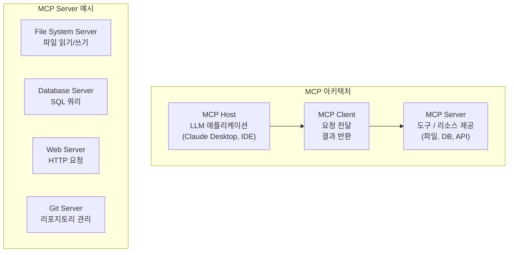

MCP 아키텍처는 크게 세 가지 구성 요소로 이루어집니다. **Host**는 사용자와 직접 상호작용하는 LLM 애플리케이션입니다. Claude Desktop, VS Code Extension, 또는 사용자 정의 애플리케이션이 Host가 될 수 있습니다. **Client**는 Host와 Server 사이의 일대일 연결을 담당하며, JSON-RPC 프로토콜을 통해 요청과 응답을 전달합니다. **Server**는 실제 도구와 리소스를 제공하는 경량 서버로, 각 Server는 특정 기능(파일 시스템, 데이터베이스, 웹 API 등)에 특화되어 있습니다. 예를 들어, File System Server는 파일 읽기/쓰기 기능을 제공하고, Database Server는 SQL 쿼리 기능을 제공합니다. 이 아키텍처는 HTTP 웹의 클라이언트-서버 모델과 매우 유사합니다. 실제로 MCP의 설계는 HTTP의 성공적인 아키텍처 패턴에서 많은 영감을 받았습니다. Host가 웹 브라우저, Client가 HTTP 클라이언트, Server가 웹 서버에 대응된다고 생각하면 이해하기 쉽습니다.

**MCP의 핵심 개념:**

| 용어 | 설명 | 비유 |
|------|------|------|
| **Host** | LLM 앱 (Claude Desktop, VS Code 등) | 웹 브라우저 |
| **Client** | Host와 Server 사이의 연결 | HTTP 클라이언트 |
| **Server** | 도구/리소스 제공자 | 웹 서버 |
| **Resource** | 노출된 데이터 (파일, DB) | REST API 리소스 |
| **Tool** | 실행 가능한 함수 | POST 엔드포인트 |
| **Prompt** | 재사용 가능한 템플릿 | API 템플릿 |

위 표의 비유를 통해 MCP의 각 구성 요소를 더욱 쉽게 이해할 수 있습니다. 웹 브라우징에 비유하자면, Host는 사용자가 사용하는 웹 브라우저(Chrome, Firefox)와 같고, Client는 브라우저의 HTTP 클라이언트, Server는 실제 데이터를 제공하는 웹 서버(Apache, Nginx)와 같습니다. Resource와 Tool은 REST API에서 각각 리소스(데이터)와 엔드포인트(기능)에 대응됩니다. 이러한 비유에서 알 수 있듯이, MCP는 웹의 HTTP 프로토콜과 유사한 역할을 LLM과 도구 사이의 연결에서 수행합니다. 즉, HTTP가 웹의 표준 통신 프로토콜이라면, MCP는 AI Agent 도구 연결의 표준 통신 프로토콜입니다.

### 13.2.2 MCP 작동 방식

MCP의 통신은 **JSON-RPC 2.0** 프로토콜을 기반으로 이루어집니다. JSON-RPC는 JSON 형식을 사용하는 경량 원격 프로시저 호출 프로토콜로, 단순성과 효율성이 특징입니다. MCP가 JSON-RPC를 채택한 이유는 구현의 단순성과 언어 독립성을 유지하기 위해서입니다. HTTP/REST와 같은 다른 프로토콜도 고려할 수 있었지만, JSON-RPC는 함수 호출(function call)의 의미를 가장 자연스럽게 표현할 수 있고, 다양한 언어에서 쉽게 구현할 수 있다는 장점이 있습니다. 또한 JSON-RPC는 상태가 없는(stateless) 프로토콜이므로, 각 요청이 독립적으로 처리되어 서버의 구현이 단순해집니다. 이는 MCP Server가 다양한 언어와 플랫폼에서 일관되게 동작해야 한다는 요구사항과 잘 맞습니다.

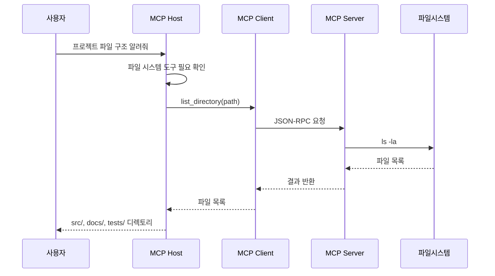

위 시퀀스 다이어그램은 MCP의 실제 통신 흐름을 보여줍니다. 사용자가 "프로젝트 파일 구조 알려줘"라고 요청하면, Host(LLM 애플리케이션)는 이 요청을 처리하기 위해 파일 시스템 도구가 필요하다고 판단합니다. 그러면 Host는 적절한 MCP Client에게 `list_directory(path)` 함수 호출을 요청하고, Client는 이 요청을 JSON-RPC 형식으로 변환하여 MCP Server로 전송합니다. Server는 실제로 `ls -la` 명령을 실행하여 파일 목록을 가져온 후, 결과를 Client를 통해 Host로 반환합니다. 마지막으로 Host는 이 결과를 자연어 응답으로 가공하여 사용자에게 전달합니다. 이 흐름에서 중요한 점은 Host가 직접 파일 시스템에 접근하는 것이 아니라, 항상 MCP Server를 통해 간접적으로 접근한다는 것입니다. 이는 보안과 추상화 측면에서 중요한 설계 원칙입니다.

**JSON-RPC 통신 예시:**

```json
// MCP 요청 예시
{
  "jsonrpc": "2.0",
  "method": "tools/call",
  "params": {
    "name": "read_file",
    "arguments": {
      "path": "/project/src/main.py"
    }
  },
  "id": 1
}

// MCP 응답 예시
{
  "jsonrpc": "2.0",
  "result": {
    "content": [
      {
        "type": "text",
        "text": "def main():\n    print('Hello')\n"
      }
    ]
  },
  "id": 1
}
```

위 JSON-RPC 요청 예시를 자세히 살펴보겠습니다. `"jsonrpc": "2.0"`은 사용 중인 프로토콜 버전을 나타냅니다. `"method": "tools/call"`은 수행할 RPC 메서드 이름으로, 여기서는 도구를 호출하는 것을 의미합니다. `"params"`에는 호출할 도구의 이름(`read_file`)과 인자(`path`)가 포함되어 있습니다. `"id": 1`은 요청과 응답을 매칭하기 위한 고유 식별자입니다. 응답에서 볼 수 있듯이, 결과는 `content` 배열에 담겨 반환되며, 각 content 항목은 `type`과 `text` 필드를 가집니다. 이렇게 표준화된 JSON-RPC 형식을 사용함으로써, Server가 Python으로 구현되었든 JavaScript로 구현되었든, 모든 MCP Host가 동일한 방식으로 통신할 수 있습니다. 이는 실전 프로젝트에서 OpenAI의 독자적인 JSON 스키마 형식을 사용한 것과 대비됩니다. MCP를 사용하면 LLM 제공자가 바뀌더라도 동일한 방식으로 도구를 정의하고 호출할 수 있습니다.

### 13.2.3 MCP Server 구현 예제

이제 실제로 간단한 MCP Server를 구현하는 방법을 살펴보겠습니다. 아래 예제는 Python MCP SDK를 사용하여 파일 검색과 파일 읽기 기능을 제공하는 MCP Server를 구현한 것입니다. MCP Server 구현의 핵심은 크게 세 가지입니다: Server 인스턴스 생성, 제공할 도구 목록 정의, 각 도구의 실제 실행 로직 구현입니다. 실전 프로젝트에서 우리는 도구를 Agent 코드 내부에 직접 정의했지만, MCP Server를 사용하면 도구를 완전히 독립적인 서비스로 분리할 수 있습니다. 이렇게 분리하면 Agent와 도구가 서로 다른 언어로 작성될 수도 있고, 서로 다른 서버에서 실행될 수도 있습니다.

```python
# 간단한 MCP Server 예제 (개념)
"""
from mcp.server import Server
from mcp.server.stdio import stdio_server
from mcp.types import Tool, TextContent

# MCP Server 생성
server = Server("my-tools")

# 도구 정의
@server.list_tools()
async def list_tools():
    return [
        Tool(
            name="search_files",
            description="파일 검색",
            inputSchema={
                "type": "object",
                "properties": {
                    "pattern": {"type": "string"},
                    "path": {"type": "string"}
                }
            }
        ),
        Tool(
            name="read_file",
            description="파일 내용 읽기",
            inputSchema={
                "type": "object",
                "properties": {
                    "path": {"type": "string"}
                }
            }
        )
    ]

# 도구 실행
@server.call_tool()
async def call_tool(name: str, arguments: dict):
    if name == "search_files":
        result = glob.glob(f"{arguments['path']}/**/{arguments['pattern']}", recursive=True)
        return [TextContent(type="text", text=str(result))]
    elif name == "read_file":
        content = open(arguments["path"]).read()
        return [TextContent(type="text", text=content)]

# 실행
async def main():
    async with stdio_server() as (read, write):
        await server.run(read, write, server.create_initialization_options())
"""
```

위 코드를 단계별로 분석해 보겠습니다. 먼저 `Server("my-tools")`로 MCP Server 인스턴스를 생성합니다. 이때 전달하는 문자열("my-tools")은 Server의 이름으로, MCP 프로토콜의 초기화 단계에서 사용됩니다. 다음으로 `@server.list_tools()` 데코레이터가 적용된 함수는 이 Server가 제공하는 모든 도구의 목록을 반환합니다. 각 도구는 `Tool` 객체로 표현되며, name, description, inputSchema의 세 가지 정보를 포함합니다. inputSchema는 JSON Schema 형식으로 작성되며, 도구 호출 시 필요한 파라미터의 타입과 구조를 정의합니다. 이 정보는 Host가 LLM에게 도구 사용 방법을 설명할 때 사용됩니다. 실전 프로젝트의 `tools` 리스트 정의와 비교해 보면, 구조적으로 매우 유사하다는 것을 알 수 있습니다. 실제로 MCP Server의 도구 정의는 우리가 이미 배운 OpenAI Function Calling의 도구 정의와 동일한 JSON Schema 형식을 사용합니다.

실제로 도구가 호출되면 `@server.call_tool()` 데코레이터가 적용된 함수가 실행됩니다. 이 함수는 호출된 도구의 이름(`name`)과 인자(`arguments`)를 받아서, 각 도구에 맞는 로직을 수행하고 그 결과를 `TextContent` 객체 리스트로 반환합니다. `TextContent`는 MCP에서 정의하는 응답 형식 중 하나로, 텍스트 형태의 결과를 표현합니다. 마지막으로 `stdio_server()`는 표준 입출력을 통해 JSON-RPC 메시지를 주고받는 전송 계층을 제공합니다. 이는 로컬에서 실행되는 서버에 적합한 방식이며, 원격 서버의 경우 HTTP/SSE 전송 방식을 사용할 수도 있습니다. 전송 방식의 추상화 덕분에, Server 개발자는 전송 계층의 세부 사항을 신경 쓰지 않고 도구의 비즈니스 로직에 집중할 수 있습니다.

### 13.2.4 MCP vs Function Calling vs Skills

지금까지 우리는 Function Calling, Skills, MCP라는 세 가지 개념을 배웠습니다. 이 세 개념은 모두 AI Agent가 외부 도구와 상호작용할 수 있게 해준다는 공통점이 있지만, 추상화 수준과 적용 범위에서 중요한 차이가 있습니다. 이 절에서는 이 세 개념을 체계적으로 비교하여 각각의 특징과 적합한 사용 상황을 이해하겠습니다. 실전 프로젝트에서 우리는 Function Calling 수준의 도구 연결을 사용했습니다. 이는 간단하고 직관적이지만, LLM 제공자가 바뀌면 코드를 다시 작성해야 하는 한계가 있었습니다. MCP는 이러한 문제를 프로토콜 수준에서 해결합니다.

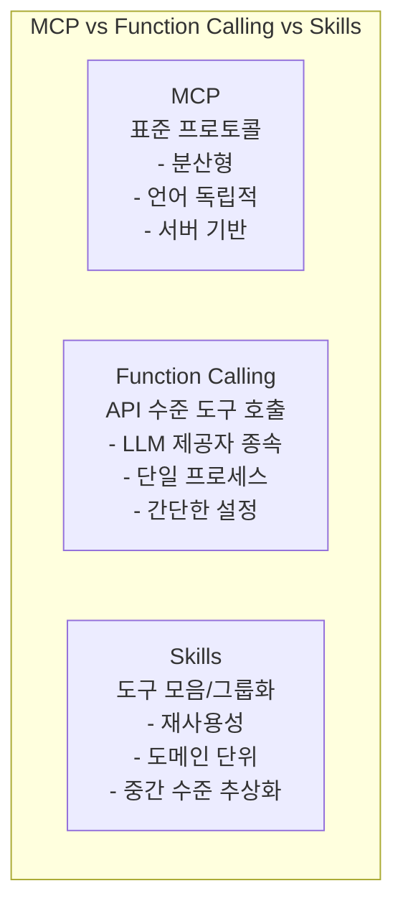

| 특징 | Function Calling | Skills | MCP |
|------|-----------------|--------|-----|
| **수준** | API 수준 | 구현 수준 | 프로토콜 수준 |
| **범위** | 단일 함수 호출 | 관련 도구 그룹 | 전체 시스템 연결 |
| **의존성** | LLM 제공자 종속 | 프레임워크 종속 | 표준 프로토콜 |
| **분산** | 불가능 | 제한적 | 완전 분산형 |
| **사용처** | Agent의 Tool 실행 | Agent 구성 | Host-Server 연결 |

Function Calling은 가장 낮은 수준의 추상화입니다. 이는 LLM API의 한 기능으로, LLM이 함수 호출을 결정하고 그 결과를 받아서 처리할 수 있게 해줍니다. 하지만 Function Calling은 특정 LLM 제공자(OpenAI, Anthropic 등)의 API에 종속적이며, 같은 프로세스 내에서만 동작합니다. Skills는 중간 수준의 추상화로, 관련된 도구들을 논리적으로 그룹화하고 재사용 가능한 단위로 만듭니다. MCP는 가장 높은 수준의 추상화로, 표준 프로토콜을 통해 완전히 분산된 환경에서도 도구를 제공하고 사용할 수 있게 해줍니다. MCP는 LLM 제공자나 구현 언어에 독립적이므로, 한 번 구현한 MCP Server를 모든 LLM 애플리케이션에서 재사용할 수 있습니다. 실전 프로젝트의 관점에서 보면, Function Calling은 "지금 당장 Agent를 빠르게 만드는 방법"이고, MCP는 "확장 가능하고 유지보수하기 쉬운 Agent 시스템을 구축하는 방법"입니다.

> **실무 팁:** 실제 프로젝트에서는 이 세 가지 개념을 함께 사용하는 경우가 많습니다. 예를 들어, MCP Server 내부의 도구 실행 로직은 Function Calling을 사용할 수 있고, MCP Server 자체는 특정 Skill에 특화되어 있을 수 있습니다. 중요한 것은 각 개념이 해결하는 문제의 수준이 다르다는 점을 이해하고, 상황에 맞게 적절히 조합하는 것입니다. 실전 프로젝트에서 Function Calling으로 시작하여, 필요에 따라 MCP로 마이그레이션하는 전략이 효과적일 수 있습니다.

### 13.2.5 MCP의 장점

MCP를 도입하면 다음과 같은 구체적인 장점을 얻을 수 있습니다. 이러한 장점들은 실제 프로덕션 환경에서 AI 시스템을 운영할 때 특히 중요하게 작용합니다. 실전 프로젝트에서 우리가 경험한 Function Calling 방식의 한계(LLM 종속성, 코드 분리 어려움)를 MCP가 어떻게 해결하는지 함께 살펴보겠습니다.

1. **표준화:** 모든 MCP Server는 동일한 프로토콜로 통신 → 플러그 앤 플레이. 마치 USB 장치를 컴퓨터에 연결하면 별도의 드라이버 설치 없이 바로 사용할 수 있는 것처럼, MCP Server를 MCP Host에 연결하면 즉시 사용할 수 있습니다. 이는 개발 시간을 획기적으로 단축시키고, 다양한 도구의 통합을 단순화합니다. 실전 프로젝트에서 우리가 작성한 도구 정의 코드를 MCP Server로 분리하면, 다른 Agent 프로젝트에서도 동일한 Server를 재사용할 수 있습니다.

2. **보안:** Host가 Server 연결을 관리, 사용자 승인 필요. MCP에서는 Host가 각 Server 연결에 대한 승인 권한을 가집니다. 사용자는 어떤 MCP Server가 어떤 기능에 접근할 수 있는지 세밀하게 제어할 수 있습니다. 예를 들어, 파일 시스템 Server는 특정 디렉토리만 접근 가능하도록 제한할 수 있습니다. 이는 실전 프로젝트처럼 모든 도구가 Agent 코드 내부에서 직접 실행되는 방식보다 훨씬 안전합니다. 만약 악의적인 사용자가 Agent를 통해 파일 시스템에 접근하려고 해도, MCP Server의 접근 제어 정책이 이를 차단할 수 있습니다.

3. **분산:** Server는 원격으로 실행 가능 (네트워크를 통해 연결). MCP Server는 로컬에서 실행될 수도 있지만, 원격 서버에서 실행되어 네트워크를 통해 연결될 수도 있습니다. 이는 클라우드 기반의 데이터베이스, API, 혹은 회사 내부 시스템에 접근해야 하는 엔터프라이즈 환경에서 매우 유용합니다. 실전 프로젝트의 날씨 검색 도구를 생각해 보면, 실제 OpenWeatherMap API를 호출하는 MCP Server를 클라우드에 배포하고, 여러 Agent가 이 Server를 공유하여 사용할 수 있습니다.

4. **언어 독립적:** Python, JavaScript, Go 등 어떤 언어로도 Server 작성 가능. MCP는 JSON-RPC를 기반으로 하므로, JSON을 처리할 수 있는 모든 프로그래밍 언어로 Server를 구현할 수 있습니다. 이는 팀의 기술 스택에 맞춰 유연하게 Server를 개발할 수 있음을 의미합니다. 예를 들어, 데이터베이스 팀은 Go로 MCP Server를 작성하고, AI 팀은 Python으로 Host를 작성할 수 있습니다.

5. **동적 발견:** Server가 제공하는 도구/리소스를 런타임에 조회 가능. MCP의 초기화 단계에서 Host는 Server에게 "어떤 도구를 제공할 수 있습니까?"라고 질문하고, Server는 자신이 제공하는 모든 도구의 목록을 반환합니다. 이를 통해 Host는 Server가 제공하는 기능을 동적으로 파악하고, 이를 LLM에게 설명할 수 있습니다. 이는 Server의 기능이 업데이트되어도 Host 측에서 별도의 수정이 필요 없음을 의미합니다. 실전 프로젝트에서는 도구 목록이 코드에 고정되어 있어 변경 시 Agent 코드 자체를 수정해야 했지만, MCP에서는 Server를 업데이트하는 것만으로 충분합니다.

```
MCP 생태계 예시:
├── Claude Desktop (Host)
│   ├── File System Server (로컬 파일 접근)
│   ├── GitHub Server (이슈, PR 관리)
│   ├── Database Server (SQL 쿼리)
│   ├── Slack Server (메시지 전송)
│   └── Web Search Server (인터넷 검색)
│
├── VS Code Extension (Host)
│   └── File System Server
│
└── Custom App (Host)
    └── Custom MCP Server
```

위 생태계 예시에서 볼 수 있듯이, 하나의 Host(Claude Desktop)는 여러 MCP Server(File System, GitHub, Database, Slack, Web Search)에 동시에 연결될 수 있습니다. 또한 하나의 MCP Server(File System Server)는 여러 Host(Claude Desktop, VS Code Extension)에서 재사용될 수 있습니다. 이러한 유연성과 재사용성이 MCP의 핵심 가치라고 할 수 있습니다. 실전 프로젝트의 Agent를 MCP 생태계에 통합하면, 날씨 검색 Server, 계산 Server, 그리고 필요에 따라 추가적인 Server들을 손쉽게 연결하여 더 강력한 Agent 시스템을 구축할 수 있습니다.

> **실무 팁:** MCP Server를 개발할 때는 각 Server가 하나의 책임(단일 책임 원칙)만 가지도록 설계하는 것이 좋습니다. 예를 들어, "파일 시스템과 데이터베이스를 모두 다루는 통합 Server"보다는 "파일 시스템 전용 Server"와 "데이터베이스 전용 Server"를 각각 만드는 것이 유지보수성과 보안 측면에서 더 유리합니다. 이는 실전 프로젝트에서 우리가 `get_weather`와 `calculate`를 별도의 함수로 분리한 것과 같은 원리입니다.

---

## 13.3 AI Harness (테스트 하네스)

> **도입 질문:** "AI 모델을 개발할 때 '더 좋아진 것 같아'라는 주관적인 느낌만으로 성능을 판단한다면, 지난주에 만든 모델과 오늘 만든 모델 중 어떤 것이 더 나은지 어떻게 확신할 수 있을까요? 또, 새로운 기능을 추가했을 때 기존 기능이 망가지지 않았다는 것을 어떻게 보장할 수 있을까요?"

지금까지 우리는 AI Agent와 MCP를 통해 LLM을 활용한 강력한 시스템을 구축하는 방법을 배웠습니다. 실전 프로젝트에서 만든 Agent도 처음에는 잘 동작하지만, 시스템 프롬프트를 수정하거나 새로운 도구를 추가할 때마다 기존 기능이 여전히 올바르게 동작하는지 확인해야 합니다. 그러나 아무리 잘 설계된 시스템이라도 체계적인 테스트와 평가 없이는 그 품질을 보장할 수 없습니다. 특히 AI 시스템은 기존 소프트웨어와 달리 비결정론적인(부분적으로 무작위적인) 특성을 가지므로, 전통적인 단위 테스트만으로는 충분하지 않습니다. 예를 들어, 같은 질문에 대해 LLM이 매번 다른 응답을 생성할 수 있기 때문에, "정확한 답변"의 기준을 정의하고 이를 자동으로 검증하는 방법이 필요합니다. 이러한 문제를 해결하기 위해 등장한 개념이 **AI Harness**입니다.

### 13.3.1 Harness란?

**Harness(테스트 하네스)** 는 AI/ML 시스템을 **체계적으로 평가, 테스트, 디버깅**하는 프레임워크입니다. 하네스(harness)라는 용어는 원래 "마구"나 "도구"를 의미하는데, 소프트웨어 테스트에서는 테스트 대상 시스템을 제어하고 관찰하기 위한 장치를 의미합니다. AI Harness의 핵심 가치는 **객관성(Objectivity)**, **재현성(Reproducibility)**, **자동화(Automation)** 에 있습니다. 객관성은 주관적인 느낌이 아닌 정량적 메트릭으로 성능을 측정하는 것을 의미하고, 재현성은 동일한 조건에서 동일한 테스트를 반복하여 일관된 결과를 얻을 수 있음을 의미하며, 자동화는 CI/CD 파이프라인에 통합하여 코드 변경 시 자동으로 테스트가 실행되도록 하는 것을 의미합니다. 실전 프로젝트의 Agent에도 Harness를 적용하면, "서울 날씨 알려줘"라는 질문에 `get_weather` 도구가 항상 호출되는지, 응답에 항상 온도 정보가 포함되는지를 자동으로 검증할 수 있습니다.

AI Harness는 평가 대상에 따라 크게 네 가지 유형으로 구분됩니다. ML 모델의 정확도와 같은 전통적인 머신러닝 메트릭을 평가하는 **ML Model Harness**, LLM의 다양한 벤치마크 성능을 측정하는 **LLM Harness**, Agent의 도구 호출 정확성과 추론 과정을 검증하는 **Agent Harness**, 그리고 MCP Server의 응답 정확성과 연결 안정성을 확인하는 **MCP Harness**가 있습니다. 이 네 가지 Harness 유형은 AI 시스템 개발의 서로 다른 단계에서 사용됩니다. ML Model Harness는 모델 개발 단계에서, LLM Harness는 모델 선택 단계에서, Agent Harness는 Agent 개발 단계에서, MCP Harness는 인프라 구축 단계에서 각각 활용됩니다.

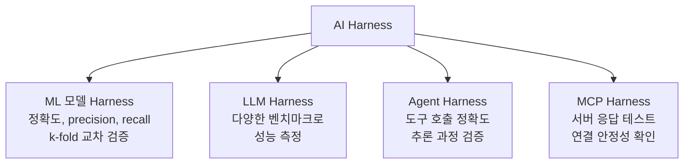

### 13.3.2 Provider와 Token 관리

AI 시스템을 구축할 때 가장 먼저 해결해야 할 실무적인 과제는 **LLM API 제공자(Provider) 선택**과 **인증 토큰(Token/API Key)의 안전한 관리**입니다. 이는 AI 시스템의 기반이 되는 인프라 구성 요소로, 올바른 선택과 관리는 시스템의 비용, 성능, 보안에 직접적인 영향을 미칩니다. LLM API 제공자를 선택할 때는 모델의 성능뿐만 아니라, 가격, 컨텍스트 길이, 지원 언어, 규제 준수 여부 등 다양한 요소를 종합적으로 고려해야 합니다. 실전 프로젝트에서 우리는 OpenAI를 사용했지만, 실제 프로덕션 환경에서는 여러 제공자를 비교하여 프로젝트에 가장 적합한 것을 선택해야 합니다. 예를 들어, 긴 문서 처리가 필요한 작업에는 Gemini 1.5 Pro(100만 토큰 컨텍스트)가 적합하고, 비용이 중요한 요소라면 Llama 3(Groq, 무료~저렴)를 고려할 수 있습니다.

**주요 API 제공자:**

| 제공자 | 대표 모델 | API 가격 (대략) | 특징 |
|---------|----------|----------------|------|
| **OpenAI** | GPT-4, GPT-4o | 입력 $2.50~$10/1M tokens | 가장 널리 사용됨 |
| **Anthropic** | Claude 3.5 Sonnet | 입력 $3/1M tokens | 긴 컨텍스트, 안전성 |
| **Google** | Gemini 1.5 Pro | 입력 $1.25/1M tokens | 1M 토큰 컨텍스트 |
| **Meta (Llama)** | Llama 3 (via Groq/Perplexity) | 무료~$0.59/1M tokens | 오픈소스 |
| **Mistral** | Mistral Large | 입력 $2/1M tokens | 유럽, 다국어 강점 |
| **Hugging Face** | 다양한 오픈 모델 | 추론: 무료~유료 | 오픈소스 모델 허브 |

**대표 모델 상세 비교:**

| 모델 | 제공자 | 출시일 | 컨텍스트 | 특징 |
|------|--------|--------|---------|------|
| **GPT-4o** | OpenAI | 2024-05 | 128K | 멀티모달(텍스트+이미지+오디오), 빠름 |
| **GPT-4 Turbo** | OpenAI | 2023-11 | 128K | 이전 주력, 안정적 |
| **GPT-3.5 Turbo** | OpenAI | 2023-03 | 16K | 저렴함, 간단한 작업에 적합 |
| **Claude 3.5 Sonnet** | Anthropic | 2024-06 | 200K | 코딩 최강, 안전성 우수 |
| **Claude 3 Haiku** | Anthropic | 2024-03 | 200K | 빠르고 저렴 |
| **Gemini 1.5 Pro** | Google | 2024-02 | 1M | 가장 긴 컨텍스트 |
| **Gemini 1.5 Flash** | Google | 2024-05 | 1M | 빠르고 저렴 |
| **Llama 3.1 405B** | Meta | 2024-07 | 128K | 가장 큰 오픈소스 모델 |
| **Mistral Large** | Mistral | 2024-02 | 32K | 유럽 규제 준수, 다국어 |

API 제공자를 선택할 때 고려해야 할 요소 중 하나는 **토큰 가격(Token Pricing)** 입니다. LLM API는 일반적으로 입력 토큰과 출력 토큰을 각각 다른 가격으로 청구합니다. 예를 들어, GPT-4o의 경우 입력 토큰보다 출력 토큰의 가격이 3~4배 더 비싸므로, 긴 응답을 생성하는 작업에서는 출력 토큰 비용을 고려해야 합니다. 또한, 컨텍스트 길이도 중요한 요소입니다. Gemini 1.5 Pro는 100만 토큰의 컨텍스트를 지원하여 매우 긴 문서를 한 번에 처리할 수 있지만, Mistral Large는 32K로 상대적으로 짧은 컨텍스트를 제공합니다. 따라서 프로젝트의 요구사항에 따라 적절한 균형을 찾는 것이 중요합니다. 실전 프로젝트의 Agent를 프로덕션에 배포할 때는, 각 요청당 평균 토큰 사용량을 모니터링하고 예상 비용을 계산하는 것이 필수적입니다.

**토큰 발급 및 사용:**

```python
# 1. 환경 변수로 토큰 관리 (보안 필수!)
import os

# .env 파일에 저장하고 git에 절대 커밋하지 말 것
# OPENAI_API_KEY=sk-...
# ANTHROPIC_API_KEY=sk-ant-...

os.environ["OPENAI_API_KEY"] = "sk-..."  # 실제로는 .env에서 로드

# python-dotenv 사용 (추천)
"""
from dotenv import load_dotenv
load_dotenv()  # .env 파일에서 환경 변수 로드
api_key = os.getenv("OPENAI_API_KEY")
"""

# 2. OpenAI 예제
from openai import OpenAI
client = OpenAI(api_key=os.getenv("OPENAI_API_KEY"))
response = client.chat.completions.create(
    model="gpt-4o",
    messages=[{"role": "user", "content": "Hello"}]
)

# 3. Anthropic 예제
"""
from anthropic import Anthropic
client = Anthropic(api_key=os.getenv("ANTHROPIC_API_KEY"))
response = client.messages.create(
    model="claude-3-5-sonnet-20240620",
    max_tokens=1000,
    messages=[{"role": "user", "content": "Hello"}]
)
"""
```

API 토큰을 안전하게 관리하는 가장 중요한 원칙은 **토큰을 코드에 하드코딩하지 않는 것**입니다. 위 예제에서는 환경 변수를 통해 API 키를 안전하게 관리하는 방법을 보여줍니다. `.env` 파일에 API 키를 저장하고, `python-dotenv` 라이브러리의 `load_dotenv()` 함수로 이 파일을 로드한 후, `os.getenv()`를 통해 환경 변수에서 API 키를 읽어옵니다. 이 방식의 장점은 `.env` 파일을 `.gitignore`에 추가하면 API 키가 Git 저장소에 커밋되는 것을 방지할 수 있다는 점입니다. 실전 프로젝트에서도 이와 동일한 방식으로 `OPENAI_API_KEY`를 환경 변수에서 로드하였습니다. 이는 모든 AI 프로젝트에서 반드시 따라야 할 보안 원칙입니다.

**토큰 관리 Best Practice:**

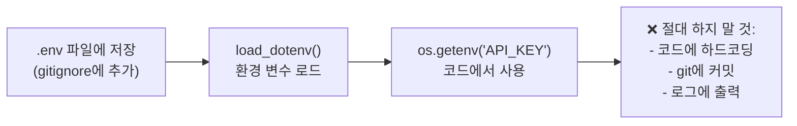

```bash
# .gitignore에 추가 (토큰 유출 방지)
echo ".env" >> .gitignore
echo "*.env" >> .gitignore

# .env 파일 예시
cat > .env << 'EOF'
OPENAI_API_KEY=sk-your-key-here
ANTHROPIC_API_KEY=sk-ant-your-key-here
EOF
```

> **⚠️ 중요:** API 토큰은 **절대** GitHub 등의 공개 저장소에 커밋하지 마세요. 토큰이 유출되면 타인이 사용한 비용이 청구될 수 있습니다. `.env` 파일을 사용하고 `.gitignore`에 반드시 추가하세요.

### 13.3.3 ML Test Harness

ML Test Harness는 전통적인 머신러닝 모델의 학습 과정을 자동화된 방식으로 평가하는 파이프라인입니다. 이는 가장 오래된 형태의 AI Harness로, scikit-learn, TensorFlow, PyTorch 등의 머신러닝 프레임워크와 함께 발전해 왔습니다. ML Test Harness의 핵심 목표는 모델의 **일반화 성능(Generalization Performance)** 을 객관적으로 측정하는 것입니다. 일반화 성능이란 모델이 학습에 사용되지 않은 새로운 데이터에 대해 얼마나 잘 예측하는지를 의미하며, 이는 머신러닝에서 가장 중요한 평가 기준입니다. ML Test Harness는 이 일반화 성능을 체계적으로 측정하고, 모델이 단순히 학습 데이터를 암기하는 과적합(Overfitting) 상태에 빠지지 않았는지 확인합니다.

ML Test Harness가 없다면 모델 개발자는 단순히 학습 데이터에 대한 성능만을 확인하게 되는데, 이는 과적합(Overfitting)의 위험이 있습니다. 과적합은 모델이 학습 데이터에 지나치게 최적화되어 새로운 데이터에 대한 성능이 떨어지는 현상입니다. ML Test Harness는 교차 검증(Cross-Validation)과 같은 기법을 자동화하여 이러한 과적합을 탐지하고 방지합니다. 예를 들어, k-fold 교차 검증은 데이터를 k개의 폴드로 나누어, k-1개로 학습하고 1개로 평가하는 과정을 k번 반복함으로써 모델의 일반화 성능을 더 정확하게 추정합니다. 이는 실전 프로젝트에서 Agent의 성능을 평가할 때도 유사한 원리가 적용됩니다. 단일 테스트 케이스만으로 Agent의 성능을 판단하는 것이 아니라, 다양한 테스트 케이스에 걸쳐 일관된 성능을 확인해야 합니다.

```python
# ML Test Harness 예제
"""
from sklearn.model_selection import cross_val_score, GridSearchCV
from sklearn.ensemble import RandomForestClassifier
import numpy as np

# 1. Harness: 교차 검증
model = RandomForestClassifier()
scores = cross_val_score(model, X, y, cv=5, scoring='accuracy')
print(f"5-fold CV 정확도: {scores.mean():.3f} +/- {scores.std():.3f}")

# 2. Harness: 하이퍼파라미터 검색
param_grid = {'n_estimators': [50, 100, 200], 'max_depth': [5, 10, None]}
grid = GridSearchCV(model, param_grid, cv=5, scoring='f1')
grid.fit(X_train, y_train)
print(f"최적 파라미터: {grid.best_params_}")
print(f"최고 F1 점수: {grid.best_score_:.3f}")

# 3. Harness: 최종 평가
from sklearn.metrics import classification_report
y_pred = grid.predict(X_test)
print(classification_report(y_test, y_pred))
"""
```

위 코드는 ML Test Harness의 전형적인 워크플로우를 보여줍니다. 첫 번째 단계에서는 **k-fold 교차 검증**을 수행하여 모델의 기본 성능을 평가합니다. 여기서는 5-fold 교차 검증을 사용하여 데이터를 5개로 나누고, 4개로 학습하고 1개로 평가하는 과정을 5번 반복합니다. 이 과정을 통해 얻은 5개의 성능 점수의 평균과 표준편차는 모델의 일반화 성능에 대한 신뢰할 수 있는 추정치를 제공합니다. 두 번째 단계에서는 **그리드 서치(Grid Search)** 를 통해 최적의 하이퍼파라미터 조합을 찾습니다. `param_grid`에 다양한 파라미터 값을 지정하면, GridSearchCV가 모든 조합을 시도하여 가장 좋은 성능을 내는 파라미터를 찾아줍니다. 마지막 단계에서는 찾은 최적 파라미터로 학습된 모델을 테스트 세트에서 최종 평가하고, 클래스별 precision, recall, f1-score를 포함한 상세한 분류 보고서를 출력합니다. 이 체계적인 평가 과정은 실전 프로젝트의 Agent에도 적용할 수 있습니다. 예를 들어, 다양한 system_prompt를 하이퍼파라미터처럼 실험하고, 각 조합의 성능을 테스트 케이스로 측정하여 최적의 설정을 찾을 수 있습니다.

### 13.3.4 LLM Evaluation Harness

LLM Evaluation Harness는 대규모 언어 모델의 성능을 객관적이고 표준화된 방식으로 측정하는 도구입니다. LLM은 기존의 머신러닝 모델과 달리 단일한 성능 메트릭(예: 정확도)으로 평가하기 어렵습니다. LLM은 언어 이해, 추론, 상식, 코딩, 수학 등 다양한 능력을 가지고 있으며, 각 영역마다 다른 평가 방식이 필요합니다. 이러한 이유로 LLM 평가를 위한 다양한 벤치마크(Benchmark)가 개발되었습니다. 실전 프로젝트에서 우리가 사용한 GPT-4o 모델을 선택할 때도, 이러한 벤치마크 결과를 참고하여 어떤 모델이 우리의 사용 사례에 가장 적합한지 판단할 수 있습니다.

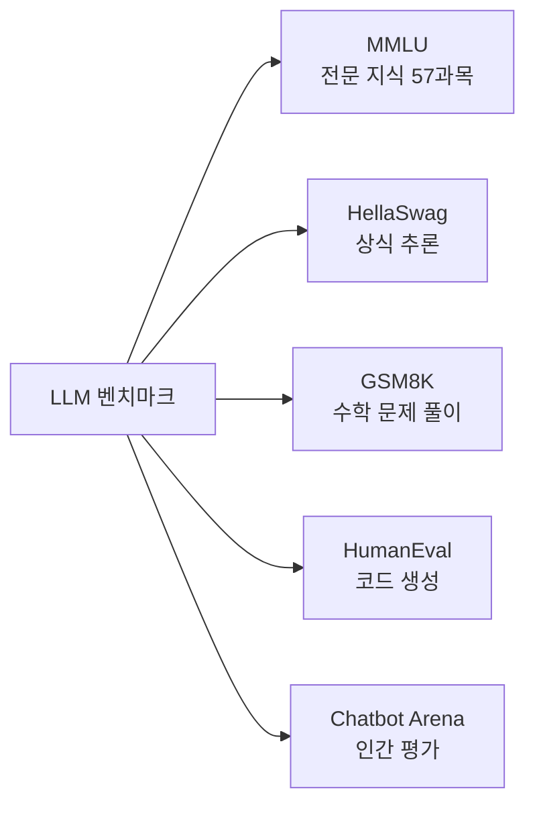

각 벤치마크는 LLM의 특정 능력을 측정하도록 설계되었습니다. **MMLU(Massive Multitask Language Understanding)** 는 57개의 전문 분야(법학, 의학, 물리학 등)에 걸친 지식과 이해 능력을 측정합니다. **HellaSwag**는 상식적인 추론 능력을 평가하며, 주어진 상황에서 가장 그럴듯한 다음 행동을 선택하는 과제입니다. **GSM8K**는 초등학교 수준의 수학 문장제 문제를 풀이하는 능력을 측정합니다. **HumanEval**은 주어진 함수 시그니처에 맞는 올바른 코드를 생성하는 능력을 평가합니다. **Chatbot Arena**는 인간 평가자가 여러 LLM의 응답을 비교하여 순위를 매기는 방식으로, 실제 사용자 선호도를 측정합니다. 실전 프로젝트의 Agent가 사용하는 LLM을 선택할 때, Agent의 주요 작업이 수학 계산이라면 GSM8K 점수가 높은 모델을, 코드 생성이 중요하다면 HumanEval 점수가 높은 모델을 선택하는 것이 합리적입니다.

```python
# lm-evaluation-harness 예제 (개념)
"""
# 설치: pip install lm-eval

import lm_eval
from lm_eval.models.huggingface import HFLM

# 1. 모델 로드
model = HFLM("gpt2")

# 2. 벤치마크 실행
results = lm_eval.simple_evaluate(
    model=model,
    tasks=["mmlu", "hellaswag", "gsm8k"],
    num_fewshot=5,
    batch_size=auto
)

# 3. 결과 출력
for task, metrics in results["results"].items():
    print(f"{task}: {metrics['acc']:.3f}")
"""
```

위 코드는 EleutherAI가 개발한 **lm-evaluation-harness** 라이브러리를 사용하는 예시입니다. 이 라이브러리는 200개 이상의 벤치마크를 통합된 인터페이스로 실행할 수 있게 해주는 표준 도구입니다. 코드를 살펴보면, `HFLM("gpt2")`로 Hugging Face 모델을 로드하고, `simple_evaluate()` 함수에 평가할 태스크 목록을 전달하면 자동으로 모든 벤치마크를 실행합니다. `num_fewshot=5`는 각 태스크에 5개의 예시를 제공하는 few-shot 평가 방식을 의미합니다. 결과는 태스크별 정확도(accuracy)를 포함한 다양한 메트릭으로 반환됩니다. 이러한 표준화된 평가 도구를 사용하면, 서로 다른 LLM의 성능을 동일한 조건에서 객관적으로 비교할 수 있습니다.

**주요 LLM 평가 도구:**

| 도구 | 용도 | 특징 |
|------|------|------|
| **lm-evaluation-harness** | LLM 벤치마크 평가 | EleutherAI, 200+ tasks |
| **OpenAI Evals** | LLM 응답 평가 | OpenAI 공식, 커스텀 eval |
| **DeepEval** | LLM 앱 테스트 | 단위 테스트 스타일, CI/CD |
| **LangSmith** | LangChain 앱 모니터링 | 추적, 평가, 디버깅 |

이러한 도구들은 각각 다른 강점을 가지고 있습니다. **lm-evaluation-harness**는 연구 목적의 표준 벤치마크 평가에 적합하고, **OpenAI Evals**는 OpenAI 모델에 특화된 커스텀 평가 시나리오를 만들 때 유용합니다. **DeepEval**은 pytest 스타일의 단위 테스트를 통해 LLM 애플리케이션을 평가하므로 CI/CD 파이프라인에 통합하기 쉽습니다. **LangSmith**는 LangChain 기반 애플리케이션의 end-to-end 추적과 평가를 제공합니다. 프로젝트의 요구사항에 따라 적절한 도구를 선택하거나 여러 도구를 조합하여 사용할 수 있습니다. 실전 프로젝트의 Agent를 평가할 때는 DeepEval이나 LangSmith가 특히 유용할 수 있습니다. DeepEval을 사용하면 "서울 날씨 알려줘"라는 요청에 대해 Agent가 올바른 도구를 호출하는지 단위 테스트 형태로 검증할 수 있습니다.

> **실무 팁:** LLM 평가 시 중요한 점은 하나의 벤치마크 성능만으로 모델의 전반적인 우수성을 판단하지 말아야 한다는 것입니다. 예를 들어, MMLU 점수가 높다고 해서 코딩 능력도 뛰어나다고 단정할 수 없습니다. 따라서 실제 사용 사례와 관련된 여러 벤치마크를 종합적으로 평가하고, 가능하다면 실제 태스크에 대한 커스텀 평가도 함께 수행하는 것이 좋습니다. 실전 프로젝트의 Agent를 평가할 때는, 실제 사용자 시나리오를 반영한 테스트 케이스를 직접 설계하는 것이 가장 효과적입니다.

### 13.3.5 Agent Test Harness

Agent Test Harness는 AI Agent의 행동을 체계적으로 검증하는 도구입니다. LLM 자체의 평가와 달리, Agent의 평가는 더 복잡합니다. 그 이유는 Agent의 출력이 단순한 텍스트 응답이 아니라, 여러 도구 호출과 추론 단계를 거친 복합적인 결과물이기 때문입니다. 따라서 Agent의 평가는 **최종 응답의 정확성**뿐만 아니라 **도구 호출의 적절성**, **추론 과정의 논리성**, **응답 시간** 등 다양한 차원에서 이루어져야 합니다. 실전 프로젝트에서 만든 Agent를 생각해 보면, 단순히 최종 답변만 확인하는 것만으로는 충분하지 않습니다. Agent가 `get_weather` 도구를 올바르게 호출했는지, 불필요한 도구 호출이 없었는지, 응답 시간이 적절한지 등 다양한 측면을 검증해야 합니다.

```python
# Agent Harness 의사 코드
"""
class AgentHarness:
    def __init__(self, agent):
        self.agent = agent
        self.results = []

    def run_test(self, task, expected_tools=None, expected_answer=None):
        # 1. Agent 실행
        start = time.time()
        response = self.agent.run(task)
        elapsed = time.time() - start

        # 2. 결과 검증
        test_result = {
            "task": task,
            "response": response,
            "time": elapsed,
            "tools_used": extract_tools(response),
            "correct": expected_answer in str(response) if expected_answer else None
        }

        # 3. Assertions
        if expected_tools:
            assert all(t in test_result["tools_used"] for t in expected_tools),
                f"필요 도구 {expected_tools} 누락"

        self.results.append(test_result)
        return test_result

    def summary(self):
        # 전체 테스트 통계
        total = len(self.results)
        passed = sum(1 for r in self.results if r["correct"])
        avg_time = sum(r["time"] for r in self.results) / total
        print(f"통과: {passed}/{total}, 평균 응답 시간: {avg_time:.2f}초")

# 사용
harness = AgentHarness(my_agent)
harness.run_test(
    "서울 날씨 알려줘",
    expected_tools=["get_weather"],
    expected_answer="25°C"
)
harness.summary()
"""
```

위 Agent Harness 코드를 분석해 보겠습니다. `AgentHarness` 클래스는 테스트 대상 Agent와 결과 저장 리스트를 관리합니다. `run_test` 메서드는 하나의 테스트 케이스를 실행하는데, 이 메서드는 작업(task), 예상 도구(expected_tools), 예상 답변(expected_answer)을 입력받습니다. 테스트 실행 시 먼저 Agent의 실행 시간을 측정하고, 응답에서 사용된 도구 목록을 추출합니다. 그다음 예상 도구가 모두 사용되었는지 검증하는 Assertion을 수행하고, 최종 응답에 예상 답변이 포함되어 있는지 확인합니다. `summary` 메서드는 지금까지 실행된 모든 테스트의 통계(통과 수, 평균 응답 시간)를 출력합니다. 실전 프로젝트의 Agent에 이 Harness를 적용하면, `get_weather`와 `calculate` 도구가 기대한 대로 동작하는지, 응답 시간이 허용 가능한 범위 내에 있는지 자동으로 확인할 수 있습니다.

이러한 Agent Harness의 핵심 가치는 **회귀 테스트(Regression Testing)** 에 있습니다. Agent의 시스템 프롬프트나 도구 정의가 변경되었을 때, 기존에 잘 작동하던 기능이 여전히 올바르게 동작하는지 자동으로 확인할 수 있습니다. 예를 들어, 날씨 검색 에이전트의 시스템 프롬프트를 변경한 후에도 "서울 날씨 알려줘"라는 요청에 대해 여전히 `get_weather` 도구를 올바르게 호출하는지 테스트할 수 있습니다. 실전 프로젝트에서 새로운 도구를 추가하거나 system_prompt를 수정할 때마다 이 Harness를 실행하여 기존 기능이 손상되지 않았는지 확인할 수 있습니다. 이는 소프트웨어 공학에서 단위 테스트가 하는 역할과 정확히 동일합니다.

### 13.3.6 Harness의 중요성

지금까지 AI Harness의 다양한 유형과 구현 방법을 살펴보았습니다. 이 절에서는 Harness가 없다면 어떤 문제가 발생하는지, 그리고 Harness가 어떻게 이러한 문제를 해결하는지 종합적으로 정리하겠습니다. AI 시스템 개발에서 Harness의 중요성은 기존 소프트웨어 개발에서 단위 테스트의 중요성과 같다고 할 수 있습니다. 즉, Harness는 AI 시스템의 **품질 보증(Quality Assurance)** 을 위한 필수 도구입니다. 실전 프로젝트에서 만든 Agent도 처음에는 잘 동작하지만, 시간이 지나면서 system_prompt의 변경, 새로운 도구 추가, LLM 모델 업데이트 등 다양한 변경 사항이 발생하면서 점차 불안정해질 수 있습니다. Harness는 이러한 변화 속에서도 시스템이 일관된 품질을 유지하도록 보장합니다.

| 문제 | 설명 | Harness로 해결 |
|------|------|---------------|
| **주관적 평가** | "더 좋아진 것 같아" | 객관적 메트릭으로 측정 |
| **재현 불가** | 지난주 결과와 비교 불가 | 자동화된 반복 테스트 |
| **회귀 미발견** | 새로운 기능이 기존 성능 하락 | CI/CD에서 자동 탐지 |
| **디버깅 어려움** | 어디서 실패했는지 모름 | 단계별 로깅 및 검증 |
| **비교 불가** | 모델 A vs B 객관적 비교 불가 | 동일한 벤치마크로 측정 |

이 표에서 알 수 있듯이, Harness가 없을 때 가장 심각한 문제는 **주관적 평가**와 **재현 불가능성**입니다. AI 시스템의 출력은 본질적으로 확률적이기 때문에, "이전보다 더 좋아진 것 같다"는 직관에 의존하면 실제로는 성능이 하락했는데도 모를 수 있습니다. Harness는 정량적인 메트릭을 제공하여 이러한 주관성을 제거합니다. 또한, **회귀(Regression)** 문제를 조기에 발견할 수 있습니다. 예를 들어, 새로운 LLM 모델로 업그레이드했는데 특정 도메인의 질문에 대한 응답 품질이 떨어졌다면, Harness가 이를 자동으로 감지하여 개발자에게 알려줄 수 있습니다. 마지막으로, Harness는 **디버깅**을 용이하게 합니다. Agent의 각 단계(Thought, Action, Observation)를 로깅하고 검증함으로써, 실패가 발생한 정확한 지점을 파악할 수 있습니다. 실전 프로젝트의 Agent에서 오류가 발생했을 때, Harness가 어느 단계에서 문제가 생겼는지 자동으로 알려준다면 디버깅 시간이 크게 단축될 것입니다.

---

## 📋 한눈에 정리

| 개념 | 설명 | 핵심 포인트 |
|------|------|-----------|
| **AI Agent** | 자율적 의사 결정 + 도구 사용 | ReAct, Plan-and-Execute, Multi-Agent |
| **Function Calling** | LLM이 함수 호출 | OpenAI tools, Claude tools |
| **ReAct 패턴** | Thought → Action → Observation 반복 | 추론과 행동의 순환 |
| **Multi-Agent** | 여러 Agent 협력 시스템 | Coordinator, Researcher, Analyst, Writer, Reviewer |
| **Skills** | 도구 모음 그룹화 | 재사용성, 모듈성 |
| **MCP** | 표준 프로토콜 (Host-Client-Server) | 표준화, 분산형, 보안 |
| **AI Harness** | AI 시스템 평가/테스트 프레임워크 | ML/LLM/Agent/MCP Harness |
| **API Provider** | LLM API 제공자 | OpenAI, Anthropic, Google, Meta 등 |
| **Token 관리** | API 인증 키 안전 관리 | .env, gitignore, 환경 변수 |

---

## ✏️ 연습 문제

1. **AI Agent**의 4가지 핵심 구성 요소(LLM, Planning, Tools, Memory)를 설명하고, 각 요소의 역할을 쓰세요.

2. **ReAct 패턴**의 세 가지 단계(Thought/Action/Observation)를 설명하고, Agent가 "서울 날씨 알려주고 화씨로 변환해줘"라는 질문에 어떻게 단계적으로 응답하는지 예를 들어 설명하세요.

3. **Function Calling**과 **MCP**의 차이점을 설명하세요. 어떤 상황에서 MCP가 더 적합한가요?

4. **Multi-Agent 시스템**의 장점과 단점을 설명하세요.

5. **MCP 아키텍처**의 세 가지 구성 요소(Host, Client, Server)를 설명하고, 각각의 역할을 쓰세요.

6. **AI Harness**가 왜 중요한가요? Harness가 없을 때 발생할 수 있는 문제 3가지를 설명하세요.

7. API 토큰을 안전하게 관리하는 방법을 설명하고, 절대 해서는 안 되는 행동을 2가지 이상 쓰세요.

---

## 📝 연습 문제 정답

<details>
<summary>정답 보기</summary>

**1. AI Agent의 4가지 핵심 구성 요소**
- **LLM (추론 엔진):** Agent의 두뇌 역할. 상황 분석, 의사 결정, 계획 수립. GPT-4, Claude 등
- **Planning:** 작업을 하위 단계로 분해. 예: "이메일 보내기" → 주소 확인 → 내용 작성 → 전송
- **Tools:** 외부 기능 실행. 검색, 계산, 파일 읽기, DB 쿼리, API 호출
- **Memory:** 정보 유지 및 관리. 단기(대화 컨텍스트), 장기(벡터 DB 저장)

**2. ReAct 패턴 예시 (서울 날씨 → 화씨 변환)**
- **Thought (추론):** "사용자가 서울 날씨와 화씨 변환을 요청했으므로, 먼저 날씨를 검색해야 함"
- **Action (행동):** WebSearch("서울 현재 온도") 실행 → 결과: "25°C"
- **Observation (관찰):** "검색 결과 서울이 25°C. 이제 계산기 도구가 필요함"
- **Thought:** "25°C를 화씨로 변환: 25 × 9/5 + 32 = 77"
- **Action:** Calculator("25 * 9/5 + 32") 실행 → 결과: 77
- **Final Answer:** "서울은 현재 25°C이며, 화씨로 77°F입니다."

**3. Function Calling vs MCP**
- **Function Calling:** LLM API 수준 기능. 같은 프로세스 내 함수 호출. LLM 제공자 종속. 설정 간단.
- **MCP (Model Context Protocol):** 표준 프로토콜. Host-Client-Server 분산 구조. LLM 제공자 독립. 보안 우수.
- **MCP가 더 적합한 상황:** (1) 여러 앱에서 동일 도구 세트 재사용 (2) 원격 서버 데이터 접근 (3) 다양한 LLM 제공자 전환 (4) 엔터프라이즈 보안 환경

**4. Multi-Agent 시스템 장단점**
- **장점:** 전문화(역할별 특화), 병렬 처리(동시 작업), 모듈성(독립 개발/교체), 확장성(필요시 추가)
- **단점:** 복잡성(통신/조율 어려움), 비용(여러 LLM 호출), 지연 시간(순차 처리), Coordinator 병목

**5. MCP 아키텍처 구성 요소**
- **Host:** LLM 애플리케이션 (Claude Desktop, VS Code 등). 사용자와 직접 상호작용
- **Client:** Host와 Server 사이의 연결. 요청 전달, 결과 반환
- **Server:** 도구/리소스 제공자 (파일 시스템, DB, Web, Git 등). 실제 기능 실행

**6. AI Harness의 중요성**
Harness가 없으면 발생하는 문제:
- **주관적 평가:** "더 좋아진 것 같아"라는 직관에 의존. Harness는 객관적 메트릭 제공
- **재현 불가:** 지난주와 오늘 모델 비교 불가. Harness는 자동화된 반복 테스트로 재현성 보장
- **회귀 미발견:** 새 기능이 기존 성능 하락시켜도 모름. CI/CD에서 자동 탐지
- **디버깅 어려움:** 실패 지점 특정 불가. 단계별 로깅 및 검증으로 정확한 실패 지점 파악

**7. API 토큰 안전 관리**
- **올바른 방법:**
  - `.env` 파일에 토큰 저장, `load_dotenv()`로 로드
  - `.gitignore`에 `.env` 추가하여 git 커밋 방지
  - 환경 변수(`os.getenv()`)를 통해 코드에서 사용
- **절대 하면 안 되는 행동:**
  1. 코드에 API 키를 하드코딩 (`api_key = "sk-..."`)
  2. `.env` 파일을 git에 커밋 (공개 저장소에 토큰 유출)
  3. 로그나 콘솔 출력에 API 키 포함
  4. 프론트엔드 코드에 API 키 포함 (누구나 열람 가능)

</details>

---

> **🔄 다음 장에서는** 실제 AI 개발 워크플로우를 배웁니다. 프로젝트 구조, 실험 관리, 모델 배포, MLOps의 기본 개념을 다룹니다.
