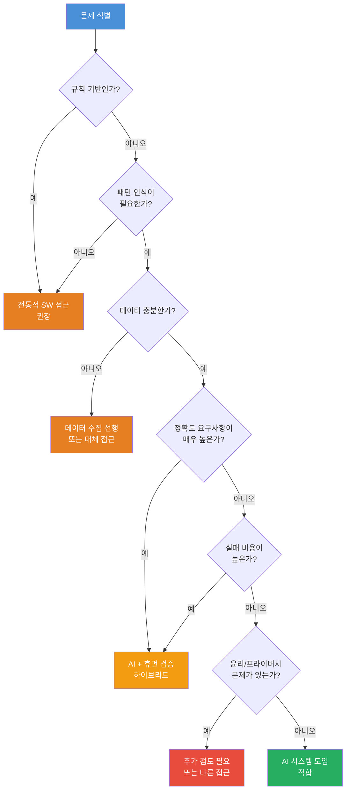

# 08장: 요구사항에서 시스템 기획까지

---

## 학습 목표

| 구분 | 내용 |
|------|------|
| **개념적 목표** | AI 시스템 기획을 위해 요구사항을 수집하고 분석하는 방법을 이해합니다. |
| **실천적 목표** | 이해관계자 인터뷰를 통해 문제를 정의하고 AI 적합성을 판단할 수 있습니다. |
| **분석적 목표** | AI 시스템의 위험 요소를 식별하고 평가하는 프레임워크를 습득합니다. |
| **설계적 목표** | 문제 정의, 접근법, 예산, 일정을 포함한 시스템 기획서를 작성할 수 있습니다. |

---

## 실전 프로젝트: 고객 불만 분석 AI 시스템 기획

### 프로젝트 개요

이번 실전 프로젝트는 한 온라인 쇼핑몰 기업이 직면한 고객 불만 분석 문제를 AI 시스템으로 해결하는 기획 과정을 처음부터 끝까지 경험하는 것입니다. 이 기업은 매일 수천 건의 고객 불만 메시지와 후기를 받고 있지만, 이를 체계적으로 분석하고 분류할 인력이 부족하여 고객 서비스 품질이 저하되고 있습니다. 문제의 규모는 지속적으로 증가하고 있으며, 기존의 단순 키워드 기반 분류 시스템으로는 고객이 진정으로 원하는 바를 파악하는 데 한계가 있습니다.

이 프로젝트는 단순히 기술 솔루션을 도입하는 것을 넘어서, 조직의 실제 요구사항을 정확히 이해하고 이를 AI 시스템으로 해결할 수 있는 구체적인 기획서를 만드는 것을 목표로 합니다. 참가자는 기획자, 개발 리더, 비즈니스 이해관계자 등 다양한 역할을 수행하며 요구사항 수집부터 최종 기획서 작성까지 전 과정을 경험하게 됩니다. 특히 이 과정에서 AI 시스템 기획이 전통적인 소프트웨어 기획과 어떻게 다른지, 어떤 추가적인 고려사항이 필요한지를 체득할 수 있습니다.

### 프로젝트 진행 순서

첫째, 다양한 이해관계자의 요구사항을 수집합니다. 고객 서비스 팀, 마케팅 팀, 제품 팀, 경영진 등 각 부서의 니즈와 기대사항을 인터뷰를 통해 파악합니다. 이 단계에서는 각 이해관계자가 현재 시스템의 어떤 부분에 불만을 가지고 있으며, AI 시스템을 통해 무엇을 해결하고자 하는지 명확히 이해하는 것이 중요합니다.

둘째, 수집된 요구사항을 바탕으로 문제를 명확히 정의합니다. 이때 단순히 "고객 불만을 분석하는 시스템"이라는 추상적인 수준을 넘어서, 분석의 대상, 범위, 품질 기준, 출력 형식 등을 구체화합니다. 문제 정의는 이후 모든 설계 결정의 기준이 되므로 가장 신중하게 진행해야 하는 단계입니다.

셋째, AI 적합성 판단 프레임워크를 활용하여 이 문제가 AI로 해결하기에 적합한지 평가합니다. 문제의 특성, 필요한 정확도, 데이터 가용성, 윤리적 고려사항 등을 종합적으로 검토합니다. 이 단계에서 AI가 반드시 필요한지, 아니면 전통적인 소프트웨어 접근법이 더 효과적일지 판단합니다.

넷째, 최종적으로 시스템 기획서를 작성합니다. 기획서는 문제 정의, 접근 방법, AI 패턴 선택, 예산 및 일정, 위험 평가, 성공 기준을 포함해야 합니다. 이 기획서는 이후 실제 개발 단계의 청사진이 되므로 구체성과 실행 가능성을 동시에 갖추어야 합니다.

### 기대 효과

이 프로젝트를 통해 AI 시스템 기획의 전 과정을 체계적으로 경험함으로써, 막연한 아이디어를 구체적인 실행 계획으로 전환하는 능력을 배양할 수 있습니다. 특히 요구사항 수집부터 위험 평가까지의 전 단계에서 AI 시스템만의 고유한 고려사항을 이해하는 것이 핵심 성과입니다.

---

## 8.1 요구사항 수집

### 8.1.1 이해관계자 인터뷰

AI 시스템 기획에서 요구사항 수집은 전통적인 소프트웨어 개발보다 더 복잡하고 다층적인 접근이 필요합니다. 그 이유는 AI 시스템의 결과물이 확률적이고 예측하기 어렵기 때문에, 이해관계자들의 기대를 정확히 파악하고 조정하는 과정이 필수적이기 때문입니다. 또한 AI 시스템은 단순히 기능을 구현하는 것을 넘어서 데이터, 프라이버시, 윤리, 비용 등 다양한 차원의 요구사항이 함께 고려되어야 합니다.

이해관계자 인터뷰를 진행할 때는 각 그룹이 가진 고유한 관점과 니즈를 체계적으로 수집하는 것이 중요합니다. 고객 서비스 팀은 시스템의 정확성과 실시간성을 중시하는 반면, 경영진은 비용 대비 효과와 ROI에 더 관심을 가집니다. 마케팅 팀은 고객 인사이트의 질과 새로운 트렌드 발견 가능성에 주목하고, 제품 팀은 구체적인 제품 개선 포인트를 도출할 수 있는 분석 결과를 원합니다.

인터뷰는 반구조화된 형식으로 진행하는 것이 효과적입니다. 사전에 준비된 질문 리스트를 기반으로 하되, 인터뷰 중에 새롭게 발견되는 니즈나 우려사항에 대해 유연하게 대응할 수 있어야 합니다. 특히 AI 시스템에 대한 막연한 기대나 두려움을 가진 이해관계자가 많을 수 있으므로, 현실적인 가능성과 한계에 대해 솔직하게 소통하는 것이 중요합니다.

인터뷰 결과는 정량적 데이터와 정성적 인사이트로 구분하여 기록합니다. 정량적 데이터는 예상 처리량, 허용 가능한 오류율, 응답 시간 등 측정 가능한 요구사항이며, 정성적 인사이트는 사용자 경험, 신뢰도, 조직 문화 등 수치화하기 어렵지만 시스템 설계에 중요한 영향을 미치는 요소입니다. 이 두 가지 유형의 요구사항을 균형 있게 수집해야 포괄적인 시스템 기획이 가능합니다.

### 8.1.2 문제 정의

요구사항 수집이 완료되면 이를 바탕으로 해결해야 할 문제를 명확히 정의하는 단계로 진입합니다. 문제 정의는 단순히 증상을 나열하는 것이 아니라, 근본적인 원인을 분석하고 해결 가능한 형태로 문제를 재구성하는 작업입니다. 예를 들어 "고객 불만이 너무 많다"는 추상적인 문제 진술은 "고객 불만의 주요 카테고리를 자동으로 분류하여 각 부서에 신속히 전달하는 시스템이 필요하다"는 구체적인 문제 정의로 변환되어야 합니다.

좋은 문제 정의는 다음 다섯 가지 요소를 포함해야 합니다. 첫째, 문제의 범위와 경계를 명확히 설정해야 합니다. 전체 고객 불만 중 어떤 유형을 대상으로 할 것이며, 어느 수준의 분석까지 수행할 것인지를 결정합니다. 둘째, 문제 해결의 성공 기준을 정량적으로 정의합니다. 예를 들어 분류 정확도 90% 이상, 처리 시간 5초 이내와 같은 구체적인 목표치를 설정합니다.

셋째, 현재 해결 방안의 한계를 명시합니다. 기존 키워드 기반 시스템이 왜 실패했는지, 어떤 측면에서 부족했는지를 객관적으로 분석합니다. 이는 AI 시스템의 필요성을 정당화하는 근거가 됩니다. 넷째, 제약 조건을 식별합니다. 예산, 일정, 데이터 접근성, 규제 요구사항, 조직의 기술 역량 등 시스템 설계에 영향을 미치는 모든 제약을 명시합니다.

다섯째, 문제 정의는 모든 이해관계자가 동의할 수 있는 수준으로 합의되어야 합니다. 문제 정의가 잘못되면 이후 모든 설계 결정이 잘못된 방향으로 진행될 위험이 있으므로, 충분한 논의와 검토를 통해 최종 확정하는 것이 중요합니다. 문제 정의 문서는 서명이나 승인 절차를 통해 공식적으로 채택되는 것이 바람직합니다.

### 8.1.3 AI 시스템 요구사항의 특수성

AI 시스템의 요구사항은 전통적인 소프트웨어 시스템과 몇 가지 중요한 차이점을 가집니다. 가장 큰 차이는 요구사항의 확률적 특성으로 인해 완벽한 정확성을 보장할 수 없다는 점입니다. 따라서 이해관계자들은 AI 시스템이 때로는 오류를 범할 수 있으며, 이 오류를 어떻게 관리하고 완화할 것인지에 대한 합의가 필요합니다.

또한 AI 시스템의 요구사항은 시간이 지남에 따라 변화하는 특성이 있습니다. 새로운 데이터가 축적되고 사용자 피드백이 쌓이면서 시스템의 동작 방식이 개선되거나 변경될 수 있으므로, 요구사항도 이에 맞춰 진화해야 합니다. 이는 전통적인 소프트웨어의 요구사항이 한 번 정의되면 상대적으로 안정적인 것과 대비됩니다.

---

## 8.2 AI 적합성 판단 프레임워크

### 8.2.1 프레임워크 개요

모든 문제가 AI로 해결하기에 적합한 것은 아닙니다. AI는 복잡한 패턴 인식, 자연어 이해, 창의적 생성 등에서 탁월하지만, 정밀한 계산, 엄격한 규칙 적용, 결정론적 결과가 필요한 작업에는 적합하지 않을 수 있습니다. 따라서 문제를 체계적으로 분석하고 AI의 적합성을 평가하는 프레임워크가 필요합니다.

AI 적합성 판단 프레임워크는 세 가지 주요 단계로 구성됩니다. 첫 번째 단계는 문제의 본질을 분석하는 단계로, 문제가 규칙 기반인지 패턴 기반인지, 정확도 요구사항은 어느 정도인지, 데이터는 충분히 가용한지를 평가합니다. 두 번째 단계는 AI 솔루션의 실행 가능성을 평가하는 단계로, 기술적 역량, 예산, 조직의 준비도를 종합적으로 검토합니다.

세 번째 단계는 AI 솔루션의 적절성을 판단하는 단계입니다. AI가 기술적으로 문제를 해결할 수 있다고 하더라도, 윤리적 문제, 프라이버시 침해 위험, 사회적 영향 등을 고려하여 AI를 사용하는 것이 적절한지 판단해야 합니다. 이는 "Can we?"와 "Should we?"라는 두 가지 근본적인 질문에 모두 답하는 과정입니다.

위 의사결정 흐름도는 AI 적합성을 판단하기 위한 체계적인 프로세스를 시각화한 것입니다. 이 프레임워크는 문제의 본질적 특성, 데이터 가용성, 정확도 요구사항, 실패 비용, 윤리적 고려사항을 순차적으로 평가하여 최종 판단을 내리도록 설계되었습니다. 각 단계에서 부정적인 답변이 나오면 즉시 AI 접근법을 배제하거나 보완 전략을 수립해야 합니다.

### 8.2.2 판단 기준별 상세 분석

첫 번째 기준은 문제가 규칙 기반인지 패턴 기반인지의 구분입니다. 규칙 기반 문제는 명확한 조건과 결과의 매핑이 가능한 문제로, 예를 들어 "주문 금액이 5만 원 이상이면 무료 배송"과 같은 경우입니다. 이러한 문제는 전통적인 if-else 로직으로 충분히 해결 가능하며, AI를 도입하는 것은 오히려 불필요한 복잡성과 비용을 초래할 수 있습니다.

두 번째 기준은 필요한 정확도의 수준입니다. AI 시스템은 본질적으로 확률적이므로 100%의 정확도를 보장할 수 없습니다. 따라서 의료 진단, 자율 주행, 금융 거래와 같이 오류가 치명적인 결과를 초래하는 영역에서는 AI 단독으로 사용하기 어렵습니다. 이러한 경우에는 AI가 1차적 분석을 수행하고 인간이 최종 검증하는 하이브리드 접근법이 필요합니다.

세 번째 기준은 실패 비용입니다. AI 시스템이 잘못된 결과를 생성했을 때 발생하는 비용이 어느 정도인지 평가해야 합니다. 고객 불만 분류의 경우 잘못된 분류는 일부 불편을 초래할 수 있지만, 대부분의 경우 치명적이지 않습니다. 반면 의료 진단 지원 시스템의 오류는 생명과 직결될 수 있으므로 실패 비용이 매우 높습니다.

네 번째 기준은 윤리적 고려사항과 프라이버시 문제입니다. AI 시스템이 개인 정보를 처리해야 하는지, 편향된 결과를 생성할 위험은 없는지, 결정 과정에 대한 설명이 가능한지 등을 평가해야 합니다. 특히 GDPR, CCPA, 한국의 개인정보보호법과 같은 규제 요구사항을 준수할 수 있는지 검토하는 것이 필수적입니다.

---

## 8.3 시스템 기획서 작성

### 8.3.1 기획서의 구조

시스템 기획서는 AI 프로젝트의 전체 청사진으로, 아이디어를 구체적인 실행 계획으로 전환하는 문서입니다. 좋은 기획서는 문제 정의, 접근 방법, 기술 패턴, 예산, 일정, 위험 평가, 성공 기준을 체계적으로 포함해야 합니다. 이 문서는 개발 팀, 경영진, 이해관계자 모두가 프로젝트의 방향과 범위에 대해 합의하는 기준점의 역할을 합니다.

기획서 작성의 첫 번째 단계는 앞서 수집한 요구사항과 정의한 문제를 종합하여 문제 진술을 완성하는 것입니다. 문제 진술은 "고객 불만 메시지를 실시간으로 분석하여 주요 카테고리, 감정, 긴급도를 자동 분류하고, 관련 부서에 적절히 라우팅하는 시스템"과 같이 구체적이고 명확해야 합니다. 이때 문제의 규모와 영향을 정량적으로 제시하면 기획서의 설득력이 높아집니다.

두 번째 단계는 접근 방법을 기술하는 것입니다. 여기서는 문제 해결을 위한 전반적인 전략을 설명하며, 왜 특정 AI 패턴과 기술을 선택했는지에 대한 논리적 근거를 제시합니다. 예를 들어 RAG(Retrieval-Augmented Generation) 패턴을 선택한 이유, 특정 LLM 모델을 선택한 이유 등을 명확히 설명해야 합니다. 이 단계에서는 기술적 세부사항보다는 전략적 의사결정에 초점을 맞추는 것이 중요합니다.

세 번째 단계는 예산과 일정을 수립하는 것입니다. AI 프로젝트의 예산은 LLM API 비용, 인프라 비용, 인건비, 데이터 수집 및 가공 비용, 평가 및 모니터링 비용 등을 포함해야 합니다. 일정은 프로토타이핑, 파일럿 운영, 본격 론칭, 사후 모니터링 단계로 구분하여 현실적인 타임라인을 제시합니다. 특히 AI 프로젝트는 반복적인 개선 과정이 필수적이므로, 일정에 충분한 버퍼를 포함해야 합니다.

### 8.3.2 AI 패턴 선택 가이드

적절한 AI 패턴을 선택하는 것은 프로젝트의 성패를 좌우하는 중요한 결정입니다. 각 AI 패턴은 고유한 장점과 한계를 가지고 있으며, 문제의 특성에 따라 최적의 패턴이 달라집니다. 다음 표는 주요 AI 패턴의 특징과 적합한 사용 사례를 비교한 것입니다.

| AI 패턴 | 핵심 개념 | 적합한 문제 | 주요 한계 |
|---------|----------|------------|----------|
| **프롬프트 엔지니어링** | LLM에 직접 지시하여 원하는 출력 유도 | 단순 분류, 요약, 변환 | 복잡한 추론, 맥락이 많은 작업에 부적합 |
| **RAG (검색 증강 생성)** | 외부 지식베이스에서 관련 정보 검색 후 답변 생성 | 사실 기반 QA, 문서 분석, 고객 지원 | 검색 품질에 의존적, 지연 시간 증가 |
| **Agent 시스템** | AI가 도구를 활용하여 자율적으로 작업 수행 | 복잡한 다단계 작업, 자동화 | 오류 누적 위험, 디버깅 어려움 |
| **파인튜닝** | 특정 도메인의 데이터로 모델 추가 학습 | 특화된 분류, 스타일 일관성 필요 | 높은 비용, 유연성 감소 |

패턴 선택의 첫 번째 원칙은 가능한 가장 간단한 접근법을 선택하는 것입니다. 복잡한 Agent 시스템보다 프롬프트 엔지니어링으로 해결 가능한지 먼저 검토해야 합니다. 두 번째 원칙은 문제의 특성과 패턴의 강점을 일치시키는 것입니다. 사실 기반 QA가 필요하다면 RAG가, 복잡한 자동화가 필요하다면 Agent 시스템이 더 적합할 수 있습니다.

세 번째 원칙은 유지보수와 확장성을 고려하는 것입니다. 초기에는 단순한 패턴으로 시작하되, 향후 요구사항이 변경될 때 다른 패턴으로 전환하거나 결합할 수 있는 유연한 아키텍처를 설계하는 것이 중요합니다. 예를 들어 초기에는 프롬프트 엔지니어링으로 시작했다가, 점차 RAG를 추가하고, 최종적으로 Agent 시스템으로 발전시키는 점진적 접근이 효과적입니다.

### 8.3.3 예산 및 일정 수립

AI 프로젝트의 예산은 전통적인 소프트웨어 프로젝트와 다른 비용 구조를 가집니다. 가장 큰 차이는 LLM API 사용에 따른 변동 비용으로, 이는 사용량에 따라 크게 달라질 수 있습니다. 따라서 예산 수립 시에는 예상 사용량의 최소, 중간, 최대 시나리오를 모두 고려하여 현실적인 범위를 설정해야 합니다.

일정 수립에서 중요한 것은 AI 프로젝트의 반복적 특성을 인정하는 것입니다. 전통적인 소프트웨어 프로젝트처럼 요구사항이 완전히 정의되고 나서 개발을 시작하는 폭포수 모델은 AI 프로젝트에 적합하지 않습니다. 대신 프로토타이핑, 평가, 개선의 짧은 주기를 반복하는 애자일 접근법이 더 효과적입니다.

위험 관리도 예산과 일정 수립의 중요한 부분입니다. AI 모델의 성능이 기대에 미치지 못할 경우, 데이터 품질이 충분하지 않을 경우, 예상보다 API 비용이 높을 경우 등 다양한 위험 시나리오에 대한 대비 계획을 포함해야 합니다. 일반적으로 전체 예산의 15~20%는 예비비로 확보하는 것이 바람직합니다.

| 예산 항목 | 설명 | 비중 |
|----------|------|------|
| **LLM API 비용** | 프롬프트 토큰, 출력 토큰, 컨텍스트 윈도우 비용 | 25~35% |
| **인프라 비용** | 서버, 데이터베이스, 네트워크, 모니터링 도구 | 15~20% |
| **인건비** | 기획자, 개발자, 데이터 엔지니어, 평가 담당자 | 30~40% |
| **데이터 비용** | 데이터 수집, 정제, 라벨링, 증강 | 10~15% |
| **평가 및 모니터링** | 평가 데이터셋 구축, 모니터링 시스템, A/B 테스트 | 5~10% |

---

## 8.4 위험 평가

### 8.4.1 AI 시스템의 주요 위험 요소

AI 시스템은 전통적인 소프트웨어와 다른 고유한 위험 요소를 가지고 있습니다. 이러한 위험을 사전에 식별하고 평가하는 것은 프로젝트의 성공적인 진행을 위해 필수적입니다. 위험 평가는 단순히 위험을 나열하는 것을 넘어서, 각 위험의 발생 가능성과 영향도를 정량적으로 평가하고 대응 전략을 수립하는 과정입니다.

AI 시스템의 위험은 크게 기술적 위험, 운영적 위험, 윤리적 위험, 재정적 위험으로 구분할 수 있습니다. 기술적 위험은 AI 모델의 성능 불확실성, 환각 현상, 데이터 의존성 등과 관련됩니다. 운영적 위험은 시스템의 안정성, 확장성, 유지보수성과 관련되며, 윤리적 위험은 편향, 프라이버시 침해, 설명 가능성 부족 등과 관련됩니다.

재정적 위험은 주로 예산 초과와 ROI 불확실성에서 발생합니다. AI 프로젝트의 특성상 초기 예산 추정이 어렵고, 실제 운영 단계에서 예상치 못한 비용이 발생할 가능성이 높습니다. 특히 LLM API 가격 변동, 예상보다 높은 사용량, 성능 개선을 위한 추가 실험 비용 등이 주요 재정적 위험 요소입니다.

| 위험 유형 | 구체적 위험 | 발생 가능성 | 영향도 | 대응 전략 |
|----------|------------|-----------|--------|----------|
| **AI 환각** | 모델이 사실과 다른 정보를 확신 있게 생성 | 높음 | 높음 | RAG 도입, 사실 확인 프롬프트, 휴먼 검증 |
| **데이터 프라이버시** | PII 노출, 학습 데이터 유출, 규정 위반 | 중간 | 매우 높음 | 데이터 익명화, 로컬 LLM 사용, 접근 통제 |
| **비용 초과** | API 비용 증가, 추가 실험 비용, 인프라 비용 | 높음 | 중간 | 사용량 모니터링, 예비비 확보, 비용 최적화 |
| **모델 성능 부족** | 정확도 미달, 특정 케이스 처리 실패 | 중간 | 높음 | 점진적 롤아웃, 평가 프레임워크 구축, 대체 모델 준비 |
| **편향 및 공정성** | 특정 그룹에 불리한 결과 생성, 차별적 출력 | 중간 | 매우 높음 | 다양성 검증 데이터셋, 정기적 편향 감사 |
| **운영 중단** | API 장애, 지연 시간 증가, 시스템 다운 | 낮음 | 높음 | 이중화, 폴백 메커니즘, SLA 설정 |

### 8.4.2 위험 대응 전략 수립

각 위험 요소에 대해 식별된 후에는 구체적인 대응 전략을 수립해야 합니다. 위험 대응 전략은 크게 회피, 전가, 완화, 수용의 네 가지 유형으로 구분할 수 있습니다. 회피는 위험의 원인 자체를 제거하는 것이며, 전가는 보험이나 계약을 통해 위험을 타사에 이전하는 것입니다. 완화는 위험의 발생 가능성이나 영향을 줄이는 조치를 취하는 것이며, 수용은 위험을 인지하고 있지만 별도의 조치 없이 모니터링만 수행하는 것입니다.

AI 환각 위험에 대한 가장 효과적인 대응 전략은 완화입니다. RAG 패턴을 도입하여 외부 지식베이스에서 검증된 정보를 기반으로 답변을 생성하게 하거나, 생성된 내용에 대한 사실 확인 프롬프트를 추가하는 방법이 있습니다. 또한 중요한 결정이 필요한 경우에는 AI의 출력을 인간이 검증하는 휴먼 인 더 루프(Human-in-the-Loop) 프로세스를 도입하는 것이 효과적입니다.

데이터 프라이버시 위험에 대해서는 회피와 완화 전략을 병행해야 합니다. 가장 확실한 방법은 민감한 데이터를 AI 시스템에서 아예 처리하지 않도록 시스템을 설계하는 것입니다. 만약 민감 데이터 처리가 불가피하다면, 데이터 익명화, 암호화, 접근 통제, 감사 로깅 등의 보안 조치를 철저히 구현해야 합니다. 또한 관련 규제 요구사항을 사전에 파악하고 준수 계획을 수립하는 것이 중요합니다.

비용 초과 위험은 주로 완화와 수용 전략으로 대응합니다. 사용량 모니터링 대시보드를 구축하여 실시간으로 API 비용을 추적하고, 예산 초과 시 알림을 받을 수 있는 체계를 마련합니다. 또한 예비비를 확보하고, 비용 효율적인 모델 옵션을 사전에 평가해두는 것이 좋습니다. 장기적으로는 자체 모델 호스팅이나 캐싱 전략을 통해 비용을 최적화할 수 있습니다.

---

## 한눈에 정리

| 핵심 개념 | 설명 | 실천 포인트 |
|-----------|------|------------|
| **요구사항 수집** | 이해관계자 인터뷰를 통해 니즈와 기대사항을 파악 | 반구조화된 인터뷰, 정량+정성 데이터 균형 |
| **문제 정의** | 수집된 요구사항을 바탕으로 해결할 문제를 구체화 | 범위, 성공 기준, 한계, 제약 조건 명시 |
| **AI 적합성 판단** | 문제가 AI로 해결하기 적합한지 체계적으로 평가 | 의사결정 흐름도 활용, Can/Should 질문 |
| **시스템 기획서** | 문제 정의, 접근법, 패턴, 예산, 일정을 포함한 청사진 | 간단한 패턴부터 시작, 점진적 확장 고려 |
| **위험 평가** | 기술, 운영, 윤리, 재정적 위험을 식별하고 대응 전략 수립 | 발생 가능성과 영향도에 따른 우선순위 설정 |
| **AI 패턴 선택** | 문제 특성에 맞는 AI 아키텍처 패턴을 선택 | 프롬프트 엔지니어링 → RAG → Agent 순 검토 |
