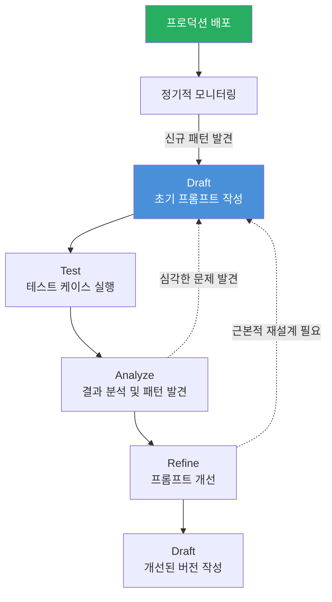

# 09장: 프로토타이핑과 반복 개선

---

## 학습 목표

| 구분 | 내용 |
|------|------|
| **개념적 목표** | AI 시스템 개발에서 프로토타이핑의 중요성과 반복 개선의 원리를 이해합니다. |
| **실천적 목표** | 신속한 프로토타입을 구축하고 사용자 피드백을 수집하여 개선하는 사이클을 실행할 수 있습니다. |
| **분석적 목표** | A/B 테스트 결과를 분석하고 프로덕션 전환 기준을 평가할 수 있습니다. |
| **설계적 목표** | 사용자 피드백 루프와 프롬프트 반복 개선 프로세스를 설계할 수 있습니다. |

---

## 실전 프로젝트: 고객 지원 챗봇 프로토타이핑

### 프로젝트 개요

이번 실전 프로젝트는 고객 지원 챗봇의 프로토타입을 신속하게 구축하고, 세 차례의 개선 사이클을 통해 시스템을 발전시키는 전 과정을 경험하는 것입니다. 이 챗봇은 온라인 쇼핑몰의 주문 조회, 배송 상태 확인, 반품 처리와 같은 기본적인 고객 문의를 자동으로 처리하는 것을 목표로 합니다. 초기 프로토타입은 단순한 프롬프트 엔지니어링 기반으로 시작하여, 각 반복 사이클마다 사용자 피드백을 반영하여 점진적으로 개선해 나갑니다.

이 프로젝트에서 중요한 것은 완벽한 시스템을 한 번에 만드는 것이 아니라, 빠르게 실험하고 실패를 통해 학습하는 마인드셋입니다. 첫 번째 프로토타입은 의도적으로 단순하게 만들어 실제 사용자와의 상호작용을 최대한 빨리 시작하는 것이 목표입니다. 그런 다음 실제 사용 피드백과 성능 데이터를 분석하여 어떤 부분이 개선되어야 하는지 파악하고, 이를 바탕으로 두 번째, 세 번째 개선 사이클을 진행합니다.

참가자는 이 프로젝트를 통해 AI 시스템 개발이 얼마나 반복적인 과정인지, 그리고 각 반복 사이클에서 어떤 종류의 결정을 내려야 하는지 체험하게 됩니다. 특히 프롬프트의 사소한 변경이 전체 시스템의 품질에 어떻게 영향을 미치는지, 사용자 피드백을 어떻게 체계적으로 수집하고 분석할 것인지에 대한 실질적인 경험을 얻게 됩니다.

### 프로젝트 진행 순서

첫째, 최소 기능 버전의 프로토타입을 구축합니다. 이 단계에서는 단일 프롬프트로 구성된 가장 단순한 형태의 챗봇을 만들어 핵심 대화 흐름을 검증합니다. 이때 중요한 것은 기능의 완성도보다 사용자와의 상호작용이 실제로 가능한지, 기본적인 질문에 적절히 응답할 수 있는지를 확인하는 것입니다.

둘째, 첫 번째 개선 사이클을 진행합니다. 초기 프로토타입을 소수의 실제 사용자에게 테스트하게 하고, 그 피드백을 수집하여 분석합니다. 사용자들이 어떤 질문을 주로 하는지, 챗봇이 어떤 부분에서 잘못된 응답을 하는지, 사용자 경험에서 어떤 불편함이 있는지를 파악합니다. 분석 결과를 바탕으로 프롬프트를 개선하고 시스템을 보강합니다.

셋째, 두 번째 개선 사이클을 진행합니다. 개선된 버전을 더 많은 사용자에게 공개하고, 정량적 지표와 정성적 피드백을 함께 수집합니다. 이 단계에서는 응답 정확도, 사용자 만족도, 작업 완료율과 같은 지표를 측정하고, 이전 버전과의 비교를 통해 개선 효과를 검증합니다.

넷째, 세 번째 개선 사이클을 통해 프로덕션 전환을 준비합니다. 최종적으로 프롬프트 개선, 예외 케이스 처리, 성능 최적화를 완료하고, 프로덕션 전환을 위한 체크리스트를 점검합니다. 이 단계에서는 더 이상의 개선이 실질적인 효과를 내지 못하는 수렴 지점을 확인하고, 프로덕션 전환을 결정합니다.

### 기대 효과

이 프로젝트의 완수함으로써 완벽함보다는 신속한 실험과 피드백 기반 개선이 얼마나 중요한지 체득할 수 있습니다. 또한 각 반복 사이클에서 어떤 데이터를 수집하고 어떻게 분석할지, 개선의 우선순위를 어떻게 결정할지에 대한 실무적인 판단력을 기를 수 있습니다.

---

## 9.1 프로토타이핑 전략

### 9.1.1 빠른 실험의 중요성

AI 시스템 개발에서 프로토타이핑은 단순히 개발 초기 단계의 활동이 아니라, 전체 개발 프로세스의 핵심方法论입니다. 전통적인 소프트웨어 개발과 달리 AI 시스템은 사전에 모든 동작을 예측하기 어렵기 때문에, 실제 사용자와의 상호작용을 통해 시스템의 동작을 검증하는 과정이 필수적입니다. 따라서 가능한 가장 빠른 시간 안에 최소한의 프로토타입을 만들어 실제 환경에서 테스트하는 것이 중요합니다.

빠른 프로토타이핑의 가장 큰 장점은 불확실성을 조기에 해소할 수 있다는 점입니다. AI 시스템의 성능, 사용자 반응, 기술적 한계는 문서만으로는 완전히 파악할 수 없습니다. 실제로 사용해보기 전에는 프롬프트가 의도한 대로 동작하는지, 사용자가 AI의 응답을 신뢰하는지, 시스템이 예상치 못한 입력에 어떻게 반응하는지를 알 수 없습니다.

프로토타이핑의 또 다른 중요한 이점은 실패의 비용을 최소화한다는 것입니다. 완벽한 시스템을 목표로 장기간 개발한 후에야 치명적인 문제를 발견하는 것은 막대한 비용 손실을 초래합니다. 반면 초기 프로토타입에서 실패를 경험하면, 그 시점에서 빠르게 방향을 수정하거나 접근법을 변경할 수 있습니다. 이러한 "빠르게 실패하고 빠르게 배우기" 접근법은 AI 프로젝트의 성공 확률을 크게 높여줍니다.

위 다이어그램은 프로토타이핑의 반복 사이클을 시각화한 것입니다. 각 사이클은 프로토타입 구축, 사용자 테스트, 결과 분석, 개선의 네 단계로 구성되며, 사이클이 진행될수록 테스트 규모가 확장되고 평가 기준이 정성적에서 정량적으로 발전하는 것을 볼 수 있습니다. 이러한 점진적 확장 접근법은 초기에는 적은 리소스로 빠르게 검증하고, 확신이 쌓일수록 더 많은 리소스를 투입하는 효율적인 전략입니다.

### 9.1.2 프로토타입의 유형과 선택

프로토타입은 그 목적과 충실도에 따라 다양한 유형으로 구분할 수 있습니다. 가장 단순한 형태는 종이 프로토타입이나 와이어프레임을 사용하는 것이지만, AI 시스템의 경우 실제 LLM과의 상호작용을 경험할 수 있는 인터랙티브 프로토타입이 더 효과적입니다. 프로젝트의 단계와 목적에 따라 적절한 프로토타입 유형을 선택하는 것이 중요합니다.

첫 번째 유형은 기능 프로토타입으로, 시스템의 핵심 기능만을 구현한 최소 버전입니다. 예를 들어 고객 지원 챗봇의 경우, 단일 인텐트(예: 배송 조회)만 처리할 수 있는 프로토타입을 먼저 만들어 사용자와의 상호작용을 검증합니다. 이 프로토타입은 오류 처리, 예외 케이스, 보안 등은 고려하지 않고 핵심 대화 흐름에만 집중합니다.

두 번째 유형은 시나리오 프로토타입으로, 특정 사용자 시나리오를 완전히 처리할 수 있도록 구현한 버전입니다. 예를 들어 "고객이 배송 지연에 대해 불만을 제기하고 환불을 요청하는" 전체 시나리오를 처음부터 끝까지 처리할 수 있는 프로토타입을 만듭니다. 이 유형은 사용자 경험의 완성도를 평가하는 데 적합합니다.

세 번째 유형은 시각적 프로토타입으로, 최종 제품과 유사한 사용자 인터페이스를 갖춘 버전입니다. 이 단계에서는 챗봇의 대화 UI, 응답 포맷, 에러 메시지 표시 방식 등 사용자 인터페이스의 디테일을 검증합니다. 시각적 프로토타입은 실제 사용 환경과 가장 유사한 조건에서 테스트할 수 있다는 장점이 있습니다.

| 프로토타입 유형 | 목적 | 테스트 대상 | 구축 시간 |
|---------------|------|-----------|----------|
| **기능 프로토타입** | 핵심 기능의 기술적 실현 가능성 검증 | LLM 응답 품질, 기본 대화 흐름 | 1~3일 |
| **시나리오 프로토타입** | 엔드투엔드 사용자 경험 평가 | 전체 대화 흐름, 예외 처리, 사용자 만족도 | 3~7일 |
| **시각적 프로토타입** | UI/UX 완성도 검증 | 인터페이스, 응답 포맷, 브랜드 일관성 | 1~2주 |
| **파일럿 프로토타입** | 제한적 실제 운영 환경에서 성능 검증 | 시스템 안정성, 확장성, 실제 사용 패턴 | 2~4주 |

💡 예시: 프로토타이핑 3라운드 예시 — 고객 지원 챗봇 진화 과정

**라운드 1: 기본 응답 챗봇 (v1)**
- 구현: 단일 프롬프트로 "고객 질문 → 답변" 생성
- 테스트: 내부 팀 5명이 20개 질문 테스트
- 문제점: 배송일 질문에 구체적 답변 불가, 감정적 표현에 무응답, 질문 의도 오해 (30%)
- 피드백: "주문 번호를 물어보면 답변 품질이 좋아집니다", "화난 고객의 말을 이해하지 못합니다"
- **학습: 기본 프롬프트만으로는 실제 고객 대응에 한계가 있음**

**라운드 2: 컨텍스트 기반 챗봇 (v2)**
- 개선: 대화 맥락 유지, 감정 분석 추가, 주문 조회 API 연동
- 테스트: 20명의 실제 고객 대상 200회 대화
- 결과: 의도 파악 정확도 65% → 82%, 감정 표현 대응 가능, 배송 조회 성공률 90%
- 남은 문제: 환불 정책 문의 시 오답률 25%, 복합 질문(배송+환불) 처리 실패
- **학습: "사용자가 한 문장에 여러 질문을 포함하는 경우가 많습니다"**

**라운드 3: RAG 기반 챗봇 (v3)**
- 개선: 정책 문서 RAG 도입, 다중 의도 분류, 예외 처리 강화
- 테스트: 100명 사용자 A/B 테스트 (v2 대비)
- 결과: 환불 정책 정확도 75% → 94%, 복합 질문 처리 성공률 91%, 사용자 만족도 3.8 → 4.5 / 5.0
- **→ 프로덕션 전환 결정**

---

## 9.2 프롬프트 반복 개선 사이클

### 9.2.1 Draft-Test-Analyze-Refine 사이클

프롬프트 엔지니어링은 AI 시스템 개발에서 가장 중요한 활동 중 하나이며, 이는 단발성 작업이 아니라 지속적인 반복 개선이 필요한 과정입니다. 프롬프트는 한 번 작성으로 완성되는 것이 아니라, 수많은 실험과 개선을 통해 발전해 나가는 살아있는 문서와 같습니다. 따라서 체계적인 반복 개선 사이클을 구축하고 이를 꾸준히 실행하는 것이 프롬프트 품질을 높이는 핵심입니다.

프롬프트 반복 개선 사이클은 Draft(초안 작성), Test(테스트), Analyze(분석), Refine(개선)의 네 단계로 구성됩니다. 첫 번째 단계에서는 문제 해결을 위한 초기 프롬프트를 작성합니다. 이 초안은 완벽할 필요가 없으며, 오히려 의도적으로 단순하게 만들어 기본적인 접근 방식을 검증하는 것에 초점을 맞춥니다. 초기 프롬프트는 일반적으로 역할 정의, 작업 설명, 출력 형식 지시의 세 가지 요소를 포함합니다.

두 번째 단계는 작성된 프롬프트를 다양한 입력에 대해 테스트하는 것입니다. 테스트는 단순히 몇 가지 예시를 넣어보는 수준이 아니라, 체계적으로 설계된 테스트 케이스를 사용하여 프롬프트의 강점과 약점을 파악합니다. 특히 경계 케이스, 예외 상황, 오해하기 쉬운 입력 등을 포함한 다양한 시나리오에 대한 테스트가 중요합니다.

세 번째 단계는 테스트 결과를 분석하여 패턴과 인사이트를 도출하는 것입니다. 이 단계에서는 각 테스트 케이스에 대한 프롬프트의 출력을 체계적으로 기록하고, 성공과 실패 패턴을 분석합니다. 예를 들어 특정 유형의 질문에서 일관되게 잘못된 응답을 생성한다면, 그것은 프롬프트의 특정 부분이 오해를 유발하고 있다는 신호입니다.

네 번째 단계는 분석 결과를 바탕으로 프롬프트를 개선하는 것입니다. 개선은 단순히 문구를 수정하는 수준부터, 프롬프트의 구조를 완전히 재설계하는 수준까지 다양할 수 있습니다. 중요한 것은 각 개선이 왜 이루어졌는지, 어떤 문제를 해결하기 위한 것인지를 명확히 문서화하여 추적 가능성을 확보하는 것입니다.

### 9.2.2 효과적인 테스트 케이스 설계

프롬프트의 품질을 평가하기 위해서는 체계적인 테스트 케이스가 필요합니다. 테스트 케이스는 단순히 정상 동작을 확인하는 것을 넘어서, 시스템의 한계와 취약점을 드러낼 수 있도록 설계되어야 합니다. 좋은 테스트 케이스는 세 가지 유형으로 구성됩니다: 햅피 패스(정상 동작), 에지 케이스(경계 상황), 그리고 스트레스 테스트(극한 상황)입니다.

햅피 패스 테스트 케이스는 시스템이 정상적으로 동작하는 일반적인 입력으로 구성됩니다. 예를 들어 고객 지원 챗봇의 경우 "제 주문이 언제 배송되나요?"와 같은 전형적인 질문이 이에 해당합니다. 이 테스트는 시스템이 기본적인 기능을 정상적으로 수행하는지 확인하는 최소한의 기준입니다.

에지 케이스는 시스템이 처리하기 어려운 특수한 상황을 테스트합니다. 여기에는 모호한 질문, 중의적인 표현, 잘못된 정보가 포함된 질문, 감정적으로 격앙된 표현 등이 포함됩니다. 예를 들어 "배송이 안 왔어요. 내일까지 안 오면 환불할 거예요"와 같은 긴급성과 감정이 섞인 입력이 이에 해당합니다. 이러한 에지 케이스에서 시스템이 어떻게 대응하는지는 사용자 경험에 큰 영향을 미칩니다.

스트레스 테스트는 시스템의 한계를 확인하기 위한 극한 상황을 시뮬레이션합니다. 매우 긴 입력, 모순된 지시사항, 다중 언어 혼용, 악의적인 입력(프롬프트 인젝션 시도) 등이 이에 포함됩니다. 이러한 테스트는 프로덕션 환경에서 발생할 수 있는 예상치 못한 상황에 시스템이 얼마나 robust한지를 평가하는 데 필수적입니다.

### 9.2.3 프롬프트 버전 관리

프롬프트가 지속적으로 개선되면서 자연스럽게 여러 버전이 생겨나게 됩니다. 따라서 체계적인 버전 관리는 프롬프트 엔지니어링의 핵심 실천 방법 중 하나입니다. 각 버전이 어떤 문제를 해결하기 위해 어떤 변경을 거쳤는지 추적할 수 있어야 하며, 필요할 경우 이전 버전으로 롤백할 수 있어야 합니다.

프롬프트 버전 관리의 첫 번째 원칙은 모든 변경 사항을 문서화하는 것입니다. 각 프롬프트 버전에는 고유한 식별자를 부여하고, 변경 일시, 변경자, 변경 이유, 예상 효과, 실제 효과를 기록합니다. 이 문서는 단순한 변경 이력 이상의 의미를 가지며, 팀 내 지식 공유와 신규 팀원 교육에도 중요한 자료가 됩니다.

두 번째 원칙은 각 버전에 대한 테스트 결과를 함께 보관하는 것입니다. 프롬프트 변경이 어떤 영향을 미쳤는지는 실제 테스트 결과를 통해서만 확인할 수 있습니다. 따라서 각 버전별로 테스트 케이스 실행 결과를 저장하고, 버전 간 성능 비교가 가능하도록 표준화된 평가 지표를 유지하는 것이 중요합니다.

---

## 9.3 사용자 피드백 수집

### 9.3.1 피드백 수집 방법론

AI 시스템의 개선에서 사용자 피드백은 가장 중요한 데이터 소스 중 하나입니다. 실제 사용자와의 상호작용을 통해 얻은 인사이트는 실험실 환경에서 발견하기 어려운 현실적인 문제점을 드러내 줍니다. 따라서 체계적인 피드백 수집 체계를 구축하는 것은 AI 시스템의 지속적 개선을 위한 필수 조건입니다.

사용자 피드백은 크게 명시적 피드백과 암시적 피드백으로 구분할 수 있습니다. 명시적 피드백은 사용자가 직접 제공하는 평가로, "이 답변이 도움이 되었나요?"라는 질문에 대한 응답, 별점 평가, 주관식 코멘트 등이 이에 해당합니다. 암시적 피드백은 사용자의 행동을 관찰하여 얻는 데이터로, 응답을 읽은 시간, 추가 질문 여부, 대화 종료 방식(만족 종료 vs. 중도 이탈) 등이 포함됩니다.

명시적 피드백은 직관적이고 해석이 용이하다는 장점이 있지만, 사용자가 피드백을 제공하는 데 드는 노력이 필요하므로 수집률이 낮을 수 있습니다. 반면 암시적 피드백은 사용자의 추가 노력 없이 자동으로 수집할 수 있어 데이터의 양이 풍부하지만, 의도와 행동 사이의 간극이 있어 해석에 주의가 필요합니다. 효과적인 피드백 시스템은 두 가지 유형을 균형 있게 활용하여 상호 보완하는 것이 중요합니다.

| 피드백 유형 | 수집 방법 | 장점 | 단점 |
|-----------|---------|------|------|
| **명시적 피드백** | "도움됨/도움안됨" 버튼, 별점 평가, 만족도 조사 | 직관적 해석, 품질 지표로 직접 활용 | 낮은 응답률, 선택적 응답 편향 |
| **암시적 피드백** | 응답 시간, 재질문율, 대화 지속 시간, 이탈율 | 자동 수집, 대량 데이터 확보 가능 | 해석이 어려움, 맥락 정보 부족 |
| **직접 인터뷰** | 소규모 사용자 대상 심층 인터뷰 | 깊은 인사이트, 맥락 이해 풍부 | 소수 의견에 biased, 비용 높음 |
| **로그 분석** | 전체 대화 로그의 패턴 분석 | 실제 사용 패턴 파악, 정량적 증거 | 프라이버시 이슈, 분석 인프라 필요 |

### 9.3.2 피드백 분석과 인사이트 도출

수집된 피드백은 체계적인 분석 과정을 거쳐 의미 있는 인사이트로 전환되어야 합니다. 분석의 첫 단계는 데이터를 정리하고 분류하는 것입니다. 명시적 피드백은 긍정/부정/중립으로 분류하고, 부정 피드백은 다시 구체적인 불만 유형(정확도 부족, 응답 지연, 이해 부족 등)별로 세분화합니다. 암시적 피드백은 사용자 행동 패턴을 기준으로 군집화합니다.

두 번째 단계는 정량적 분석을 통해 우선순위를 설정하는 것입니다. 가장 빈도가 높은 문제 유형, 가장 큰 영향을 미치는 문제, 가장 빠르게 개선 가능한 문제 등을 기준으로 개선 우선순위를 결정합니다. 이때 단순히 빈도만 고려할 것이 아니라, 문제의 심각도와 개선에 따른 영향도 함께 고려해야 합니다.

세 번째 단계는 정성적 분석을 통해 근본 원인을 파악하는 것입니다. 특정 문제가 단순히 프롬프트의 오류인지, 아니면 시스템 설계의 근본적인 결함인지를 분석합니다. 예를 들어 사용자가 자주 "이해할 수 없는 응답"을 보고한다면, 이는 단순히 응답 문장을 개선하는 수준을 넘어서 LLM이 사용자의 질문 의도를 올바르게 파악하지 못하고 있을 가능성이 있습니다.

---

## 9.4 A/B 테스트 설계

### 9.4.1 A/B 테스트의 원리

A/B 테스트는 두 가지 버전의 시스템을 동시에 운영하여 어느 버전이 더 우수한 성과를 내는지 통계적으로 비교하는 방법입니다. AI 시스템 개발에서 A/B 테스트는 프롬프트 변경, 시스템 아키텍처 변경, UI 변경 등 다양한 개선 사항의 효과를 객관적으로 검증하는 데 사용됩니다. 특히 AI 시스템의 출력이 확률적이기 때문에, 단순히 몇 가지 예시를 비교하는 것만으로는 개선 효과를 신뢰하기 어렵습니다.

A/B 테스트의 핵심은 무작위 배정과 통계적 유의성입니다. 사용자는 무작위로 A 그룹(통제군)과 B 그룹(실험군)에 배정되어야 하며, 두 그룹의 사용자 특성이 통계적으로 유의미한 차이를 보이지 않아야 합니다. 또한 충분한 표본 크기가 확보되어야 관찰된 차이가 우연에 의한 것인지 실제 개선 효과인지를 판단할 수 있습니다.

A/B 테스트를 설계할 때는 측정 지표를 사전에 명확히 정의하는 것이 중요합니다. 주요 지표(Primary Metric)는 테스트의 성공 여부를 판단하는 핵심 지표이며, 보조 지표(Secondary Metric)는 주요 지표를 보완하는 추가 정보를 제공합니다. 또한 부작용을 모니터링하기 위한 지표(예: 응답 시간 증가, 비용 증가 등)도 함께 설정하는 것이 바람직합니다.

| A/B 테스트 요소 | 설명 | 예시 |
|----------------|------|------|
| **가설** | 변경이 어떤 효과를 가져올지에 대한 예측 | "구체적인 단계를 제시하는 프롬프트가 사용자 만족도를 10% 향상시킬 것이다" |
| **통제군 (A)** | 현재 운영 중인 버전 | 기존 프롬프트 사용 |
| **실험군 (B)** | 변경을 적용한 버전 | 단계별 지침이 추가된 프롬프트 사용 |
| **주요 지표** | 성공 여부를 판단하는 핵심 지표 | 사용자 만족도 점수, 작업 완료율 |
| **표본 크기** | 통계적 유의성을 확보하기 위한 최소 샘플 수 | 각 그룹 최소 1000회 상호작용 |
| **테스트 기간** | 최소 1주일, 계절적 요인 고려 | 2주간 진행 |

### 9.4.2 A/B 테스트 실행과 해석

A/B 테스트를 실행할 때는 여러 가지 실제적 고려사항을 주의해야 합니다. 첫째, 네트워크 효과를 고려해야 합니다. 동일한 사용자가 A 버전과 B 버전을 번갈아 경험하면 혼란을 줄 수 있으므로, 사용자 단위로 그룹을 배정하는 것이 일반적입니다. 둘째, 신규 기능의 경우 학습 효과가 발생할 수 있으므로, 테스트 기간을 충분히 설정하여 초기 적응 기간의 영향을 배제해야 합니다.

테스트 결과를 해석할 때는 통계적 유의성(p-value)과 실질적 유의성(effect size)을 함께 고려해야 합니다. 통계적으로 유의미한 차이가 발견되었다 하더라도, 그 차이가 실제 비즈니스에 의미 있는 수준인지는 별도로 판단해야 합니다. 예를 들어 사용자 만족도가 0.5% 상승했지만 시스템 비용이 20% 증가했다면, 이는 실질적으로 채택하기 어려운 변경일 수 있습니다.

A/B 테스트가 종료된 후에는 결과를 문서화하고 팀과 공유하는 것이 중요합니다. 가설이 기각된 경우에도 그 자체로 중요한 학습이며, 어떤 변경이 효과가 없었다는 사실을 기록함으로써 향후 유사한 시도를 방지할 수 있습니다. 실패한 실험에서도 "왜 효과가 없었는지"에 대한 분석은 다음 실험 설계에 중요한 통찰을 제공합니다.

💡 예시: A/B 테스트 결과 해석 예시

다음은 챗봇 프롬프트 변경에 대한 A/B 테스트 결과입니다.

| 지표 | 통제군 (A) | 실험군 (B) | 변화량 | p-value | 해석 |
|------|-----------|-----------|-------|---------|------|
| 사용자 만족도 (1~5) | 3.8 | 4.2 | +0.4 | 0.003 | 유의미한 개선 |
| 작업 완료율 | 72% | 81% | +9%p | 0.008 | 유의미한 개선 |
| 평균 응답 시간 | 2.1초 | 3.4초 | +1.3초 | 0.001 | 유의미한 증가 (주의 필요) |
| 건당 API 비용 | 15원 | 22원 | +7원 | 0.002 | 유의미한 증가 |
| 재질문율 | 18% | 12% | -6%p | 0.015 | 유의미한 개선 |

**분석:** B 버전은 만족도와 작업 완료율이 유의미하게 개선되었으나, 응답 시간과 비용이 증가하였습니다. 응답 시간 3.4초는 SLA(5초) 이내이므로 허용 가능하나, 비용 증가폭(47%)이 만족도 개선폭(11%)보다 큽니다. 따라서 B 버전을 채택하되, 비용 최적화를 위한 추가 개선(캐싱, 프롬프트 길이 최적화)을 병행하기로 결정합니다.

---

## 9.5 프로덕션 전환 기준

### 9.5.1 전환 결정 체크리스트

프로토타입이 충분히 성숙하고 검증되었다고 판단되면, 프로덕션 환경으로의 전환을 고려합니다. 프로덕션 전환은 단순히 시스템을 운영 환경에 배포하는 기술적 작업이 아니라, 비즈니스 관점에서의 중요한 의사결정입니다. 따라서 체계적인 전환 기준에 따라 객관적으로 판단하는 것이 중요합니다.

프로덕션 전환의 첫 번째 기준은 정확도와 품질입니다. 시스템의 출력 품질이 사전에 정의된 최소 기준을 충족하는지 검증해야 합니다. 이 기준은 단순히 평균 정확도뿐만 아니라, 최악의 경우(worst-case) 성능도 함께 고려해야 합니다. 평균 정확도가 95%라 하더라도 특정 중요한 케이스에서 항상 실패한다면 프로덕션 전환이 적절하지 않을 수 있습니다.

두 번째 기준은 안정성과 성능입니다. 시스템이 예상되는 부하를 안정적으로 처리할 수 있는지, 응답 시간이 SLA(Service Level Agreement)를 충족하는지, 장애 발생 시 복구 메커니즘이 제대로 동작하는지를 확인해야 합니다. 특히 AI 시스템은 LLM API의 지연 시간과 가용성에 의존적이므로, 이에 대한 충분한 테스트가 필요합니다.

세 번째 기준은 비용 효율성입니다. 프로덕션 환경의 예상 비용이 비즈니스 가치를 초과하지 않는지 확인해야 합니다. 특히 예상 사용량을 기준으로 LLM API 비용, 인프라 비용, 유지보수 비용을 산정하고, 이를 기대 효과(고객 서비스 비용 절감, 처리량 증가 등)와 비교합니다.

| 전환 기준 | 세부 항목 | 충족 조건 | 점검 방법 |
|----------|---------|----------|----------|
| **정확도** | 응답 정확도, 의도 분류 정확도, 감정 분석 정확도 | 목표 정확도 90% 이상, 최악 케이스 80% 이상 | 테스트 데이터셋 평가, 무작위 샘플링 검토 |
| **사용자 만족도** | CSAT 점수, NPS, 재사용율 | CSAT 4.0/5.0 이상, 재사용율 60% 이상 | A/B 테스트, 사후 설문 조사 |
| **안정성** | 응답 시간, 가용률, 오류율 | P95 응답 시간 5초 이내, 가용률 99.5% 이상 | 부하 테스트, 장애 주입 테스트 |
| **비용** | API 비용, 인프라 비용, 운영 비용 | 건당 비용이 수동 처리 대비 50% 이하 | 비용 모니터링 대시보드 |
| **보안** | 프롬프트 인젝션 방어, PII 보호, 접근 통제 | 모든 보안 테스트 통과 | 보안 감사, 침투 테스트 |

### 9.5.2 점진적 롤아웃 전략

모든 조건이 충족되었다면, 전체 사용자를 대상으로 한 번에 전환하기보다는 점진적 롤아웃을 진행하는 것이 안전합니다. 점진적 롤아웃은 프로덕션 전환의 위험을 최소화하면서 실제 환경에서의 시스템 성능을 검증할 수 있는 효과적인 방법입니다. 처음에는 소수의 사용자(예: 5%)에게만 시스템을 노출하고, 문제가 없음을 확인하면서 점차 비율을 확대합니다.

점진적 롤아웃의 첫 단계는 내부 알파 테스트입니다. 개발 팀과 가까운 내부 사용자들이 먼저 시스템을 사용하고 피드백을 제공합니다. 이 단계에서는 주요 기능 오류, 심각한 성능 문제, 보안 취약점 등을 조기에 발견할 수 있습니다. 내부 테스트에서 문제가 발견되면, 전체 사용자에게 영향을 미치기 전에 수정이 가능합니다.

두 번째 단계는 베타 테스트로, 일부 외부 사용자에게 시스템을 공개합니다. 이 단계에서는 실제 사용 환경에서의 시스템 동작을 검증하고, 다양한 사용 패턴과 디바이스 환경에서의 호환성을 확인합니다. 베타 테스터는 일반적으로 피드백 제공에 적극적인 사용자를 선발하며, 그들의 피드백은 최종 개선에 중요한 역할을 합니다.

세 번째 단계는 단계적 롤아웃으로, 사용자 비율을 5%, 25%, 50%, 100%로 점진적으로 확대합니다. 각 단계에서 최소 1~2일간 모니터링을 통해 이상 징후가 없는지 확인한 후 다음 단계로 진행합니다. 만약 특정 단계에서 문제가 발견되면, 해당 문제를 해결한 후 이전 단계부터 다시 시작합니다.

---

📝 연습 문제

**문제 1:** 당신은 온라인 서점의 고객 지원 챗봇을 개발 중입니다. 첫 번째 프로토타입(v1)에서 사용자들이 '추천 도서' 요청 시 부정확한 정보를 제공하는 문제가 발견되었습니다. 9.1절과 9.2절의 내용을 바탕으로 v2 개선 계획을 수립하십시오. 어떤 테스트 케이스를 추가하고, 프롬프트를 어떻게 개선할지 구체적으로 서술하십시오.

**문제 2:** 다음 A/B 테스트 결과를 분석하고 프로덕션 전환 여부를 결정하십시오.
- 통제군(A): 기존 프롬프트, 만족도 3.5, 완료율 68%, 건당 비용 12원
- 실험군(B): 개선 프롬프트, 만족도 3.7, 완료율 71%, 건당 비용 23원
- p-value: 만족도 0.12, 완료율 0.08, 비용 0.001
- 표본 크기: 각 그룹 500회 상호작용

**문제 3:** 프로토타입에서 프로덕션으로 전환하기 전에 점검해야 할 체크리스트를 5가지 항목으로 작성하고, 각 항목의 충족 기준을 구체적으로 제시하십시오.

---

## 한눈에 정리

| 핵심 개념 | 설명 | 실천 포인트 |
|-----------|------|------------|
| **프로토타이핑 전략** | 최소 기능부터 시작하여 점진적으로 개선 | 완벽함보다 빠른 실험, 피드백 기반 개선 |
| **프롬프트 반복 개선** | Draft-Test-Analyze-Refine 사이클 반복 | 체계적 테스트 케이스, 버전 관리, 변경 이력 문서화 |
| **사용자 피드백 수집** | 명시적+암시적 피드백 균형 활용 | 자동 수집 체계, 정량+정성 분석 병행 |
| **A/B 테스트** | 두 버전을 통계적으로 비교하여 개선 효과 검증 | 무작위 배정, 충분한 표본, 통계적 유의성 확인 |
| **프로덕션 전환** | 정확도, 안정성, 비용, 보안 기준 충족 후 점진적 롤아웃 | 명확한 전환 기준, 단계적 확대, 모니터링 체계 |
