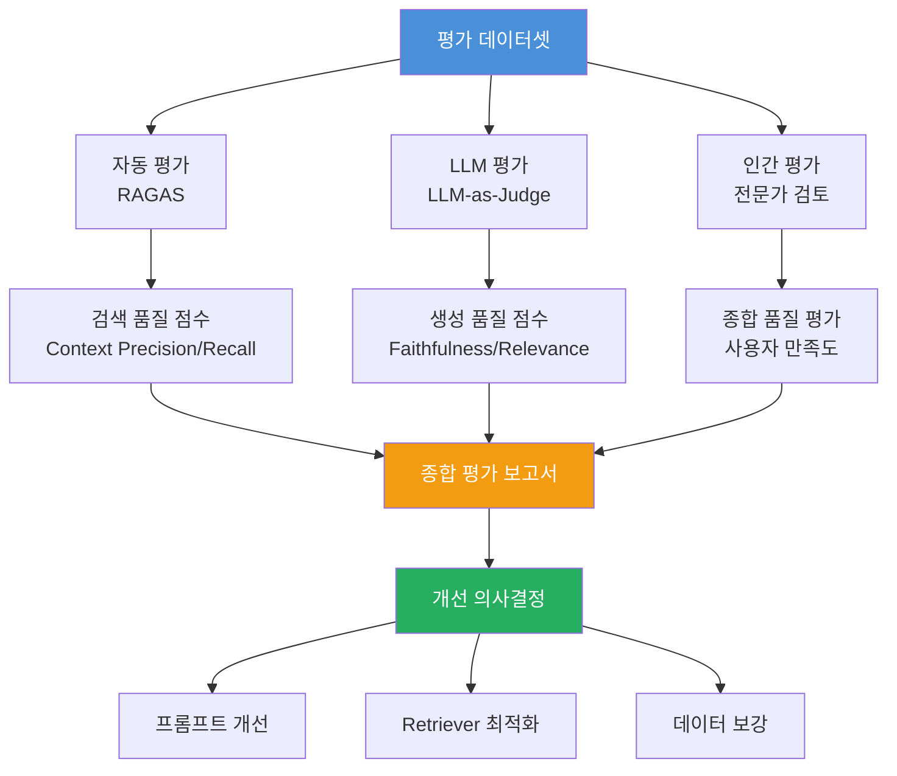
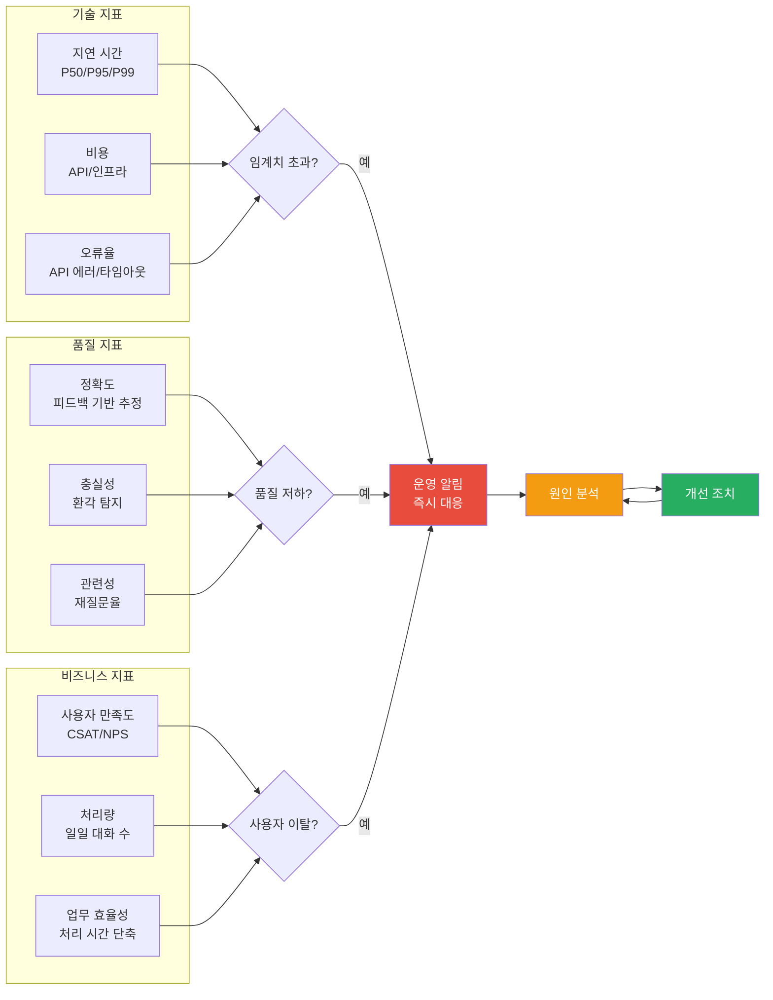
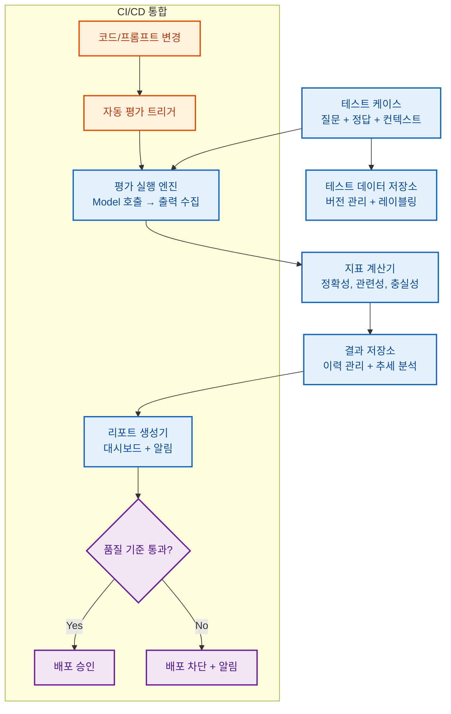

# 10장: 평가와 모니터링

---

## 학습 목표

| 구분 | 내용 |
|------|------|
| **개념적 목표** | LLM 기반 시스템의 평가가 전통적인 소프트웨어 테스트와 어떻게 다른지 이해합니다. |
| **실천적 목표** | RAGAS, LLM-as-judge, 인간 평가 등 다양한 평가 방법론을 설계할 수 있습니다. |
| **분석적 목표** | 오프라인 평가와 온라인 평가의 차이를 이해하고 용도에 맞게 선택할 수 있습니다. |
| **설계적 목표** | 운영 모니터링 대시보드와 피드백 루프를 설계할 수 있습니다. |

---

## 실전 프로젝트: RAG 시스템 평가 프레임워크 설계

### 프로젝트 개요

이번 실전 프로젝트는 기업 내부 문서를 기반으로 질문에 답변하는 RAG(Retrieval-Augmented Generation) 시스템에 대한 포괄적인 평가 프레임워크를 설계하는 것입니다. 이 시스템은 회사의 정책 문서, 제품 매뉴얼, FAQ 데이터베이스에서 관련 정보를 검색하여 사용자의 질문에 정확하게 답변하는 것을 목표로 합니다. 평가 프레임워크는 시스템이 프로덕션에 배포되기 전에 충분한 품질을 확보했는지 확인하고, 운영 중에도 지속적으로 성능을 모니터링할 수 있도록 설계되어야 합니다.

RAG 시스템의 평가는 단순한 정답 비교로는 충분하지 않습니다. 검색된 문서의 관련성, 생성된 답변의 정확성과 충실성, 사용자 경험의 질 등 여러 차원의 평가가 필요합니다. 또한 LLM의 출력은 확률적이므로, 동일한 입력에 대해서도 결과가 달라질 수 있다는 점을 고려한 통계적 평가 방법이 필요합니다.

이 프로젝트는 평가 데이터셋 구축, 평가 지표 선정, 평가 프로세스 설계, 모니터링 대시보드 기획, 피드백 루프 설계까지의 전 과정을 포함합니다. 참가자는 기술적 측면뿐만 아니라 비용, 시간, 인력 등 현실적 제약을 고려한 실용적인 평가 프레임워크를 설계해야 합니다.

### 프로젝트 진행 순서

첫째, 평가 데이터셋을 구축합니다. RAG 시스템의 평가를 위해서는 질문-정답-참조 문서로 구성된 테스트 데이터셋이 필요합니다. 이 데이터셋은 다양한 유형의 질문(사실 질문, 추론 질문, 비교 질문, 부정 질문 등)을 포함해야 하며, 각 질문에 대해 기대되는 정답과 참조 문서가 함께 제공되어야 합니다.

둘째, 평가 지표를 선정합니다. RAG 시스템의 성능은 검색 품질(Retrieval Quality)과 생성 품질(Generation Quality)로 구분하여 평가합니다. 검색 품질은 관련 문서가 얼마나 잘 검색되는지를 측정하고, 생성 품질은 검색된 정보를 바탕으로 생성된 답변의 정확성과 충실성을 평가합니다.

셋째, 평가 프로세스를 설계합니다. 오프라인 평가(사전 데이터셋 기반)와 온라인 평가(실제 사용자 기반)를 결합한 하이브리드 평가 전략을 수립합니다. 각 평가 방법의 목적, 실행 주기, 담당자, 판단 기준을 명확히 정의합니다.

넷째, 모니터링 대시보드를 설계합니다. 운영 중인 시스템의 성능을 실시간으로 추적할 수 있는 대시보드의 지표, 시각화 방식, 알림 기준을 정의합니다. 대시보드는 기술적 지표(지연 시간, 비용)와 비즈니스 지표(사용자 만족도, 작업 완료율)를 모두 포함해야 합니다.

### 기대 효과

이 프로젝트를 통해 AI 시스템 평가의 복잡성과 다차원성을 이해하고, 체계적인 평가 프레임워크를 설계하는 능력을 배양할 수 있습니다. 특히 평가 결과를 바탕으로 시스템 개선 우선순위를 결정하고, 지속적인 품질 관리를 위한 모니터링 체계를 구축하는 실무 역량을 기를 수 있습니다.

---

## 10.1 LLM 평가의 어려움

### 10.1.1 전통적 평가와의 차이

전통적인 소프트웨어 평가는 입력에 대한 출력이 결정론적이므로, 단위 테스트, 통합 테스트, 회귀 테스트와 같은 명확한 방법론으로 검증이 가능합니다. 그러나 LLM 기반 시스템의 평가는 근본적으로 다른 접근이 필요합니다. 동일한 입력에 대해 LLM이 매번 다른 출력을 생성할 수 있으며, 출력의 정답 여부를 명확히 판단하기 어려운 경우가 많습니다.

LLM 평가의 가장 큰 도전 과제는 "정답"의 정의가 모호하다는 점입니다. 예를 들어 "이 제품의 장점을 설명해주세요"라는 질문에 대해, 다양한 형식과 내용의 답변이 모두 정답이 될 수 있습니다. 따라서 단순히 정답/오답을 이분법적으로 판단하는 것이 아니라, 유용성, 정확성, 완전성, 안전성 등 여러 기준으로 평가해야 합니다.

또한 LLM의 평가는 맥락 의존성이 매우 높습니다. 동일한 답변도 사용자의 배경 지식, 질문 의도, 문화적 맥락에 따라 유용하게 느껴질 수도 있고 그렇지 않을 수도 있습니다. 따라서 평가를 수행할 때는 평가의 맥락과 기준을 명확히 정의하고, 다양한 관점에서 종합적으로 판단하는 것이 중요합니다.

| 도전 과제 | 설명 | 영향 |
|----------|------|------|
| **정답의 모호성** | 동일한 질문에 여러 유효한 답변이 존재 | 단순 정답 비교로 평가 불가, 다차원 평가 필요 |
| **맥락 의존성** | 답변의 품질이 사용자의 배경과 의도에 따라 달라짐 | 평가 시 맥락 정보 포함 필요, 일반화 어려움 |
| **확률적 출력** | 동일 입력에 대해 출력이 매번 달라짐 | 통계적 평가 방법 필요, 단일 샘플 평가 불충분 |
| **규모의 어려움** | 수동 평가는 비용이 높고 시간이 오래 걸림 | 자동 평가 방법 필요하나 정확도에 한계 |
| **편향 평가** | 평가자나 평가 모델의 편향이 결과에 영향 | 다양한 평가자/모델 사용, 편향 모니터링 필요 |
| **장기 효과 측정** | 단일 응답의 품질만으로 시스템 가치를 판단하기 어려움 | 사용자 행동 변화, 업무 효율성 등 장기 지표 필요 |

### 10.1.2 평가의 다차원성

LLM 시스템의 평가는 단일 지표로 측정할 수 없습니다. 따라서 여러 차원의 평가 기준을 정의하고, 각 차원별로 적절한 평가 방법을 적용하는 것이 필요합니다. 가장 일반적으로 사용되는 평가 차원은 정확성, 관련성, 충실성, 유용성, 안전성입니다.

정확성(Accuracy)은 생성된 답변이 사실적으로 올바른지를 측정합니다. 이는 RAG 시스템에서 가장 중요한 평가 기준 중 하나로, 답변이 검색된 문서의 정보와 일치하는지, 외부 사실과 모순되지 않는지를 확인합니다. 정확성 평가는 특히 사실 기반 질문에서 중요하며, 환각(Hallucination) 탐지의 핵심 기준입니다.

관련성(Relevance)은 답변이 사용자의 질문 의도와 얼마나 부합하는지를 측정합니다. 질문의 핵심을 정확히 파악하고, 이에 적절히 대답하는지, 불필요한 정보를 포함하지는 않는지를 평가합니다. 관련성이 낮은 답변은 정확하더라도 사용자에게 유용하지 않으며, 오히려 혼란을 초래할 수 있습니다.

충실성(Faithfulness)은 생성된 답변이 검색된 문서의 내용에 충실한지를 측정합니다. RAG 시스템의 핵심 원칙은 검색된 정보를 기반으로 답변을 생성하는 것이므로, 답변이 참조 문서에 없는 정보를 포함하거나 문서의 내용을 왜곡해서는 안 됩니다. 충실성은 환각을 탐지하는 또 다른 중요한 기준입니다.

---

## 10.2 평가 방법론

### 10.2.1 RAGAS 프레임워크

RAGAS(Retrieval Augmented Generation Assessment)는 RAG 시스템의 평가를 위해 특별히 설계된 프레임워크입니다. RAGAS는 검색 품질과 생성 품질을 각각 측정하는 여러 지표를 제공하며, 사람의 개입 없이 자동으로 평가를 수행할 수 있다는 장점이 있습니다. 이 프레임워크는 RAG 시스템의 핵심 구성 요소인 Retriever와 Generator 각각의 성능을 독립적으로 평가할 수 있도록 설계되었습니다.

RAGAS의 주요 지표 중 첫 번째는 Context Precision입니다. 이는 검색된 문서 중에서 실제로 질문에 답변하는 데 필요한 정보를 포함한 문서의 비율을 측정합니다. 검색된 문서가 많더라도 실제로 유용한 문서가 적다면, 이 지표는 낮게 나타납니다. Context Precision이 낮은 경우 Retriever의 검색 알고리즘을 개선해야 합니다.

두 번째 지표는 Context Recall입니다. 이는 질문에 답변하는 데 필요한 모든 관련 정보가 검색 결과에 포함되어 있는지를 측정합니다. 필요한 정보를 누락하지 않고 검색하는 능력을 평가하며, Recall이 낮은 경우 검색 범위를 확장하거나 청킹 전략을 개선해야 합니다.

세 번째 지표는 Faithfulness입니다. 생성된 답변이 검색된 문서의 내용에 충실한지를 측정하며, 답변이 문서에서 지원되지 않는 정보를 포함하는 비율을 평가합니다. Faithfulness 점수가 낮은 것은 LLM이 검색된 정보를 무시하고 자체 지식에 기반하여 답변을 생성하는 환각 현상을 나타냅니다.

네 번째 지표는 Answer Relevance입니다. 생성된 답변이 질문과 얼마나 관련성이 높은지를 측정하며, 답변이 질문의 의도를 정확히 파악하고 적절히 응답하는지를 평가합니다. Answer Relevance가 낮은 경우 프롬프트에서 질문 의도 파악과 관련된 지침을 강화해야 합니다.

💡 예시: RAGAS 평가 결과 해석 예시

다음은 기업 내부 정책 RAG 시스템의 RAGAS 평가 결과입니다.

| 지표 | 점수 | 해석 | 개선 조치 |
|------|------|------|----------|
| Context Precision | 0.72 | 검색된 문서 중 72%만 실제로 유용 | Retriever 임베딩 모델 교체, 청크 크기 최적화 필요 |
| Context Recall | 0.85 | 필요한 정보의 85%가 검색됨 | 검색 대상 문서 범위 확장, 하이브리드 검색 도입 |
| Faithfulness | 0.78 | 생성된 답변의 78%만 검색 문서에 충실 | LLM에 "검색된 문서만 참고하라"는 지침 강화, 온도 0.2로 낮춤 |
| Answer Relevance | 0.88 | 답변이 질문과 대체로 관련성 높음 | 프롬프트에 질문 의도 파악 단계 추가 |

**종합 해석:** 생성 품질(Faithfulness 0.78)이 검색 품질(Context Recall 0.85)보다 낮아, 환각 문제가 검색보다 생성 단계에서 더 심각함을 시사합니다. 우선 LLM 프롬프트의 충실성 지침을 강화하고, 이후 Retriever 최적화를 진행하는 것이 효과적인 개선 순서입니다.

### 10.2.2 LLM-as-Judge 방법

LLM-as-Judge는 다른 LLM을 평가자로 사용하여 시스템의 출력 품질을 평가하는 방법입니다. 이 방법은 사람이 평가하는 데 드는 비용과 시간을 크게 줄이면서도, 다양한 기준으로 일관된 평가를 수행할 수 있다는 장점이 있습니다. 최근 연구에 따르면 GPT-4와 같은 고성능 LLM은 사람 평가자와 높은 일치도를 보이는 것으로 나타났습니다.

LLM-as-Judge를 구현할 때는 평가 전용 프롬프트를 별도로 설계하는 것이 중요합니다. 평가 프롬프트는 평가 기준, 평가 척도, 출력 형식을 명확히 정의해야 하며, 가능하면 예시 평가 결과를 포함하여 일관된 평가를 유도해야 합니다. 또한 평가 모델의 편향을 최소화하기 위해 여러 번 평가를 수행하고 평균을 사용하는 방법이 효과적입니다.

LLM-as-Judge 방법의 한계도 인식해야 합니다. 평가 모델이 특정 형식의 답변을 선호하는 편향, 자기 자신과 유사한 스타일의 답변을 선호하는 자기 강화 편향, 긴 답변을 선호하는 길이 편향 등이 존재할 수 있습니다. 이러한 편향을 완화하기 위해서는 평가 결과를 주기적으로 사람이 검증하고, 다양한 평가 모델을 앙상블하여 사용하는 것이 좋습니다.

### 10.2.3 인간 평가

인간 평가는 AI 시스템 평가의 궁극적인 기준으로, 자동 평가 방법이 아직 완전히 대체하지 못하는 중요한 역할을 담당합니다. 특히 창의성, 유용성, 미묘한 뉘앙스의 차이 등은 인간 평가자만이 판단할 수 있는 영역입니다. 인간 평가는 주로 소규모 샘플에 대해 심층적으로 수행되며, 자동 평가 결과의 검증 도구로 활용됩니다.

효과적인 인간 평가를 위해서는 평가자의 선정과 교육이 중요합니다. 평가자는 평가 대상 도메인에 대한 기본적인 이해가 있어야 하며, 평가 기준과 척도에 대해 충분히 교육받아야 합니다. 특히 여러 평가자 간의 일관성을 확보하기 위해 평가자 간 신뢰도(Inter-rater Reliability)를 측정하고, 필요한 경우 평가 기준을 조정하는 과정이 필요합니다.

인간 평가의 또 다른 중요한 측면은 평가자의 편향 관리입니다. 평가자는 특정 스타일의 답변에 대한 선호, 평가 피로에 따른 집중력 저하, 최근에 평가한 샘플의 영향(순서 효과) 등 다양한 편향을 가질 수 있습니다. 이러한 편향을 최소화하기 위해 평가 샘플을 무작위로 제시하고, 충분한 휴식 시간을 보장하며, 정기적으로 평가 품질을 검증하는 프로세스가 필요합니다.

위 다이어그램은 세 가지 평가 방법을 결합한 종합 평가 프레임워크를 보여줍니다. 각 평가 방법은 고유한 강점과 약점이 있으므로, 이를 상호 보완적으로 활용하는 것이 효과적입니다. 자동 평가는 대규모 데이터셋에 대해 빠르고 일관된 평가를 제공하고, 인간 평가는 깊이 있는 정성적 인사이트를 제공합니다.

---

## 10.3 오프라인 vs 온라인 평가

### 10.3.1 오프라인 평가

오프라인 평가는 사전에 구축된 테스트 데이터셋을 사용하여 시스템의 성능을 측정하는 방법입니다. 이 방법은 실제 사용자에게 영향을 미치지 않고 시스템의 품질을 평가할 수 있다는 가장 큰 장점이 있습니다. 오프라인 평가는 주로 개발 단계에서 새로운 모델이나 프롬프트 변경의 효과를 검증하는 데 사용됩니다.

오프라인 평가의 핵심은 테스트 데이터셋의 품질입니다. 테스트 데이터셋은 실제 사용 환경을 대표할 수 있도록 다양한 유형의 질문과 시나리오를 포함해야 합니다. 데이터셋의 규모도 중요하지만, 더 중요한 것은 데이터의 다양성과 실제성입니다. 이상적으로는 100~500개의 고품질 테스트 케이스로 구성된 데이터셋이 효과적인 평가를 가능하게 합니다.

오프라인 평가의 한계는 실제 환경과의 괴리입니다. 테스트 데이터셋은 아무리 잘 설계되었다 하더라도 실제 사용자의 다양성과 예측 불가능성을 완전히 반영할 수 없습니다. 또한 오프라인 평가는 사용자의 실시간 피드백을 반영하지 못하므로, 시스템이 실제 사용 환경에서 어떻게 동작할지를 완전히 예측할 수 없습니다.

### 10.3.2 온라인 평가

온라인 평가는 실제 사용자와의 상호작용을 통해 시스템의 성능을 측정하는 방법입니다. 이 방법은 실제 환경에서의 시스템 동작을 평가할 수 있으며, 사용자 피드백을 직접 수집할 수 있다는 장점이 있습니다. 온라인 평가는 주로 프로덕션 배포 전 파일럿 단계나 운영 중 지속적 모니터링 단계에서 사용됩니다.

온라인 평가의 주요 방법으로는 A/B 테스트, 사용자 만족도 설문, 행동 로그 분석 등이 있습니다. A/B 테스트는 두 버전의 시스템을 비교하여 어느 버전이 더 우수한 성과를 내는지 통계적으로 검증합니다. 사용자 만족도 설문은 주관적인 사용자 경험을 정량적으로 측정하며, 행동 로그 분석은 사용자의 실제 행동 패턴에서 시스템의 효과를 추론합니다.

온라인 평가의 가장 큰 도전 과제는 품질 관리와 위험 관리의 균형입니다. 실제 사용자에게 품질이 충분히 검증되지 않은 시스템을 노출하는 것은 위험이 따릅니다. 따라서 점진적 롤아웃, 모니터링 알림, 롤백 계획 등 위험 관리 전략이 온라인 평가와 함께 설계되어야 합니다.

| 평가 유형 | 오프라인 평가 | 온라인 평가 |
|----------|-------------|-------------|
| **평가 시점** | 개발 단계, 배포 전 | 운영 중, 파일럿 단계 |
| **데이터 소스** | 사전 구축된 테스트 데이터셋 | 실제 사용자 상호작용 |
| **평가 속도** | 빠름, 자동화 가능 | 느림, 충분한 데이터 수집 필요 |
| **비용** | 상대적으로 낮음 | 인프라, 사용자 영향 관리 비용 발생 |
| **위험** | 없음 (실제 사용자 영향 없음) | 있음 (품질 이슈가 사용자에게 영향) |
| **주요 지표** | 정확도, 충실성, 관련성 | 사용자 만족도, 작업 완료율, 재사용율 |
| **적용 시기** | 새로운 프롬프트/모델 검증, 회귀 테스트 | 프로덕션 배포 전 최종 검증, 지속적 모니터링 |

---

## 10.4 운영 모니터링

### 10.4.1 모니터링 지표

AI 시스템이 프로덕션 환경에 배포된 후에는 지속적인 모니터링이 필수적입니다. 모니터링은 시스템이 정상적으로 동작하는지 확인하고, 성능 저하나 이상 징후를 조기에 발견하여 신속히 대응하기 위해 필요합니다. 효과적인 모니터링을 위해서는 기술적 지표와 비즈니스 지표를 모두 포함한 종합적인 대시보드를 구축해야 합니다.

기술적 모니터링의 첫 번째 지표는 지연 시간(Latency)입니다. LLM API의 응답 시간, 검색 시스템의 쿼리 시간, 전체 엔드투엔드 응답 시간을 측정하고 모니터링합니다. 지연 시간이 갑자기 증가하는 것은 API 장애, 네트워크 문제, 또는 검색 시스템의 성능 저하를 나타낼 수 있습니다. 특히 P50, P95, P99 백분위수를 함께 모니터링하여 극단적 지연 시간 케이스를 포착하는 것이 중요합니다.

두 번째 지표는 비용(Cost)입니다. LLM API 사용량과 비용을 실시간으로 추적하고, 예산 대비 사용률을 모니터링합니다. 특히 토큰 사용량의 급증, 특정 사용자나 특정 시간대의 비정상적 사용 패턴을 감지하는 것이 중요합니다. 비용 지표는 예산 초과를 방지하고, 비용 효율적인 운영을 위한 의사결정의 기초가 됩니다.

세 번째 지표는 정확도(Accuracy)입니다. 프로덕션 환경에서 시스템의 정확도를 지속적으로 측정하는 것은 기술적으로 어렵지만, 다양한 간접 지표를 통해 추정할 수 있습니다. 사용자 피드백, 재질문율, 에스컬레이션 비율 등을 통해 시스템의 품질을 간접적으로 평가합니다.

네 번째 지표는 사용자 만족도(User Satisfaction)입니다. CSAT(고객 만족도 점수), NPS(순 추천 지수), CES(고객 노력 점수) 등 다양한 만족도 지표를 수집하고 모니터링합니다. 사용자 만족도는 시스템의 궁극적인 성공 지표이므로, 다른 모든 지표와의 상관관계를 분석하여 시스템 개선에 활용해야 합니다.

위 대시보드 다이어그램은 기술 지표, 품질 지표, 비즈니스 지표의 세 가지 계층으로 구성된 모니터링 체계를 보여줍니다. 각 지표는 설정된 임계치와 비교되어 이상 징후를 감지하고, 문제가 발견되면 운영 알림을 통해 담당자에게 즉시 전달됩니다. 이 체계를 통해 기술적 장애뿐만 아니라 점진적인 품질 저하와 사용자 경험 악화도 조기에 발견할 수 있습니다.

💡 예시: 모니터링 대시보드 예시

다음은 RAG 시스템 운영 모니터링 대시보드의 구성 예시입니다.

| 계층 | 지표 | 현재 값 | 7일 평균 | 임계치 | 상태 |
|------|------|---------|---------|-------|------|
| **기술** | P50 응답 시간 | 1.8초 | 1.7초 | 3.0초 | 정상 |
| **기술** | P95 응답 시간 | 3.9초 | 3.7초 | 5.0초 | 정상 |
| **기술** | API 오류율 | 0.3% | 0.4% | 1.0% | 정상 |
| **기술** | 일일 API 비용 | 425,000원 | 398,000원 | 500,000원 | 정상 |
| **품질** | 사용자 피드백 긍정률 | 78% | 82% | 70% | ↓ 주의 (3일 연속 하락) |
| **품질** | 재질문율 | 15% | 12% | 20% | ↑ 주의 (상승 추세) |
| **품질** | 에스컬레이션율 | 5% | 4% | 10% | 정상 |
| **비즈니스** | 일일 대화 수 | 2,340건 | 2,150건 | - | 정상 (우상향) |
| **비즈니스** | CSAT 점수 | 4.1 | 4.3 | 3.8 | ↓ 주의 |

**추세 해석:** 기술 지표는 모두 정상 범위이나 사용자 피드백 긍정률이 3일 연속 하락하고 재질문율이 상승 중입니다. 이는 기술적 문제보다는 응답 품질의 점진적 저하를 의심하게 합니다. 최근 배포된 프롬프트 변경 사항을 검토하고, 관련 에스컬레이션 사례의 내용을 분석할 필요가 있습니다.

### 10.4.2 알림 체계와 대응 프로세스

효과적인 모니터링을 위해서는 지표 수집뿐만 아니라, 이상 징후 발견 시 신속히 대응할 수 있는 알림 체계와 대응 프로세스가 필요합니다. 알림은 심각도에 따라 등급을 구분하고, 각 등급별로 대응 시간과 담당자를 지정하여 체계적으로 관리해야 합니다.

1단계 알림(정보)은 정상 범위 내에서의 변화를 알리는 것으로, 별도의 즉각적인 조치가 필요하지 않습니다. 예를 들어 일일 사용량이 전주 대비 10% 증가한 경우가 이에 해당합니다. 이 알림은 주간 리뷰에서 참고 자료로 활용됩니다. 2단계 알림(경고)은 주의가 필요한 상황을 알리며, 영업 시간 내에 대응하면 됩니다. 지연 시간이 20% 증가했거나, 오류율이 1%를 초과한 경우가 이에 해당합니다.

3단계 알림(심각)은 즉각적인 대응이 필요한 상황입니다. 시스템의 심각한 성능 저하, 광범위한 오류, 보안 위협 등이 발견되면 담당 엔지니어에게 즉시 연락이 가고, 필요시 자동 롤백 절차가 실행됩니다. 4단계 알림(치명)은 서비스 중단이나 데이터 유출과 같은 최악의 상황에 대한 알림으로, 전체 대응 팀이 즉시 소집되고 비상 대응 프로토콜이 가동됩니다.

---

## 10.5 피드백 루프 설계

### 10.5.1 피드백 수집 체계

AI 시스템의 지속적인 개선을 위해서는 사용자 피드백을 체계적으로 수집하고, 이를 시스템 개선에 반영하는 피드백 루프가 필수적입니다. 피드백 루프는 단순히 사용자 의견을 수집하는 것을 넘어서, 수집된 피드백을 분석하고 우선순위를 결정한 후 실제 시스템 개선으로 이어지는 전체 사이클을 의미합니다.

피드백 수집의 첫 번째 채널은 시스템 내 임베디드 피드백입니다. 챗봇 응답 하단의 "도움이 되었나요?" 버튼, 대화 종료 후 만족도 평가, 오류 신고 기능 등이 이에 해당합니다. 이 채널은 사용자의 즉각적인 반응을 수집할 수 있다는 장점이 있지만, 피드백 제공에 드는 노력이 적어야 높은 응답률을 기대할 수 있습니다.

두 번째 채널은 정기적 사용자 설문 조사입니다. 분기별 또는 반기별로 실시하는 이 조사는 시스템 전반에 대한 사용자의 인식과 만족도를 종합적으로 파악할 수 있습니다. 설문은 NPS, CSAT와 같은 정량적 지표와 함께 주관식 의견을 수집하여 정성적 인사이트도 얻을 수 있도록 설계해야 합니다.

세 번째 채널은 사용자 행동 로그 분석입니다. 사용자의 실제 행동 패턴을 분석하면 설문에서 얻을 수 없는 객관적인 인사이트를 얻을 수 있습니다. 예를 들어 사용자가 특정 유형의 질문 후에 자주 챗봇을 이탈한다면, 그 유형의 질문에 대한 시스템의 응답 품질에 문제가 있음을 시사합니다.

### 10.5.2 Feedback → System Improvement 사이클

수집된 피드백은 체계적인 분석 과정을 거쳐 실제 시스템 개선으로 연결되어야 합니다. 이 사이클은 수집(Acquire), 분석(Analyze), 우선순위 결정(Prioritize), 개선 실행(Improve), 검증(Verify)의 다섯 단계로 구성됩니다. 각 단계는 명확한 역할과 책임이 정의되어야 하며, 사이클의 각 단계가 유기적으로 연결되어야 합니다.

분석 단계에서는 수집된 피드백을 유형별로 분류하고, 빈도와 영향도를 기준으로 중요한 패턴을 식별합니다. 예를 들어 최근 일주일 동안 "배송일 문의에 대한 응답이 부정확하다"는 피드백이 급증했다면, 이는 배송일 관련 프롬프트나 검색 로직에 문제가 있음을 나타냅니다. 이러한 패턴 발견이 개선 우선순위 결정의 기초가 됩니다.

우선순위 결정 단계에서는 발견된 문제들을 영향도와 개선 용이성이라는 두 가지 축으로 평가하여 우선순위를 매깁니다. 영향도가 높고 개선이 쉬운 문제는 즉시 조치하고, 영향도가 높지만 개선이 어려운 문제는 중장기 과제로 분류합니다. 영향도가 낮은 문제는 현재 사이클에서는 제외하고 지속적으로 모니터링합니다.

개선 실행 단계에서는 결정된 우선순위에 따라 실제 시스템을 개선합니다. 이는 프롬프트 수정, 검색 알고리즘 조정, 새 데이터 추가, 예외 케이스 처리 로직 구현 등 다양한 형태로 이루어집니다. 개선이 완료되면 검증 단계에서 해당 개선이 실제로 문제를 해결했는지, 예상치 못한 부작용은 없는지를 확인합니다.

## 10.6 Test Harness: AI 시스템 평가 자동화 프레임워크

지금까지 살펴본 평가 방법론을 실제 개발 환경에서 체계적으로 적용하려면 Test Harness라는 자동화된 평가 프레임워크가 필요합니다. Test Harness는 AI 시스템의 품질을 지속적이고 일관되게 측정, 검증, 모니터링할 수 있는 도구와 프로세스의 집합입니다. 이는 전통적인 소프트웨어의 단위 테스트나 CI/CD 파이프라인과 유사한 역할을 하지만, AI 시스템의 확률적 특성을 고려한 추가적인 설계가 필요합니다.

### 10.6.1 Test Harness의 구성 요소

Test Harness는 크게 다섯 가지 구성 요소로 이루어집니다. 첫 번째는 테스트 데이터 저장소(Test Data Repository)로, 평가에 사용되는 테스트 케이스와 기준 데이터를 체계적으로 관리합니다. 두 번째는 평가 실행 엔진(Evaluation Engine)으로, 등록된 테스트 케이스를 실제 시스템에 실행하고 결과를 수집합니다. 세 번째는 평가 지표 계산기(Metric Calculator)로, 수집된 결과를 정량적 지표로 변환합니다. 네 번째는 결과 저장소(Result Repository)로, 평가 이력과 추세 데이터를 보관합니다. 다섯 번째는 리포트 생성기(Report Generator)로, 평가 결과를 이해하기 쉬운 형태로 시각화하여 제공합니다.

각 구성 요소는 독립적으로 설계되고 운영될 수 있어야 하며, 필요에 따라 교체하거나 확장할 수 있는 유연성이 필요합니다. 예를 들어 평가 실행 엔진은 오프라인 모드(배치 실행)와 온라인 모드(실시간 모니터링)를 모두 지원해야 하며, 평가 지표 계산기는 새로운 평가 지표를 쉽게 추가할 수 있는 플러그인 구조를 가져야 합니다.

위 다이어그램은 Test Harness의 전체 아키텍처를 보여줍니다. 테스트 데이터 저장소에 관리되는 테스트 케이스는 평가 실행 엔진에 의해 시스템에 전달되고, 수집된 출력은 지표 계산기를 통해 정량적 점수로 변환됩니다. 이 결과는 CI/CD 파이프라인과 통합되어, 품질 기준을 통과하지 못한 변경 사항은 배포가 자동으로 차단됩니다.

### 10.6.2 테스트 데이터 관리

Test Harness의 핵심은 고품질의 테스트 데이터입니다. 테스트 데이터는 실제 사용 환경을 대표할 수 있도록 다양한 유형의 입력을 포함해야 하며, 각 입력에 대해 기대되는 출력의 기준(ground truth)이 함께 제공되어야 합니다. 테스트 데이터의 품질이 전체 평가 시스템의 신뢰도를 결정한다고 해도 과언이 아닙니다.

테스트 데이터는 크게 세 가지 유형으로 구분할 수 있습니다. 기능 테스트 데이터는 시스템의 특정 기능이 정상 작동하는지 확인하기 위한 기본적인 테스트 케이스입니다. 엣지 케이스 데이터는 예외적인 입력이나 경계 조건에서 시스템이 적절히 대응하는지 검증합니다. 회귀 테스트 데이터는 이전에 발견된 문제가 재발하지 않았는지 확인합니다. 각 유형의 테스트 데이터는 별도로 관리되며, 테스트 실행 시 선택적으로 포함할 수 있습니다.

테스트 데이터의 품질을 유지하기 위해서는 정기적인 검토와 갱신이 필요합니다. 실제 사용자 데이터에서 새로운 패턴이 발견되면 이를 테스트 데이터에 반영하고, 더 이상 유효하지 않은 테스트 케이스는 제거하거나 업데이트해야 합니다. 또한 테스트 데이터의 다양성을 확보하기 위해 의도적으로 편향을 제거하는 과정이 필요하며, 이는 공정한 평가를 위한 필수 조건입니다.

| 테스트 데이터 유형 | 목적 | 예시 |
|-------------------|------|------|
| **기능 테스트** | 기본 기능 정상 작동 확인 | "회사의 주소는 무엇인가요?" → 정확한 주소 응답 |
| **엣지 케이스** | 예외 상황 대응 검증 | 빈 입력, 특수 문자, 매우 긴 질문 |
| **회귀 테스트** | 기존 문제 재발 방지 | 이전에 오답을 생성했던 질문 재테스트 |
| **스트레스 테스트** | 대량 부하에서의 성능 측정 | 초당 100건의 동시 요청 처리 |
| **편향 테스트** | 공정성 및 편향 검증 | 다양한 인구 통계적 특성에 대한 일관된 응답 |

### 10.6.3 CI/CD 파이프라인 통합

Test Harness의 진정한 가치는 CI/CD 파이프라인과의 통합을 통해 지속적인 품질 관리를 자동화할 때 발휘됩니다. 코드 변경, 프롬프트 수정, 모델 업데이트 등 시스템에 변화가 있을 때마다 자동으로 평가가 실행되고, 그 결과에 따라 배포 여부가 결정됩니다. 이를 통해 품질 저하를 조기에 발견하고, 프로덕션 환경에 문제가 있는 변경 사항이 배포되는 것을 방지할 수 있습니다.

CI/CD 통합의 첫 번째 단계는 평가 트리거 조건을 정의하는 것입니다. 일반적으로 코드 변경이 main 브랜치에 병합될 때, 프롬프트가 수정되었을 때, 모델 버전이 변경되었을 때, 테스트 데이터가 업데이트되었을 때 평가가 자동으로 실행됩니다. 각 트리거 조건에 따라 실행할 테스트의 범위와 평가 기준이 다르게 설정되어야 합니다.

두 번째 단계는 품질 게이트(Quality Gate)를 설정하는 것입니다. 품질 게이트는 평가 결과가 특정 기준을 충족해야만 다음 단계로 진행할 수 있도록 하는 체크포인트입니다. 예를 들어 정확도 90% 이상, Faithfulness 85% 이상, 응답 시간 3초 이내 등의 조건을 모두 충족해야 배포가 승인됩니다. 품질 게이트의 기준은 시스템의 특성과 비즈니스 요구사항에 따라 적절히 조정되어야 하며, 지나치게 엄격한 기준은 개발 속도를 저하시킬 수 있음을 고려해야 합니다.

세 번째 단계는 평가 결과의 시각화와 알림입니다. 평가 결과는 대시보드를 통해 팀 구성원이 쉽게 이해할 수 있는 형태로 제공되어야 하며, 품질 기준을 위반한 경우 적절한 채널(이메일, 슬랙, PagerDuty)로 즉시 알림이 전달되어야 합니다. 또한 시간에 따른 품질 추세를 분석하여 시스템의 전반적인 건강 상태를 모니터링할 수 있어야 합니다.

| CI/CD 단계 | Test Harness 연동 | 판단 기준 |
|-----------|-------------------|-----------|
| **Commit** | PR 생성 시 자동 평가 트리거 | 기능 테스트 + 회귀 테스트 통과 |
| **Build** | 전체 테스트 스위트 실행 | 모든 지표가 최소 기준 충족 |
| **Deploy (Staging)** | 프로덕션 데이터 샘플 평가 | 오프라인 평가 점수 확인 |
| **Deploy (Production)** | 점진적 롤아웃 + 모니터링 | 온라인 평가 지표 모니터링, 급락 시 롤백 |

💡 예시: Test Harness 설정 예시

**테스트 데이터 예시**

| ID | 질문 | 기대 정답 | 참조 문서 | 유형 |
|----|------|---------|----------|------|
| TC-001 | "연차 신청은 어떻게 하나요?" | "HR 시스템에서 연차 신청 메뉴를 통해 신청 가능합니다" | HR 정책 매뉴얼 v3.2 §4.1 | 기능 |
| TC-002 | "야근 수당은 어떻게 계산되나요?" | "기본 급여의 1.5배, 오후 10시 이후는 2배" | 급여 규정 v2.1 §7.3 | 기능 |
| TC-101 | "" (빈 입력) | "질문을 입력해주세요" | - | 엣지 |
| TC-102 | "ㅁㄴㅇㄹ" (의미 없는 입력) | "질문을 이해하지 못했습니다. 다시 입력해주세요" | - | 엣지 |
| TC-201 | "이전에 '휴가 정책'에 대한 답변이 부정확했습니다" (회귀) | 최신 휴가 정책에 따른 정확한 답변 | 휴가 정책 v4.0 (최신) | 회귀 |

**품질 게이트 설정**

| 게이트 단계 | 조건 | 위반 시 조치 |
|------------|------|------------|
| PR 생성 | 모든 기능 테스트 통과 (정확도 100%) | PR 병합 차단 |
| 스테이징 배포 | Faithfulness ≥ 0.85, Answer Relevance ≥ 0.80 | 스테이징 배포 차단 |
| 프로덕션 배포 | 오프라인 평가 전체 점수 ≥ 기준치 + 온라인 A/B 테스트 p < 0.05 | 프로덕션 배포 차단 또는 롤백 |
| 일일 모니터링 | 사용자 피드백 긍정률 ≥ 70%, 오류율 < 1% | 운영팀 알림 발송 |

---

📝 연습 문제

**문제 1:** 당신의 RAG 시스템이 다음 RAGAS 평가 결과를 받았습니다: Context Precision 0.65, Context Recall 0.90, Faithfulness 0.70, Answer Relevance 0.85. 각 지표의 의미를 해석하고, 개선 우선순위와 구체적인 조치 방안을 제시하십시오.

**문제 2:** AI 챗봇 시스템의 모니터링 대시보드에서 다음 이상 징후가 발견되었습니다. 각 상황의 가능한 원인과 대응 방안을 서술하십시오.
- (가) P95 응답 시간이 2.0초에서 갑자기 8.5초로 증가
- (나) 사용자 피드백 긍정률이 85%에서 60%로 2일 연속 하락
- (다) 일일 API 비용이 평균 대비 3배 급증

**문제 3:** Test Harness를 설계할 때, 테스트 데이터셋에 포함해야 할 최소 5가지 유형의 테스트 케이스를 예시와 함께 제시하고, 각 유형이 왜 중요한지 설명하십시오.

---

## 한눈에 정리

| 핵심 개념 | 설명 | 실천 포인트 |
|-----------|------|------------|
| **LLM 평가의 어려움** | 정답 모호성, 맥락 의존성, 확률적 출력이 평가를 복잡하게 만듦 | 다차원 평가 기준, 통계적 방법, 자동+수동 평가 결합 |
| **RAGAS 프레임워크** | RAG 시스템의 검색 품질과 생성 품질을 자동 평가 | Context Precision/Recall, Faithfulness, Answer Relevance |
| **LLM-as-Judge** | 다른 LLM을 평가자로 활용하여 자동 평가 | 평가 전용 프롬프트 설계, 편향 모니터링, 앙상블 평가 |
| **오프라인 vs 온라인 평가** | 사전 데이터셋 기반 평가와 실제 사용자 기반 평가의 비교 | 개발 단계는 오프라인, 배포 전은 온라인 평가로 보완 |
| **운영 모니터링** | 기술/품질/비즈니스 3계층 지표의 실시간 모니터링 | 이상 징후 조기 발견, 심각도 기반 알림 체계 |
| **Test Harness** | AI 시스템 평가를 자동화하는 프레임워크 | 테스트 데이터 관리, CI/CD 통합, 품질 게이트 |
| **피드백 루프** | 사용자 피드백을 체계적으로 수집하여 시스템 개선에 반영 | Acquire-Analyze-Prioritize-Improve-Verify 사이클 |
